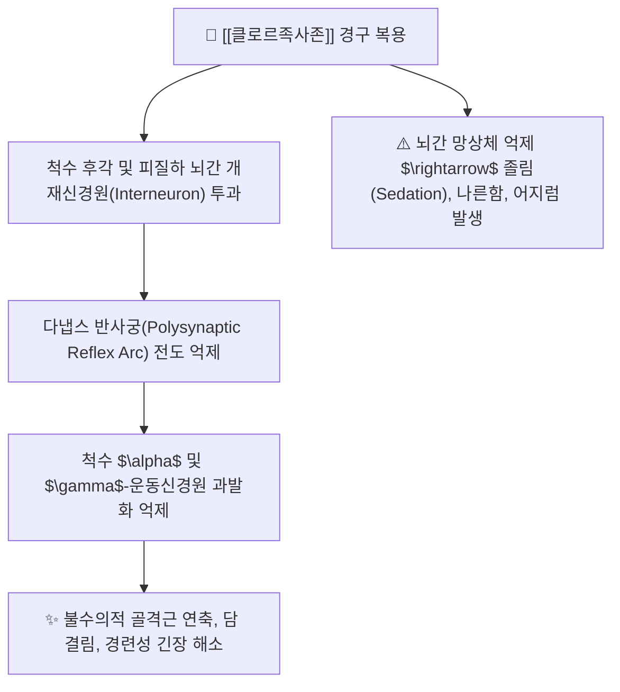

---
aliases:
  - Chlorzoxazone
  - 클로르족사존
  - 파라존
  - 리렉스
  - 파라폰
tags:
  - 약리/양방약
  - 근이완제
  - 중추성근이완제
  - 일반의약품
  - 복합제주성분
---

# 💊 [[클로르족사존]] (Chlorzoxazone, 파라존 / 리렉스, M03BB03)

> **핵심 3줄 요약 (Key Summary)**:
> - 🧪 약물 분류 & 표적: 벤족사졸(Benzoxazole) 유도체 계열의 **중추성 골격근이완제**, 척수 및 피질하(Subcortical) 뇌 영역의 다냅스 반사궁(Polysynaptic Reflex Arc) 억제.
> - 🎯 주요 적응증 & 원내외 처방 패턴: **급성 근육 연축, 담 결림, 요추 염좌, 경견완증후군, 근막통증**, 약국 일반의약품 및 아세트아미노펜 복합제([[근이완복합제]] - 게보린릴랙스, 렉스펜)의 핵심 성분.
> - 🔬 분자약리 기전 & 약동학(PK/PD): 척수 개재뉴런을 진정시켜 골격근 긴장도를 낮추며, 간 CYP2E1 효소에 의해 6-하이드록시클로르족사존으로 대사 후 신장으로 배설.
> - ⚠️ 블랙박스 경고 & 주요 부작용: 중추 신경 진정에 따른 졸림(Somnolence), 어지럼, 간대사 부하에 따른 간독성(드물게 황달) 및 음주 병용 시 중추 억제 급증(금주 필수).

---

## 📌 목차
1. [기본 약물 정보 & 시판 제품·알약 식별 (Pill Identification)](#1-기본-약물-정보--시판-제품알약-식별-pill-identification)
2. [분자약리학적 작용 기전 (MOA) & 화학 구조](#2-분자약리학적-작용-기전-moa--화학-구조)
3. [약동학적 특성 (ADME: 흡수·분포·대사·배설)](#3-약동학적-특성-adme-흡수분포대사배설)
4. [진료과별 다빈도 처방 패턴 & 임상 적응증 (Sweet Spot vs 금기)](#4-진료과별-다빈도-처방-패턴--임상-적응증-sweet-spot-vs-금기)
5. [약물 상호작용 & 병용 금기 매트릭스](#5-약물-상호작용--병용-금기-매트릭스)
6. [부작용·독성 발현 기전 & 응급 해독 프로토콜](#6-부작용독성-발현-기전--응급-해독-프로토콜)
7. [💡 사용자 진료실 핵심 필기 & 한의 임상 연계·테이퍼링 팁 (원문 보존)](#7--사용자-진료실-핵심-필기--한의-임상-연계테이퍼링-팁-원문-보존)
8. [출처 및 학술 참고 문헌 (References)](#8-출처-및-학술-참고-문헌-references)

---

## 1. 기본 약물 정보 & 시판 제품·알약 식별 (Pill Identification)

| 항목 | 상세 정보 |
| :--- | :--- |
| **일반명 (Generic Name)** | [[클로르족사존]] (Chlorzoxazone, USAN/INN) |
| **약효 분류 (Class)** | 벤족사졸계 중추성 골격근이완제 (Centrally acting muscle relaxant, Benzoxazole derivative) |
| **ATC 코드** | M03BB03 (Oxazol, thiazine, and triazine derivatives) / 122 골격근이완제 |
| **약국 시판 제품 (OTC 일반약)** | • **단일제 (200mg)**: 파라존정(200mg), 리렉스정, 클로르족사존정 • **진통근이완 복합제 (OTC 다빈도)**: **게보린릴랙스정** (클로르족사존 200mg + [[아세트아미노펜]] 300mg), **렉스펜정**, 담엔싹정, 펜싹정 |
| **병원 처방 의약품 (ETC 전문약)** | 파라폰정, 클로르족사존정 200mg |
| **상용 용법·용량** | • **단일제 (200mg)**: 성인 1회 200~400mg, 1일 3~4회 식후 복용 (1일 최대 750mg tid까지 가능) • **복합제 (게보린릴랙스 등)**: 성인 1회 2정, 1일 4회까지 공복을 피하여 복용 |

### 1.1 대표 시판 제품 및 함유 복합제 매핑 (Brand Identification & Combinations)

| 구분 | 대표 제품명 / 브랜드 | 함유 성분 및 1회당 함량 | 제형 및 특징 | 주요 적응증 및 복약 지도 핵심 |
| :--- | :--- | :--- | :--- | :--- |
| **약국 1차 복합제 (OTC)** | [[게보린릴랙스]], 렉스펜, 담엔싹 | [[클로르족사존]] (200mg) + [[아세트아미노펜]] (300mg) | 정제 | 급성 담 결림, 요추 염좌, 근육통 신속 완화 |
| **단일제 (OTC/ETC)** | 파라존정, 리렉스정 | [[클로르족사존]] 단일 (200mg) | 백색 원형 정제 | 단독 근경련 완화, 졸림 유발 가능 복약 지도 |

![[클로르족사존_패키지_박스.jpg|400]]
> [그림 1: 약국에서 급성 근육 뭉침 및 담 결림에 1차로 구입·복용하는 클로르족사존 복합 제제 패키지 외형]

![[클로르족사존_블리스터_알약.jpg|400]]
> [그림 2: 클로르족사존 200mg 정제 알약 성상 및 PTP 블리스터 포장]

---

## 2. 분자약리학적 작용 기전 (MOA) & 화학 구조

![[클로르족사존_화학구조.png|300]]
> [그림 3: 클로르족사존의 2D 평면 화학 분자 구조식 (5-chloro-3H-1,3-benzoxazol-2-one, 분자량 169.56 g/mol, PubChem CID 2733)]

### 1) 척수 개재뉴런 억제를 통한 반사궁 차단
* 클로르족사존은 신경근 접합부(NMJ)나 근육 자체에 직접 작용하지 않고, **척수와 피질하 뇌 영역의 개재신경원(Interneuron)을 억제**합니다.
* 유해 자극에 의해 촉발되는 다냅스 반사 경로를 차단하여 감각 신경 흥분이 운동 신경의 지속적인 근수축으로 이어지는 경로를 끊어줍니다.

### 2) 아세트아미노펜과의 복합 시너지
* 근육 손상 시 발생하는 통증 매개체는 [[아세트아미노펜]]이 중추성으로 차단하고, 2차적으로 유발된 근육 뭉침은 클로르족사존이 차단하여 **'진통 + 근이완'의 상호 보완 시너지**를 발휘합니다.

---

## 3. 약동학적 특성 (ADME: 흡수·분포·대사·배설)

| 약동학 파라미터 | 수치 및 임상적 의미 |
| :--- | :--- |
| **생체이용률 (Bioavailability, F)** | 경구 투여 시 위장관에서 신속하고 완전하게 흡수 |
| **최고혈중농도 도달시간 (Tmax)** | **약 1.0 ~ 2.0 시간** (복용 30분 내 근이완 작용 시작) |
| **간 대사 효소 (Metabolism)** | 간 마이크로솜 **CYP2E1** 효소에 의해 활성 대사체인 6-하이드록시클로르족사존으로 대사 (CYP2E1 활성 프로브 약물로 활용) |
| **소실 반감기 (Elimination t1/2)** | **약 1.0 ~ 1.5 시간** (짧은 반감기로 1일 3~4회 복용 필요) |
| **주요 배설 경로 (Excretion)** | 대부분 글루쿠론산 포합체 형태로 신장 소변 배설 (투여 24시간 내 완전 배설) |

---

## 4. 진료과별 다빈도 처방 패턴 & 임상 적응증 (Sweet Spot vs 금기)

### 1) 주요 진료과별 처방 패턴
* **약국 1차 상담 / 일반의약품**:
  * "목이 안 돌아가요", "자고 일어났더니 담이 결렸어요" 환자에게 게보린릴랙스 등 복합제 1차 추천.
* **정형외과 / 재활의학과**:
  * 급성 요추 염좌, 낙상 후 근육 경직에 단일제 처방.

### 2) 최적 적응증 (Sweet Spot) vs 신중 투여 및 금기
* **[✅ 최적 적응증 (Sweet Spot)]**:
  * **급성 경추 염좌(낙침, 落枕) 및 흉배부 능형근 담 결림**.
* **[⚠️ 신중 투여 및 금기 (Caution / Contraindication)]**:
  * **간장애 환자 금기**: CYP2E1 대사 부담 및 드물게 발생하는 전격성 간독성 위험.
  * **운전자 및 위험 기계 조작자 복용 주의**: 졸림 및 집중력 저하.
  * **음주자 병용 절대 금기**: CYP2E1 중복 유도 및 알코올 중추 억제 시너지.

---

## 5. 약물 상호작용 & 병용 금기 매트릭스

| 병용 약물 / 물질 | 상호작용 기전 | 임상적 위험 및 결과 | 처방 및 티칭 가이드 |
| :--- | :--- | :--- | :--- |
| 알코올 (술) | CYP2E1 효소 공유 + 중추 진정 중첩 | **급성 간독성 위험 급증 및 혼미/호흡 억제** | **복용 중 절대 금주** |
| 중추신경 억제제 (수면제, 항히스타민제) | 중추 억제 시너지 | 과도한 졸림 및 보행 실조 | 병용 시 용량 조절 및 낙상 주의 |
| 근이완 한약 ([[갈근탕]], [[작약감초탕]]) | 근막 혈류 촉진 및 칼슘 채널 조절 | 근긴장 신속 완화 및 양약 조기 단약 | **양약 복용 1시간 후 한약 복용** |

---

## 6. 부작용·독성 발현 기전 & 응급 해독 프로토콜

* **핵심 부작용**:
  1. **중추계**: 졸림(가장 흔함), 어지럼, 두통, 권태감.
  2. **소화기계**: 속쓰림, 구역, 복통.
  3. **소변 색조 변화**: 대사산물로 인해 소변 색깔이 주황색 또는 보라색으로 변할 수 있으나 무해함.
* **간독성 경고**:
  * 식욕부진, 황달, 우상복부 통증 발생 시 즉시 투약 중단 및 LFT 혈액검사 시행.

---

## 7. 💡 사용자 진료실 핵심 필기 & 한의 임상 연계·테이퍼링 팁 (원문 보존)

* **진료실 실전 문진 체크리스트 (3대 핵심 질문)**:
  1. **"약국에서 사신 담 결림약(게보린릴랙스, 렉스펜)을 드셨나요?"**:
     * 환자가 이미 아세트아미노펜 복합제를 복용 중인지 확인하여 타이레놀과의 중복 투여 방지.
  2. **"약을 드시고 졸리거나 나른하지 않으셨나요?"**:
     * 졸림 부작용을 확인하고 낮 시간 운전 시 주의 지도.
  3. **"평소 술을 자주 드시나요?"**:
     * CYP2E1 간독성 예방을 위해 금주 지도.

* **한의 치료(침·약침·한약) 연계 및 양약 테이퍼링(감량) 전략**:
  1. **급성 낙침(落枕) 및 흉협통 통합 치료**:
     * 후계, 신맥, 견정 혈자리 침치료 및 습식 부항 사혈, 봉약침을 시술하여 근막 발통점(TP)을 즉각 해소.
  2. **복합제 조기 단약 프로토콜**:
     * [[갈근탕]], [[작약감초탕]]을 처방하여 근방추 긴장을 완화하면서, 클로르족사존 복용을 1~2일 내로 단기 종료 유도.

---

## 8. 출처 및 학술 참고 문헌 (References)

1. **식품의약품안전처 (MFDS)**. 의약품 품목허가사항: 클로르족사존 단일제 및 복합제 (2023).
2. **Conney, A. H. & Burns, J. J. (1960)**. *Metabolism of chlorzoxazone in man and animal species*. **Journal of Pharmacology and Experimental Therapeutics**, 128(4), 340-343.
   - **[연구 요약]**: 클로르족사존의 간 마이크로솜 CYP2E1 대사 및 6-하이드록시 대사체 배설 역학 최초 규명.
3. **Lucas, D. et al. (1993)**. *Chlorzoxazone, a selective probe for phenotyping cytochrome P4502E1 in humans*. **Pharmacogenetics**, 3(2), 90-97.
   - **[연구 요약]**: 클로르족사존의 CYP2E1 특이적 대사 경로 및 간기능 모니터링 가이드라인.
