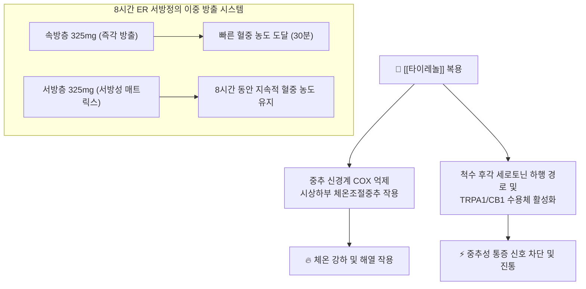

---
aliases:
  - 타이레놀
  - Tylenol
  - 타이레놀정
  - 타이레놀500mg
  - 타이레놀8시간이알서방정
  - 타이레놀ER
  - 타이레놀콜드
  - 어린이타이레놀
tags:
  - 약리/양방약
  - 일반의약품
  - OTC
  - 해열진통제
  - 브랜드약품
---

# 💊 [[타이레놀]] (Tylenol, 한국존슨앤드존슨 / Kenvue, 해열진통 대표 브랜드)

> **핵심 3줄 요약 (Key Summary)**:
> 🧪 주성분 배합: [[아세트아미노펜]](Acetaminophen / Paracetamol)을 단일 주성분으로 하거나 보조 성분을 배합한 글로벌 해열진통제 브랜드.
> 📍 제형별 약리 기전: 속방형(500mg, 신속한 중추 진통) 및 이중 서방형(8시간 ER 650mg, 속방층 325mg + 서방층 325mg의 8시간 지속 진통).
> 🎯 임상 적응증: 두통, 치통, 생리통, 만성 관절통, 근육통, 발열 시 1차 선택 해열진통제.
> ⚠️ 특정 성분 금기: 1일 최대 4,000mg 초과 금지, 매일 3잔 이상 정기 음주자 간독성 치명 위험, 다른 아세트아미노펜 함유 감기약·진통제와의 중복 복용 금기.

---

## 1. 복합 구성 성분 및 제형별 함량 (Active Ingredients & Formulations)

![[타이레놀_한국형_패키지.jpg|350]]
> [그림 1] [[타이레놀]] 500mg의 한국형 시판 패키지 외형 및 브랜드 디자인

![[타이레놀_블리스터_알약.jpg|350]]
> [그림 2] [[타이레놀]] 500mg 정제의 블리스터 포장 및 식별 각인 성상

![[타이레놀_패키지_박스.jpg|350]]
> [그림 3] [[타이레놀]] 글로벌 엑스트라 스트렝스(Extra Strength) 패키지 박스

![[아세트아미노펜_화학구조식.png|280]]
> [그림 4] 타이레놀의 핵심 약리 성분인 [[아세트아미노펜]](Acetaminophen)의 2D 화학 분자 구조식

### 1.1 타이레놀 대표 제품군 1정당 성분 구성표

| 제품명 (한글/영문) | 1정/포당 주성분 함량 | 제형 특성 | 주된 약리 작용 및 방출 특성 |
| :--- | :--- | :--- | :--- |
| [[타이레놀]]정 500mg | [[아세트아미노펜]] 500mg | 속방정 (Rapid Release) | 위장관 내 신속 붕해 및 흡수, 30분 내 빠른 해열·진통 효과 |
| [[타이레놀]] 8시간 이알 서방정 (ER 650mg) | [[아세트아미노펜]] 650mg | 이중 방출 서방정 (Dual Release) | 속방층(325mg) 신속 발현 + 서방층(325mg) 서서히 용출되어 8시간 지속 |
| [[우먼스타이레놀]]정 | [[아세트아미노펜]] 500mg + [[파마브롬]] 25mg | 복합 속방정 | 이뇨 작용을 통한 부종 및 월경 전 팽만감 완화 + 중추 진통 |
| [[타이레놀]] 콜드-에스정 | [[아세트아미노펜]] 325mg + [[슈도에페드린]] 30mg + [[덱스트로메토르판]] 15mg + [[클로르페니라민]] 2mg | 종합감기 복합정 | 발열, 두통, 비충혈, 기침, 콧물을 동시에 제어하는 다성분 복합 |

---

## 2. 복합 상승 약리 기전 (Combination Mechanism & Synergy)

* **중추 선택적 해열진통 기전**:
  * 말초의 위점막 보호 프로스타글란딘을 억제하지 않아 NSAIDs 대비 위장관 궤양 및 출혈 위험이 매우 낮음.
* **이중 서방 기술 (Dual-layer Extended Release Technology)**:
  * 타이레놀 8시간 ER 서방정은 정제의 절반이 즉시 녹아 통증을 초기에 잡고, 나머지 절반이 매트릭스 기질에서 서서히 방출되어 야간 수면 중 통증 재발을 억제합니다.

---

## 3. 타이레놀 브랜드 패밀리 라인업 비교 (Brand Lineup Analysis)

| 제품 라인업명 | 주성분 및 제형 특성 | 차별화 적응증 | 임상 복약 지도 핵심 |
| :--- | :--- | :--- | :--- |
| **타이레놀정 500mg** | [[아세트아미노펜]] 500mg (속방정) | 급성 두통, 치통, 발열, 인후통 | 1회 1~2정, 1일 3~4회 (4~6시간 간격, 1일 최대 8정) |
| **타이레놀 8시간 ER 서방정** | [[아세트아미노펜]] 650mg (이중 서방정) | 만성 근육통, 관절통, 요통, 오십견 | 8시간 간격 2정씩 복용, **절대 쪼개거나 씹어먹지 말 것** |
| **우먼스 타이레놀정** | [[아세트아미노펜]] 500mg + [[파마브롬]] 25mg (속방정) | 원발성 생리통, 유방통, 손발 부종 | 무카페인 생리통약, 생리 시작 전 부종 발생 시부터 복용 |
| **타이레놀 콜드-에스정** | 아세트아미노펜 + 슈도에페드린 + 진해거담제 | 오한, 발열 동반 복합 초기 감기 | 혈압 상승 및 졸림 유발 주의, 고혈압 환자 주의 |
| **어린이용 타이레놀 현탁액** | [[아세트아미노펜]] 32mg/mL (액상 시럽) | 소아 급성 발열 및 예방접종 후 발열 | 무색소·무아스피린, 아이 몸무게(체중)에 맞춰 정량 계량 |

---

## 4. 복합제 특이 위험성 및 특정 성분 금기 (Black Box & Red Flags)

### 4.1 간독성 및 1일 최대 허용 용량 경고
* **1일 최대 4,000mg 절대 초과 금기**: 4,000mg 초과 복용 시 간세포 내 글루타치온이 고갈되어 독성 대사체인 NAPQI에 의한 급성 간괴사 및 간부전 유발.
* **음주자 간독성 위험**: 매일 3잔 이상 정기적으로 음주하는 환자가 타이레놀을 복용하면 CYP2E1 효소 유도로 NAPQI 생성이 급증하여 치명적 간 손상 발생.

### 4.2 중복 복용에 따른 과다 복용 방지
* **종합감기약·복합진통제 중복 금지**: 판피린, 판콜, 게보린, 펜잘, 테라플루 등 대부분의 OTC 제제에 [[아세트아미노펜]]이 중복 배합되어 있으므로 성분표 전수 확인 필수.

---

## 5. 한의학적 복합 처방 배오 비교 및 테이퍼링 프로토콜 (Integrative Medicine)

### 5.1 한방 해열·진통 처방과의 기전 연계

타이레놀의 중추성 해열진통 및 근육통 완화 작용은 한의학의 **풍열 감모 및 근골격 통증 처방**과 병용 치료 및 감량 연계가 가능합니다.

| 양방 제제 특성 | 한의 대응 본초/처방 | 한의학적 배오 역할 및 기전 연계 |
| :--- | :--- | :--- |
| **타이레놀 500mg** (속효 해열·진통) | [[갈근]], [[시호]], [[연교]] / [[갈근탕]], [[구미강활탕]] | 풍한·풍열을 발산하여 두통과 발열을 신속 해열 |
| **타이레놀 8시간 ER** (지속 근육통 완화) | [[갈근]], [[작약]], [[감초]] / [[작약감초탕]] | 근막 긴장을 이완시키고 지속적인 경련성 통증 완화 |
| **우먼스 타이레놀** (부종 동반 생리통) | [[복령]], [[택사]], [[당귀]] / [[당귀작약산]] | 수습 정체를 소변으로 배출하고 어혈성 복통을 온경지통 |

### 5.2 진료실 실전 문진 및 양약 감량(테이퍼링) 가이드
1. **서방정 복용법 확인**: 관절염이나 만성 요통 환자가 타이레놀 ER을 복용할 때 반으로 쪼개서 먹지 않는지 반드시 확인.
2. **간 기능 취약군 체크**: 지방간, 만성 간염, 정기 음주 환자는 타이레놀 대신 침·뜸·한약 치료 우선 적용.
3. **만성 통증 테이퍼링**: 만성 근골격 통증 환자에게 약침 치료 및 [[독활기생탕]], [[오약순기산]]을 투여하며 타이레놀 복용량을 주 1~2회로 점진 감량.

---

## 6. 출처 및 학술 참고 문헌 (References)

* 한국존슨앤드존슨/켄뷰 타이레놀 공식 의약품 정보 및 제품 설명서.
* 식품의약품안전처 의약품안전나라 - 아세트아미노펜 단일제 및 서방제제 허가사항.
* Larson AM, et al. Acetaminophen-induced acute liver failure: results of a United States multicenter, prospective study. *Hepatology*. 2005;42(6):1364-1372.
  * `[연구 요약]` 아세트아미노펜 과다 복용 및 복합제 중복 투여가 급성 간부전의 주요 원인임을 입증하고 최대 4g/day 용량 준수의 중요성 강조.
