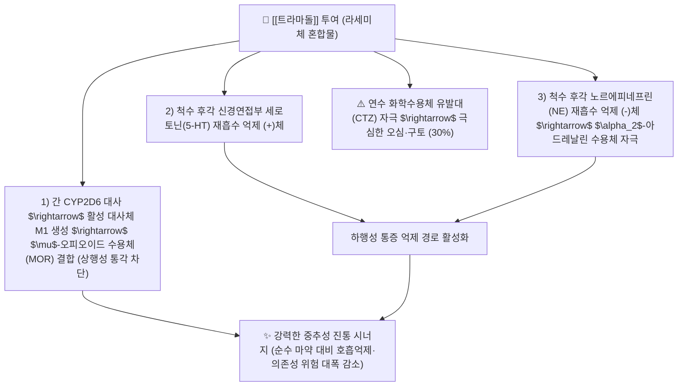

---
aliases:
  - Tramadol
  - 트리돌
  - 트라마돌염산염
  - 지트람
  - Tridol
  - TramadolHCl
tags:
  - 약리/양방약
  - 중추성진통제
  - 오피오이드
  - 전문의약품
  - 마약성유사제
---

# 💊 [[트라마돌]] (Tramadol, 트리돌 / Tridol, N02AX02)

> **핵심 3줄 요약 (Key Summary)**:
> - 🧪 약물 분류 & 표적: 합성 4-페닐-피페리딘 유사 구조의 **비마약성 중추성 오피오이드 진통제**, $\mu$-오피오이드 수용체(MOR) 부분 작용 및 세로토닌/노르에피네프린 재흡수 억제(SNRI 작용)의 이중 기전.
> - 🎯 주요 적응증 & 원내외 처방 패턴: NSAIDs로 조절되지 않는 중등도~중증의 급만성 통증(수술 후 통증, 암성 통증, 만성 골관절염, 척추관 협착증, 디스크 요통), **아세트아미노펜 복합제([[울트라셋]])로 다빈도 처방**.
> - 🔬 분자약리 기전 & 약동학(PK/PD): 경구 생체이용률 70~75%, 간내 CYP2D6 효소에 의해 활성 대사체인 **M1(O-데스메틸트라마돌)**로 대사되며 M1의 MOR 친화력은 모약물 대비 300배 강력.
> - ⚠️ 블랙박스 경고 & 주요 부작용: 연수 구토 중추 자극으로 인한 오심·구토(초기 30%), 어지럼, 변비, 고령자 섬망, SSRI/SNRI 항우울제 병용 시 치명적 **세로토닌 증후군(Serotonin Syndrome)** 위험.

---

## 📌 목차
1. [약물 기본 정보 및 시판 제품 (Brand Identification)](#1-약물-기본-정보-및-시판-제품-brand-identification)
2. [분자약리학적 작용 기전 (MOA) & 화학 구조](#2-분자약리학적-작용-기전-moa--화학-구조)
3. [약동학적 특성 (ADME: 흡수·분포·대사·배설)](#3-약동학적-특성-adme-흡수분포대사배설)
4. [진료과별 다빈도 처방 패턴 & 임상 적응증 (Sweet Spot vs 금기)](#4-진료과별-다빈도-처방-패턴--임상-적응증-sweet-spot-vs-금기)
5. [약물 상호작용 & 병용 금기 매트릭스](#5-약물-상호작용--병용-금기-매트릭스)
6. [부작용·독성 발현 기전 & 응급 해독 프로토콜](#6-부작용독성-발현-기전--응급-해독-프로토콜)
7. [💡 사용자 진료실 핵심 필기 & 한의 임상 연계·테이퍼링 팁 (원문 보존)](#7--사용자-진료실-핵심-필기--한의-임상-연계테이퍼링-팁-원문-보존)
8. [출처 및 학술 참고 문헌 (References)](#8-출처-및-학술-참고-문헌-references)

---

## 1. 약물 기본 정보 및 시판 제품 (Brand Identification)

> [!abstract]+ 🧪 3D 약리 분자 구조 (Interactive 3D Viewer)
> <iframe src="https://molecule-viewer-rho.vercel.app/?cid=33741" style="width: 100%; height: 600px; border: none; border-radius: 12px; box-shadow: 0 4px 20px rgba(0,0,0,0.15);" allowfullscreen></iframe>

| 항목 | 상세 정보 |
| :--- | :--- |
| **일반명 (Generic Name)** | [[트라마돌]] (Tramadol Hydrochloride, INN/USAN) |
| **약효 분류 (Class)** | 중추성 오피오이드 유사 진통제 (Centrally acting atypical opioid analgesic) |
| **ATC 코드** | N02AX02 (Other opioids) / 114 해열·진통·소염제 (전문의약품) |
| **약국 시판 제품 (OTC 일반약)** | 전문의약품(ETC)으로 처방전 필수 (일반약 없음) |
| **병원 처방 의약품 (ETC 전문약)** | • **단일제 (캡슐/서방정)**: **트리돌캡슐(50mg, 유한양행 오리지널)**, 지트람XL서방정(100mg, 200mg), 트라몰정 • **처방 복합제 (AAP 복합)**: **울트라셋정** (트라마돌 37.5mg + [[아세트아미노펜]] 325mg), **울트라셋이알서방정** (트라마돌 75mg + AAP 650mg), 파라마셋정 |
| **상용 용법·용량** | • **단일 속방캡슐 (50mg)**: 1회 50mg, 4~6시간 간격 복용 (1일 최대 400mg 이하) • **울트라셋 복합정**: 1회 1~2정, 4~6시간 간격 (1일 최대 8정 이하) • **울트라셋ER 서방정**: 1회 1~2정, 12시간마다 (1일 최대 4정 이하) |

### 1.1 대표 시판 제품 및 함유 복합제 매핑 (Brand Identification & Combinations)

| 구분 | 대표 제품명 / 브랜드 | 함유 성분 및 1회당 함량 | 제형 및 특징 | 주요 적응증 및 복약 지도 핵심 |
| :--- | :--- | :--- | :--- | :--- |
| **오리지널 단일제 (ETC)** | [[트리돌]] (유한양행) | 트라마돌염산염 (50mg) | 백색/담황색 경질캡슐 | 중등도 이상 급만성 통증, 초기 오심·어지럼 모니터링 |
| **처방 1위 복합제 (ETC)** | [[울트라셋]] (한국얀센) | 트라마돌 (37.5mg) + [[아세트아미노펜]] (325mg) | 황색 타원형 필름코팅정 | 정형외과/통증의학과 만성 요통·관절통 표준 처방 |
| **12시간 서방 복합제 (ETC)** | 울트라셋이알서방정 | 트라마돌 (75mg) + [[아세트아미노펜]] (650mg) | 이중서방정 | 야간 통증 조절 및 복약 편의성 개선 |

![[트라마돌_패키지_박스.jpg|400]]
> [그림 1: 통증의학과 및 정형외과에서 중등도 이상 통증에 널리 처방되는 트라마돌 단일 및 복합제 포장 패키지]

![[트라마돌_캡슐_알약.jpg|400]]
> [그림 2: 트라마돌 50mg 경질캡슐 및 복합제 정제 알약 성상]

---

## 2. 분자약리학적 작용 기전 (MOA) & 화학 구조

![[트라마돌_화학구조.png|300]]
> [그림 3: 트라마돌의 2D 평면 화학 분자 구조식 ((1R,2R)-rel-2-[(dimethylamino)methyl]-1-(3-methoxyphenyl)cyclohexan-1-ol, 분자량 263.38 g/mol, PubChem CID 33741)]

### 1) 이중 진통 기전 (Dual Mechanism of Action)
* **오피오이드 경로**: 트라마돌 자체는 $\mu$-수용체 친화력이 낮으나, 간에서 CYP2D6에 의해 대사된 **M1(O-desmethyltramadol)** 대사체가 MOR에 300배 강력하게 결합하여 척수 및 시상하부의 통증 상행 전달을 차단합니다.
* **모노아민 경로 (SNRI 작용)**: (+)트라마돌은 세로토닌 재흡수를 억제하고, (-)트라마돌은 노르에피네프린 재흡수를 억제하여 **뇌간에서 척수 후각으로 내려오는 내인성 하행 통증 억제 경로를 강력하게 촉진**합니다.

### 2) 순수 마약성 진통제(모르핀 등) 대비 장점
* 오피오이드 수용체 활성화와 모노아민 억제 경로가 상호 보완하므로, **순수 오피오이드 대비 1/10 수준의 적은 용량으로 동등한 진통 효능**을 내며, 치명적 호흡 억제나 신체적 탐닉·남용 위험이 현저히 적습니다.

---

## 3. 약동학적 특성 (ADME: 흡수·분포·대사·배설)

| 약동학 파라미터 | 수치 및 임상적 의미 |
| :--- | :--- |
| **생체이용률 (Bioavailability, F)** | 1회 경구 투여 시 70~75%, 반복 투여 시 90%로 증가 (초회통과효과 감소) |
| **최고혈중농도 도달시간 (Tmax)** | 속방형 약 1.5 ~ 2시간, 활성대사체 M1 약 3시간, **서방정 약 4.5 ~ 5시간** |
| **혈장 단백결합률 (Protein Binding)** | 약 20% (매우 낮아 중추신경계 침투율 우수) |
| **간 대사 효소 (Metabolism)** | **CYP2D6**에 의해 활성 M1 대사체로 O-탈메틸화, CYP3A4에 의해 비활성 N-탈메틸화 |
| **소실 반감기 (Elimination t1/2)** | 트라마돌 약 6.0시간, **활성 M1 대사체 약 7.5시간** |
| **주요 배설 경로 (Excretion)** | 투여량의 약 90%가 신장 소변으로 배설 (신부전 환자 투여 간격 연장 필수) |

---

## 4. 진료과별 다빈도 처방 패턴 & 임상 적응증 (Sweet Spot vs 금기)

### 1) 주요 진료과별 처방 패턴
* **정형외과 / 신경외과 / 마취통증의학과**:
  * NSAIDs에 반응하지 않는 급만성 척추관 협착증, 디스크 방사통, 무릎 퇴행성 관절염에 **울트라셋정(트라마돌+AAP)을 1차 진통제로 처방**.
* **외과 / 응급의학과**:
  * 복부 수술 후 통증, 외상성 골절 통증에 주사제 및 경구제 투여.

### 2) 최적 적응증 (Sweet Spot) vs 신중 투여 및 금기
* **[✅ 최적 적응증 (Sweet Spot)]**:
  * **NSAID 복용이 불가능한 소화성 궤양·신부전 환자의 중등도 통증 조절**.
  * **신경병증성 통증과 침해수용성 통증이 혼재된 만성 요통 환자**.
* **[⚠️ 신중 투여 및 금기 (Caution / Contraindication)]**:
  * **항우울제(SSRI, SNRI, MAOI) 복용자 병용 금기**: 치명적인 세로토닌 증후군 유발.
  * **간질 및 발작(Seizure) 기왕력자 금기**: 발작 역치 감소로 경련 유발.
  * **수유부 및 12세 미만 소아 금기**: CYP2D6 초급속 대사자의 경우 호흡 억제 위험.

---

## 5. 약물 상호작용 & 병용 금기 매트릭스

| 병용 약물 / 물질 | 상호작용 기전 | 임상적 위험 및 결과 | 처방 및 티칭 가이드 |
| :--- | :--- | :--- | :--- |
| 항우울제 ([[둘록세틴]], 렉사프로, 프로작) | 세로토닌 재흡수 억제 시너지 | **세로토닌 증후군** (고열, 근간대경련, 자율신경계 불안정, 섬망) | **병용 절대 주의 (불가피할 시 최저용량 시작)** |
| 중추신경 억제제 (알코올, 벤조디아제핀) | 중추성 진정 및 호흡 억제 상승 | 과도한 졸림, 혼수, 호흡 억제 | 복용 중 음주 절대 금지 |
| CYP2D6 억제제 (파록세틴, 퀴니딘) | 트라마돌 $\rightarrow$ M1 활성화 차단 | 진통 효능 급감 (약효 상실) | 약물 상호작용 검토 후 타 제제로 변경 |
| 담음/현훈 한약 ([[반하백출천마탕]], [[보혈안신탕]]) | 전정신경계 안정 및 오심 완화 | 트라마돌 유발성 어지럼·구역질 방어 | **양약 복용 1시간 후 한약 복용** |

---

## 6. 부작용·독성 발현 기전 & 응급 해독 프로토콜

* **임상 다빈도 부작용**:
  1. **소화기계**: 오심(구역 25~30%), 구토, 심한 변비, 구갈.
  2. **중추신경계**: 어지럼(Dizziness 20%), 졸림, 두통, 고령자 섬망(Delirium).
* **세로토닌 증후군(Serotonin Syndrome) 징후**:
  * 안구 진전, 반사 항진, 진전(떨림), 38도 이상의 고열, 발한.
* **응급 해독제**:
  * **날록손 (Naloxone)**: 호흡 억제 시 오피오이드 수용체 길항제로 투여 (단, 발작 역치는 개선하지 못하므로 주의).

---

## 7. 💡 사용자 진료실 핵심 필기 & 한의 임상 연계·테이퍼링 팁 (원문 보존)

* **진료실 실전 문진 체크리스트 (3대 핵심 질문)**:
  1. **"병원에서 처방받으신 약 중에 '울트라셋'이나 '트리돌'이 들어있나요?"**:
     * 환자가 약 복용 후 '어지럽고 울렁거려서 밥을 못 먹겠다'고 호소하는 경우 트라마돌 부작용임을 즉시 감별.
  2. **"우울증약, 공황장애약(렉사프로, 심발타 등)을 함께 드시고 계신가요?"**:
     * 세로토닌 증후군 발생 위험을 스크리닝.
  3. **"변비가 심해지거나 머리가 멍해지는 느낌이 있으신가요?"**:
     * 고령 환자의 인지기능 저하 및 장운동 억제 확인.

* **한의 치료(침·약침·한약) 연계 및 양약 테이퍼링(감량) 전략**:
  1. **오심·어지럼 부작용 극복 배오**:
     * 울트라셋 복용 초기 적응 장애를 겪는 환자에게 내관, 족삼리 침치료 및 [[반하백출천마탕]], [[오령산]]을 처방하여 소화관 운동을 정상화.
  2. **울트라셋 테이퍼링 프로토콜**:
     * 요추 협착증 및 디스크 방사통 환자에게 신바로약침/봉약침과 [[독활기생탕]]을 집중 투여하여 통증을 제어하면서, 울트라셋 복용을 1일 3회 $\rightarrow$ 1일 1회(취침 전) $\rightarrow$ 격일 복용 $\rightarrow$ 완전 단약으로 성공적 테이퍼링 완수.

---

## 8. 출처 및 학술 참고 문헌 (References)

1. **식품의약품안전처 (MFDS)**. 의약품 품목허가사항 및 안전성 서한: 트라마돌염산염 단일제 및 복합제 (2023).
2. **Grond, S. & Sablotzki, A. (2004)**. *Clinical pharmacology of tramadol*. **Clinical Pharmacokinetics**, 43(13), 879-923.
   - [PubMed (PMID: 15509185)](https://pubmed.ncbi.nlm.nih.gov/15509185/) | [DOI](https://doi.org/10.2165/00003088-200443130-00004)
   - **[연구 요약]**: 트라마돌의 오피오이드 수용체 작용 및 세로토닌/노르에피네프린 재흡수 차단 이중 기전과 CYP2D6 M1 활성 대사체의 임상 약리학 총괄 리뷰.
3. **Raffa, R. B. et al. (1992)**. *Opioid and nonopioid components independently contribute to the mechanism of action of tramadol, an 'atypical' opioid analgesic*. **Journal of Pharmacology and Experimental Therapeutics**, 260(1), 275-285.
   - [PubMed (PMID: 1309873)](https://pubmed.ncbi.nlm.nih.gov/1309873/)
   - **[연구 요약]**: 트라마돌의 오피오이드 및 비오피오이드 경로가 상호보완적으로 작용하여 진통 시너지를 형성함을 입증한 원저.
4. **Boyer, E. W. & Shannon, M. (2005)**. *The serotonin syndrome*. **New England Journal of Medicine**, 352(11), 1112-1120.
   - [PubMed (PMID: 15784664)](https://pubmed.ncbi.nlm.nih.gov/15784664/) | [DOI](https://doi.org/10.1056/NEJMra041867)
   - **[연구 요약]**: 트라마돌과 SSRI/SNRI 항우울제 병용 시 발생할 수 있는 세로토닌 증후군의 임상 증상 및 치료 가이드라인.
