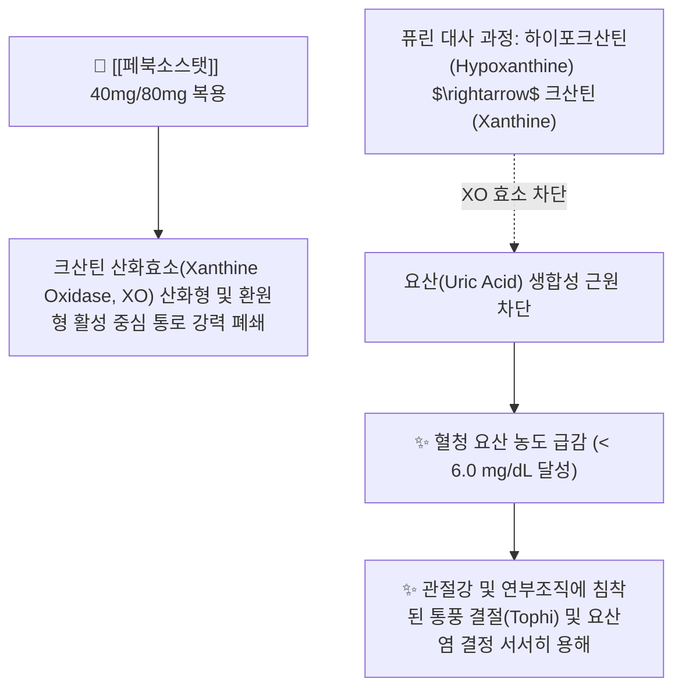

---
aliases:
  - Febuxostat
  - 페브릭
  - 페북소스타트
  - 유로릭
  - Feburic
  - 페브릭정
tags:
  - 약리/양방약
  - 통풍치료제
  - 요산생성억제제
  - 전문의약품
  - 고요산혈증
---

# 💊 [[페북소스탯]] (Febuxostat, 페브릭 / Feburic, M04AA03)

> **핵심 3줄 요약 (Key Summary)**:
> - 🧪 약물 분류 & 표적: 비퓨린계(Non-purine) **선택적 크산틴 산화효소 억제제(Xanthine Oxidase Inhibitor, XOI)**, 크산틴 산화효소(XO)의 산화형 및 환원형 활성 부위에 모두 강력 결합.
> - 🎯 주요 적응증 & 원내외 처방 패턴: **통풍 환자의 만성 고요산혈증 치료 (요산 저하 유지 요법 1차 표준 선택제)**, 신장애 환자에서도 알로푸리놀 대비 안전하게 처방.
> - 🔬 분자약리 기전 & 약동학(PK/PD): 퓨린 대사 다른 효소에 영향 없이 요산 생성을 근본 차단(목표 혈중 요산 < 6.0 mg/dL), 간 대사(글루쿠론산 포합 및 CYP 산화) 및 신장/분변으로 균형 배설.
> - ⚠️ 블랙박스 경고 & 주요 부작용: **급성 통풍 발작 중 새로 투여 시작 금기**(급격한 요산 강하로 발작 악화, [[콜히친]] 예방 병용), 심혈관 질환자 신중 투여 및 간기능 수치 모니터링.

---

## 📌 목차
1. [기본 약물 정보 & 시판 제품·알약 식별 (Pill Identification)](#1-기본-약물-정보--시판-제품알약-식별-pill-identification)
2. [분자약리학적 작용 기전 (MOA) & 화학 구조](#2-분자약리학적-작용-기전-moa--화학-구조)
3. [약동학적 특성 (ADME: 흡수·분포·대사·배설)](#3-약동학적-특성-adme-흡수분포대사배설)
4. [진료과별 다빈도 처방 패턴 & 임상 적응증 (Sweet Spot vs 금기)](#4-진료과별-다빈도-처방-패턴--임상-적응증-sweet-spot-vs-금기)
5. [약물 상호작용 & 병용 금기 매트릭스](#5-약물-상호작용--병용-금기-매트릭스)
6. [부작용·독성 발현 기전 & 응급 해독 프로토콜](#6-부작용독성-발현-기전--응급-해독-프로토콜)
7. [💡 사용자 진료실 핵심 필기 & 한의 임상 연계·테이퍼링 팁 (원문 보존)](#7--사용자-진료실-핵심-필기--한의-임상-연계테이퍼링-팁-원문-보존)
8. [출처 및 학술 참고 문헌 (References)](#8-출처-및-학술-참고-문헌-references)

---

## 1. 기본 약물 정보 & 시판 제품·알약 식별 (Pill Identification)

| 항목 | 상세 정보 |
| :--- | :--- |
| **일반명 (Generic Name)** | [[페북소스탯]] (Febuxostat, INN/USAN) |
| **약효 분류 (Class)** | 비퓨린계 선택적 크산틴 산화효소 억제제 (Selective Xanthine Oxidase Inhibitor) |
| **ATC 코드** | M04AA03 (Preparations inhibiting uric acid production) / 394 통풍치료제 (전문의약품) |
| **약국 시판 제품 (OTC 일반약)** | 전문의약품(ETC)으로 처방전 필수 (일반약 없음) |
| **병원 처방 의약품 (ETC 전문약)** | • **오리지널 단일정**: **페브릭정(Feburic Tab, SK케미칼 오리지널 40mg, 80mg)**, 유로릭정(Uloric) • **제네릭 제제**: 페북소정, 펙소스타정, 페북스정 (40mg, 80mg) |
| **상용 용법·용량** | • **성인 표준 유지요법**: 1일 1회 40mg 또는 80mg 식사와 무관하게 복용 (목표 혈중 요산치 < 6.0 mg/dL 도달까지 유지) |

### 1.1 대표 시판 제품 및 함유 복합제 매핑 (Brand Identification & Combinations)

| 구분 | 대표 제품명 / 브랜드 | 함유 성분 및 1회당 함량 | 제형 및 특징 | 주요 적응증 및 복약 지도 핵심 |
| :--- | :--- | :--- | :--- | :--- |
| **오리지널 단일정 (ETC)** | [[페브릭]] (SK케미칼) | 페북소스탯 단일 (40mg / 80mg) | 담황색 장방형 필름코팅정 | 만성 통풍 고요산혈증 조절 1차약, 1일 1회 복용 |
| **발작 예방 병용요법** | 페브릭 + 콜키신 병용요법 | [[페북소스탯]] (40mg) + [[콜히친]] (0.6mg) | 개별 정제 병용 | 요산 강하 초기 3~6개월간 통증 발작 재발 방어 |

![[페북소스탯_패키지_박스.jpg|400]]
> [그림 1: 만성 통증 및 통풍 클리닉에서 요산 저하 유지요법으로 가장 널리 처방되는 페브릭정 패키지 외형]

![[페북소스탯_블리스터_알약.jpg|400]]
> [그림 2: 페북소스탯 40mg/80mg 정제 알약 성상 및 PTP 블리스터 포장]

---

## 2. 분자약리학적 작용 기전 (MOA) & 화학 구조

![[페북소스탯_화학구조.png|300]]
> [그림 3: 페북소스탯의 2D 평면 화학 분자 구조식 (2-[3-cyano-4-(2-methylpropoxy)phenyl]-4-methyl-1,3-thiazole-5-carboxylic acid, 분자량 316.37 g/mol, PubChem CID 134018)]

### 1) 선택적 크산틴 산화효소(XO) 억제 메커니즘
* 페북소스탯은 퓨린 핵 구조를 가지지 않는 비퓨린계 화합물로, 크산틴 산화효소(XO)의 몰리브덴-프테린 중심 활성 포켓에 매우 단단하게 결합합니다.
* 효소의 산화형 및 환원형 상태 모두에 작용하여 효소 활성을 $K_i < 1\text{ nM}$ 수준으로 강력하게 저해함으로써 **하이포크산틴과 크산틴이 요산으로 전환되는 과정을 완벽히 차단**합니다.

### 2) 1세대 알로푸리놀(Allopurinol) 대비 임상적 장점
* **우수한 요산 강하율**: 알로푸리놀 300mg 대비 페북소스탯 80mg 투여 시 목표 요산 수치(< 6.0 mg/dL) 도달률이 유의미하게 우수합니다.
* **신부전 안전성**: 알로푸리놀과 달리 간에서 주로 대사되므로 경증~중등도 신부전(eGFR 30~89 mL/min) 환자에서도 용량 감량 없이 처방 가능합니다.
* **치명적 피부 부작용 배제**: 알로푸리놀에서 흔한 HLA-B*5801 유전자 관련 스티븐스-존슨 증후군(SJS) 위험이 거의 없습니다.

---

## 3. 약동학적 특성 (ADME: 흡수·분포·대사·배설)

| 약동학 파라미터 | 수치 및 임상적 의미 |
| :--- | :--- |
| **생체이용률 (Bioavailability, F)** | **$\ge$ 84%** (경구 흡수율 매우 우수) |
| **최고혈중농도 도달시간 (Tmax)** | **약 1.0 ~ 1.5 시간** (신속한 혈중 도달) |
| **혈장 단백결합률 (Protein Binding)** | **99.2%** (주로 알부민에 결합) |
| **간 대사 경로 (Metabolism)** | **UGT 효소군(1A1, 1A8, 1A9)에 의한 글루쿠론산 포합** 및 CYP1A2, 2C8, 2C9에 의한 산화 대사 |
| **소실 반감기 (Elimination t1/2)** | **약 5.0 ~ 8.0 시간** (1일 1회 복용으로 24시간 요산 생성 억제) |
| **주요 배설 경로 (Excretion)** | **신장 소변(49%) 및 분변(45%)으로 균형 배설** (신장애 환자 축적 위험 적음) |

---

## 4. 진료과별 다빈도 처방 패턴 & 임상 적응증 (Sweet Spot vs 금기)

### 1) 주요 진료과별 처방 패턴
* **류마티스내과 / 내분비내과 / 신장내과**:
  * 만성 통풍 관절염 환자, 요산 신결석 병력자의 평생 요산 조절 1차 약물.
* **정형외과**:
  * 급성 통풍 발작이 진정된 후 통풍 결절 및 재발 방지를 위해 유지 처방.

### 2) 최적 적응증 (Sweet Spot) vs 신중 투여 및 금기
* **[✅ 최적 적응증 (Sweet Spot)]**:
  * **알로푸리놀에 과민반응이 있거나 신기능이 저하된 만성 통풍 환자**.
  * **통풍 결절(Tophi)이 만져지는 고요산혈증 환자**.
* **[⚠️ 신중 투여 및 금기 (Caution / Contraindication)]**:
  * **급성 통풍 발작 중 새로 투여 시작 절대 금기**: 급격한 요산 강하가 관절강 내 결정을 유리시켜 발작을 극도로 악화시킴 (발작 1~2주 후 시작).
  * **아자티오프린(Azathioprine), 6-머캅토퓨린 복용자 절대 금기**.
  * **허혈성 심장질환 및 울혈성 심부전 환자 신중 투여**.

---

## 5. 약물 상호작용 & 병용 금기 매트릭스

| 병용 약물 / 물질 | 상호작용 기전 | 임상적 위험 및 결과 | 처방 및 티칭 가이드 |
| :--- | :--- | :--- | :--- |
| 아자티오프린 / 6-머캅토퓨린 | 크산틴 산화효소에 의한 대사 차단 | 면역억제제 혈중 농도 급상승 $\rightarrow$ **치명적 골수 억제 독성** | **병용 절대 금기 (Contraindicated)** |
| 테오필린 (기관지확장제) | 테오필린 대사 부분 억제 | 테오필린 혈중 농도 상승 | 병용 시 테오필린 혈중 농도 추적 |
| 통풍 한약 ([[사묘환]], [[당귀점통탕]]) | 체내 습열 배출 및 요산 배설 촉진 | 요산 수치 정상화 시너지 및 신장 보호 | **양약 복용 1시간 후 한약 복용** |

---

## 6. 부작용·독성 발현 기전 & 응급 해독 프로토콜

* **핵심 부작용**:
  1. **통풍 발작 유발(Gout Flare)**: 투약 초기 1~3개월간 혈청 요산이 급감하면서 관절 내 침착된 요산염이 떨어져 나와 발작 유발 ([[콜히친]] 예방 병용 필수).
  2. **간기능 이상**: 간 효소치(AST/ALT) 상승(약 4~6%).
  3. **심혈관계**: 심혈관계 혈전 사건(심근경색 등) 발생 위험 논란 (CARES trial 모니터링).
* **관리 수칙**:
  * 복용 시작 전 및 투약 중 주기적인 간기능 검사(LFT)와 혈청 요산 농도 검사 시행.

---

## 7. 💡 사용자 진료실 핵심 필기 & 한의 임상 연계·테이퍼링 팁 (원문 보존)

* **진료실 실전 문진 체크리스트 (3대 핵심 질문)**:
  1. **"지금 엄지발가락이 아프기 시작했는데 페브릭정을 처음 드시려고 하나요?"**:
     * 급성 발작 중 페브릭을 새로 복용하면 발작이 훨씬 심해지므로, 급성 통증기에는 [[나프록센]]/[[콜히친]]으로 통증을 먼저 잡고 1~2주 뒤부터 복용하도록 강력 지도.
  2. **"약을 드시는 동안 발작 예방약(콜키신이나 소염진통제)을 함께 처방받으셨나요?"**:
     * 요산 강하 초기 발작 방어 요법 이행 확인.
  3. **"최근 피검사에서 요산 수치가 몇으로 나오셨나요?"**:
     * 목표 요산치(6.0 mg/dL 미만) 도달 여부 점검.

* **한의 치료(침·약침·한약) 연계 및 임상 관리 전략**:
  1. **만성 통풍 결절 및 신기능 보호 한의 배오**:
     * [[사묘환]], [[대강활탕]], [[방기황기탕]]을 처방하여 비위의 습열(濕熱)을 맑히고 신장의 요산 배설 기능을 촉진.
  2. **페북소스탯 복용 유지 및 한약 통합 관리**:
     * 페북소스탯은 요산 생성을 억제하고 한약은 요산 배출 및 관절강 미세순환을 촉진하여 통풍 결절을 효과적으로 용해시키고 재발을 방어.

---

## 8. 출처 및 학술 참고 문헌 (References)

1. **식품의약품안전처 (MFDS)**. 의약품 품목허가사항 및 안전성 서한: 페북소스탯 제제 (2023).
2. **Becker, M. A. et al. (2005)**. *Febuxostat compared with allopurinol in patients with hyperuricemia and gout*. **New England Journal of Medicine**, 353(23), 2450-2461.
   - [PubMed (PMID: 16339094)](https://pubmed.ncbi.nlm.nih.gov/16339094/) | [DOI](https://doi.org/10.1056/NEJMoa050373)
   - **[연구 요약]**: 3상 무작위 대조 임상시험에서 알로푸리놀(300mg/일) 대비 페북소스탯(80mg, 120mg/일)의 우수한 혈청 요산 강하 효능 입증.
3. **White, W. B. et al. (2018)**. *Cardiovascular Safety of Febuxostat or Allopurinol in Patients with Gout*. **New England Journal of Medicine**, 378(13), 1200-1210.
   - [PubMed (PMID: 29527974)](https://pubmed.ncbi.nlm.nih.gov/29527974/) | [DOI](https://doi.org/10.1056/NEJMoa1710895)
   - **[연구 요약]**: 6,000명 이상 통풍 환자 대상 CARES 대규모 심혈관 안전성 임상시험 결과 및 통풍 치료 심혈관계 모니터링 가이드라인.
