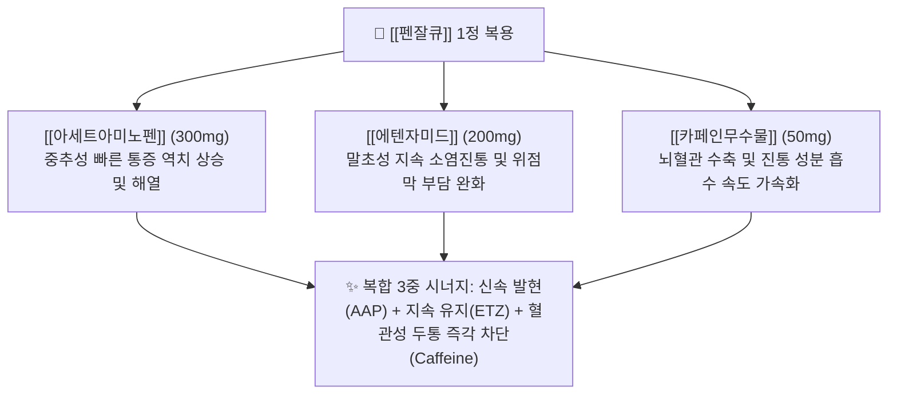

---
aliases:
  - 펜잘
  - 펜잘큐
  - 펜잘큐정
  - Penzal
  - PenzalQ
  - 펜잘레이디
  - 펜잘나이트
tags:
  - 약리/양방약
  - 복합제
  - 일반의약품
  - 복합진통제
  - 해열진통소염제
---

# 💊 [[펜잘큐]] (Penzal Q Tab, 종근당, 다성분 복합 진통제)

> **핵심 3줄 요약 (Key Summary)**:
> 🧪 주성분 배합: [[아세트아미노펜]](300mg) + [[에텐자미드]](200mg, 살리실산계) + [[카페인무수물]](50mg)의 삼중 복합 상승 배합.
> 📍 복합 약리 기전: 유해성 논란이 있던 IPA(이소프로필안티피린)를 배제하고 안전한 살리실산계 [[에텐자미드]]를 배합하여 지속적인 소염진통과 위점막 자극 완화 시너지 달성.
> 🎯 임상 적응증: 급성 두통, 치통, 발열, 신경통, 요통, 월경통, 근육통의 신속한 통증 경감.
> ⚠️ 특정 성분 금기: 카페인 함유로 인한 불면·약물과용두통(MOH) 주의, 에텐자미드 성분으로 인해 15세 미만 수두·인플루엔자 환자(라이 증후군 위험) 복용 금기.

---

## 1. 약물 기본 정보 및 시판 제품 (Brand Identification)

> [!abstract]+ 🧪 3D 약리 분자 구조 (Interactive 3D Viewer)
> <iframe src="https://molecule-viewer-rho.vercel.app/?cid=1983" style="width: 100%; height: 600px; border: none; border-radius: 12px; box-shadow: 0 4px 20px rgba(0,0,0,0.15);" allowfullscreen></iframe>

![[펜잘큐_패키지_박스.jpg|350]]
> [그림 1] [[펜잘큐]]의 대표적인 시판 패키지 외형 및 브랜드 디자인

![[펜잘큐_블리스터_알약.jpg|350]]
> [그림 2] [[펜잘큐]] 정제의 PTP 블리스터 포장 및 식별 성상

![[에텐자미드_화학구조식.png|280]]
> [그림 3] 펜잘큐정의 핵심 지속성 소염진통 성분인 [[에텐자미드]](Ethenzamide)의 2D 화학 분자 구조식

![[카페인무수물_화학구조식.png|280]]
> [그림 4] 혈관 수축 및 진통 흡수 촉진제 역할을 하는 [[카페인무수물]]의 2D 화학 분자 구조식

### 1.1 펜잘큐정 1정당 복합 성분 구성표

| 구성 성분 (한글/영문) | 1정당 함량 | 약효 분류 | 주된 약리 작용 및 복합 시너지 역할 |
| :--- | :--- | :--- | :--- |
| [[아세트아미노펜]] (Acetaminophen) | 300mg | 비마약성 해열진통제 | 중추성 통증 전달 차단, 시상하부 체온 강하 (신속한 두통 완화) |
| [[에텐자미드]] (Ethenzamide) | 200mg | 살리실산계 소염진통제 | 말초 프로스타글란딘 합성 억제, 긴 반감기로 지속성 소염진통 발휘, 위점막 손상 경감 |
| [[카페인무수물]] (Anhydrous Caffeine) | 50mg | 중추신경흥분제 / 혈관수축제 | 뇌혈관 수축으로 두통 완화, 위장관 흡수 촉진 및 진통 역치 상승 |

---

## 2. 복합 상승 약리 기전 (Combination Mechanism & Synergy)

* **신속 발현과 지속 작용의 조화 (Fast Onset & Sustained Relief)**:
  * [[아세트아미노펜]]이 복용 초기 빠른 두통 완화를 유도하고, 상대적으로 체내 지속 시간이 긴 [[에텐자미드]]가 뒤를 이어 진통 시간을 연장합니다.
* **IPA 대체 안전성 프로파일 (Safety Improvement)**:
  * 골수 억제 및 무과립구증 위험이 제기된 피라졸론계 성분을 완전히 배제하고 살리실산아마이드 유도체인 [[에텐자미드]]를 사용하여 조혈계 안전성을 확보했습니다.

---

## 3. 펜잘 브랜드 패밀리 라인업 비교 (Brand Lineup Analysis)

| 제품 라인업명 | 주성분 및 제형 특성 | 차별화 적응증 | 임상 복약 지도 핵심 |
| :--- | :--- | :--- | :--- |
| **펜잘큐정** (오리지널 삼중 복합) | [[아세트아미노펜]] 300mg + [[에텐자미드]] 200mg + [[카페인무수물]] 50mg (백색 장방형 정제) | 급성 두통, 치통, 발열, 신경통 | 15세 미만 수두·독감 환자 금기, 단기 복용 원칙 |
| **펜잘 레이디 연질캡슐** | [[이부프로펜]] 200mg + [[파마브롬]] 25mg (액상 연질캡슐) | 생리통, 하복부 팽만감 및 부종 | 무카페인 생리통 전용제, 식후 즉시 복용 |
| **펜잘 나이트정** | [[아세트아미노펜]] 500mg + [[디펜히드라민]] 25mg (정제) | 통증을 동반한 일시적 불면증 | 수면유도 복합제, 주간 복용 및 운전 금지 |

---

## 4. 복합제 특이 위험성 및 특정 성분 금기 (Black Box & Red Flags)

### 4.1 에텐자미드 및 살리실산 유도체 관련 금기
* **15세 미만 소아·청소년 수두 및 인플루엔자 감염 시 금기**: 살리실산계 약물 복용 시 치명적인 라이 증후군(Reye's syndrome, 급성 뇌증 및 간부전) 발생 위험.
* **아스피린 천식 기왕력자 주의**: 살리실산계 성분에 대한 교차 과민반응으로 기관지 경련 유발 위험.

### 4.2 카페인 유발 약물과용두통(MOH) 및 위장관 주의
* **약물과용두통(Medication Overuse Headache)**: 카페인 및 복합 진통제를 주 3일 이상 지속 복용할 경우 만성 반동성 두통이 발생하므로 **월 10일 이하, 주 2일 이내 복용 원칙** 준수.

---

## 5. 한의학적 복합 처방 배오 비교 및 테이퍼링 프로토콜 (Integrative Medicine)

### 5.1 한방 군신좌사(君臣佐使) 배오 원리와의 비교

펜잘큐의 신속·지속 복합 배합은 한의학의 **풍열 두통 및 담탁 두통 처방 배오** 원리와 일치합니다.

| 양방 복합제 구성 | 한의 대응 본초 | 한의학적 배오 역할 및 기전 연계 |
| :--- | :--- | :--- |
| **중추성 속효 진통** ([[아세트아미노펜]]) | [[천궁]], [[백지]] | 군약(君藥): 두면부 기혈 순환을 통락시키고 풍열 두통 소산 |
| **말초성 지속 소염** ([[에텐자미드]]) | [[갈근]], [[황금]] | 신약(臣藥): 상체 및 항배부 근막 긴장을 완화하고 염증 해소 |
| **혈관 수축·인경 성분** ([[카페인무수물]]) | [[세신]], [[감초]] | 좌사약(佐使藥): 기경팔맥을 개통하고 제반 약성을 두부로 인경(引經) |

### 5.2 진료실 실전 문진 및 양약 감량(테이퍼링) 가이드
1. **복용 패턴 확인**: 환자가 두통 발생 시마다 펜잘을 상습적으로 복용하는지 체크하여 카페인 금단 두통 감별.
2. **단계적 한의 치료 전환**:
   * **1단계**: 펜잘 복용을 통증 발생 시 1정으로 최소화하고 풍지, 태양, 백회, 합곡 혈위 침·약침 시술.
   * **2단계**: [[청상견통탕]](풍열 두통), [[천궁차조산]](풍한 두통), [[반하백출천마탕]](담훈 두통)을 투여하여 양약 완전 테이퍼링 달성.

---

## 6. 출처 및 학술 참고 문헌 (References)

* 종근당 펜잘큐정 공식 의약품 허가사항 및 제품 설명서.
* 식품의약품안전처 의약품안전나라 - 에텐자미드 복합제 허가사항 및 안전성 지침.
* Lipton, R. B. et al. (1998). Efficacy and safety of acetaminophen, aspirin, and caffeine in alleviating migraine headache pain: three double-blind, randomized, placebo-controlled trials. *Archives of Neurology*, 55(2), 210-217.
  * [PubMed (PMID: 9482363)](https://pubmed.ncbi.nlm.nih.gov/9482363/) | [DOI](https://doi.org/10.1001/archneur.55.2.210)
  * `[연구 요약]` 아세트아미노펜, 살리실산계 유도체, 카페인 복합제의 신속한 두통 소산 및 진통 시너지 임상 효능 입증.
* Derry, C. J. et al. (2014). Caffeine as an analgesic adjuvant for acute pain in adults. *Cochrane Database of Systematic Reviews*, (12), CD009281.
  * [PubMed (PMID: 25502052)](https://pubmed.ncbi.nlm.nih.gov/25502052/) | [DOI](https://doi.org/10.1002/14651858.CD009281.pub3)
  * `[연구 요약]` 진통제에 카페인(100mg 이상 또는 50mg 이상) 병용 시 진통 성공률이 5~10% 유의하게 향상됨을 밝힌 코크란 체계적 문헌고찰.
