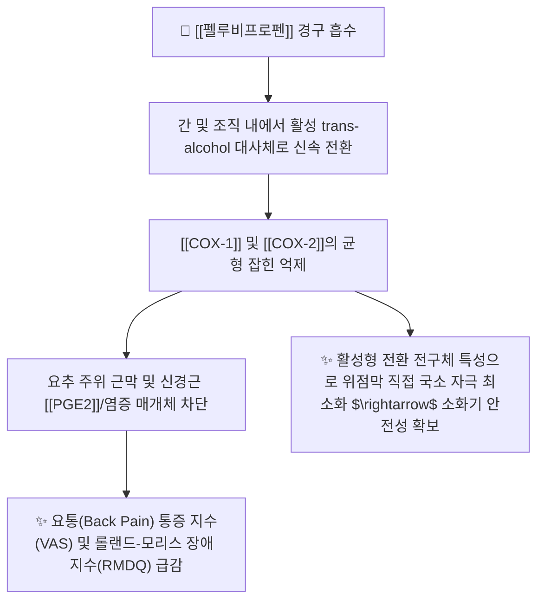

---
aliases:
  - Pelubiprofen
  - 펠루비
  - 펠루비서방정
  - 펠루비정
  - Pelubi
  - 펠루비프로펜트로메타민
tags:
  - 약리/양방약
  - 해열진통소염제
  - NSAIDs
  - 국산신약
  - 요통치료제
---

# 💊 [[펠루비프로펜]] (Pelubiprofen, 펠루비 / Pelubi, M01AE)

> **핵심 3줄 요약 (Key Summary)**:
> - 🧪 약물 분류 & 표적: 대원제약이 개발한 대한민국 12호 신약 NSAID, 프로피온산 유도체 구조의 비선택적 소염진통제, [[COX-1]] 및 [[COX-2]] 균형 억제, 프로스타글란딘([[PGE2]]) 합성 차단.
> - 🎯 주요 적응증 & 원내외 처방 패턴: **급만성 요통(Low Back Pain) 처방 1위**, 골관절염, 류마티스 관절염, 급성 상기도염 해열 (정형외과·신경외과·내과 다빈도 처방).
> - 🔬 분자약리 기전 & 약동학(PK/PD): 체내에서 활성형 trans-alcohol 대사체로 전환되어 작용하며, 기존 NSAIDs 대비 위장관 점막 직접 자극을 최소화하고, 서방정(CR 45mg)은 1일 2회 복용으로 12시간 지속 진통 효과 발휘.
> - ⚠️ 블랙박스 경고 & 주요 부작용: 타 전통적 NSAIDs 대비 위점막 출혈 및 궤양 발생률이 유의하게 낮으나, 소화불량 및 신기능 저하 환자 투여 시 주의.

---

## 📌 목차
1. [기본 약물 정보 & 시판 제품·알약 식별 (Pill Identification)](#1-기본-약물-정보--시판-제품알약-식별-pill-identification)
2. [분자약리학적 작용 기전 (MOA) & 화학 구조](#2-분자약리학적-작용-기전-moa--화학-구조)
3. [약동학적 특성 (ADME: 흡수·분포·대사·배설)](#3-약동학적-특성-adme-흡수분포대사배설)
4. [진료과별 다빈도 처방 패턴 & 임상 적응증 (Sweet Spot vs 금기)](#4-진료과별-다빈도-처방-패턴--임상-적응증-sweet-spot-vs-금기)
5. [약물 상호작용 & 병용 금기 매트릭스](#5-약물-상호작용--병용-금기-매트릭스)
6. [부작용·독성 발현 기전 & 응급 해독 프로토콜](#6-부작용독성-발현-기전--응급-해독-프로토콜)
7. [💡 사용자 진료실 핵심 필기 & 한의 임상 연계·테이퍼링 팁 (원문 보존)](#7--사용자-진료실-핵심-필기--한의-임상-연계테이퍼링-팁-원문-보존)
8. [출처 및 학술 참고 문헌 (References)](#8-출처-및-학술-참고-문헌-references)

---

## 1. 기본 약물 정보 & 시판 제품·알약 식별 (Pill Identification)

| 항목 | 상세 정보 |
| :--- | :--- |
| **일반명 (Generic Name)** | [[펠루비프로펜]] (Pelubiprofen, INN) / 펠루비프로펜트로메타민 |
| **약효 분류 (Class)** | 대한민국 신약 12호 프로피온산계 소염진통제 (Propionic acid derivative NSAID) |
| **식약처 분류** | 114 해열·진통·소염제 (전문의약품 ETC) |
| **약국 시판 제품 (OTC 일반약)** | 전문의약품으로 처방전 필요 (일반약 없음) |
| **병원 처방 의약품 (ETC 전문약)** | • **단일 정제 (속방형 30mg)**: **펠루비정(Pelubi Tab, 대원제약 오리지널)**, 휴비로펜정, 펠루펜정 • **서방정 (CR 45mg)**: **펠루비서방정(Pelubi CR Tab, 1일 2회 복용 제형)**, 펠루비에스정 • **복합제 (위보호 복합)**: 펠루비프로펜 + [[레바미피드]] 복합제 |
| **상용 용법·용량** | • **속방정 (30mg)**: 성인 1회 1정(30mg), 1일 3회 식후 복용 • **서방정 (CR 45mg)**: 성인 1회 1정(45mg), 1일 2회(12시간 간격) 아침·저녁 식후 복용 |

### 1.1 대표 시판 제품 및 함유 복합제 매핑 (Brand Identification & Combinations)

| 구분 | 대표 제품명 / 브랜드 | 함유 성분 및 1회당 함량 | 제형 및 특징 | 주요 적응증 및 복약 지도 핵심 |
| :--- | :--- | :--- | :--- | :--- |
| **오리지널 속방정 (ETC)** | [[펠루비정]] (대원제약) | [[펠루비프로펜]] 단일 (30mg) | 백색 원형 정제 | 골관절염, 급성 상기도염 해열, 1일 3회 식후 복용 |
| **오리지널 서방정 (ETC)** | [[펠루비서방정]] | [[펠루비프로펜]] (45mg 서방형) | 이중층 서방정 | 요통(만성/급성) 특화 처방, 1일 2회 복용으로 야간 요통 조절 |
| **개량 복합제 (ETC)** | 펠루비 복합 개량신약 | [[펠루비프로펜]] + [[레바미피드]] | 정제 | 위장관 출혈 위험군 요통 환자 위점막 보호 |

![[펠루비프로펜_패키지_박스.jpg|400]]
> [그림 1: 척추관절 병의원에서 요통 환자에게 가장 널리 처방되는 대한민국 신약 펠루비서방정 패키지 외형]

![[펠루비프로펜_블리스터_알약.jpg|400]]
> [그림 2: 펠루비 45mg 이중 서방정 알약 성상 및 PTP 블리스터 포장]

---

## 2. 분자약리학적 작용 기전 (MOA) & 화학 구조

![[펠루비프로펜_화학구조.png|300]]
> [그림 3: 펠루비프로펜의 2D 평면 화학 분자 구조식 (2-[4-(2-oxocyclohexyl-1-methyl)phenyl]propanoic acid, 분자량 260.33 g/mol, PubChem CID 154144)]

### 1) 요통(Low Back Pain)에 특화된 임상 약리 기전
* 펠루비프로펜은 국내 척추외과 및 정형외과 3상 임상시험에서 만성 요통 및 요추 추간판 탈출증 환자를 대상으로 타 NSAID(아세클로페낙, 록소프로펜) 대비 **요통 기능장애 지수(RMDQ)와 시각통증척도(VAS)를 신속하고 유의미하게 개선**하는 것으로 입증되었습니다.
* 척추 주위의 깊은 척추기립근막, 황색인대, 후관절낭 내로 높은 약물 침투율을 보입니다.

### 2) 전구체(Prodrug-like) 성향의 위장관 안전성
* 펠루비프로펜 분자 자체는 위점막에 직접 접촉했을 때 자극도가 낮으며, 흡수 후 체내에서 **trans-alcohol 활성 대사체**로 환원되어 소염·진통 효과를 발휘하므로 **전통적 NSAID 복용 시 발생하는 속쓰림, 위점막 미란 발생률이 현저히 낮습니다**.

---

## 3. 약동학적 특성 (ADME: 흡수·분포·대사·배설)

| 약동학 파라미터 | 수치 및 임상적 의미 |
| :--- | :--- |
| **생체이용률 (Bioavailability, F)** | 경구 흡수율 매우 우수 (위장관 신속 흡수) |
| **최고혈중농도 도달시간 (Tmax)** | **속방정 약 0.8 ~ 1.0시간** (빠른 초기 진통 발현), **서방정 2.5 ~ 3.0시간** |
| **혈장 단백결합률 (Protein Binding)** | **> 99%** (혈청 알부민에 결합) |
| **간 대사 효소 (Metabolism)** | 간 마이크로솜 효소에 의해 **trans-alcohol 및 cis-alcohol 대사체**로 환원 산화 대사 |
| **소실 반감기 (Elimination t1/2)** | **속방정 1.5 ~ 2.0시간**, **서방정은 12시간 동안 유효 혈중 농도 지속 방출** |
| **주요 배설 경로 (Excretion)** | 신장 소변 및 담즙/대변으로 대사체 형태 배설 |

---

## 4. 진료과별 다빈도 처방 패턴 & 임상 적응증 (Sweet Spot vs 금기)

### 1) 주요 진료과별 처방 패턴
* **척추전문병원 / 정형외과 / 신경외과**:
  * 급만성 요추 염좌, 척추분리증, 디스크 방사통 환자에게 **'펠루비서방정 45mg bid' 1차 처방**.
* **내과 / 이비인후과**:
  * 급성 인후두염 및 상기도 감염으로 인한 고열, 오한 시 펠루비정 30mg tid 단기 처방.

### 2) 최적 적응증 (Sweet Spot) vs 신중 투여 및 금기
* **[✅ 최적 적응증 (Sweet Spot)]**:
  * **급성 및 만성 요통 환자**: 요추 기립근 및 후관절 염증 제어에 특화.
  * **위장관이 약한 요통 환자**: 위점막 직접 자극이 적어 장기 복용 순응도 양호.
* **[⚠️ 신중 투여 및 금기 (Caution / Contraindication)]**:
  * **중증 신부전 및 간부전 환자 금기**.
  * **소화성 궤양 출혈 기왕력자 신중 투여**.

---

## 5. 약물 상호작용 & 병용 금기 매트릭스

| 병용 약물 / 물질 | 상호작용 기전 | 임상적 위험 및 결과 | 처방 및 티칭 가이드 |
| :--- | :--- | :--- | :--- |
| 타 NSAIDs (이부프로펜, 나프록센) | 동일한 COX 억제 경로 중복 | 위장관 출혈 및 신독성 위험 급증 | **NSAID 중복 처방 절대 금기** |
| 항응고제 ([[와파린]], [[NOAC]]) | 혈소판 기능 억제 + 점막 손상 | 출혈 시간 연장 및 멍/출혈 발생 | 척추 시술 전후 투약 중단 일정 확인 |
| 요통 한약 ([[독활기생탕]], [[오적산]]) | 척추 기립근 긴장 완화 및 어혈 소산 | 펠루비 복용 기간 단축 및 위장관 보호 | **양약 복용 1시간 후 한약 복용** |

---

## 6. 부작용·독성 발현 기전 & 응급 해독 프로토콜

* **임상 부작용 통계**:
  * 국내 대규모 임상시험 결과, 소화불량(1.5%), 속쓰림(0.8%), 가벼운 오심(0.5%) 등으로 타 NSAID(5~10%) 대비 부작용 발생률이 현저히 낮음.
* **주의 사항**:
  * 서방정 복용 시 쪼개거나 가루를 내지 말고 원형 그대로 복용해야 서방 특성이 유지됨.

---

## 7. 💡 사용자 진료실 핵심 필기 & 한의 임상 연계·테이퍼링 팁 (원문 보존)

* **진료실 실전 문진 체크리스트 (3대 핵심 질문)**:
  1. **"정형외과나 척추병원에서 처방받으신 요통약 중 '펠루비'가 포함되어 있나요?"**:
     * 요통으로 내원하는 환자의 다수가 펠루비서방정을 복용 중이므로 복약 지속 기간 확인.
  2. **"서방정 알약을 쪼개서 드시지는 않으셨나요?"**:
     * 서방정은 12시간 지속 방출되도록 설계되었으므로 부수거나 씹지 않도록 티칭.
  3. **"아침에 일어날 때 허리가 굳는 느낌이 약 복용 후 얼마나 줄어들었나요?"**:
     * 야간 및 조조 요통 조절 상태를 점검하여 한의 치료 강도 조절.

* **한의 치료(침·약침·한약) 연계 및 양약 테이퍼링(감량) 전략**:
  1. **요추 추나 치료 및 신바로약침 병용 프로토콜**:
     * 요추 전만각 회복 추나요법과 협척혈 신바로약침/봉약침을 집중 시술하여 요추 후관절 염증을 제어.
  2. **펠루비서방정 테이퍼링 가이드**:
     * 침·추나 치료 1~2주 후 통증 NRS가 6 $\rightarrow$ 2 수준으로 호전되면, 펠루비서방정(1일 2회) $\rightarrow$ 1일 1회(취침 전) $\rightarrow$ 필요 시 복용(PRN)으로 감량하여 조기 양약 단약 유도.

---

## 8. 출처 및 학술 참고 문헌 (References)

1. **식품의약품안전처 (MFDS)**. 의약품 품목허가사항: 펠루비정 및 펠루비서방정 (대원제약, 2023).
2. **Shin, J. Y. et al. (2020)**. *Efficacy and safety of short-term use of a pelubiprofen CR and aceclofenac in patients with symptomatic knee osteoarthritis: A double-blinded, randomized, multicenter, active drug comparative, parallel-group, phase IV, non-inferiority clinical trial*. **PLoS One**, 15(9), e0238001.
   - [PubMed (PMID: 32991606)](https://pubmed.ncbi.nlm.nih.gov/32991606/) | [DOI](https://doi.org/10.1371/journal.pone.0238001)
   - **[연구 요약]**: 슬관절 골관절염 환자 대상 대규모 4상 임상시험에서 펠루비프로펜 서방정의 우수한 진통 효과 및 아세클로페낙 대비 비열등성 입증.
3. **Son, Y. J. et al. (2023)**. *Pharmacokinetic and Pharmacodynamic Characteristics of Pelubiprofen Tromethamine vs. Pelubiprofen in Healthy Subjects*. **Pharmaceutics**, 15(4), 1280.
   - [PubMed (PMID: 37111764)](https://pubmed.ncbi.nlm.nih.gov/37111764/) | [DOI](https://doi.org/10.3390/pharmaceutics15041280)
   - **[연구 요약]**: 펠루비프로펜 트로메타민 염 제제의 약동학·약력학적 개선 특성 및 신속 흡수 기전 증명.
