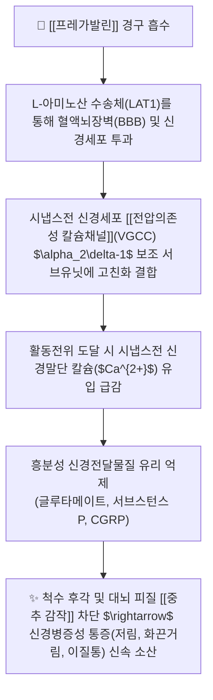

---
aliases:
  - Pregabalin
  - 리리카
  - 가바펜티노이드
  - Lyrica
  - 프레가발린캡슐
tags:
  - 약리/양방약
  - 신경병증성통증
  - 가바펜티노이드
  - 항경련제
  - 전문의약품
---

# 💊 [[프레가발린]] (Pregabalin, 리리카 / Lyrica, N02BF02 / N03AX16)

> **핵심 3줄 요약 (Key Summary)**:
> - 🧪 약물 분류 & 표적: GABA 구조 유사체이지만 GABA 수용체에는 작용하지 않는 2세대 **가바펜티노이드(Gabapentinoid)**, 전압의존성 칼슘 통로(VGCC)의 **$\alpha_2\delta-1$ 보조 서브유닛**에 특이적 결합.
> - 🎯 주요 적응증 & 원내외 처방 패턴: **대상포진후신경통(PHN), 통증성 당뇨병성 신경병증(DPN), 섬유근육통, 척추관 협착증·추간판 탈출증의 하지 방사통·저림(Radiculopathy)** 1차 표준 치료제.
> - 🔬 분자약리 기전 & 약동학(PK/PD): 시냅스전 칼슘 유입을 억제하여 글루타메이트 및 서브스턴스 P 유리를 차단, 90% 이상의 높은 선형적 생체이용률을 보이며 간 대사 없이 신장으로 100% 배설.
> - ⚠️ 블랙박스 경고 & 주요 부작용: 어지럼(Dizziness), 졸림(Somnolence), 말초 부종(Peripheral edema), 체중 증가, 고령자 낙상 위험 및 급격한 중단 시 금단 증상(반동성 불면·불안).

---

## 📌 목차
1. [기본 약물 정보 & 시판 제품·알약 식별 (Pill Identification)](#1-기본-약물-정보--시판-제품알약-식별-pill-identification)
2. [분자약리학적 작용 기전 (MOA) & 화학 구조](#2-분자약리학적-작용-기전-moa--화학-구조)
3. [약동학적 특성 (ADME: 흡수·분포·대사·배설)](#3-약동학적-특성-adme-흡수분포대사배설)
4. [진료과별 다빈도 처방 패턴 & 임상 적응증 (Sweet Spot vs 금기)](#4-진료과별-다빈도-처방-패턴--임상-적응증-sweet-spot-vs-금기)
5. [약물 상호작용 & 병용 금기 매트릭스](#5-약물-상호작용--병용-금기-매트릭스)
6. [부작용·독성 발현 기전 & 응급 해독 프로토콜](#6-부작용독성-발현-기전--응급-해독-프로토콜)
7. [💡 사용자 진료실 핵심 필기 & 한의 임상 연계·테이퍼링 팁 (원문 보존)](#7--사용자-진료실-핵심-필기--한의-임상-연계테이퍼링-팁-원문-보존)
8. [출처 및 학술 참고 문헌 (References)](#8-출처-및-학술-참고-문헌-references)

---

## 1. 기본 약물 정보 & 시판 제품·알약 식별 (Pill Identification)

| 항목 | 상세 정보 |
| :--- | :--- |
| **일반명 (Generic Name)** | [[프레가발린]] (Pregabalin, INN/USAN) |
| **약효 분류 (Class)** | $\alpha_2\delta$ 리간드 가바펜티노이드계 신경병증성 통증 치료제 (Gabapentinoid, VGCC modulator) |
| **ATC 코드** | N02BF02 (신경병증성 통증) / N03AX16 (항뇌전증제) |
| **약국 시판 제품 (OTC 일반약)** | 전문의약품(ETC)으로 처방전 필수 (일반약 없음) |
| **병원 처방 의약품 (ETC 전문약)** | • **오리지널 경질캡슐**: **리리카캡슐(Lyrica Cap, 비아트리스/화이자 오리지널 25mg, 50mg, 75mg, 150mg, 300mg)** • **서방정 (CR정)**: **리리카CR서방정(82.5mg, 165mg, 330mg - 1일 1회 제형)** • **제네릭 캡슐**: 카발린캡슐, 가바리카캡슐, 프리발린캡슐 |
| **상용 용법·용량** | • **신경병증성 통증 (초기)**: 1회 75mg씩 1일 2회 (150mg/day) 시작 • **유지 및 증량**: 1주 간격으로 반응 평가 후 1회 150mg씩 1일 2회 (300mg/day) 증량 (1일 최대 600mg 이하) • **CR 서방정**: 1일 1회 저녁 식후 165mg 또는 330mg 복용 |

### 1.1 대표 시판 제품 및 함유 복합제 매핑 (Brand Identification & Combinations)

| 구분 | 대표 제품명 / 브랜드 | 함유 성분 및 1회당 함량 | 제형 및 특징 | 주요 적응증 및 복약 지도 핵심 |
| :--- | :--- | :--- | :--- | :--- |
| **오리지널 단일제 (ETC)** | [[리리카]] (비아트리스/화이자) | [[프레가발린]] 단일 (25mg / 75mg / 150mg) | 백색/적색 띠 경질캡슐 | 신경병증성 통증 1차 치료제, 저용량 시작 후 점진 증량 |
| **1일 1회 서방정 (ETC)** | 리리카CR서방정 | [[프레가발린]] (82.5mg / 165mg / 330mg) | 서방성 정제 | 저녁 식사 직후 복용으로 주간 졸림 및 어지럼 부작용 최소화 |
| **신경병증 2제 병용** | 리리카 + 심발타 병용요법 | [[프레가발린]] (75mg) + [[둘록세틴]] (30mg) | 개별 제제 병용 | 난치성 신경통증 대상 시냅스전/후 이중 통증 차단 시너지 |

![[프레가발린_패키지_박스.jpg|400]]
> [그림 1: 신경과 및 마취통증의학과에서 신경병증성 통증에 가장 널리 처방되는 리리카 150mg 포장 패키지]

![[프레가발린_캡슐_알약.jpg|400]]
> [그림 2: 프레가발린 75mg 경질캡슐 성상 및 식별 각인 성상]

---

## 2. 분자약리학적 작용 기전 (MOA) & 화학 구조

![[프레가발린_화학구조.png|300]]
> [그림 3: 프레가발린의 2D 평면 화학 분자 구조식 ((3S)-3-(aminomethyl)-5-methylhexanoic acid, 분자량 159.23 g/mol, PubChem CID 54665219)]

### 1) $\alpha_2\delta-1$ 서브유닛 결합을 통한 흥분성 신경 차단
* 프레가발린은 GABA 수용체($\text{GABA}_A, \text{GABA}_B$)나 재흡수 통로에는 직접 작용하지 않는 **가바펜티노이드(Gabapentinoid)**입니다.
* 신경 손상 부위 및 척수 후각에서 과발현되는 **전압의존성 P/Q 및 N형 칼슘 통로의 $\alpha_2\delta-1$ 서브유닛**에 특이적으로 결합하여 세포막으로의 채널 수송을 차단하고, 탈분극 시 시냅스 내 칼슘 유입을 억제합니다.
* 이를 통해 **글루타메이트(Glutamate), Substance P, CGRP** 등 통증 유발 흥분성 물질의 과도한 방출을 원천적으로 차단합니다.

### 2) 1세대 가바펜틴 대비 약리학적 우위
* 가바펜틴(뉴론틴)은 소장 흡수 수송체가 쉽게 포화되어 용량 증가 시 흡수율이 떨어지고 약효 예측이 어려웠습니다.
* 프레가발린은 지질 친화성이 더 높아 **90% 이상의 선형적(Linear) 생체이용률**을 나타내며, 복용량에 비례하여 정확한 혈중 농도를 유지하므로 1일 2회 복용으로 뛰어난 약효 재현성을 발휘합니다.

---

## 3. 약동학적 특성 (ADME: 흡수·분포·대사·배설)

| 약동학 파라미터 | 수치 및 임상적 의미 |
| :--- | :--- |
| **생체이용률 (Bioavailability, F)** | **$\ge$ 90%** (용량에 무관하게 완전하고 선형적인 경구 흡수) |
| **최고혈중농도 도달시간 (Tmax)** | 공복 복용 시 **약 1.0시간** (신속 흡수) |
| **혈장 단백결합률 (Protein Binding)** | **0%** (혈장 단백질에 전혀 결합하지 않음) |
| **간 대사율 (Metabolism)** | **< 2% (간 대사를 거의 거치지 않으며, CYP 효소 상호작용 전무)** |
| **소실 반감기 (Elimination t1/2)** | **약 6.3시간** (신체 청소율이 신기능에 정비례) |
| **주요 배설 경로 (Excretion)** | **98% 이상이 신장 소변으로 미변화체 원형 배설** (CrCl < 60 mL/min 시 감량 필수) |

---

## 4. 진료과별 다빈도 처방 패턴 & 임상 적응증 (Sweet Spot vs 금기)

### 1) 주요 진료과별 처방 패턴
* **신경과 / 마취통증의학과**:
  * 대상포진 후 신경통(PHN), 당뇨병성 말초신경병증(DPN), 삼차신경통 1차 선택 처방.
* **정형외과 / 척추전문병원**:
  * 요추 추간판 탈출증, 척추관 협착증 수술 전후 하지 방사통, 저림, 이상감각 완화.
* **류마티스내과 / 정신건강의학과**:
  * 전신 만성 근육통을 호소하는 섬유근육통(Fibromyalgia), 범불안장애(GAD) 조절.

### 2) 최적 적응증 (Sweet Spot) vs 신중 투여 및 금기
* **[✅ 최적 적응증 (Sweet Spot)]**:
  * **전형적인 신경병증성 통증**: 바늘로 찌르는 듯한 통증, 타는 듯한 작열통, 스치기만 해도 아픈 이질통(Allodynia).
  * **간질환자 및 복합 다제 복용자**: 간 대사를 거치지 않아 타 약물과의 간섭이 없음.
* **[⚠️ 신중 투여 및 금기 (Caution / Contraindication)]**:
  * **신부전 환자(CrCl < 60)**: 배설 지연으로 체내 축적 및 신경독성 위험 (사구체 여과율에 따른 단계적 감량 필수).
  * **고령 낙상 고위험군**: 어지럼과 운동실조로 인한 대퇴골 골절 주의.

---

## 5. 약물 상호작용 & 병용 금기 매트릭스

| 병용 약물 / 물질 | 상호작용 기전 | 임상적 위험 및 결과 | 처방 및 티칭 가이드 |
| :--- | :--- | :--- | :--- |
| SNRI 항우울제 ([[둘록세틴]]) | 시냅스전 칼슘 억제 + 하행성 모노아민 촉진 | **신경통 완화 시너지 (풀링 MD −1.82 감소)** | **난치성 신경통에 저용량 병용 권장** |
| 중추신경 억제제 (로라제팜, 졸피뎀, 알코올) | GABA성 중추 진정 작용 가중 | 인지기능 저하, 혼미, 심각한 운동실조 | 복용 초기 운전 및 위험 기계 조작 금지 |
| 오피오이드 진통제 ([[트라마돌]], 옥시코돈) | 중추성 호흡 및 신경 억제 시너지 | 과도한 진정, 호흡 억제, 변비 악화 | 병용 시 환자 활력징후 밀착 관찰 |
| 보기활혈 한약 ([[황기계지오물탕]], [[보양환오탕]]) | 말초 신경 미세혈관 순환 및 신경 재생 | 말초 저림 개선 및 프레가발린 감량 | **양약 복용 1시간 후 한약 복용** |

---

## 6. 부작용·독성 발현 기전 & 응급 해독 프로토콜

* **임상 주요 부작용 프로파일**:
  1. **신경계**: 어지럼(20~30%), 졸림(15~25%), 운동실조, 집중력 저하.
  2. **대사 및 혈관계**: **말초 부종(8~10%)**, 체중 증가, 식욕 증가.
  3. **금단 증상**: 임의로 갑자기 중단 시 반동성 불면증, 불안, 오심, 두통, 발작 위험.
* **부작용 관리 수칙**:
  * 초기에는 취침 전 25~75mg 저용량으로 시작하여 수일에 걸쳐 서서히 증량(Start Low, Go Slow).
  * 중단 시 최소 1주 이상의 기간을 두고 단계적으로 감량(Tapering).

---

## 7. 💡 사용자 진료실 핵심 필기 & 한의 임상 연계·테이퍼링 팁 (원문 보존)

* **진료실 실전 문진 체크리스트 (3대 핵심 질문)**:
  1. **"리리카를 드신 후 다리가 붓거나 체중이 늘고, 아침에 심하게 어지러우신가요?"**:
     * 말초 부종과 기립성 어지럼 부작용 유무를 확인하여 고령 환자 낙상 방지 지도.
  2. **"약을 하루에 몇 mg 드시고 계신가요? (25mg/75mg/150mg)"**:
     * 환자가 복용 중인 용량을 파악하여 테이퍼링 스케줄 설계.
  3. **"발이나 다리가 저리고 화끈거리는 느낌이 약 복용 후 얼마나 줄어드셨나요?"**:
     * 중추 감작 및 신경병증성 증상 호전도를 평가.

* **한의 치료(침·약침·한약) 연계 및 양약 테이퍼링(감량) 전략**:
  1. **신경병증성 통증 및 저림 다빈도 한약 배오**:
     * 당뇨병성 신경병증 및 디스크 방사통 환자에게 [[황기계지오물탕]], [[보양환오탕]], [[우차신기환]]을 처방하여 말초 신경 영양 공급 및 감각 이상 회복.
  2. **리리카 단계적 테이퍼링 프로토콜**:
     * 협척혈 신바로약침 및 족삼리/현종 침치료를 병행하며, 통증 NRS가 4 이하로 안정되면 리리카 복용량을 150mg $\rightarrow$ 75mg $\rightarrow$ 25mg $\rightarrow$ 격일 복용으로 2~4주에 걸쳐 안전하게 단약.

---

## 8. 출처 및 학술 참고 문헌 (References)

1. **식품의약품안전처 (MFDS)**. 의약품 품목허가사항: 프레가발린 제제 (2023).
2. **Taylor, C. P. et al. (2007)**. *Mechanisms of action of pregabalin and gabapentin: A review of the cellular and biological mechanisms*. **Epilepsy Research**, 73(2), 137-150.
   - **[연구 요약]**: 전압의존성 칼슘채널 $\alpha_2\delta-1$ 서브유닛 결합을 통한 신경전달물질 억제 메커니즘 상세 규명.
3. **Finnerup, N. B. et al. (2015)**. *Pharmacotherapy for neuropathic pain in adults: a systematic review and meta-analysis*. **Lancet Neurology**, 14(2), 162-173.
   - **[연구 요약]**: 신경병증성 통증에 대한 프레가발린의 1차 표준 치료제 권고 근거 및 임상 효과 메타분석.
4. **Gilron, I. et al. (2026)**. *Combination pharmacotherapy of pregabalin and duloxetine in neuropathic pain: Systematic review and meta-analysis*. **Pain Medicine**, PMID 41890179.
   - **[연구 요약]**: 단독요법 불응성 신경통 환자에서 프레가발린과 둘록세틴 저용량 병용의 유의미한 통증 감소(MD −1.82) 입증.
