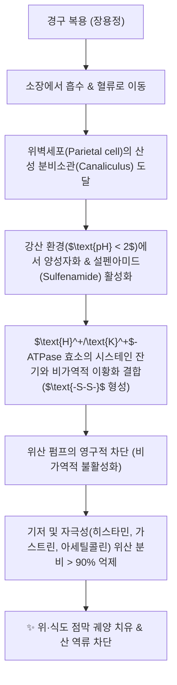

---
aliases:
  - PPI
  - 프로톤펌프억제제
  - Proton Pump Inhibitor
  - 프로톤 펌프 억제제
  - 오메프라졸
  - 에소메프라졸
tags:
  - 양방약
  - 양방의약품
  - 위장관약
  - 소화기계
  - 제산제
  - 위산분비억제제
  - GERD
  - 위궤양
---
# 💊 [[PPI]] (Proton Pump Inhibitor, 프로톤 펌프 억제제)

> **핵심 요약 (Key Summary)**:
> 위벽세포(Parietal cell)의 최종 위산 분비 펌프인 $\text{H}^+/\text{K}^+$-ATPase 효소를 비가역적으로 억제하는 강력한 위산 분비 억제제 계열.
> 위식도 역류 질환([[GERD]]), 소화성 궤양, 졸링거-엘리슨 증후군 및 헬리코박터 파일로리 제균 요법의 1차 표준 치료제.
> 장기 복용 시 저산증으로 인한 비타민 B12 및 칼슘·마그네슘 흡수 장애, 골절 위험 증가, 클로스트리디움 장염 및 한의학의 비위허랭(脾胃虛寒) 병태 초래.

---

## 📌 목차
1. [기본 약물 정보 & 약동학 (Pharmacokinetics)](#1-기본-약물-정보--약동학-pharmacokinetics)
2. [분자약리 작용 기전 (Mechanism of Action, MoA)](#2-분자약리-작용-기전-mechanism-of-action-moa)
3. [임상 적응증 & 대표 제제 (Indications & Drugs)](#3-임상-적응증--대표-제제-indications--drugs)
4. [장기 복용 부작용 & 블랙박스 경고 (Adverse Effects)](#4-장기-복용-부작용--블랙박스-경고-adverse-effects)
5. [한의학적 관점 및 한·양방 병용 관리](#5-한의학적-관점-및-한양방-병용-관리)
6. [출처 및 학술 참고 문헌 (References)](#6-출처-및-학술-참고-문헌-references)

---

## 1. 기본 약물 정보 & 약동학 (Pharmacokinetics)

| 항목 | 상세 내용 |
| :--- | :--- |
| **약효 분류 (ATC Code)** | A02BC (Proton pump inhibitors) |
| **대표 성분군** | 오메프라졸(Omeprazole), 에소메프라졸(Esomeprazole), 판토프라졸(Pantoprazole), 란소프라졸(Lansoprazole), 라베프라졸(Rabeprazole) |
| **약물 제형 특성** | 전구약물(Prodrug), 산에 불안정하여 장용정(Enteric-coated) 제형으로 조제 |
| **흡수 및 생체이용률** | 소장에서 흡수되어 혈류를 통해 위벽세포 분비소관으로 도달 |
| **혈중 반감기 ($t_{1/2}$)** | 1~2시간 (혈중 반감기는 짧으나, 효소와 비가역적 공유결합으로 작용 지속시간은 24~48시간에 달함) |
| **대사 효소** | 간 시토크롬 P450 효소인 [[CYP2C19]] 및 [[CYP3A4]] 대사 |

---

## 2. 분자약리 작용 기전 (Mechanism of Action, MoA)

* **산성 분비소관에서의 특이적 축적 및 활성화**:
  * 약염기성 물질로 중성인 혈액에서는 비활성 상태로 순환하다가, pH 1.0~2.0의 극산성 환경인 위벽세포 분비소관에 1,000배 이상 고농도로 축적됨.
  * 산에 의해 활성형 설펜아미드(Tetracyclic sulfenamide)로 변환된 후 프로톤 펌프의 시스테인(Cys813 등) 잔기와 공유결합을 형성.
* **최종 공통 경로(Final Common Pathway) 차단**:
  * H2 수용체 길항제(H2RA, 파모티딘 등)가 히스타민 자극만을 차단하는 것과 달리, PPI는 히스타민, 아세틸콜린, 가스트린 등 모든 자극 경로의 최종 집행자인 프로톤 펌프 자체를 틀어막으므로 가장 완벽한 위산 억제 효과를 발휘.

---

## 3. 임상 적응증 & 대표 제제 (Indications & Drugs)

### (1) 주 적응증
* **위식도 역류 질환 ([[GERD]])**: 역류성 식도염의 치유 및 유지 요법, 비미란성 역류 질환(NERD).
* **소화성 궤양 (위궤양, 십이지장궤양)**: NSAIDs 유발 궤양의 예방 및 치료.
* **헬리코박터 파일로리 제균 치료**: 아목시실린, 클래리스로마이신과의 삼제요법 베이스.
* **상부 위장관 출혈 급성기 치료**: 정맥 주사 제제(IV Pantoprazole 등) 투여로 위내 pH를 6 이상 유지하여 피브린 혈괴 용해 방지.

### (2) 복용 골든타임
* 새로운 프로톤 펌프는 음식 섭취 시 최대로 세포막에 노출되므로, **아침 식전 30분~1시간 전 공복 복용**이 약효를 극대화하는 표준 지침.

---

## 4. 장기 복용 부작용 & 블랙박스 경고 (Adverse Effects)

* **영양소 흡수 장애**:
  * **저칼슘혈증 및 골다공증성 골절**: 위산 저하로 불용성 칼슘 흡수 장애 $\rightarrow$ 고관절, 척추 골절 위험 증가 (FDA 경고).
  * **비타민 B12 및 철분 결핍**: 단백질과 결합된 B12 및 비헴철 분리 흡수 장애로 인한 대적혈구성 빈혈, 신경병증.
  * **저마그네슘혈증 (Hypomagnesemia)**: 1년 이상 장기 복용 시 테타니, 부정맥 위험.
* **장내 감염 위험 증가**:
  * 위산이라는 1차 살균 방어벽 상실로 인해 클로스트리디움 디피실 장염(CDI) 및 소장세균과증식증([[SIBO]]) 위험 급증.
* **고가스트린혈증 및 반동성 위산 과다 (Rebound Acid Hypersecretion)**:
  * 지속적인 위산 억제로 위전정부 G세포가 자극되어 혈청 가스트린이 증가하고 위벽세포가 비대해짐. 급격히 복용을 중단하면 끔찍한 반동성 속쓰림이 발생하므로 **점진적 감량(Tapering)** 필수.

---

## 5. 한의학적 관점 및 한·양방 병용 관리

* **한의학 병리 매핑 (비위허랭 脾胃虛寒)**:
  * 위산은 음식물을 부숙(腐熟)시키는 위화(胃火, 양기)에 해당. PPI의 장기 복용은 위장의 양기를 꺼뜨려 소화불량, 식욕부진, 복부 팽만, 장내 가스를 일으키는 인위적 **비위허랭(脾胃虛寒)** 병태를 형성.
* **한약 복합 투약 및 PPI 디프리스크라이빙(Tapering) 전략**:
  * PPI 중단 시 발생하는 반동성 산분비를 완화하기 위해 제산·수렴 본초인 [[오적골]], [[패모]]([[오패산]]) 및 비위를 따뜻하게 하는 [[반하사심탕]], [[이중탕]]을 합방하여 PPI 의존성을 끊도록 유도.

---

## 6. 출처 및 학술 참고 문헌 (References)

* Sachs, G., et al. (2006). Review article: the gastric H+, K+-ATPase as a drug target. *Alimentary Pharmacology & Therapeutics*, 24(Suppl 2), 2-11.
  * `[연구 요약]` 프로톤 펌프의 3차원 분자 구조 및 PPI와의 비가역적 이황화 결합 메커니즘을 상세히 규명한 기초약리학 명저.
* Freedberg, D. E., et al. (2017). The risks and benefits of long-term use of proton pump inhibitors: expert review and best practice advice from the American Gastroenterological Association. *Gastroenterology*, 152(4), 706-715.
  * `[연구 요약]` 미국소화기학회(AGA)의 PPI 장기 사용 위험성(골절, 감염, 영양결핍) 및 안전한 감량 가이드라인 제시.
