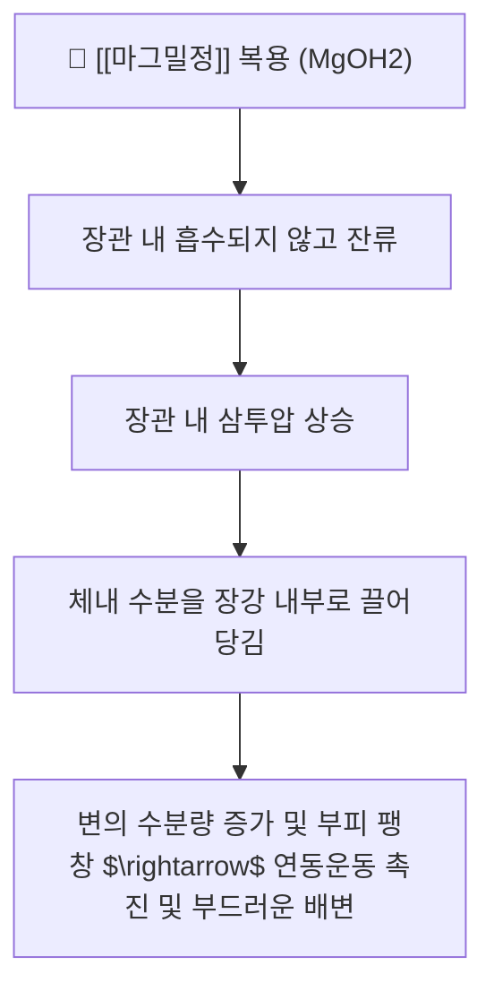

---
aliases:
  - 마그밀
  - 마그밀정
  - Magmil
  - 수산화마그네슘정
tags:
  - 약리/양방약
  - 일반의약품
  - 완하제
  - 제산제
  - 브랜드약품
---

# 💊 [[마그밀정]] (Magmil Tab, 삼남제약)

> **핵심 3줄 요약 (Key Summary)**:
> 🧪 주성분: [[수산화마그네슘]](Magnesium Hydroxide) 500mg 단일 성분 일반의약품.
> 📍 이중 약리 작용: 용량에 따른 완하 작용(삼투성 하제로 장내 수분 저류 유도) 및 제산 작용(위산 중화).
> 🎯 한의 연계: 삼투압으로 수분을 끌어들여 사하하는 한약재 [[망초]](황산나트륨)의 약리 기전과 일맥상통하며 [[승기탕]]류, [[마자인환]]과 배오 비교.
> ⚠️ 주의사항: 신부전·신장애 환자 고마그네슘혈증 위험, 장기 과량 복용 시 전해질 불균형 및 설사 유발.

---

## 1. 약물 기본 정보 및 작용 기전

| 항목 | 상세 내용 |
| :--- | :--- |
| **성분명** | [[수산화마그네슘]] (Magnesium Hydroxide, $Mg(OH)_2$) 500mg |
| **식약처 분류** | 234 제산제 / 하제, 완하제 |
| **투여 목적별 용법** | • 완하(변비): 1일 1,000~2,000mg (2~4정) 취침 전 또는 공복 분할 복용 • 제산(위염·속쓰림): 1일 1,000~2,500mg 분할 복용 |

---

## 2. 한의학적 사하제([[망초]], [[대황]])와의 비교 및 임상 연계

* **[[망초]](Natrii Sulfas, $Na_2SO_4 \cdot 10H_2O$)와의 삼투성 기전 공유**:
  * 한의학의 망초 역시 황산염 음이온이 장관에서 흡수되지 않고 강한 삼투압을 형성하여 조열(燥熱)로 굳은 대변을 묽게 하는 연견사하(軟堅瀉下) 작용을 발휘.
* **자극성 하제([[대황]], 센나)와의 차이**:
  * 대황의 센노사이드는 장관 점막 신경총을 직접 자극하는 반면, 마그밀은 삼투압 물리현상을 이용하므로 복통이나 대장흑색증(Melanosis coli) 부담이 상대적으로 적음.

---

## 3. 진료실 실전 문진 및 복약 지도

1. **충분한 수분 섭취 안내**: 삼투성 하제이므로 물을 1~2컵 이상 충분히 마셔야 효과가 극대화됨.
2. **신기능 저하 환자 주의**: 신장 배설이 원활하지 않은 고령자나 만성 신부전 환자는 체내 마그네슘 축적으로 인한 무기력, 저혈압 위험 모니터링.
3. **한약 변비 처방 연계**: [[도인승기탕]], [[대승기탕]], [[마자인환]] 투여 시 마그밀 복용량을 단계적으로 조절하여 무른변/설사 부작용 방지.

---

## 4. 출처 및 참고 문헌 (References)

* 삼남제약 마그밀정 의약품 제품 정보
* Brunton LL, et al. Goodman & Gilman's Pharmacological Basis of Therapeutics. 13th ed.
