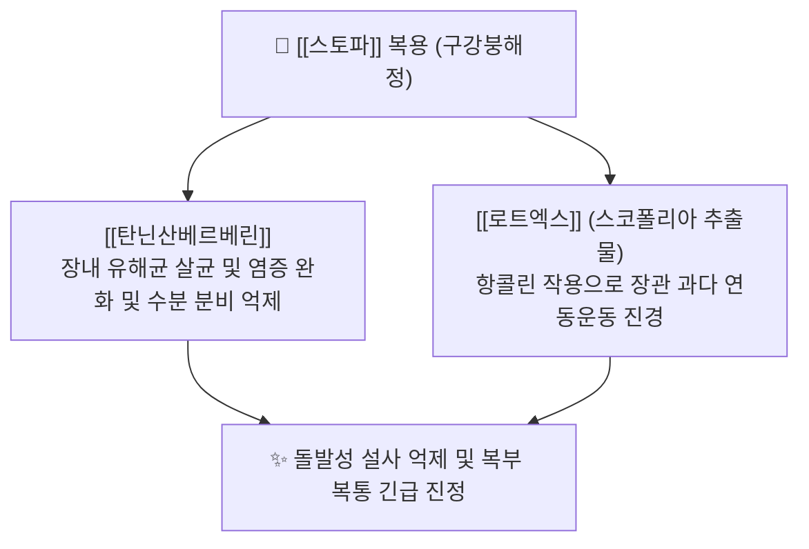

---
aliases:
  - 스토파
  - Stoppa
  - 스토파지사제
  - 라이온스토파
tags:
  - 약리/양방약
  - 일반의약품
  - OTC
  - 지사제
  - 브랜드약품
---

# 💊 [[스토파]] (Stoppa, 일본 라이온 Lion 정장지사제)

> **핵심 3줄 요약 (Key Summary)**:
> 🧪 주성분: [[탄닌산베르베린]](장내 살균·항염) + [[로트엑스]](스코폴리아 추출물, 항콜린 장관 평활근 진경).
> 📍 제형 및 작용: 물 없이 혀 위에서 즉시 녹는 구강붕해정(OD정)으로, 돌발성 급성 설사 및 장 경련통 신속 억제.
> 🎯 한의 연계: 탄닌과 수축 억제 기전의 [[권백]], [[베르베린]]을 함유한 대표 청열조습약([[황금]], [[황련]], [[황백]])과 한의 약리 기전 공유.
> ⚠️ 주의사항: 항콜린 작용으로 인한 입마름(구갈), 시야 흐림, 녹내장 및 전립선 비대증 환자 복용 주의.

---

## 1. 스토파 복합 구성 성분 및 작용 기전

### 1.1 구성 성분별 함량 및 역할

| 성분명 | 1회 분량 함량 | 약리 기전 및 효과 |
| :--- | :--- | :--- |
| [[탄닌산베르베린]] | 약 33.3~100mg | 항균·수렴 작용: 장점막 염증 수렴 및 유해 미생물 억제, 과다 수분 분비 차단 |
| **[[로트엑스]] (스코폴리아엑스)** | 약 20mg | 무스카린 수용체 차단: 부교감신경 흥분으로 인한 장관 평활근 경련 및 과다 수축 억제 |

---

## 2. 한의학적 본초 및 처방 배오 연계

스토파의 약리 구성은 한의학의 **청열조습·지사(淸熱燥濕·止瀉)** 및 **수렴지사(收斂止瀉)** 치법과 매우 일치합니다.

| 양방 복합 성분 | 한의 대응 본초 | 한의 효능 및 약리 연계 |
| :--- | :--- | :--- |
| **[[베르베린]] 성분** | [[황련]], [[황금]], [[황백]] | 대장 습열(濕熱)을 끄고 장내 염증 및 세균성 설사 제어 |
| **탄닌(Tannin) 성분** | [[권백]], [[오매]], [[오미자]] | 장 점막 수렴 지사 및 수분 과다 흡수 조절 |
| **장관 경련 억제** | [[백작약]], [[감초]] ([[작약감초탕]]) | 복부 평활근 급박 연축 완화 및 진경 진통 |

---

## 3. 실전 임상 주의사항 및 복약 가이드

1. **세균성 이질·고열 동반 설사 주의**: 세균 독소 배출이 필요한 감염성 장염에서 지사제 남용 시 장관 마비 위험.
2. **항콜린 부작용**: 복용 후 침 분비 감소로 입이 마르고 가슴 두근거림이 발생할 수 있음을 사전 티칭.
3. **과민성 대장 증후군(IBS-D) 연계**: 만성 설사형 과민성 장증후군 환자에게는 [[반하사심탕]], [[삼령백출산]] 치료로 장관 안정화 도모.

---

## 4. 출처 및 참고 문헌 (References)

* Lion Corporation Japan - Stoppa Diarrhea Medicine Product Details
* 한국임상약학회 - 소화기계 일반의약품 복약지도 핸드북
