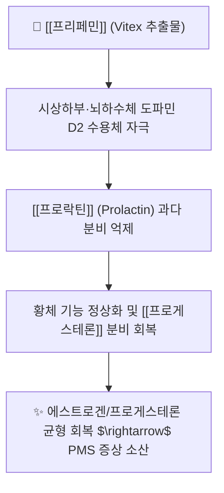

---
aliases:
  - 프리페민
  - 프리페민정
  - Prefemin
tags:
  - 약리/양방약
  - 일반의약품
  - 생약제제
  - PMS
  - 부인과
  - 브랜드약품
---

# 💊 [[프리페민]] (Prefemin Tab, 종근당)

> **핵심 3줄 요약 (Key Summary)**:
> 🧪 주성분: 아그누스카스투스 열매([[아그누스카스투스]], Vitex Agnus-Castus) 건조엑스 20mg (생약제제).
> 📍 약리 기전: 도파민 D2 수용체 효능 $\rightarrow$ 뇌하수체 [[프로락틴]](Prolactin) 분비 억제 $\rightarrow$ [[프로게스테론]] 분비 정상화로 월경전증후군(PMS) 개선.
> 🎯 한의 연계: 한약재 [[만형자]](Vitex trifolia)와 동일한 순비기나무속(Vitex) 기원 식물로 부인과 호르몬 불균형 치법 공유.
> ⚠️ 주의사항: 도파민 수용체 관련 약물(도파민 효능제/길항제)과 병용 시 상호작용, 교감신경 활성에 따른 구갈·진액 부족 주의.

---

## 1. 약물 기본 정보 및 시판 제품 (Brand Identification)

> [!abstract]+ 🧪 3D 약리 분자 구조 (Interactive 3D Viewer)
> <iframe src="https://molecule-viewer-rho.vercel.app/?cid=5280441" style="width: 100%; height: 600px; border: none; border-radius: 12px; box-shadow: 0 4px 20px rgba(0,0,0,0.15);" allowfullscreen></iframe>

| 항목 | 상세 내용 |
| :--- | :--- |
| **성분명** | 아그누스카스투스 열매 건조엑스 (Vitex Agnus-Castus Dry Extract) 20mg |
| **적응증** | 월경전증후군(PMS)으로 인한 유방 통증, 감정 기복, 하복부 팽만감, 부종, 두통 완화 |
| **용법·용량** | 1일 1회 1정씩, 식사와 무관하게 매일 일정한 시간에 최소 3개월 이상 연속 복용 |

---

## 2. 한의학적 본초([[만형자]]) 및 부인과 병태생리 연계

* **순비기나무속(Vitex) 본초 계보**:
  * 프리페민의 기원 식물인 *Vitex agnus-castus*(체이스트베리)는 한약재 [[만형자]](*Vitex trifolia*)와 같은 순비기나무속 식물.
  * 만형자는 소산풍열(疏散風熱), 청리두목(淸利頭目)하여 두통과 눈의 충혈을 치료하며, 프리페민은 월경 전 두통 및 유방 통증에 탁월.
* **간기울결(肝氣鬱結) 및 충임부조(衝任不調) 치법**:
  * 월경 전 프로락틴 상승 및 프로게스테론 저하로 인한 유방 팽만통과 기분 변화는 한의학의 간기울결과 일치.
  * [[소요산]], [[가미소요산]], [[조경종옥탕]]과 병용 시 호르몬 축의 안정화 시너지 발휘.

---

## 3. 진료실 실전 임상 가이드

1. **복용 기간 지도**: 호르몬 조절 생약 제제이므로 효과가 즉각적이지 않고 **최소 3주기(3개월) 이상 꾸준히 복용**해야 함을 환자에게 설명.
2. **도파민 계열 약물 상호작용**: 항우울제나 도파민 길항제(메토클로프라미드 등 소화기용제) 복용 이력 확인.
3. **교감신경 활성 모니터링**: 입 마름, 코 건조감, 불면 등 음허(陰虛) 및 진액 부족 증상 발생 시 한의 보음(補陰) 처방 병행.

---

## 4. 출처 및 참고 문헌 (References)

* 종근당 프리페민정 공식 의약품 상세정보
* van Die MD, et al. Vitex agnus-castus extracts for female reproductive disorders: a systematic review of clinical trials. *Planta Med*. 2013;79(7):562-575.
