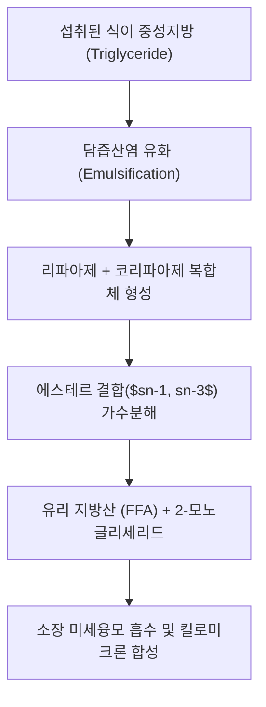

# 💊 [[리파아제]] (Lipase, Pancrelipase, Orlistat target)

> **핵심 요약 (Key Summary)**:
> 췌장 외분비선 및 위장관에서 분비되는 중성지방(Triglyceride) 가수분해 소화효소군(Triacylglycerol acylhydrolase).
> 십이지장 내 담즙산염과 결합하여 중성지방을 유리 지방산(FFA) 및 2-모노글리세리드(2-MAG)로 분해, 장 점막 흡수를 매개.
> 만성 췌장염·췌장 절제 후 췌장 외분비 기능부전(EPI) 치료 효소제로 투여되거나, 비만 치료제 올리스타트([[오를리스타트]])의 억제 표적으로 임상 활용.

---

## 📌 목차
1. [기본 약물 정보 & 효소 분류](#1-기본-약물-정보--효소-분류)
2. [분자 생화학 및 약리 작용 기전](#2-분자-생화학-및-약리-작용-기전)
3. [임상 적응증 & 투약 요법](#3-임상-적응증--투약-요법)
4. [부작용 및 임상 주의사항](#4-부작용-및-임상-주의사항)
5. [한의학적 소화기 병리와의 상관성](#5-한의학적-소화기-병리와의-상관성)
6. [출처 및 학술 참고 문헌 (References)](#6-출처-및-학술-참고-문헌-references)

---

## 1. 기본 약물 정보 & 효소 분류

| 항목 | 상세 내용 |
| :--- | :--- |
| **일반명 (Generic)** | [[리파아제]] (Pancreatic Lipase, Pancrelipase) |
| **효소 분류 (EC Number)** | EC 3.1.1.3 (Triacylglycerol lipase) |
| **약효 분류 (ATC Code)** | A09AA02 (Pancreatin / Pancrelipase), A08AB01 (Orlistat 표적) |
| **생체 분비 부위** | 췌장 선방세포(Acinar cells), 위(위 리파아제), 구강(설 리파아제) |
| **최적 작용 pH** | pH 7.0 ~ 8.0 (십이지장의 중화된 알칼리성 환경에서 최고 활성) |
| **필수 조효소 (Cofactor)** | 코리파아제(Colipase), 담즙산염(Bile salts), 칼슘 이온($Ca^{2+}$) |

---

## 2. 분자 생화학 및 약리 작용 기전

### (1) 중성지방 에스테르 결합의 단계적 가수분해
* 췌장 리파아제는 수용성 효소이지만, 지질-물 계면(interface)에서만 활성화되는 계면 활성화(interfacial activation) 특성을 가집니다.
* 중성지방 분자의 $sn-1$ 및 $sn-3$ 위치 에스테르 결합을 순차적으로 가수분해하여 **2개의 유리 지방산(FFA)**과 **1개의 2-모노아실글리세롤(2-MAG)**을 생성합니다.

### (2) 코리파아제(Colipase)의 필수적 보조 작용
* 십이지장 내 담즙산염은 지방을 유화시키지만 동시에 리파아제가 지질 표면에 결합하는 것을 방해(탈착)할 수 있습니다.
* 췌장에서 분비되는 전구체 프로코리파아제가 트립신에 의해 코리파아제로 활성화된 후, 담즙산 피복 지질 표면에 먼저 결합하여 리파아제를 지질 계면에 단단히 고정시키는 앵커(anchor) 역할을 수행합니다.

### (3) 약리학적 표적 (억제제 vs 보충제)
* **효소 억제 (비만 치료)**: 올리스타트([[오를리스타트]])는 위장관 리파아제의 활성 세린 잔기에 공유 결합하여 식이 지방의 약 30% 흡수를 차단, 체중 감량을 유도합니다.
* **효소 보충 (췌장 외분비 부전)**: 판크레리파아제(Pancrelipase, 노르자임, 크레온 등) 제제는 리파아제, 아밀라아제, 프로테아제를 보충하여 지방변(Steatorrhea)과 영양실조를 개선합니다.

---

## 3. 임상 적응증 & 투약 요법

* **췌장 외분비 기능부전 (EPI)**:
  * 만성 췌장염, 낭포성 섬유증(Cystic Fibrosis), 췌장 절제술 후 소화 장애.
  * 식사 중 장용성 캡슐(Enteric-coated microtablets) 형태로 복용하여 위산에 의한 불활성화를 방지하고 십이지장에서 용출되도록 함.
* **지방변증 및 지용성 비타민 흡수 장애**:
  * 비타민 A, D, E, K 흡수 결핍 교정.

---

## 4. 부작용 및 임상 주의사항

* **과량 투여 시 부작용**: 고요산혈증, 고요산뇨증(퓨린 함량이 높은 동물 췌장 추출물 기원 시 발생 가능).
* **리파아제 억제제 복용 시 반응**: 올리스타트 복용 환자에게서 빈번한 기름변(지방변), 방귀, 급박 변의, 지용성 비타민 결핍증 발생.
* **복용 시 주의점**: 캡슐을 씹거나 부수어 복용하면 구강 점막 자극 및 효소 파괴가 일어나므로 통째로 물과 함께 삼켜야 함.

---

## 5. 한의학적 소화기 병리와의 상관성

* 한의학에서 지방의 소화 흡수 장애 및 지방변증은 **비위허약(脾胃虛弱), 비허습곤(脾虛濕困), 간담습열(肝膽濕熱)**의 범주에 해당합니다.
* 췌액 분비와 담즙 배설 기능은 한의학의 **비주운화(脾主運化)** 및 **간주소설(肝主疏泄)** 기능과 밀접하게 연계됩니다.
* 비허(脾虛)로 인한 식적비만(食積痞滿)과 지방 소화 장애 시 [[산사]], [[신곡]], [[맥아]] 등의 소도약(消導藥)이나 [[평위산]], [[보중익기탕]]을 운용하여 소화 흡수 효소계의 기능을 북돋웁니다.

---

## 6. 출처 및 학술 참고 문헌 (References)

1. Lowe, M. E. (2002). "The catalytic site of pancreatic lipase is protected by a lid domain." *Journal of Biological Chemistry*, 277(14), 12196-12204.
   - [연구 요약] 췌장 리파아제의 지질 계면 활성화 구조적 특성 및 리드(lid) 도메인의 개폐 메커니즘을 분자 수준에서 규명.
2. Fieker, A., et al. (2011). "Enzyme replacement therapy for pancreatic exocrine insufficiency." *International Journal of General Medicine*, 4, 169-173.
   - [연구 요약] 만성 췌장염 및 췌장 기능 부전 환자에서 판크레아틴/리파아제 효소 대체 요법의 임상적 유효성과 투약 지침 정리.
