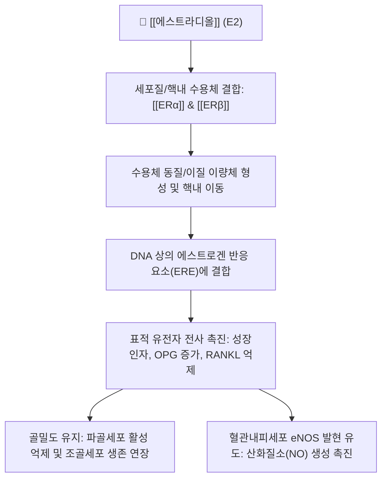

# 💊 [[에스트라디올]] (Estradiol, 17β-Estradiol, E2)

> **핵심 요약 (Key Summary)**:
> 난소 과립막세포에서 주로 분비되는 인체 내 가장 강력한 천연 스테로이드 에스트로겐
> 핵내 에스트로겐 수용체 [[ERα]] 및 [[ERβ]]에 결합하여 생식계 발달, 골흡수 억제 및 혈관내피 보호 조절
> 폐경 후 혈관운동 증상 완화, 골다공증 예방에 쓰이나 정맥혈전색전증 및 자궁내막 증식 부작용 주의

---
## 📌 목차
1. [기본 약물 정보 & 약동학 (Pharmacokinetics)](#1-기본-약물-정보--약동학-pharmacokinetics)
2. [분자약리 작용 기전 (Mechanism of Action, MoA)](#2-분자약리-작용-기전-mechanism-of-action-moa)
3. [임상 적응증 & 용법·용량 (Indications & Dosing)](#3-임상-적응증--용법용량-indications--dosing)
4. [부작용, 블랙박스 경고 & 금기 (Adverse Effects & Contraindications)](#4-부작용-블랙박스-경고--금기-adverse-effects--contraindications)
5. [약물 상호작용 & 한약 병용 주의 (Drug-Herb Interactions)](#5-약물-상호작용--한약-병용-주의-drug-herb-interactions)
6. [동일 계열 호르몬 비교 매트릭스](#6-동일-계열-호르몬-비교-매트릭스)
7. [출처 및 학술 참고 문헌 (References)](#7-출처-및-학술-참고-문헌-references)

---
## 1. 기본 약물 정보 & 약동학 (Pharmacokinetics)

| 항목 | 상세 내용 |
| :--- | :--- |
| **일반명 (Generic)** | [[에스트라디올]] (Estradiol, 17β-Estradiol) |
| **대표 상품명 (Brand)** | 에스트로펨(Estrofem), 프로기노바(Progynova), 디비겔(Divigel) |
| **약효 분류 (ATC Code)** | 천연 에스트로겐 호르몬 제제 (G03CA03) |
| **생체이용률 (Bioavailability)** | 경구 투여 시 약 5% (간 초회통과 대사 극심), 경피 패치/겔 사용 시 100% |
| **혈중 반감기 ($t_{1/2}$)** | 경구 12~20시간, 경피 제제 투여 시 지속적 방출 유지 |
| **대사 경로 (Metabolism)** | 간에서 CYP3A4, CYP1A2에 의해 에스트론(E1), 에스트리올(E3)로 가역적 대사 |
| **배설 경로 (Excretion)** | 신장 소변 배설 (글루쿠론산/황산 포합체 형태) 및 담즙 |

---
## 2. 분자약리 작용 기전 (Mechanism of Action, MoA)

### (1) 핵 수용체 매개 게놈성 경로 (Genomic Pathway)
* **수용체 선택성**: [[ERα]]는 자궁, 유방, 시상하부에 주로 분포하고, [[ERβ]]는 난소, 골조직, 심혈관계 및 전립선에 풍부함.
* **골대사 보호**: 파골세포 분화 필수 인자인 RANKL 생성을 억제하고 오스테오프로테게린(OPG) 분비를 유도하여 골흡수를 효과적으로 억제함.

### (2) 비게놈성 급속 신호전달 (Non-genomic Pathway)
* 막 결합형 수용체(GPER)와 상호작용하여 내피세포 내 $	ext{Ca}^{2+}$ 유입 및 eNOS 인산화를 촉진하여 급속 혈관 확장을 유도함.

---
## 3. 임상 적응증 & 용법·용량 (Indications & Dosing)

### (1) 주요 승인 적응증
* **폐경 증상 호르몬 대체요법(HRT)**: 중등도 이상의 안면홍조, 야간 발한, 수면장애 개선.
* **폐경 후 골다공증 예방**: 골절 고위험군 폐경 여성의 골밀도 소실 방지.
* **비뇨생식기 위축증**: 질 건조감, 성교통, 재발성 위축성 질염 치료 (국소 질정/크림).

### (2) 자궁 보존 여성의 프로게스토겐 병용 원칙
* 자궁이 있는 여성에게 에스트라디올 단독 투여 시 자궁내막 증식증 및 자궁내막암 발생 위험이 급증하므로, 반드시 프로게스테론(또는 합성 프로게스토겐)을 병용 투여함.

---
## 4. 부작용, 블랙박스 경고 & 금기 (Adverse Effects & Contraindications)

* **정맥혈전색전증(VTE) 및 뇌졸중 위험**: 간 통과 시 응고 인자(Factor VII, X) 합성을 촉진하여 심부정맥혈전증 및 폐색전증 위험 증가.
* **유방암 위험 증가**: 장기 투여 시 에스트로겐 수용체 양성 유방암 세포 증식 위험.
* **절대 금기**: 진단되지 않은 비정상 자궁출혈, 활성 정맥혈전색전증 병력, 유방암 환자, 중증 간기능 장애.

---
## 5. 약물 상호작용 & 한약 병용 주의 (Drug-Herb Interactions)

* **식물성 에스트로겐 본초 병용 주의**: [[갈근]], [[승마]], [[대두]] 등 이소플라본 함유 본초는 ER 수용체에 부분 작용제로 작용하므로 상가적 또는 길항적 영향을 미칠 수 있음.
* **간 대사 유도제**: [[세인트존스워트]] 등 CYP3A4 유도 성분과 병용 시 에스트라디올의 간 대사가 촉진되어 혈중 농도와 약효가 저하됨.

---
## 6. 동일 계열 호르몬 비교 매트릭스

| 에스트로겐 종류 | 주요 분비처 | 수용체 결합력(상대 활성) | 주요 생리 시기 |
| :--- | :--- | :--- | :--- |
| [[에스트라디올]] (E2) | 성숙 난포 과립막세포 | 100 (가장 강력) | 가임기 비임신 여성 |
| **에스트론 (E1)** | 지방 조직 (말초 전환) | 10 | 폐경 후 여성의 주 에스트로겐 |
| **에스트리올 (E3)** | 태반 | 1 (가장 약함) | 임신기 주요 에스트로겐 |

---
## 7. 출처 및 학술 참고 문헌 (References)

* Goodman & Gilman's The Pharmacological Basis of Therapeutics, 14th Edition.
* Manson JE et al. Menopausal Hormone Therapy and Long-term All-Cause and Cause-Specific Mortality: The Women's Health Initiative Randomized Trials. JAMA. 2017.
  * [연구 요약] WHI 대규모 임상 분석을 통해 호르몬 치료의 적응증별 유익성과 정맥혈전 위험성을 정밀 평가함.
