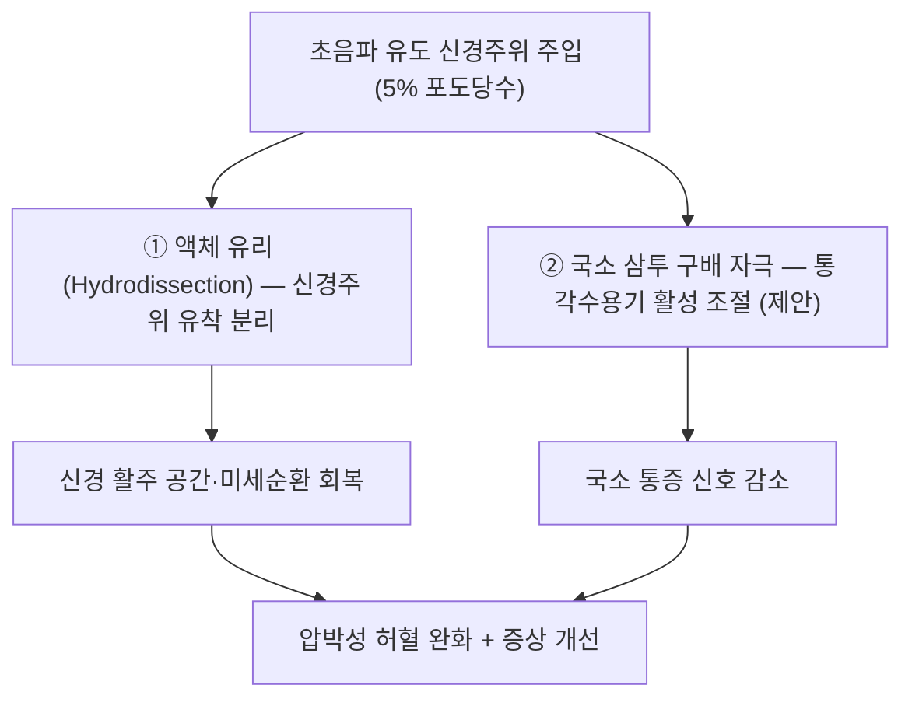

---
aliases:
  - 5% 포도당수
  - D5W
  - Dextrose 5% in Water
  - 포도당 주사액
  - 5% Dextrose
  - 신경주위 포도당 주사
tags:
  - 약리
  - 약리/양방약
  - 포도당
  - 근골격
  - 주사제
title: "5% 포도당수(D5W)"
date: 2026-09-24
출처: "PMID: 42206562"
---

# 💊 5% 포도당수 (Dextrose 5% in Water, D5W)

> **핵심 3줄 요약 (Key Summary)**:
> 🧪 주성분·제형: 포도당(glucose, dextrose) **5 g/100 mL** 수용액 — 100·250·500·1000 mL 폴리백/유리병 주사제. 대한약전상 **수액제(포도당 주사액)** 로 분류되며 5%는 **혈장 등장액에 가까운 삼투압(약 250 mOsm/L)** 이다.
> 📍 작용 기전(신경주위 주사로 사용 시): ① 주입액 자체의 **물리적 액체 유리(hydrodissection)** 로 신경주위 유착 분리 ② 국소 **삼투압 구배 자극**으로 통각수용기 활성 조절(제안된 기전) — 포도당의 대사 작용이 주 기전은 아니다.
> 🎯 임상 적응증: 일차적으로는 **수분·열량 보급용 정맥 수액**. 근골격·신경 임상에서는 **초음파 유도 신경주위 주사요법(PIT)** 의 비스테로이드 주입액으로 사용 — 2026-09-15 리뷰 3번에서 경도~중등도 손목터널증후군에서 **스테로이드와 12개월 대등**한 결과.
> ⚠️ 주의사항: 고삼투압·대량 투여 시 정맥 자극·혈당 상승(당뇨 환자), **신경 내 주사는 금기**(신경주위 주사 원칙), 무균·초음파 유도 필수.

---

## 1. 약물 기본 정보 및 제형 (Brand Identification)

> [!abstract]+ 🧪 3D 약리 분자 구조 (Interactive 3D Viewer)
> <iframe src="https://molecule-viewer-rho.vercel.app/?cid=5793" style="width: 100%; height: 600px; border: none; border-radius: 12px; box-shadow: 0 4px 20px rgba(0,0,0,0.15);" allowfullscreen></iframe>

| 항목 | 상세 정보 |
| :--- | :--- |
| **일반명 (Generic Name)** | 포도당(포도당수액) / Dextrose (Glucose) 5% in Water |
| **대표 제형** | 5% 포도당 주사액 100 mL / 250 mL / 500 mL / 1000 mL (폴리백·PE병) |
| **분류** | 수액제(포도당 제제) — 정맥주사용 |
| **삼투압** | 5% ≈ 약 250 mOsm/L (혈장 등장액에 근접) / 농도가 올라갈수록(10%·15%·50%) 고장액 |
| **주요 용도** | 정맥 수분·열량 보급, 약물 희석 용매 / (근골격 영역) 신경주위 주사(PIT)·프롤로테라피 주입액 |
| **허가 범위 확인 필수** | 국내 허가 적응증은 '수분·전해질·열량 보급' 중심 — **신경주위 주사는 허가 외 사용(off-label)** 임을 인지하고 시행 범위·동의·기록을 준수 |

### 1.1 근골격 영역에서의 위치 (신경주위 주사액으로서)
| 구분 | 내용 |
| :--- | :--- |
| **사용 형태(이번 논문)** | 초음파 유도 **신경주위 주사 1회, 주입액 총량 6 mL** — [[신경주위 주사요법]] |
| **대조 약제** | [[트리암시놀론]](triamcinolone acetonide)을 생리식염수로 희석한 코르티코스테로이드 |
| **선택 논리** | 스테로이드 반복 주사의 **건·지방 위축, 피부 저색소화, 효과 감쇠** 부담을 피하려는 비스테로이드 대안 |
| **농도 관행** | 프롤로테라피 영역에서는 12.5~25% 등 고농도가 쓰이기도 하나, **신경주위 주사(PIT)에서는 5%가 표준적으로 사용**된다 — 농도·용량은 프로토콜별로 확인할 것 |

---

## 2. 분자 약리 기전 및 작용 경로 (Mechanism of Action)

- **① 물리적 기전 — 액체 유리(hydrodissection)**: 주입액이 조직면을 따라 퍼지며 신경과 유착된 근막·건·터널 구조를 분리 → 신경 활주성·미세순환 회복. **이번 연구에서 D5W와 스테로이드가 대등했던 결과**는 '약제 특이 효과'보다 이 물리적 효과 + 주변 염증 조절이라는 **공통 기전**의 비중을 시사한다(제안된 해석)
- **② 국소 삼투압 자극**: 포도당의 **대사 작용보다 삼투압 자극이 통각수용기 활성을 조절**한다는 가설이 제시돼 있다. ⚠️ 다만 **5% 포도당은 혈장 등가 수준의 등장액**이므로, '고삼투압'은 *주입액과 세포·조직 간의 국소적 삼투 구배 및 조직액 환경 변화*라는 맥락으로 이해해야 하며, **확정된 기전이 아니다**
- **③ 추가 가설(참고)**: 일부 연구는 포도당이 **TRPV1 매개 신경펩타이드(예: CGRP) 유리**를 억제하는 방향으로 작용할 가능성을 제안한다 — 전임상 수준의 가설로, 임상 기전으로 확립되지 않았다
- **전신 대사 효과**: 5% 포도당수 자체는 수분·열량 보급 목적의 수액으로, 근골격 주사 시 전신 약리 효과는 기대하지 않는다

---

## 3. 약동학적 특성 (Pharmacokinetics, 국소 주사 관점)
| 파라미터 | 임상적 의미 |
| :--- | :--- |
| **흡수** | 조직 내 주입 후 주변 모세혈관·림프로 흡수 — 주입 부위·량에 따라 수 시간~수일 내 흡수 |
| **국소 작용 시간** | 이번 연구에서 **증상 완화가 치료 3개월 이내 최대**, 이후 감쇠 — 단회 주사의 국소 효과 지속 한계 |
| **대사** | 포도당은 체내 정상 대사 기질(해당·산화) — 특이 대사 경로 부담 없음 |
| **배설** | 대사산물(CO₂·H₂O) 및 잉여 수분은 정상 경로로 처리 |
| **혈당 영향** | 6 mL 국소 주입은 전신 혈당 영향이 미미하나, **당뇨 환자에서는 주입 전후 혈당 확인이 안전** |

---

## 의학/04_임상 용법·용량 (Dosage & Administration)
| 적응 | 용법·용량 | 비고 |
| :--- | :--- | :--- |
| **수분·열량 보급(허가 적응)** | 성인 기준 정맥 점적, 환자 상태에 따라 용량 결정 | 의료기관 표준 수액 요법 |
| **신경주위 주사(PIT, 이번 논문)** | **초음파 유도, 주입액 총 6 mL, 1회** | 즉시 재평가·3개월 재평가 시점 설계 ([[신경주위 주사요법]]) |
| **프롤로테라피(참고)** | 인대·건 부착부 주입, 농도·용량 프로토콜별 상이 | 허가 외 사용 여부·동의·기록 확인 |

---

## 5. 부작용, 경고 및 상호작용 (Adverse Effects & Interactions)
- **주사 부위**: 통증·압통·부종·멍, 드물게 감염·혈종
- **신경 관련**: **신경 내 주사 시 신경 손상·지속 감각이상** 위험 → 반드시 **신경 '주위'** 에 주입, 주입 중 방사통 발생 시 즉시 중단·위치 재확인
- **당뇨 환자**: 주입량이 많거나 반복될 경우 혈당 상승 가능 — 주입 전후 확인
- **삼투·용량 관련**: 고농도·대량 정맥 투여 시 정맥 자극·체액 과부하(심부전·신부전 환자)
- **감염 예방**: 무균 조작, 일회용 기구, 피부 소독 — 면역저하 환자는 특히 주의
- **병용(같은 세션 다른 주사와의 관계)**: 동일 부위에 스테로이드와 포도당을 동시 주입하는 프로토콜은 표준화돼 있지 않다 — 본 논문은 **좌우 교차(각 손에 하나씩)** 설계로 두 약제를 분리 평가했다

---

## 6. 한의 치료 연계 및 병용 (Integrative Medicine)
- **한의원 역할**: 초음파 유도 주사는 시술 범위·장비 여건을 고려해 전문 진료과와 협진하는 흐름이 안전 — 한의 영역에서는 **침·전침·약침으로 정중신경 주행부(수근관 주변)와 경근을 자극**하는 접근이 대응한다([[수근관 증후군]])
- **단계 설계**: 주사 후 **3개월을 재평가 시점**으로 삼아, 그 이후 지속되는 야간 각성·감각이상을 침·야간 보조기·[[신경가동술]]로 관리
- **상담 근거**: 12개월 시점 임상적 의미 있는 개선 **D5W 29% vs CS 25%**, 1·3개월 **약 50%** — 현실적 기대치 제시에 사용
- **주의**: '천연 주사이니 부작용이 없다'는 설명은 부정확하다 — 기전이 완전히 규명되지 않았고, 주사 자체의 합병증(감염·신경 손상)은 스테로이드와 동일하다

---

## 7. 💡 진료실 핵심 필기 & 임상 체크리스트
### 7.1 환자 상담 포인트
1. "스테로이드 대신 포도당액을 신경 주위에 넣는 방법이 연구됐고, 1년까지 효과가 비슷했습니다"
2. "좋아지는 시기는 주사 후 3개월 안쪽이 가장 크고, 1년 뒤까지 좋은 상태로 남는 분은 네 명 중 한 명 정도입니다"
3. "무엇보다 중요한 것은 손목에 무리를 주는 작업 조절과 야간 보조기, 신경 미끄러뜨리기 운동입니다"

### 7.2 체크리스트
- 초음파로 정중신경·건·혈관 확인 → 주입 전 혈관 흡인 확인 → 무균 조작
- 3개월 시점에 **BCTQ·신경전도검사·초음파**로 재평가([[BCTQ]]·[[신경전도검사]])
- 중증 CTS(모지구 위축·운동잠시)는 주사 대상이 아님 → 수술적 감압 상담 지연 금지

---

## 8. 출처 및 학술 참고 문헌 (References)
- **2026-09-15 심층리뷰 3번** — Muscle & Nerve 2026;74(2):374-382 ([PMID: 42206562](https://pubmed.ncbi.nlm.nih.gov/42206562/) / [DOI: 10.1002/mus.70292](https://doi.org/10.1002/mus.70292)): 양측성 경도~중등도 CTS 57명(114손), 초음파 유도 신경주위 주사 1회 6 mL — D5W vs 코르티코스테로이드 12개월 대등, 최대 개선 3개월 이내, 12개월 임상적 개선 D5W 29% vs CS 25%.
  - `[연구 요약]` 스테로이드 용량은 원문 초록에 미기재 — 등가 비교의 정확한 조건은 원문 본문 확인 필요.
- **Wu YT, et al.** Mayo Clin Proc. 2017;92(8):1179-1189 ([PMID: 28778254](https://pubmed.ncbi.nlm.nih.gov/28778254/)): D5W 신경주위 주사가 6개월 시점에 스테로이드보다 우수했다는 선행 보고.
- 식품의약품안전처 의약품안전나라 — 포도당 주사액 허가사항·용법용량.

<!-- 보관 태그(1회용·링크오류, 필요시 복원): 수액제, 신경주위주사 -->
