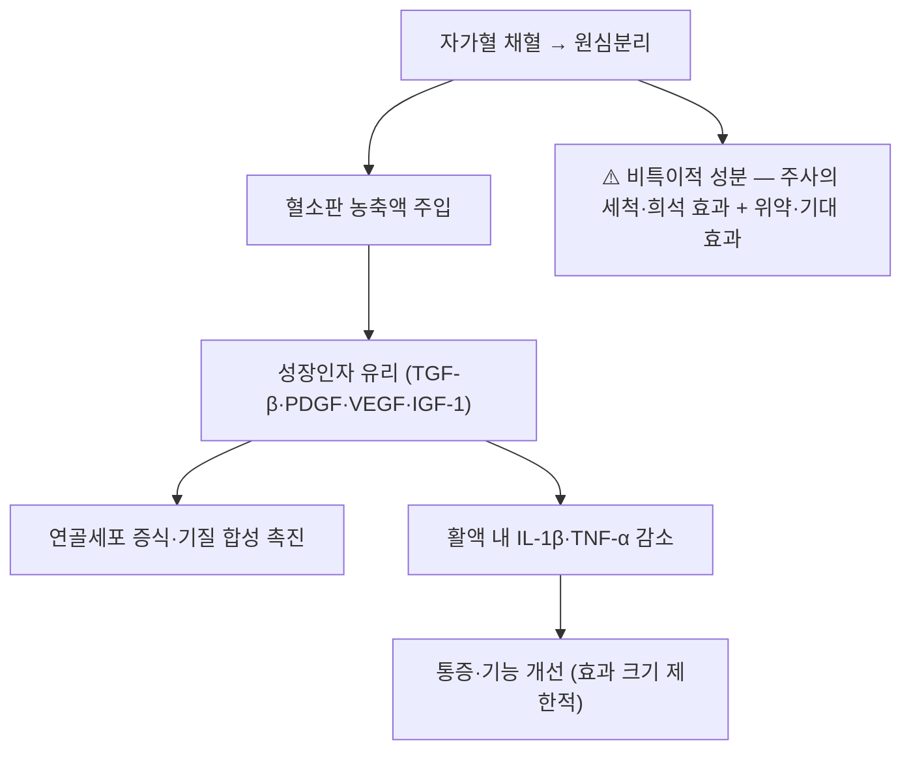

---
aliases:
  - PRP
  - Platelet-Rich Plasma
  - 자가 혈소판 농축 혈장
  - 혈소판 농축액
  - PRP 주사
tags:
  - 약리/양방약
  - 근골격
  - 주사제
  - 재생의학
  - 오르토바이올로직
---

# 💊 PRP (Platelet-Rich Plasma, 자가 혈소판 농축 혈장)

> **핵심 3줄 요약 (Key Summary)**:
> 🧪 주성분·제형: 환자 **자기 말초혈액을 원심분리해 혈소판을 농축**한 자가 주사제(제제·농축 배수·백혈구 함량에 따라 제품·기법이 이질적).
> 📍 작용 기전: 혈소판 과립에서 유리되는 **성장인자(TGF-β·PDGF·VEGF·IGF-1)** 가 항염·연골세포 증식·기질 합성을 촉진하고 활액 내 **IL-1β·TNF-α** 를 낮춘다 — 세포(줄기세포) 제제는 아니다.
> 🎯 임상 적응증: 힘줄병증·관절 내 주사 등 재생의학 영역의 보조 옵션. 2026-09-21 리뷰 3번(무릎 OA 네트워크 메타분석)에서는 **HA 대비 효과가 미미하거나 유의하지 않았고**(MD −0.3~−0.7), 모든 개선폭이 **[[MCID]] 미달**이었다.
> ⚠️ 주의사항: 자가혈이지만 **무균 조작·주사 자체의 합병증(감염·주사 후 통증)** 위험은 동일 — 혈소판 감소증·항응고제 복용·활성 감염은 상담 전 확인.

---

## 1. 약물 기본 정보 및 제형 (Brand Identification)

| 항목 | 상세 정보 |
| :--- | :--- |
| **일반명 (Generic Name)** | 자가 혈소판 농축 혈장 / Platelet-Rich Plasma (PRP) |
| **제조** | 말초혈 채혈(통상 20~60 mL) → 원심분리(1~2회) → 혈소판 농축 부분 분리 → 즉시 주입 |
| **분류** | 자가 유래 생물학적 주사제 — [[오르토바이올로직]] |
| **성상** | 혈소판 농도·백혈구 함량(leucocyte-rich/poor)·활성화 여부로 **분류가 갈리고 결과도 이질적** |
| **허가 상태** | 국내에서는 자가 채혈·주입 절차로 시행되는 경우가 많아 **기기·시술 인허가 범위와 허가 외 사용 여부를 사전 확인** |
| **비용** | 비급여·자가 부담 항목 — 상담 시 비용·반복 필요성 고지 |

### 1.1 무릎 골관절염에서의 위치 (2026-09-21 리뷰 3번 기준)
| 구분 | 내용 |
| :--- | :--- |
| **비교 결과** | SUCRA 순위 **4위(PRP)** — [[히알루론산]]보다 통계적 우위는 있었으나 폭이 작고(MD −0.3~−0.7) **MCID 미달** |
| **비교 대상** | SVF · BMAC · UC-MSC · HA — 세포 계열이 PRP보다 수치상 앞섰다 |
| **해석** | "PRP가 HA보다 낫다"는 표현은 **통계적 유의 ≠ 임상적 의미** 원칙으로 교정해 설명해야 한다 → [[MCID]] · [[네트워크 메타분석]] |

---

## 2. 분자 약리 기전 및 작용 경로 (Mechanism of Action)

- **성장인자 매개**: 혈소판 α과립에서 TGF-β·PDGF·VEGF·IGF-1 등이 유리되어 항염 작용과 연골세포 증식·기질 합성을 촉진하고, 활액 내 염증성 사이토카인(IL-1β·TNF-α)을 낮춘다 → [[TGF-β]] · [[VEGF]] · [[IGF-1]] · [[IL-1β]] · [[TNF-a]]
- **세포 없음**: PRP는 **세포 제제가 아니라 성장인자 전달체**다. 골수·지방 유래 세포를 쓰는 SVF·BMAC과 기전 층위가 다르다
- **한계**: 성장인자 농도·비율의 최적점이 규명되지 않았고, 활성화 방식에 따라 결과가 달라 **제제 간 이질성이 결론을 흐린다**

---

## 3. 약동학적 특성 (국소 주사 관점)

| 파라미터 | 임상적 의미 |
| :--- | :--- |
| **작용 시작** | 주입 후 수일 내 성장인자 유리 — 초기에는 염증 반응(통증 증가)이 동반될 수 있음 |
| **지속** | 성장인자 반감기는 짧으나 하류 신호·조직 반응으로 임상 효과가 수주~수개월 이어질 수 있다 |
| **전신 영향** | 자가 성분이라 전신 약리 상호작용은 거의 없다 |
| **반복** | 프로토콜별 1~3회 이상 — 반복 횟수의 근거는 확립되지 않았다 |

---

## 4. 임상 용법·용량 (Dosage & Administration)

| 적응 | 용법·용량 | 비고 |
| :--- | :--- | :--- |
| **무릎 골관절염(연구 맥락)** | 관절강 내 주입, 시험별 주입 횟수·용량 이질적 | 3·6·12개월 추적 시 [[KOOS]]·[[WOMAC]] 평가 |
| **힘줄병증(참고)** | 건 주위·건 내 주입 프로토콜이 다수 | 한의 영역에서는 [[건침]]·[[신경주위 주사요법]]과 병행 상담 |
| **실전 원칙** | **운동·체중 관리·교육이 기본축**, PRP는 중등도 관절염의 제한적 보조 옵션 | 단독 의존 금지 → [[퇴행성 슬관절염]] |

---

## 5. 부작용, 경고 및 상호작용 (Adverse Effects & Interactions)

- **주사 부위**: 통증·부종·멍, 주입 후 일시적 염증 반응(수일간 통증 증가 가능)
- **감염**: 자가혈이라도 **무균 조작 실패 시 관절 내 감염** 위험은 HA·CS와 동일
- **채혈 관련**: 혈관미주신경 반응(실신감), 채혈 부위 혈종
- **주의 환자**: 혈소판 감소증·혈액응고 이상, 항응고제 복용, 활동성 감염·악성종양 부위
- **금지 표현**: "내 피로 만든 주사라 부작용이 없다·연골이 재생된다" — 기전·근거 수준을 넘어선 단정이다

---

## 6. 한의 치료 연계 및 병용 (Integrative Medicine)

- **위치 정리**: ① 침·약침·한약으로 관절 국소 염증과 통증을 조절하고 ② 능동 운동(대퇴사두근 강화)으로 부하 적응을 만들며 ③ 주사는 **악화기에 운동 재개를 돕는 문**으로 배치한다
- **공통 교훈**: "관절강 내 침습적 국소 자극 자체의 비특이적 효과가 상당 부분을 차지한다" — **약침 운용에도 같은 논리를 적용**해 과대 기대를 조절한다 → [[오르토바이올로직]] · [[봉약침]]
- **병용 상담**: PRP와 약침·CS를 같은 세션에 동시 주입하는 근거는 없다 — 시점을 분리하고 반응을 각각 기록할 것

---

## 7. 💡 진료실 핵심 필기 & 임상 체크리스트

### 7.1 환자 상담 포인트
1. "혈소판 주사는 무릎 관절염 환자 2,960명을 모은 연구에서 윤활 주사보다 숫자상 조금 나았지만, 환자가 체감하는 기준에는 못 미쳤습니다."
2. "성장인자를 쓰는 주사이고 줄기세포 주사는 아닙니다 — 연골을 새로 만든다는 보장은 없습니다."
3. "비용과 시술 부담이 큰 주사일수록 이득이 확실한지 먼저 따져보는 것이 좋습니다."

### 7.2 체크리스트
- 채혈·원심분리·주입 전 과정 **무균·일회용 기구** 확인, 주입 전 혈관 흡인
- 시술 전 혈소판 수치·항응고제 복용·활동성 감염 확인
- 시술 후 3·6·12개월 [[KOOS]]·[[WOMAC]] · [[MCID]] 기준 재평가

---

## 8. 출처 및 학술 참고 문헌 (References)

- **2026-09-21 심층리뷰 3번** — Arthroscopy 2026, online ahead of print ([PMID: 42524752](https://pubmed.ncbi.nlm.nih.gov/42524752/) / DOI 10.1002/arj.70411): 무릎 OA RCT 24편·2,960명 네트워크 메타분석 — PRP는 HA 대비 통증 MD −0.3~−0.7로 효과가 미미하거나 비유의했고, SUCRA 4위. 모든 제제의 개선폭이 MCID 미달.
  - `[연구 요약]` PRP 제조법(농축 배수·백혈구 함량)이 시험마다 달라 하위 분석이 어렵다.
- 관련 개념: [[오르토바이올로직]] · [[히알루론산]] · [[퇴행성 슬관절염]] · [[MCID]] · [[네트워크 메타분석]]
