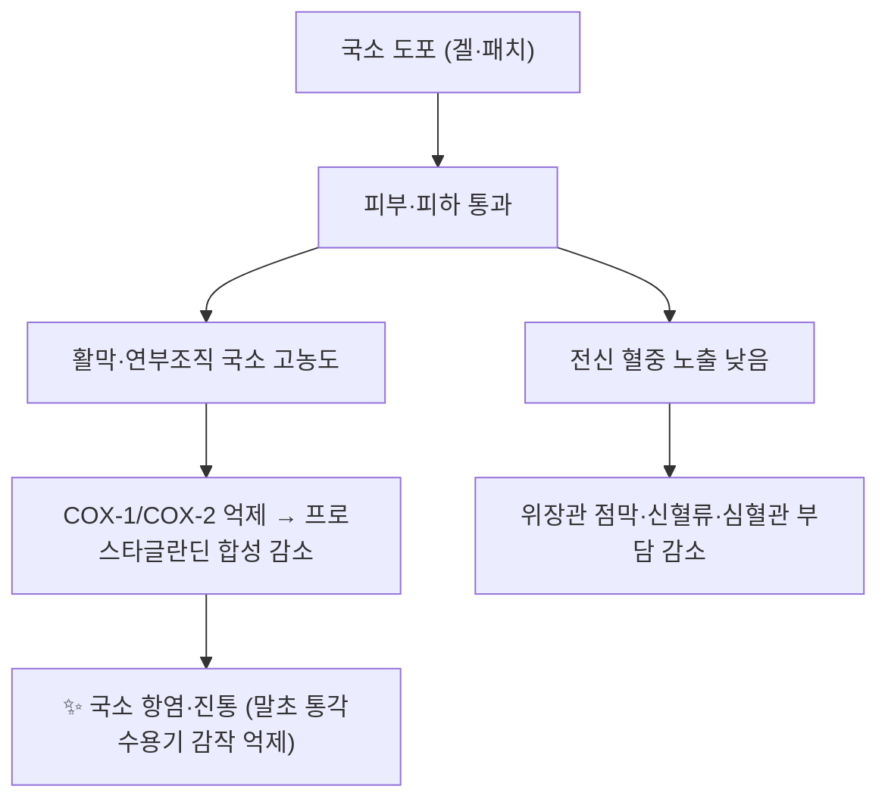

---
aliases:
  - 국소 NSAID
  - 국소 NSAIDs
  - topical NSAID
  - topical NSAIDs
  - 국소 소염진통제
  - 바르는 소염제
  - 바르는 소염진통제
  - 국소 비스테로이드성 소염진통제
tags:
  - 약리
  - 약리/양방약
  - NSAIDs
  - 국소제형
  - 근골격
  - 골관절염
title: 국소 NSAID
date: 2026-09-24
출처: "PMID: 34174454"
---
# 💊 국소 NSAID (Topical NSAIDs, 국소 비스테로이드성 소염진통제)

> **핵심 3줄 요약 (Key Summary)**:
> 🧪 주성분·제형: [[디클로페낙]]·케토프로펜·이부프로펜·나프록센·피록시캄 등을 **겔·크림·패치(플라스터)** 로 만든 국소 제형군. ATC 분류는 국소 항염제군(M02AA 계열)으로, 같은 성분이라도 경구 제형과 별도 코드로 관리된다.
> 📍 작용 기전: 피부를 통해 활막·연부조직에 국소적으로 높은 농도를 만들면서 **전신 혈중 노출을 낮춰** COX 억제에 의한 항염·진통은 유지하고 위장관·신장·심혈관 부작용을 줄이는 전략이다.
> 🎯 임상 적응증: 무릎·손 골관절염([[퇴행성 슬관절염]]) 등 **만성 근골격계 통증의 1차 국소 요법**. 2026-09-24 리뷰 3번 네트워크 메타분석에서 국소 NSAID는 [[아세트아미노펜]]보다 기능 개선이 우수하고 경구 NSAID와 동등했으며, 이상반응·1년 실사용 위해 지표는 가장 낮았다 (Osteoarthritis and Cartilage 2021, [PMID: 34174454](https://pubmed.ncbi.nlm.nih.gov/34174454/)).
> ⚠️ 주의사항: **전신 흡수가 있다** — 위장관 출혈 병력·심혈관 질환·신기능 저하·항응고제 병용 시 경구 NSAID와 동일한 주의가 필요하다. 도포 부위 접촉성 피부염·광과민, 손 씻기 교육 필수.

---

> [!warning] 이미지 미수록 표기 (2026-09-24)
> 양방약 노트 필수 3종 이미지(시판 패키지 / 블리스터·알약 성상 / 2D 분자 구조식)는 **첨부 실물의 시각 검증 후 수록** 원칙에 따라 본 회차에서는 미수록이다. 시판 제품 사진은 제품·제형별로 다르므로 임의 매칭하지 않았다 — 첨부 확보 시 추가한다.

---

## 1. 약물 기본 정보 및 시판 제품 (Brand Identification)

| 항목 | 상세 정보 |
| :--- | :--- |
| **계열 (Class)** | 국소 비스테로이드성 소염진통제(topical NSAIDs) — 국소 항염제 ATC M02AA 계열 |
| **대표 성분** | [[디클로페낙]](M02AA15), 케토프로펜(M02AA10), 이부프로펜(M02AA13), 나프록센(M02AA12), 피록시캄(M02AA07) |
| **제형** | 겔·크림·로션, 플라스터(패치), 스프레이 — 성분·제형별로 도포량·횟수가 다르다 |
| **국내 대표 제품** | [[디클로페낙]] 겔(예: 볼타렌 겔), 케토프로펜 패치(예: 케토톱) 등 — **제품 목록·허가사항은 식약처 의약품안전나라에서 확인**한다 |
| **허가 적응증** | 근골격계·관절·근육의 국소 염증성 통증 완화(제품별 허가사항 확인) |
| **사용 기간 제한(예)** | 디클로페낙 나트륨 겔 1%는 하지 1회 4 g·상지 2 g, 1일 4회, 일반의약품 기준 **최대 21일** (DailyMed 라벨) |

### 1.1 경구·국소 제형 비교 (2026-09-24 리뷰 3번 기준)

| 비교 항목 | 국소 NSAID | 경구 NSAID | [[아세트아미노펜]] |
| :--- | :--- | :--- | :--- |
| 무릎 OA 기능 개선 | 기준 | 동등(SMD 0.03) | 국소보다 열등(SMD −0.29) |
| 전신 노출 | 낮음 | 높음 | - |
| RCT 이상반응 | 가장 낮음 | 국소보다 높음(RR 0.46) | 국소보다 높음(RR 0.52) |
| 1년 실사용 위해 | 가장 낮음 | 국소보다 높음 | 국소보다 높음(사망 HR 0.59) |

---

## 2. 분자 약리 기전 및 작용 경로 (Mechanism of Action)

- 국소 제형의 핵심은 **농도 배치(compartmentalization)** 다 — 관절·연부조직에 유효 농도를 만들면서 혈장 농도를 낮게 유지해, [[COX]] 억제에 따른 항염 효과는 유지하고 전신 PG 의존 생리에 대한 개입을 줄인다 → [[프로스타글란딘]].
- [[아세트아미노펜]]은 주로 중추 COX 억제에 의존해 말초 항염 효과가 미미하다 — 이 차이가 기능 개선 지표의 서열(국소 NSAID > 아세트아미노펜)로 나타난 것으로 해석된다.
- 도포 부위의 피부 장벽·혈류·온도가 흡수량을 바꾼다 — 마사지·온열 병용은 흡수를 늘리지만 피부 자극도 늘린다.

---

## 3. 근거 (Evidence)

- 2026-09-24 리뷰 3번(베이지안 NMA 122편·47,113명 + 영국 THIN 실사용 코호트): 국소 NSAID는 [[아세트아미노펜]]보다 기능 개선 우수(SMD −0.29, 95% CrI −0.52~−0.06), 경구 NSAID와 동등(SMD 0.03). 이상반응 위험은 국소가 가장 낮았고(아세트아미노펜 대비 RR 0.52, 경구 대비 RR 0.46), 1년 실사용에서 사망(HR 0.59)·심혈관질환(0.73)·위장관 출혈(0.53) 위험이 낮았다.
- Cochrane 체계적 고찰(만성 근골격계 통증): 국소 NSAID가 위약 대비 통증·기능을 개선하며, 국소 이상반응(피부 자극)은 흔하나 전신 이상반응은 경구보다 적다 [PMID: 27103611](https://pubmed.ncbi.nlm.nih.gov/27103611/).
- 국소 디클로페낙 제형 비교 메타분석: 제형(겔·용액·패치) 간 단기·장기 효과 차이를 정리했다 [PMID: 40065343](https://pubmed.ncbi.nlm.nih.gov/40065343/).
- 무릎 OA 국소 디클로페낙 나트륨 겔 RCT: 국소 제형이 위약 대비 통증·기능을 개선한 실증 사례다 [PMID: 19932833](https://pubmed.ncbi.nlm.nih.gov/19932833/).
- 가이드라인 위치: [[OARSI 2019 가이드라인]]은 무릎 골관절염에서 국소 NSAID를 **강하게 권고**하고, [[아세트아미노펜]]은 조건부 비권고, 오피오이드는 강력 비권고로 정리했다 [PMID: 31278997](https://pubmed.ncbi.nlm.nih.gov/31278997/).

---

## _의학/04_임상 적용 (Clinical Use)

- 1차 선택 상황: 노인, 위장관 출혈·궤양 병력, 심혈관 위험, 신기능 저하, 다약제 복용, 경구 NSAID 부작용 이력 — **무릎·손 관절 통증에서 우선 제안**한다.
- 경구 NSAID의 위치: 국소 요법에 반응이 부족할 때 **최소 유효용량·최단기간**으로 한정하고, 위장관 동반질환이 있으면 COX-2 억제제 또는 PPI 병용을 고려한다.
- 사용법 교육(성패를 좌우): ① 도포량·횟수(제품 허가사항) ② 도포 후 **손 씻기** ③ 눈·점막 접촉 회피 ④ 상처·습진 부위 회피 ⑤ 효과 판정 시점(통상 1~2주) 제시.
- 반응 판정: 2주 내 개선이 없으면 계열·제형 전환 또는 다른 축(운동·체중·관절 내 주사·침·약침)으로 이동한다.
- 병용 원칙: 침·[[약침]] 치료 중인 환자가 국소 NSAID를 병용하는 것은 실무적으로 문제가 적으나, 항응고·항혈소판제 복용자에서는 멍·출혈 위험이 겹칠 수 있어 시술 부위 피부 상태와 출혈 경향을 함께 확인한다.

---

## 5. 주의·금기 (Cautions & Contraindications)

- **전신 흡수**: 국소라도 위장관 출혈 병력, 심혈관 질환, 신기능 저하, 항응고제 병용 환자에서는 경구 NSAID와 동일한 주의가 필요하다.
- **피부**: 접촉성 피부염·소양감·발진이 흔하다 — 지속 시 중단. 광과민(햇빛 노출 부위) 보고가 있어 도포 부위 자외선 노출을 피한다.
- **금기**: 손상된 피부·감염 부위, 눈·점막 주위, NSAID 과민(아스피린 삼중징후 등) 환자.
- **임신·수유부**: 3분기 회피 등 경구 NSAID와 동일 원칙을 적용하고 제품 허가사항을 확인한다.
- **제형별 차이**: 패치형은 부착 시간·면적이, 겔형은 도포량이 노출을 결정한다 — **"국소니까 안전하다"는 일반화는 금지**한다.

---

## 6. 진료실 상담 포인트 (요약 멘트)

- "바르는 소염제는 먹는 소염제와 효과가 비슷하면서 위장 출혈·심장·사망 위험은 더 낮게 보고됐습니다. 그래서 어르신이나 위장·심장이 약한 분은 바르는 쪽부터 시작합니다."
- "다만 피부를 통해 일부는 흡수되므로, 항응고제를 드시거나 신장이 약하면 미리 말씀해 주셔야 합니다. 손에 바른 뒤에는 꼭 씻고 눈을 만지지 마세요."
- "2주 써도 차이가 없으면 계속 늘리지 말고 다른 방법으로 바꾸는 게 맞습니다."

---

## 7. 출처 (References)

1. **2026-09-24 심층리뷰 3번**: Osteoarthritis and Cartilage 2021;29(9):1242-1251, [PMID: 34174454](https://pubmed.ncbi.nlm.nih.gov/34174454/) · DOI [10.1016/j.joca.2021.06.004](https://doi.org/10.1016/j.joca.2021.06.004)
   - [연구 요약] 국소 NSAID가 [[아세트아미노펜]]보다 기능 개선이 우수하고 경구 NSAID와 동등하며, 이상반응·1년 실사용 위해 지표가 가장 낮다는 것을 RCT NMA + 실사용 코호트로 보여준 근거다.
2. **Derry S, et al.** Topical NSAIDs for chronic musculoskeletal pain in adults. *Cochrane Database Syst Rev*. 2016;4:CD007400. [PMID: 27103611](https://pubmed.ncbi.nlm.nih.gov/27103611/)
   - [연구 요약] 만성 근골격계 통증에서 국소 NSAID의 진통·기능 개선 근거를 정리한 Cochrane 고찰이다.
3. **Topical diclofenac formulations for knee osteoarthritis: a meta-analysis.** *BMC Musculoskeletal Disorders*. 2025;26(1):230. [PMID: 40065343](https://pubmed.ncbi.nlm.nih.gov/40065343/)
   - [연구 요약] 국소 디클로페낙 제형 간 단기·장기 유효성·안전성을 비교해 제형 선택의 실무 근거를 제공한다.
4. **Bello AE, et al.** Randomized controlled trial of diclofenac sodium gel in knee osteoarthritis. *Semin Arthritis Rheum*. 2009;39(3):203-212. [PMID: 19932833](https://pubmed.ncbi.nlm.nih.gov/19932833/)
   - [연구 요약] 국소 디클로페낙 겔이 무릎 OA 통증·기능을 위약 대비 개선한 RCT다.
5. **Bannuru RR, et al.** OARSI guidelines for the non-surgical management of knee, hip, and polyarticular osteoarthritis. *Osteoarthritis Cartilage*. 2019;27(11):1578-1589. [PMID: 31278997](https://pubmed.ncbi.nlm.nih.gov/31278997/)
   - [연구 요약] 무릎 골관절염에서 국소 NSAID 강한 권고, 아세트아미노펜 조건부 비권고, 오피오이드 강력 비권고를 제시한 국제 가이드라인이다.
6. **DailyMed 라벨(디클로페낙 나트륨 국소겔 1%)**: https://dailymed.nlm.nih.gov/dailymed/fda/fdaDrugXsl.cfm?setid=e9ccaf95-582b-4d4d-938f-7577eaa8dffb — 하지 4 g·상지 2 g, 1일 4회, 일반의약품 최대 21일 등 실제 도포 용량 근거.

---

## 🔗 함께 보기

- 성분·제품: [[디클로페낙]] · [[NSAIDs]] · [[이부프로펜]] · [[나프록센]] · [[아세트아미노펜]] · [[NSAIDs]]
- 질환: [[퇴행성 슬관절염]] · [[요추 골관절염]] · [[만성 요통]]
- 기전: [[COX]] · [[프로스타글란딘]] · [[PGE2]]
- 근거·평가: [[OARSI 2019 가이드라인]] · [[네트워크 메타분석]] · [[성향점수 매칭]] · [[SMD(표준화 평균차)]] · [[MCID]]
- 병용: [[약침]] · [[전침]] · [[TENS]] · [[운동요법]]
- 관련 리뷰: [[2026-09-24_통합의학약리학_심층리뷰]] 3번 · [[2026-09-24_통합의학약리학_개념학습]]
