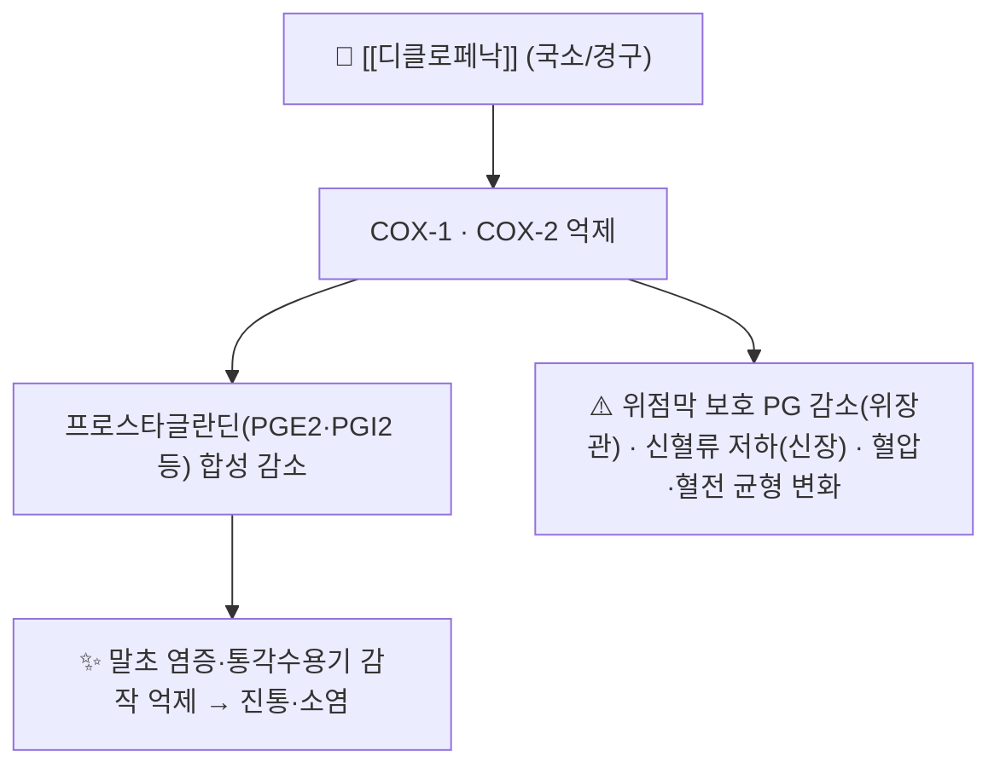

---
aliases:
  - 디클로페낙
  - Diclofenac
  - 디클로페낙나트륨
  - 디클로페낙 나트륨
  - 디클로페낙디에틸아민
  - Diclofenac sodium
  - Diclofenac diethylamine
  - 볼타렌
  - 디클로
  - M01AB05
  - M02AA15
tags:
  - 약리
  - 약리/양방약
  - NSAIDs
  - 해열진통소염제
  - 근골격
  - 국소제형
title: 디클로페낙
date: 2026-09-24
출처: "PMID: 34174454"
---
# 💊 [[디클로페낙]] (Diclofenac, ATC M01AB05 / 국소 M02AA15)

> **핵심 3줄 요약 (Key Summary)**:
> 🧪 주성분·제형: 아세트산 계열 비스테로이드성 소염진통제로, **경구(정제·서방정)·주사·국소(겔·패치)** 제형이 모두 허가되어 있다 — 같은 성분이지만 **제형에 따라 전신 노출과 위험 프로파일이 다르다**.
> 📍 작용 기전: [[COX]]-1/COX-2 억제로 프로스타글란딘 합성을 줄여 항염·진통·해열 작용을 낸다. [[아세트아미노펜]]보다 말초 항염 효과가 뚜렷하다.
> 🎯 임상 적응증: 무릎·손 골관절염([[퇴행성 슬관절염]])을 포함한 염증성·퇴행성 근골격계 통증. 국소 제형은 2026-09-24 리뷰 3번에서 **경구와 효과는 동등하고 전신 위해는 낮은** 선택지로 정리됐다 (Osteoarthritis and Cartilage 2021, [PMID: 34174454](https://pubmed.ncbi.nlm.nih.gov/34174454/)).
> ⚠️ 주의사항: 위장관 점막 손상·출혈, 신기능 저하, 심혈관 위험, **간효소 상승 보고**가 있다 — 위험군에서는 '최소 유효용량·최단기간', 그리고 국소 제형 우선을 검토한다.

---

> [!warning] 이미지 미수록 표기 (2026-09-24)
> 양방약 노트 필수 3종 이미지(시판 패키지 / 블리스터·알약 성상 / 2D 구조식)는 첨부 실물의 시각 검증 후 수록 원칙에 따라 본 회차에서는 미수록이다. 분자 구조는 아래 PubChem 3D 뷰어(실제 CID)로 대체 확인한다.

---

## 1. 약물 기본 정보 및 시판 제품 (Brand Identification)

> [!abstract]+ 🧪 3D 약리 분자 구조 (Interactive 3D Viewer)
> <iframe src="https://molecule-viewer-rho.vercel.app/?cid=3033" width="100%" height="450px" frameborder="0" allow="webgl" style="border-radius: 8px;"></iframe>

| 항목 | 상세 정보 |
| :--- | :--- |
| **일반명 (Generic Name)** | 디클로페낙(한글) / Diclofenac |
| **대표 상품명·제형** | 국소 겔(예: 볼타렌 겔), 패치·플라스터, 경구 정제·서방정, 주사제 — **제품·함량은 허가사항 확인** |
| **ATC 코드 / 분류** | 경구·전신 **M01AB05**, 국소 **M02AA15**(국소 항염제) — WHO ATC/DDD Index 기준 |
| **PubChem CID** | [3033](https://pubchem.ncbi.nlm.nih.gov/compound/3033) |
| **분자식 / 분자량** | C14H11Cl2NO2 / 296.1 g/mol |
| **IUPAC 명칭** | 2-[2-(2,6-dichloroanilino)phenyl]acetic acid |
| **식약처 허가 적응증** | 염증성·퇴행성 근골격계 질환의 소염·진통(제형별 허가사항 확인) |
| **국소 제형 허가 용법(예)** | 디클로페낙 나트륨 겔 1%: 하지 1회 4 g·상지 2 g, 1일 4회, 일반의약품 기준 최대 21일 (DailyMed 라벨) |

### 1.1 같은 계열 내 위치 (2026-09-24 리뷰 3번 기준)
| 구분 | 내용 |
| :--- | :--- |
| **국소 대표 성분** | 디클로페낙(M02AA15) — 무릎·손 OA 국소 요법의 중심 |
| **동반 국소 성분** | 케토프로펜(M02AA10), 이부프로펜(M02AA13), 나프록센(M02AA12), 피록시캄(M02AA07) |
| **경구 대안** | [[이부프로펜]] · [[나프록센]] · [[세레콕시브]] 등 → [[NSAIDs]] |
| **국소 vs 경구** | 기능 개선은 동등, 전신 위해는 국소가 낮음 — 환자 위험도에 따라 제형을 고른다 → [[국소 NSAID]] |

---

## 2. 분자 약리 기전 및 작용 경로 (Mechanism of Action)

- 비선택적 COX 억제제로 분류되며, COX-2 상대 선택성은 성분·용량에 따라 다르다 → [[COX]] · [[프로스타글란딘]].
- 국소 제형은 관절 조직에 국소 농도를 만들고 혈장 농도를 낮춰, 같은 COX 억제라도 **전신 위험을 줄이는 배치**를 노린다.

---

## 3. 약동학 (ADME 요약)

- 경구: 위장관에서 빠르게 흡수되고, 간에서 주로 **CYP2C9** 등으로 대사된다 — CYP2C9 기질 약물(와파린 등)과의 상호작용 확인이 필요하다.
- 국소: 피부 흡수 후 전신 노출은 경구보다 낮으나 **0이 아니다** — 항응고제·신기능 저하 환자에서는 경구와 같은 주의 원칙이 적용된다.
- 소실: 대사체 대부분이 소변·담즙으로 배설된다 — 신기능·간기능 저하 환자 용량 조정을 검토한다.

---

## 의학/04_임상 적용 (Clinical Use)

- 1차 선택: 국소 제형 — 국소 NSAID 계열이 [[아세트아미노펜]]보다 기능 개선이 우수하고 경구 NSAID와 동등하며 이상반응·장기 위해는 낮았다(09-24 리뷰 3번).
- 경구 사용 시 원칙: **최소 유효용량·최단기간**, 위장관 위험군에서는 PPI 병용 또는 COX-2 억제제로 전환, 심혈관·신기능 위험군에서는 회피 우선.
- 도포 교육: 제품별 도포량·횟수 준수, 도포 후 손 씻기, 점막·상처 회피, 도포 부위 자외선 노출 회피, 2주 반응 판정.
- 병용: 침·[[약침]]과 병용은 가능하나 항응고·항혈소판제 복용자는 출혈 위험을 함께 평가한다.
- 감량·중단: 통증이 2주 이상 안정되면 필요 시 단계적으로 감량하고, 다른 축([[운동요법]]·체중 관리·관절 내 주사)으로 이행한다.

---

## 5. 부작용·상호작용·금기

- **위장관**: 소화불량·상복부 통증·궤양·출혈 — 고령, 궤양 병력, 항응고제 병용 시 위험 상승.
- **신장**: 신혈류 감소로 급성신손상·부종·혈압 상승 가능 — 탈수·이뇨제 병용·만성콩팥병 환자에서 주의.
- **심혈관**: 비스테로이드성 소염진통제 계열 전체에 해당하는 위험 — 관상동맥질환·심부전 환자에서는 신중 또는 회피.
- **간**: 간효소 상승 보고 — 장기 복용 시 간기능 확인.
- **상호작용**: 항응고·항혈소판제(출혈 위험), RAS 차단제·이뇨제(신기능·혈압), 리튬·메토트렉세이트(혈중농도 상승 가능), CYP2C9 기질 약물.
- **금기**: NSAID 과민(아스피린 삼중징후), 활동성 소화성 궤양·출혈, 심한 신·간기능 저하, 임신 3분기 등(허가사항 확인).

---

## 6. 진료실 상담 포인트 (요약 멘트)

- "무릎·손 관절 통증에는 바르는 디클로페낙부터 권합니다. 연구에서 바르는 소염제는 먹는 소염제와 효과가 비슷하면서 위장 출혈·심장·사망 위험은 더 낮았습니다."
- "먹는 약은 꼭 필요할 때 최소 용량·최단 기간만 씁니다. 위가 약하거나 심장·신장이 나쁘면 미리 알려주세요."
- "주무르면서 바르면 흡수는 늘지만 피부 자극도 늘어납니다. 바른 뒤 손을 씻고 눈을 만지지 마세요. 2주 써도 차이가 없으면 바꾸는 게 맞습니다."

---

## 7. 출처 (References)

1. **2026-09-24 심층리뷰 3번**: Osteoarthritis and Cartilage 2021;29(9):1242-1251, [PMID: 34174454](https://pubmed.ncbi.nlm.nih.gov/34174454/) · DOI [10.1016/j.joca.2021.06.004](https://doi.org/10.1016/j.joca.2021.06.004)
   - [연구 요약] 국소 NSAID 계열이 [[아세트아미노펜]]보다 우수하고 경구 NSAID와 동등하며, 전신 위해가 가장 낮다는 계열 수준 근거를 제시했다 — 개별 약물·용량은 별도 확인이 필요하다.
2. **Bello AE, et al.** Randomized controlled trial of diclofenac sodium gel in knee osteoarthritis. *Semin Arthritis Rheum*. 2009;39(3):203-212. [PMID: 19932833](https://pubmed.ncbi.nlm.nih.gov/19932833/)
   - [연구 요약] 국소 디클로페낙 겔의 무릎 OA 진통·기능 개선을 위약과 비교한 RCT다.
3. **Topical diclofenac formulations for knee osteoarthritis: a meta-analysis.** *BMC Musculoskeletal Disorders*. 2025;26(1):230. [PMID: 40065343](https://pubmed.ncbi.nlm.nih.gov/40065343/)
   - [연구 요약] 국소 디클로페낙의 제형(겔·용액·패치)별 단기·장기 효과와 안전성을 비교한 메타분석이다.
4. **WHO ATC/DDD Index**: M01AB05(diclofenac, 전신) · M02AA15(diclofenac, 국소) — https://atcddd.fhi.no/atc_ddd_index/?code=M01AB05
   - [공인 데이터] 디클로페낙의 전신·국소 ATC 코드 및 정의 확인.
5. **PubChem CID 3033**: https://pubchem.ncbi.nlm.nih.gov/compound/3033 — 분자식 C14H11Cl2NO2, 분자량 296.1, IUPAC 명칭 확인.
6. **DailyMed 라벨(디클로페낙 나트륨 국소겔 1%)**: https://dailymed.nlm.nih.gov/dailymed/fda/fdaDrugXsl.cfm?setid=e9ccaf95-582b-4d4d-938f-7577eaa8dffb — 국소 제형 허가 용법·도포량·기간.
7. 경구 용법·용량·상호작용 등 세부 수치는 **제품 허가사항(식약처 의약품안전나라)** 확인을 원칙으로 하며, 본 노트에는 확인되지 않은 수치를 기재하지 않았다.

---

## 🔗 함께 보기

- 계열·비교: [[국소 NSAID]] · [[NSAIDs]] · [[아세트아미노펜]] · [[이부프로펜]] · [[나프록센]] · [[세레콕시브]]
- 질환: [[퇴행성 슬관절염]] · [[요추 골관절염]] · [[만성 요통]]
- 기전: [[COX]] · [[프로스타글란딘]] · [[PGE2]] · [[COX-1]]
- 근거·평가: [[OARSI 2019 가이드라인]] · [[네트워크 메타분석]] · [[MCID]]
- 병용: [[약침]] · [[전침]] · [[운동요법]]
- 관련 리뷰: [[2026-09-24_통합의학약리학_심층리뷰]] 3번 · [[2026-09-24_통합의학약리학_개념학습]]
