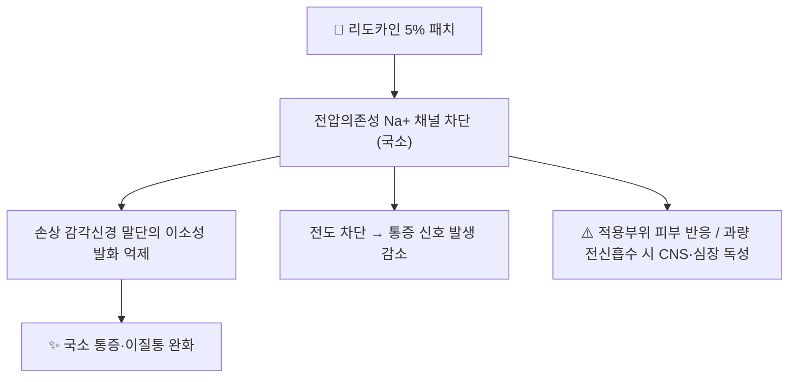

# 💊 리도카인 (Lidocaine, 국소 패치 5%)

> **핵심 3줄 요약 (Key Summary)**:
> 🧪 주성분·제형: 아미드형 국소마취제. **5% 플라스터(패치, 700 mg/매)**, 1.8% 국소 시스템, 크림·겔·주사액(1~2%) 등.
> 📍 작용 기전: **전압의존성 Na⁺ 채널 차단**으로 손상·과흥분 감각신경 말단의 이소성 발화와 말초감작을 억제 — 국소 작용 중심.
> 🎯 임상 적응증(5% 패치): **대상포진후신경통(PHN) 국소 통증**, 국소성 신경병증성 통증의 보조.
> ⚠️ 주의사항: **1일 최대 3매·한 번에 최대 12시간**(12시간 붙이고 12시간 떼는 용법), 적용 부위 피부 반응·전신 흡수 누적 주의, 간기능 저하 시 감량.

---

## 1. 약물 기본 정보 및 시판 제품 (Brand Identification)

> [!abstract]+ 🧪 3D 약리 분자 구조 (Interactive 3D Viewer)
> <iframe src="https://molecule-viewer-rho.vercel.app/?cid=3676" style="width: 100%; height: 600px; border: none; border-radius: 12px; box-shadow: 0 4px 20px rgba(0,0,0,0.15);" allowfullscreen></iframe>

| 항목 | 상세 정보 |
| :--- | :--- |
| **일반명** | 리도카인(Lidocaine) — 아미드형 국소마취제 |
| **대표 상품명** | **리도카인 5% 플라스터(국내 제네릭 다수)**, 해외 Lidoderm·Dermalid(5% 패치), Ztlido(1.8% 국소 시스템) |
| **주요 제형** | 5% 플라스터(700 mg/매, 10×14 cm), 1.8% 국소 시스템, 0.5~2% 주사액, 크림·젤 |
| **허가 적응증(국소 제형)** | PHN 후 국소 통증 완화 등 — 제품별 허가사항 확인 |

### 1.1 임상 사용 위치 (2026-09-18 근거 기준)
- NeuPSIG 2025 개정 권고(PMID 40252663): **2차 치료(약한 권고)** — **리도카인 5% 플라스터 NNT 14.5(95% CI 7.8~108.2, 근거확실성 very low)**. 신뢰구간이 매우 넓어 **효과 정밀도가 낮음**
- 실무적 강점: **NNH가 매우 낮아(전신 부작용 드묾)** 노인·다약제 환자, 신경병증성 통증 1차 약물을 견디지 못하는 환자의 **안전한 대안**

---

## 2. 분자 약리 기전 및 작용 경로 (Mechanism of Action)

* **기전**: 무수·유수 감각신경 말단의 **Na⁺ 채널(특히 Nav1.7 등)을 차단**해 과흥분된 말초 신경의 자발 발화와 말초감작을 억제한다 → [[말초 감작]]·[[TRPV1]] 노트의 '말초 치료' 축
* **국소 우선 원리**: 작용이 말초에 국한되므로 전신 진통제의 부작용(진정·어지럼·변비)을 피할 수 있다. 단, **중추성·광범위 통증에는 효과가 제한**된다
* **다른 마취제와의 구분**: 아미드형(리도카인·부피바카인)은 간 대사, 에스테르형(프로카인)은 혈장 콜린에스터라제 대사 — 알레르기 병력 청취 시 구분 필요

---

## 3. 약동학적 특성 (Pharmacokinetics)

| 파라미터 | 수치 및 임상적 의미 |
| :--- | :--- |
| **전신 흡수율(5% 패치)** | 적용 용량의 **약 3±2%** 만 흡수 — 대부분(≥95%) 패치에 잔류 |
| **최고 혈중농도** | 3매·12시간 적용 시 평균 약 **0.13 mcg/mL**(항부정맥 치료농도의 약 1/10) |
| **단백결합률** | 약 70%(주로 α1-산성당단백) — **저단백 상태에서 유리형 증가** |
| **분포용적** | 0.7~2.7 L/kg(정맥 투여 기준) |
| **대사** | 간(CYP1A2·3A4 등) → 모노에틸글리신자일리디드(MEGX)·글리신자일리디드(GX) |
| **주의** | **간기능 저하·심부전·쇠약 환자는 전신 축적 위험** → 적용 면적·매수 축소 |

※ 수치는 DailyMed(LIDODERM 5% 패치) 허가사항 인체 약동학 자료 기준.

---

## _의학/04_임상 용법·용량 및 처방 가이드 (Dosage & Administration)

| 적응증 | 표준 용법 | 비고 |
| :--- | :--- | :--- |
| **PHN·국소 신경병증성 통증** | **1일 1회, 최대 3매, 최대 12시간 적용** (12시간 on / 12시간 off) | 통증이 심한 부위의 **온전한 피부**에 부착, 필요 시 가위로 재단 가능 |
| **쇠약·간기능 저하 환자** | 적용 면적·매수 축소 | 전신 축적 위험 |
| **크림·겔(2~4%)** | 삽입·시술 전 국소마취 등 목적별 상이 | 시술 용도는 제품 허가사항 확인 |

- **금기·주의**: 손상 피부·감염 부위 부착 금지, 점막·눈 주위 사용 금지, 부착 중 발진·작열감 발생 시 제거 후 회복까지 재부착하지 않는다
- **과량 신호**: 입 주위 저림·이명·어지럼·경련 → **전신 독성(CNS 흥분→억제, 심장 전도 억제)** 의심 시 즉시 제거·평가

---

## 5. 부작용, 경고 및 약물 상호작용 (Adverse Effects & Interactions)

### 5.1 주요 부작용
* **국소**: 적용부위 발진·홍반·부종·작열감·소양감 (가장 흔함)
* **전신(드물지만 중대)**: 어지럼·졸림·입 저림·이명, 과량에서 **경련·호흡억제·심정지**
* **특수 인구**: 간기능 저하·심부전·고령·저체중에서 독성 역치 하강

### 5.2 주요 병용 주의
* **다른 국소마취제·항부정맥제(멕실레틴·아미달론 등) 병용**: 심장 전도 억제 가산
* **CYP1A2·3A4 저해제**: 리도카인 혈중농도 상승 가능
* **국소제 병용 중첩**: 같은 부위에 캡사이신·기타 국소제를 겹쳐 쓰지 않는다 → [[캡사이신]]

---

## 6. 한의 치료 연계 및 병용 (Integrative Medicine)

* **적응 배분**: 국소성·표재성 통증(절개·천자 부위, 국소 PHN, 늑간부) → 패치 우선. 심부·분절성 통증 → 침·전침·약침 병행이 합리적
* **자극 중첩 회피**: 패치 부착 부위에 그대로 자침·전침 전극·뜸을 겹치지 않는다 — 감각이 둔해져 자극 강도를 과도하게 올리는 사고를 예방
* **시술 보조 활용**: 신경주위 주사·약침 시술 전 국소마취가 필요할 때 제품 허가사항(적응·부위)을 확인하고 사용 → [[신경주위 주사요법]]
* **감량 설계**: 리도카인 패치로 국소 통증이 조절되는 동안 경구 진통제(α2δ 리간드·SNRI)를 단계적으로 감량 → [[프레가발린]]·[[둘록세틴]]

---

## 7. 💡 진료실 핵심 체크리스트

### 7.1 처방 전 확인
1. **피부 상태**: 온전한 피부인가(손상·감염·발진 부위 금지)
2. **적용 면적·매수**: 1일 최대 3매·12시간 원칙, 쇠약·간기능 저하 환자는 축소
3. **병용 약물**: 항부정맥제·다른 국소마취제·CYP 저해제 여부
4. **과량 신호 교육**: 입 저림·이명·어지럼 시 즉시 제거

### 7.2 환자 티칭 스크립트
> *"이 패치는 붙이는 부위의 통증 신경만 국소적으로 진정시키는 방법입니다. 하루 한 번, 최대 3장까지 12시간 붙이고 나머지 12시간은 떼어둡니다. 먹는 약과 달리 어지럽거나 졸린 부작용이 거의 없어 노인분이나 약을 여러 개 드시는 분께 좋습니다. 다만 피부가 붉어지거나 따가우면 떼어내시고, 상처나 진물이 있는 곳에는 붙이지 마십시오. 효과는 크지 않을 수 있지만 안전하게 쓸 수 있는 선택입니다."*

---

## 8. 출처 및 학술 참고 문헌 (References)

* **FDA 허가사항(LIDODERM 리도카인 5% 패치, DailyMed)** — 용법: 통증 부위 온전한 피부에 **최대 3매, 24시간 내 최대 12시간 1회 적용**; 약동학: 3매 12시간 적용 시 흡수 약 3±2%·Cmax 약 0.13 mcg/mL·단백결합 약 70%
* MedlinePlus — 리도카인 경피 패치(5%·1.8%) **12시간 on/12시간 off, 최대 3매** 환자 안내 정보
* 2026-09-18 심층리뷰 2번 — NeuPSIG 2025 개정 권고(Lancet Neurol 2025;24(5):413-428, PMID 40252663): **리도카인 5% 플라스터 NNT 14.5(95% CI 7.8~108.2), 근거확실성 very low**

<!-- 보관 태그(1회용·링크오류, 필요시 복원): 국소마취제, 나트륨채널 -->
