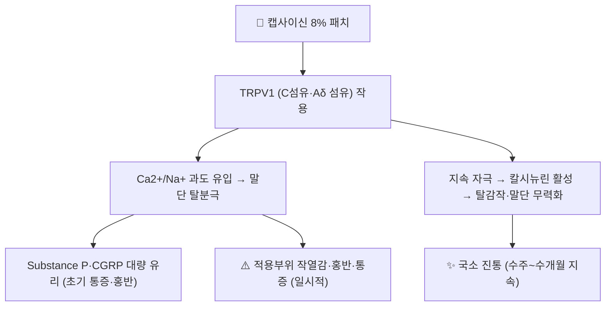

# 💊 캡사이신 (Capsaicin, Qutenza 8% 패치)

> **핵심 3줄 요약 (Key Summary)**:
> 🧪 주성분·제형: 고추(Capsicum) 유래 **TRPV1 작용제**. **8% 국소 패치(topical system, 640 mcg/cm²·1매 179 mg)**, 0.025~0.125% 크림/로션.
> 📍 작용 기전: 감각 C섬유의 **[[TRPV1]]을 과자극 → 가역적 탈감작**시켜 통각수용기 말초감작을 직접 차단(리간드 작용 후 무력화).
> 🎯 임상 적응증: **대상포진후신경통(PHN)**, **당뇨병성 말초신경병증(DPN) — 발 부위**(8% 패치 허가 적응증), 국소 통증 크림 보조.
> ⚠️ 주의사항: **적용 자체가 통증·홍반**을 유발(홍반 63%·적용부위 통증 42%) — 적용 전 국소마취가 권장되고, **얼굴·점막·두피 금지**, 손상 피부 금지, 적용 후 수일간 열 노출 주의.

---

## 1. 약물 기본 정보 및 시판 제품 (Brand Identification)

| 항목 | 상세 정보 |
| :--- | :--- |
| **일반명** | 캡사이신(Capsaicin) — 합성 등가물 사용 |
| **대표 상품명** | **큐텐자 8% 패치(Qutenza)**, 크림·로션 제네릭 다수(0.025~0.1%) |
| **ATC 분류** | 국소 진통제 계열(캡사이신 성분) — 제품별 허가사항 확인 |
| **주요 제형** | 8% 국소 패치(179 mg/매), 0.025%·0.075%·0.125% 크림 |
| **허가 적응증(8% 패치)** | **PHN(대상포진후신경통)**, **DPN(당뇨병성 말초신경병증)의 발 부위 통증** |

### 1.1 임상 사용 위치 (2026-09-18 근거 기준)
- NeuPSIG 2025 개정 권고(PMID 40252663): **2차 치료(약한 권고)** — **캡사이신 8% 패치 NNT 13.2(95% CI 7.6~50.8, 근거확실성 moderate)**, 캡사이신 크림 NNT 6.1(3.1~∞, very low). 2015년판에서 캡사이신 크림이 '근거 불충분' → **2차로 승격**
- 실무적 강점: **전신 부작용·약물상호작용이 적어** 노인·다약제 복용 환자의 1차 대안이 된다

---

## 2. 분자 약리 기전 및 작용 경로 (Mechanism of Action)

* **주요 기전**: TRPV1(43℃ 이상 열·산성·캡사이신에 반응하는 양이온 채널)을 강하게 자극 → 감각신경 말단의 **탈감작(desensitization)** 과 [[Substance P]]·[[CGRP]] 고갈로 통각 전달이 차단된다. **원인이 말초에 있는 통증**(국소 신경병증성 통증)에서 논리적이며, **중추성 통증에는 한계**
* **초기 통증이 기전의 일부**: 적용 직후 작열감·홍반은 약리작용의 정상 반응 — 사전 국소마취·냉각으로 완화
* **지속 기간**: 단회 적용 후 진통이 수주~수개월 유지되어 **3개월 간격 재적용**이 허가 용법

---

## 3. 약동학적 특성 (Pharmacokinetics)

| 파라미터 | 임상적 의미 |
| :--- | :--- |
| **전신 흡수** | 60분 적용 시 약 1/3 환자에서 미량(<5 ng/mL) 검출 — **전신 노출이 매우 낮다**(전신 부작용 적음) |
| **최고 혈중농도** | 최대 4.6 ng/mL 수준(적용 제거 직후) |
| **대사·배설** | 국소 작용이 주 — 전신 약동학은 임상적으로 제한적 의미 |
| **임상 함의** | 간·신 기능 저하·다약제 환자에서 **용량 조절 부담이 적다** (국소 자극 내약성은 별개) |

---

## 4. 임상 용법·용량 및 처방 가이드 (Dosage & Administration)

| 적응증 | 허가 용법 (8% 패치) | 비고 |
| :--- | :--- | :--- |
| **PHN** | 최대 **4매를 60분간 단회 적용** | 3개월마다 반복(통증 재발 시, 3개월보다 자주는 금지) |
| **DPN(발)** | 최대 **4매를 발에 30분간 단회 적용** | 동일하게 3개월 간격 |
| **크림(0.025~0.125%)** | 하루 3~4회 국소 도포, 수주간 사용 | 작열감으로 순응도가 낮을 수 있음 |

- **시술 전**: 적용 부위 **국소마취(리도카인 등)와 냉각**을 시행하고, 니트릴 장갑 착용(라텍스 아님)
- **시술 후**: 잔여 젤 세척, **수일간 온욕·사우나·직사광선·격한 운동 회피**(열 감작)

---

## 5. 부작용, 경고 및 약물 상호작용 (Adverse Effects & Interactions)

### 5.1 주요 부작용 (라벨 보고율)
* **적용부위 홍반 63%**, **적용부위 통증 42%**, 소양감 6%, 구진 6%, 부종 4% — 대부분 일시적
* **각막·점막 노출**: **얼굴·두피에 적용 금지**(눈·점막 자극 위험). 에어로졸화 주의 — 시술실 환기
* **손상 피부 금지**: 상처·습진·감염 부위에는 적용하지 않는다
* **기침·비강 자극**: 분진 흡입 시 기침 유발(시술자 보호 — 마스크·보안경 권장)

### 5.2 상호작용
* 전신 흡수가 적어 **약물상호작용이 거의 없다** — 다약제 환자에서 큰 장점
* 국소마취제·기타 국소제와 같은 부위에 겹쳐 바르지 않는다(자극 중첩)

---

## 6. 한의 치료 연계 및 병용 (Integrative Medicine)

* **기전 상 합치**: 캡사이신은 말초 C섬유를 **탈감작**시키고, 침·전침은 말초·척수·뇌간 수준에서 통각 입력을 조절한다 — **자극 부위를 겹치지 않게 분리**하고 시간차를 두면 자극 중첩에 의한 피부 손상 위험을 줄일 수 있다
* **뜸·온열과의 관계(중요)**: 캡사이신 적용 부위는 **수일간 열에 민감**해진다 → 같은 부위에 뜸·온침·전기온열을 병용하지 말 것. 감각이 저하된 당뇨병성 신경병증 환자에서 특히 위험
* **적응 배분**: 국소성 말초 통증(발 부위·국소 PHN) → 캡사이신 패치/크림 우선 검토, 전신·중추성 요소가 크면 침·전침 병행 → [[전침]]·[[TENS]]

---

## 7. 💡 진료실 핵심 체크리스트

### 7.1 시술 전 확인
1. **피부 상태**: 손상·감염·궤양 여부(금지) 및 **감각저하 범위**(당뇨발)
2. **부위 적합성**: 얼굴·두피·점막 인접부 회피
3. **환자에게 초기 작열감 설명** + 국소마취·냉각 계획, 시술 후 **열 노출 회피** 안내

### 7.2 환자 티칭 스크립트
> *"이 패치는 고추 성분으로 통증 신경을 일시적으로 '둔하게' 만드는 치료입니다. 붙이는 동안과 뗀 직후에 화끈거림과 붉어짐이 흔하지만 대부분 며칠 내 가라앉고, 통증 완화는 몇 주에서 몇 달까지 유지됩니다. 붙인 부위는 며칠간 뜨거운 물·사우나를 피하시고, 피부가 벗겨지거나 상처가 있으면 사용하지 않습니다. 먹는 약과 달리 전신 부작용이 적어 약을 여러 개 드시는 분께 적합합니다. 다만 효과 크기는 크지 않아 13명 중 1명 정도가 뚜렷한 이득을 봅니다."*

---

## 8. 출처 및 학술 참고 문헌 (References)

* **FDA 허가사항(QUTENZA 8% 국소 패치 라벨, DailyMed)** — PHN 60분·DPN(발) 30분 최대 4매, 3개월 간격 반복, 손상 피부·얼굴/두피 금지, 적용부위 홍반 63%·통증 42%, 니트릴 장갑·환기 지침, 전신 노출 <5 ng/mL
* 2026-09-18 심층리뷰 2번 — NeuPSIG 2025 개정 권고(Lancet Neurol 2025;24(5):413-428, PMID 40252663): **캡사이신 8% 패치 NNT 13.2(7.6~50.8)·NNH 1129**, 크림 NNT 6.1(3.1~∞)
* [[TRPV1]] 노트의 분자 기전(탈감작·칼시뉴린) 참조 — Caterina MJ et al. *Nature* 1997;389:816-824
