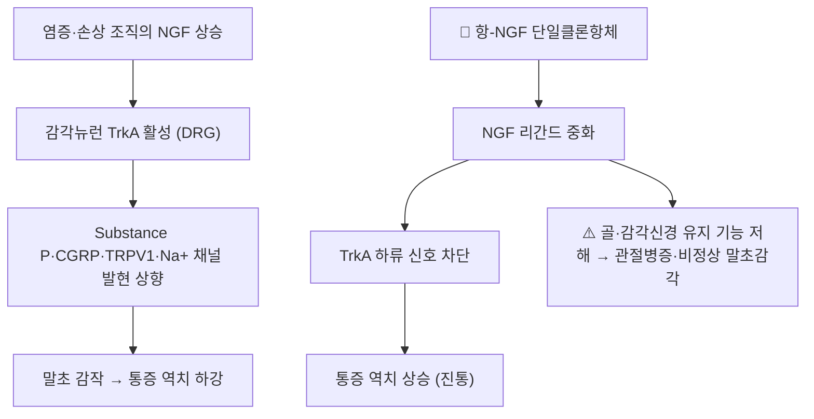

# 💊 [[항-NGF 단일클론항체]] (Anti-NGF Monoclonal Antibodies — 타네주맙·파시누맙·풀라누맙)

> 🖼️ **이미지 미확보 — 패키지·블리스터·구조식 3종 모두.** 이 계열은 규제 승인을 받지 못해 시판 완제품이 존재하지 않고, 단일클론항체라 PubChem CID·2D 구조식도 제공되지 않는다(저분자 화합물이 아님). 사유를 밝히고 슬롯을 비운다 — 다른 약 사진으로 채우지 않는다.

> **핵심 3줄 요약 (Key Summary)**:
> 🧪 주성분·제형: [[신경성장인자(NGF)]]를 중화하는 인간(화) 단일클론항체 계열. 대표 약물은 [[타네주맙]]·[[파시누맙]]·풀라누맙이며 전부 피하주사 제형이다
> 📍 작용 기전: NGF–[[TrkA 수용체]] 축을 차단해 감각뉴런의 통증 표현형·말초 감작을 낮춘다
> 🎯 임상 위치: 만성 근골격 통증(무릎·고관절 골관절염, 만성 요통)에서 위약 대비 SMD −0.25~−0.40의 작음~중등도 진통을 보였으나, 관절병증 위험이 4~5배로 증가해 규제 승인에 이르지 못했다
> ⚠️ 주의사항: 관절 안전성(급속 진행성 관절 파괴 계열)·비정상 말초감각 감시가 필수 조건으로 제시된다

## 1. 약물 기본 정보 및 시판 제품 (Brand Identification)

| 항목 | 상세 정보 |
| :--- | :--- |
| **일반명 (Generic Name)** | 타네주맙(Tanezumab) · 파시누맙(Fasinumab) · 풀라누맙(Fulranumab) |
| **계열 (Class)** | 인간(화) 항-NGF IgG 단일클론항체 — 진통 목적의 생물학적 제제 |
| **ATC 코드 / 분류** | 국제 허가 미취득에 따라 ATC 코드가 부여되지 않았다 |
| **PubChem CID** | 해당 없음 — 단백질(항체)이라 PubChem 소분자 CID·2D 구조식이 제공되지 않는다 |
| **주요 제형 및 함량** | 피하주사(prefilled syringe·vial) — 경구 제형 없음 |
| **허가 상태** | 미국 FDA·유럽 EMA·국내 식약처 어디에서도 골관절염·요통 적응증으로 허가되지 않았다(규제 심사 단계에서 안전성 문제로 중단·거절) |

### 1.1 계열 약물 비교 (본 회차 네트워크 메타분석 기준)

| 약물 | 대표 투여법(포함 RCT 기준) | 위약 대비 통증 SMD | 관절병증 RR | 비정상 말초감각 RR |
| :--- | :--- | :--- | :--- | :--- |
| 타네주맙 | 2.5 mg 피하, 8주 간격 2회 또는 2.5 → 5 mg 강제 증량 | −0.36 | 3.84 (2.07–7.14) | 2.46 |
| 파시누맙 | 1 mg 피하, 4주 또는 8주 간격 | −0.40 | 4.7 (3.61–6.13) | 1.99 |
| 풀라누맙 | 통증 개선폭 최소 | −0.25 | 유의하지 않음 | 1.78 (1.09–2.92) |

- 기능 개선도 같은 순서였다(파시누맙 SMD −0.42, 타네주맙 −0.39).
- 초기 프로토콜의 고용량(파시누맙 3 mg 4주·6 mg 8주)은 관절 이상반응 때문에 등록이 중단되고 1 mg으로 낮춰 재설계된 이력이 있다 → [[파시누맙]]

## 2. 분자 약리 기전 및 작용 경로 (Mechanism of Action)

- **주요 기작**: 항체가 NGF 리간드에 결합해 [[TrkA 수용체]] 활성화를 막는다. NGF는 염증·신경손상 상황에서 상승해 후근신경절과 중추에서 침해수용 신호를 증폭시키고 통증 뉴런의 표현형을 바꾼다 — 이 축을 차단하면 통증 역치가 올라간다.
- **부작용 기전**: NGF는 성인에서도 감각신경 및 골·연골 대사 유지에 관여한다. 그래서 진통과 함께 관절병증(급속 진행성 관절 파괴 계열)·비정상 말초감각이 용량 의존적으로 증가한다 → [[신경성장인자(NGF)]]

## 3. 약동학적 특성 (Pharmacokinetics: ADME)

| 약동학 파라미터 | 수치 및 임상적 의미 |
| :--- | :--- |
| **생체이용률 (Bioavailability, F)** | 피하주사 — 단백질 분해 경로로 대사되어 경구 투여 불가 |
| **최고혈중농도 도달시간 (Tmax)** | 수일~2주 수준의 완만한 흡수(항체 특성) |
| **혈장 단백결합률 (Protein Binding)** | 해당 없음 — 표적 매개 분포(TMDD) |
| **간 대사 효소 (Metabolism)** | CYP450 관여 없음 — 한약·양약 CYP 상호작용 축과 겹치지 않는다 |
| **배설 반감기 (Elimination t1/2)** | 수 주 단위(항체 공통) |
| **주요 배설 경로 (Excretion)** | 단백질 이화 경로 |

- **임상적 함의**: CYP 대사 경로를 쓰지 않으므로 한약 병용 상호작용 위험은 낮지만, 반감기가 길어 이상반응 발생 시 회복이 느리다.

## 4. 용법·용량 및 처방 가이드 (Dosage & Administration)

| 임상 적응증 | 표준 투여법(시험 기준) | 비고 |
| :--- | :--- | :--- |
| 무릎·고관절 골관절염 | 타네주맙 2.5 mg 피하(1일차·8주차) 또는 2.5 → 5 mg 증량 | 16주 시점 WOMAC 통증·기능이 공동 1차 평가변수 |
| 무릎·고관절 골관절염 | 파시누맙 1 mg 피하 4주 또는 8주 간격 | 대조군은 나프록센 500 mg 1일 2회 |

- 국내에서는 처방할 수 없다 — 이 표는 근거 해석용이며 실제 처방 지침이 아니다.

## 5. 부작용, 경고 및 약물 상호작용 (Adverse Effects & Interactions)

### 5.1 주요 부작용 및 독성 경고
- **관절병증(AA)**: 파시누맙 RR 4.7, 타네주맙 RR 3.84로 위약 대비 유의하게 증가. 급속 진행성 관절 파괴(RPOA) 계열 신호가 규제 실패의 핵심 원인이다.
- **비정상 말초감각(APS)**: 타네주맙 RR 2.46, 파시누맙 RR 1.99, 풀라누맙 RR 1.78 — 감각 이상·저림.
- **감시 원칙**: 승인 여부와 무관하게 정기 영상·증상 확인이 필수 조건으로 제시된다.

### 5.2 주요 병용 금기 및 상호작용
- NSAID([[나프록센]] 등)와 병용·비교 시험에서 관절 이상반응이 두드러져, 항염 약물과 함께 쓰는 설계 자체가 제한되었다.

## 6. 한의 치료 연계 및 병용/테이퍼링 프로토콜 (Integrative Medicine)

### 6.1 한약·양약 병용 투여 안전성 및 시너지 배오
- 이 계열은 CYP 대사 기반 상호작용 축이 아니므로, 병용 위험은 '약물 상호작용'보다 '관절 안전성'에 있다.

### 6.2 양약 감량 및 한의 전환(테이퍼링) 가이드
- 국내에서는 애초에 처방되지 않으므로 감량 프로토콜이 성립하지 않는다. 대신 표준 약물([[NSAIDs]]·[[아세트아미노펜]]·필요 시 [[둘록세틴]])을 안전 프로파일에 맞춰 조정하고, 침·수기·운동을 병행하는 다축 접근이 현실적 경로다.

## 7. 💡 사용자 진료실 핵심 필기 & 실전 임상 체크리스트

### 7.1 진료실 3대 핵심 문진 체크리스트
1. **인터넷 정보 확인**: "tanezumab·fasinumab 주사" 문의 여부. 국내에서 허가되지 않은 약이라는 점을 먼저 확인한다.
2. **기대치 조정**: 위약 대비 SMD −0.25~−0.40은 통증 점수 몇 점 수준의 작음~중등도 효과라는 점을 숫자로 설명한다.
3. **관절 안전성**: 관절 통증 급증·체중부하 시 격통 등 RPOA 신호 여부를 확인하고, 시험 참여 환자는 즉시 처방의에게 보고하도록 안내한다.

### 7.2 환자 티칭 스크립트
> *"인터넷에서 보시는 '신경성장인자를 막는 새 주사약'은 통증을 줄이는 효과는 실제로 있습니다. 다만 관절 연골이 빠르게 닳는 부작용 위험이 4~5배로 확인되어서, 우리나라를 포함한 각국 규제기관이 허가를 내주지 않은 약입니다. 그래서 지금은 쓰지 않고, 대신 소염진통제를 안전하게 조정하면서 침·도수치료·운동을 함께 하는 방법이 실제 진료의 기준입니다."*

## 8. 출처 및 학술 참고 문헌 (References)
- Abouelella A, et al. Efficacy and Safety of Anti-nerve Growth Factor Monoclonal Antibodies in Managing Chronic Musculoskeletal Pain: A Systematic Review with Network Meta-Analysis. *Drugs*. 2026;86(5):719-736 (PMID 41880116) (https://doi.org/10.1007/s40265-026-02304-2)
  - [연구 요약] RCT 29편·27,747명을 빈도주의·베이지안 네트워크 메타분석으로 통합해 항체별 진통 효과(파시누맙 SMD −0.40 > 타네주맙 −0.36 > 풀라누맙 −0.25)와 관절병증 위험(RR 4.7·3.84)을 함께 정량화한 근거다. 본 노트 1.1 표의 출처.
- Oo WM, et al. Nerve Growth Factor (NGF) Inhibitors and Related Agents for Chronic Musculoskeletal Pain: A Comprehensive Review. *BioDrugs*. 2021;35(6):611-641 (PMID 34807432) (https://doi.org/10.1007/s40259-021-00504-8)
  - [연구 요약] 타네주맙·파시누맙과 TrkA 억제제까지 포함해 NGF 신호와 통증 발생 기전, 2/3상 시험의 효능·안전성을 정리한 총설.
- 식품의약품안전처 의약품안전나라 의약품통합정보시스템 (https://nedrug.mfds.go.kr)
  - [연구 요약] 국내 허가 의약품 조회 — 이 계열은 국내 허가 품목이 없음을 확인하는 공식 경로다.

## 함께 보기
- [[신경성장인자(NGF)]] · [[TrkA 수용체]] · [[타네주맙]] · [[파시누맙]] · [[퇴행성 관절염]] · [[요통]] · [[나프록센]] · [[네트워크 메타분석]] · [[SUCRA]] · [[GRADE 근거수준]]
