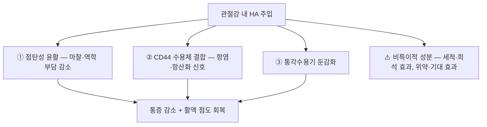

# 💊 히알루론산 (Hyaluronic Acid, HA / 점성보충요법)

> **핵심 3줄 요약 (Key Summary)**:
> 🧪 주성분·제형: **고분자 글리코사미노글리칸(히알루론산 나트륨)** 관절강 내 주사제 — 분자량·교차결합 방식에 따라 제품군이 갈리고, 통상 **1회용 프리필드시린지**로 공급된다.
> 📍 작용 기전: ① 관절액의 **점탄성 윤활**로 역학 부담·마찰 감소 ② **[[CD44]] 수용체** 매개 항염·항산화 신호 ③ 통각수용기 둔감화 — 즉 '연골 재생'보다 **증상 조절** 기전이다.
> 🎯 임상 적응증: 무릎 골관절염의 **관절강 내 점성보충** — 2026-09-21 리뷰 3번 네트워크 메타분석에서 **PRP·SVF·BMAC·UC-MSC의 대조 기준**이었고, 증상 개선의 실질적 주역으로 남았다.
> ⚠️ 주의사항: 관절 내 감염·피부 병변 부위는 금기, 주사 후 **일시적 관절 통증·부종(급성 가성 활막염)** 가능, 무균 조작·혈관 흡인 확인 필수.

---

## 1. 약물 기본 정보 및 제형 (Brand Identification)

| 항목 | 상세 정보 |
| :--- | :--- |
| **일반명 (Generic Name)** | 히알루론산나트륨 / Sodium Hyaluronate (Hyaluronic Acid) |
| **분류** | 점성보충제(viscosupplement) — 관절강 내 주사제 |
| **제형** | 1회용 프리필드시린지(통상 2~3 mL), 관절강 내 주사 |
| **분자량·제조** | 저분자~고분자, 비가교/가교(예: hylan) 제품군 — **제품별 용법·주입 횟수가 다르다** |
| **허가 적응증** | 무릎 골관절염의 통증 개선(제품별 허가사항 확인) |
| **요양·비용** | 비급여 항목이 일반적 — 환자 상담 시 비용·주기 고지 필요 |

### 1.1 경쟁·비교 제제 (2026-09-21 리뷰 3번 기준)
| 구분 | 내용 |
| :--- | :--- |
| **비교 대상** | [[PRP]] · SVF · BMAC · UC-MSC — [[오르토바이올로직]] |
| **결과 위치** | SUCRA 순위에서 **최하위(5위)** 였으나, 모든 제제의 개선폭이 **[[MCID]] 미달**이라 **'실질적 주역'** 으로 평가됨 |
| **경쟁 제제** | [[트리암시놀론]](코르티코스테로이드) — 급성 삼출·염증기 단기 진통, 연 3~4회 이내 제한 |

---

## 2. 분자 약리 기전 및 작용 경로 (Mechanism of Action)

- **① 점탄성(viscosupplementation)**: 정상 활액의 점탄성을 보완해 관절면 마찰·충격 부담을 줄이고 활액 점도를 회복
- **② [[CD44]] 매개 신호**: 히알루론산이 활막세포·연골세포의 CD44에 결합해 항염·항산화 신호를 전달하고 염증성 사이토카인 작용을 완화
- **③ 통각 조절**: 관절 내 통각수용기 민감도를 낮추는 방향으로 작용
- ⚠️ **해석의 핵심**: HA군에서도 개선이 관찰되는 것은 약제 특이 효과만이 아니라 **관절강 내 주입 자체의 세척·희석 효과와 위약·기대 효과**가 섞여 있기 때문이다. 이 논리는 약침·국소 주사 전반에 원용된다

---

## 3. 약동학적 특성 (국소 주사 관점)

| 파라미터 | 임상적 의미 |
| :--- | :--- |
| **관절 내 체류** | 주입 HA는 활막에서 분해·흡수 — 제품·분자량에 따라 수일~수주 내 소실 |
| **증상 조절 지속** | 임상 효과가 체류 시간보다 길게 유지되는 이유는 **점탄성 회복 + 항염 신호 + 기대효과**의 복합으로 설명된다 |
| **전신 흡수** | 매우 적음 — 전신 약물 상호작용은 거의 문제되지 않는다 |
| **반복 투여** | 제품별 권장 주기(1회~3~5회 코스)가 다르며, 반복 시 **가성 활막염** 발생 여부를 확인 |

---

## _의학/04_임상 용법·용량 (Dosage & Administration)

| 적응 | 용법·용량 | 비고 |
| :--- | :--- | :--- |
| **무릎 골관절염(허가 적응)** | 제품별 용량·주입 횟수 준수(제조사 허가사항) | 관절강 내 무균 주입, 주입 후 관절 운동 권장 |
| **악화기 증상 조절(실전)** | 삼출·극심한 염증기에는 CS 주사 또는 관절 천자 후 고려 | 반복 주사만으로 장기 관리하지 말 것 |
| **재평가 시점** | 3·6·12개월에 [[KOOS]]·[[WOMAC]] | MCID 기준으로 '체감 개선' 여부 판정 → [[MCID]] |

---

## 5. 부작용, 경고 및 상호작용 (Adverse Effects & Interactions)

- **주사 부위·관절**: 주사 직후 통증·부종·열감(급성 가성 활막염), 드물게 감염성 관절염
- **전신**: 드물게 과민반응·피부 발진
- **금기·주의**: 관절 내 감염·주변 피부 감염, 출혈 경향·항응고제 복용 시 신중, HA 제제 과민반응 병력
- **시술 원칙**: 무균 조작, **주입 전 혈관 흡인 확인**, 관절 천자 경로 표준화. 하루에 다수 관절 시술 시 감염 위험 증가
- **상담 정정**: "연골을 재생시키는 주사"라는 표현은 부정확 — 근거는 **증상 조절**에 한정된다

---

## 6. 한의 치료 연계 및 병용 (Integrative Medicine)

- **단계 설계**: ① 체중 관리·운동·교육 + 침/약침을 기본축 → ② 악화기에 HA 또는 CS 주사로 증상 조절 → ③ PRP·세포 제제는 근거·비용 설명이 충분할 때만 상담 → [[오르토바이올로직]] · [[퇴행성 슬관절염]]
- **시너지 관점**: HA 주사 후 통증이 줄어든 시기를 **대퇴사두근 강화(등척성·Q-setting)의 진입 창**으로 활용한다 — 수동 중재는 능동 부하로 넘어가는 문이다([[운동요법]]·[[등척성 운동]])
- **한의 대응**: 관절 국소혈([[독비(ST35)]]·[[내슬안(EX-LE4)]]·[[음릉천(SP9)]]) 침·약침과 봉약침은 '관절 국소 자극'이라는 공통 논리를 공유 → [[수자(輸刺)]] · [[봉약침]]

---

## 7. 💡 진료실 핵심 필기 & 임상 체크리스트

### 7.1 환자 상담 포인트
1. "무릎 주사는 윤활 작용으로 통증을 줄이는 증상 치료입니다 — 연골을 새로 만드는 치료는 아닙니다."
2. "주사 종류를 바꾸면 수치상 차이는 있지만, 환자가 체감할 만큼의 차이는 아니었습니다(2,960명·24편 메타분석)."
3. "기본은 체중 관리와 근력 운동이고, 주사는 아플 때 통증을 낮춰 운동을 다시 시작하게 해주는 도구입니다."

### 7.2 체크리스트
- 주사 전: 감염 징후·피부 상태·항응고제 복용 확인 → 무균 조작·혈관 흡인
- 주사 후 3개월·6개월·12개월 [[KOOS]]·[[WOMAC]] 재평가, 필요 시 [[Kellgren-Lawrence 등급]]로 병기 확인
- 통증 재발 시 주사 반복보다 **운동 용량·체중·보행 패턴** 점검을 먼저 → [[무릎 보조기]] · [[걷기 운동]]

---

## 8. 출처 및 학술 참고 문헌 (References)

- **2026-09-21 심층리뷰 3번** — Arthroscopy (Arthroscopy Association of North America) 2026, online ahead of print ([PMID: 42524752](https://pubmed.ncbi.nlm.nih.gov/42524752/) / DOI 10.1002/arj.70411): 무릎 OA RCT 24편·2,960명 네트워크 메타분석 — 관절강 내 PRP·SVF·BMAC·UC-MSC·HA 비교. SVF·BMAC가 HA보다 통증(MD −0.7~−1.1)·기능(−0.6~−1.4)에서 유의하게 우수했으나 **모든 개선폭이 MCID 미달**, SUCRA 순위 SVF > BMAC > UC-MSC > PRP > HA.
  - `[연구 요약]` 포함 시험 간 용량·제조법·주입 횟수의 이질성이 커 단일 프로토콜로 요약되지 않는다 — 세부는 개별 RCT 원문 확인 필요.
- 식품의약품안전처 의약품안전나라 — 히알루론산나트륨 관절강 주사제 허가사항(적응증·용법용량·주의사항).

<!-- 보관 태그(1회용·링크오류, 필요시 복원): 점성보충 -->
