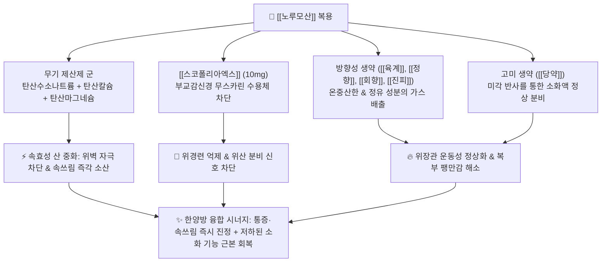

---
aliases:
  - Norumo
  - 노루모산
  - 노루모에프
  - 노루모에이
  - 일동제약노루모
tags:
  - 의약품
  - 양방약
  - 복합제
  - 일반의약품
  - 소화기계
  - 제산제
  - 건위제
title: 노루모
created: 2026-09-12
updated: 2026-09-12
---

# 💊 [[노루모]] (Norumo, Ildong Pharm, Antacid & Stomachic Combination)

> **핵심 3줄 요약 (Key Summary)**:
> - 🧪 주성분 배합: 속효성/지속성 무기 제산제([[탄산수소나트륨]], [[탄산마그네슘]], [[침강탄산칼슘]]) + 진경 성분([[스코폴리아엑스]]) + 방향·고미 건위 생약([[육계]], [[정향]], [[회향]], [[진피]], [[당약]]) 복합 제제.
> - 📍 복합 약리 기전: 위산의 즉각적 화학적 중화와 부교감신경 차단을 통한 위경련 억제, 그리고 방향성·고미 생약의 위점막 혈류 촉진 및 소화 효소 분비 자극 시너지.
> - 🎯 임상 적응증: 위산과다, 속쓰림, 위통, 위부 팽만감, 소화불량, 과식, 구역·구토의 신속 대증 완화.
> - ⚠️ 특정 성분 금기: 탄산수소나트륨 만성 연용 시 대사성 알칼리증 및 나트륨 저류(고혈압·신장애·심부전 주의), 스코폴리아엑스 함유로 녹내장 및 전립선비대증 환자 금기, 위산 반동(Acid rebound) 주의.

---

## 1. 복합 구성 성분 및 제형별 함량 (Active Ingredients & Formulations)

  <iframe src="https://embed.molview.org/v1/?mode=balls&cid=3000322" style="position: absolute; top: 0; left: 0; width: 100%; height: 100%; border: 0;" title="노루모 핵심 진경 성분 스코폴라민 3D 화학 구조식"></iframe>

> [인터랙티브 3D 분자 구조 모델] 노루모 복합제의 핵심 진경 성분인 [[스코폴라민]] (Scopolamine / Scopolia Extract 활성 알칼로이드, PubChem CID: 3000322)

> [그림 1] 제산제와 건위 생약 분말이 복합 배합된 전통적 위장 산제(Powder) 제형 성상

> [그림 2] 노루모의 초속효성 산 중화 성분인 [[탄산수소나트륨]](Sodium Bicarbonate) 2D 화학 분자 구조식 (PubChem CID: 516892)

### 1.1 노루모산 (1포 1.5g 기준) 성분 구성표

| 구성 성분 (한글/영문) | 1포(1.5g)당 함량 | 약효 분류 및 약리 역할 | PubChem CID | 주된 작용 및 복합 시너지 포인트 |
| :--- | :--- | :--- | :--- | :--- |
| [[탄산수소나트륨]] (Sodium Bicarbonate) | **500 mg** | 속효성 무기 제산제 | [516892](https://pubchem.ncbi.nlm.nih.gov/compound/516892) | 위산(HCl)과 즉시 반응하여 1분 내 위내 pH를 중화 |
| [[탄산마그네슘]] (Magnesium Carbonate) | **150 mg** | 지속성 제산제 & 완하 작용 | [11029](https://pubchem.ncbi.nlm.nih.gov/compound/11029) | 완만한 중화 지속 및 칼슘/알루미늄 유발 변비 상쇄 |
| [[침강탄산칼슘]] (Precipitated Calcium Carbonate) | **300 mg** | 지속성 제산제 | [10112](https://pubchem.ncbi.nlm.nih.gov/compound/10112) | 장시간 산 중화능 유지 |
| [[스코폴리아엑스]] (Scopolia Extract) | **10 mg** | 부교감신경 차단 진경제 | [3000322](https://pubchem.ncbi.nlm.nih.gov/compound/3000322) | 무스카린 수용체 차단으로 위산 분비 억제 및 위경련 진정 |
| [[육계]] 가루 (Cinnamon Bark Powder) | **50 mg** | 방향성 건위제 (한방 생약) | [본초링크](c:/Simbio/2.%20약리%20공부/본초/육계.md) | 온중산한, 위점막 미세혈류 촉진 및 위장관 가스 배출 |
| [[회향]] 가루 (Fennel Powder) | **20 mg** | 방향성 건위제 (한방 생약) | - | 소화관 평활근 긴장 완화 및 방향성 소화 촉진 |
| [[정향]] 가루 (Clove Powder) | **15 mg** | 방향성 건위제 (한방 생약) | [본초링크](c:/Simbio/2.%20약리%20공부/본초/정향.md) | 위장 냉증 완화 및 국소 진통·진구(구역 억제) |
| [[진피]] 가루 (Citrus Unshiu Peel Powder) | **50 mg** | 이기건비 생약 | [본초링크](c:/Simbio/2.%20약리%20공부/본초/진피.md) | 소화 효소 분비 촉진 및 식적(食積) 담음 소산 |
| [[당약]] 가루 (Swertia Herb Powder) | **5 mg** | 고미(쓴맛) 건위 생약 | - | 혀의 미각 신경 자극 $\rightarrow$ 미주신경 반사로 위액·담즙 분비 촉진 |

---

## 2. 복합 상승 약리 기전 (Combination Mechanism & Synergy)

* **화학적 중화와 생리학적 완충의 다단계 결합**:
  * $\text{NaHCO}_3 + \text{HCl} \rightarrow \text{NaCl} + \text{H}_2\text{O} + \text{CO}_2\uparrow$ 반응으로 복용 후 수십 초 내에 위산도를 pH 4~5 수준으로 끌어올려 펩신(Pepsin) 활성을 불활성화시킵니다.
  * 이어 침강탄산칼슘과 탄산마그네슘이 서서히 해리되면서 2~3시간 동안 완충 효과를 지속합니다.
* **마그네슘-칼슘 배합에 의한 배변 부작용 상쇄**:
  * 마그네슘 제제는 삼투성 설사를 유발하고, 칼슘/알루미늄 제제는 장관 운동을 억제하여 변비를 유발합니다. 노루모는 두 성분을 황금비율로 복합하여 장관 통과 속도에 미치는 이상반응을 완벽히 상쇄합니다.
* **항콜린 진경제와 건위 생약의 음양(陰陽) 조화**:
  * 스코폴리아엑스가 위산 분비와 경련성 수축을 억제하는 동안, 육계·정향·회향의 정유 성분이 차가워진 위장에 온기를 공급하고 위점막 혈류를 촉진하여 소화력을 재생시킵니다.

---

## 3. 브랜드 패밀리 라인업 비교 (Brand Lineup Analysis)

| 제품 라인업명 | 주요 제형 및 특징 | 대표 적응증 | 임상 복약 지도 핵심 |
| :--- | :--- | :--- | :--- |
| **노루모산** (Norumo Powder) | 제산제 + 스코폴리아 + 건위생약 5종 (포 포장 분말 가루약) | 급성 속쓰림, 위산과다, 체함 | 가루약 특유의 빠른 분산, 물과 함께 복용, 1일 3회 식후/식간 |
| **노루모에프내복액** | 제산제 성분 배제, 건위 생약 + 카르니틴 + 소화효소 (75mL 병 액제) | 식욕부진, 소화불량, 과식, 식체 | 마시는 액제로 위장 운동성 촉진 특화, 제산제 부작용 없음 |
| **노루모에이정** (Norumo A) | 제산제 + 제산 지속형 메타규산알루민산마그네슘 (정제 알약) | 만성 위염, 속쓰림, 신트림 | 분말 복용이 불편한 환자용, 휴대 간편 |
| **오타위산** (Ohta's Isan) | 탄산수소나트륨 + 탄산마그네슘 + 생약 7종 (일본 수입/직구) | 과음, 속쓰림, 위부불쾌감 | 유사한 한양방 복합 산제 모델, 방향성 정유의 청량감 |

---

## 4. 복합제 특이 위험성 및 특정 성분 금기 (Black Box & Red Flags)

### 4.1 위산 반동(Acid Rebound) 및 대사성 알칼리증
* **위산 반동 현상**:
  * 탄산수소나트륨과 탄산칼슘은 위내 pH를 급격히 알칼리화시켜 위 전정부의 G세포를 자극, **가스트린(Gastrin) 분비를 반동적으로 촉진**합니다.
  * 따라서 약효가 소실된 직후 위산이 이전보다 훨씬 많이 분비되는 '위산 반동'이 발생하므로, 만성 역류성 식도염이나 궤양 환자가 수주 이상 장기 연용하는 것은 엄격히 금지됩니다.
* **전신 나트륨 부하 및 알칼리증**:
  * 탄산수소나트륨(1포당 500mg)의 나트륨 이온은 체내로 흡수되므로, **고혈압, 신부전, 울혈성 심부전, 부종 환자**는 나트륨 저류로 혈압이 급상승하거나 체액 저류가 악화될 수 있습니다.

### 4.2 스코폴리아엑스(항콜린제)의 치명적 금기
* **폐쇄각 녹내장 환자**: 동공 산대로 방수 유출로가 막혀 급성 안압 상승 및 실명 위험.
* **전립선비대증 환자**: 방광 삼각부 수축 억제 및 요도 괄약근 긴장으로 급성 요폐(Urinary retention) 촉발.
* **부정맥·심질환자**: 빈맥 유발 가능.

---

## 5. 한의학적 복합 처방 배오 비교 및 테이퍼링 프로토콜 (Integrative Medicine)

### 5.1 한방 제산(制酸)·건위(健胃) 방제와의 배오 매핑

| 양방 노루모 복합 구성 | 한의 대응 본초/처방 | 한의학적 배오 의미 및 기전 비교 |
| :--- | :--- | :--- |
| **무기 제산제 (탄산수소나트륨, 탄산칼슘)** | [[오적골]], [[모려]], [[와릉자]] | 제산지통(制酸止痛), 알칼리성 패각류 한약재로 위산을 물리·화학적으로 중화 |
| **방향성 건위 생약 ([[육계]], [[정향]], [[회향]])** | [[안중산]](육계, 현호색, 모려, 회향 등) | 온중산한(溫中散寒), 위한(胃寒)으로 인한 위완통(속쓰림)을 덥혀서 통증 소산 |
| **이기건비 생약 ([[진피]], [[당약]])** | [[평위산]](창출, 후박, 진피, 감초) | 조습건비(燥濕健脾), 습담(濕痰)과 식적(食積)을 삭여 위장관 정체를 소통 |
| **진경 성분 ([[스코폴리아엑스]])** | [[작약]], [[감초]] ([[작약감초탕]]) | 완급지통(緩急止痛), 비위 평활근의 긴장성 경련을 완화하고 통증 진정 |

### 5.2 진료실 실전 문진 및 테이퍼링(감량) 프로토콜
* **문진 포인트**:
  * "속이 쓰리고 소화가 안 될 때마다 습관적으로 노루모산이나 제산제를 드십니까?" 확인.
  * "고혈압이나 녹내장, 전립선 질환이 있으신가요?"
* **한의 처방 전환 테이퍼링 프로토콜**:
  * **위한성(胃寒性) 소화불량 및 속쓰림 (찬 음식 먹으면 쓰리고 아픈 경우)**:
    * 노루모산 중단 후 온위제산제인 **[[안중산]](모려, 육계, 현호색, 회향)** 보험 과립제 처방 $\rightarrow$ 천연 탄산칼슘 성분(모려)으로 위산을 중화하고 온중 지통.
  * **식적(食積) 및 명치 답답함 (체기 중심)**:
    * **[[평위산]]** 또는 **[[향사평위산]]**으로 전환하여 비위 소화 기능을 정상화.
  * **침구 치료**:
    * 중완(CV12), 족삼리(ST36), 내관(PC6), 공손(SP4) 자침을 통해 위장관 연동운동 리듬 정상화 및 위산 분비 밸런스 회복.

### 5.3 환자 티칭 스크립트
> "환자분, 노루모산은 속이 쓰리고 체했을 때 즉각 편안해지는 훌륭한 비상약이지만, 위산을 강제로 중화시키는 성분과 나트륨이 많이 들어있어 매일 드시면 오히려 반동으로 위산이 더 많이 나오는 '위산 반동'이 생깁니다. 특히 혈압이 높으시거나 콩팥이 약하신 분, 눈에 녹내장이 있거나 전립선이 비대하신 남성분은 부작용이 생길 수 있으니 며칠 이상 연용하시면 안 됩니다. 위장 본래의 따뜻한 기운과 소화력을 길러주는 안중산이나 평위산 같은 한약 치료로 위장을 근본적으로 튼튼하게 바꾸셔야 합니다."

---

## 6. 출처 및 학술 참고 문헌 (References)

1. Maton PN, Burton ME. Antacids revisited: a review of their clinical pharmacology and recommended therapeutic use. *Drugs*. 1999;57(6):855-870. doi:10.2165/00003495-199957060-00003. [PMID: 10400401](https://pubmed.ncbi.nlm.nih.gov/10400401/)
   - [연구 요약] 알루미늄, 마그네슘, 칼슘, 탄산수소나트륨 복합 제산제의 산 중화능(ANC), 작용 개시 및 지속 시간, 배변 이상반응 상쇄 및 가스트린 분비 자극에 의한 위산 반동(Acid rebound) 병태생리를 총망라한 결정적 종설.

2. McMullen MK, Whitehouse JM, Towell A. Bitters: Time for a New Paradigm. *Evid Based Complement Alternat Med*. 2015;2015:670504. doi:10.1155/2015/670504. [PMID: 26074998](https://pubmed.ncbi.nlm.nih.gov/26074998/)
   - [연구 요약] 당약 등 고미(쓴맛) 생약이 구강 내 미각 수용체(TAS2Rs) 및 장관 미각 신경을 자극하여 미주신경 반사를 통해 침, 위산, 담즙 및 췌장 효소의 정상 분비를 유도하고 소화관 운동성을 조절하는 메커니즘을 규명한 문헌.

3. Fontoura MG, Fernandes L, Machado F, Almeida P, Pereira T. Sodium Bicarbonate Toxicity: An Unusual Yet Potential Cause of Severe Metabolic Alkalosis. *Cureus*. 2025;17(1):e76949. doi:10.7759/cureus.76949. [PMID: 39906443](https://pubmed.ncbi.nlm.nih.gov/39906443/)
   - [연구 요약] 탄산수소나트륨 함유 제산제의 과다 복용으로 유발된 중증 대사성 알칼리증, 저칼륨혈증 및 체액 과부하의 병태생리와 임상적 위험성을 경고한 증례 연구.
