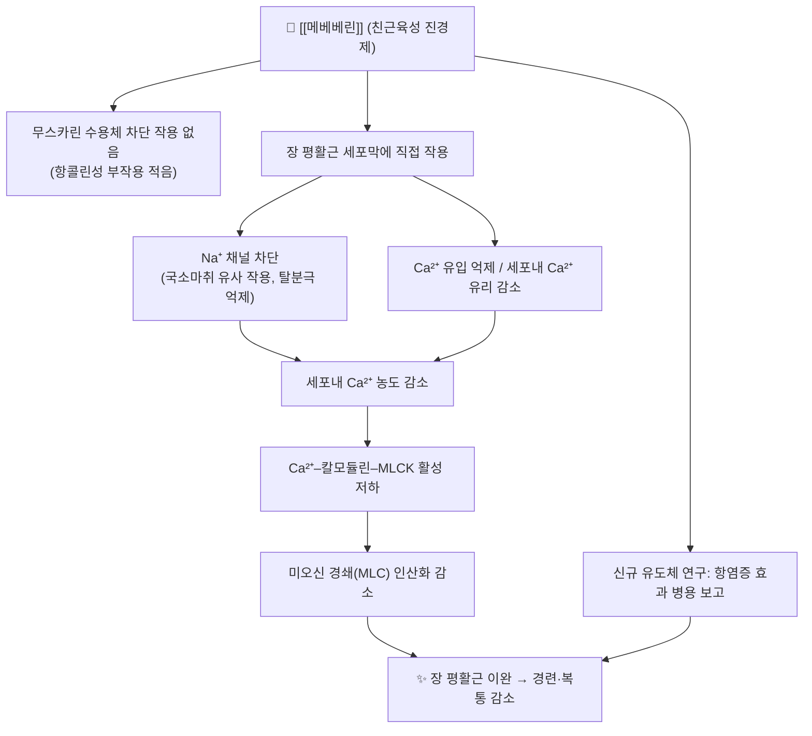

# 💊 [[메베베린]] (Mebeverine, Duspatalin, A03AX)

![[메베베린_1_3.jpg|540]]
> [그림 1: ① 병태생리·영상 — Mebeverine.png]

> **핵심 3줄 요약 (Key Summary)**:
> 🧪 주성분·제형: [[메베베린염산염]](Mebeverine hydrochloride)을 주성분으로 하는 **친근육성(musculotropic) 진경제**로, 국내외에서 주로 **정제 135 mg** 및 **서방정 200 mg** 제형으로 시판된다. 대표 브랜드는 [[듀스파탈린]](Duspatalin)이다.
> 📍 작용 기전: **항콜린 작용이 없는** 직접적 장 평활근 이완제로, 평활근 세포막의 Na⁺ 채널 차단 및 Ca²⁺ 유입 억제를 통해 세포내 Ca²⁺–칼모듈린–MLCK 경로를 억제하여 미오신 경쇄 인산화를 감소시키는 기전이 제안되어 있다(개별 이온채널 아형·IC₅₀ 값은 근거 미확인).
> 🎯 임상 적응증: **과민성 대장증후군(IBS)**의 복통·경련·배변 이상 증상 완화가 주 적응증이며, 성인 기준 135 mg 1일 3회(식전 20분) 또는 200 mg 서방정 1일 2회가 표준 용법이다. 성인 IBS에서 위약 대비 유효성을 보고한 연구들이 있으나 포함 연구의 방법론적 한계로 **근거 수준은 제한적**이며, 소아·청소년 IBS/FAP-NOS에서는 위약 대비 우월성이 확인되지 않았다(PMID 35207315, 20128021, 40074185).
> ⚠️ 주의사항: 내약성이 대체로 양호하고 항콜린성 부작용(구갈·요저류·변비)이 적은 편이나, 두통·어지럼·위장관 불쾌감·피부 발진 등이 보고된다. **항무스카린 작용이 없으므로** 다른 진경제·항콜린제와의 중복 투여 시 부작용 가중 여부를 확인해야 하며, 임부·수유부와 간·신기능 저하자에 대한 안전성 데이터는 제한적이다(근거 미확인).

---

## 1. 약물 기본 정보 및 시판 제품 (Brand Identification)
> [!abstract]+ 🧪 3D 약리 분자 구조 (Interactive 3D Viewer)
> ※ 본 노트 작성 시 **PubChem CID를 확정할 수 없어**(근거 미확인) CID를 임의로 기재하지 않는다. 아래 링크에서 "Mebeverine"을 검색하면 3D 구조·동정 정보를 직접 확인할 수 있다.
> 👉 [PubChem – Mebeverine 검색](https://pubchem.ncbi.nlm.nih.gov/#query=mebeverine)

| 항목 | 상세 정보 |
| :--- | :--- |
| **일반명 (Generic Name)** | [[메베베린]](한글) / Mebeverine (English Generic Name) |
| **대표 상품명 (Brand Names)** | **[[듀스파탈린]](Duspatalin)**, 메베베린염산염 함유 국내 제네릭 (※ YAML `aliases:`에 등록하여 위키링크 통합) |
| **ATC 코드 / 분류** | **A03AX**(기능성 장질환 치료제 – 기타) 계열로 분류된다. 국내 식약처 분류는 **239 기타의 소화기관용약(진경제)**으로 기재되는 경우가 많으나, 세부 5단계 ATC 코드 및 국내 품목분류 코드는 문헌·약품집별 표기 차이가 있어 **원내 의약품 정보집 확인 권장** |
| **PubChem CID** | **미확정(근거 미확인)** — [PubChem 검색 링크](https://pubchem.ncbi.nlm.nih.gov/#query=mebeverine) |
| **화학식 / 분자량** | 베이스 C₂₄H₃₃NO₅, 분자량 ≈ 415.5 g/mol / 염산염(C₂₄H₃₃NO₅·HCl) ≈ 452.0 g/mol — ※ 구조식 기반 계산치로, **공식 의약품집 수치로 최종 확인 필요** |
| **주요 제형 및 함량** | 정제(메베베린염산염 135 mg), 서방정(200 mg). 시럽·주사제는 국내 유통 확인되지 않음(근거 미확인) |
| **식약처 허가 적응증** | **과민성 대장증후군의 치료**(복통, 경련, 만성 기능성 설사 등 증상 조절) — 세부 문구는 품목별 허가사항 원문 확인 권장 |

* **지역별 허가 현황**: 메베베린은 유럽·아시아 지역에서 오랫동안 사용되어 온 대표적 진경제이지만, **북미(미국) 지역에서는 허가·시판되지 않아** 북미 진경제 치료 옵션을 분석한 리뷰(PMID 33993133)의 주요 분석 대상 약물에는 포함되지 않는다. 즉 "유럽·아시아 가이드라인"과 "북미 가이드라인"에서의 위치가 다르다는 점을 처방·복약 상담 시 고려해야 한다.

### 1.1 대표 시판 제품 및 함유 복합제 매핑 (Brand Identification & Combinations)

| 구분 | 대표 제품명 / 브랜드 | 함유 성분 및 1회당 함량 | 제형 및 특징 | 주요 적응증 및 복약 지도 핵심 |
| :--- | :--- | :--- | :--- | :--- |
| **단일제 (ETC)** | [[듀스파탈린정]] | [[메베베린염산염]] 135 mg 단일 성분 | 속방정(필름코팅정) | IBS 표준 투여. **식전 20분**, 1일 3회. 정제는 분할·씹지 않고 통째로 복용 |
| **서방정 (ETC)** | [[듀스파탈린 서방정]] | [[메베베린염산염]] 200 mg 단일 성분 | 서방정(SR) | 1일 2회(아침·저녁 식전). 서방정은 분할·분쇄 금지(서방성 상실) |
| **국내 제네릭 (ETC)** | 메베베린염산염정 등 다수 | [[메베베린염산염]] 135 mg | 정제 | 성분명 기준 동일. 처방 변경 시 **함량·제형(속방/서방)** 차이 확인 |
| **복합제 (OTC/ETC)** | 국내 허가된 메베베린 복합제는 확인되지 않음 | — | — | 타 진경제·항콜린제·진통제와 임의 병용하지 않도록 지도 |
| **감별 다빈도 인접약** | [[부스코판]], [[포리부틴]], 트리메부틴 제제 | [[부틸스코폴라민]], [[트리메부틴]] 등 | 정제·주사 | 진경제 계열 성분 중복(특히 항콜린성 진경제) 여부를 복약력 청취로 감별 |

> ※ 국내 유통 제네릭의 정확한 제품명·제조사·품목기준코드는 본 노트에서 확인된 자료가 없어 기재하지 않는다(근거 미확인). 원내 약품집 또는 식약처 의약품안전나라에서 "메베베린염산염"으로 검색하여 확인할 것.

---

## 2. 분자 약리 기전 및 작용 경로 (Mechanism of Action)

* **주요 작용 기전 (Primary MoA)**:
  * 메베베린은 **친근육성(musculotropic) 진경제**로 분류되며, 장 평활근에 **직접** 작용하여 이완을 유도한다. 중요한 특징은 **항무스카린(항콜린) 작용이 없다**는 점으로, 이 때문에 구갈·요저류·시야 흐림 같은 전형적 항콜린성 부작용이 상대적으로 적다.
  * 제안된 분자 기전은 ① 평활근 세포막 **Na⁺ 채널 차단**(국소마취제 유사 작용)을 통한 탈분극 및 흥분 전도 억제, ② **Ca²⁺ 유입 억제** 및 세포내 Ca²⁺ 저장고로부터의 유리 감소, ③ 이로 인한 **세포내 Ca²⁺ 농도 저하**이다. 다만 관여하는 이온채널 아형(subtype)과 IC₅₀ 등 정량적 수치는 본 노트에서 확인된 자료가 없어 **근거 미확인**으로 표시한다.
* **하류 신호전달 및 생화학적 반응**:
  * 세포내 Ca²⁺ 감소 → **칼모듈린(calmodulin) 결합 저하** → **미오신 경쇄 키나아제(MLCK) 활성 저하** → **미오신 경쇄 인산화 감소** → 액틴–미오신 교차결합 억제 → **평활근 이완**. 이는 장벽의 경련성 수축을 감소시켜 복통·경련 증상을 완화하는 것으로 설명된다.
  * 메베베린의 주요 대사체인 **메베베린 알코올(mebeverine alcohol)** 역시 진경 활성을 갖는 것으로 보고되어 있어, 모약물의 혈중 농도가 매우 낮음에도 임상 효과가 나타나는 이유를 설명하는 근거로 제시된다(정량적 기여도는 근거 미확인).
  * **최근 전임상 연구(PMID 39457637)**에서는 신규 메베베린 유도체들이 **진경(spasmolytic) 활성과 함께 항염증 효과**를 나타냈다고 보고되었다. 이는 평활근 이완 외에 염증 매개체 억제 경로가 추가로 관여할 가능성을 시사하지만, 해당 결과는 신규 유도체에 대한 **전임상 수준**의 자료이며 현재 시판 메베베린 제품의 작용으로 직접 일반화할 수는 없다.
  * 내장 과민(visceral hypersensitivity) 개선, 장신경계 조절 등은 일부 문헌에서 언급되나 **확립된 기전으로 보기 어려움(근거 미확인)**.

---

## 3. 약동학적 특성 (Pharmacokinetics: ADME)

| 약동학 파라미터 | 수치 및 임상적 의미 |
| :--- | :--- |
| **생체이용률 (Bioavailability, F)** | 경구 투여 시 위장관에서 빠르게 흡수되지만 **간 초회통과(first-pass) 가수분해**가 광범위하여 혈중 **모약물 농도는 매우 낮음**. 정확한 절대 생체이용률(%)은 확인된 자료 없음(**근거 미확인**) |
| **최고혈중농도 도달시간 (Tmax)** | 흡수가 빠른 약물로 기술되나(대략 1시간 내외 수준으로 언급됨), 모약물 혈중농도 자체가 매우 낮아 임상적 해석에는 제한이 있음. **정확한 수치 근거 미확인** |
| **혈장 단백결합률 (Protein Binding)** | 구체적 수치 **근거 미확인**. 통상 알부민 결합이 주를 이루는 것으로 추정되나 확정된 값은 아님 |
| **간 대사 효소 (Metabolism)** | 주된 경로는 **CYP450이 아닌 에스터라제(esterase)에 의한 가수분해**로, **베라트르산(veratric acid, 3,4-dimethoxybenzoic acid)** 과 **메베베린 알코올**로 대사된다. CYP 의존 대사가 주경로가 아니라는 점은 **CYP 기반 약물상호작용 위험이 상대적으로 낮다**는 임상적 함의를 갖는다(정도는 근거 미확인) |
| **배설 반감기 (Elimination t₁/₂)** | 모약물은 매우 짧은 반감기를 보이는 것으로 기술되나(대략 1~2시간대로 언급), 문헌별 차이가 있어 **근거 미확인**. 간·신장애 시 반감기 변화에 대한 확립된 지침도 확인되지 않음 |
| **주요 배설 경로 (Excretion)** | 대사체 및 포합체 형태로 **주로 신장(소변) 배설**. 담즙·분변 배설 비율은 **근거 미확인** |

> ⚠️ **약동학 요약 주의**: 위 항목 중 정량적 수치는 본 노트에서 확인 가능한 1차 문헌(제공 논문)에서 직접 검증되지 않았다. 실제 처방·상담 시에는 **제품 허가사항(식약처 의약품안전나라)** 의 약동학 항목을 우선 확인할 것.

---

## 4. 임상 용법·용량 및 처방 가이드 (Dosage & Administration)

| 임상 적응증 | 성인 표준 용법·용량 | 1일 최대 한도 용량 |
| :--- | :--- | :--- |
| **과민성 대장증후군 (IBS) – 속방정** | 메베베린염산염 **135 mg 1정, 1일 3회**, **식전 20분** 복용 | 405 mg/day (135 mg × 3) |
| **과민성 대장증후군 (IBS) – 서방정** | 메베베린염산염 **200 mg 1일 2회**(아침·저녁, 식전 20분) | 400 mg/day |
| **소아·청소년 IBS / 기능성 복통** | 성인 용량으로부터의 체중 기반 용량 설정은 **확립된 근거 미확인**. 청소년 대상 RCT(PMID 40074185)는 특정 프로토콜 용량을 사용하였으므로 **원문 확인 필요** | - |
| **정위 W-신방광 후 지속성 야간 요실금 (연구적 적응)** | 연구 프로토콜별 용량 상이 — **근거 미확인**(PMID 34289222) | - |

* **복약 지도 핵심**:
  * **식전 20분** 복용이 표준이다. 식후 복용 시 위장관 통과 시간 변화로 흡수·효과가 달라질 수 있다는 설명이 일반적이나 정량적 근거는 **미확인**.
  * **서방정은 분할·분쇄·씹지 않도록** 지도한다.
  * 정해진 시간에 규칙적으로 복용하도록 하고, 증상이 없다고 임의로 건너뛰지 않도록 한다.
  * **치료 반응 평가 시점**: 기능성 위장관 질환에서 통상 **2~4주**의 관찰 기간을 두고 복통 강도·횟수, 배변 횟수·형태(브리스톨 척도)를 재평가하는 것이 임상적으로 권장되나, 메베베린 특이적 평가 시점에 대한 확립된 근거는 **미확인**.

---

## 5. 부작용, 경고 및 약물 상호작용 (Adverse Effects & Interactions)

### 5.1 주요 부작용 및 독성 경고 (Black Box Warnings)

* **허가사항상 블랙박스 경고**: 메베베린에 대한 특별한 블랙박스 경고는 확인되지 않음(**근거 미확인**).
* **발생 가능한 이상반응** (일반적으로 내약성이 양호한 편으로 기술됨):
  * **위장관계**: 오심, 복부 불쾌감, 변비 또는 설사, 소화불량.
  * **신경계**: 두통, 어지럼, 피로감.
  * **피부·과민반응**: 발진, 소양감, 두드러기. 드물게 혈관부종 등 과민반응이 보고될 수 있으며, 이러한 경우 즉시 복용 중단 및 진료가 필요하다.
  * **항콜린성 부작용(구갈, 요저류, 시야 흐림, 심계항진)**: **항무스카린 작용이 없기 때문에** 다른 진경제 대비 드문 편이나, 병용 약물에 따라 발생 가능.
* **간독성 / 신독성**: 메베베린 단독 투여와 관련된 특이적 간독성·신독성 경고는 본 노트에서 확인되지 않음(**근거 미확인**). 다만 간·신기능 저하자에서의 용량 조절 지침도 확립된 자료가 없어, 중증 간·신장애 환자에서는 신중 투여가 원칙이다.
* **임부·수유부**: 태아 및 수유아에 대한 안전성 데이터가 제한적이므로, 임신 초기 및 수유 중에는 **이득–위험을 평가하여 신중히 결정**해야 한다(구체적 등급·권고는 **근거 미확인**, 허가사항 원문 확인).
* **소아·청소년**: 성인 IBS와 달리 소아·청소년 기능성 복통에서 메베베린의 임상적 이점이 확립되지 않았으므로(PMID 40074185), 소아 처방은 일반적으로 권장되지 않는다.

### 5.2 주요 병용 금기 및 상호작용

* **CYP450 기반 상호작용**: 메베베린은 에스터라제 가수분해가 주 대사 경로이므로 CYP3A4·2D6 등에 의한 전형적 상호작용 위험은 **상대적으로 낮은 것으로 평가**된다(정도는 근거 미확인). 따라서 CYP 유도·억제제 병용 시 용량 조절이 필수적인 약물군은 아니다.
* **주의해야 할 병용**:
  * **다른 진경제·항콜린제(부틸스코폴라민, 트리메부틴 등)와의 중복**: 중복 투여 시 위장관 운동 저하·항콜린성 부작용 가중 우려가 있으므로 복약력 청취 시 감별한다.
  * **위장관 운동을 변화시키는 약물(프로키네틱제, 마약성 진통제 등)**: 위장관 통과 시간 변화로 메베베린 및 병용 약물의 흡수·효과가 변동될 가능성이 있다(정량 근거 미확인).
  * **알코올**: 중추신경 억제 작용 가중 가능성이 이론적으로 제기되나 확립된 근거는 **미확인**.
* **성분 중복 확인**: 종합감기약·진통제·소화제 등 일반의약품을 함께 복용하는 환자에서 메베베린과 동일 계열 진경제가 중복되는지 확인한다.

---

## 6. 한의 치료 연계 및 병용/테이퍼링 프로토콜 (Integrative Medicine)

### 6.1 한약·양약 병용 투여 안전성 및 시너지 배오

* **대사 간섭 측면**: 메베베린은 **에스터라제 가수분해가 주 대사 경로**로 CYP450 의존도가 낮아, CYP 저해·유도가 문제가 되는 한약재([[감초]] 대량 장기투여 등)와의 대사 간섭 위험은 상대적으로 낮을 것으로 추정된다. 다만 **한약–메베베린 병용에 대한 공식 상호작용 데이터는 부족(근거 미확인)** 하므로, 안전 원칙으로 **복용 시간을 최소 1~2시간 간격**으로 분리하는 것이 권장된다.
* **상승 배오 (Synergy) – 기능성 소화기 질환 중심**:
  * [[작약감초탕]](芍藥甘草湯): [[백작약]]의 paeoniflorin 및 [[감초]] 성분의 평활근 이완 작용이 다수 보고되어 있어, **경련성 복통·근긴장 완화** 목적의 대표적 배오. 메베베린과 병용 시 복통 조절에 시너지를 기대할 수 있으나, **두 약물 병용의 직접적 RCT 근거는 미확인**이며 임상 경험에 기반한 접근이다.
  * [[소요산]](逍遙散): 간울(肝鬱)·기체로 인한 IBS형 복통·복부 팽만·스트레스 연관 증상에 활용. 메베베린으로 급성 경련을 조절하면서, 소요산으로 스트레스–장축(brain–gut axis)을 조절하는 **병용 전략**이 임상적으로 시도된다(근거 수준: 임상 경험, **미확인**).
  * [[향사육군자탕]](香砂六君子湯) / [[삼령백출산]]: 비허(脾虛)형 만성 설사·소화불량을 동반한 IBS에서 사용. 메베베린 감량과 병행하여 **기능 회복 중심**의 장기 관리에 활용.
  * [[이중탕]](理中湯) / [[대건중탕]](大建中湯): 한성(寒性) 복통·냉복부감을 동반한 경련성 복통에 사용.
  * 본초 단위: [[백작약]], [[감초]], [[목향]], [[사인]], [[진피]], [[생강]] 등 이완·이기·온중 계열.
  * **한약 복용 시간**: 메베베린(식전 20분)과 한약(통상 식간·식후)을 시간적으로 분리하면 위장관 내 국소 상호작용 및 흡수 간섭을 줄일 수 있다.

### 6.2 양약 감량 및 한의 전환(테이퍼링) 가이드

* **감량 프로토콜 (임상 경험 기반, 확립된 근거 미확인)**:
  1. **유지기**: 메베베린 135 mg 1일 3회 + 한약·침 치료 병행. 2~4주간 복통 강도(VAS/NRS), 배변 횟수·형태, 야간 증상 여부를 기록.
  2. **1단계 감량**: 복통·경련 빈도가 유의하게 감소하면 **135 mg 1일 2회**로 감량(아침·저녁 식전).
  3. **2단계 감량**: 증상 안정 시 **1일 1회 또는 필요시(on-demand) 복용**으로 전환.
  4. **중단**: 4주 이상 증상 재발이 없으면 중단 시도. 중단 후 첫 4주간은 재발 모니터링.
* **주의**: 메베베린은 항콜린성 약물이 아니므로 **금단 증후군은 통상 문제되지 않는 것으로 보이나, 급격한 중단 시 증상 재발(경련성 복통, 배변 변화)이 나타날 수 있어** 기능성 위장관 질환에서는 단계적 감량이 안전하다. 단, **이 감량 스케줄은 특정 임상시험에 근거한 것이 아니라 통상적 임상 원칙에 기반한 것으로, 근거 수준은 낮음(근거 미확인)**.
* **한의 전환 시 핵심**: 양약은 "경련 억제"를 담당하고, 한의 치료는 "장 기능 조절·정서–장축 안정·체질 개선"을 담당하도록 역할을 분리하여 설계하면 감량 과정에서 증상 공백을 줄일 수 있다.

---

## 7. 💡 사용자 진료실 핵심 필기 & 실전 임상 체크리스트

### 7.1 진료실 3대 핵심 문진 체크리스트

1. **복용 시간·순응도 및 제형 확인**: **식전 20분** 복용 여부, 1일 3회(속방) vs 2회(서방) 여부, 서방정을 쪼개 먹고 있지 않은지 확인. 처방 변경 시 함량(135 vs 200 mg)과 제형 차이를 반드시 대조한다.
2. **기질적 질환 감별(경고 증상 확인)**: 체중 감소, 혈변·흑색변, 야간 설사, 발열, 50세 이상 신규 발병, 빈혈, 가족력(대장암·염증성 장질환) 등 **적신호(red flag)** 가 있으면 단순 IBS로 단정하지 말고 검사 의뢰. 메베베린은 **증상 조절제**이지 질환 진행을 막는 약물이 아니다.
3. **병용약·성분 중복 확인 및 증상 재평가**: 다른 진경제(부틸스코폴라민 등)·항콜린제·프로키네틱제 병용 여부, 한약 복용 여부와 시간 간격, 그리고 **복통 VAS·배변 횟수·브리스톨 척도** 변화를 2~4주 단위로 기록하여 감량·중단 시점을 판단한다.

> 📌 **추가 필기**: 성인 IBS에서는 위약 대비 유효성을 보고한 연구들이 있지만 근거 수준이 제한적이며(PMID 35207315, 20128021), **소아·청소년 기능성 복통에서는 위약 대비 우월성이 확인되지 않았으므로**(PMID 40074185) 소아 환자에게 성인 용량을 그대로 적용하지 않도록 한다. 또한 메베베린은 **북미에서 시판되지 않아**(PMID 33993133) 해외 자료 해석 시 지역 차이를 고려해야 한다.

### 7.2 환자 티칭 스크립트

> *"환자분, 지금 처방해 드린 메베베린은 장의 근육이 과하게 조여져서 생기는 경련과 복통을 부드럽게 풀어주는 약입니다. 항콜린 성분이 아니라서 입 마름이나 소변이 안 나오는 부작용은 상대적으로 적은 편이지만, 두통이나 어지럼, 가벼운 소화불량이 나타날 수 있습니다. 무엇보다 중요한 것은 **식사 20분 전**에 규칙적으로 드시는 것이고, 서방정은 절대 쪼개거나 씹지 마셔야 합니다. 이 약은 증상을 조절하는 약이지 장 자체를 근본적으로 고치는 약이 아니기 때문에, 저희 한의원에서는 침과 한약으로 장의 기능과 긴장을 함께 조절하면서 이 약을 서서히 줄여나가는 방향으로 관리해 드리겠습니다. 다만 체중이 갑자기 줄거나, 대변에 피가 섞이거나, 밤에 잠을 깰 정도로 아프거나 설사하는 경우에는 반드시 먼저 말씀해 주세요."*

> *"복통 일지(강도·횟수)와 배변 기록을 2주 정도 써 오시면, 약을 줄일 시점을 함께 판단할 수 있습니다."*

---

## 8. 출처 및 학술 참고 문헌 (References)

* Daniluk J, Malecka-Wojciesko E. *The Efficacy of Mebeverine in the Treatment of Irritable Bowel Syndrome—A Systematic Review.* J Clin Med. 2022. PMID: **35207315**
  * `[연구 요약]` 과민성 대장증후군에서 메베베린의 효능을 다룬 체계적 문헌고찰. 위약 대비 증상 개선을 보고한 연구들이 존재하나, 포함 연구의 규모·설계·비뚤림 위험으로 인해 근거 수준은 제한적이라는 결론이 제시되었다(개별 효과 크기 수치는 원문 확인 필요).
* Rexwinkel R, Vermeijden NK. *Mebeverine and the Influence of Labeling in Adolescents With Irritable Bowel Syndrome or Functional Abdominal Pain Not Otherwise Specified: A 2×2 Randomized, Placebo-Controlled Trial.* Gastroenterology. 2025. PMID: **40074185**
  * `[연구 요약]` 청소년 IBS/FAP-NOS 환자를 대상으로 메베베린과 라벨링(개방표지 vs 이중맹검) 효과를 2×2 설계로 평가한 위약대조 RCT. 이 연령대에서 메베베린의 위약 대비 임상적 우월성이 확인되지 않았다는 결과가 보고되었다(세부 수치·1차 결과는 원문 확인 필요).
* Hashem A, Abdellutif MM. *Clinical efficacy of mebeverine for persistent nocturnal enuresis after orthotopic W-neobladder.* BJU Int. 2022. PMID: **34289222**
  * `[연구 요약]` 정위 W-신방광(orthotopic W-neobladder) 후 지속되는 야간 요실금에 대한 메베베린의 임상 효능을 평가한 연구로, 평활근 이완 기전이 신방광 저장·배출 기능에 미치는 영향이라는 관점에서 보고되었다(적응증 외 사용, 세부 결과 수치는 원문 확인 필요).
* Darvish-Damavandi M, Nikfar S. *A systematic review of efficacy and tolerability of mebeverine in irritable bowel syndrome.* World J Gastroenterol. 2010. PMID: **20128021**
  * `[연구 요약]` IBS에서 메베베린의 효능과 내약성을 평가한 체계적 문헌고찰. 증상 개선 효과를 보고한 연구들이 있으나 대부분 소규모·단기 연구로 방법론적 한계가 있으며, 전반적 내약성은 양호한 것으로 정리되었다.
* Brenner DM, Lacy BE. *Antispasmodics for Chronic Abdominal Pain: Analysis of North American Treatment Options.* Am J Gastroenterol. 2021. PMID: **33993133**
  * `[연구 요약]` 만성 복부통증에 사용되는 진경제를 북미(미국) 치료 옵션 관점에서 분석한 리뷰. 유럽·아시아에서 널리 쓰이는 친근육성/친신경성 진경제(메베베린, 피나베리움, 오틸로늄 등)는 북미에서 허가·시판되지 않아 분석 대상에서 제외되며, 만성 복부통증에 대한 진경제 전반의 근거 수준은 제한적이라는 점이 논의되었다.
* Stoyanova M, Milusheva M. *Spasmolytic Activity and Anti-Inflammatory Effect of Novel Mebeverine Derivatives.* Biomedicines. 2024. PMID: **39457637**
  * `[연구 요약]` 신규 메베베린 유도체들의 진경(spasmolytic) 활성과 항염증 효과를 평가한 전임상 연구. 진경 활성과 항염증 효과가 함께 관찰되어 유도체 개발 가능성이 시사되었으나, 이는 신규 유도체에 대한 연구로 현재 시판 메베베린 제품의 효능·기전으로 직접 일반화할 수 없다.
* 식품의약품안전처 의약품안전나라 의약품통합정보시스템 (https://nedrug.mfds.go.kr)
  * `[자료 요약]` 국내 허가 의약품의 품목기준코드, 허가 적응증, 용법·용량 및 이상반응 등 안전성 정보 확인용 데이터베이스. 본 노트에서 **근거 미확인**으로 표시한 국내 제품명·함량·품목분류 코드·약동학 수치는 이 시스템에서 최종 확인할 것.