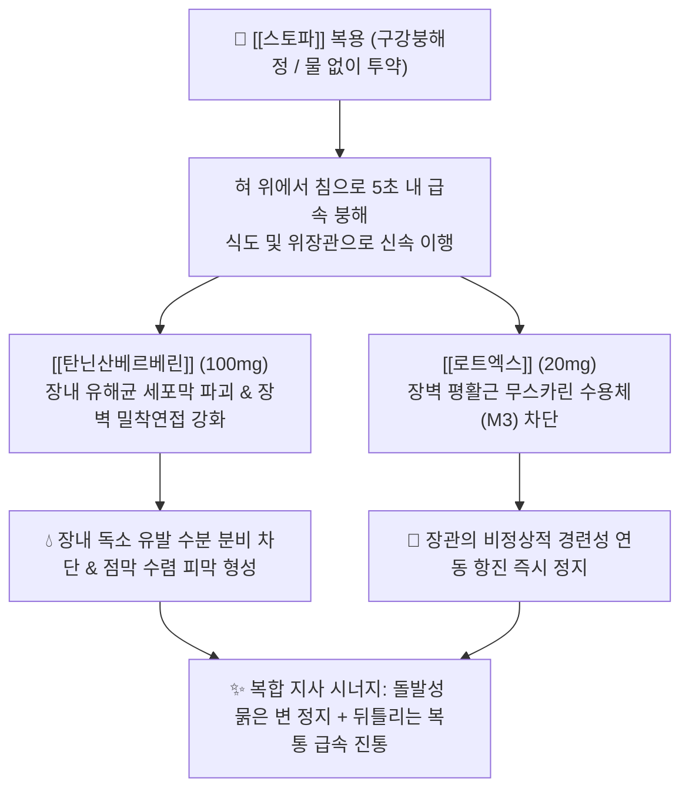

---
aliases:
  - Stoppa
  - 스토파
  - 스토파지사제
  - 라이온스토파
  - 탄닌산베르베린_로트엑스
tags:
  - 의약품
  - 양방약
  - 복합제
  - 일반의약품
  - 지사제
  - 정장제
  - 과민성대장증후군
title: 스토파
created: 2026-09-12
updated: 2026-09-12
---

# 💊 [[스토파]] (Stoppa, Lion Corporation, Orally Disintegrating Tablet)

> **핵심 3줄 요약 (Key Summary)**:
> - 🧪 주성분 배합: 천연 항균·수렴 지사 성분인 [[탄닌산베르베린]](1회 100mg) + 부교감신경 차단 장관 진경 성분인 [[로트엑스]](스코폴리아엑스 1회 20mg)의 복합 구강붕해정(OD정).
> - 📍 복합 약리 기전: 물 없이 혀 위에서 수초 만에 녹아 장내 유해 세균 살균 및 점막 수렴(수분 분비 차단)과 함께, 장 평활근의 경련성 과다 수축을 즉각 억제하여 돌발성 급성 설사와 복통 신속 진정.
> - 🎯 임상 적응증: 이동 중(지하철, 버스, 시험장 등) 발생한 긴급 돌발성 설사, 복통을 동반한 설사, 식체·소화불량성 설사, 설사형 과민성 대장 증후군([[IBS-D]]).
> - ⚠️ 특정 성분 금기: 세균성 이질·고열 동반 감염성 설사 시 독소 배출 방해 위험, [[로트엑스]](항콜린)로 인한 녹내장 및 전립선비대증 환자 금기, 구갈(입마름) 주의.

---

## 1. 복합 구성 성분 및 제형별 함량 (Active Ingredients & Formulations)

  <iframe src="https://embed.molview.org/v1/?mode=balls&cid=2353" style="position: absolute; top: 0; left: 0; width: 100%; height: 100%; border: 0;" title="스토파 핵심 주성분 베르베린 3D 화학 구조식"></iframe>

> [인터랙티브 3D 분자 구조 모델] 스토파 복합제의 핵심 살균·지사 성분인 [[베르베린]] (Berberine, PubChem CID: 2353)

> [그림 1] 베르베린을 주성분으로 함유하는 대표적 청열조습 한약재인 황백나무 및 매자나무속 기원 식물

> [그림 2] 천연 이소퀴놀린 알칼로이드인 [[베르베린]](Berberine) 2D 화학 분자 구조식 (PubChem CID: 2353)

> [그림 3] 장점막 단백질을 침전시켜 보호 피막을 형성하는 [[탄닌산]](Tannic Acid) 2D 화학 분자 구조식 (PubChem CID: 16129778)

### 1.1 스토파 구강붕해정(1회 성인 복용량 기준) 성분 구성표

| 구성 성분 (한글/영문) | 1회 성인 복용량 | 약효 분류 및 역할 | PubChem CID | 주된 약리 작용 및 복합 시너지 포인트 |
| :--- | :--- | :--- | :--- | :--- |
| [[탄닌산베르베린]] (Berberine Tannate) | **100 mg** | 천연 살균·항염 & 점막 수렴제 | [2353](https://pubchem.ncbi.nlm.nih.gov/compound/2353) | 장내 병원성 세균 살균, 장점막 염증 수렴 피막 형성, 수분·전해질 과다 분비 억제 |
| [[로트엑스]] (Scopolia Extract 3배산) | **60 mg** (원말 환산 20mg) | 부교감신경 차단 항콜린 진경제 | [3000322](https://pubchem.ncbi.nlm.nih.gov/compound/3000322) | 장관 평활근의 무스카린성 경련 수축을 억제하여 급격한 복통 및 과다 연동운동 즉시 진정 |

---

## 2. 복합 상승 약리 기전 (Combination Mechanism & Synergy)

* **구강붕해정(ODT: Orally Disintegrating Tablet) 제형의 공간적 초월성**:
  * 설사는 출근길 지하철, 고속도로 운전 중, 중요한 회의나 시험 도중 갑작스럽게 발생하는 경우가 많음.
  * 스토파는 라이온(Lion)의 독자적 고속 붕해 기술로 제조되어 **"물 없이 침만으로 혀 위에서 순식간에 녹여 삼킬 수 있는"** 탁월한 복약 편의성을 제공함.
* **베르베린과 탄닌산의 불용성 결합 복합염(Tannate) 특성**:
  * 순수 염산베르베린은 쓴맛이 극심하고 위장에서 조기 용출되어 위장 자극을 유발할 수 있음.
  * 탄닌산베르베린은 난용성 복합염을 이루어 쓴맛이 억제되며, 위산을 통과하여 알칼리성인 소장 하부 및 대장 부위에서 서서히 해리되어 **대장 병소 부위에 고농도로 지속 작용**함.
* **살균-수렴-진경 3중 상승 효과**:
  * 베르베린이 세균성 장독소에 의한 cAMP/cGMP 경로를 억제하여 장관 내 수분 분비를 줄이고, 탄닌산이 점막 단백질을 응고시켜 보호벽을 치며, 로트엑스가 뒤틀리는 장경련 복통을 차단하여 신속하고 완벽한 지사를 달성함.

---

## 3. 브랜드 패밀리 라인업 비교 (Brand Lineup Analysis)

| 제품 라인업명 | 주요 특징 및 대상 | 맛 및 제형 | 임상 복약 지도 핵심 |
| :--- | :--- | :--- | :--- |
| **스토파 일반형** (Stoppa Diarrhea) | 성인 남녀 공용, 돌발성 급성 설사 1차 | 청량한 자몽맛 구강붕해정 | 물 없이 1회 1정 복용, 4시간 이상 간격 복용 (1일 최대 3회) |
| **스토파 여성용** (Stoppa for Women) | 생리통 동반 설사, 복부 냉증형 설사 | 은은한 사과맛 구강붕해정 | 작약 성분 강화, 월경 주기 전후 장관 과민 반응 환자 특화 |
| **스토파 소아용** (Stoppa Junior) | 만 5세 ~ 14세 청소년용 | 복숭아맛 저용량 정제 | 성인 용량의 1/3~1/2 감량 제형 |
| **[[로페라미드]] 단일제** (경쟁 약물) | 오피오이드 $\mu$-수용체 작용제 (로프민 등) | 캡슐제 (물과 복용) | 장관 운동만을 강력히 마비시킴, 감염성 설사 시 독소 저류 위험 큼 |

---

## 4. 복합제 특이 위험성 및 특정 성분 금기 (Black Box & Red Flags)

### 4.1 감염성 장염(세균성 이질, 고열, 혈변) 시의 복용 금기
* 살모넬라, 시겔라, 캄필로박터, 병원성 대장균 등에 의한 고열, 혈변, 점액변을 동반한 **급성 세균성 장염 환자**에게 지사제를 투여하여 장관 운동을 강제로 멈출 경우, 세균 독소가 배출되지 못하고 체내로 흡수되어 **패혈증(Sepsis) 또는 중증 독성 거대결장증(Toxic megacolon)**을 초래할 수 있음.
* 고열이나 혈변이 동반된 설사에는 복용을 금기하고 즉시 의료기관 진료를 받아야 함.

### 4.2 로트엑스(항콜린제) 관련 금기
* **녹내장 환자**: 동공 산대로 인한 급성 안압 상승 유발 위험.
* **전립선비대증 환자**: 방광 배뇨근 이완으로 인한 급성 뇨저류 위험.
* **심질환자**: 심계항진 및 빈맥 유발.

---

## 5. 한의학적 복합 처방 배오 비교 및 테이퍼링 프로토콜 (Integrative Medicine)

### 5.1 한방 청열조습(淸熱燥濕) 및 수렴지사(收斂止瀉) 원리와의 비교

| 양방 스토파 복합 구성 | 한의 대응 본초/처방 | 한의학적 배오 의미 및 약리 일치성 |
| :--- | :--- | :--- |
| **[[베르베린]] (장내 살균·소염)** | [[황련]], [[황금]], [[황백]] | 군약(君藥): 고한(苦寒)하여 대장의 습열(濕熱)을 끄고 화독(火毒)을 제거하여 설사를 멎게 함 |
| **[[탄닌산]] (점막 수렴 피막)** | [[오매]], [[가자]], [[석류피]], [[권백]] | 신약(臣藥): 산삽(酸澁)하여 활탈(滑脫)된 장기를 수렴하고 진액의 과다 유출을 틀어막음 |
| **[[로트엑스]] (장관 진경 진통)** | [[백작약]], [[감초]] ([[작약감초탕]]) | 좌약(佐藥): 간비불화(肝脾不和)로 인한 복통과 근육 경련을 완급지통(緩急止痛)시킴 |

### 5.2 과민성 대장 증후군(IBS-D) 설사 환자의 한의 치료 및 테이퍼링
* **스트레스성 돌발 설사(간비불화형 IBS)**:
  * 중요한 발표나 시험, 출근길만 되면 배가 살살 아프며 화장실로 달려가는 신경성 설사 환자:
    * 긴급 시에는 스토파를 비상약으로 휴대하게 하되,
    * 근본 치료를 위해 간기를 풀고 비위를 돕는 **[[통사요방]](백출, 백작약, 진피, 방풍)** 또는 장내 염증을 다스리는 **[[반하사심탕]]**, **[[삼령백출산]]**을 투여.
  * 한약 복용으로 장점막 민감도가 감소하면 주 3~4회 찾던 스토파 의존성을 자연스럽게 0회로 종결.
* **침구 치료**:
  * 천추(ST25), 상거허(ST37), 음릉천(SP9), 태충(LR3), 족삼리(ST36) 침 치료를 병행하여 장-뇌 축(Gut-Brain Axis) 안정화.

### 5.3 환자 티칭 스크립트
> "환자분, 스토파는 지하철이나 버스 안, 시험장처럼 물을 마시기 힘든 급박한 상황에서 혀에 넣기만 해도 사르르 녹아 설사와 복통을 신속하게 멈춰주는 최고의 응급 지사제입니다. 한약재 황련과 황백의 핵심 성분인 베르베린이 들어있어 장을 청결하게 해줍니다. 하지만 열이 펄펄 나거나 피가 섞여 나오는 세균성 장염일 때는 독소를 배출해야 하므로 드시면 안 되며, 녹내장이나 전립선 질환이 있으신 분은 입마름이나 소변 불리가 생길 수 있습니다. 평소 긴장할 때마다 설사가 반복되는 과민성 장 질환은 장과 자율신경을 안정시켜 주는 한약 치료를 받으셔야 근본적으로 해결됩니다."

---

## 6. 출처 및 학술 참고 문헌 (References)

1. Chen C, Tao C, Liu Z, et al. A Randomized Clinical Trial of Berberine Hydrochloride in Patients with Diarrhea-Predominant Irritable Bowel Syndrome. *Phytother Res*. 2015;29(11):1822-1827. doi:10.1002/ptr.5475. [PMID: 26400188](https://pubmed.ncbi.nlm.nih.gov/26400188/)
   - [연구 요약] 설사형 과민성 대장 증후군(IBS-D) 환자를 대상으로 베르베린의 임상 효능을 검증한 이중맹검 무작위 대조 시험으로, 배변 빈도 감소, 복통 점수 개선 및 우울/불안 척도 호전을 입증한 랜드마크 논문.

2. Rabbani GH, Butler T, Knight J, Sanyal SC, Alam K. Randomized controlled trial of berberine sulfate therapy for diarrhea due to enterotoxigenic Escherichia coli and Vibrio cholerae. *J Infect Dis*. 1987;155(5):979-984. doi:10.1093/infdis/155.5.979. [PMID: 3549923](https://pubmed.ncbi.nlm.nih.gov/3549923/)
   - [연구 요약] 장독소성 대장균(ETEC) 및 콜레라균에 의한 급성 설사 환자에서 베르베린 투여가 대변 배출량을 유의미하게 감소시키고 체액 손실을 억제함을 실증한 핵심 임상 연구.

3. Sack RB, Froehlich JL. Berberine inhibits intestinal secretory response of Vibrio cholerae and Escherichia coli enterotoxins. *Infect Immun*. 1982;35(2):471-475. doi:10.1128/iai.35.2.471-475.1982. [PMID: 7035365](https://pubmed.ncbi.nlm.nih.gov/7035365/)
   - [연구 요약] 베르베린이 세균성 장독소에 의해 촉발되는 장 점막의 과다 분비 반사를 차단하는 분자생물학적 항분비(Antisecretory) 작용 기전을 최초로 규명한 고전 문헌.
