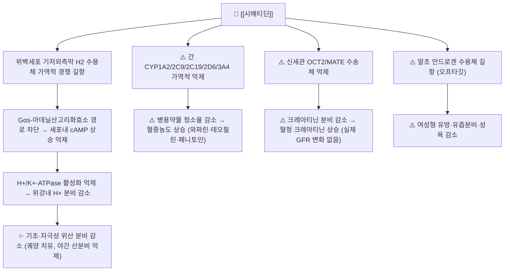

# 💊 [[시메티딘]] (Cimetidine, Tagamet, A02BA01)

> **핵심 3줄 요약 (Key Summary)**:
> 🧪 **주성분·제형**: 이미다졸(imidazole) 고리를 가진 친수성·염기성 저분자 화합물인 [[시메티딘]](C₁₀H₁₆N₆S, MW 252.34)으로, 경구용 정제(200·300·400·800 mg)와 주사제(100 mg/2 mL)로 시판된다. [[히스타민]] H2 수용체에 대한 가역적 경쟁적 길항제 계열의 원형(prototype) 약물이다.
> 📍 **작용 기전**: 위벽세포(parietal cell) 기저외측막의 **H2 수용체를 차단**하여 히스타민 자극성 cAMP 상승을 억제 → 위산(H⁺) 분비 감소. 동시에 **간 CYP450 효소군 억제**와 **신세관 OCT2/MATE 수송체 억제**라는 두 가지 오프타깃 작용을 가진다.
> 🎯 **임상 적응증**: 위·십이지장궤양, 역류성 식도염(GERD), 상부위장관 출혈 예방, 졸링거-엘리슨(Zollinger-Ellison) 증후군. 야간 산분비 억제 목적으로 1일 1회 취침 전 투여가 전통적 표준이었다.
> ⚠️ **주의사항**: 와파린·페니토인·테오필린 등 협대역 치료지수를 가진 약물과의 **상호작용이 계열 내에서 가장 강하다**. 항안드로겐 작용(여성형 유방·성기능 장애), 고령자 인지기능·섬망, CYP 억제에 따른 다약제 상호작용이 대표적 제한점이다.

---

## 1. 약물 기본 정보 및 시판 제품 (Brand Identification)

![[시메티딘_낱알.jpg|540]]
> [그림 1: 식약처 의약품안전나라]

> [!abstract]+ 🧪 3D 약리 분자 구조 (Interactive 3D Viewer)
> <iframe src="https://molecule-viewer-rho.vercel.app/?cid=2756" width="100%" height="450px" frameborder="0" allow="webgl" style="border-radius: 8px;"></iframe>

| 항목 | 상세 정보 |
| :--- | :--- |
| **일반명 (Generic Name)** | [[시메티딘]](한글) / Cimetidine (English Generic Name) |
| **대표 상품명 (Brand Names)** | **타가메트(Tagamet)**, [[시메티딘정]], 한미시메티딘정, 중외시메티딘정, 시메티딘주 등 (※ YAML `aliases:`에 등록하여 위키링크 통합) |
| **ATC 코드 / 분류** | **A02BA01** (H2-receptor antagonists) / 국내 효능군 분류: 234 궤양용제(소화성궤양용제) |
| **PubChem CID** | [2756](https://pubchem.ncbi.nlm.nih.gov/compound/2756) |
| **화학식 / 분자량** | C₁₀H₁₆N₆S / 252.34 g/mol |
| **주요 제형 및 함량** | 정제 200 mg·300 mg·400 mg·800 mg, 경구용 액제, 주사액 100 mg/2 mL (※ 국내 품목별 함량은 허가사항 확인 필요 / 세부 함량 근거 미확인) |
| **식약처 허가 적응증** | 위궤양·십이지장궤양, 문합부궤양, 역류성 식도염, 상부위장관 출혈(예방·치료), 졸링거-엘리슨 증후군, 전신마취 전 흡인성 폐렴 예방(산도 상승 목적) |

### 1.1 대표 시판 제품 및 함유 복합제 매핑 (Brand Identification & Combinations)

| 구분 | 대표 제품명 / 브랜드 | 함유 성분 및 1회당 함량 | 제형 및 특징 | 주요 적응증 및 복약 지도 핵심 |
| :--- | :--- | :--- | :--- | :--- |
| **단일제 (ETC/OTC)** | [[타가메트]], [[시메티딘정]] | [[시메티딘]] 단일 성분 200 mg | 속방정 | 1일 2~4회 분복 또는 취침 전 1회 400~800 mg |
| **주사제 (ETC)** | 시메티딘주 | [[시메티딘]] 100 mg/2 mL | 정맥주사용 액 | 경구 투여 불가 환자, 수술 전 산도 조절, 상부위장관 출혈 |
| **계열 내 대체약 (H2RA)** | [[라니티딘]], [[파모티딘]], [[니자티딘]] | 각 성분 단일제 | 정제 | CYP 억제가 약해 병용약물이 많을 때 우선 고려 |
| **PPI 계열 (상위 대체)** | [[오메프라졸]], [[에소메프라졸]], [[판토프라졸]] | PPI 단일제 | 캡슐, 정제 | 산분비 억제 강도·지속시간 우위, 장기 사용 시 저마그네슘혈증·골밀도 주의 |
| **제산제·위점막보호제 (감별)** | [[개미산정]], [[알마겔]], [[레바미피드]] | 수산화알루미늄·수산화마그네슘 / 레바미피드 | 정제, 현탁액 | 증상 조절 목적. H2RA와 작용 기전·적응이 다름 |

> **복약 지도 포인트**: [[시메티딘]]은 **위 내용물이 비어 있을 때 흡수가 더 균일**하므로 식후 즉시보다는 **식후 1~2시간 또는 취침 전** 투여가 전통적인 처방 관행이다. 제산제(수산화알루미늄·마그네슘 함유)와 병용 시 흡수가 저하될 수 있어 **1~2시간 간격** 투여를 권고한다.

---

## 2. 분자 약리 기전 및 작용 경로 (Mechanism of Action)

* **주요 작용 기전 (Primary MoA)**:
  * **위벽세포 H2 수용체 길항**: [[시메티딘]]은 위점막 위벽세포(parietal cell)의 기저외측막에 발현된 **히스타민 H2 수용체**에 대해 히스타민과 **가역적·경쟁적으로 결합**한다. H2 수용체는 Gs 단백질 결합형 수용체로, 활성화 시 아데닐산고리화효소(adenylyl cyclase)를 자극하여 세포내 **cAMP를 상승**시키고, 이는 H⁺/K⁺-ATPase(프로톤 펌프)를 인산화·활성화하여 위강 내로 H⁺를 분비하게 한다. [[시메티딘]]은 이 초기 단계를 차단함으로써 히스타민·가스트린·아세틸콜린 등 **여러 자극에 의해 유발되는 위산 분비를 폭넓게 억제**한다.
  * **수용체 선택성**: H1 수용체([[항히스타민제]]가 작용하는 표적, 알레르기·혈관 확장 관여)와는 구분되는 **H2 선택적** 길항제로, [[시메티딘]]은 개발 당시 히스타민의 위산분비 작용을 선택적으로 차단하는 최초의 임상 적용 H2 수용체 길항제로 정립되었다 — 이 화합물의 특성 규명과 개발 과정은 Brimblecombe & Duncan(1978)의 연구에서 상세히 기술되었다(PMID: 23336). 같은 시기 Siepler & Campagna(1978)는 H2 수용체 길항제 계열의 임상 약리와 용법을 정리하였다(PMID: 24338).
  * **오프타깃 ①: CYP450 억제** — [[시메티딘]]은 이미다졸 고리의 질소 원자가 간 CYP450의 헴(heme) 철에 배위결합하여 **CYP1A2, CYP2C9, CYP2C19, CYP2D6, CYP3A4를 가역적으로 억제**한다. 계열 내 다른 H2RA([[파모티딘]], [[니자티딘]])에는 이 작용이 거의 없어, **다약제 복용 환자에서는 [[시메티딘]]이 상대적으로 불리**하다.
  * **오프타깃 ②: 신세관 유기양이온 수송체 억제** — 근위세뇨관의 **OCT2(organic cation transporter 2)** 및 **MATE**를 억제하여 크레아티닌·메트포르민 등 양이온성 약물의 세뇨관 분비를 감소시킨다. 이는 **혈청 크레아티닌을 상승**시키지만 실제 사구체여과율(GFR) 저하가 아니므로 신기능 악화로 오인하지 않도록 주의한다.
  * **오프타깃 ③: 항안드로겐 작용** — 말초 안드로겐 수용체를 길항하고 프로락틴 대사를 간섭하여 **여성형 유방, 유즙분비, 성욕 감소**가 나타날 수 있으며, 이 작용은 뒤에서 서술할 피부과적 응용(안드로겐 의존성 질환)의 근거가 되었다(PMID: 3553047).

* **하류 신호전달 및 생화학적 반응**:
  * cAMP↓ → PKA 활성↓ → 프로톤 펌프 인산화 감소 → 위산(H⁺) 및 내인자(intrinsic factor) 분비 감소.
  * 위내 pH 상승에 따라 펩신(pepsin) 활성도 함께 감소하나, **펩신 분비 자체를 직접 억제하는 것은 아님**(위산에 의한 활성화 감소에 이차적).
  * 위산 감소 → 가스트린 음성피드백 소실 → **혈중 가스트린 상승**이 관찰될 수 있음(임상적 유의성은 대개 제한적).

---

## 3. 약동학적 특성 (Pharmacokinetics: ADME)

| 약동학 파라미터 | 수치 및 임상적 의미 |
| :--- | :--- |
| **생체이용률 (Bioavailability, F)** | 경구 약 **60~70%** (대표 보고값) — 초회통과효과가 일부 존재하나 임상적으로 큰 제한은 없음 ※ 제공 논문에서 직접 수치 확인 불가(근거 미확인) |
| **최고혈중농도 도달시간 (Tmax)** | 속방정 기준 **약 1~2시간**. 제산제·음식물과 동시 복용 시 흡수 지연 ※ 근거 미확인 |
| **혈장 단백결합률 (Protein Binding)** | **약 15~20%** (알부민 결합 비율이 낮아 단백결합 상호작용 위험은 작음) ※ 근거 미확인 |
| **간 대사 효소 (Metabolism)** | 간에서 일부 대사되나 **미변화체 배설 비중이 큼**. 대표적 **CYP 억제제(CYP1A2·2C9·2C19·2D6·3A4)**이며, 그 자체의 기질로서의 대사 의존도는 낮음 |
| **배설 반감기 (Elimination t1/2)** | 정상 신기능 성인에서 **약 2시간**(1.5~2.5시간 보고). 신부전 시 유의하게 연장 → **용량 조절 필요** ※ 근거 미확인 |
| **주요 배설 경로 (Excretion)** | **소변(신장) 배설**이 주 경로 — 대부분 미변화체로 배설, 일부 대사체. 담즙·분변 배설은 소량 ※ 두 경로의 정확한 비율은 제공 논문에서 확인 불가(근거 미확인) |

> ⚠️ **약동학 수치에 관한 근거 수준 안내**: 상기 표의 구체적 수치는 표준 약리학 교재에서 통용되는 대표값이며, 이 노트에 제시된 참고 논문 6편(1978~1990)에는 ADME 수치가 직접 보고되지 않았다. 임상 적용 시에는 개별 의약품 허가사항(용법·용량, 신장애 용량 조절 항목)을 우선 확인한다.

---

## _의학/04_임상 용법·용량 및 처방 가이드 (Dosage & Administration)

| 임상 적응증 | 성인 표준 용법·용량 | 1일 최대 한도 용량 |
| :--- | :--- | :--- |
| **위·십이지장궤양 (활동기)** | 1회 200~400 mg, 1일 2~4회 식간·취침 전 / 또는 취침 전 800 mg 1일 1회 | 대개 1,600 mg/day 이하 |
| **유지 요법 (재발 방지)** | 취침 전 400 mg 1일 1회 | 400 mg/day |
| **역류성 식도염·GERD** | 1회 400 mg, 1일 2~4회 또는 취침 전 800 mg | 1,600 mg/day |
| **상부위장관 출혈 예방(중환자)** | 주사제 100 mg(또는 200 mg) 정맥주사, 4~6시간 간격 | 개별 프로토콜에 따름 |
| **수술 전 흡인성 폐렴 예방** | 수술 전날 취침 전 및 수술 당일 아침 경구 투여 | 단회 프로토콜 |
| **신장애 환자** | CrCl 저하 시 **투여 간격 연장 또는 용량 감소**(예: CrCl 15~30 mL/min에서 통상 용량의 50% 또는 간격 2배) | 반감기 연장 고려 필수 |

> **처방 실무 노트**: [[라니티딘]]·[[파모티딘]] 등 계열 후속 약물이 효력 지속시간·상호작용 측면에서 유리하여, **현대 임상에서 [[시메티딘]]의 1차 사용 빈도는 감소**하였다. 그러나 가격이 저렴하고 약효가 검증되어 있어 자원 제한적 환경 및 특정 상부위장관 출혈 프로토콜에서는 여전히 사용된다.

---

## 5. 부작용, 경고 및 약물 상호작용 (Adverse Effects & Interactions)

### 5.1 주요 부작용 및 독성 경고 (Black Box Warnings)

* **소화기·중추신경계**:
  * 설사·변비·구역, 일시적 어지럼. **고령자·신부전 환자에서 혼돈, 초조, 섬망, 환각** 등 중추신경계 부작용이 보고되어 있다(뇌혈관장벽 통과 및 신배설 지연이 기전으로 추정). 고령자·신장애 환자에서 용량 조절이 핵심이다.
* **내분비계 (항안드로겐 작용)**:
  * **여성형 유방(gynecomastia), 유즙분비(galactorrhea), 성욕 감소, 발기부전**이 용량·기간 의존적으로 나타날 수 있다. 이는 [[시메티딘]]이 계열약 중 상대적으로 특징적인 부작용이며, **안드로겐 수용체 길항** 기전으로 설명된다. 이러한 항안드로겐 작용은 역설적으로 안드로겐 의존성 피부질환(여성 다모증, 여드름 등)의 치료적 응용으로 이어졌다(Aram H, 1987, PMID: 3553047).
* **간·신·혈액**:
  * 일시적 간효소(AST/ALT) 상승, 드물게 간세포 손상 보고. **혈청 크레아티닌 상승**은 OCT2/MATE 억제로 인한 세뇨관 분비 감소에 기인하는 것으로 **실제 신손상이 아닐 수 있으므로** 신기능 평가 시 해석에 주의한다. 드물게 호중구 감소 등 혈액학적 이상이 보고되어 있다.
  * 국제암연구소(IARC)는 1990년 시메티딘을 대상으로 한 발암성 평가 모노그래프를 발표하였다(IARC Monogr Eval Carcinog Risks Hum, 1990, PMID: 2292801). **해당 모노그래프의 구체적 분류 등급 및 평가 결론은 제공된 서지정보만으로는 확인되지 않음(근거 미확인)** — 원문 확인이 필요하다.
* **알레르기 및 과민반응**:
  * 피부 발진, 두드러기, 발열, 드물게 아나필락시스. 초기 임상 보고 및 안전성 논의는 1978년 JAMA 및 S Afr Med J 문헌에서 다루어졌다(PMID: 621832, PMID: 360437).

### 5.2 주요 병용 금기 및 상호작용

* **CYP450 매개 상호작용 (계열 내 최강)**:
  * **[[와파린]]**: CYP2C9·3A4 억제 → INR 상승·출혈 위험 증가. 병용 시 INR 집중 모니터링, 필요 시 다른 H2RA 또는 PPI로 교체.
  * **[[페니토인]]·[[카르바마제핀]]**: 혈중농도 상승 → 독성(안구진탕, 운동실조) 위험.
  * **[[테오필린]]**: CYP1A2 억제 → 혈중농도 상승, 빈맥·경련 위험(치료역 좁음).
  * **[[리도카인]]·[[메트로니다졸]]·[[삼환계항우울제]]·[[벤조디아제핀]](특히 클로르디아제폭시드)·[[설포닐우레아]]**: 대사 저해로 작용 연장·저혈당 위험.
  * **[[에르고타민]]·[[시사프리드]]·일부 항부정맥제**: QT 연장·혈관수축 독성 위험. 병용을 피하거나 감량.
* **수송체 매개 상호작용 (OCT2/MATE)**:
  * **[[메트포르민]]**: 신세관 분비 감소 → 혈중농도 상승 및 젖산산증 위험 증가 가능. 병용 시 신기능 확인 및 용량 조정 고려.
  * **프로카인아미드·트리암테렌 등 양이온성 약물**: 분비 저해로 혈중농도 상승 가능.
* **흡수 간섭**:
  * **제산제(수산화알루미늄·수산화마그네슘), 흡착제(활성탄), 철제**: 위내 pH 상승 및 흡착으로 [[시메티딘]] 흡수 저하 → **1~2시간 시간차 투여**.
  * **케토코나졸·이트라코나졸·아타자나비르 등 산성 환경 의존 약물**: 위산 감소로 흡수 저하 → 병용 시 PPI/H2RA와 시간차 또는 대체약 고려.
* **중복 투여 금지**:
  * 동일 성분 또는 동일 계열(H2RA) 중복, PPI 병용은 근거 없이 산분비를 과도하게 억제하므로 피한다. **음주**는 위점막 자극과 간대사 부담을 동시에 증가시키므로 복용 중 절주를 권고한다.

---

## 6. 한의 치료 연계 및 병용/테이퍼링 프로토콜 (Integrative Medicine)

### 6.1 한약·양약 병용 투여 안전성 및 시너지 배오

* **간 대사 간섭 완충 처방 (핵심 주의)**:
  * [[시메티딘]]은 **CYP1A2·2C9·2C19·2D6·3A4 억제제**이므로, 이 효소들로 대사되는 한약 성분의 혈중농도를 예상치 못하게 상승시킬 수 있다. 대표적으로 **황련·황백(베르베린)**, **당귀·천궁(프탈라이드계)**, **감초(글리시리진 → 글리시레트산)**, **오미자(리그난류)**, **산사·진피(플라보노이드류)** 등은 CYP 매개 대사와 겹칠 가능성이 있어 **투여 1~2시간 시간차** 및 **저용량 시작** 원칙을 적용한다. 다만 개별 본초-시메티딘 간 정량적 상호작용 데이터는 제공 논문에서 확인되지 않음(근거 미확인) — 병용 시 증상·간기능 추적이 실질적 안전장치이다.
  * **감초**의 경우 위점막 보호 목적으로 소화성궤양 처방에 빈용되나, 나트륨 저류·저칼륨혈증·혈압 상승 위험이 있어 [[시메티딘]]의 드문 부작용(어지럼, 전해질 이상)과 감별이 어려울 수 있다.
* **상승 배오 (Synergy)**:
  * **제산·제통·건비(制酸·制痛·健脾) 전략**: 소화성궤양·위염의 한의 변증은 대개 **간위불화(肝胃不和)**, **비위허한(脾胃虛寒)**, **위음부족(胃陰不足)**, **어혈(瘀血)**로 나뉜다. 대표 처방으로 [[반하사심탕]](간위불화·열증), [[평위산]]·[[곽향정기산]](습체·식체), [[이중탕]]·[[향사육군자탕]](비위허한), [[좌금환]](간화범위), [[시호계지탕]](기능성 소화불량)을 상황에 따라 배합한다.
  * **국소 제산·생기(制酸·生肌) 본초**: [[오적골]](오징어 뼈, 탄산칼슘 주성분), [[해표초]](해표초산칼슘), [[모려]], [[백급]], [[연자육]] 등은 위산 중화·점막 피복 작용으로 H2RA와 **기전이 상호 보완적**이다(산도 상승 + 점막 재생). 단, [[오적골]]·[[해표초]]는 제산력이 강해 **[[시메티딘]] 흡수를 저하**시킬 수 있으므로 1~2시간 시간차 투여가 필요하다.
  * **진통·소염 배오**: [[원호삭]](연호색), [[천련자]], [[목향]], [[사인]], [[후박]] 등은 위장관 운동 조절 및 진경 작용으로 궤양성 통증 완화에 병용된다.
* **경락·침구 연계**: 중완(CV12), 족삼리(ST36), 내관(PC6), 태충(LR3), 공손(SP4) 등을 변증에 따라 배합하여 위장관 운동·자율신경 조절을 목표로 한다. 침 치료가 위산 분비 및 위점막 혈류에 미치는 정량적 효과와 [[시메티딘]] 병용 시의 상호작용은 **근거 미확인**이나, 약물 감량 과정의 보조 요법으로 실무에서 널리 활용된다.

### 6.2 양약 감량 및 한의 전환(테이퍼링) 가이드

* **감량 프로토콜 (H2RA 기준, 실무적 접근)**:
  1. **1단계 — 병행기 (2~4주)**: [[시메티딘]] 표준 용량 유지 + 한약·침 치료 병행. 증상(속쓰림·야간 통증·공복통) 일지 작성 및 야간 증상 빈도 평가.
  2. **2단계 — 용량 유지, 횟수 감소**: 야간 증상이 2주간 소실되면 1일 2~4회 분복 → **취침 전 1회(400 mg)** 로 통합.
  3. **3단계 — 격일 투여**: 400 mg **격일 1회** 또는 200 mg 1일 1회로 감량, 2주간 관찰.
  4. **4단계 — 필요시 복용(on-demand)**: 증상 발생 시에만 단회 복용. 한약은 유지(예: [[향사육군자탕]] 또는 [[반하사심탕]] 가미)하여 재발 방지.
  5. **5단계 — 중단 및 추적**: 4주간 무증상이면 중단. **H. pylori 감염이 확인된 경우**에는 테이퍼링 이전에 제균 치료가 우선이며, 제균 없이 산분비 억제제만 감량하면 재발률이 높다.
* **감량 시 주의**:
  * **반동성 산분비 항진(rebound acid hypersecretion)** — 장기 복용 후 급격한 중단 시 위산 분비가 일시적으로 반동 증가할 수 있다. **단계적 감량**과 한약·식이 조절(자극성 음식·카페인·음주 회피)을 병행한다.
  * **[[시메티딘]] 특이적 고려** — CYP 억제로 인한 병용약물 농도 변화가 감량 과정에서 **역방향으로 변동**(시메티딘 감량 시 와파린·테오필린 농도가 변동)할 수 있으므로, 감량 기간에는 병용약물 모니터링을 강화한다.
  * **경고성 증상 감별** — 체중 감소, 연하곤란, 흑색변, 토혈, 45세 이상 신규 발병, 야간 통증 악화는 **악성 종양 배제**를 위한 내시경 검사가 우선이며, 한의 단독 치료로 진행해서는 안 된다.

---

## 7. 💡 사용자 진료실 핵심 필기 & 실전 임상 체크리스트

### 7.1 진료실 3대 핵심 문진 체크리스트

1. **복용 중인 전체 약물 목록 확인 (최우선)**:
   * [[시메티딘]]은 **CYP450 억제제**이므로 와파린·테오필린·페니토인·리도카인·삼환계항우울제·설포닐우레아·메트포르민 복용 여부를 반드시 확인한다. OTC 소화제(제산제)를 함께 복용하는지도 확인하여 **시간차 투여**를 지도한다.
2. **기저 질환 및 신기능 확인**:
   * 신부전(CrCl 저하)·고령(65세 이상)에서는 반감기 연장으로 **중추신경계 부작용(혼돈·섬망) 및 크레아티닌 상승** 위험이 증가한다. 신기능 수치를 확인하고 용량·간격 조정 여부를 판단한다.
3. **증상 호전도·경고 증상 모니터링**:
   * 야간 통증·공복통·속쓰림의 빈도 변화를 기록하고, **체중 감소·흑색변·토혈·연하곤란·빈혈** 등 경고 증상이 있으면 즉시 내시경 의뢰한다. 여성형 유방·유즙분비·성기능 변화 등 **항안드로겐성 부작용**도 장기 복용 시 문진한다.

### 7.2 환자 티칭 스크립트

> *"환자분, 지금 드시는 시메티딘은 위산 분비를 줄여서 속쓰림과 궤양 통증을 완화하는 약입니다. 두 가지 꼭 기억해 주세요. 첫째, 이 약은 다른 약의 대사를 늦춰서 혈중 농도를 올릴 수 있어서, 와파린·테오필린·간질약·혈당강하제를 함께 드시는 경우 반드시 저에게 알려주셔야 합니다. 둘째, 제산제나 오적골·해표초가 든 한약과 같이 드실 때는 최소 1~2시간 간격을 두고 복용해 주세요. 또 오래 드시면 여성형 유방이나 성기능 변화가 생길 수 있고, 신장 기능이 떨어져 있거나 연세가 많으신 분은 어지럼·혼돈이 나타날 수 있습니다. 저희 한의원에서는 침과 한약으로 위점막을 회복시키고 위장관 운동을 조절하면서, 시메티딘은 취침 전 1회 → 격일 → 필요할 때만 복용하는 방식으로 서서히 줄여나가겠습니다. 다만 체중이 빠지거나 검은 변, 피 토하는 증상이 있으면 즉시 말씀해 주시고 내시경 검사를 먼저 받으셔야 합니다."*

---

## 8. 출처 및 학술 참고 문헌 (References)

* Brimblecombe RW, Duncan WA. Characterization and development of cimetidine as a histamine H2-receptor antagonist. *Gastroenterology*. 1978. **PMID: 23336**
  * `[연구 요약]` [[시메티딘]]의 화합물 특성 규명 및 H2 수용체 길항제로서의 개발 과정. 히스타민의 위산분비 자극을 선택적으로 차단하는 화합물 스크리닝과 구조-활성 관계의 원형 자료.
* Siepler JK, Campagna KD. H2 receptor antagonists. *Am J Hosp Pharm*. 1978. **PMID: 24338**
  * `[연구 요약]` H2 수용체 길항제 계열의 임상 약리·용법·용량 및 초기 임상 적용 정리.
* Karpow S, Gotz V. Cimetidine. *JAMA*. 1978. **PMID: 621832**
  * `[연구 요약]` 시메티딘의 초기 임상 사용 및 안전성 관련 논의(부작용·상호작용 인식 형성 시기의 문헌).
* (저자 미상). Cimetidine. *S Afr Med J*. 1978. **PMID: 360437**
  * `[연구 요약]` 시메티딘의 임상 효능·적응증에 관한 초기 종설적 보고.
* Aram H. Cimetidine in dermatology. *Int J Dermatol*. 1987. **PMID: 3553047**
  * `[연구 요약]` [[시메티딘]]의 **항안드로겐 작용**을 이용한 피부과적 응용 — 안드로겐 의존성 질환(여성 다모증 등)에서의 치료적 활용 및 부작용(여성형 유방 등) 논의.
* (저자 미상). Cimetidine. *IARC Monogr Eval Carcinog Risks Hum*. 1990. **PMID: 2292801**
  * `[연구 요약]` 국제암연구소(IARC)의 시메티딘 발암성 평가 모노그래프. **구체적 분류 등급 및 결론은 제공된 서지정보만으로 확인되지 않음(근거 미확인)** — 원문 대조 필요.
* Brunton LL, Hilal-Dandan R, Knollmann BC, eds. *Goodman & Gilman's The Pharmacological Basis of Therapeutics*. 13th ed. McGraw-Hill; 2018.
  * `[연구 요약]` 약물의 분자 약리학, 약동학 및 임상 치료 지침 총람(위산분비 생리 및 H2 수용체 길항제 계열 항목).
* 식품의약품안전처 의약품안전나라 의약품통합정보시스템 (https://nedrug.mfds.go.kr)
  * `[연구 요약]` 국내 허가 의약품의 품목 기준코드, 허가사항, 용법용량 및 부작용 안전성 정보.

<!-- 보관 태그(1회용·링크오류, 필요시 복원): H2수용체차단제, CYP450억제, OCT2억제 -->
