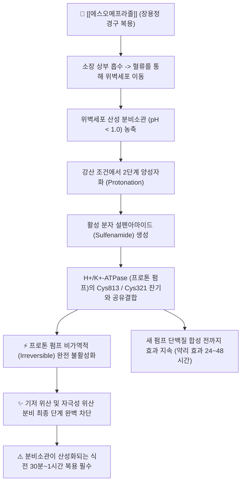
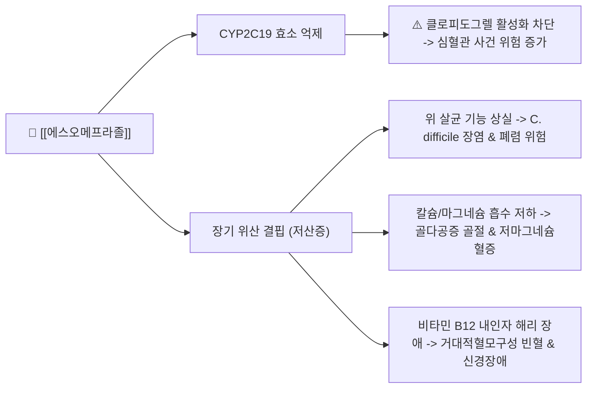

---
aliases:
  - Nexium
  - 넥시움
  - 넥시움정
  - 에스오메프라졸
  - Esomeprazole
  - A02BC05
tags:
  - 약리/양방약
  - 소화기계
  - 소화성궤양용제
  - PPI
  - 프로톤펌프억제제
  - 위식도역류질환
---

# 💊 [[에스오메프라졸]] (Esomeprazole, Nexium, A02BC05)

> **핵심 3줄 요약 (Key Summary)**:
> 🧪 주성분·제형: [[에스오메프라졸]] (Esomeprazole) 단일 성분, 오메프라졸의 순수 S-거울상이성질체로 개발된 글로벌 1위 프로톤 펌프 억제제(PPI), 연한 자주색 타원형 장용성 필름코팅정(20mg, 40mg) 및 주사제.
> 📍 작용 기전: 위벽세포 산성 분비소관에서 활성형 설펜아마이드로 변환되어 H+/K+-ATPase의 시스테인 잔기와 비가역적 이황화 결합을 형성, 위산 분비 최종 단계를 차단 (식전 30분 복용 필수).
> 🎯 임상 적응증: 미란성 역류식도염 치료 및 재발 방지 장기 유지요법, 증상성 위식도역류질환, NSAIDs 유발 위궤양 치료 및 예방, 헬리코박터 파일로리 박멸 삼제요법, 졸링거-엘리슨 증후군.
> ⚠️ 주의사항: 클로피도그렐과의 CYP2C19 대사 경쟁(항혈소판 효과 저하 주의), 장기 투여 시 저마그네슘혈증·골다공증성 골절·비타민 B12 흡수 장애 및 C. difficile 장염 위험, 급단약 시 반동성 위산 분비.

---

## 📌 목차
1. [약물 기본 정보 및 시판 제품 (Brand Identification)](#1-약물-기본-정보-및-시판-제품-brand-identification)
2. [분자 약리 기전 및 작용 경로 (Mechanism of Action)](#2-분자-약리-기전-및-작용-경로-mechanism-of-action)
3. [약동학적 특성 (Pharmacokinetics: ADME)](#3-약동학적-특성-pharmacokinetics-adme)
4. [임상 용법·용량 및 처방 가이드 (Dosage & Administration)](#4-임상-용법용량-및-처방-가이드-dosage--administration)
5. [부작용, 경고 및 약물 상호작용 (Adverse Effects & Interactions)](#5-부작용-경고-및-약물-상호작용-adverse-effects--interactions)
6. [한의 치료 연계 및 병용/테이퍼링 프로토콜 (Integrative Medicine)](#6-한의-치료-연계-및-병용테이퍼링-프로토콜-integrative-medicine)
7. [💡 사용자 진료실 핵심 필기 & 실전 임상 체크리스트](#7--사용자-진료실-핵심-필기--실전-임상-체크리스트)
8. [출처 및 학술 참고 문헌 (References)](#8-출처-및-학술-참고-문헌-references)

---

## 1. 약물 기본 정보 및 시판 제품 (Brand Identification)

> [!abstract]+ 🧪 3D 약리 분자 구조 (Interactive 3D Viewer)
> <iframe src="https://molecule-viewer-rho.vercel.app/?cid=9568614" width="100%" height="450px" frameborder="0" allow="webgl" style="border-radius: 8px;"></iframe>

![[넥시움_패키지.jpg|350]]
> [그림 1] [[에스오메프라졸]]의 대표적인 시판 완제의약품 패키지 외형 (아스트라제네카 오리지널 넥시움정 40mg)

![[넥시움_알약성상.jpg|350]]
> [그림 2] 넥시움(Nexium) 40mg 자주색 타원형 필름코팅정 알약 성상 및 PTP 블리스터 포장

![[에스오메프라졸_화학구조.png|300]]
> [그림 3] [[에스오메프라졸]]의 2D 평면 화학 분자 구조식 (PubChem CID 9568614)

| 항목 | 상세 정보 |
| :--- | :--- |
| **일반명 (Generic Name)** | [[에스오메프라졸]] (에스오메프라졸 마그네슘) / Esomeprazole magnesium |
| **대표 상품명 (Brand Names)** | **넥시움정 (Nexium, 아스트라제네카 오리지널), 에소메졸정/캡슐 (한미약품 개량신약)** |
| **ATC 코드 / 분류** | A02BC05 (Proton pump inhibitors) / 식약처 분류 232 (소화성궤양용제) |
| **PubChem CID** | [9568614](https://pubchem.ncbi.nlm.nih.gov/compound/9568614) (마그네슘염: [23665768](https://pubchem.ncbi.nlm.nih.gov/compound/23665768)) |
| **화학식 / 분자량** | C17H19N3O3S (마그네슘염 삼수화물: C34H36MgN6O6S2·3H2O) / 345.4 g/mol (염 삼수화물: 767.2 g/mol) |
| **주요 제형 및 성상** | 20mg: 연한 분홍색 타원형 장용성 필름코팅정 (한 면에 '20mg', 다른 면에 'A/EH') 40mg: 연한 자주색 타원형 장용성 필름코팅정 (한 면에 '40mg', 다른 면에 'A/EI') 주사제: 40mg 분말 바이알 (정맥 점적 주사용) |
| **식약처 허가 적응증** | 1. 위식도역류질환(GERD): 미란성 역류식도염의 치료, 재발 방지를 위한 장기 유지요법, 비미란성 역류질환의 증상 치료 2. 헬리코박터 파일로리 박멸을 위한 항생제 병용요법 (아목시실린 + 클래리스로마이신) 3. 비스테로이드소염진통제(NSAIDs) 투여와 관련된 위궤양의 치료 및 고위험군 예방 4. 졸링거-엘리슨 증후군 등 병적 위산 과다분비 질환의 치료 5. 급성 위궤양 또는 십이지장궤양 출혈 환자의 내시경 지혈술 후 재출혈 예방 |

### 1.1 오메프라졸 vs 에스오메프라졸 광학 이성질체 비교 매핑

| 구분 | [[라세미체 오메프라졸]] (Prilosec) | [[에스오메프라졸]] (넥시움, Nexium) | 임상적 의의 및 차별점 |
| :--- | :--- | :--- | :--- |
| **화학 구조** | R-이성질체 50% + S-이성질체 50% 혼합물 | **순수 S-거울상이성질체 (S-enantiomer 100%)** | 단일 이성질체 분리로 대사 안정성 확보 |
| **간 초회통과 대사** | CYP2C19에 의해 R형이 대량 분해되어 제거 | S형은 CYP2C19 대사율이 낮고 CYP3A4 우회 | 간 제거율 감소로 **전신 혈중 농도(AUC) 70~90% 상승** |
| **환자 간 약효 편차** | CYP2C19 빠른 대사자(EM)에서 약효 급감 | 빠른 대사자에서도 높은 생체이용률 유지 | 환자 간 치료 반응의 일관성 및 점막 치유율 대폭 개선 |
| **임상 권장 투여** | 1일 1회 20mg | 1일 1회 40mg (중증 식도염), 20mg (유지) | 세계에서 가장 널리 입증된 골드 스탠다드 PPI |

---

## 2. 분자 약리 기전 및 작용 경로 (Mechanism of Action)

* **전구약물(Prodrug)의 산성 환경 활성화 메커니즘**:
  * [[에스오메프라졸]]은 그 자체로는 불활성인 약염기성 전구약물입니다. 위산에 의해 분해되지 않도록 장용성(Enteric coating) 펠릿 정제로 조제되어 위를 통과한 후 소장에서 흡수됩니다.
  * 혈류를 타고 위벽세포(Parietal cell)에 도달한 약물은 pH 1.0 미만의 강산성 환경을 유지하는 세포막 분비소관(Secretory canaliculi) 내부로 수동 확산되어 1,000배 이상 고농도로 농축됩니다.
  * 이곳에서 양성자(H+)와 결합하여 활성 형태인 영구적 양이온 화합물 **설펜아마이드(Tetracyclic sulfenamide)**로 변환됩니다.

* **프로톤 펌프(H+/K+-ATPase)와의 비가역적 공유결합**:
  * 생성된 설펜아마이드는 위산 분비의 최종 공통 경로인 H+/K+-ATPase의 세포외 도메인에 위치한 시스테인 잔기(특히 Cys 813 및 Cys 321)의 설프히드릴기(-SH)와 **비가역적 이황화 결합(Disulfide bond, -S-S-)**을 형성합니다.
  * 이로 인해 프로톤 펌프는 영구적으로 불활성화되어 히스타민, 아세틸콜린, 가스트린 등 어떠한 자극 물질에 의해서도 H+를 위강 내로 배출하지 못하게 됩니다.
  * 약물의 혈중 반감기는 약 1.3시간에 불과하지만, 비가역 결합 특성상 위벽세포에서 새로운 프로톤 펌프가 de novo 합성되어 세포막에 삽입될 때까지(반감기 약 24~48시간) 강력한 무산증 상태가 지속됩니다.

* **식전 30분 복용이 필수적인 이유 (Clinical Pharmacodynamics)**:
  * 프로톤 펌프는 식사 자극에 의해 위벽세포 세포질의 세관소포(Tubulovesicle)에서 분비소관 세포막으로 이동하여 활성화될 때 비로소 억제제와 결합할 수 있는 시스테인 잔기가 노출됩니다.
  * 따라서 식사 30분~1시간 전에 복용해야 약물이 혈류를 타고 분비소관에 도달하는 타이밍과 식사로 인해 프로톤 펌프가 막에 삽입되는 타이밍이 일치하여 최대의 위산 억제율을 얻을 수 있습니다.

---

## 3. 약동학적 특성 (Pharmacokinetics: ADME)

| 약동학 파라미터 | 수치 및 임상적 의미 |
| :--- | :--- |
| **생체이용률 (Bioavailability, F)** | 초회 투여 시 약 50~64%, 1일 1회 반복 투여 시 **약 89%까지 상승** (간 초회통과 대사가 자가포화됨) |
| **최고혈중농도 도달시간 (Tmax)** | **1.5~2.0 시간** (장용 코팅이 십이지장에서 용해되어 흡수되는 시간 소요) |
| **식사 영향 (Food Effect)** | 음식물 섭취 시 생체이용률(AUC)이 33~53% 현저히 감소하므로 반드시 **식전 30분~1시간 공복 복용** 준수 |
| **혈장 단백결합률 (Protein Binding)** | **97.0%** (주로 혈청 알부민 및 $\alpha$1-산성 당단백질과 결합) |
| **간 대사 효소 (Metabolism)** | 주로 간의 **CYP2C19**에 의해 하이드록시 및 탈메틸 대사산물로, 일부 **CYP3A4**에 의해 설폰 대사산물로 대사됨 |
| **배설 반감기 (Elimination t1/2)** | **약 1.3~1.5 시간** (반복 투여 시 약 1.5시간으로 약간 연장) |
| **주요 배설 경로 (Excretion)** | 불활성 대사체로서 소변으로 약 80%, 대변(담즙)으로 약 20% 배설 (원형 배설체는 1% 미만) |

---

## 4. 임상 용법·용량 및 처방 가이드 (Dosage & Administration)

| 임상 적응증 | 성인 표준 용법·용량 | 권장 투여 기간 및 주의점 |
| :--- | :--- | :--- |
| **미란성 역류식도염 (치료)** | 1일 1회 40mg 식전 30분 복용 | 4주간 투여. 치유되지 않거나 증상 지속 시 추가 4주 투여 (총 8주) |
| **식도염 치료 후 유지요법** | 1일 1회 20mg 식전 30분 복용 | 재발 방지를 위해 최대 6개월~1년간 지속 유지 |
| **비미란성 역류질환 (NERD)** | 1일 1회 20mg 식전 30분 복용 | 4주간 투여 후 증상 소실 시 필요 시 투여(On-demand) 전환 가능 |
| **NSAIDs 관련 위궤양 예방** | 1일 1회 20mg 식전 복용 | 진통소염제(NSAIDs) 복용 기간 동안 지속 병용 |
| **헬리코박터 파일로리 제균** | 1회 20mg, 1일 2회 (아침, 저녁 식전) | 아목시실린 1,000mg + 클래리스로마이신 500mg과 병용하여 7~14일간 투여 |
| **졸링거-엘리슨 증후군** | 초기 1회 40mg 1일 2회 복용 | 환자 반응에 따라 1일 최대 80~160mg까지 증량 분할 투여 |

### 4.1 투약 시 주의사항
* **정제 복용법**: 정제는 씹거나 부수지 말고 물과 함께 그대로 삼켜야 합니다. 장용성 코팅이 위산에 노출되어 파괴되면 약효가 소실됩니다.
* **삼킴 곤란 환자**: 정제를 비탄산수 반 컵에 넣어 저으면 미세 펠릿으로 분산되므로, 30분 이내에 마시고 컵을 헹궈 마십니다 (펠릿을 씹어서는 안 됨).

---

## 5. 부작용, 경고 및 약물 상호작용 (Adverse Effects & Interactions)

### 5.1 장기 투여 시 5대 안전성 경고 (FDA Class Warnings)
* **골다공증성 골절 (Osteoporotic Fractures)**:
  * 고용량 및 1년 이상 장기 복용 시 위산 저하로 탄산칼슘의 이온화 및 흡수가 방해받아 고관절, 손목, 척추 골절 위험이 약 25~40% 증가합니다. 고령 환자에게는 비타민 D 및 구연산칼슘(산 없이도 흡수 가능) 보충을 권장합니다.
* **저마그네슘혈증 (Hypomagnesemia)**:
  * 3개월 이상(대부분 1년 이상) 투여 시 장관의 TRPM6/7 마그네슘 수송체 기능 저하로 테타니(근경련), 부정맥, 발작이 나타날 수 있습니다.
* **클로스트리디오이데스 디피실 장염 (CDAD: C. difficile-Associated Diarrhea)**:
  * 위산의 살균 장벽이 무너지면서 장내 세균총 교란 및 아포균 번식으로 중증 수양성 설사와 대장염이 촉발될 수 있습니다.
* **비타민 B12 결핍증**:
  * 단백질과 결합된 비타민 B12가 위산과 펩신에 의해 유리되지 못하여 흡수 부전과 말초신경병증이 발생할 수 있습니다.

### 5.2 주요 병용 금기 및 상호작용
* **항혈소판제 [[클로피도그렐]] (Plavix)과의 상호작용 (FDA 중대 경고)**:
  * 클로피도그렐은 간의 CYP2C19에 의해 활성 대사체로 전환되어야 혈소판 응집 억제 효능을 냅니다.
  * 에스오메프라졸은 CYP2C19을 경쟁적으로 억제하여 클로피도그렐 활성체 형성을 40% 이상 감소시켜 **스텐트 혈전증, 심근경색, 뇌졸중 재발 위험**을 높입니다.
  * 클로피도그렐 복용 환자에게 위 보호제가 필요한 경우 CYP2C19 억제력이 미미한 판토프라졸 또는 P-CAB([[테고프라잔]])으로 대체해야 합니다.
* **항진균제 (케토코나졸, 이트라코나졸) 및 철분제**:
  * 위내 pH 상승으로 약물의 용해도와 장관 흡수가 급감하므로 병용을 피합니다.
* **[[메토트렉세이트]] (MTX)**:
  * PPI가 신장의 BCRP/OAT 수송체를 억제하여 MTX 청소율을 낮춰 중증 골수 억제 및 신독성을 유발할 수 있습니다.

---

## 6. 한의 치료 연계 및 병용/테이퍼링 프로토콜 (Integrative Medicine)

### 6.1 한약·양약 병용 투여 안전성 및 시너지 배오

* **위장관 운동성 회복 및 소화관 담음(痰飮) 배출: [[반하사심탕]], [[생강사심탕]], [[평위산]]**:
  * PPI는 위산 분비를 원천 봉쇄하지만 위 배출 지연(Gastric emptying delay)을 유발하여 음식물이 위에 오래 머무르면서 트림, 상복부 팽만감, 비심하(心下痞)를 악화시킵니다.
  * **[[반하사심탕]]**은 황련, 황금의 항염증 작용으로 식도 점막을 직접 보호하고, 반하, 건강의 온중화담 작용으로 위장관 평활근 연동 운동을 자극하여 위산 역류를 물리적으로 차단합니다.
  * 위내 습담(濕痰) 정체로 명치가 답답하고 소화가 안 될 때는 **[[평위산]]**을 식후 배오합니다.

* **저산증 완충 및 비위 기허(氣虛) 보강: [[육군자탕]], [[향사육군자탕]], [[보중익기탕]]**:
  * 수개월 이상 넥시움을 복용하여 위산 부족으로 인한 만성 소화장애, 식욕 부진, 연변(묽은 변), 기력 저하를 호소하는 환자에게 **[[육군자탕]]** 또는 **[[향사육군자탕]]**을 병용하면 위 점액 분비를 촉진하고 소화 흡수 기능을 회복시켜 양약 의존성을 줄여줍니다.

* **경혈 자극을 통한 하부식도괄약근 긴장도 강화**:
  * 족삼리(ST36), 중완(CV12), 내관(PC6), 천추(ST25) 전침 자극은 뇌-장 축(Brain-Gut Axis)을 안정화하고 미주신경 활성을 통해 하부식도괄약근(LES)의 압력을 상승시켜 산 역류 억제 시너지를 제공합니다.

### 6.2 양약 감량 및 한의 전환(테이퍼링) 가이드
* **반동성 위산 과다분비(Acid Rebound) 예방 테이퍼링 로드맵**:
  * 장기 PPI 복용 환자가 갑자기 약을 끊으면 가스트린 증가로 인해 위벽세포가 비후되어 투약 전보다 위산이 폭발적으로 분비되는 반동성 위산과다(Acid rebound)가 발생하여 환자가 심한 작열감을 느끼고 다시 약에 의존하게 됩니다.
  * **1단계 (절반 감량, 2~4주)**: 넥시움 40mg 복용 환자는 20mg으로 감량하고, 동시에 **[[반하사심탕]]** 과립제(1일 3회 식후)를 병용하여 점막 방어벽을 형성합니다.
  * **2단계 (격일 복용, 2~4주)**: 넥시움 20mg을 2일에 1회(격일)로 간격을 늘리면서 증상 발생 여부를 모니터링합니다.
  * **3단계 (PRN 전환 및 완전 단약)**: 매일 복용을 완전히 중단하고, 속쓰림 발생 시에만 제산제나 한약 과립제로 대처하는 필요 시 투여(On-demand)로 전환하여 최종 테이퍼링을 완성합니다.

---

## 7. 💡 사용자 진료실 핵심 필기 & 실전 임상 체크리스트

### 7.1 진료실 3대 핵심 문진 체크리스트
1. **식전 30분 복용 준수 여부 확인**: "넥시움을 식사 전에 드셨나요, 식사 후에 드셨나요?" (식후에 드셨다면 약효가 50% 이하로 떨어지므로 반드시 아침 식전 30분 복용으로 교정).
2. **항혈소판제([[클로피도그렐]]) 병용 여부 청취**: 심장 스텐트나 뇌경색으로 플라빅스를 복용 중인 환자가 넥시움을 함께 먹고 있는지 전수 스캔 (CYP2C19 상호작용 위험 차단).
3. **총 복용 기간 및 영양 결핍 문진**: 1년 이상 장기 복용 중인 환자의 잦은 설사(C. difficile 의심), 쥐 내림(마그네슘 결핍), 손발 저림(비타민 B12 결핍), 골다공증 여부 확인.

### 7.2 실전 복약 지도 스크립트
> "원장님, 넥시움은 전 세계에서 가장 많이 처방되는 검증된 위산 억제제이지만, 반드시 **아침 식사 30분 전에 빈속으로 드셔야** 위벽에 있는 위산 펌프가 켜질 때 딱 맞춰 약효를 낼 수 있습니다. 식사 후에 드시면 효과가 절반 이하로 떨어집니다. 또한 이 약을 오래 드시면 위산이 너무 줄어들어 칼슘이나 미네랄 흡수가 떨어지고 소화력이 약해질 수 있습니다. 염증이 아문 후에는 저희 한의원의 위장 점막 재생 한약과 침 치료를 병행하면서 천천히 약을 줄여나가야 약을 끊었을 때 속쓰림이 다시 치솟는 현상 없이 건강하게 졸업하실 수 있습니다."

---

## 8. 출처 및 학술 참고 문헌 (References)

* Kahrilas PJ, Falk GW, Johnson DA, Schmitt C, Collins DW, Whipple J, D'Amico D, Hamelin B; Esomeprazole Study Investigators. Esomeprazole improves healing and symptom resolution as compared with omeprazole in reflux oesophagitis patients: a randomized controlled trial. *Aliment Pharmacol Ther*. 2000 Oct;14(10):1249-58. [PMID: 11012468](https://pubmed.ncbi.nlm.nih.gov/11012468/) | [DOI: 10.1046/j.1365-2036.2000.00856.x](https://doi.org/10.1046/j.1365-2036.2000.00856.x)
  * `[연구 요약]` 미란성 식도염 환자 1,960명을 대상으로 에스오메프라졸 40mg과 오메프라졸 20mg을 8주간 비교한 대규모 무작위 대조시험으로, 에스오메프라졸이 8주 점막 치유율(94.1% vs 86.9%) 및 속쓰림 증상 소실 속도에서 유의미한 임상적 우월성을 입증한 랜드마크 연구.

* Richter JE, Kahrilas PJ, Johanson J, Maton P, Breiter JR, Hwang C, Marino V, Hamelin B, Levine D; Esomeprazole Study Investigators. Esomeprazole (40 mg) compared with lansoprazole (30 mg) in the treatment of erosive esophagitis. *Am J Gastroenterol*. 2002 Mar;97(3):575-83. [PMID: 11922549](https://pubmed.ncbi.nlm.nih.gov/11922549/) | [DOI: 10.1111/j.1572-0241.2002.05532.x](https://doi.org/10.1111/j.1572-0241.2002.05532.x)
  * `[연구 요약]` 미란성 식도염 환자 5,241명을 대상으로 에스오메프라졸 40mg과 란소프라졸 30mg의 치유율을 비교한 3상 시험으로, 전반적 치유율(92.6% vs 88.8%) 및 중증 식도염(LA grade C/D) 환자군에서 현저한 치유 우위를 입증.

* Scheiman JM, Yeomans ND, Talley NJ, Vakil N, Chan FK, Tulassay Z, Rainoldi J, Szczepański L, Agreus L, Malfertheiner P, Hawkey C, Jarnerot G, Nauclér E, Svedberg LE; NASA and SPACE Study Groups. Prevention of ulcers by esomeprazole in at-risk patients using non-selective NSAIDs and COX-2 inhibitors. *Am J Gastroenterol*. 2006 Apr;101(4):701-10. [PMID: 16494585](https://pubmed.ncbi.nlm.nih.gov/16494585/) | [DOI: 10.1111/j.1572-0241.2006.00499.x](https://doi.org/10.1111/j.1572-0241.2006.00499.x)
  * `[연구 요약]` 장기 NSAIDs 또는 COX-2 저해제 복용 고위험 환자 2,426명을 대상으로 한 NASA/SPACE 연구에서 에스오메프라졸 20mg/40mg이 위궤양 및 십이지장궤양 발생 위험을 위약 대비 70~85% 유의하게 낮춤을 증명하여 NSAID 궤양 예방 적응증을 확립.

* Vakil N, Lanza F, Schwartz H, Barth J. Symptom response and healing of erosive esophagitis with proton-pump inhibitors in patients with Helicobacter pylori infection. *Am J Gastroenterol*. 2004 Aug;99(8):1437-41. [PMID: 15307856](https://pubmed.ncbi.nlm.nih.gov/15307856/) | [DOI: 10.1111/j.1572-0241.2004.30303.x](https://doi.org/10.1111/j.1572-0241.2004.30303.x)
  * `[연구 요약]` 헬리코박터 감염 여부에 따른 PPI 점막 치유율 분석을 통해 에스오메프라졸이 감염 상태와 무관하게 강력한 산 억제와 일관된 식도염 치유 효능을 나타냄을 검증.

* Efficacy and Tolerability of Tegoprazan Compared to Proton Pump Inhibitors in the Treatment of Erosive Esophagitis: A Systematic Review and Meta-Analysis of Randomized Controlled Trials. *JGH Open*. 2026 Aug;10(8):e70450. [PMID: 42523882](https://pubmed.ncbi.nlm.nih.gov/42523882/) | [DOI: 10.1002/jgh3.70450](https://doi.org/10.1002/jgh3.70450)
  * `[연구 요약]` 에스오메프라졸을 포함한 표준 PPI 요법과 차세대 P-CAB 요법의 식도염 치유 효능을 직접 비교 검증한 최신 메타분석으로, 유지요법 및 초기 작용 발현 차이의 임상적 특성을 체계화.
