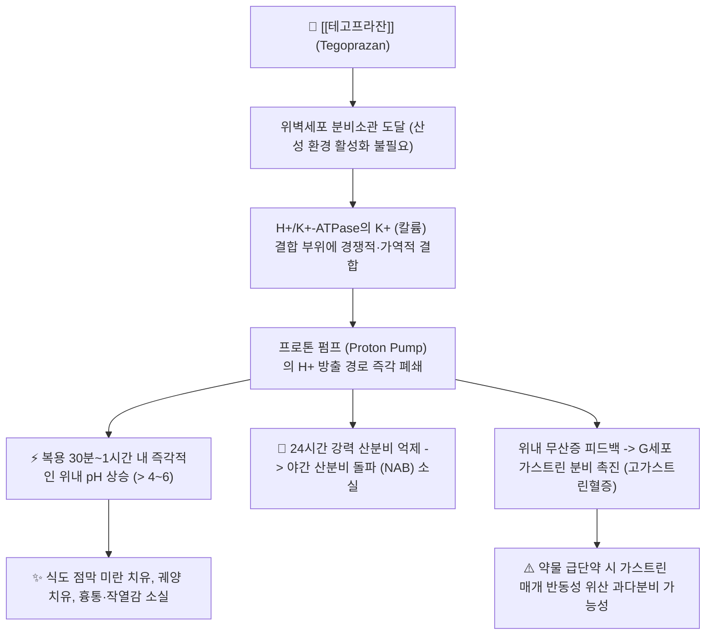
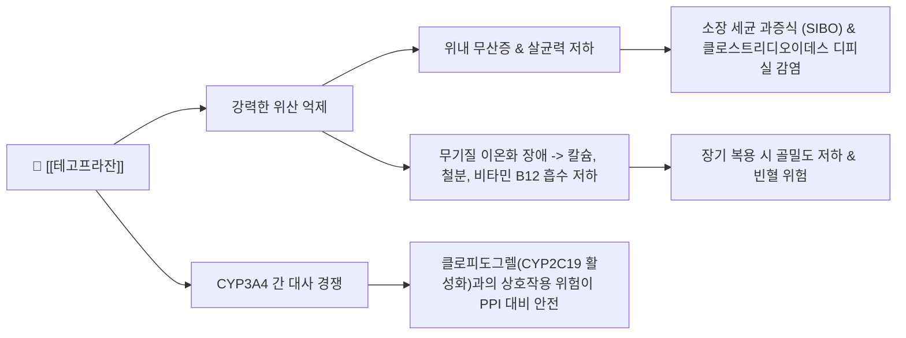

---
aliases:
  - K-CAB
  - 케이캡
  - 케이캡정
  - 테고프라잔
  - Tegoprazan
  - A02BC08
tags:
  - 약리/양방약
  - 소화기계
  - 소화성궤양용제
  - PCAB
  - 위산분비억제제
  - 위식도역류질환
---

# 💊 [[테고프라잔]] (Tegoprazan, K-CAB, A02BC08)

> **핵심 3줄 요약 (Key Summary)**:
> 🧪 주성분·제형: [[테고프라잔]] (Tegoprazan) 단일 성분, 대한민국 제30호 국산 신약이자 칼륨 경쟁적 위산분비차단제(P-CAB), 연한 주황색 삼각기둥형 필름코팅정(50mg), 연한 분홍색 타원형정(25mg) 및 구강붕해정.
> 📍 작용 기전: 위벽세포 H+/K+-ATPase의 칼륨(K+) 결합 부위에 경쟁적이고 가역적으로 결합하여 프로톤 펌프를 직접 차단, 전구약물 활성화 과정 없이 복용 30분~1시간 내 즉각적인 위산 억제 및 야간 산분비 돌파(NAB) 억제.
> 🎯 임상 적응증: 미란성 위식도역류질환(ERD), 비미란성 위식도역류질환(NERD), 위궤양(GU), 미란성 역류질환 치료 후 유지요법(25mg), 헬리코박터 파일로리 제균 항생제 병용요법.
> ⚠️ 주의사항: 식사 시간과 무관하게 복용 가능, 구세대 PPI 대비 CYP2C19 유전적 다형성 영향 극히 적음, 산분비 억제에 따른 혈청 가스트린 상승 및 장기 투여 시 저산증/장내 세균 과증식 주의.

---

## 📌 목차
1. [약물 기본 정보 및 시판 제품 (Brand Identification)](#1-약물-기본-정보-및-시판-제품-brand-identification)
2. [분자 약리 기전 및 작용 경로 (Mechanism of Action)](#2-분자-약리-기전-및-작용-경로-mechanism-of-action)
3. [약동학적 특성 (Pharmacokinetics: ADME)](#3-약동학적-특성-pharmacokinetics-adme)
4. [임상 용법·용량 및 처방 가이드 (Dosage & Administration)](#4-임상-용법용량-및-처방-가이드-dosage--administration)
5. [부작용, 경고 및 약물 상호작용 (Adverse Effects & Interactions)](#5-부작용-경고-및-약물-상호작용-adverse-effects--interactions)
6. [한의 치료 연계 및 병용/테이퍼링 프로토콜 (Integrative Medicine)](#6-한의-치료-연계-및-병용테이퍼링-프로토콜-integrative-medicine)
7. [💡 사용자 진료실 핵심 필기 & 실전 임상 체크리스트](#7--사용자-진료실-핵심-필기--실전-임상-체크리스트)
8. [출처 및 학술 참고 문헌 (References)](#8-출처-및-학술-참고-문헌-references)

---

## 1. 약물 기본 정보 및 시판 제품 (Brand Identification)

> [!abstract]+ 🧪 3D 약리 분자 구조 (Interactive 3D Viewer)
> <iframe src="https://molecule-viewer-rho.vercel.app/?cid=23582846" width="100%" height="450px" frameborder="0" allow="webgl" style="border-radius: 8px;"></iframe>

![[케이캡_패키지.jpg|350]]
> [그림 1] [[테고프라잔]]의 대표적인 시판 완제의약품 패키지 외형 (HK이노엔 오리지널 케이캡정 50mg)

![[케이캡_알약성상.jpg|350]]
> [그림 2] 케이캡정(K-CAB) 50mg 연주황색 삼각기둥형 알약 성상 및 PTP 블리스터 포장

![[테고프라잔_화학구조.png|300]]
> [그림 3] [[테고프라잔]]의 2D 평면 화학 분자 구조식 (PubChem CID 23582846)

| 항목 | 상세 정보 |
| :--- | :--- |
| **일반명 (Generic Name)** | [[테고프라잔]] / Tegoprazan |
| **대표 상품명 (Brand Names)** | **케이캡정 (K-CAB, HK이노엔 오리지널), 케이캡구강붕해정** |
| **ATC 코드 / 분류** | A02BC08 (Potassium-competitive acid blockers) / 식약처 분류 232 (소화성궤양용제) |
| **PubChem CID** | [23582846](https://pubchem.ncbi.nlm.nih.gov/compound/23582846) |
| **화학식 / 분자량** | C20H19F2N3O3 / 387.4 g/mol |
| **주요 제형 및 성상** | 50mg: 연한 주황색의 삼각기둥 모양 필름코팅정 (앞면 'K-CAB', 뒷면 '50') 25mg: 연한 분홍색의 타원형 필름코팅정 (앞면 'K-CAB', 뒷면 '25') 구강붕해정 (50mg): 물 없이 혀 위에 놓고 침으로 녹여 삼키는 제형 |
| **식약처 허가 적응증** | 1. 미란성 위식도역류질환의 치료 (50mg) 2. 비미란성 위식도역류질환의 치료 (50mg) 3. 위궤양의 치료 (50mg) 4. 미란성 위식도역류질환 치료 후 유지요법 (25mg) 5. 헬리코박터 파일로리 제균을 위한 항생제 병용요법 (50mg) |

### 1.1 소화성궤양 및 역류질환 치료제 계열 비교 매핑

| 약물 계열 | 대표 약물 | 작용 기전 및 분자 표적 | 최대 효과 도달 시간 | 식사 관계 | 주요 한계점 및 특징 |
| :--- | :--- | :--- | :--- | :--- | :--- |
| **P-CAB (3세대 신약)** | [[테고프라잔]] (케이캡), 보노프라잔 (보퀘즈나) | H+/K+-ATPase K+ 결합부위 경쟁적·가역적 직접 차단 | **30분~1시간 (첫날 즉각 발현)** | **식사 무관 (식전/식후 무관)** | 야간 산분비 돌파(NAB) 억제, CYP2C19 다형성 미의존 |
| **PPI (2세대 표준)** | [[에스오메프라졸]] (넥시움), 판토프라졸, 란소프라졸 | 전구약물 산 활성화 후 시스테인 잔기 공유결합(비가역) | 3~5일 지속 복용 필요 | **식전 30분 필수 복용** | 야간 산분비 돌파 빈발, CYP2C19 유전형에 따른 약효 편차 |
| **H2RA (1세대)** | 파모티딘, 라니티딘(퇴출) | 위벽세포 H2 히스타민 수용체 경쟁적 차단 | 1~2시간 | 식사 무관 | 내성(Tachyphylaxis) 발생으로 2주 이상 지속 투여 시 약효 급감 |

---

## 2. 분자 약리 기전 및 작용 경로 (Mechanism of Action)

* **칼륨 경쟁적 가역적 프로톤 펌프 차단 (Potassium-Competitive Acid Blocker)**:
  * 위벽세포의 H+/K+-ATPase(프로톤 펌프)는 세포 내의 H+를 위강 내로 뿜어내고 K+를 세포 내로 들여보내는 최종 위산 분비 관문입니다.
  * 기존 PPI는 산성 분비소관에서 활성형 설펜아마이드(Sulfenamide)로 변환된 후 펌프의 시스테인(Cysteine) 잔기와 비가역적 공유결합을 형성해야 하므로, 산성 환경이 형성되는 식전에 복용해야 하고 새롭게 합성되는 펌프를 차단하지 못해 첫날 약효 발현이 느렸습니다.
  * 반면 [[테고프라잔]]은 친유성 약염기(pKa ~5.1)로서 산 활성화 과정 없이 위벽세포의 산성 분비소관에 고농도로 축적되어, K+ 이온이 결합하는 부위에 경쟁적으로 결합(Ki ~10 nM)하여 펌프의 이온 교환을 가역적으로 차단합니다.
  * 따라서 **활성화된 펌프뿐 아니라 휴지기(Resting) 펌프까지 즉각적으로 차단**할 수 있어, 첫 복용 후 30분~1시간 내에 위내 산도를 pH 4 이상으로 신속히 상승시킵니다.

* **야간 산분비 돌파(NAB: Night-Time Acid Breakthrough) 극복**:
  * PPI는 체내 소실 반감기가 1~2시간으로 짧아 밤사이 새로 합성되는 프로톤 펌프를 억제하지 못해 취침 중 위내 pH가 4 이하로 1시간 이상 떨어지는 야간 산분비 돌파(NAB)가 환자의 70% 이상에서 발생합니다.
  * [[테고프라잔]]은 해리 속도가 적절히 조절된 긴 체류 시간과 약 4~6시간의 반감기로 24시간 동안 안정적인 산 억제를 유지하여 **취침 중 속쓰림, 가슴 작열감 및 역류로 인한 수면 장애를 획기적으로 개선**합니다.

* **CYP2C19 유전적 다형성 극복 (Homogeneous Efficacy)**:
  * 오메프라졸 등은 간의 CYP2C19 효소로 대사되므로, 한국인의 약 60~70%에 달하는 빠른 대사자(EM)에서는 혈중 농도가 급격히 떨어져 약효가 불충분했습니다.
  * [[테고프라잔]]은 주로 CYP3A4에 의해 대사되고 CYP2C19 기여도가 낮아, **환자의 유전형에 따른 혈중 농도 편차가 거의 없이 균일한 임상 효과**를 나타냅니다.

---

## 3. 약동학적 특성 (Pharmacokinetics: ADME)

| 약동학 파라미터 | 수치 및 임상적 의미 |
| :--- | :--- |
| **생체이용률 (Bioavailability, F)** | 높음 (경구 투여 시 소화관에서 신속하고 광범위하게 흡수) |
| **최고혈중농도 도달시간 (Tmax)** | **0.5~1.5 시간** (복용 직후 신속하게 혈중 최고 농도에 도달하여 빠른 증상 완화 제공) |
| **식사 영향 (Food Effect)** | 식후 투여 시 Tmax가 다소 지연되나 **총 흡수량(AUC) 및 위산 억제 효능에는 유의한 차이가 없어 식사 시간과 무관하게 복용 가능** |
| **간 대사 효소 (Metabolism)** | 주로 간의 **CYP3A4**에 의해 주요 대사산물인 M1(탈메틸체)으로 대사됨. CYP2C19의 기여도는 미미함 |
| **배설 반감기 (Elimination t1/2)** | **약 3.7~5.4 시간** (PPI의 1~2시간 대비 길어 야간까지 산 억제 지속) |
| **주요 배설 경로 (Excretion)** | 신장 소변 배설 약 20~30%, 담즙 및 분변 배설 약 60~70% |
| **혈장 단백결합률 (Protein Binding)** | 약 85~90% |

---

## 4. 임상 용법·용량 및 처방 가이드 (Dosage & Administration)

| 임상 적응증 | 성인 표준 용법·용량 | 권장 투여 기간 및 주의점 |
| :--- | :--- | :--- |
| **미란성 위식도역류질환 (ERD)** | 1일 1회 50mg 경구 투여 (식전/식후 무관) | 4주 투여. 치유되지 않은 경우 추가 4주 투여 (총 8주) |
| **비미란성 위식도역류질환 (NERD)** | 1일 1회 50mg 경구 투여 (식전/식후 무관) | 4주 투여 |
| **위궤양 (GU)** | 1일 1회 50mg 경구 투여 (식전/식후 무관) | 8주 투여 |
| **미란성 역류질환 치료 후 유지요법** | 1일 1회 25mg 경구 투여 | 최대 6개월간 안전성 및 유효성 확인 |
| **헬리코박터 파일로리 제균 요법** | 1회 50mg, 1일 2회 (아침, 저녁) 항생제 병용 | 아목시실린 1,000mg + 클래리스로마이신 500mg과 함께 1일 2회, 7~14일간 복용 |

### 4.1 제형별 복용 특이점
* **케이캡정 (50mg, 25mg)**: 물과 함께 삼켜서 복용합니다.
* **케이캡 구강붕해정 (50mg)**: 혀 위에 올려놓고 침으로 녹여 삼킬 수 있으므로, 연하장애(삼킴 곤란)가 있는 뇌졸중 환자, 고령자, 물을 마시기 힘든 야간 취침 직전 환자에게 최적의 복용 편의성을 제공합니다.

---

## 5. 부작용, 경고 및 약물 상호작용 (Adverse Effects & Interactions)

### 5.1 주요 부작용 및 이상반응
* **위장관계 증상 (가장 흔함, 1~3%)**: 오심, 설사, 소화불량, 복부 팽만감, 복통, 변비.
* **신경계 및 전신 증상**: 두통, 어지러움, 피로감.
* **혈청 가스트린 상승 (Hypergastrinemia)**:
  * 위산 분비가 강력하게 차단되면 음성 피드백에 의해 혈중 가스트린 농도가 기저치 대비 2~3배 상승합니다.
  * 약물 중단 시 가스트린은 정상으로 회복되나, 수개월 이상 장기 복용 후 급격히 중단하면 반동성 위산 과다분비(Acid rebound)로 인해 증상이 일시적으로 악화될 수 있습니다.
* **장기 복용 시 미네랄/영양 흡수 결핍**:
  * 위산은 불용성 미네랄의 이온화와 비타민 B12의 내인자 결합에 필수적입니다. 수년 이상 장기 복용 시 칼슘 흡수 저하로 인한 골다공증성 골절, 철분 흡수 저하로 인한 빈혈, 비타민 B12 결핍성 신경병증의 모니터링이 필요합니다.

### 5.2 약물 상호작용
* **위내 pH 의존적 약물**:
  * 아졸계 항진균제(케토코나졸, 이트라코나졸), 세파계 항생제(세프포독심), 일부 항암제(게피티닙, 엘로티닙) 등 위산이 있어야 흡수되는 약물은 생체이용률이 급격히 저하되므로 병용을 피합니다.
* **항혈소판제 [[클로피도그렐]]과의 안전성 우위**:
  * 구세대 PPI(오메프라졸)는 CYP2C19을 억제하여 클로피도그렐의 활성 대사체 전환을 방해하고 심혈관 사건 위험을 높이는 치명적 상호작용이 있었습니다.
  * [[테고프라잔]]은 CYP2C19 억제 작용이 없어 **클로피도그렐을 복용 중인 심혈관 스텐트 삽입 환자에서도 비교적 안전하게 병용**할 수 있습니다.

---

## 6. 한의 치료 연계 및 병용/테이퍼링 프로토콜 (Integrative Medicine)

### 6.1 한약·양약 병용 투여 안전성 및 시너지 배오

* **위장관 운동성 개선 및 담음(痰飮) 제거: [[반하사심탕]], [[평위산]], [[생강사심탕]]**:
  * P-CAB은 위산 분비를 강력히 억제하지만, 하부식도괄약근(LES)의 이완이나 위장관 운동 저하(위 배출 지연) 자체를 물리적으로 교정하지는 못합니다.
  * 식후 더부룩함, 헛구역질, 명치 비만(心下痞滿), 트림을 동반하는 위식도역류 질환 환자에게 **[[반하사심탕]]** 또는 **[[생강사심탕]]**을 병용하면 위장 평활근 연동 운동을 촉진하고 식도 점막의 항염증 세포 보호 효과를 극대화합니다.
  * 습담(濕痰) 정체로 복부 팽만과 소화불량이 심한 경우 **[[평위산]]** 배오가 효과적입니다.

* **소화력 보전 및 장내 세균총 환경 보호: [[육군자탕]], [[보중익기탕]]**:
  * P-CAB의 강력한 산 억제로 인해 만성적인 소화불량, 식욕 부진, 연변(묽은 변), 장내 세균 과증식(SIBO)을 호소하는 비위허약(脾胃虛弱) 환자에게 **[[육군자탕]]** 또는 **[[향사육군자탕]]**을 배오하면 소화 효소 분비를 촉진하고 기력을 보강하여 약물 복용 순응도를 극대화합니다.

* **점막 치유 촉진 침구 치료**:
  * 중완(CV12), 족삼리(ST36), 내관(PC6), 공손(SP4), 상완(CV13) 전침 치료는 미주신경(Vagus nerve)을 흥분시켜 위 운동성을 정상화하고 하부식도괄약근 압력을 높여 산 역류 횟수를 줄여줍니다.

### 6.2 양약 감량 및 한의 전환(테이퍼링) 가이드
* **급성 미란 치유 후 3단계 감량 프로토콜**:
  * **1단계 (급성기 완치, 4~8주)**: 내시경적 미란 치유 및 심한 흉통 소실을 확인. 케이캡 50mg 유지 + 한약([[반하사심탕]] 또는 [[육군자탕]]) 병용 시작.
  * **2단계 (유지 용량 감량, 2~4주)**: 케이캡을 25mg으로 감량하거나, 50mg을 2일에 1회(격일) 투여로 전환하면서 한약으로 위장 기능을 지지.
  * **3단계 (PRN 전환 및 완전 단약)**: 매일 복용을 중단하고 과식이나 스트레스 시에만 복용하는 요구 시 투여(On-demand / PRN)로 전환하며, 한약 과립제 또는 침 치료로 최종 관리.

---

## 7. 💡 사용자 진료실 핵심 필기 & 실전 임상 체크리스트

### 7.1 진료실 3대 핵심 문진 체크리스트
1. **야간 증상 여부 확인**: "밤에 자다가 가슴이 타는 듯해서 깨거나 기침을 하지 않으십니까?" (야간 산분비 돌파 여부 확인, 케이캡 복용 후 소실 여부 평가).
2. **복용 타이밍 및 식사 관계 확인**: "약 드실 때 식사 전에 챙겨 먹기 힘드셨나요?" (케이캡은 식사 전후 아무 때나 복용 가능함을 안내하여 환자 만족도 극대화).
3. **만성 소화불량 및 대변 상태 확인**: "위산약을 오래 드시면서 오히려 소화가 덜 되거나 속이 더부룩하고 설사가 잦아지지 않았습니까?" (장기 저산증 및 SIBO 발생 평가).

### 7.2 실전 복약 지도 스크립트
> "원장님, 케이캡은 기존에 드시던 위장약(PPI)과 달리 식사를 하셨든 안 하셨든 상관없이 하루 중 편하신 시간에 드셔도 30분 만에 약효가 나타나는 아주 편리하고 뛰어난 최신 위산 억제제입니다. 특히 밤에 자다가 가슴이 쓰려서 깨는 증상을 아주 잘 잡아줍니다. 다만 위산은 음식물을 살균하고 소화시키는 데 꼭 필요한 성분이므로, 급한 염증과 식도 궤양이 아물고 나면 한약 치료와 침 치료를 병행하면서 케이캡 용량을 점차 줄여나가야 위장의 본래 소화력이 약해지지 않습니다."

---

## 8. 출처 및 학술 참고 문헌 (References)

* Cho YK, Kim JH, Kim HS, Kim TO, Oh JH, Choi SC, Moon JS, Lee SK, Jung SW, Kim SS, Jung HK, Lee SP, Cheon GJ, Park MI, Jung HY, Ko KH, Sung IK, Lee SH, Lee JY, Lee ST, Rhee PL, Kim N, Hong SJ, Kim HJ, Kim GH, Lee KJ, Kim SK, Shin WG, Lee OY. Randomised clinical trial: comparison of tegoprazan and lansoprazole as maintenance therapy for healed mild erosive oesophagitis. *Aliment Pharmacol Ther*. 2023 Jan;57(1):123-131. [PMID: 36314172](https://pubmed.ncbi.nlm.nih.gov/36314172/) | [DOI: 10.1111/apt.17255](https://doi.org/10.1111/apt.17255)
  * `[연구 요약]` 치유된 경증 미란성 식도염 환자 351명을 대상으로 24주간 테고프라잔 25mg 유지요법을 란소프라졸 15mg과 비교한 다기관 무작위 3상 임상시험으로, 테고프라잔이 90% 이상의 높은 치유 유지율과 우수한 내약성을 입증함.

* Choi YJ, Lee YC, Kim JM, Kim BW, Kim TO, Lee ST, Lee SW, Kim GH, Sung IK, Kim JH, Kim N, Park KS, Lee OY, Kim JI, Lee J, Kim SG. Triple Therapy-Based on Tegoprazan, a New Potassium-Competitive Acid Blocker, for First-Line Treatment of Helicobacter pylori Infection: A Randomized, Double-Blind, Phase III, Clinical Trial. *Gut Liver*. 2022 Jul 15;16(4):535-546. [PMID: 35791797](https://pubmed.ncbi.nlm.nih.gov/35791797/) | [DOI: 10.5009/gnl220055](https://doi.org/10.5009/gnl220055)
  * `[연구 요약]` 헬리코박터 파일로리 감염 환자 350명을 대상으로 테고프라잔 기반 삼제요법(테고프라잔 50mg + 아목시실린 + 클래리스로마이신)이 란소프라졸 기반 표준 요법 대비 비열등한 제균율과 동등한 안전성을 입증한 3상 이중맹검 RCT.

* Efficacy and Tolerability of Tegoprazan Compared to Proton Pump Inhibitors in the Treatment of Erosive Esophagitis: A Systematic Review and Meta-Analysis of Randomized Controlled Trials. *JGH Open*. 2026 Aug;10(8):e70450. [PMID: 42523882](https://pubmed.ncbi.nlm.nih.gov/42523882/) | [DOI: 10.1002/jgh3.70450](https://doi.org/10.1002/jgh3.70450)
  * `[연구 요약]` 미란성 식도염 환자를 대상으로 테고프라잔과 기존 PPI의 치료 효과 및 안전성을 체계적으로 비교한 최신 메타분석으로, 테고프라잔이 투여 2주 및 4주차의 빠른 점막 치유율과 초기 흉통 개선에서 통계적으로 유의한 우위를 보임을 입증.

* Potassium-competitive Acid Blockers in Gastroesophageal Reflux Disease and Functional Dyspepsia: A Korean Expert Review With Original Meta-analyses. *J Neurogastroenterol Motil*. 2026 Jul 30;32(3):e26007. [PMID: 42504651](https://pubmed.ncbi.nlm.nih.gov/42504651/) | [DOI: 10.5056/jnm26007](https://doi.org/10.5056/jnm26007)
  * `[연구 요약]` 위식도역류질환 및 기능성 소화불량증에서 P-CAB의 임상적 역할에 대한 국내 다학제 전문가 합의 및 메타분석으로, 신속한 작용 발현과 야간 산분비 조절의 임상적 가치를 정립.

* Tegoprazan in Gastroesophageal Reflux Disease and Related Acid-Mediated Conditions: A Systematic Review and Meta-Analysis. *JGH Open*. 2026 Apr;10(4):e70406. [PMID: 42006860](https://pubmed.ncbi.nlm.nih.gov/42006860/) | [DOI: 10.1002/jgh3.70406](https://doi.org/10.1002/jgh3.70406)
  * `[연구 요약]` 위식도역류질환, 비미란성 역류질환 및 위궤양을 포함한 산 관련 질환 전반에서 테고프라잔의 광범위한 유효성과 낮은 이상반응 발생률을 종합 검증한 메타분석.
