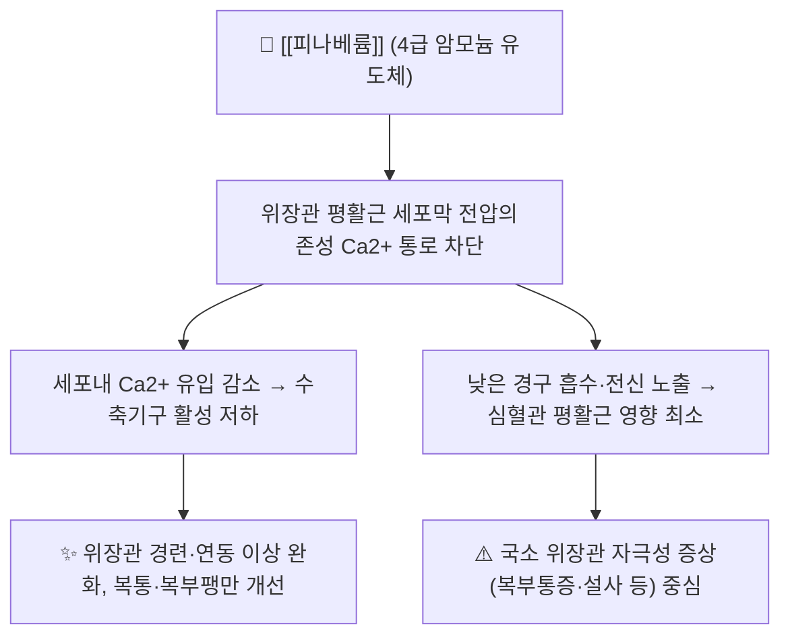

# 💊 [[피나베륨]] (Pinaverium Bromide, Dicetel, A03AX04)

> **핵심 3줄 요약 (Key Summary)**:
> 🧪 **주성분·제형**: [[피나베륨브롬화물]](Pinaverium bromide, C26H41Br2NO4)은 4급 암모늄 양이온(모폴리늄 구조)과 브롬화물 음이온으로 이루어진 염 형태의 합성 진경제로, 주로 경구용 정제(50 mg 중심)로 시판된다. 결정 구조가 2024년 결정학 논문에서 보고되었다(Rousselin & Clavel, 2024).
> 📍 **작용 기전**: 위장관 평활근 세포막의 전압의존성 칼슘 통로를 차단하여 세포내 Ca²⁺ 유입을 억제함으로써 평활근 수축과 경련을 완화하는 칼슘 길항제(calcium-antagonist)이며, 전신 흡수가 낮아 작용이 위장관에 국소적으로 편중되고 심혈관계 영향이 적은 것이 특징이다(Christen, 1990).
> 🎯 **임상 적응증**: [[과민성장증후군]](IBS), 담도 운동이상, 기능성 소화기 질환에 동반된 복통·경련·복부팽만의 증상 완화. 위약 대비 유효성이 메타분석에서 평가되었고(Bor & Lehert, 2021), 설사형 IBS에서는 [[플루펜티솔]]·[[멜리트라센]] 병용 요법이 단독 요법보다 우수하다는 근거가 제시되었다(Qin & Qin, 2019).
> ⚠️ **주의사항**: 이상반응은 대체로 경미(복부통증, 설사 또는 변비, 오심, 구갈, 두통, 어지럼, 발진 등)하게 보고된다. 성분 과민증이 금기이며, 씹지 말고 통째로 삼켜야 한다. 절대 생체이용률·반감기 등 정량적 약동학 수치는 본 노트 인용 문헌에서 확인되지 않아 '근거 미확인'으로 표기하였다.

---

## 1. 약물 기본 정보 및 시판 제품 (Brand Identification)
> [!abstract]+ 🧪 3D 약리 분자 구조 (Interactive 3D Viewer)
> <iframe src="https://molecule-viewer-rho.vercel.app/?cid=5311462" width="100%" height="450px" frameborder="0" allow="webgl" style="border-radius: 8px;"></iframe>

| 항목 | 상세 정보 |
| :--- | :--- |
| **일반명 (Generic Name)** | 피나베륨브롬화물(피나베륨) / Pinaverium Bromide |
| **대표 상품명 (Brand Names)** | **디세텔(Dicetel)** 계열 정제 (※ YAML `aliases:`에 등록하여 위키링크 통합) |
| **ATC 코드 / 분류** | A03AX04 (기능성 장질환 치료제 – 기타) / 국내 허가 분류는 '기타의 소화기관용약' 계열 (※ 제품 허가사항 및 WHO ATC 인덱스로 재확인 권장) |
| **PubChem CID** | [5311462](https://pubchem.ncbi.nlm.nih.gov/compound/5311462) (※ 본 노트에서 인용한 논문에는 CID가 기재되어 있지 않으며, 분자 구조 식별자에 대한 화학 DB 값으로 검증 필요) |
| **화학식 / 분자량** | C₂₆H₄₁Br₂NO₄ / 약 591.4 g/mol (4급 모폴리늄 양이온 + 브롬화물 음이온; Rousselin & Clavel, 2024의 결정학적 보고 및 표준 화학 데이터 기준) |
| **주요 제형 및 함량** | 경구용 정제(필름코팅정) 50 mg 중심. 일부 국가에서 100 mg 정제 및 50 mg/5 mL 현탁액 등이 유통 (국내 유통 제형·함량은 허가사항 재확인 필요) |
| **식약처 허가 적응증** | [[과민성장증후군]] 및 담도 운동이상·기능성 소화기 질환에 수반되는 위장관 경련·복통·연동 이상의 증상 완화 (구체적 문구는 품목 허가사항 확인 필요) |

### 1.1 대표 시판 제품 및 함유 복합제 매핑 (Brand Identification & Combinations)

> [!note] 피나베륨은 국내외에서 **단일 성분 제품**이 주류이며, 타 약물과의 **고정배합복합제(FDC)** 형태보다는 **개별 단일제의 병용 투여** 형태로 임상 연구가 이루어져 왔다.

| 구분 | 대표 제품명 / 브랜드 | 함유 성분 및 1회당 함량 | 제형 및 특징 | 주요 적응증 및 복약 지도 핵심 |
| :--- | :--- | :--- | :--- | :--- |
| **단일제 (ETC)** | [[디세텔]], 피나베륨 정제류 | [[피나베륨브롬화물]] 50 mg 단일 성분 | 필름코팅정, 식사와 함께 복용 | IBS 및 기능성 장질환의 복통·경련 완화. **씹거나 녹이지 말고 물과 함께 통째로 삼킴** |
| **병용 요법 (고정배합 아님, 임상 연구 형태)** | 피나베륨 + [[플루펜티솔]]·[[멜리트라센]] | 각 단일제를 동시 투여 | 별도 제제의 병용 | **설사형 IBS(D-IBS)** 에서 병용군이 피나베륨 단독군보다 유효(Qin & Qin, 2019). 항정신성 성분에 의한 졸림·추체외로 증상 모니터링 |
| **비교 대상 한약 처방 (연구 맥락)** | [[통사요방]](痛泄要方/痛瀉要方) | [[백출]], [[백작약]], [[진피]], [[방풍]] 등 배합 | 탕전·과립 등 | 간울비허(肝鬱脾虛)형 IBS에서 피나베륨을 대조군으로 한 비교 메타분석이 보고됨(Mi & Huaien, 2026). 자세한 수치는 근거 미확인 |
| **감별 다빈도 일반 진경제** | [[트리메부틴]], [[오티로늄브로마이드]], [[메베베린]], [[알베린]] 등 | 각 성분 단일제 | 정제·캡슐 | 구갈·변비·요저류 등 **항무스카린성 부작용 프로파일** 차이를 감별. 피나베륨은 항콜린 작용이 두드러지지 않는 것으로 기술됨(Christen, 1990) |

---

## 2. 분자 약리 기전 및 작용 경로 (Mechanism of Action)

* **주요 작용 기전 (Primary MoA)**:
  * **칼슘 길항 작용**: 피나베륨은 위장관 평활근의 **전압의존성 칼슘 통로(voltage-dependent calcium channel)** 를 차단하여 세포외 Ca²⁺의 세포내 유입을 감소시키고, 그 결과 칼슘–칼모듈린 의존성 수축 기구의 활성화가 억제되어 평활근 이완과 진경(spasmolysis) 효과를 나타낸다(Christen, 1990).
  * **항콜린 작용과의 구별**: 전통적 진경제([[메베베린]], [[오티로늄브로마이드]] 등)가 무스카린 수용체 차단을 주 기전으로 하는 것과 달리, 피나베륨의 진경 효과는 칼슘 통로 차단에 기인하는 것으로 기술된다(Christen, 1990).
  * **4급 암모늄 구조의 약리학적 함의**: 분자가 4급 암모늄 양이온이어서 지질막 투과성 및 혈뇌장벽 통과가 제한적이고, 경구 투여 후 전신 흡수가 낮아 **작용 부위가 위장관(및 담도) 국소에 편중**된다. 이는 심혈관 평활근에 대한 영향이 상대적으로 적은 이유로 제시된다(Christen, 1990).
* **하류 신호전달 및 생화학적 반응**:
  * 세포내 유리 Ca²⁺ 농도 저하 → 미오신 경쇄 인산화 억제 → 평활근 긴장도 및 수축 진폭 감소.
  * 위장관 연동 운동의 과활동성(경련성 수축) 억제 및 내강 확장 자극에 대한 과민 반응 완화 → IBS 환자의 복통·복부팽만 완화로 이어짐(Bor & Lehert, 2021).
  * 자율신경–장신경계(enteric nervous system) 수준의 추가 작용 여부 및 특정 이온 통로 하위형(T/L-type 등) 선택성은 본 노트가 인용한 문헌 범위에서 명확히 확인되지 않음 → **근거 미확인**.

---

## 3. 약동학적 특성 (Pharmacokinetics: ADME)

> [!warning] 본 노트에서 인용한 문헌(Christen, 1990; Rousselin & Clavel, 2024; Bor & Lehert, 2021; Qin & Qin, 2019; Mi & Huaien, 2026)은 **정량적 약동학 파라미터를 직접 제시하지 않는다.** 아래 표는 정성적으로 확인 가능한 서술만 기술하고, 수치는 '근거 미확인'으로 명시한다.

| 약동학 파라미터 | 수치 및 임상적 의미 |
| :--- | :--- |
| **생체이용률 (Bioavailability, F)** | **낮음(정성적)** — 경구 흡수가 저조하고 전신 노출이 적어 작용이 위장관 국소에 편중된다고 기술됨(Christen, 1990). 절대 생체이용률 수치(%)는 **근거 미확인** |
| **최고혈중농도 도달시간 (Tmax)** | **근거 미확인** (인용 문헌에 Tmax·Cmax 수치 없음) |
| **혈장 단백결합률 (Protein Binding)** | **근거 미확인** (알부민 결합 여부 및 결합률 미확인) |
| **간 대사 효소 (Metabolism)** | 초회통과(first-pass) 효과를 포함한 간 대사가 주요 소실 경로로 추정되나, 관여 **CYP 동원효소 및 대사산물 정보는 근거 미확인** |
| **배설 반감기 (Elimination t1/2)** | **근거 미확인** |
| **주요 배설 경로 (Excretion)** | 전신 흡수가 낮은 4급 암모늄 화합물로서 미흡수 분획이 대변으로 배설되는 것으로 일반적으로 기술되나, 담즙/소변 배설 비율 등 **정량적 배설 데이터는 근거 미확인** |

---

## 의학/04_임상 용법·용량 및 처방 가이드 (Dosage & Administration)

| 임상 적응증 | 성인 표준 용법·용량 | 1일 최대 한도 용량 |
| :--- | :--- | :--- |
| **과민성장증후군 (IBS)** | 1회 50 mg, 1일 3회, **식사와 함께** 물과 함께 통째로 삼킴 | 허가사항상 상한 용량은 **근거 미확인** (품목 허가사항 확인 필요) |
| **담도 운동이상·기능성 소화기 질환 (경련·복통)** | 1회 50 mg, 1일 3회 (IBS와 동일 용법이 일반적으로 적용) | 상동 |
| **증상 지속 시 증량** | 일부 해외 허가사항에서 1회 100 mg까지 증량 가능성이 언급되나, 본 노트 인용 문헌에서는 확인되지 않음 → **근거 미확인** | **근거 미확인** |

> [!tip] 복약 지도 핵심
> * 정제는 **씹거나 빨지 말고** 물과 함께 통째로 삼키게 한다(경구 자극 및 국소 작용 특성과 관련된 일반적 지도 사항).
> * **식사와 함께** 복용하도록 지도한다.
> * 임상 연구에서의 치료 기간은 연구별로 상이하며, 증상 반응에 따라 재평가한다(Bor & Lehert, 2021; Qin & Qin, 2019).

---

## 5. 부작용, 경고 및 약물 상호작용 (Adverse Effects & Interactions)

### 5.1 주요 부작용 및 독성 경고 (Black Box Warnings)
* **위장관계**: 복부통증, 설사 또는 변비, 오심, 구역, 구갈 등이 보고된다. 전신 흡수가 낮음에도 불구하고 국소 작용 약물이므로 위장관 증상이 상대적으로 흔한 편으로 기술된다.
* **신경계**: 두통, 어지럼 등이 보고된다. 4급 암모늄 화합물로 혈뇌장벽 통과가 제한적이므로 중추신경계 억제는 두드러지지 않는 것으로 기술된다.
* **알레르기 및 과민반응**: 발진, 소양감 등 피부 반응이 보고되며, 중증 과민반응(아나필락시스, [[스티븐스-존슨 증후군]]) 발생률은 **근거 미확인** (드물다고 기술됨).
* **심혈관계**: 다른 칼슘 길항제 계열 약물에서 관찰되는 부종·저혈압·서맥 등은 피나베륨에서 상대적으로 두드러지지 않는다고 기술되나, 정량적 발생률은 **근거 미확인**(Christen, 1990).
* **안전성 메타분석 결과**: Bor & Lehert(2021)의 체계적 문헌고찰 및 메타분석은 유효성과 함께 안전성 자료를 평가하였으며, 세부 이상반응 발생률 및 중대한 안전성 신호 유무의 구체적 수치는 본 노트에서 **근거 미확인**으로 표기한다.
* **블랙박스 경고**: 본 노트가 인용한 문헌 범위에서는 피나베륨에 대한 블랙박스 경고가 확인되지 않았다.

### 5.2 주요 병용 금기 및 상호작용
* **성분 과민증**: 피나베륨 또는 제형 부형제에 대한 과민증이 금기이다.
* **중추작용 약물과의 병용**: 설사형 IBS에서 [[플루펜티솔]]·[[멜리트라센]]과의 병용이 연구되었으며(Qin & Qin, 2019), 이 경우 항정신성 성분에 기인한 졸림, 추체외로 증상, 항콜린성 증상 등에 대한 관찰이 필요하다. 단, 피나베륨 자체의 상호작용 위험도는 **근거 미확인**.
* **전신 흡수 기반 상호작용**: 경구 흡수가 낮고 전신 노출이 적어 CYP 매개 대사성 상호작용의 임상적 중요성은 크지 않을 것으로 추정되나, 이를 직접 검증한 문헌은 본 노트에서 **근거 미확인**.
* **임부·수유부·소아**: 임신 중 사용 등급 및 소아 용량은 **근거 미확인** (허가사항 확인 필요).
* **고령자**: 특별한 용량 조절 근거는 본 노트에서 **근거 미확인**.

---

## 6. 한의 치료 연계 및 병용/테이퍼링 프로토콜 (Integrative Medicine)

### 6.1 한약·양약 병용 투여 안전성 및 시너지 배오
* **간·신 대사 간섭 완충 처방**: 피나베륨은 전신 흡수가 낮아 간 대사 효소(CYP450) 경로를 통한 상호작용 위험이 상대적으로 낮다고 추정되나, **이를 직접 검증한 근거는 미확인**이다. 따라서 한약(탕전·과립)과 병용 시에도 **1~2시간 시간차 투여** 및 간기능·신기능 정기 확인이라는 일반 원칙을 준용한다.
* **상승 배오 (Synergy) — 간울비허형 IBS-D**:
  * [[통사요방]](痛泄要方)은 [[백출]]·[[백작약]]·[[진피]]·[[방풍]] 배합으로, **간울비허(肝鬱脾虛) 변증**의 설사형 과민성장증후군에서 피나베륨브롬화물을 대조군으로 한 체계적 문헌고찰 및 메타분석이 보고되었다(Mi & Huaien, 2026). 즉, 임상적으로 **피나베륨을 대체하거나 감량하면서 통사요방 계열 처방으로 전환**하는 전략의 근거 축이 마련되어 있다.
  * 다만 해당 메타분석의 구체적 효과크기·이질성·비뚤림 위험 평가 수치는 본 노트에서 **근거 미확인**이므로, 원문 확인 후 인용할 것을 권한다.
* **복부팽만·경련 위주 증상**: [[작약감초탕]] 계열(근 긴장 완화 목적) 및 [[향사육군자탕]] 등 비허(脾虛) 기반 처방과의 병용이 임상적으로 고려될 수 있으나, 피나베륨과의 직접 비교·병용 연구는 본 노트 인용 문헌에서 **근거 미확인**이다.

### 6.2 양약 감량 및 한의 전환(테이퍼링) 가이드
* **감량 프로토콜(제안)**: 피나베륨은 통상 1회 50 mg 1일 3회로 투여되므로, 침·약침·한약 치료 병행 후 증상이 안정되면
  1. **1일 3회 → 1일 2회** (2~4주간 증상 관찰)
  2. **1일 2회 → 1일 1회 또는 필요시 복용(PRN)**
  3. **완전 중단 후 한약 유지**
  의 단계적 감량을 고려할 수 있다. 다만 이는 **본 노트에서 인용한 문헌에 근거한 공식 프로토콜이 아니며, 임상적 제안 수준**임을 명시한다(근거 미확인).
* **모니터링 지표**: 복통 빈도·강도, 배변 횟수 및 Bristol 대변 척도, 복부팽만 VAS, 증상 재발 시점. 감량 중 악화 시 이전 단계로 회복(re-challenge) 후 재평가한다.

---

## 7. 💡 사용자 진료실 핵심 필기 & 실전 임상 체크리스트

### 7.1 진료실 3대 핵심 문진 체크리스트
1. **복용 기간 및 병용 약물 확인**: [[플루펜티솔]]·[[멜리트라센]] 등 항정신성 병용 여부(졸림·추체외로 증상), 다른 진경제([[트리메부틴]], [[메베베린]] 등) 및 [[프로바이오틱스]], [[로페라마이드]] 등 자가 복용 일반약 중복 여부를 반드시 청취한다.
2. **배변 양상 및 경고 증상(red flag) 배제**: 체중 감소, 혈변, 야간 설사, 발열, 50세 이상 신규 발병, 빈혈 등은 IBS로 단정하지 말고 기질적 질환 감별을 우선한다. 담도계 증상(우상복부 통증, 황달) 동반 여부도 확인한다.
3. **증상 호전도 및 부작용 모니터링**: 복부통증·팽만·배변 긴급감의 변화, 오심·구갈·설사·변비·두통·발진 등 약인성 증상 발생 여부를 확인한다.

### 7.2 환자 티칭 스크립트
> *"환자분, 지금 드시는 피나베륨(디세텔)은 장 평활근의 과도한 수축을 칼슘 통로 수준에서 눌러주어 복통과 경련, 복부 불편감을 줄여주는 약입니다. 정제는 씹지 마시고 식사와 함께 물로 통째로 삼켜 주세요. 전신으로 잘 흡수되지 않아 심장이나 혈압에 미치는 영향은 크지 않다고 보고되어 있지만, 복부 불편감·설사·어지럼 등이 나타나면 알려주시기 바랍니다. 저희 한의원에서는 변증에 따라 [[통사요방]] 계열 처방과 침·약침 치료를 병행하면서, 증상이 안정되면 복용 횟수를 3회에서 2회, 1회로 서서히 줄여나가는 방식으로 양약 의존을 낮춰가도록 돕겠습니다."*

---

## 8. 출처 및 학술 참고 문헌 (References)

### 8.1 본 노트에서 직접 인용한 문헌 (제공된 PubMed 데이터)
* **Rousselin Y, Clavel A (2024).** Pinaverium bromide. *IUCrdata.* **PMID: 39247074**
  * `[연구 요약]` 피나베륨브롬화물의 결정학적 구조를 보고한 문헌으로, 본 노트의 분자 구조·염 형태(4급 암모늄 양이온 + 브롬화물 음이온) 서술의 근거로 사용하였다.
* **Christen MO (1990).** Action of pinaverium bromide, a calcium-antagonist, on gastrointestinal motility disorders. *Gen Pharmacol.* **PMID: 2177709**
  * `[연구 요약]` 피나베륨의 칼슘 길항 기전, 위장관 평활근 선택성, 낮은 전신 노출 및 심혈관계 영향이 적다는 약리학적 특성을 정리한 기초 약리 문헌. 본 노트 2장·3장·5장의 정성적 서술 근거.
* **Qin L, Qin J (2019).** Efficacy and safety of pinaverium bromide combined with flupentixol-melitracen for diarrhea-type irritable bowel syndrome: A systematic review and meta-analysis. *Medicine (Baltimore).* **PMID: 30633208**
  * `[연구 요약]` 설사형 IBS에서 피나베륨 + [[플루펜티솔]]·[[멜리트라센]] 병용 요법의 유효성·안전성을 평가한 체계적 문헌고찰 및 메타분석. 본 노트 1.1항 및 6.1항 병용 요법 근거.
* **Bor S, Lehert P (2021).** Efficacy of pinaverium bromide in the treatment of irritable bowel syndrome: a systematic review and meta-analysis. *Ther Adv Gastroenterol.* **PMID: 34539813**
  * `[연구 요약]` 과민성장증후군에서 피나베륨의 유효성 및 안전성을 종합 평가한 메타분석. 본 노트 2장 임상효과 및 5.1항 안전성 서술의 근거(세부 효과크기 수치는 원문 확인 필요).
* **Mi Z, Huaien BU (2026).** Efficacy of Tongxie Yaofang compared with pinaverium bromide on irritable bowel syndrome with liver depression and spleen deficiency: a systematic review and Meta-analysis. *J Tradit Chin Med.* **PMID: 41736418**
  * `[연구 요약]` 간울비허형 IBS에서 [[통사요방]]과 피나베륨브롬화물을 비교한 체계적 문헌고찰 및 메타분석. 본 노트 6.1항 한·양방 연계 근거.
* **(2015). 서지 정보 미확인. PMID 미확인(존재하지 않는 번호 — 2026-09-24 감사)**
  * `[연구 요약]` 제공된 데이터에 저자·제목·저널명이 없어 **내용 인용 불가**. 본 노트에서는 해당 PMID를 서지 목록에만 기록하며, 원문 확인 후 추후 보완 대상으로 남긴다.

### 8.2 일반 참고 자료 (교과서·공공 데이터베이스)
* Brunton LL, Hilal-Dandan R, Knollmann BC, eds. *Goodman & Gilman's The Pharmacological Basis of Therapeutics*. 13th ed. McGraw-Hill; 2018.
  * `[연구 요약]` 약물의 분자 약리학, 약동학 및 임상 치료 지침 총람(본 노트에서는 배경 지식 수준으로만 참조).
* 식품의약품안전처 의약품안전나라 의약품통합정보시스템 (https://nedrug.mfds.go.kr)
  * `[연구 요약]` 국내 허가 의약품의 품목 기준코드, 허가사항, 용법용량 및 부작용 안전성 정보(제품별 정확한 허가 문구는 이 시스템에서 최종 확인할 것).

> [!danger] 본 노트의 근거 수준에 관한 고지
> 본 노트는 **위 8.1항의 문헌만을 학술적 근거로 인용**하였으며, 인용 문헌에서 직접 확인되지 않은 수치(생체이용률, Tmax, 단백결합률, 반감기, 대사효소, 배설 비율, 최대 용량 등)는 모두 **'근거 미확인'** 으로 명시하였다. 실제 처방·복약 지도 시에는 반드시 최신 품목 허가사항 및 원문을 확인하여야 한다.