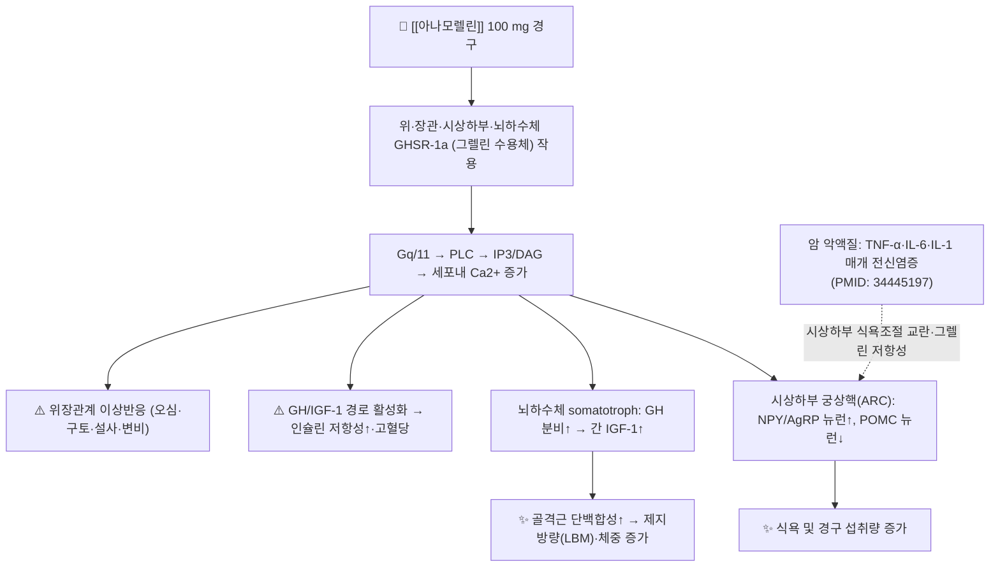

# 💊 [[아나모렐린]] (Anamorelin, Adlumiz, ATC 코드 미부여)

> **핵심 3줄 요약 (Key Summary)**:
> 🧪 주성분·제형: [[아나모렐린]]은 경구 활성의 합성 그렐린 유사체(ghrelin mimetic)로, 일본에서 **아들루미즈(Adlumiz) 정 50 mg**으로 시판되며 1일 1회 100 mg(50 mg 2정) 아침 식전 경구 투여한다. 개발코드는 ONO-7643이며 염산염(Anamorelin hydrochloride) 형태로 제제화된다.
> 📍 작용 기전: 위·뇌하수체·시상하부의 **그렐린 수용체(GHSR-1a, growth hormone secretagogue receptor type 1a)** 작용제로, Gq/11–PLC–IP₃/Ca²⁺ 경로를 활성화하여 (1) 시상하부 궁상핵(ARC)에서 NPY/AgRP 뉴런을 촉진하고 POMC 뉴런을 억제해 **식욕과 섭취량을 늘리며**, (2) 뇌하수체 somatotroph에서 GH 분비를 촉진하여 간 IGF-1을 상승시켜 **골격근 단백합성 및 제지방량(LBM) 증가**를 유도한다.
> 🎯 임상 적응증: 일본 허가 적응증은 **악성종양에 수반되는 악액질(cancer cachexia)** — 비소세포폐암·위암·대장암·췌장암이 대상이며, 12주 투여 시 제지방량(LBM) 및 체중 증가가 1차적으로 입증되었다. 다만 **악력·기능적 개선 및 전체생존기간(OS) 개선은 일관되게 입증되지 않았다**(ROMANA 1·2).
> ⚠️ 주의사항: 대표 이상반응은 **고혈당/당뇨병 악화, 오심·구토·설사·변비 등 위장관계 증상, 간기능 검사치 상승**이다. GH/IGF-1 상승에 따른 종양 성장 촉진 가능성은 이론적 우려로 제기되었으나 무작위 3상에서 생존 악화는 관찰되지 않았다. 한국·미국·EU에서는 허가되지 않았고 **일본에서만 승인(2021년)**된 상태로 보고된다.

---

## 1. 약물 기본 정보 및 시판 제품 (Brand Identification)

> [!abstract]+ 🧪 3D 약리 분자 구조 (Interactive 3D Viewer)
> 본 노트 작성 시점에 **검증된 PubChem CID를 확인하지 못하여 3D 뷰어를 임베드하지 않았다.** 아래 링크에서 CID를 직접 확인한 후 `?cid=` 값에 입력하여 사용한다.
> → [PubChem에서 Anamorelin 검색](https://pubchem.ncbi.nlm.nih.gov/#query=Anamorelin)
> ※ CID·분자량·화학식은 염기(base)와 염산염(salt) 형태에 따라 값이 달라지므로, 제품 허가사항의 염 형태 기준으로 기재해야 한다(아래 표 참조).

| 항목 | 상세 정보 |
| :--- | :--- |
| **일반명 (Generic Name)** | [[아나모렐린]](Anamorelin) / Anamorelin hydrochloride(염산염) |
| **대표 상품명 (Brand Names)** | **아들루미즈(Adlumiz)** 정 50 mg — 오노약품공업(Ono Pharmaceutical)·헬신(Helsinn) 공동 개발. ※ YAML `aliases:`에 등록하여 위키링크 통합 |
| **개발 코드** | ONO-7643 |
| **ATC 코드 / 분류** | 공식 ATC 코드 **근거 미확인**(문헌상 부여 확인 불가). 약효 분류상 항암보조제(식욕촉진·동화작용 계열)로 분류 |
| **PubChem CID** | **근거 미확인** (PubChem에서 'Anamorelin' 검색하여 직접 확인 필요) |
| **화학식 / 분자량** | 아나모렐린 염기(free base) C₃₁H₄₂N₄O₃ / 약 518.7 g/mol 수준으로 알려져 있으나, **본 노트가 인용한 문헌에서 직접 확인되지 않아 '근거 미확인'** 으로 표기한다(염산염 형태는 분자량이 더 큼) |
| **주요 제형 및 함량** | 경구 정제 50 mg (아들루미즈 정 50 mg). 주사제·서방정 등 타 제형은 문헌상 확인되지 않음 |
| **식약처 허가 적응증** | **국내(한국) 허가 없음** — 식품의약품안전처 품목 허가 이력 확인되지 않음. 일본 후생노동성 허가(2021년): 악성종양에 수반하는 악액질(비소세포폐암, 위암, 대장암, 췌장암) |

### 1.1 대표 시판 제품 및 함유 복합제 매핑 (Brand Identification & Combinations)

> ⚠️ 아나모렐린은 **단일성분 전문의약품(ETC)** 이며 복합제가 존재하지 않는다. 아래 표는 "실제 아나모렐린 제품"과 "임상에서 악액질·식욕부진 치료로 오인·병용될 수 있는 감별 약물"을 함께 정리한 것이다. 국내 진료실에서는 아나모렐린 자체를 처방할 수 없으므로, **환자가 해외 구매·임상시험·인터넷 직구로 복용 중인지 확인하는 것**이 문진의 핵심이다.

| 구분 | 대표 제품명 / 브랜드 | 함유 성분 및 1회당 함량 | 제형 및 특징 | 주요 적응증 및 복약 지도 핵심 |
| :--- | :--- | :--- | :--- | :--- |
| **단일제 (일본 ETC)** | **아들루미즈 정 50 mg (Adlumiz)** | [[아나모렐린]] 50 mg (염산염) | 경구 정제, 1일 1회 100 mg 아침 식전 | 악성종양 수반 악액질. 12주 단위 효과 판정, 식후가 아닌 **공복(아침 식전) 투여** 준수 |
| **국내 허가 품목** | 해당 없음 | - | - | 2024년까지 제공 문헌 기준 **일본에서만 승인**으로 서술됨 |
| **식욕촉진 감별약 (국내)** | 페리아틴 계열 | [[사이프로헵타딘]] | 정제·시럽 | 노인성 식욕부진·거식증에 관습적 처방. 진정·항콜린 작용, 아나모렐린과 기전 완전히 다름 |
| **악액질 감별약 (국내 ETC)** | 메가스, 메게이스 | [[메게스트롤 아세테이트]] | 현탁액·정제 | 식욕촉진·체중증가. **혈전색전증·부종 위험**이 있어 아나모렐린과 병용 시 위험 중첩 |
| **스테로이드계 보조** | 덱사메타손, 프레드니솔론 | [[덱사메타손]] 등 | 정제·주사 | 식욕개선 목적 단기 사용. **근육 단백분해 촉진·고혈당**으로 아나모렐린의 근육 이득을 상쇄할 수 있음 |
| **위장관 운동·구역 조절** | 맥페란, 가나톤 | [[메토클로프라미드]], [[모사프리드]] | 정제·주사 | 항암제 유발 오심 조절. 아나모렐린 자체의 위장관계 이상반응과 증상 중첩 감별 필요 |
| **경구 영양보충제 (일반식품)** | 뉴케어, 메디웰 등 | 단백질·열량 보충 | 액상·분말 | 약물이 아닌 영양 보충. 아나모렐린 투여 시에도 **경구 섭취량 기록**은 필수 |

---

## 2. 분자 약리 기전 및 작용 경로 (Mechanism of Action)

* **주요 작용 기전 (Primary MoA)**:
  * 아나모렐린은 **그렐린 수용체 GHSR-1a에 대한 경구 활성 작용제**다. 그렐린은 원래 위 점막의 X/A 유사세포에서 분비되는 28개 아미노산 펩타이드로, 공복 시 상승하여 시상하부에 식욕 신호를 전달하고 뇌하수체에서 GH 분비를 촉진하는 이중 경로를 가진다. 아나모렐린은 이 수용체를 직접 자극하여 **내인성 그렐린 분비 저하·그렐린 저항성 상태에서도 수용체 활성을 유지**하려는 전략의 약물이다.
  * **중추 경로(식욕)** : 시상하부 궁상핵(arcuate nucleus)에서 식욕촉진 뉴런(NPY/AgRP 발현)을 활성화하고 식욕억제 뉴런(POMC/CART 발현)을 억제한다. 이는 AMPK–ACC–CPT1 경로 및 mTOR 신호 변동을 수반하는 것으로 알려져 있으나, 아나모렐린 특이적 하위 신호 강도는 **근거 미확인**이다.
  * **내분비·동화 경로(근육)** : 뇌하수체 somatotroph의 GHSR-1a 자극 → GH 분비 촉진 → 간에서 IGF-1 생성 증가 → 골격근 단백합성 촉진 및 단백분해 억제. 결과적으로 **제지방량(lean body mass) 증가**가 나타난다.
  * **말초 경로** : 위 배출 촉진, 위산 분비 및 위장관 운동 조절에 관여한다는 것이 그렐린의 일반 약리학이지만, 아나모렐린에서 정량적 기여도는 **근거 미확인**이다.
* **하류 신호전달 및 생화학적 반응**:
  * GHSR-1a는 대표적 **Gq/11 결합형 수용체(GPCR)** 로, 활성화 시 phospholipase C(PLC) → PIP₂를 IP₃와 DAG로 분해 → IP₃가 ER의 IP₃ 수용체를 열어 **세포질 Ca²⁺을 상승**시키고, DAG는 PKC를 활성화한다. 이 Ca²⁺ 신호가 뉴런 흥분성 변화와 GH 과립 분비를 유발한다.
  * 전신 염증 환경(암 악액질)에서는 TNF-α·IL-6·IL-1β가 시상하부 식욕 조절을 교란하고 골격근에서 ubiquitin–proteasome계 및 자가포식(autophagy)을 통한 단백분해를 촉진한다. 아나모렐린은 주로 **식욕 및 동화 신호를 "덮어쓰는" 대증적 보완**에 해당하며, 염증 자체를 차단하는 항염 기전은 사람에서 확립되지 않았다(PMID: 34445197).

---

## 3. 약동학적 특성 (Pharmacokinetics: ADME)

> ⚠️ 본 노트가 인용한 문헌들(리뷰·임상시험 결과 보고)은 약동학 파라미터를 상세히 제시하지 않는다. 아래 표에서 확인되지 않은 값은 **'근거 미확인'** 으로 명시했으며, 실제 처방·상담 시에는 **일본 아들루미즈 인터뷰폼/허가사항 원문**을 확인해야 한다.

| 약동학 파라미터 | 수치 및 임상적 의미 |
| :--- | :--- |
| **생체이용률 (Bioavailability, F)** | **근거 미확인.** 경구 투여로 활성을 나타내는 경구 활성 화합물이나, 절대 생체이용률 수치는 인용 문헌에서 확인되지 않음 |
| **최고혈중농도 도달시간 (Tmax)** | **근거 미확인** (경구 단회 투여 후 수 시간 내 도달하는 것으로 서술되나 정량치는 확인 불가) |
| **혈장 단백결합률 (Protein Binding)** | **근거 미확인** |
| **간 대사 효소 (Metabolism)** | 주로 **CYP3A4 매개 산화대사**로 알려져 있으나, 본 노트 인용 문헌에서 직접 확인되지 않아 **'기전적 추정'** 수준. 병용 약물에 의한 노출 변동 가능성은 고려해야 함 |
| **배설 반감기 (Elimination t1/2)** | **근거 미확인.** 1일 1회 투여 설계로 미루어 반감기가 수 시간~십수 시간 수준일 것으로 추정되나 정량 근거 없음 |
| **주요 배설 경로 (Excretion)** | **근거 미확인** |
| **식이 영향** | 아침 **식전(공복) 투여**가 권장된다. 이는 식이에 의한 흡수 변동을 줄이기 위한 것으로 해석되나, 정량적 식이 효과는 **근거 미확인** |

**약동학 관련 임상적 시사점**
* **공복 투여 준수**가 복약 지도의 핵심이다. 환자가 아침 식사 후 복용하거나 영양보충제와 함께 복용하는 경우 흡수 변동 가능성이 있어 교정 교육이 필요하다.
* 아나모렐린은 **매일 1회 지속 투여형** 약물로, 임상시험(ROMANA 1·2)에서 **12주간 투여** 후 제지방량 평가가 이루어졌다(PMID: 26906526). 따라서 단기간 복용으로 효과를 판정하지 않도록 환자를 교육해야 한다.

---

## 4. 임상 용법·용량 및 처방 가이드 (Dosage & Administration)

| 임상 적응증 | 성인 표준 용법·용량 | 1일 최대 한도 용량 |
| :--- | :--- | :--- |
| **악성종양에 수반하는 악액질 — 비소세포폐암** | [[아나모렐린]] 100 mg(50 mg 정 2정)을 **1일 1회 아침 식전 경구 투여** | 100 mg/day |
| **악성종양에 수반하는 악액질 — 위암·대장암·췌장암** | 위와 동일 (1일 1회 100 mg, 아침 식전) | 100 mg/day |

**처방·운용 실전 포인트**
1. **적응 확대의 근거**: 일본 허가 적응증에는 소화기암(위암·대장암·췌장암)이 포함되어 있으며, 이는 소화기암 악액질 환자 대상 임상시험 결과를 근거로 한다(PMID: 37389636). 즉 **비소세포폐암 이외 종양에서도 허가 범위가 넓어졌다**는 점이 2016년 ROMANA 결과와 다른 지점이다.
2. **효과 판정 시점**: 주요 임상시험은 **12주 투여**를 기준으로 제지방량(LBM)·악력·체중을 평가했다(PMID: 26906526). 최소 수 주 단위로 체중·식이량·악력을 추적하고, 12주 시점에 이득이 없으면 지속 여부를 재평가한다.
3. **사용 한계의 명시적 인식**: ROMANA 1·2에서 **제지방량은 위약 대비 유의하게 증가했으나, 악력(handgrip strength)은 ROMANA 1에서만 유의하게 개선되고 ROMANA 2에서는 유의하지 않았으며, 전체생존기간(OS) 개선은 확인되지 않았다**(PMID: 26906526). 2024년 리뷰도 이 "근육량 증가가 기능·생존 이득으로 이어지는가"라는 미해결 쟁점을 그대로 지적한다(PMID: 38771469).
4. **국내 처방 불가**: 한국에서는 허가 품목이 없으므로, 국내 진료실에서는 **처방이 아니라 "복용 사실 확인·안전성 모니터링·한의 치료 병행"** 의 관점으로 접근한다.

---

## 5. 부작용, 경고 및 약물 상호작용 (Adverse Effects & Interactions)

### 5.1 주요 부작용 및 독성 경고 (Black Box Warnings)

* **당대사 이상 (가장 중요)**:
  * 아나모렐린은 **GH/IGF-1 축을 활성화**하므로 인슐린 저항성 증가와 **혈당 상승, 당뇨병 악화**가 발생할 수 있다. ROMANA 1·2에서 고혈당 관련 이상반응이 위약군보다 더 자주 보고되었다(PMID: 26906526).
  * **고위험군**: 기존 당뇨병, 스테로이드(덱사메타손) 병용 환자, 췌장 질환 동반자. 이들에게는 투여 전후 **공복혈당·HbA1c 추적**이 필수적이다.
* **위장관계 이상반응**:
  * 오심, 구토, 설사, 변비, 복통, 소화불량이 임상시험에서 가장 흔한 이상반응군으로 보고되었다(PMID: 26906526; PMID: 35274629).
  * 항암화학요법 자체의 오심·구토와 증상이 겹치므로, **약인성 악화인지 항암제 독성인지 감별**해야 한다.
* **간기능 이상**:
  * 간기능 검사치(AST/ALT 등) 상승이 보고되었다. 기저 간전이·항암제 간독성이 있는 환자에서는 **정기적 간기능 추적**이 필요하다.
* **알레르기 및 과민반응**:
  * 피부 발진 등 과민반응 가능성은 일반적 약물 원칙에 준하나, 아나모렐린 특이적 중증 피부 이상반응(예: SJS/TEN) 보고는 **근거 미확인**.
* **이론적 종양 성장 촉진 우려**:
  * GH/IGF-1 상승은 이론적으로 종양 세포 증식을 촉진할 수 있다는 우려를 낳았다. 그러나 ROMANA 1·2의 무작위 3상에서는 **생존기간의 유의한 악화가 관찰되지 않았고**, 오히려 생존 이득도 확인되지 않아 "중립"으로 정리된다(PMID: 26906526). 장기 안전성 데이터는 제한적이다.
* **임부·수유부**:
  * 그렐린 수용체가 태아·소아 성장 축에 관여하므로 임부 투여는 원칙적으로 금기로 취급되나, 본 노트의 인용 문헌에서 구체적 금기 문구는 **근거 미확인**이다. 가임 여성에는 피임 지도를 병행한다.
* **블랙박스 경고**: 인용 문헌 범위 내에서 아나모렐린에 대한 미국식 블랙박스 경고는 확인되지 않는다(미국 미승인 상태).

### 5.2 주요 병용 금기 및 상호작용

* **CYP3A4 매개 상호작용 (기전적 추정)**:
  * **강력 CYP3A4 저해제**(케토코나졸, 이트라코나졸, 클래리트로마이신, 리토나비르 등)와 병용 시 아나모렐린 노출이 증가할 가능성이 있다.
  * **CYP3A4 유도제**(리팜피신, 카바마제핀, 페니토인, 세인트존스워트 등)와 병용 시 노출이 감소하여 효과가 약화될 수 있다.
  * ※ 위 상호작용은 기전에 기반한 **추정**이며, 아나모렐린 특이적 정량 상호작용 데이터는 **근거 미확인**.
* **혈당 강하제·인슐린**:
  * 병용 시 혈당 변동 폭이 커질 수 있어 자가혈당측정 빈도를 높이고 용량 조정을 검토한다.
* **다른 식욕촉진·동화 약물과의 중복**:
  * [[메게스트롤 아세테이트]](부종·혈전색전증 위험), 코르티코스테로이드(고혈당·근단백분해)와의 병용은 **이득 상쇄 및 위험 중첩**이 가능하므로 적응증·기간을 명확히 구분하여 사용한다.
* **항암치료와의 관계**:
  * 항암제 자체의 위장관 독성·간독성과 중첩되므로, 항암 주기 중 이상반응 발생 시 아나모렐린을 원인으로 단정하지 말고 시간적 연관성을 기록한다.
* **알코올 및 영양 상태**:
  * 음주는 간독성·혈당 변동을 악화시킬 수 있으므로 절주 지도를 병행한다.

---

## 6. 한의 치료 연계 및 병용/테이퍼링 프로토콜 (Integrative Medicine)

> ⚠️ 아나모렐린은 **국내 미허가 약물**이므로 아래 내용은 "환자가 해외에서 복용 중인 경우" 및 "악액질·식욕부진 자체를 한의학적으로 관리하는 경우"를 전제로 한 임상 프로토콜이다. 모든 병용 내용 중 정량적 상호작용 근거가 없는 항목은 **'근거 미확인'** 으로 표기했다.

### 6.1 한약·양약 병용 투여 안전성 및 시너지 배오

* **병태 생리 인식의 정합성**: 암 악액질은 한의학적으로 **虛勞, 脾胃虛弱, 氣血兩虛, 胃陰不足**의 범주로 이해된다. 아나모렐린이 "식욕과 동화 신호를 외부에서 밀어 넣는" 접근이라면, 한의 치료는 **脾胃의 運化 기능 회복과 氣血 補益**을 통해 같은 목표(섭취·체중·근력 유지)에 접근한다. 두 접근은 개념적으로 상충하지 않고 **보완적으로 병용 가능**하다.
* **간·신 대사 간섭 완충 처방**:
  * 아나모렐린이 CYP3A4 대사와 연관될 가능성이 있으므로(기전적 추정), CYP3A4에 영향을 주는 한약재와는 **1~2시간 이상 시간차 투여**를 원칙으로 한다.
  * 대표적 간섭 가능 본초(문헌상 CYP 활성 변동이 거론되는 것): 甘草(감초), 黃連·黃柏(베르베린 함유), 人參, 聖約 등. **단, 아나모렐린과 이들 본초 간 정량적 상호작용 근거는 '근거 미확인'** 이며, 시간차 투여는 예방적 원칙이다.
* **상승 배오 (Synergy) 후보 처방**:
  * **식욕 저하·위장관 증상 중심**: [[향사육군자탕]](香砂六君子湯) — 脾胃虚弱에 동반된 식욕부진·오심·복만감에 사용. 아나모렐린의 대표 이상반응인 오심·복부불편감 관리와 목표가 겹친다.
  * **전신 쇠약·체중 감소 중심**: [[보중익기탕]](補中益氣湯), [[사군자탕]](四君子湯), [[팔진탕]](八珍湯), [[십전대보탕]](十全大補湯) — 氣虛·氣血兩虛 상태의 기력·식욕 회복 목표.
  * **食積·소화불량 동반**: [[보화환]](保和丸) 계열, 山楂·麥芽·神麴 등 소화·健胃 본초.
  * **개별 본초**: [[인삼]], [[백출]], [[복령]], [[감초]], [[황기]], [[당귀]], [[산약]], [[맥문동]]. 이들 중 甘味 본초와 補氣 方劑는 **혈당 상승 가능성**이 있으므로 아나모렐린 병용 시 **혈당 모니터링을 더 강화**한다(혈당 상승 위험은 약리학적 추정이며, 아나모렐린 병용 특이 근거는 '근거 미확인').
* **침구·약침 연계**:
  * 足三里(ST36), 中脘(CV12), 內關(PC6), 脾俞(BL20), 胃俞(BL21), 關元(CV4) 등을 식욕·소화 기능 및 전신 기력 관리 목적으로 활용한다. 아나모렐린의 위장관계 이상반응(오심)에는 內關 자극이 증상 조절에 도움이 될 수 있다.

### 6.2 양약 감량 및 한의 전환(테이퍼링) 가이드

* **원칙**: 아나모렐린은 **금단 증후군이나 반동성 악화가 확립된 약물이 아니며**, 중단 시 특유의 테이퍼링 프로토콜도 확인되지 않는다(**근거 미확인**). 따라서 감량의 근거는 "약물 의존성"이 아니라 **"임상적 이득 대비 위험 재평가"** 이다.
* **단계적 전환 프로토콜(제안)**:
  1. **평가기(0~12주)**: 아나모렐린 유지 + 한약·침 병행. 체중, 제지방량 추정치(체성분), 악력, 경구 섭취량(칼로리), 혈당, 간기능을 4주 간격으로 기록.
  2. **판정기(12주)**: 12주 시점에 ⓐ체중·섭취량 개선, ⓑ악력 개선, ⓒ혈당·간기능 이상 여부를 종합. **악력·섭취량이 개선되지 않으면 지속 이득이 불확실**하므로(ROMANA 1·2 결과 참조) 감량을 고려한다.
  3. **이행기**: 한약·침 치료를 유지한 상태에서 아나모렐린을 **격일 → 주 2~3회 등으로 단계적 감량**하고, 감량 기간 동안 **체중이 기저치 대비 2~3% 이상 감소하거나 섭취량이 다시 떨어지면 감량을 중단**한다. ※ 구체적 감량 간격에 대한 근거는 없으므로 환자별 개별화('근거 미확인').
  4. **유지기**: 한약·영양·운동(저항성 운동 가능 범위), 구강 관리, 통증·우울·불면 관리로 전환.
* **중단 시 반드시 확인할 것**: 아나모렐린 중단 후 체중·근육량이 다시 감소할 수 있으므로 **중단 후 4주, 12주 추적**을 계획한다.

---

## 7. 💡 사용자 진료실 핵심 필기 & 실전 임상 체크리스트

### 7.1 진료실 3대 핵심 문진 체크리스트

1. **복용 실태 및 경로 확인 (국내 미허가 약물 특유의 항목)**
   * "아들루미즈(Adlumiz)", "ONO-7643", "아나모렐린"을 **해외 직구·임상시험·해외 처방**으로 복용 중인지 반드시 확인한다. 국내 허가가 없으므로 일반적인 약물 문진 목록에 없어 놓치기 쉽다.
   * 복용 중이라면 **용량(50 mg 2정 여부), 복용 시간(아침 식전 여부), 복용 시작일, 총 복용 기간**을 기록한다.
2. **기저 질환·검사 수치 청취 (고혈당·간독성 위험 평가)**
   * 당뇨병·내당능장애 병력, 공복혈당/HbA1c 최근 수치, 간전이·간기능 이상 여부, 현재 스테로이드(덱사메타손) 사용 여부.
   * **항암치료 중이면 항암제 종류·주기**를 함께 확인하여 이상반응 원인 감별에 대비한다.
3. **임상 이득의 정량적 모니터링 (체중만 보지 말 것)**
   * 단순 체중뿐 아니라 **악력(handgrip), 경구 섭취량, 보행·일상생활 수행도**를 함께 기록한다. 아나모렐린은 제지방량을 늘려도 **악력·기능 개선이 일관되지 않았으므로**, "체중이 늘었으니 호전"이라고 단정하지 않는다(PMID: 26906526; PMID: 38771469).
   * 부작용: 오심·구토·설사·변비, 혈당 상승 증상(다음·다뇨·체중 감소), 황달·피로(간기능) 여부를 매 방문 확인.

### 7.2 환자 티칭 스크립트

> *"지금 복용하시는 아나모렐린(아들루미즈)은 위와 뇌에 있는 그렐린 수용체를 자극해서 식욕을 올리고 근육량을 늘리는 약입니다. 국내에서는 정식 허가가 되지 않아 해외에서 구입하신 경우가 많은데, 두 가지를 꼭 기억해 주세요.*
>
> *첫째, 이 약은 혈당을 올릴 수 있습니다. 특히 스테로이드나 당뇨약을 함께 쓰고 계시면 혈당을 자주 재셔야 합니다. 둘째, 복용 시간은 아침 식사 전, 빈 속에 드시는 것이 원칙입니다.*
>
> *그리고 중요한 점은, 이 약이 체중과 근육량은 늘려주지만 '악력이나 생존 기간'까지 좋아지는지는 아직 확실하지 않다는 것입니다. 그래서 저희는 체중만 보지 않고 악력과 식사량, 걸으시는 정도를 함께 기록하겠습니다. 한의원에서는 脾胃를 살리는 한약(예: 향사육군자탕, 보중익기탕 계열)과 침 치료로 식사와 기력을 받쳐드리면서, 상태가 좋아지면 양약을 서서히 줄여나가는 방향으로 함께 조정해 보겠습니다. 약을 드시다가 속이 울렁거리거나 설사·변비가 심해지면 바로 알려주세요."*

### 7.3 진료실 빠른 참조 카드

| 항목 | 핵심 내용 |
| :--- | :--- |
| 약물 분류 | 경구 활성 그렐린 수용체(GHSR-1a) 작용제 |
| 표적 | 시상하부 ARC(NPY/AgRP↑) + 뇌하수체 GH → IGF-1↑ |
| 제품·용량 | 아들루미즈 정 50 mg, 1일 1회 100 mg 아침 식전 (일본 한정) |
| 입증된 효과 | 제지방량(LBM)·체중 증가 |
| 입증되지 않은 효과 | 악력 개선(1상 성공·1상 실패), 전체생존기간 개선 |
| 최대 감시 부작용 | 고혈당, 위장관계 증상, 간기능 이상 |
| 국내 상태 | 미허가 — 처방 불가, 복용 실태 확인 대상 |
| 한의 연계 | 脾胃補益·氣血雙補(향사육군자탕·보중익기탕·팔진탕), 足三里·中脘·內關, 혈당 모니터링 강화 |

---

## 8. 출처 및 학술 참고 문헌 (References)

> 아래 문헌은 본 노트에 제공된 실제 PubMed 데이터만 기재하였다. 제공되지 않은 PMID·논문은 인용하지 않았으며, 인용 문헌에서 확인되지 않은 수치는 본문에 '근거 미확인'으로 표시하였다.

* **Wakabayashi H, Arai H (2023).** Anamorelin in Japanese patients with cancer cachexia: an update. *Curr Opin Support Palliat Care.* **PMID: 37389636**
  * `[연구 요약]` 일본에서의 아나모렐린 승인 및 임상 적용 현황을 정리한 업데이트 리뷰. 비소세포폐암을 넘어 위암·대장암·췌장암 등 소화기암 악액질로 적응이 확대된 배경과 일본 임상시험 결과, 실사용에서의 위치를 다룬다. (※ 제공 목록의 1번과 5번은 동일 문헌)
* **Nishie K, Sato S (2022).** Anamorelin for cancer cachexia. *Drugs Today (Barc).* **PMID: 35274629**
  * `[연구 요약]` 아나모렐린의 약리학적 프로파일(작용기전·약동학·임상시험 데이터)을 정리한 약물 프로파일 논문. 제형·용량·이상반응 정보의 1차 참고 자료.
* **Dev R, Amano K (2024).** Anamorelin for the Treatment of Cancer Anorexia-Cachexia Syndrome. *Curr Oncol Rep.* **PMID: 38771469**
  * `[연구 요약]` 암 식욕부진-악액질 증후군(CAcS) 치료제로서 아나모렐린의 효능·한계를 비판적으로 검토한 최신 리뷰. **근육량 증가가 기능적 이득·생존 이득으로 전환되지 않는 문제**를 핵심 쟁점으로 제시한다.
* **Temel JS, Abernethy AP (2016).** Anamorelin in patients with non-small-cell lung cancer and cachexia (ROMANA 1 and ROMANA 2): results from two randomised, double-blind, phase 3 trials. *Lancet Oncol.* **PMID: 26906526**
  * `[연구 요약]` 비소세포폐암 악액질 환자를 대상으로 한 무작위 이중맹검 3상 2건. 아나모렐린 100 mg 1일 1회 투여가 **제지방량을 유의하게 증가**시켰고 악력은 ROMANA 1에서만 유의하게 개선되었으며, 전체생존기간 개선은 확인되지 않았다. 부작용으로 위장관계 이상반응과 고혈당이 보고되었다.
* **Nishikawa H, Goto M (2021).** Cancer Cachexia: Its Mechanism and Clinical Significance. *Int J Mol Sci.* **PMID: 34445197**
  * `[연구 요약]` 암 악액질의 병태생리(전신 염증성 사이토카인, 단백분해·지방분해 기전, 시상하부 식욕 조절 교란)와 임상적 의의를 정리한 리뷰. 아나모렐린의 작용 목표점을 이해하기 위한 배경 문헌.