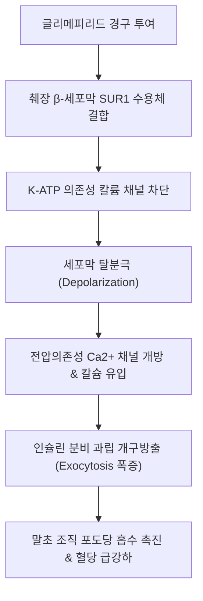

# 💊 [[글리메피리드]] (Glimepiride / 아마릴)

> **핵심 요약 (Key Summary)**:
> 췌장 $\beta$-세포의 $K_{ATP}$ 채널(SUR1)을 차단하여 포도당 농도와 무관하게 인슐린 분비를 촉진하는 3세대 설포닐우레아(Sulfonylurea)계 경구 혈당강하제.
> 제2형 [[당뇨병]] 환자의 혈당 조절에 단독 또는 [[메트포르민]], 인슐린과 병용 투여하며, 주 대사는 간 **CYP2C9**를 통해 이루어짐.
> 가장 치명적인 부작용은 장시간 지속되는 **저혈당(Hypoglycemia)**과 체중 증가이며, 한의 진료실에서 혈당 강하 한약 병용 시 저혈당 모니터링이 필수적임.

---

## 📌 목차
1. [기본 정보 및 시판 제품](#1-기본-정보-및-시판-제품)
2. [약리 기전 및 약동학 (MoA & Pharmacokinetics)](#2-약리-기전-및-약동학-moa--pharmacokinetics)
3. [적응증 및 용법·용량](#3-적응증-및-용법용량)
4. [이상반응 및 금기·주의사항 (Adverse Effects & Contraindications)](#4-이상반응-및-금기주의사항-adverse-effects--contraindications)
5. [약물 상호작용 (Drug Interactions)](#5-약물-상호작용-drug-interactions)
6. [한의 임상 연계 및 병용 고려사항 (Integrative Considerations)](#6-한의-임상-연계-및-병용-고려사항-integrative-considerations)
7. [💡 진료실 핵심 필기 & 임상 노하우](#7--진료실-핵심-필기--임상-노하우)
8. [출처 및 학술 참고 문헌 (References)](#8-출처-및-학술-참고-문헌-references)

---

## 1. 기본 정보 및 시판 제품

![[글리메피리드_화학구조식.png|380]]
> [그림 1: ① 화학 분자 구조식 — 글리메피리드(Glimepiride, C24H34N4O5S, 분자량 490.6 g/mol)의 2차원 화학 구조식. 출처: PubChem (CID 3476)]

![[글리메피리드_정제알약_성상.jpg|400]]
> [그림 2: ② 의약품 알약 성상 실사 — 글리메피리드 2mg 정제의 분할선 및 외형 성상. 출처: National Library of Medicine / DailyMed (Public Domain)]

![[글리메피리드_3D_분자모델.png|380]]
> [그림 3: ③ 분자 3D 구조 — 글리메피리드의 3차원 볼앤스틱(Ball-and-stick) 분자 구조 모델. 출처: Wikimedia Commons (Public Domain)]

| 항목 | 상세 정보 |
| :--- | :--- |
| **일반명 (INN)** | 글리메피리드 (Glimepiride) |
| **대표 상품명** | **아마릴정(Amaryl)** 1mg, 2mg, 4mg (한독), 아마릴엠정(복합제), 제네릭 140여 종 |
| **약효 분류 (KDC)** | [03960] 당뇨병용제 / 전문의약품 |
| **ATC 코드** | A10BB12 (Sulfonylureas) |
| **화학식 / 분자량** | $C_{24}H_{34}N_4O_5S$ / 490.62 g/mol |
| **PubChem CID** | [3476](https://pubchem.ncbi.nlm.nih.gov/compound/3476) |
| **보험 인정 기준** | 제2형 당뇨병 환자 중 식이·운동요법 불응 시 단독 또는 병용 급여 |

---

## 2. 약리 기전 및 약동학 (MoA & Pharmacokinetics)

* **약리 작용 기전 (Mechanism of Action)**:
  * 췌장 랑게르한스섬 $\beta$-세포막의 ATP-sensitive $K^+$ 채널의 조절 아단위인 **SUR1(Sulfonylurea Receptor 1)**에 결합.
  * $K^+$ 이온의 세포외 유출을 차단하여 세포막을 탈분극시키고, 전압의존성 $Ca^{2+}$ 채널을 개방시켜 세포 내 $Ca^{2+}$ 농도를 급상승시킴.
  * 저장된 [[인슐린]](Insulin) 분비 과립의 방출을 촉진하여 혈당을 신속히 강하시킴.
  * **3세대 특징**: 1·2세대(글리벤클라마이드 등)에 비해 SUR1 수용체와의 결합 및 해리 속도가 빨라(On-off rate 빠름) 췌장 세포 피로를 줄이고 장기 복용 시 심혈관 허혈 전처치(Ischemic preconditioning) 장애를 덜 유발함.
* **약동학적 특성 (Pharmacokinetics)**:
  * **흡수(Absorption)**: 경구 투여 후 완전 흡수(생체이용률 ~100%). 최고 혈중 농도 도달 시간($T_{max}$)은 약 2~3시간. 식사 직전 복용 시 흡수율이 가장 일정함.
  * **분포(Distribution)**: 혈장 단백 결합률 **> 99.5%** (주로 알부민과 결합).
  * **대사(Metabolism)**: 간의 **CYP2C9** 효소에 의해 활성 대사산물인 M1(시클로헥실히드록시메틸 유도체, 원형 약물의 약 1/3 효력)과 불활성 대사산물 M2로 대사됨.
  * **배설(Elimination)**: 방사능 표지 용량의 약 60%가 소변으로 배설되며, 40%는 대변으로 배설됨. 소실 반감기($t_{1/2}$)는 5~8시간이나, 인슐린 분비 촉진 효과는 24시간 동안 지속됨.

---

## 3. 적응증 및 용법·용량

* **효능·효과 (적응증)**:
  * 제2형 [[당뇨병]](Type 2 Diabetes Mellitus) 환자에서 식이요법, 운동요법만으로 혈당이 적절히 조절되지 않는 경우.
  * [[메트포르민]] 또는 치아졸리딘디온(TZD) 계열과의 2제 병용 요법.
  * 기저 인슐린 요법과의 병용 요법.
* **용법 및 용량 적정 (Dosing & Titration)**:
  * **복약 시점**: 반드시 **아침 식전 또는 하루 중 첫 번째 본 식사 직전**에 단회 복용. (식사를 거를 경우 복용하지 않음).
  * **초기 용량**: 1일 1회 **1mg 또는 2mg**으로 시작. (고령자, 신기능 저하자는 1mg 시작).
  * **용량 증량**: 혈당 수치에 따라 1~2주 간격을 두고 1mg $\rightarrow$ 2mg $\rightarrow$ 3mg $\rightarrow$ 4mg으로 서서히 증량.
  * **유지 용량**: 통상 1일 1~4mg. **1일 최대 권장 용량은 8mg**이나, 4mg 초과 시 추가적인 당화혈색소(HbA1c) 강하 효과는 미미하면서 저혈당 위험만 급증하므로 임상에서는 대개 4mg 이하로 제한함.

---

## 4. 이상반응 및 금기·주의사항 (Adverse Effects & Contraindications)

* **주요 이상반응**:
  * **저혈당증 (Hypoglycemia)**: 가장 흔하고 치명적인 이상반응. 식사 지연, 과도한 운동, 알코올 섭취 시 장시간 지속되는 중증 저혈당 쇼크 유발 가능.
  * **체중 증가 (Weight Gain)**: 고인슐린혈증으로 인한 지방 축적 유도 (평균 1~3kg 증가).
  * **소화기계**: 일시적인 오심, 구토, 복부 팽만감, 설사.
  * **혈액학적 이상 (드묾)**: 백혈구 감소증, 혈소판 감소증, 재생불량성 빈혈.
  * **피부 및 알레르기**: 가려움, 발진, 두드러기, 광과민 반응.
* **투여 금기 환자 (Contraindications)**:
  * 제1형 당뇨병 환자 (인슐린 절대 결핍 상태이므로 효과 없음).
  * 당뇨병성 케톤산증(DKA), 당뇨병성 혼수 또는 전혼수 환자.
  * 중증 간장애 또는 신장애 환자 (혈중 약물 축적으로 치명적 저혈당 유발).
  * 설포닐우레아계, 설폰아미드계 약물에 과민증 기왕력자.
  * 임산부 및 수유부 (태반 통과 및 신생아 저혈당 위험으로 인슐린으로 대체).

---

## 5. 약물 상호작용 (Drug Interactions)

* **혈당 강하 작용 증강 (저혈당 위험 폭증 약물)**:
  * **CYP2C9 강력 억제제**: 플루코나졸(Fluconazole), 보리코나졸 등 항진균제 병용 시 글리메피리드 혈중 농도가 2~3배 상승하여 치명적 저혈당 유발.
  * **NSAIDs 및 살리실산 제제**: 혈장 단백 결합 부위에서 글리메피리드를 유리시켜 유리형(Free) 약물 농도를 급상승시킴.
  * **ACE 억제제, 인슐린, 와파린**: 상가적 혈당 강하 작용 유발.
* **혈당 강하 작용 감쇄 (고혈당 유발 약물)**:
  * 코르티코스테로이드(스테로이드제), 갑상선 호르몬제([[레보티록신]]), 티아지드계 이뇨제, 에스트로겐, 경구 피임약.
* **저혈당 증상 은폐 약물**:
  * **비선택적 베타차단제**(프로프라놀롤 등): 저혈당 시 자율신경 보상 반응인 빈맥, 심계항진, 떨림을 차단하여 환자가 혼수에 빠질 때까지 저혈당을 인지하지 못하게 만듦 (발한 증상만 보존됨).

---

## 6. 한의 임상 연계 및 병용 고려사항 (Integrative Considerations)

* **혈당 강하 한약재와의 병용 시너지 및 저혈당 감시**:
  * 한의학에서 소갈(消渴) 치료에 상용하는 [[황련]](베르베린 성분), [[갈근]], [[지황]], [[창출]], [[천화분]], [[상백피]] 등은 AMP 활성화 단백질 키나아제(AMPK)를 촉진하거나 인슐린 감수성을 높이는 작용이 뛰어남.
  * 이미 글리메피리드를 복용 중인 환자에게 이들 청열자음(淸熱滋陰) 한약을 고용량 병용 투여할 경우, **혈당이 급격히 떨어져 식은땀, 어지럼증, 손떨림 등 저혈당 발작**이 일어날 수 있음.
  * 따라서 당뇨 한약 투약 초기 2~4주간은 자가 혈당 측정을 매일 2~3회(공복 및 식후) 철저히 지도하고, 혈당이 안정되면 양방 주치의와 협진하여 글리메피리드 용량을 감량하도록 유도함.
* **침구 치료와의 병용**:
  * 비수(BL20), 위수(BL21), 족삼리(ST36), 삼음교(SP6) 전침 치료는 말초 포도당 소비를 촉진하므로, 공복 상태에서 강자극 침 치료 시 저혈당성 현훈(훈침)이 발생하지 않도록 시술 전 반드시 식사 여부를 확인해야 함.

---

## 7. 💡 진료실 핵심 필기 & 임상 노하우

* **진료실 저혈당 감별 문진 팁**:
  * 환자가 "오후 3~4시만 되면 식은땀이 나고 손이 떨리며 머리가 멍해지고 자꾸 단것을 찾게 된다"고 호소하면, 이는 거의 100% 설포닐우레아(아마릴)로 인한 경도 저혈당 증상이다.
  * 환자에게 즉시 사탕이나 주스 섭취를 티칭하고, 복용 중인 아마릴의 용량이 과다하지 않은지 당화혈색소(HbA1c < 6.5% 과교정 상태)를 점검해야 한다.
* **환자 복약 티칭 스크립트**:
  * *"아마릴은 췌장을 자극해 인슐린을 짜내는 약이므로, 약을 드시고 식사를 거르시면 뇌가 굶어 쓰러지는 저혈당 쇼크가 올 수 있습니다. 식사를 못 하실 때는 약을 거르셔야 하며, 외출 시에는 반드시 주머니에 사탕 3~4알을 비상용으로 가지고 다니셔야 합니다."*

---

## 8. 출처 및 학술 참고 문헌 (References)

1. **식품의약품안전처 의약품통합정보시스템**. 아마릴정(글리메피리드) 의약품 상세 허가정보 및 복약지도서. [식약처 허가정보](https://nedrug.mfds.go.kr)
2. **Basit A, et al**. (2012). Glimepiride: evidence-based facts, trends, and observations. *Vasc Health Risk Manag*, 8:463-472. [PMID 22915858](https://pubmed.ncbi.nlm.nih.gov/22915858/)
   - **[연구 요약]**: 제2형 당뇨병 환자에서 글리메피리드의 췌장 SUR1 수용체 작용 기전, 빠른 결합/해리 속도에 따른 저혈당 위험 경감 특성, 타 제제 대비 심혈관 안전성 프로파일을 총괄한 체계적 고찰.
3. **Campbell RK**. (1998). Glimepiride: role of a new sulfonylurea in the treatment of type 2 diabetes mellitus. *Ann Pharmacother*, 32(10):1044-1052. [PMID 9793597](https://pubmed.ncbi.nlm.nih.gov/9793597/)
   - **[연구 요약]**: 3세대 설포닐우레아인 글리메피리드의 약동학적 대사 경로(CYP2C9) 및 1일 1회 복용의 임상적 유효성과 메트포르민 병용 전략을 보고함.
4. **National Library of Medicine (DailyMed)**. Glimepiride Tablet Prescribing Information. [DailyMed Glimepiride](https://dailymed.nlm.nih.gov/dailymed/drugInfo.cfm?setid=2d3cb5ec-311e-450f-90db-31f01633512a)
