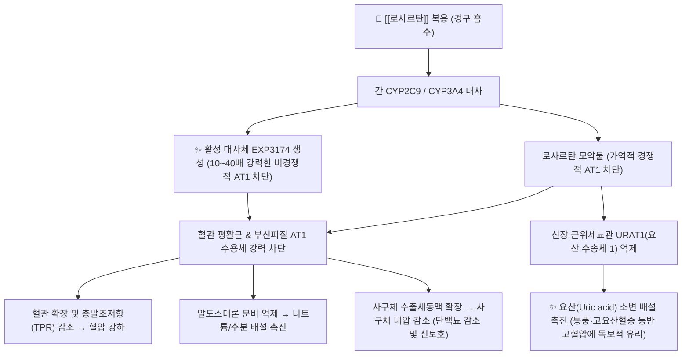

---
aliases:
  - Cozaar
  - 코자
  - 코자정
  - 로사르탄칼륨
  - Losartan
  - C09CA01
tags:
  - 약리/양방약
  - 심혈관계
  - 혈압강하제
  - ARB
  - 안지오텐신수용체차단제
---

# 💊 [[로사르탄]] (Losartan Potassium, Cozaar, C09CA01)

> **핵심 3줄 요약 (Key Summary)**:
> 🧪 주성분·제형: [[로사르탄칼륨]] (Losartan potassium) 단일 성분, 세계 최초로 상용화된 경구용 안지오텐신 II 수용체 차단제(ARB), 백색 타원형 필름코팅정(50mg, 100mg).
> 📍 작용 기전: 혈관 평활근의 AT1 수용체를 선택적 차단하여 혈관 확장 및 알도스테론 분비 억제, 활성 대사체 EXP3174 생성, 근위세뇨관 URAT1 억제를 통한 요산 배설 촉진.
> 🎯 임상 적응증: 본태성 고혈압 1차 치료, 고혈압을 동반한 제2형 당뇨병성 신증 환자의 신장 보호(RENAAL), 좌심실비대 고혈압 환자의 뇌졸중 발생 위험 감소(LIFE).
> ⚠️ 주의사항: FDA 블랙박스 경고(임부 투여 절대 금기: 태아 신부전 및 기형 유발), 알도스테론 억제에 따른 고칼륨혈증, 양측성 신동맥 협착 시 급성 신손상 주의.

---

## 📌 목차
1. [약물 기본 정보 및 시판 제품 (Brand Identification)](#1-약물-기본-정보-및-시판-제품-brand-identification)
2. [분자 약리 기전 및 작용 경로 (Mechanism of Action)](#2-분자-약리-기전-및-작용-경로-mechanism-of-action)
3. [약동학적 특성 (Pharmacokinetics: ADME)](#3-약동학적-특성-pharmacokinetics-adme)
4. [임상 용법·용량 및 처방 가이드 (Dosage & Administration)](#4-임상-용법용량-및-처방-가이드-dosage--administration)
5. [부작용, 경고 및 약물 상호작용 (Adverse Effects & Interactions)](#5-부작용-경고-및-약물-상호작용-adverse-effects--interactions)
6. [한의 치료 연계 및 병용/테이퍼링 프로토콜 (Integrative Medicine)](#6-한의-치료-연계-및-병용테이퍼링-프로토콜-integrative-medicine)
7. [💡 사용자 진료실 핵심 필기 & 실전 임상 체크리스트](#7--사용자-진료실-핵심-필기--실전-임상-체크리스트)
8. [출처 및 학술 참고 문헌 (References)](#8-출처-및-학술-참고-문헌-references)

---

## 1. 약물 기본 정보 및 시판 제품 (Brand Identification)

> [!abstract]+ 🧪 3D 약리 분자 구조 (Interactive 3D Viewer)
> <iframe src="https://molecule-viewer-rho.vercel.app/?cid=3961" width="100%" height="450px" frameborder="0" allow="webgl" style="border-radius: 8px;"></iframe>

![[로사르탄_패키지.jpg|350]]
> [그림 1] [[로사르탄]]의 대표적인 시판 완제의약품 패키지 외형

![[로사르탄_코자_알약.jpg|350]]
> [그림 2] 오리지널 코자(Cozaar) 100mg 각인 알약 성상 및 PTP 블리스터 포장

![[로사르탄_화학구조.png|300]]
> [그림 3] [[로사르탄]]의 2D 평면 화학 분자 구조식 (PubChem CID 3961)

| 항목 | 상세 정보 |
| :--- | :--- |
| **일반명 (Generic Name)** | [[로사르탄]] (로사르탄칼륨) / Losartan potassium |
| **대표 상품명 (Brand Names)** | **코자정 (Cozaar, MSD 오리지널), 살로탄정, 로자살탄정 등** |
| **ATC 코드 / 분류** | C09CA01 (Angiotensin II receptor blockers, plain) / 식약처 분류 214 (혈압강하제) |
| **PubChem CID** | [3961](https://pubchem.ncbi.nlm.nih.gov/compound/3961) (Losartan potassium 염: [5460228](https://pubchem.ncbi.nlm.nih.gov/compound/5460228)) |
| **화학식 / 분자량** | C22H23ClN6O (칼륨염: C22H22ClKN6O) / 422.9 g/mol (칼륨염: 461.01 g/mol) |
| **주요 제형 및 함량** | 경구용 필름코팅정 (50mg, 100mg) |
| **식약처 허가 적응증** | 1. 본태성 고혈압 치료<br>2. 고혈압 치료 요법으로 제2형 당뇨병 환자의 신장병증 치료<br>3. 좌심실 비대가 있는 고혈압 환자에서 뇌졸중 발생 위험 감소 |

### 1.1 대표 시판 제품 및 함유 복합제 매핑 (Brand Identification & Combinations)

| 구분 | 대표 제품명 / 브랜드 | 함유 성분 및 1회당 함량 | 제형 및 특징 | 주요 적응증 및 복약 지도 핵심 |
| :--- | :--- | :--- | :--- | :--- |
| **오리지널 단일제** | [[코자]] 50mg / 100mg | [[로사르탄칼륨]] 단일 (50mg / 100mg) | 백색 타원형 정제 | 1일 1회 일정한 시간에 복용, 마른기침 부작용 최소화 |
| **이뇨제 복합제 (2제)** | [[코자플러스]], 코자플러스프로 | [[로사르탄]] (50mg/100mg) + [[히드로클로로티아지드]] (12.5mg) | 황색 필름코팅정 | 혈관확장 + 수분배출 시너지, 저나트륨·고요산 주의 |
| **CCB 복합제 (2제)** | [[코자엑스큐]], 아모잘탄 | [[로사르탄]] (50mg) + [[암로디핀]] (5mg) | 이중정 | 동맥혈관 이완 시너지 극대화, 발목 부종 모니터링 |
| **3제 복합제 (ARB+CCB+Statin)** | [[아모잘탄큐]] | [[로사르탄]] + [[암로디핀]] + [[로수바스타틴]] | 다층정 | 고혈압·이상지질혈증 동반 만성질환자의 복약순응도 개선 |

---

## 2. 분자 약리 기전 및 작용 경로 (Mechanism of Action)



* **선택적 안지오텐신 II 1형(AT1) 수용체 길항 (Primary MoA)**:
  * 레닌-안지오텐신-알도스테론 계(RAAS)의 최종 매개물질인 안지오텐신 II가 결합하는 $\text{AT}_1$ 수용체에 높은 친화도로 결합하여 차단합니다.
  * 혈관 수축, 알도스테론 분비, 교감신경 흥분, 심근 및 혈관 비대증 유발 신호를 원천 봉쇄합니다.
  * ACE 억제제와 달리 브라디키닌(Bradykinin) 대사를 방해하지 않으므로, ACEI의 대표적 불편 부작용인 **마른기침(dry cough)과 혈관부종 발생률이 현저히 낮습니다.**
* **활성 대사체 EXP3174 (E-3174)의 강력한 2차 약리 작용**:
  * 간의 CYP2C9과 CYP3A4에 의해 로사르탄의 5위치 히드록시메틸기가 카르복실산으로 산화되어 생성됩니다.
  * EXP3174는 모약물인 로사르탄보다 $\text{AT}_1$ 수용체 차단 효력이 **10~40배 더 강력하며**, 비경쟁적(non-competitive)으로 수용체에 결합합니다.
  * 반감기가 6~9시간으로 길어 로사르탄의 24시간 혈압 강하 지속 효과를 주로 견인합니다.
* **ARB 계열 중 유일한 요산 배설 촉진(Uricosuric) 특이 작용**:
  * 신장 근위세뇨관 상피세포에 존재하는 **URAT1 (Urate Transporter 1)**을 직접 억제하여 요산의 재흡수를 막고 소변 배출을 촉진합니다.
  * 이뇨제(히드로클로로티아지드 등) 병용이나 고혈압 자체로 흔히 동반되는 고요산혈증 및 [[통풍]] 발작 위험을 경감시키는 독보적인 임상 장점을 지닙니다.

---

## 3. 약동학적 특성 (Pharmacokinetics: ADME)

| 약동학 파라미터 | 수치 및 임상적 의미 |
| :--- | :--- |
| **생체이용률 (Bioavailability, F)** | 약 33% (경구 흡수는 양호하나 초회통과효과가 큼) |
| **최고혈중농도 도달시간 (Tmax)** | 모약물(로사르탄) 약 1시간, 활성 대사체(EXP3174) 약 3~4시간 |
| **혈장 단백결합률 (Protein Binding)** | 98.7~99% (주로 혈청 알부민에 고도로 결합, 투석으로 제거 불가) |
| **간 대사 효소 (Metabolism)** | 간 마이크로솜 **CYP2C9** (주요) 및 **CYP3A4**에 의해 활성 대사체 EXP3174로 14% 산화 대사 |
| **배설 반감기 (Elimination t1/2)** | 로사르탄 약 1.5~2.5시간, 활성 대사체 EXP3174 약 6~9시간 |
| **주요 배설 경로 (Excretion)** | 소변 배설 약 35% (로사르탄 4%, EXP3174 6%), 담즙/분변 배설 약 60% (간·신 듀얼 배설) |

---

## 4. 임상 용법·용량 및 처방 가이드 (Dosage & Administration)

| 임상 적응증 | 성인 표준 용법·용량 | 1일 최대 한도 용량 | 임상 복약 지도 핵심 |
| :--- | :--- | :--- | :--- |
| **본태성 고혈압** | 1일 1회 50mg 경구 투여 (식사와 무관) | 최대 100mg/day (1회 또는 2회 분할) | 3~6주에 걸쳐 최대 혈압 강하 효과 발현 |
| **제2형 당뇨병성 신증** | 1일 1회 50mg 시작, 혈압에 따라 100mg 증량 | 100mg/day | 사구체 내압을 낮춰 미세알부민뇨·단백뇨 감소 유도 |
| **좌심실 비대 동반 고혈압** | 1일 1회 50mg 시작, 이뇨제 복합 또는 100mg 증량 | 100mg/day | LIFE 연구 기준 심근 리모델링 억제 및 뇌졸중 예방 |
| **체액 고갈 환자 (이뇨제 투여 등)** | 1일 1회 25mg 감량 투여 시작 | 100mg/day | 초기 저혈압 쇼크 방지 |

### 4.1 진료과별 다빈도 처방 패턴 (Sweet Spot vs 금기)
* **[✅ 최적 적응증 (Sweet Spot)]**:
  * **당뇨병 및 단백뇨 동반 고혈압**: 신장 사구체 수출세동맥을 확장시켜 사구체 고혈압을 완화하고 신부전 진행을 억제.
  * **통풍 또는 고요산혈증 동반 고혈압**: URAT1 억제 작용을 통해 요산 수치를 낮추므로 통풍 병력자에게 최적.
  * **ACE 억제제 복용 중 마른기침으로 실패한 환자**: 브라디키닌 축적이 없어 기침 부작용 없이 동일한 심신보호 효과 획득.
* **[⚠️ 신중 투여 및 금기 (Caution / Contraindication)]**:
  * **양측성 신동맥 협착증**: 사구체 여과 유지를 위한 수출동맥 수축 기전이 차단되어 급성 무뇨 및 신부전 유발 위험.
  * **고칼륨혈증 환자 (혈청 K+ > 5.5 mEq/L)**: 알도스테론 차단으로 칼륨 배설이 저하되므로 부정맥 위험.

---

## 5. 부작용, 경고 및 약물 상호작용 (Adverse Effects & Interactions)

### 5.1 주요 부작용 및 독성 경고 (Black Box Warnings)

```
[🚨 FDA 블랙박스 경고 (Black Box Warning: 태아 독성)]
• 임신 중 RAAS 차단제(로사르탄) 복용 시 태아 신장 발생 장애, 양수과소증, 두개골 형성 부전, 신부전 및 태아 사망 유발.
• 임신이 확인되는 즉시 본 제제의 투여를 중단해야 함.
```

* **고칼륨혈증 (Hyperkalemia)**:
  * 알도스테론 감소로 신장의 칼륨 배설이 억제됨. 만성 콩팥병(CKD)이나 당뇨 환자, 칼륨 보존제 복용자에서 호발.
* **혈청 크레아티닌 일시적 상승**:
  * 투여 초기 사구체 여과압 감소로 혈청 Cr이 20~30%가량 일시 상승할 수 있으나, 장기적으로는 신기능 보존 효과. (30% 이상 급등 시 신동맥 협착 검토).
* **저혈압 및 어지럼증**:
  * 탈수 상태나 고용량 이뇨제 복용 환자에서 초회 투여 시 기립성 저혈압 발생 가능.

### 5.2 주요 병용 금기 및 상호작용

| 병용 약물 / 성분군 | 상호작용 기전 | 임상적 결과 및 대처 방안 |
| :--- | :--- | :--- |
| **칼륨 보존성 이뇨제 / 칼륨 보충제** | [[스피로노락톤]], [[아밀로라이드]], 염화칼륨 | 치명적 **고칼륨혈증** 및 심장 부정맥 유발 $\rightarrow$ 병용 금기 또는 혈중 칼륨 밀착 모니터링 |
| **NSAIDs (소염진통제)** | [[이부프로펜]], [[나프록센]], [[세레콕시브]] | 신장 혈류 프로스타글란딘 차단 + ARB 수출동맥 확장 $\rightarrow$ **사구체 여과율 급락 및 혈압 강하 효과 상쇄** |
| **ACE 억제제 / 알리스키렌** | [[에날라프릴]], [[라미프릴]] | 이중 RAAS 차단 $\rightarrow$ 저혈압, 실신, 고칼륨혈증, 신기능 악화 위험 급증으로 병용 금지 |
| **리튬 (Lithium)** | 신장 세뇨관 나트륨·리튬 재흡수 변동 | 리튬 배설 억제로 혈중 리튬 농도 급상승 및 독성 유발 $\rightarrow$ 혈중 농도 측정 필수 |

---

## 6. 한의 치료 연계 및 병용/테이퍼링 프로토콜 (Integrative Medicine)

### 6.1 한의학적 병전(病轉) 변증 및 시너지 배오
* **간양상항(肝陽上亢)형 고혈압**:
  * 두통, 안면홍조, 목현(어지러움), 이명, 맥현삭(脈弦數)을 호소하는 자율신경 항진형.
  * **추천 처방**: [[천마구등음]], [[조등산]].
  * **약리 시너지**: [[조등]]의 린코필린 성분 및 [[천마]]의 가스트로딘이 중추 교감신경 긴장을 완화하여 ARB의 말초 혈관 확장 작용과 우수한 혈압 강하 시너지를 발휘.
* **담탁조락(痰濁阻絡) & 어혈(瘀血)형 고혈압**:
  * 비만, 대사증후군, 고요산혈증, 동맥경화성 혈관 저항 증가.
  * **추천 처방**: [[대시호탕]], [[방풍통성산]], [[도핵승기탕]].
  * **배오 포인트**: [[대황]], [[황금]]이 장관 내 독소 배출과 혈관 내피 염증을 억제하며, 로사르탄의 요산 배설 촉진 및 대사 보호 작용을 보조.

### 6.2 한약 복용 시 칼륨 관리 및 안전성 원칙
* **고칼륨혈증 모니터링**: 로사르탄 복용 환자에게 보음(補陰) 한약재나 미네랄 함량이 높은 생약 투약 시 신기능(eGFR) 및 칼륨 수치를 사전에 확인합니다.
* **감초(甘草) 병용 주의**: [[감초]]의 글리시리진은 위알도스테론증을 유발하여 칼륨을 배출시키고 나트륨을 축적하므로, 로사르탄의 혈압 강하 작용을 일부 상쇄할 수 있어 대량·장기 연용을 지양합니다.

### 6.3 침구 치료 연계 및 단계적 테이퍼링 가이드
* **침구 치료 혈위**: 풍지, 태충(간경 간화 진정), 곡지(대장경 청열), 족삼리, 내관.
* **테이퍼링 프로토콜**:
  1. 침·한약 치료 4~8주 병행으로 가정혈압이 안정적 120/80 mmHg 미만을 유지할 때 양약 감량 검토.
  2. 주치의와 상의 하에 로사르탄 100mg 복용 환자는 50mg으로 감량하고, 50mg 복용 환자는 격일 복용 또는 25mg으로 단계적 축소.
  3. 급격한 중단 시 반동성 고혈압이 나타날 수 있으므로 매일 아침/저녁 자가 혈압 측정을 기록하며 최소 4주 단위로 감량 진행.

---

## 7. 💡 사용자 진료실 핵심 필기 & 실전 임상 체크리스트

### 7.1 진료실 3대 핵심 문진 체크리스트
1. **"혈압약 드시고 마른기침이나 어지럼증은 없으신가요?"**:
   * 과거 ACEI 복용 시 기침 부작용을 겪고 코자로 변경한 환자인지 확인. 초기 기립성 저혈압 발생 여부 확인.
2. **"과거에 통풍 발작이 있었거나 요산 수치가 높다는 말을 들으셨나요?"**:
   * 로사르탄은 요산 배설을 돕는 유일한 ARB이므로, 통풍이나 관절통을 호소하는 고혈압 환자에게 약물 선택의 강력한 이점이 있음을 설명.
3. **"칼륨 보충제나 저염 소금(염화칼륨), 즙(과채즙)을 매일 많이 드시나요?"**:
   * 로사르탄의 알도스테론 억제로 혈중 칼륨이 쉽게 오를 수 있으므로, 칼륨이 과다 함유된 대체 소금이나 녹즙 과다 섭취를 제한.

### 7.2 환자 티칭 스크립트
> *"환자분, 복용 중이신 코자(로사르탄)는 혈관을 좁히는 체내 호르몬을 차단해 혈압을 낮추고, 콩팥을 보호해 주는 우수한 혈압약입니다. 특히 요산을 소변으로 배출해 주는 특별한 기능이 있어 관절 통증이나 통풍이 있는 분들께도 좋습니다. 다만 임신부에게는 절대 투여할 수 없으며, 체내에 칼륨이 쌓일 수 있으므로 칼륨 성분이 많은 건강기능식품은 주의하셔야 합니다. 저희 한의원의 침과 한약 치료로 혈관 긴장을 풀고 자율신경을 안정시키면서 안전하게 혈압을 조절해 나가실 수 있도록 도와드리겠습니다."*

---

## 8. 출처 및 학술 참고 문헌 (References)

1. **식품의약품안전처 (MFDS)**. *의약품 품목허가사항 및 안전성 정보: 로사르탄칼륨 단일제 (코자정)*.
   - [의약품안전나라 품목정보](https://nedrug.mfds.go.kr)
   - `[연구 요약]` 로사르탄칼륨의 본태성 고혈압, 당뇨병성 신증, 좌심실 비대 환자 뇌졸중 위험 감소 적응증 및 임부 금기 공식 라벨 정보.
2. **Brenner, B. M. et al. (2001)**. *Effects of losartan on renal and cardiovascular outcomes in patients with type 2 diabetes and nephropathy*. **New England Journal of Medicine**, 345(12), 861-869.
   - [PubMed (PMID: 11565518)](https://pubmed.ncbi.nlm.nih.gov/11565518/) | [DOI](https://doi.org/10.1056/NEJMoa011161)
   - `[연구 요약]` RENAAL 랜드마크 임상시험: 제2형 당뇨병성 신증 환자에서 로사르탄이 혈압 강하와 독립적으로 말기 신부전(ESRD) 진행 및 혈청 크레아티닌 배가 위험을 16% 유의하게 감소시킴을 규명.
3. **Dahlöf, B. et al. (2002)**. *Cardiovascular morbidity and mortality in the Losartan Intervention For Endpoint reduction in hypertension study (LIFE): a randomised trial against atenolol*. **The Lancet**, 359(9311), 995-1003.
   - [PubMed (PMID: 11937178)](https://pubmed.ncbi.nlm.nih.gov/11937178/) | [DOI](https://doi.org/10.1016/S0140-6736(02)08089-3)
   - `[연구 요약]` LIFE 랜드마크 무작위 대조군 시험: 좌심실 비대(LVH)를 동반한 고혈압 환자에서 아테놀롤 대비 로사르탄이 심혈관 사망 및 뇌졸중 발생 위험을 24.9% 유의하게 낮춤을 입증.
4. **Wong, P. C. et al. (1990)**. *Nonpeptide angiotensin II receptor antagonists. VIII. Characterization of functional antagonism for losartan (DuP 753) and its active metabolite, EXP3174*. **Journal of Pharmacology and Experimental Therapeutics**, 255(1), 211-217.
   - [PubMed (PMID: 2170624)](https://pubmed.ncbi.nlm.nih.gov/2170624/)
   - `[연구 요약]` 로사르탄 모약물과 활성 대사체 EXP3174의 약리학적 수용체 결합 특성을 비교하여, EXP3174가 10배 이상 강력한 비경쟁적 AT1 수용체 길항제임을 최초 규명.
