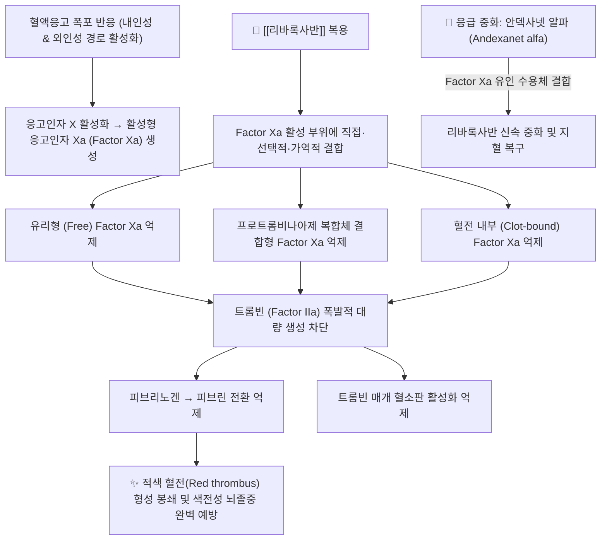

---
aliases:
  - Xarelto
  - 자렐토
  - 자렐토정
  - Rivaroxaban
  - B01AF01
tags:
  - 약리/양방약
  - 심혈관계
  - 항혈전제
  - 항응고제
  - NOAC
  - DOAC
  - FactorXa억제제
---

# 💊 [[리바록사반]] (Rivaroxaban, Xarelto, B01AF01)

> **핵심 3줄 요약 (Key Summary)**:
> 🧪 주성분·제형: [[리바록사반]] (Rivaroxaban), 경구용 직접 활성형 응고인자 Xa(Factor Xa) 억제제(DOAC/NOAC), 원형 필름코팅정(2.5mg 황색, 10mg 담적색, 15mg 적갈색, 20mg 갈적색).
> 📍 작용 기전: 혈액응고 공통 경로의 핵심 효소인 Factor Xa 활성 부위에 직접 결합하여 트롬빈 생성 및 피브린 혈전 형성을 강력하게 가역적 억제.
> 🎯 임상 적응증: 비판막성 심방세동 환자의 뇌졸중 및 전신 색전증 예방(ROCKET AF), 심부정맥혈전증(DVT) 및 폐색전증(PE) 치료 및 재발 예방(EINSTEIN).
> ⚠️ 주의사항: 15mg/20mg 정제는 반드시 식사와 함께 복용(공복 시 흡수율 급감), 조기 중단 시 반동성 뇌졸중 위험, 척추 마취 시 척수 혈종 경고, 특이 역전제 안덱사넷 알파.

---

## 📌 목차
1. [약물 기본 정보 및 시판 제품 (Brand Identification)](#1-약물-기본-정보-및-시판-제품-brand-identification)
2. [분자 약리 기전 및 작용 경로 (Mechanism of Action)](#2-분자-약리-기전-및-작용-경로-mechanism-of-action)
3. [약동학적 특성 (Pharmacokinetics: ADME)](#3-약동학적-특성-pharmacokinetics-adme)
4. [임상 용법·용량 및 처방 가이드 (Dosage & Administration)](#4-임상-용법용량-및-처방-가이드-dosage--administration)
5. [부작용, 경고 및 약물 상호작용 (Adverse Effects & Interactions)](#5-부작용-경고-및-약물-상호작용-adverse-effects--interactions)
6. [한의 치료 연계 및 병용/테이퍼링 프로토콜 (Integrative Medicine)](#6-한의-치료-연계-및-병용테이퍼링-프로토콜-integrative-medicine)
7. [💡 사용자 진료실 핵심 필기 & 실전 임상 체크리스트](#7--사용자-진료실-핵심-필기--실전-임상-체크리스트)
8. [출처 및 학술 참고 문헌 (References)](#8-출처-및-학술-참고-문헌-references)

---

## 1. 약물 기본 정보 및 시판 제품 (Brand Identification)

> [!abstract]+ 🧪 3D 약리 분자 구조 (Interactive 3D Viewer)
> <iframe src="https://molecule-viewer-rho.vercel.app/?cid=9875401" width="100%" height="450px" frameborder="0" allow="webgl" style="border-radius: 8px;"></iframe>

![[리바록사반_알약_블리스터.jpg|350]]
> [그림 1] 오리지널 자렐토(Xarelto)의 대표적인 완제의약품 패키지 외형 및 PTP 블리스터 알약 성상

![[리바록사반_화학구조.png|300]]
> [그림 2] [[리바록사반]]의 2D 평면 화학 분자 구조식 (PubChem CID 9875401)

![[리바록사반_3D구조.png|300]]
> [그림 3] [[리바록사반]]의 3차원 볼앤스틱(Ball-and-stick) 분자 모델

| 항목 | 상세 정보 |
| :--- | :--- |
| **일반명 (Generic Name)** | [[리바록사반]] / Rivaroxaban |
| **대표 상품명 (Brand Names)** | **자렐토정 (Xarelto, 바이엘 오리지널), 리록스반정, 자바록사정 등** |
| **ATC 코드 / 분류** | B01AF01 (Direct factor Xa inhibitors) / 식약처 분류 219 (기타의 순환계용약) |
| **PubChem CID** | [9875401](https://pubchem.ncbi.nlm.nih.gov/compound/9875401) |
| **화학식 / 분자량** | C19H18ClN3O5S / 435.9 g/mol |
| **주요 제형 및 함량** | 경구용 필름코팅정 (2.5mg 황색, 10mg 담적색, 15mg 적갈색, 20mg 갈적색) |
| **식약처 허가 적응증** | 1. 비판막성 심방세동 환자에서 뇌졸중 및 전신 색전증의 위험 감소<br>2. 심부정맥혈전증(DVT) 및 폐색전증(PE)의 치료 및 재발 위험 감소<br>3. 하지 대관절(고관절/슬관절) 치환수술 환자의 정맥혈전색전증 예방<br>4. 관상동맥질환(CAD) 또는 말초동맥질환(PAD) 환자에서 심혈관 사건 위험 감소(2.5mg 아스피린 병용) |

### 1.1 대표 시판 제품 및 함유 복합제 매핑 (Brand Identification & Combinations)

| 구분 | 대표 제품명 / 브랜드 | 함유 성분 및 1회당 함량 | 제형 및 특징 | 주요 적응증 및 복약 지도 핵심 |
| :--- | :--- | :--- | :--- | :--- |
| **오리지널 단일제 (고용량)** | [[자렐토]] 15mg / 20mg | [[리바록사반]] 단일 (15mg / 20mg) | 적갈색 원형 정제 | **반드시 식사와 함께 복용**, 심방세동 뇌졸중 및 DVT 치료 |
| **오리지널 단일제 (중등도)** | [[자렐토]] 10mg | [[리바록사반]] 단일 (10mg) | 담적색 원형 정제 | 식사와 무관 복용 가능, 정형외과 관절치환술 후 혈전 예방 |
| **오리지널 단일제 (저용량)** | [[자렐토]] 2.5mg | [[리바록사반]] 단일 (2.5mg) | 담황색 원형 정제 | 1일 2회 복용, 만성 CAD/PAD 환자 혈관 보호(아스피린 병용) |
| **제네릭 단일제** | [[리록스반]], 자바록사 | [[리바록사반]] 단일 (10mg/15mg/20mg) | 필름코팅정 | 생물학적 동등성 입증 국내 제네릭 제제 |

---

## 2. 분자 약리 기전 및 작용 경로 (Mechanism of Action)



* **선택적 직접 응고인자 Xa (Factor Xa) 억제 기전 (Primary MoA)**:
  * 혈액응고의 내인성 경로와 외인성 경로가 최종 수렴하는 공통 경로의 중심 효소인 **Factor Xa**에 극히 높은 선택성($K_i = 0.4 \text{ nM}$)으로 직접 결합합니다.
  * 항트롬빈 III(Antithrombin III)와 같은 체내 보조인자를 매개하지 않고 약물 자체가 효소 활성 부위를 가역적으로 차단합니다.
  * 혈장 내 유리되어 순환하는 Factor Xa뿐만 아니라, 세포막 위에서 인지질·칼슘·Factor Va와 결합한 **프로트롬비나아제(Prothrombinase) 복합체 내의 Factor Xa**, 그리고 이미 형성된 **혈전 내부(Clot-bound)의 Factor Xa**까지 모두 억제합니다.
  * 하나의 Factor Xa 분자가 1,000개 이상의 트롬빈(Thrombin) 분자를 폭발적으로 증폭 생성하므로, Factor Xa를 차단하는 것은 트롬빈을 직접 억제하는 것보다 상류에서 혈전 생성을 훨씬 효율적으로 차단합니다.
* **와파린(Warfarin) 대비 독보적 임상 차별점**:
  * 비타민 K 에폭사이드 환원효소를 억제하지 않으므로, 청국장, 시금치, 브로콜리 등 **비타민 K 함유 음식물 섭취에 전혀 영향을 받지 않습니다.**
  * 치료역(Therapeutic window)이 넓고 예측 가능한 약동학을 나타내어 정기적인 혈액응고 수치(**PT/INR) 모니터링이 불필요**합니다.

---

## 3. 약동학적 특성 (Pharmacokinetics: ADME)

| 약동학 파라미터 | 수치 및 임상적 의미 |
| :--- | :--- |
| **생체이용률 (Bioavailability, F)** | • 2.5mg 및 10mg: 80~100% (공복/식후 무관 완전 흡수)<br>• **15mg 및 20mg: 공복 시 약 66% $\rightarrow$ 식사와 함께 복용 시 80~100%로 상승 (음식물 필수)** |
| **최고혈중농도 도달시간 (Tmax)** | 2~4시간 (경구 복용 후 신속하게 최대 항응고 효과 발현) |
| **혈장 단백결합률 (Protein Binding)** | 92~95% (주로 혈청 알부민에 고도 결합, 투석으로 제거 불가) |
| **간 대사 효소 (Metabolism)** | 투여량의 약 2/3가 간에서 **CYP3A4, CYP2J2** 및 CYP 독립적 아미드 결합 가수분해를 통해 비활성 대사체로 전환 |
| **배설 반감기 (Elimination t1/2)** | 청장년층 5~9시간, 고령자 11~13시간 (와파린 40시간 대비 매우 짧아 휴약 시 신속 소실) |
| **주요 배설 경로 (Excretion)** | • 신장 소변 배설: 약 66% (36% 미변화 활성체, 30% 비활성 대사체)<br>• 담즙/분변 배설: 약 28% (7% 미변화 활성체, 21% 비활성 대사체) |

---

## 4. 임상 용법·용량 및 처방 가이드 (Dosage & Administration)

| 임상 적응증 | 성인 표준 용법·용량 | 1일 최대 한도 용량 | 임상 복약 지도 핵심 |
| :--- | :--- | :--- | :--- |
| **비판막성 심방세동 뇌졸중 예방** | 1일 1회 20mg 석식과 함께 복용<br>(신장애 CrCl 15~49 mL/min: 1일 1회 15mg) | 20mg/day | **반드시 음식물/식사와 함께 복용** (흡수율 보장) |
| **급성 심부정맥혈전증(DVT) / 폐색전증(PE) 치료** | 초기 3주간 1회 15mg 1일 2회(bid, 총 30mg) 식사 병용<br>$\rightarrow$ 3주 후부터 1일 1회 20mg 식사 병용 유지 | 급성기 30mg/day, 유지 20mg/day | 첫 3주간은 재발 방지 위해 아침·저녁 12시간 간격 복용 준수 |
| **만성 관상동맥/말초동맥질환 (CAD/PAD)** | 1회 2.5mg 1일 2회 경구 복용 (아스피린 100mg 병용) | 5mg/day | COMPASS 요법: 혈관성 사망 및 심근경색·절단율 감소 |
| **슬관절/고관절 전치환술 후 혈전 예방** | 1일 1회 10mg 식사 무관 복용 (슬관절 12일, 고관절 35일) | 10mg/day | 수술 후 6~10시간 후 지혈 확인 후 투여 시작 |

### 4.1 진료과별 다빈도 처방 패턴 (Sweet Spot vs 금기)
* **[✅ 최적 적응증 (Sweet Spot)]**:
  * **식습관 관리가 어렵고 병원 혈액검사가 힘든 고령 심방세동 환자**: 와파린의 잦은 INR 피검사와 식이 제한 스트레스 해소.
  * **급성 DVT/PE 환자의 초기 경구 단독 요법**: 헤파린 주사 없이 입원 초기부터 경구 단독으로 혈전 치료 가능.
* **[⚠️ 신중 투여 및 금기 (Caution / Contraindication)]**:
  * **기계판막 치환술 환자 및 중등도 이상 승모판 협착증**: DOAC 효과 불충분, 와파린만 허용.
  * **중증 신장애 (CrCl < 15 mL/min) 및 투석 환자**: 체내 축적으로 인한 치명적 대출혈 위험으로 투여 금기.
  * **활동성 위장관 궤양 및 최근 두개내 출혈 병력자**: 절대 금기.

---

## 5. 부작용, 경고 및 약물 상호작용 (Adverse Effects & Interactions)

### 5.1 주요 부작용 및 독성 경고 (Black Box Warnings)

```
[🚨 FDA 블랙박스 경고 1: 조기 투약 중단 시 혈전색전증 위험 (Rebound Thromboembolism)]
• 리바록사반 복용을 임의로 중단하면 항응고 효과가 24시간 내에 사라져 급성 허혈성 뇌졸중 및 혈전증 발생 위험이 급증함.
• 다른 항응고제로 전환하지 않고 임의 중단하는 것은 절대 엄금함.

[🚨 FDA 블랙박스 경고 2: 척추/경막외 마취 및 요추 천자 시 척수 혈종 위험 (Spinal Hematoma)]
• 신경축 마취(척추 마취, 경막외 마취) 또는 요추 천자 시행 시 척수 내 혈종이 발생하여 영구적인 하지 마비 유발 가능.
• 시술 전 최소 18~24시간 이상 약물을 중단해야 하며, 카테터 제거 후 최소 6시간 이후에 투약을 재개해야 함.
```

* **출혈 (Hemorrhage)**:
  * 주요 출혈 부위는 위장관(식도, 위, 대장 출혈), 비뇨생식기(혈뇨), 피하 조직(혈종, 자반).
  * 두개내 출혈 발생률은 와파린 대비 약 50%가량 유의하게 낮음.
* **응급 특이 해독제 (Reversal Agent)**:
  * **안덱사넷 알파 (Andexanet alfa, 상품명 Andexxa)**: 유전자 재조합 변형 Factor Xa 단백으로, 리바록사반과 고친화도로 결합하여 체내 내인성 Factor Xa를 해방시키고 지혈을 유도함 (ANNEXA-4 연구).

### 5.2 주요 병용 금기 및 상호작용

| 병용 약물 / 성분군 | 상호작용 기전 | 임상적 결과 및 대처 방안 |
| :--- | :--- | :--- |
| **강력한 CYP3A4 & P-gp 이중 억제제** | [[케토코나졸]], [[이트라코나졸]], [[리토나비르]] | 리바록사반의 간 대사 및 장관 배출을 동시 차단 $\rightarrow$ **혈중 농도 급상승 및 대출혈 위험으로 병용 금기** |
| **강력한 CYP3A4 & P-gp 이중 유도제** | [[리팜피신]], [[카르바마제핀]], [[세인트존스워트]] | 리바록사반 대사 가속 및 배출 촉진 $\rightarrow$ **혈중 농도 50% 이상 급락하여 뇌졸중 발생 위험 증가로 병용 회피** |
| **항혈소판제 및 NSAIDs** | [[아스피린]], [[클로피도그렐]], [[나프록센]] | 응고인자 억제와 혈소판 억제 동시 중복 + 위점막 손상 $\rightarrow$ **위장관 대출혈 위험 급증**. 관절통 시 아세트아미노펜 우선 |
| **다른 전신성 항응고제** | [[와파린]], [[헤파린]], [[에독사반]], [[아픽사반]] | 항응고 작용 과잉 $\rightarrow$ 항응고제 전환기를 제외하고 병용 절대 금기 |

---

## 6. 한의 치료 연계 및 병용/테이퍼링 프로토콜 (Integrative Medicine)

### 6.1 한의학적 병전(病轉) 변증 및 시너지 배오
* **심계(心悸)·정충(怔忡) 및 어혈(瘀血)형 심방세동**:
  * 가슴 두근거림, 불안, 숨참, 흉통, 부정맥, 설자암(舌紫暗), 맥결대(脈結代).
  * **추천 처방**: [[자감초탕]], [[천왕보심단]], [[계지가용골모려탕]].
  * **배오 원리**: [[자감초]], [[맥문동]], [[생지황]], [[인삼]]으로 기혈을 크게 보하고 진액을 공급하여 심장 박동의 불규칙성을 완화하고, 신경성 흥분을 안정.
* **담어호결(痰瘀互結)형 정맥혈전증 및 혈관 협착**:
  * 하지 부종, 정맥류 통증, 피부 색소 침착.
  * **추천 처방**: [[도핵승기탕]], [[당귀수산]].
  * **배오 포인트**: 어혈을 풀어 정맥 혈류 정체를 개선하고 부종을 완화.

### 6.2 활혈거어(活血祛瘀) 생약 병용 시 절대 주의사항
* **파혈축어약(破血逐瘀藥) 병용 금기**: [[수질]](거머리 - 천연 트롬빈 억제제 히루딘 함유), [[맹충]], [[도인]], [[홍화]], [[삼칠]] 등 강력한 항응고·항혈소판 생약을 리바록사반과 고용량 병용하면 통제 불가능한 피하 혈종 및 소화관 출혈을 초래할 수 있으므로 병용을 엄격히 금합니다.
* **순화된 보기활혈(補氣活血) 처방 사용**: 부득이 혈류 개선이 필요할 때는 [[단삼]], [[당귀]] 등 온화한 생약을 저용량 단기 배오하며, 대변 색깔(흑색변 여부)을 면밀히 관찰합니다.

### 6.3 침구 및 부항 치료 시 임상 안전 수칙
* **자락관법(사혈 부항) 절대 금기**:
  * 리바록사반은 응고인자 Xa를 차단하여 피브린 형성을 방해하므로, 사혈 부항 시 모세혈관 지혈이 되지 않아 심각한 저혈압 쇼크 및 피하 대형 혈종을 유발할 수 있어 **자락관법을 절대 금기**합니다.
* **침구 시술 시 혈종 예방 프로토콜**:
  * 굵은 호침이나 장침을 이용한 심부 자침(환도혈, 협척혈 심부 등)을 지양하고, 가느다란 호침(0.20mm 이하)으로 천자(淺刺) 위주 시술.
  * 발침 즉시 알코올 솜으로 **최소 5분 이상 떼지 않고 지속 압박 지혈**을 시행.

### 6.4 치과 치료 및 수술 전 휴약 가이드
* 반감기가 5~9시간(고령자 11~13시간)으로 와파린보다 매우 짧으므로, 통상적인 소수술 및 발치 시 주치의 상의 하에 **수술 24시간 전(고위험 대수술은 48시간 전)** 복용을 중단하면 정상 지혈능을 회복할 수 있습니다. 수술 후 지혈이 완전히 확인되면 24시간 후 재투약합니다.

---

## 7. 💡 사용자 진료실 핵심 필기 & 실전 임상 체크리스트

### 7.1 진료실 3대 핵심 문진 체크리스트
1. **"자렐토 15mg이나 20mg을 저녁 식사와 함께 드시고 계신가요?"**:
   * 환자가 빈속에 복용하면 약효 흡수율이 30% 이상 급락하여 심방세동 환자가 약을 먹고도 뇌졸중에 걸릴 수 있으므로, 반드시 식사 도중이나 식사 직후 복용하도록 지도.
2. **"대변 색깔이 검은색(자장면 색)으로 나오거나, 잇몸·소변에서 피가 비치나요?"**:
   * 위장관 미세 출혈이 진행될 경우 흑색변(Melena)이 나타나므로, 발견 즉시 혈액검사(Hb/Hct) 및 소화기내과 내시경을 권고.
3. **"약 먹는 것을 깜빡 잊고 하루라도 거르신 적이 있나요?"**:
   * 자렐토는 반감기가 짧아 하루만 안 먹어도 약효가 사라져 혈전이 급격히 생길 수 있으므로 매일 같은 시간 복용을 강조.

### 7.2 환자 티칭 스크립트
> *"환자분, 지금 복용하시는 자렐토는 심장이 불규칙하게 뛸 때 피가 굳어 뇌혈관을 막는 뇌졸중을 예방해 주는 매우 훌륭한 최신 항응고제입니다. 예전 와파린과 달리 청국장이나 시금치를 편하게 드셔도 되고 피검사를 자주 하지 않아도 됩니다. 다만 아주 중요한 주의사항이 있습니다. 15mg이나 20mg 알약은 반드시 식사 중에 밥과 함께 드셔야만 몸에 충분히 흡수됩니다. 빈속에 드시면 약효가 3분의 1이나 떨어집니다. 또한 침 치료를 받으신 후에는 피가 멈추는 데 시간이 조금 더 걸릴 수 있으니 5분간 꼭 눌러 지혈해 드리겠습니다."*

---

## 8. 출처 및 학술 참고 문헌 (References)

1. **식품의약품안전처 (MFDS)**. *의약품 품목허가사항 및 안전성 정보: 리바록사반 단일제 (자렐토정)*.
   - [의약품안전나라 품목정보](https://nedrug.mfds.go.kr)
   - `[연구 요약]` 리바록사반의 비판막성 심방세동 뇌졸중 예방, DVT/PE 치료 허가 적응증, 용법·용량, 식사 병용 복약 지침 및 척추마취 시 척수혈종 경고 공식 라벨.
2. **Patel, M. R. et al. (ROCKET AF Investigators) (2011)**. *Rivaroxaban versus warfarin in nonvalvular atrial fibrillation*. **New England Journal of Medicine**, 365(10), 883-891.
   - [PubMed (PMID: 21830957)](https://pubmed.ncbi.nlm.nih.gov/21830957/) | [DOI](https://doi.org/10.1056/NEJMoa1009638)
   - `[연구 요약]` ROCKET AF 랜드마크 3상 시험(14,264명): 중등도~고위험 심방세동 환자에서 리바록사반(1일 1회 20mg)이 와파린 대비 뇌졸중 및 전신 색전증 예방에서 비열등성 및 치료군 분석 시 21% 우월성을 입증하였으며, 두개내 출혈 및 치명적 출혈을 유의하게 감소시킴.
3. **The EINSTEIN Investigators (2010)**. *Oral rivaroxaban for symptomatic venous thromboembolism*. **New England Journal of Medicine**, 363(26), 2499-2510.
   - [PubMed (PMID: 21128814)](https://pubmed.ncbi.nlm.nih.gov/21128814/) | [DOI](https://doi.org/10.1056/NEJMoa1007903)
   - `[연구 요약]` EINSTEIN-DVT 랜드마크 시험(3,449명): 급성 심부정맥혈전증 환자에서 피하 에녹사파린 및 비타민 K 길항제 표준 요법 대비 리바록사반 경구 단독 요법(초기 3주 15mg bid 후 20mg qd)이 동등한 정맥혈전 재발 억제 유효성을 보이며 순임상적 유익성을 입증.
4. **Connolly, S. J. et al. (ANNEXA-4 Investigators) (2019)**. *Full study report of andexanet alfa for bleeding associated with factor Xa inhibitors*. **New England Journal of Medicine**, 380(14), 1326-1335.
   - [PubMed (PMID: 30730782)](https://pubmed.ncbi.nlm.nih.gov/30730782/) | [DOI](https://doi.org/10.1056/NEJMoa1814051)
   - `[연구 요약]` Factor Xa 억제제(리바록사반, 아픽사반 등) 복용 중 발생한 급성 대출혈 환자에서 특이 해독제 안덱사넷 알파 투여 시 항-Xa 활성도를 92% 신속히 감소시키고 환자의 82%에서 우수한 지혈 효과를 달성함을 증명.
