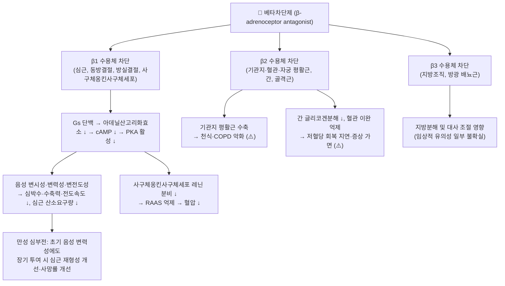

# 💊 [[베타차단제]] (Beta-Blockers, β-Adrenoceptor Antagonists)

> **핵심 3줄 요약 (Key Summary)**:
> 🧪 주성분·제형: 단일 성분 약물이 아니라 **약리학적 계열(class)** 로, β-아드레날린 수용체(β1/β2/β3)를 길항하는 화합물군이다. 비선택적(프로프라놀롤), β1 선택적(아테놀롤·메토프롤롤·비소프롤롤·네비볼롤), α1+β 차단(라베탈롤·카르베딜롤), 초단시간형(에스몰롤) 등으로 세분되며 경구정·서방정·주사제·점안액 제형이 모두 존재한다.
> 📍 작용 기전: β 수용체의 Gs 단백–아데닐산고리화효소–cAMP–PKA 신호축을 차단하여 심박수·수축력·전도속도를 낮추고(음성 변시성·변력성·변전도성), 사구체옹킨사구체세포의 β1 매개 레닌 분비를 억제하여 [[레닌-안지오텐신-알도스테론계]] 활성을 감소시킨다.
> 🎯 임상 적응증: [[고혈압]], [[협심증]], [[심부전]](만성 안정형, 박출률 감소형), [[부정맥]](빈맥성), 심근경색 후 2차 예방, 편두통 예방, 일부 [[녹내장]](점안) 등이며, 최근 고혈압 외 영역(암, 편두통 등)으로 적응증 탐색이 확장되고 있다(PMID 31809852).
> ⚠️ 주의사항: 증상성 서맥·방실차단·기관지수축(천식/COPD 악화)·말초혈관수축·저혈당 증상 가면·중추신경계 부작용이 핵심 위험이며, **급성 중단 시 반동성 빈맥·고혈압·협심증 악화**가 발생하므로 반드시 단계적 감량(테이퍼링)이 필요하다.

---

## 1. 약물 기본 정보 및 시판 제품 (Brand Identification)

> [!abstract]+ 🧪 3D 약리 분자 구조 (Interactive 3D Viewer)
> <iframe src="https://molecule-viewer-rho.vercel.app/?cid={{pubchem_cid}}" width="100%" height="450px" frameborder="0" allow="webgl" style="border-radius: 8px;"></iframe>
>
> ※ 본 노트는 **약물 계열(class) 노트**이므로 단일 PubChem CID가 존재하지 않는다. 위 뷰어의 `{{pubchem_cid}}`는 대표 성분(예: [[프로프라놀롤]] 또는 [[메토프롤롤]])의 CID로 대체하며, 개별 성분의 정확한 CID·분자식·분자량은 각 성분 노트에서 관리한다.

> [그림 1] [[베타차단제]] 계열 대표 시판 완제의약품 패키지 (이미지 자리 — 미확보)

> [그림 2] [[베타차단제]]의 PTP 블리스터 포장 및 식별 각인 알약 성상 (이미지 자리 — 미확보)

> [그림 3] [[베타차단제]] 대표 성분의 2D 평면 화학 분자 구조식 (이미지 자리 — 미확보)

| 항목 | 상세 정보 |
| :--- | :--- |
| **일반명 (Generic Name)** | 계열명: 베타차단제 (β-Adrenoceptor Antagonists) 대표 성분: [[프로프라놀롤]](Propranolol), [[메토프롤롤]](Metoprolol), [[아테놀롤]](Atenolol), [[비소프롤롤]](Bisoprolol), [[카르베딜롤]](Carvedilol), [[라베탈롤]](Labetalol), [[네비볼롤]](Nebivolol), [[에스몰롤]](Esmolol), [[티몰롤]](Timolol, 점안) |
| **대표 상품명 (Brand Names)** | **인데놀**(프로프라놀롤), **테노민**(아테놀롤), **베타록·셀로켄**(메토프롤롤), **콩코르**(비소프롤롤), **딜라트렌**(카르베딜롤), **브레비블록**(에스몰롤 주사) 등 (※ YAML `aliases:`에 계열 별칭 등록 완료 / 국내 품목명·함량은 식약처 의약품안전나라에서 최종 확인 필요) |
| **ATC 코드 / 분류** | ATC **C07** (Beta blocking agents) — C07A β차단제 단독, C07B β차단제 + 이뇨제, C07C β차단제 + 이뇨제(복합), C07D β차단제 + 칼슘채널차단제, C07F β차단제 + 기타 항고혈압제 식약처 분류: 214 항고혈압제(주로), 121 β-차단제(교감신경억제제) 계열 |
| **PubChem CID** | 계열 노트이므로 단일 CID 미적용 → 개별 성분 노트 참조 (예: [[메토프롤롤]], [[카르베딜롤]]) |
| **화학식 / 분자량** | 성분별 상이. **근거 미확인** — 제공된 6편의 문헌에는 개별 분자식·분자량 수치가 명시되어 있지 않으므로, 정확한 값은 PubChem 및 식약처 허가사항 원문에서 확인한다. |
| **주요 제형 및 함량** | 경구 속방정·서방정(숙시네이트/타르트레이트 염 형태에 따라 방출 특성 상이), 주사액(에스몰롤·라베탈롤·메토프롤롤), 점안액(티몰롤 등). 함량은 성분별 상이(**근거 미확인**) |
| **식약처 허가 적응증** | 고혈압, 협심증, 심부전(만성 안정형), 부정맥(빈맥성), 심근경색 후 2차 예방, 갑상선기능항진증 보조, 편두통 예방, 본태성 진전, 녹내장(점안) 등 성분별로 상이(**개별 허가사항 확인 필요**) |

### 1.1 대표 시판 제품 및 함유 복합제 매핑 (Brand Identification & Combinations)

| 구분 | 대표 제품명 / 브랜드 | 함유 성분 및 1회당 함량 | 제형 및 특징 | 주요 적응증 및 복약 지도 핵심 |
| :--- | :--- | :--- | :--- | :--- |
| **비선택적 β차단제 (1세대)** | [[인데놀]] | [[프로프라놀롤]] 단일 성분 | 속방정, 서방형 캡슐 | 협심증·부정맥·편두통 예방·진전. 지용성 → 중추신경계 부작용(악몽·피로) 상대적으로 흔함, 천식 환자 금기 |
| **β1 선택적 차단제 (2세대)** | [[테노민]], [[베타록]], [[셀로켄]], [[콩코르]] | [[아테놀롤]], [[메토프롤롤]](타르트레이트/숙시네이트), [[비소프롤롤]] | 속방정, 서방정 | 고혈압·협심증·심부전. 심부전에는 숙시네이트 서방정 또는 비소프롤롤을 저용량부터 적정 |
| **α1+β 혼합 차단제 (3세대)** | [[딜라트렌]], 라베탈롤 제제 | [[카르베딜롤]], [[라베탈롤]] | 정제 | 심부전·고혈압·임신성 고혈압. α1 차단에 의한 기립성 저혈압 주의 |
| **초단시간형 주사제** | [[브레비블록]] | [[에스몰롤]] | 주사액(IV) | 급성기 빈맥성 부정맥·수술 전후 조절. 반감기가 매우 짧아 중단 시 효과 소실이 빠름(**수치 근거 미확인**) |
| **β차단제 + 이뇨제 복합제** | 아테놀롤/클로르탈리돈, 비소프롤롤/HCTZ 등 | β차단제 + [[히드로클로로티아지드]] | 정제 | 단독으로 혈압 조절 불충분 시. 전해질·혈당·요산 모니터링 |
| **점안 β차단제 (안과)** | 티몰롤 점안액 등 | [[티몰롤]], [[베타크솔롤]] | 점안액 | [[녹내장]] 안압 강하. 점안 후 비루관 압박(전신 흡수 차단), 천식 환자 주의 |
| **감별 다빈도 항고혈압제** | [[노바스크]], [[아모잘탄]], [[코자]] | [[암로디핀]], [[로사르탄]] 등 | 정제 | 복약력 청취 시 **동일 계열 중복(β차단제+β차단제) 및 칼슘채널차단제와의 병용 서맥 위험** 감별 |

---

## 2. 분자 약리 기전 및 작용 경로 (Mechanism of Action)

* **주요 작용 기전 (Primary MoA)**:
  * 베타차단제는 카테콜아민(에피네프린·노르에피네프린)이 β-아드레날린 수용체에 결합하는 것을 **경쟁적으로 차단**한다. β1 수용체는 주로 심근·동방결절·방실결절·사구체옹킨사구체세포에 분포하여 Gs 단백을 통해 아데닐산고리화효소를 활성화하고 cAMP를 증가시킨다.
  * β1 차단 시 cAMP–PKA 경로 활성이 저하되어 L형 칼슘채널 인산화 및 세포내 Ca²⁺ 유입이 감소하고, 동방결절 자동능(If 전류)과 방실결절 전도가 억제된다 → **음성 변시성(심박수 감소)·음성 변력성(수축력 감소)·음성 변전도성(전도 지연)**.
  * 신장 사구체옹킨사구체세포의 β1 차단은 **레닌 분비를 감소**시켜 [[레닌-안지오텍신-알도스테론계]] 전체 활성을 낮추고, 이는 혈압 강하 및 심혈관 보호 효과의 한 축이 된다(PMID 37166681 — 고혈압에서의 베타차단제 역할에 대한 Q&A 형식 고찰).
  * β2 차단은 기관지·혈관 평활근 및 간 대사에 영향을 주어 **기관지 수축, 말초혈관 저항 변화, 저혈당 대응 지연** 등 계열 특유의 부작용을 매개한다.
  * 약물별 **부가 작용**이 존재한다: 내재적 교감신경작용(ISA, partial agonist), 막안정화작용(MSA, 나트륨채널 차단), α1 차단(카르베딜롤·라베탈롤), 산화질소(NO) 매개 혈관이완(네비볼롤) 등.
* **하류 신호전달 및 생화학적 반응**:
  * cAMP 감소 → PKA 활성 저하 → 포스포람반(phospholamban)·라이아노딘 수용체(RyR2)·L형 Ca²⁺ 채널 인산화 감소 → 심근 세포내 Ca²⁺ 순환 감소 → 수축력·심박수 저하.
  * 심부전에서의 **역설적 장기 이득**: 초기에는 음성 변력성으로 심기능이 일시 저하될 수 있으나, 만성 투여 시 교감신경 과활성의 억제를 통해 심근 재형성(remodeling)이 개선되고 임상 경과가 호전된다는 개념이 1994년 심부전 치료 맥락에서 정리되었다(PMID 9132458).
  * **약물유전체학**: β1 수용체 유전자(ADRB1), β2 수용체 유전자(ADRB2)의 다형성 및 대사효소(CYP2D6 등) 유전형이 베타차단제 반응성·부작용 개인차에 관여한다는 연구가 보고되었다(PMID 20210029).
  * **적응증 확장**: 고혈압을 넘어 암, 편두통 등으로 베타차단제의 잠재적 효용이 재평가되고 있다(PMID 31809852).

---

## 3. 약동학적 특성 (Pharmacokinetics: ADME)

> ⚠️ **계열 노트 주의**: 베타차단제는 성분별로 약동학이 크게 다르다. 아래 표의 정량 수치는 **제공된 6편의 문헌에 명시되지 않아 '근거 미확인'으로 표기**하며, 각 성분의 정확한 수치는 식약처 허가사항 및 Goodman & Gilman 등 표준 약리학 교과서, PubChem에서 확인한다.

| 약동학 파라미터 | 계열 특성 및 임상적 의미 |
| :--- | :--- |
| **생체이용률 (Bioavailability, F)** | 성분별 상이. 지용성 성분(프로프라놀롤 등)은 간 초회통과효과가 커 생체이용률이 낮고 개인차가 크며, 친수성 성분(아테놀롤 등)은 상대적으로 흡수·배설이 예측 가능하다는 것이 일반 약리학의 정설이나 **구체적 수치는 근거 미확인**. |
| **최고혈중농도 도달시간 (Tmax)** | 속방정 vs 서방정(숙시네이트/타르트레이트 염)에 따라 상이. **수치 근거 미확인**. |
| **혈장 단백결합률 (Protein Binding)** | 성분별 상이, 주로 알부민 결합. **수치 근거 미확인**. |
| **간 대사 효소 (Metabolism)** | 지용성 성분은 주로 간 CYP450(CYP2D6, CYP2C19, CYP3A4 등) 대사를 받고, 친수성 성분은 대사 비율이 낮아 신장 배설 비중이 크다. **CYP2D6 유전형 및 억제제 병용이 메토프롤롤·프로프라놀롤 등의 혈중농도에 영향**을 줄 수 있다(PMID 20210029 — 약물유전체학적 관점). |
| **배설 반감기 (Elimination t1/2)** | 성분별로 수 시간대에서 수십 분 이하(에스몰롤)까지 다양. **정확한 수치 근거 미확인**. 신장애 시 친수성 성분의 용량 조절 필요. |
| **주요 배설 경로 (Excretion)** | 지용성 성분은 간 대사 후 신장 배설, 친수성 성분은 대부분 원형 그대로 신장 배설. **비율 수치 근거 미확인**. |

---

## 4. 임상 용법·용량 및 처방 가이드 (Dosage & Administration)

> ⚠️ 아래는 **계열 수준의 일반 원칙**이며, 성분별 정확한 용법·용량 및 1일 최대 용량은 **제공 문헌에 명시되지 않아 '근거 미확인'** — 반드시 식약처 허가사항 및 개별 성분 노트를 참조한다.

| 임상 적응증 | 성인 표준 용법·용량 (일반 원칙) | 1일 최대 한도 용량 |
| :--- | :--- | :--- |
| **[[고혈압]]** | 저용량 1일 1회(β1 선택적·서방형) 또는 1일 2회 시작 후 반응에 따라 적정. 단독 또는 [[이뇨제]]·[[칼슘채널차단제]]·[[ACE억제제]]/[[ARB]]와 병용 | 성분별 상이 — **근거 미확인** |
| **[[협심증]] / 심근경색 후 2차 예방** | 심박수 및 증상 조절 목표로 증량. **급성 중단 금지** | 성분별 상이 — **근거 미확인** |
| **만성 [[심부전]] (박출률 감소형)** | **매우 저용량에서 시작하여 수 주 간격으로 단계적 증량**(titration). 증량 시 체중·혈압·심박수·증상 악화 모니터링 | 성분별 상이 — **근거 미확인** |
| **빈맥성 [[부정맥]] / 급성기** | 초단시간형(에스몰롤 등) 정맥 투여, 또는 경구제 | 성분별 상이 — **근거 미확인** |
| **[[편두통]] 예방** | 비선택적 성분이 전통적으로 사용되며, 최근 적응증 재평가 대상(PMID 31809852) | 성분별 상이 — **근거 미확인** |
| **본태성 진전·갑상선기능항진증 보조 / [[녹내장]]** | 증상 조절 목적, 점안제는 안과 영역 | 성분별 상이 — **근거 미확인** |

---

## 5. 부작용, 경고 및 약물 상호작용 (Adverse Effects & Interactions)

### 5.1 주요 부작용 및 독성 경고 (Black Box Warnings)

* **심혈관계 (β1 매개)**: 증상성 서맥, 방실차단, 저혈압, 심부전 악화(특히 증량 초기), 말초혈관 수축 및 레이노 현상, 사지 냉감.
* **호흡기계 (β2 매개)**: 기관지 수축 → **천식 및 중증 COPD 환자에서 금기 또는 극도의 주의**. 기침·호흡곤란 악화 시 즉시 평가.
* **대사계**: 인슐린·경구혈당강하제 사용자에서 **저혈당 증상(심계항진·진전)의 가면 및 회복 지연**, 혈중 지질 양상 변화 가능성. 갑상선기능항진증 환자에서 증상 가면.
* **중추신경계**: 지용성 성분에서 피로, 악몽, 수면장애, 우울감, 어지럼.
* **기타**: 성기능장애, 운동능력 저하, 알레르기성 피부 반응. 아나필락시스 및 중증 과민반응 시 **에피네프린 반응성 저하**(비선택적 차단제에서 특히 주의).
* **⚠️ 급성 중단 반동 (Rebound)**: 장기 복용 후 갑작스러운 중단 시 **반동성 빈맥, 혈압 상승, 협심증 악화, 심근경색 및 급사 위험**이 보고되어 있다. 특히 관상동맥질환자에서 치명적일 수 있어 반드시 감량이 필요하다.
* **임신·수유**: 임신성 고혈압에서 일부 성분(라베탈롤 등)이 사용되나, 태아 서맥·저혈당·성장 지연 가능성이 있어 산과 판단이 필요. **구체적 위험도 수치 근거 미확인**.

### 5.2 주요 병용 금기 및 상호작용

* **비디하이드로피리딘계 [[칼슘채널차단제]] (베라파밀, 딜티아젬)**: 서맥·방실차단·심부전 악화의 **중대한 상호작용** → 원칙적 병용 회피.
* **[[클로니딘]]**: 병용 중 클로니딘을 먼저 중단하면 반동성 고혈압 위험 → 베타차단제를 먼저 감량·중단.
* **[[디곡신]]**: 동방·방실결절 전도 억제의 상가작용 → 서맥 위험.
* **[[NSAIDs]]**: 프로스타글란딘 억제를 통한 혈압 강하 효과 감소 가능성.
* **인슐린·[[경구혈당강하제]]**: 저혈당 증상 가면 및 회복 지연.
* **CYP2D6 억제제([[플루옥세틴]], [[파록세틴]], [[퀴니딘]] 등)**: 메토프롤롤·프로프라놀롤 등 CYP2D6 기질 성분의 혈중농도 상승 가능 → 약물유전체학적 관점에서 개인차 존재(PMID 20210029).
* **[[마황]](에페드린 함유) 등 교감신경흥분제**: 비선택적 베타차단제 병용 시 α 매개 혈관수축이 상대적으로 부각되어 **혈압 상승(역설적 고혈압)** 위험 → 한·양방 병용 시 필수 확인 항목.
* **알코올, 흡연, 기타 항고혈압제**: 혈압 강하 상가작용 및 어지럼·기립성 저혈압 위험.

---

## 6. 한의 치료 연계 및 병용/테이퍼링 프로토콜 (Integrative Medicine)

### 6.1 한약·양약 병용 투여 안전성 및 시너지 배오

* **간·신 대사 간섭 완충 처방**: 베타차단제 중 지용성 성분은 간 CYP450 대사를, 친수성 성분은 신장 배설에 의존한다. 한약재 중 간효소 유도·억제 가능성이 있는 본초를 병용할 때는 **최소 1~2시간 시간차 투여**를 원칙으로 하고, 복용 후 어지럼·서맥·피로감 변화를 관찰한다.
* **감별 필수 본초 — [[감초]]**: 글리시리진에 의한 가성 알도스테론증(고혈압·저칼륨·부종)을 유발할 수 있어, 고혈압 조절 중인 환자에서 베타차단제와 병용 시 혈압·전해질 모니터링이 필요하다.
* **감별 필수 본초 — [[마황]]**: 에페드린·슈도에페드린 함유 처방(예: 감기·천식 관련 방제)은 교감신경 흥분 작용을 가지므로, 비선택적 베타차단제 복용자에서 혈압 상승 및 기관지 수축 상쇄 위험이 있다.
* **상승 배오 (Synergy) 관점**: 고혈압·심부전 환자에서 침·약침·한약 치료를 병행하여 혈압 변동성 및 자율신경 불균형(교감신경 항진)을 조절하고, 그 결과 **양방약 용량을 상향하지 않고 유지 또는 감량**할 수 있는지를 임상적으로 평가한다. 다만 제공된 6편의 문헌은 한약 병용에 대한 직접 근거를 포함하지 않으므로, **한·양방 병용 시너지 및 감량 프로토콜은 '근거 미확인'이며 개별 임상 판단과 환자 모니터링에 근거해야 한다.**

### 6.2 양약 감량 및 한의 전환(테이퍼링) 가이드

* **절대 원칙**: 협심증·심근경색 후·심부전 환자에서 **베타차단제를 갑자기 중단하지 않는다**(반동성 허혈 위험).
* **감량 프로토콜 (일반 원칙)**:
  1. 한의 치료(침·한약) 병행으로 혈압·심박수·증상이 안정적으로 조절되는 것을 **수 주간 확인**한다.
  2. 서맥(안정 시 심박수 저하), 어지럼, 기립성 저혈압 등 과도한 약효 징후가 있을 때만 감량을 고려한다.
  3. **1~2주 이상 간격**으로 단계적 감량하고, 매 단계마다 혈압·심박수·흉통·호흡곤란을 재평가한다.
  4. 감량 중 흉통·혈압 상승·빈맥 발생 시 **이전 용량으로 즉시 복귀**하고, 필요 시 양방 순환기 협진을 의뢰한다.
  5. 감량·중단 결정은 **처방한 양방 의료진과의 협진**을 통해 진행한다(한의 단독 결정 금지).

---

## 7. 💡 사용자 진료실 핵심 필기 & 실전 임상 체크리스트

### 7.1 진료실 3대 핵심 문진 체크리스트

1. **복용 성분 및 계열 중복 확인**: 환자가 "혈압약", "심장약"으로만 인지하는 경우가 많다. 프로프라놀롤·아테놀롤·메토프롤롤·비소프롤롤·카르베딜롤·라베탈롤 등을 확인하고, **점안제(티몰롤 등)까지 포함하여 전신 흡수되는 β차단제가 중복되고 있지 않은지** 문진한다. 감기약·마황 함유 제품 복용 여부도 함께 확인한다.
2. **심박수·혈압·호흡기 병력 청취**: 안정 시 맥박수(서맥 여부), 기립성 어지럼, **천식·COPD·말초혈관질환 병력**, 당뇨병(저혈당 가면), 임신 여부를 확인한다. 천명음·호흡곤란이 새로 발생하면 약물 관련 기관지수축을 감별한다.
3. **급성 중단 여부 및 증상 호전도 모니터링**: "약을 끊은 적이 있는지"를 반드시 확인한다. 피로, 악몽, 사지 냉감, 성기능 변화, 운동능력 저하 등 환자가 보고하지 않는 부작용을 먼저 물어본다.

### 7.2 환자 티칭 스크립트

> *"환자분, 지금 드시는 혈압약은 심장이 뛰는 속도와 힘을 줄여서 심장이 쉴 수 있게 하고, 신장에서 혈압을 올리는 호르몬이 나오는 것도 줄여주는 약입니다. 그래서 혈압과 가슴 두근거림, 가슴 통증에 효과가 좋습니다. 다만 두 가지를 꼭 기억해 주세요. 첫째, **이 약은 절대 갑자기 끊으시면 안 됩니다.** 끊으면 맥박이 갑자기 빨라지고 혈압이 오르면서 가슴 통증이 심해질 수 있어서, 반드시 단계적으로 줄여야 합니다. 둘째, **숨이 차거나 쌕쌕거리는 느낌, 맥박이 너무 느려지는 느낌, 어지럼**이 있으면 바로 알려주세요. 그리고 감기약이나 다른 병원에서 받은 약, 한약을 드실 때는 꼭 저에게 먼저 말씀해 주시면 좋겠습니다. 저희 한의원에서는 침과 한약으로 몸의 긴장과 혈압 변동을 함께 조절하면서, 담당 선생님과 상의해 약을 서서히 줄여나갈 수 있는지 확인해 드리겠습니다."*

---

## 8. 출처 및 학술 참고 문헌 (References)

**▶ 제공 문헌 (본 노트의 근거)**

* Yokoyama M, Yokota Y. [Adrenergic beta-antagonists: treatment of heart failure]. *Nihon Naika Gakkai Zasshi*. 1994. PMID: **9132458**
  * `[연구 요약]` 심부전 치료에서 β-아드레날린 길항제의 위치와 임상 운용을 정리한 문헌. 초기 음성 변력성에도 불구하고 만성 투여 시 임상 이득이 나타나는 역설적 효과의 배경을 제공한다.
* Miwa Y, Sasaguri T. [Pharmacogenomics of the beta-adrenergic receptor antagonists]. *Fukuoka Igaku Zasshi*. 2009. PMID: **20210029**
  * `[연구 요약]` β차단제 반응성의 개인차를 β1/β2 수용체 유전자 다형성 및 대사효소 유전형 관점에서 고찰한 약물유전체학 리뷰.
* (무기명). Beta-receptor antagonists. *Lancet*. 1970. PMID: **4194133**
  * `[연구 요약]` β수용체 길항제 개념 정립 초기의 논평 문헌. 계열 명칭과 초기 임상 적용의 역사적 배경.
* (무기명). beta-Adrenoceptor antagonists. *N Engl J Med*. 1982. PMID: **6119611**
  * `[연구 요약]` β-아드레날린 수용체 길항제의 약리·임상 응용을 정리한 종설.
* Fici F, Robles NR. Beta-Blockers and Hypertension: Some Questions and Answers. *High Blood Press Cardiovasc Prev*. 2023. PMID: **37166681**
  * `[연구 요약]` 고혈압 치료에서 베타차단제의 역할, 병용 전략, 임상적 쟁점을 문답 형식으로 정리한 최신 고찰.
* Fumagalli C, Maurizi N. β-blockers: Their new life from hypertension to cancer and migraine. *Pharmacol Res*. 2020. PMID: **31809852**
  * `[연구 요약]` 고혈압을 넘어 암·편두통 등으로 확장되는 베타차단제의 새로운 적응증 가능성을 검토한 리뷰.

**▶ 표준 참고 자료 (계열 약동학·용량 등 정량 정보 확인용)**

* Brunton LL, Hilal-Dandan R, Knollmann BC, eds. *Goodman & Gilman's The Pharmacological Basis of Therapeutics*. 13th ed. McGraw-Hill; 2018.
  * `[연구 요약]` β차단제 계열의 분자 약리학, 약동학, 임상 치료 지침 총람(개별 성분별 정량 수치 확인용).
* 식품의약품안전처 의약품안전나라 의약품통합정보시스템 (https://nedrug.mfds.go.kr)
  * `[연구 요약]` 국내 허가 의약품의 품목 기준코드, 허가사항, 용법용량 및 부작용 안전성 정보(성분별 함량·최대 용량 확인용).

**▶ 근거 표기 원칙**

* 본 노트에서 `근거 미확인`으로 표시된 항목은 제공된 6편의 문헌에 해당 수치·기전이 명시되지 않은 것으로, 표준 약리학 교과서 및 식약처 허가사항 원문을 통해 별도 확인이 필요하다.
* 관련 개념: [[고혈압]], [[심부전]], [[협심증]], [[부정맥]], [[편두통]], [[녹내장]], [[레닌-안지오텐신-알도스테론계]], [[교감신경계]], [[CYP2D6]], [[ADRB1]], [[ADRB2]], [[칼슘채널차단제]], [[ACE억제제]], [[ARB]], [[이뇨제]], [[테이퍼링]], [[마황]], [[감초]]