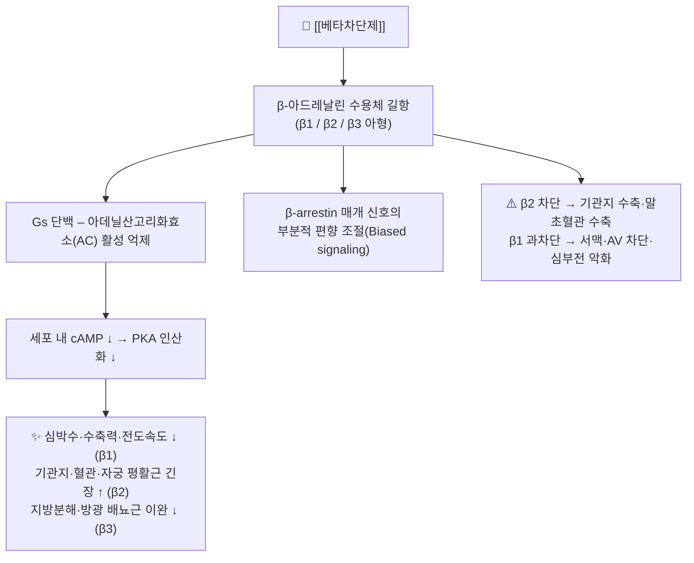

# 💊 [[베타차단제]] (Beta-blockers, β-adrenergic antagonists, ATC C07)

![[베타차단제_4_2.jpg|540]]
> [그림 1: ① 병태생리·영상 — Efficacy-of-beta-blocker-therapy-in-symptomatic-athletes-with-exercise-induced-intra-ventricular-1476-7120-8-38-S1.ogv]

![[베타차단제_1.jpg|540]]
> [그림 1: ① 병태생리·영상 — Angiogram showing a left ventricular <b>dysfunction</b> with preserved basal function and moderate-to-severe <b>dysfunct]

> **핵심 3줄 요약 (Key Summary)**:
> 🧪 주성분·제형: 단일 성분이 아니라 **약리학적 분류군(class)**이다. 프로프라놀롤·나돌롤(1세대 비선택적), 아테놀롤·메토프롤롤·비소프롤롤(2세대 β1 선택적), 카르베딜롤·라베탈롤·네비볼롤(3세대 혈관확장형)로 나뉘며, 경구 정제·서방정, 정맥 주사제(에스몰롤·라베탈롤), 점안액(티몰롤) 등 다양한 제형이 시판된다 (do Vale & Ceron, 2019; PMID 30227820).
> 📍 작용 기전: 카테콜아민(에피네프린·노르에피네프린)이 결합하는 **β-아드레날린 수용체(β1/β2/β3)**를 길항하여 Gs 단백–아데닐산고리화효소–cAMP–PKA 신호축을 차단한다. 그 결과 심박수·수축력·전도속도 감소(β1), 기관지 및 혈관 평활근 긴장 조절(β2), 지방분해·방광 배뇨근 조절(β3) 등 광범위한 자율신경 조절 효과가 나타난다 (Oliver & Mayor, 2019; PMID 31178382).
> 🎯 임상 적응증: 고혈압, 협심증, 심근경색 후 2차 예방, 만성 심부전(카르베딜롤·비소프롤롤·메토프롤롤 숙시네이트), 부정맥(심방세동 심박수 조절), 편두통 예방, 본태성 진전, 갑상선중독증 보조요법, 녹내장(국소 점안) 등.
> ⚠️ 주의사항: 서맥·방실차단·기관지수축·수족냉증·피로·저혈당 증상 은폐가 대표적 부작용이며, **급성 중단 시 반동성 고혈압·협심증 악화·심근경색 위험**이 있어 반드시 단계적 감량(Tapering)이 필요하다.

---

## 1. 약물 기본 정보 및 시판 제품 (Brand Identification)
> [!abstract]+ 🧪 3D 약리 분자 구조 (Interactive 3D Viewer)
> <iframe src="https://molecule-viewer-rho.vercel.app/?cid=4946" width="100%" height="450px" frameborder="0" allow="webgl" style="border-radius: 8px;"></iframe>
>
> ※ 위 뷰어는 1세대 대표 성분인 **프로프라놀롤(PubChem CID 4946)** 을 표시한다. 베타차단제는 단일 분자가 아닌 계열 약물이므로, 성분별 구조는 아래 표의 CID로 각각 조회한다.

| 항목 | 상세 정보 |
| :--- | :--- |
| **일반명 (Generic Name)** | [[베타차단제]] (계열명) / Beta-blocking agents, Beta-adrenergic antagonists |
| **대표 상품명 (Brand Names)** | **인데놀**(프로프라놀롤), **베타록·셀로켄**(메토프롤롤), **아테놀**(아테놀롤), **콩코르**(비소프롤롤), **딜라트렌**(카르베딜롤), **코니르**(네비볼롤), **라베탈정**(라베탈롤) (※ YAML `aliases:`에 등록하여 위키링크 통합) |
| **ATC 코드 / 분류** | **C07** Beta blocking agents / C07AA 비선택적(프로프라놀롤·나돌롤·티몰롤), C07AB β1 선택적(아테놀롤·메토프롤롤·비소프롤롤), C07AG α·β 차단(카르베딜롤·라베탈롤) |
| **PubChem CID** | 프로프라놀롤 `4946` · 메토프롤롤 `4171` · 아테놀롤 `2249` · 카르베딜롤 `2585` · 비소프롤롤 `2405` · 네비볼롤 `71301` (※ CID는 PubChem 데이터베이스에서 재확인 권장) |
| **화학식 / 분자량** | 프로프라놀롤 C₁₆H₂₁NO₂ / 259.34 · 메토프롤롤 C₁₅H₂₅NO₃ / 267.36 · 아테놀롤 C₁₄H₂₂N₂O₃ / 266.34 · 카르베딜롤 C₂₄H₂₆N₂O₄ / 406.48 (교과서 기준값, 원문 재확인 필요) |
| **주요 제형 및 함량** | 정제(10·20·40·80 mg 등), 서방정/CR·ER(메토프롤롤 숙시네이트 23.75~190 mg, 카르베딜롤 CR 10~80 mg), 정맥 주사액(에스몰롤 10 mg/mL, 라베탈롤), 점안액(티몰롤 0.25~0.5%) |
| **식약처 허가 적응증** | 본태성 고혈압, 협심증, 만성 심부전(일부 성분), 빈맥성 부정맥·심방세동 심박수 조절, 급성 심근경색 및 심근경색 후 2차 예방, 편두통 예방(프로프라놀롤), 본태성 진전, 갑상선중독증의 보조요법, 녹내장(점안제) |

### 1.1 대표 시판 제품 및 함유 복합제 매핑 (Brand Identification & Combinations)

| 구분 | 대표 제품명 / 브랜드 | 함유 성분 및 1회당 함량 | 제형 및 특징 | 주요 적응증 및 복약 지도 핵심 |
| :--- | :--- | :--- | :--- | :--- |
| **1세대 (비선택적)** | 인데놀, 프레놀린 | [[프로프라놀롤]] 10·40 mg | 정제, 서방캡슐(CR) | 고혈압·협심증·편두통 예방·진전. **천식·COPD 중증 환자 금기**, 저혈당 증상 은폐 주의 |
| **1세대 (비선택적)** | 코르가드 | [[나돌롤]] 20·40·80 mg | 정제 | 고혈압·협심증. 신장 배설형으로 신기능 저하 시 감량 |
| **1세대 (국소)** | 티모프틱, 티몰롤 점안액 | [[티몰롤]] 0.25·0.5% | 점안액 | 개방각 녹내장. 점안 후 비루관 압박, 전신 흡수로 서맥·천식 악화 가능 |
| **2세대 (β1 선택적)** | 아테놀, 테노민 | [[아테놀롤]] 25·50 mg | 정제 | 고혈압·협심증. 신장 배설형, **천식 환자에서도 상대적으로 안전** |
| **2세대 (β1 선택적)** | 베타록(타르트레이트), 셀로켄, 메토콘 | [[메토프롤롤]] 타르트레이트 50 mg / 숙시네이트 서방정 23.75~190 mg | 속방정, 서방정 | 고혈압·협심증·**만성 심부전(HFrEF, 서방형)**. CYP2D6 억제제 병용 시 농도 상승 |
| **2세대 (β1 선택적)** | 콩코르 | [[비소프롤롤]] 2.5·5·10 mg | 정제 | 고혈압, **만성 심부전 표준치료**. 반감기 길어 1일 1회 투여 |
| **2세대 (초단시간 정주)** | 브레블록 | [[에스몰롤]] 10 mg/mL | 주사제 | 수술 중·응급 심실상성 빈맥. 반감기 9분 → **즉시 중단 가능** |
| **3세대 (혈관확장형)** | 딜라트렌 | [[카르베딜롤]] 6.25·12.5·25 mg | 정제 | 만성 심부전·고혈압. α1 차단으로 말초혈관 확장, 기립성 저혈압 주의 |
| **3세대 (혈관확장형)** | 코니르 | [[네비볼롤]] 2.5·5 mg | 정제 | 고혈압. **CYP2D6 대사표현형(poor metabolizer)에 따라 반감기 큰 차이** |
| **3세대 (α·β 차단)** | 라베탈정, 트라베놀 | [[라베탈롤]] 100·200 mg | 정제, 주사제 | 임신성 고혈압, 고혈압 긴급증. 기립성 저혈압·두피 저림 |
| **복합제 (ETC)** | 테노레틱 등 | [[아테놀롤]] + [[클로르탈리돈]] | 정제 | 고혈압. 이뇨제 병용 시 전해질·혈당 모니터링 |
| **복합제 (ETC)** | β차단제 + [[히드로클로로티아지드]] 계열 | [[메토프롤롤]]·[[비소프롤롤]] + HCTZ | 정제 | 용량 의존성 서맥 및 탈수 위험, 기립성 저혈압 문진 |

---

## 2. 분자 약리 기전 및 작용 경로 (Mechanism of Action)

* **주요 작용 기전 (Primary MoA)**:
  * 베타차단제는 내인성 카테콜아민(에피네프린·노르에피네프린)과 경쟁적으로 **β-아드레날린 수용체를 점유**하여 교감신경 흥분 신호를 차단한다. β수용체는 7회 막관통 G단백결합수용체(GPCR)이며, 아형별 분포와 기능이 뚜렷이 다르다 (Oliver & Mayor, 2019; PMID 31178382).
  * **β1 수용체**: 주로 심장(동방결절·방실결절·심근)에 분포. 활성화 시 Gs–AC–cAMP–PKA 경로를 통해 L형 Ca²⁺ 채널 인산화 및 If(재유입) 전류 증가 → 심박수↑, 수축력↑, 전도속도↑. 차단 시 **음성 변시(negative chronotropic)·음성 변력(negative inotropic)·음성 변전도(negative dromotropic)** 효과가 나타나 항협심증·항부정맥·심박수 조절 효과를 낸다.
  * **β2 수용체**: 기관지 평활근, 혈관 평활근, 자궁, 골격근, 간에 분포. 차단 시 **기관지 수축**(천식 악화), 말초혈관 수축(수족냉증·말초순환 저하), 자궁 수축, tremor 억제(본태성 진전 치료 기전)가 나타난다.
  * **β3 수용체**: 지방조직(지방분해), 방광 배뇨근(이완), 심근 대사 조절에 관여. 임상적 선택성 약물은 아직 제한적이다.
* **하류 신호전달 및 생화학적 반응**:
  * 교감신경 자극 → Gs 단백 → 아데닐산고리화효소 활성화 → **cAMP 상승** → PKA 활성화 → 인산화 연쇄. 베타차단제는 이 축을 상류에서 차단하여 세포 내 cAMP를 감소시킨다.
  * 최근 연구는 G단백 의존성 신호와 **β-arrestin 매개 신호(ERK 등)가 분리**될 수 있음을 보여주며, 이를 "편향성 작용(biased agonism)" 또는 "기능적 선택성(functional selectivity)"이라 부른다. 이는 일부 β차단제가 심부전에서 역설적으로 유익한 이유를 설명하는 기전적 단서로 제시된다 (Oliver & Mayor, 2019; PMID 31178382).
  * **세대별 부가 기전**: 3세대 약물(카르베딜롤·라베탈롤)은 α1 수용체를 추가로 차단하여 말초혈관 확장 → 말초저항 감소 및 대사 프로파일 개선 효과를 가지며, 네비볼롤은 β1 선택성과 함께 **NO(산화질소) 매개 혈관확장** 기전이 보고되어 있다 (do Vale & Ceron, 2019; PMID 30227820).

---

## 3. 약동학적 특성 (Pharmacokinetics: ADME)

> ⚠️ 아래 정량적 수치는 **제공된 6편의 문헌에 명시되지 않은 값**으로, 표준 약리학 교과서(Goodman & Gilman's 등)에 기반한 일반 참고치이다. 실제 처방 시에는 개별 성분의 국내 허가사항(식약처 의약품안전나라)을 반드시 재확인한다.

| 약동학 파라미터 | 수치 및 임상적 의미 |
| :--- | :--- |
| **생체이용률 (Bioavailability, F)** | 프로프라놀롤 약 26%(초회통과 큼, 개인차 매우 큼) · 메토프롤롤 약 50% · 아테놀롤 약 50% · 비소프롤롤 약 88% · 카르베딜롤 약 25~35% · 네비볼롤 약 12~96%(CYP2D6 표현형 의존) |
| **최고혈중농도 도달시간 (Tmax)** | 프로프라놀롤 1~2시간(서방형 지연) · 메토프롤롤 1~2시간 · 아테놀롤 2~4시간 · 비소프롤롤 3~4시간 · 카르베딜롤 1~2시간 · 에스몰롤(정주) 수분 이내 |
| **혈장 단백결합률 (Protein Binding)** | 프로프라놀롤 약 90% · 메토프롤롤 약 12%(낮음) · 아테놀롤 약 3%(매우 낮음) · 카르베딜롤 약 98% · 네비볼롤 약 98% |
| **간 대사 효소 (Metabolism)** | 프로프라놀롤 CYP2D6·1A2·2C19 / 메토프롤롤 CYP2D6 / 비소프롤롤 CYP3A4(일부 2D6) / 카르베딜롤 CYP2D6·2C9 / 네비볼롤 CYP2D6 / **아테놀롤은 간대사 거의 없음(미변화체 배설)** |
| **배설 반감기 (Elimination t1/2)** | 프로프라놀롤 3~6시간 · 메토프롤롤 3~7시간 · 아테놀롤 6~7시간 · 비소프롤롤 10~12시간 · 카르베딜롤 7~10시간 · 네비볼롤 10~30시간(표현형 의존) · **에스몰롤 약 9분(초단시간)** |
| **주요 배설 경로 (Excretion)** | 아테놀롤·나돌롤·비소프롤롤: **신장 배설(미변화체 비율 높음)** → 신기능 저하 시 감량 필수. 카르베딜롤: 담즙·변 배설 우세. 프로프라놀롤·메토프롤롤: 간대사 후 대사산물이 신장 배설. 에스몰롤: 적혈구 에스터라제에 의해 신속 대사 |

**임상적 해석 포인트**
* **지용성 vs 수용성**: 프로프라놀롤·메토프롤롤·카르베딜롤은 지용성으로 혈뇌장벽을 통과해 악몽·피로·우울 등 CNS 부작용이 상대적으로 흔하다. 아테놀롤·나돌롤은 수용성으로 CNS 침투가 적고 **신장 배설 의존도가 높다**.
* **초회통과 효과**: 프로프라놀롤은 초회통과가 커서 경구 생체이용률이 낮고 개인 간 변동이 크다. 따라서 용량 적정 시 환자별 반응을 세밀하게 관찰한다.
* **대사 표현형**: CYP2D6 저대사자(poor metabolizer)에서는 메토프롤롤·네비볼롤 혈중농도가 크게 상승할 수 있다.

---

## 4. 임상 용법·용량 및 처방 가이드 (Dosage & Administration)

> 아래 용량은 성인 기준의 일반적 범위이며, 실제 처방은 국내 허가사항 및 개별 환자 상태(심부전 NYHA 등급, 신기능, 심박수)에 따라 조정한다. 제공 문헌에는 개별 성분의 정량적 용량표가 제시되어 있지 않으므로, 정확한 수치는 허가사항 확인이 필요하다.

| 임상 적응증 | 성인 표준 용법·용량 (예시) | 1일 최대 한도 용량 |
| :--- | :--- | :--- |
| **본태성 고혈압** | 아테놀롤 25~50 mg 1일 1회, 또는 메토프롤롤 타르트레이트 50 mg 1일 2회, 비소프롤롤 2.5~5 mg 1일 1회 | 성분별 상이 (허가사항 확인) |
| **협심증 (만성 안정형)** | 아테놀롤 50~100 mg 1일 1회, 메토프롤롤 50~100 mg 1일 2회 | 성분별 상이 |
| **만성 심부전 (HFrEF)** | 카르베딜롤 3.125~6.25 mg 1일 2회로 시작 → 2주 간격 배량 증량, 비소프롤롤 1.25 mg 1일 1회 시작 → 단계적 증량, 메토프롤롤 숙시네이트 서방정 12.5~25 mg 1일 1회 시작 | 목표 용량까지 **저용량 시작·천천히 증량** 원칙 |
| **심방세동 심박수 조절** | 메토프롤롤·비소프롤롤 경구, 응급 시 에스몰롤 정주 부하 후 지속 주입 | - |
| **심근경색 후 2차 예방** | 경구 β차단제 1일 유지 (조기 정주는 혈류역학적 안정 환자에 한함) | - |
| **편두통 예방 (프로프라놀롤)** | 프로프라놀롤 서방형 80 mg 1일 1회 또는 40 mg 1일 2~3회로 시작 | 성분별 상이 |
| **본태성 진전** | 프로프라놀롤 저용량부터 적정 | - |
| **녹내장 (국소)** | 티몰롤 점안액 0.25~0.5% 1일 2회 점안 | - |

**투여 원칙**
* **식후 투여**가 일반적이며, 서방형 제제는 분할·분쇄하지 않는다.
* **급성 중단 금지**: 1~2주에 걸쳐 단계적으로 감량한다. 특히 협심증·심근경색 병력자에서 급성 중단은 반동성 빈맥, 협심증 악화, 심근경색 및 돌연사 위험과 연관된다 (Argulian & Bangalore, 2019; PMID 30817899).
* **심부전에서는 저용량 시작 후 2주 이상 간격으로 서서히 증량**하는 것이 표준이며, 증량 시 체중·혈압·심박수·증상을 매번 확인한다.

---

## 5. 부작용, 경고 및 약물 상호작용 (Adverse Effects & Interactions)

### 5.1 주요 부작용 및 독성 경고 (Black Box Warnings)
* **심혈관계 (β1 과차단)**:
  * 증상성 서맥, 방실차단(AV block), 저혈압, 급성 심부전 악화. 심부전 환자에서 **증량 직후 일시적 악화**가 나타날 수 있어 저용량 시작이 원칙이다.
* **호흡기계 (β2 차단)**:
  * 기관지 평활근 수축에 의한 천식 발작·COPD 악화. 다만 **심장선택적(β1 선택적) β차단제는 COPD 환자에서 안전성이 확인**되었다는 체계적 문헌고찰 결과가 있다 (Li & Mao, 2020; PMID 32275936). 즉, "COPD = β차단제 절대금기"라는 통념은 재검토가 필요하다 (Argulian & Bangalore, 2019; PMID 30817899).
* **대사계**:
  * **저혈당 증상 은폐**: 인슐린 또는 경구혈당강하제 사용 중인 당뇨병 환자에서 빈맥·tremor 등 저혈당 전구증상이 가려질 수 있다. 땀(발한)은 비교적 보존된다.
  * 지질 프로파일 변화(중성지방 상승·HDL 저하)는 주로 구세대 비선택적 약물에서 보고되며, 3세대 혈관확장형에서는 상대적으로 중립적이라는 보고가 있다 (do Vale & Ceron, 2019; PMID 30227820).
* **말초 및 기타**:
  * 말초혈관 수축에 의한 수족냉증, 레이노 현상 악화, 파행 악화.
  * 피로감, 운동능력 저하, 성기능장애.
  * 지용성 약물에서 악몽·불면·우울 등 **중추신경계 부작용**.
* **면역조절 관련 (중환자)**:
  * 카테콜아민은 면역세포 기능을 조절하는데, 중환자(패혈증·외상 등)에서 β차단제가 면역반응에 영향을 주어 감염 취약성을 변화시킬 가능성이 제기되었다. 임상적 결론은 확립되지 않았으므로 **근거 미확인**으로 분류한다 (Oberbeck & Kobbe, 2009; PMID 19275613).
* **알레르기 및 과민반응**:
  * 피부 발진, 기관지연축, 아나필락시스(드물다). 아나필락시스 발생 시 β차단제 복용 환자는 통상적 에피네프린 반응이 둔화될 수 있어 주의가 필요하다.

### 5.2 주요 병용 금기 및 상호작용
* **베라파밀·딜티아젬 (비디히드로피리딘계 CCB)**: 방실결절 억제가 중복되어 **중증 서맥·완전 방실차단·심정지** 위험. 특히 정맥 병용은 금기에 준한다.
* **CYP2D6 억제제(파록세틴·플루옥세틴·퀴니딘 등)**: 메토프롤롤·네비볼롤 혈중농도 상승 → 서맥 위험 증가.
* **CYP3A4 억제제(케토코나졸·클래리트로마이신 등)**: 카르베딜롤·비소프롤롤 농도 상승 가능.
* **NSAIDs**: 프로스타글란딘 억제로 **혈압 강하 효과 감소** 및 체액저류.
* **인슐린·경구혈당강하제**: 저혈당 증상 은폐(위 5.1 참조).
* **클로니딘**: 병용 중 클로니딘을 먼저 중단하면 반동성 고혈압 위험. β차단제를 먼저 줄이고 클로니딘을 나중에 감량한다.
* **에르고타민·MAO 억제제**: 혈관수축 과다 및 고혈압 위기 가능성.
* **알코올**: 혈압 강하 및 CNS 억제 상가작용.
* **동일 계열 중복**: 서로 다른 β차단제의 중복 투여는 서맥·저혈압 위험만 증가시키므로 금한다.

---

## 6. 한의 치료 연계 및 병용/테이퍼링 프로토콜 (Integrative Medicine)

### 6.1 한약·양약 병용 투여 안전성 및 시너지 배오
* **변증 접근**: β차단제 복용 환자는 대개 교감신경 항진 상태를 동반한다. 한의학적으로는 **간양상항(肝陽上亢)·심화항진(心火亢進)·담음(痰飮)·심기허(心氣虛)·음허화동(陰虛火動)** 등의 변증으로 접근하며, 두근거림·불면·상열감·어지럼·흉민을 주요 지표로 삼는다. (※ 아래 처방·본초 연계는 전통 변증 논리에 근거한 임상적 접근이며, β차단제와의 상호작용을 검증한 무작위 대조시험 근거는 **근거 미확인**이다.)
* **간·신 대사 간섭 완충 처방**: β차단제는 CYP2D6·CYP3A4 대사를 이용하므로, 해당 효소에 영향을 줄 수 있는 한약재(예: 일부 청열·활혈 본초)와 병용 시 **1~2시간 시간차 투여**를 원칙으로 하고, 어지럼·서맥 등 증상 변화를 관찰한다.
* **한의학적 접근 예시 (참고용, 근거 미확인)**:
  * **심계·불면·불안**: [[천왕보심단]], [[귀비탕]], [[온담탕]], [[시호가용골모려탕]]
  * **간양상항형 고혈압(두통·현훈·이명)**: [[천마구등음]], [[반하백출천마탕]], [[영양각산]]
  * **담음형 흉민·두중**: [[향사양위탕]], [[이진탕]] 계열
  * **혈압 조절 보조 본초**: [[단삼]], [[갈근]], [[하고초]], [[결명자]], [[구등]] 등 (전통적 활용)
  * **진정·안신 본초**: [[산조인]], [[용골]], [[모려]], [[원지]]
* **침구 연계**: [[신문(HT7)]], [[내관(PC6)]], [[족삼리(ST36)]], [[태충(LR3)]], [[백회(GV20)]], [[풍지(GB20)]], [[삼음교(SP6)]] 등으로 자율신경 안정 및 혈압 조절을 도모한다.

### 6.2 양약 감량 및 한의 전환(테이퍼링) 가이드
* **절대 원칙**: 환자 임의로 β차단제를 중단하지 않는다. 급성 중단은 반동성 고혈압·빈맥·협심증 악화·심근경색 위험과 연관되므로, 감량은 **반드시 처방의와 협의**하여 진행한다.
* **단계적 감량 프로토콜(일반 원칙)**:
  1. 한의 치료(침·한약) 병행으로 혈압·심박수·증상이 안정된 상태를 2~4주 이상 확인한다.
  2. 1단계: 기존 용량의 25~50%를 감량하고 1~2주간 혈압·맥박·흉통·두근거림을 모니터링한다.
  3. 2단계: 추가 감량 또는 격일 투여로 전환하고, 필요 시 서방형 제제로 교체하여 혈중농도 급락을 완충한다.
  4. 3단계: 최종 중단 여부는 심혈관 기저질환(협심증·심근경색·심부전) 유무에 따라 결정한다. **이들 질환이 있는 경우 β차단제는 장기 유지가 원칙이며 중단 대상이 아니다.**
* **모니터링 항목**: 안정 시 심박수(50회/분 미만이면 감량 중단), 혈압, 흉통·호흡곤란·두근거림 빈도, 어지럼·실신 여부, 체중 변화.

---

## 7. 💡 사용자 진료실 핵심 필기 & 실전 임상 체크리스트

### 7.1 진료실 3대 핵심 문진 체크리스트
1. **어떤 β차단제를, 왜, 언제부터 복용 중인가?**: 1세대(비선택적)인지 2세대(β1 선택적)인지 3세대(혈관확장형)인지에 따라 부작용 프로파일이 완전히 다르다. 처방 목적(고혈압/협심증/심부전/부정맥/편두통)을 확인한다. **임의 중단 여부를 반드시 확인**한다.
2. **기저 호흡기·대사 질환 및 맥박 청취**: 천식·COPD 병력, 당뇨병(특히 인슐린 사용), 말초혈관질환, 레이노 현상 유무를 확인하고 **안정 시 심박수와 혈압을 측정**한다. COPD 환자라도 심장선택적 약물은 안전하다는 근거가 있으므로 무조건 금기로 단정하지 않는다 (Li & Mao, 2020; PMID 32275936).
3. **부작용 및 병용약 모니터링**: 수족냉증, 피로, 운동 시 숨참, 악몽, 성기능 저하, 어지럼을 문진하고, **베라파밀·딜티아젬·NSAIDs·CYP2D6 억제제** 병용 여부를 확인한다. 편두통·암 영역 등 새로운 적응증 확대 가능성도 함께 고려한다 (Fumagalli & Maurizi, 2020; PMID 31809852).

### 7.2 환자 티칭 스크립트
> *"환자분, 지금 드시는 약은 교감신경을 눌러서 심장이 뛰는 속도와 힘을 줄여주는 약입니다. 그래서 혈압과 가슴 두근거림, 협심증에 효과가 있지만, 맥박이 느려지거나 손발이 차가워지고 피곤해질 수 있습니다. 특히 **임의로 끊으시면 혈압이 급격히 오르고 가슴 통증이 심해질 수 있으니 절대 스스로 중단하지 마시고** 저희와 상의해 주세요. 저희 한의원에서는 침과 한약으로 자율신경을 안정시키고 수면과 긴장을 조절하여, 필요하다면 주치의 선생님과 협의해 약을 조금씩 줄여나갈 수 있도록 돕겠습니다. 숨이 차거나 맥박이 1분에 50회 미만으로 떨어지면 바로 알려주세요."*

---

## 8. 출처 및 학술 참고 문헌 (References)

* do Vale GT, Ceron CS, et al. Three Generations of β-blockers: History, Class Differences and Clinical Applicability. *Curr Hypertens Rev*. 2019;15(1):22-31. **PMID: 30227820**
  * `[연구 요약]` β차단제를 1세대(비선택적)·2세대(β1 선택적)·3세대(혈관확장형)로 분류하고, 세대별 수용체 선택성·혈류역학적 차이·임상 적용 범위를 정리한 총설. 본 노트의 세대 분류 및 3세대 α1 차단·NO 매개 혈관확장 기전의 근거.
* Fumagalli C, Maurizi N, et al. β-blockers: Their new life from hypertension to cancer and migraine. *Pharmacol Res*. 2020;151:104587. **PMID: 31809852**
  * `[연구 요약]` 고혈압 중심이던 β차단제의 적응증이 편두통 예방, 혈관종·일부 종양 영역 등으로 확장되는 최신 흐름을 정리. 본 노트 7.1 문진 항목의 근거.
* Li XF, Mao YM, et al. Beta-blockers in COPD: A systematic review based on recent research. *Life Sci*. 2020;252:117647. **PMID: 32275936**
  * `[연구 요약]` COPD 환자에서 β차단제(특히 심장선택적 약물) 사용의 안전성을 다룬 체계적 문헌고찰. "COPD는 절대금기"라는 통념의 재검토 근거.
* Argulian E, Bangalore S, et al. Misconceptions and Facts About Beta-Blockers. *Am J Med*. 2019;132(8):926-930. **PMID: 30817899**
  * `[연구 요약]` 당뇨병·COPD·고령자에서의 β차단제 관련 오해와 실제 근거를 정리. 급성 중단 위험 및 환자 선별 원칙의 근거.
* Oliver E, Mayor F Jr, et al. Beta-blockers: Historical Perspective and Mechanisms of Action. *Rev Esp Cardiol (Engl Ed)*. 2019;72(10):853-862. **PMID: 31178382**
  * `[연구 요약]` β수용체 아형(β1/β2/β3) 분포와 Gs–AC–cAMP–PKA 신호축, β-arrestin 매개 편향성 신호 등 분자 기전을 역사적 관점에서 정리. 본 노트 2장 작용 기전의 핵심 근거.
* Oberbeck R, Kobbe P, et al. Beta-adrenergic antagonists: indications and potential immunomodulatory side effects in the critically ill. *Curr Med Chem*. 2009;16(8):993-1003. **PMID: 19275613**
  * `[연구 요약]` 카테콜아민의 면역조절 작용과 중환자에서 β차단제 사용 시 나타날 수 있는 면역학적 부작용 가능성을 논의. 본 노트 5.1 면역조절 항목의 근거(임상 결론 미확립).
* Brunton LL, Hilal-Dandan R, Knollmann BC, eds. *Goodman & Gilman's The Pharmacological Basis of Therapeutics*. 13th ed. McGraw-Hill; 2018.
  * `[연구 요약]` β차단제 계열의 수용체 약리학, 약동학(생체이용률·반감기·대사효소), 임상 용량 및 금기·상호작용의 총람. 본 노트 3·4장의 정량적 참고치 출처(제공 문헌 외 교과서 기준).
* 식품의약품안전처 의약품안전나라 의약품통합정보시스템 (https://nedrug.mfds.go.kr)
  * `[연구 요약]` 국내 허가 β차단제 제품의 품목 기준코드, 허가 적응증, 용법·용량 및 부작용 안전성 정보. 실제 처방 시 최우선 확인 자료.