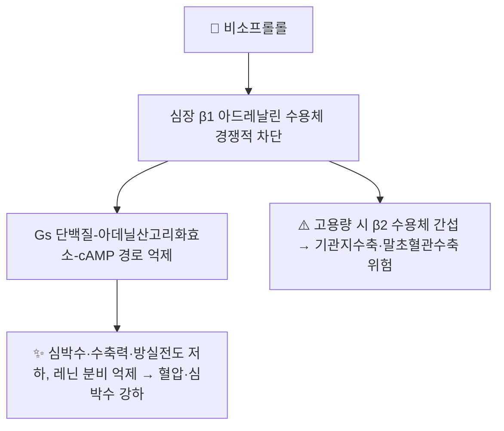

# 💊 [[비소프롤롤]] (Bisoprolol, 콩코르/Concor, ATC C07AB07)

> **핵심 3줄 요약 (Key Summary)**:
> 🧪 주성분·제형: 고도로 $\beta_1$ 선택적인 2세대 베타차단제. 국내는 비소프롤롤푸마르산염(fumarate) 정제(1.25/2.5/5/10mg)로 시판.
> 📍 작용 기전: 심장 $\beta_1$ 아드레날린 수용체를 경쟁적으로 차단해 심박수·심근 수축력·방실전도를 낮추고, 레닌 분비를 억제해 혈압을 낮춘다.
> 🎯 임상 적응증: 고혈압(2차 선택), 협심증, 만성 심부전(HFrEF) 표준치료 4대 약물 중 하나, 심방세동 심박수 조절, 심근경색 후 2차 예방.
> ⚠️ 주의사항: 서맥·방실차단·중증 천식에는 신중/금기. 급격한 중단 시 반동성 빈맥·협심증 악화(금단 현상) 주의 — 반드시 서서히 감량.
---

## 1. 약물 기본 정보 및 시판 제품 (Brand Identification)
> [!abstract]+ 🧪 3D 약리 분자 구조 (Interactive 3D Viewer)
> <iframe src="https://molecule-viewer-rho.vercel.app/?cid=2405" width="100%" height="450px" frameborder="0" allow="webgl" style="border-radius: 8px;"></iframe>

> 🖼️ **이미지 미확보** — 식약처 제품허가정보08·e약은요 API는 이 작업 환경(로컬 기기 쉘)에서 외부망에 접근할 수 없어 패키지·알약 성상 실사를 확보하지 못했다. 임의로 다른 약 사진을 대체하지 않고 생략한다(출처 가이드 제4원칙). 추후 네트워크 접근이 가능한 세션에서 보강 필요.

| 항목 | 상세 정보 |
| :--- | :--- |
| **일반명 (Generic Name)** | 비소프롤롤(푸마르산염) / Bisoprolol (fumarate) |
| **대표 상품명 (Brand Names)** | **콩코르(Concor)**, 비소프롤정, Zebeta(미국) |
| **ATC 코드 / 분류** | **C07AB07** — Beta blocking agents, selective, Bisoprolol |
| **PubChem CID** | [2405](https://pubchem.ncbi.nlm.nih.gov/compound/2405) |
| **화학식 / 분자량** | C₁₈H₃₁NO₄ (유리염기 기준) / 약 325.4 g/mol |
| **주요 제형 및 함량** | 필름코팅정 1.25mg·2.5mg·5mg·10mg (단일제), HCTZ 복합정 |
| **국내 허가 적응증(일반)** | 본태성 고혈압, 만성 안정형 협심증, 안정된 만성 심부전(β1 선택적 작용과 관련된 추가적 신경호르몬 길항작용에 의한 치료) |

### 1.1 대표 시판 제품 및 함유 복합제 매핑 (Brand Identification & Combinations)

| 구분 | 대표 제품명 / 브랜드 | 함유 성분 및 1회당 함량 | 제형 및 특징 | 주요 적응증 및 복약 지도 핵심 |
| :--- | :--- | :--- | :--- | :--- |
| **단일제 (ETC)** | [[콩코르]] | 비소프롤롤푸마르산염 1.25/2.5/5/10mg | 필름코팅정 | 반감기 10~12시간으로 **1일 1회 투여** 가능 |
| **복합 강압제 (ETC)** | 콩코르 플러스 계열 | 비소프롤롤 + [[히드로클로로티아지드]] | 정제 | 혈압 조절 상가 효과, 저칼륨혈증·탈수 모니터링 |
| **감별 다빈도 동일 계열** | 아테놀, 베타록, 셀로켄, 딜라트렌 | [[아테놀롤]], [[메토프롤롤]], [[카르베딜롤]] | 정제·서방정 | β1 선택성·반감기·간/신 대사 비율로 비소프롤롤과 감별(§3 참조) |

---

## 2. 분자 약리 기전 및 작용 경로 (Mechanism of Action)

* **주요 작용 기전 (Primary MoA)**:
  * 비소프롤롤은 심장에 풍부한 $\beta_1$ 아드레날린 수용체에 선택적으로 결합해 카테콜아민(에피네프린·노르에피네프린)의 자극을 경쟁적으로 차단한다. 다른 베타차단제 대비 $\beta_1$에 대해 $\beta_2$보다 약 **11~15배 더 선택적**인 것으로 보고되어, 치료 용량 범위에서 기관지·말초혈관의 $\beta_2$ 수용체 간섭이 상대적으로 적다.
  * 수용체 차단은 하류의 Gs단백질–아데닐산고리화효소(adenylate cyclase)–cAMP 경로 활성을 낮추어 L형 칼슘 채널을 통한 칼슘 유입을 감소시키고, 결과적으로 심박수·심근 수축력·방실결절 전도 속도를 저하시킨다.
* **하류 신호전달 및 생화학적 반응**:
  * 사구체 옆세포(juxtaglomerular cell)의 $\beta_1$ 수용체 차단을 통해 레닌 분비를 억제, 레닌-안지오텐신-알도스테론계(RAAS) 활성을 낮추는 것이 혈압 강하 기전의 또 다른 축이다.
  * 만성 심부전에서는 교감신경 과활성에 의한 심근 리모델링·부정맥 유발성을 장기적으로 완화해 예후를 개선하는 것으로 알려져 있다(§6 CIBIS-II 참조).

---

## 3. 약동학적 특성 (Pharmacokinetics: ADME)

| 약동학 파라미터 | 수치 및 임상적 의미 |
| :--- | :--- |
| **생체이용률 (Bioavailability, F)** | 약 88~90% (초회통과효과가 작아 경구 흡수율이 매우 높음 — 동일 계열 중 최상급) |
| **최고혈중농도 도달시간 (Tmax)** | 약 3~4시간 |
| **혈장 단백결합률 (Protein Binding)** | 약 30~35% |
| **간 대사 효소 (Metabolism)** | 간 대사(주로 CYP3A4, 일부 CYP2D6 관여)와 신장 미변화체 배설이 **약 50:50**으로 양분 — 간·신 기능 저하 환자 모두에서 비교적 안전한 축에 속함 |
| **배설 반감기 (Elimination t1/2)** | 약 10~12시간 — **1일 1회 투여**가 가능한 핵심 근거 |
| **주요 배설 경로 (Excretion)** | 신장 배설 우세(미변화체 비율 높음), 분변 배설 2% 미만 |

---

## 4. 용법·용량 및 처방 가이드 (Dosage & Administration)

| 임상 적응증 | 성인 표준 용법·용량 | 비고 |
| :--- | :--- | :--- |
| **본태성 고혈압** | 2.5~5mg 1일 1회로 시작, 필요 시 10mg까지 증량 | 최대 20mg/day(허가사항 범위 내 확인) |
| **만성 안정형 협심증** | 5~10mg 1일 1회 | 심박수 55~60회/분을 목표로 적정 |
| **만성 심부전(HFrEF)** | **1.25mg 1일 1회**로 시작 → 2주 이상 간격으로 2.5→3.75→5→7.5→10mg까지 단계적 증량 | CIBIS-II 프로토콜 기반. **저용량 시작·천천히 증량(start low, go slow)** 원칙 엄수 |

> ⚠️ 심부전 환자에서는 급성 비대상성 심부전(체액저류·저혈압) 상태에서 새로 시작하지 않는다. 안정화 후 시작하고, 증량 단계마다 서맥·저혈압·심부전 악화 징후를 확인한다.

---

## 5. 부작용, 경고 및 약물 상호작용 (Adverse Effects & Interactions)

### 5.1 주요 부작용 및 경고
* **서맥·방실차단**: 용량 의존적으로 심박수·방실전도를 낮추므로 2도 이상 방실차단, 동기능부전증후군에는 금기.
* **기관지수축**: $\beta_1$ 선택성이 높아 비선택적 베타차단제보다 위험이 낮지만, 고용량에서는 $\beta_2$ 간섭이 나타날 수 있어 **중증·불안정 천식에는 신중/금기**.
* **대사 영향**: 저혈당의 교감신경 경고 증상(떨림·심계항진)을 가릴 수 있어 당뇨병 환자에서 저혈당 자각이 늦어질 위험.
* **급격한 중단 금지**: 장기 복용 중 갑자기 끊으면 수용체 상향조절(up-regulation)로 인한 반동성 빈맥·고혈압·협심증 악화가 나타날 수 있어 **1~2주에 걸쳐 서서히 감량**한다.

### 5.2 주요 병용 금기 및 상호작용
* **비디히드로피리딘계 칼슘채널차단제**([[베라파밀]]·[[딜티아젬]])와 병용 시 서맥·방실차단·심장수축력 저하가 상가될 수 있어 신중 병용.
* **CYP3A4 억제제**(케토코나졸·클래리트로마이신 등): 비소프롤롤 혈중농도 상승 가능성.
* **인슐린·경구혈당강하제**와 병용 시 저혈당 징후(특히 교감신경 증상)가 가려질 수 있어 혈당 모니터링 강화.
* **NSAIDs**: 프로스타글란딘 매개 혈압 강하 효과를 상쇄하여 항고혈압 효과를 약화시킬 수 있음.

---

## 6. 한의 치료 연계 및 병용/테이퍼링 프로토콜 (Integrative Medicine)

### 6.1 한약·양약 병용 투여 안전성 및 시너지 배오
* **만성 심부전 표준치료 핵심축**: CIBIS-II 연구([PMID 10023943](https://pubmed.ncbi.nlm.nih.gov/10023943/), *Lancet* 1999)는 좌심실 수축기능 저하 심부전(NYHA III~IV) 환자에서 비소프롤롤이 위약 대비 **전체 사망률과 돌연사를 유의하게 낮췄다**고 보고한 대표적 무작위대조시험으로, 비소프롤롤이 현재까지도 HFrEF 4대 표준치료 약물(베타차단제·ACEi/ARNI·MRA·SGLT2억제제) 중 하나로 자리잡은 핵심 근거다.
* 한의 치료를 병행하는 환자에서는 **베타차단제 복용 사실 자체가 서맥·피로·수족냉증 등 한의학적 양허(陽虛) 유사 증상의 약인성 원인일 수 있음**을 감별하는 것이 우선이며, 임의로 온리약(부자·육계 등)을 강하게 병용하기보다 증상의 약인성 여부를 먼저 문진한다.

### 6.2 양약 감량 및 한의 전환(테이퍼링) 가이드
* 비소프롤롤은 심부전·부정맥 등에서 **생명과 직결된 예후 개선 근거(CIBIS-II)**가 확립된 약물이므로, 한의 치료 병행을 이유로 임의 감량·중단을 유도하지 않는다. 감량이 필요한 경우(과도한 서맥·피로 등 부작용) 반드시 처방 양방의와 공동 모니터링 하에 **점진적 테이퍼링**을 진행한다.

---

## 7. 💡 사용자 진료실 핵심 필기 & 실전 임상 체크리스트

> 🛡️ **Melt-In 원칙**: 원장님 기존 필기 없음 — 오늘 신규 생성 노트이므로 비워 둔다. 진료 중 메모가 쌓이면 이 섹션에 원문 그대로 보존한다.

### 7.1 진료실 3대 핵심 문진 체크리스트
1. **복용 목적 및 기저 심질환 확인**: 고혈압 단독인지, 협심증·심부전·부정맥 때문인지에 따라 임의 중단의 위험도가 크게 다르다(심부전·부정맥 적응증은 임의 중단 절대 금지).
2. **서맥·어지럼·피로 증상 확인**: 안정시 심박수 50회/분 미만, 기립성 어지럼이 있으면 처방의와 상의가 필요함을 안내.
3. **당뇨병 동반 여부**: 저혈당 자각 증상이 가려질 수 있음을 환자에게 반드시 교육.

### 7.2 환자 티칭 스크립트
> *"이 약은 심장이 과로하지 않도록 속도를 조절해주는 약으로, 혈압뿐 아니라 심장 자체를 보호하는 역할도 합니다. 임의로 끊으시면 오히려 심장에 반동이 와서 위험할 수 있으니, 저희 한의원 치료와 병행하시더라도 양약은 처방하신 선생님과 상의 없이 줄이지 않으시는 것이 중요합니다."*

---

## 8. 출처 및 학술 참고 문헌 (References)

1. **The Cardiac Insufficiency Bisoprolol Study II (CIBIS-II): a randomised trial**. CIBIS-II Investigators and Committees. ***Lancet***, 1999;353(9146):9-13. [PMID 10023943](https://pubmed.ncbi.nlm.nih.gov/10023943/)
   - **[연구 요약]**: 좌심실 수축기능 저하 심부전(NYHA III~IV) 2,647명 대상 RCT. 비소프롤롤군에서 위약 대비 전체 사망률 및 돌연사 유의하게 감소, 조기 종료된 양성 결과.
2. **Bisoprolol in the treatment of chronic heart failure**. *Clin Interv Aging* 등. [PMC2291328](https://pmc.ncbi.nlm.nih.gov/articles/PMC2291328/)
   - **[연구 요약]**: 만성 심부전에서 비소프롤롤의 작용 기전·임상 근거 종합 리뷰.
3. **Basic pharmacokinetics of bisoprolol, a new highly beta 1-selective adrenoceptor antagonist**. Leopold G, et al. *J Clin Pharmacol*, 1986. [PMID 2878941](https://pubmed.ncbi.nlm.nih.gov/2878941/)
   - **[연구 요약]**: 비소프롤롤의 $\beta_1$ 선택성·기초 약동학(생체이용률·반감기 등) 최초 보고 문헌.
4. **Wikipedia**. *Bisoprolol*. [en.wikipedia.org/wiki/Bisoprolol](https://en.wikipedia.org/wiki/Bisoprolol)
   - **[참고 자료]**: ATC 코드·PubChem CID·대략적 약동학 수치 교차 확인용(1차 학술 출처 아님, 공정서·논문과 교차검증 권장).
5. 식품의약품안전처 의약품안전나라(nedrug.mfds.go.kr) — 국내 허가사항은 이번 세션에서 네트워크 접근이 제한되어 직접 조회하지 못했다. **용법·용량 최대치, 정확한 국내 허가 적응증 문구는 추후 식약처 API 접근 가능 세션에서 재확인 필요.**
