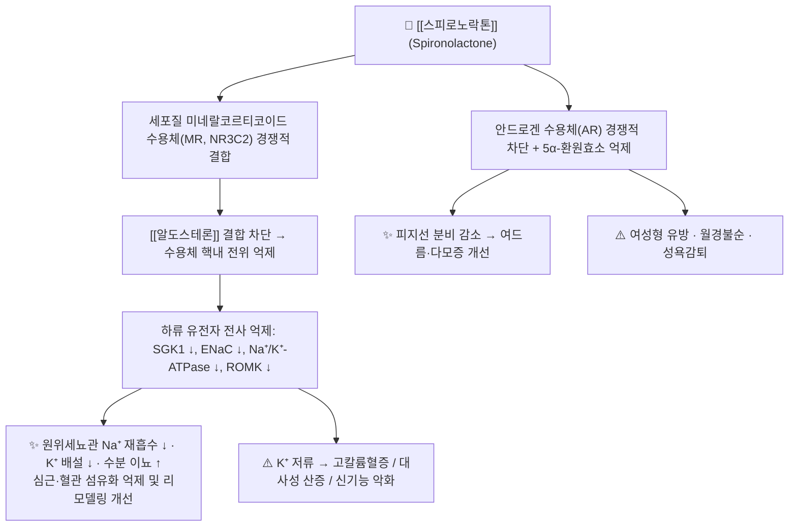

# 💊 [[스피로노락톤]] (Spironolactone, Aldactone, ATC C03DA01)

![[스피로노락톤_낱알.jpg|540]]
> [그림 1: ① 병태생리·영상 — 스피로노락톤_낱알]

> **핵심 3줄 요약 (Key Summary)**:
> 🧪 **주성분·제형**: [[스피로노락톤]](Spironolactone)은 스테로이드 골격(C24H32O4S, MW 416.57)을 가진 합성 스테로이드계 약물로, 17번 위치에 γ-락톤 고리와 7α-티오아세틸기를 갖는다. 대표 경구 제형은 12.5·20·25·50·100mg 정제이며, 국내에서는 [[알닥톤정]] 계열 브랜드와 다수의 제네릭이 유통된다.
> 📍 **작용 기전**: 원위세뇨관 및 집합관 주세포(principal cell)의 세포질 **미네랄코르티코이드 수용체(MR, NR3C2)** 에서 [[알도스테론]]과 경쟁적으로 결합을 차단하는 **경쟁적 길항제**다. 하류의 SGK1·ENaC·Na⁺/K⁺-ATPase 전사가 억제되어 Na⁺ 재흡수와 K⁺ 배설이 동시에 감소한다. 추가로 안드로겐 수용체 차단 및 5α-환원효소 억제 작용을 겸한다.
> 🎯 **임상 적응증**: 심부전(NYHA II–IV)의 부종·복수, 간경변성 복수, 신증후군 부종, 저항성 고혈압 및 원발성 알도스테론증의 진단·치료, 저칼륨혈증 보조. 최근에는 [[여드름]](acne) 및 여성 다모증·PCOS 영역에서 항안드로겐 목적의 응용이 재조명되고 있다.[^1]
> ⚠️ **주의사항**: **고칼륨혈증**이 가장 치명적인 부작용이며, [[ACE 억제제]]·[[ARB]]·칼륨 보충제·[[NSAIDs]] 병용 시 위험이 급증한다. 남성의 여성형 유방·유방통, 여성의 월경불순·성욕감퇴가 용량 의존적으로 나타나며, 임부에게는 항안드로겐 작용으로 인해 금기이다.

---

## 1. 약물 기본 정보 및 시판 제품 (Brand Identification)

> [그림 1: 식약처 의약품안전나라]

> [!abstract]+ 🧪 3D 약리 분자 구조 (Interactive 3D Viewer)
> <iframe src="https://molecule-viewer-rho.vercel.app/?cid=5833" width="100%" height="450px" frameborder="0" allow="webgl" style="border-radius: 8px;"></iframe>

| 항목 | 상세 정보 |
| :--- | :--- |
| **일반명 (Generic Name)** | [[스피로노락톤]](한글) / Spironolactone (English Generic Name) |
| **대표 상품명 (Brand Names)** | [[알닥톤]](Aldactone), [[알닥타지드]](Aldactazide, 복합제) 및 다수의 국내 제네릭 (※ YAML `aliases:`에 등록하여 위키링크 통합) |
| **ATC 코드 / 분류** | **C03DA01** — Aldosterone antagonists (Potassium-sparing diuretics, 이뇨제) / 식약처 분류: 이뇨제 |
| **PubChem CID** | [5833](https://pubchem.ncbi.nlm.nih.gov/compound/5833) |
| **화학식 / 분자량** | C₂₄H₃₂O₄S / 416.57 g/mol |
| **주요 제형 및 함량** | 정제(12.5mg, 20mg, 25mg, 50mg, 100mg), 복합정(스피로노락톤 + [[히드로클로로티아지드]]) ※ 제품별 함량 상이 |
| **식약처 허가 적응증** | ① 심부전·간경변·신증후군 등에 수반되는 부종 및 복수 ② 본태성 고혈압(특히 저항성·저레닌성) ③ 원발성 알도스테론증의 진단 및 치료 ④ 다른 이뇨제 투여로 인한 저칼륨혈증의 교정 보조 |

### 1.1 대표 시판 제품 및 함유 복합제 매핑 (Brand Identification & Combinations)

| 구분 | 대표 제품명 / 브랜드 | 함유 성분 및 1회당 함량 | 제형 및 특징 | 주요 적응증 및 복약 지도 핵심 |
| :--- | :--- | :--- | :--- | :--- |
| **단일제 (ETC)** | [[알닥톤정]] | [[스피로노락톤]] 단일 성분 (25mg, 50mg 등) | 속방성 필름코팅정 | 심부전·복수·고혈압의 표준 투여. **K⁺·크레아티닌 정기 추적 필수** |
| **복합 이뇨제 (ETC)** | [[알닥타지드]] | [[스피로노락톤]] + [[히드로클로로티아지드]](25/25mg 등) | 정제 | 티아지드 유발 저칼륨혈증을 스피로노락톤이 상쇄. 고칼륨혈증·탈수 감시 |
| **루프이뇨제 병용요법** | (성분 조합 운용) | [[스피로노락톤]] + [[푸로세미드]] | 각각 별도 정제로 병용 | 간경변 복수의 1차 병용. **K⁺ 균형이 상쇄되므로 수치 추적이 필수** |
| **감별 다빈도 일반약** | [[감초]] 함유 한방 제제·건강기능식품 | [[글리시리진]](glycyrrhizin) | 산제·엑스제·캔디류 | 11β-HSD2 억제로 **가성 알도스테론증**을 유발하여 스피로노락톤의 작용을 길항 → 복약력 청취 시 반드시 감별 |

---

## 2. 분자 약리 기전 및 작용 경로 (Mechanism of Action)

* **주요 작용 기전 (Primary MoA)**:
  * 스피로노락톤은 **스테로이드계 미네랄코르티코이드 수용체 길항제(MRA)** 이다. 원위세뇨관 말단부와 집합관의 주세포에서 세포질 내 MR에 결합하여, 생리적 리간드인 [[알도스테론]]의 결합을 **경쟁적으로** 방해한다. 이는 MR의 핵내 전위와 표적 유전자 전사를 차단하는 방식으로, 스피로노락톤 자체가 수용체를 활성화하지 않는 순수 길항제(pure antagonist)라는 점이 특징이다.
  * 차단되는 대표적 알도스테론 표적 유전자는 **SGK1**(serum/glucocorticoid-regulated kinase 1), 상피성 나트륨 채널 **ENaC**, 기저측막 **Na⁺/K⁺-ATPase**, 그리고 K⁺ 분비를 담당하는 **ROMK** 채널이다. 이들의 전사가 억제되면 루멘측 Na⁺ 재흡수와 이에 따른 전기화학적 구배가 사라지면서 K⁺ 및 H⁺ 분비가 동반 감소한다.[^2]
  * 결과적으로 **나트륨 이뇨(natriuresis) 증가, 칼륨 저류, 수소이온 분비 감소에 따른 경증 대사성 산증**이 나타난다. 혈압 강하 효과는 단순 이뇨를 넘어 혈관 평활근의 MR 차단, 혈관 내피 기능 개선 및 교감신경 활성 억제가 복합적으로 관여하는 것으로 설명된다.
  * 심부전 영역에서의 재평가("spironolactone renaissance")는 스피로노락톤이 단순 이뇨제를 넘어 **심근 섬유화 억제와 심실 리모델링 개선**이라는 질환 조절(disease-modifying) 효과를 갖는다는 인식에서 비롯되었다.[^4]
  * **항안드로겐(antiandrogenic) 기전**: 스피로노락톤 및 그 대사체는 안드로겐 수용체를 경쟁적으로 차단하고 5α-환원효소 활성을 억제하여 DHT 생성과 피지선 분비를 감소시킨다. 여드름·다모증·PCOS 영역에서의 응용은 이 기전에 근거하며, 최근 실전 임상 전략이 정리되었다.[^1]
* **하류 신호전달 및 생화학적 반응**:
  * ENaC 차단 → 루멘 내 Na⁺ 잔류 → 삼투성 수분 배설 증가 → 세포외액량 감소 → 혈압 및 부종 개선.
  * Na⁺/K⁺-ATPase 억제 → 기저측막 K⁺ 이동 감소 → 혈청 K⁺ 상승.
  * H⁺-ATPase 및 H⁺/K⁺-ATPase 활성 저하 → 요중 산 배설 감소 → 고칼륨성 대사성 산증(hyperkalemic metabolic acidosis).
  * 심근·혈관 섬유아세포의 MR 자극 차단 → 콜라겐 축적 및 섬유화 감소.

---

## 3. 약동학적 특성 (Pharmacokinetics: ADME)

> ⚠️ 아래 수치는 일반 약리학 교과서 및 제품 허가사항에 기반한 통상치이며, **주어진 6편의 참고 논문에서는 약동학 파라미터를 직접 확인할 수 없다(근거 미확인)**. 개별 환자의 수치 해석 시에는 제품 허가사항과 최신 임상 참고문헌을 재확인해야 한다.

| 약동학 파라미터 | 수치 및 임상적 의미 |
| :--- | :--- |
| **생체이용률 (Bioavailability, F)** | 약 90% 수준(경구 흡수 양호). **음식과 함께 복용 시 흡수 및 생체이용률이 증가**하므로 식후 투여가 권장된다. 초회통과효과는 크지 않다. |
| **최고혈중농도 도달시간 (Tmax)** | 모체 화합물 약 1~2시간, 활성대사체 [[칸레논]](canrenone) 약 2~4시간 (제형·식이 상태에 따라 변동) |
| **혈장 단백결합률 (Protein Binding)** | 90% 이상, 주로 **알부민** 결합. 저알부민혈증(간경변·신증후군) 환자에서는 유리형 비율이 증가할 수 있다. |
| **간 대사 효소 (Metabolism)** | 간에서 광범위하게 대사된다. **CYP3A4** 및 flavin-containing monooxygenase(FMO) 계열이 관여하며, 디티오아세틸화(dethioacetylation)로 **[[칸레논]]**, 7α-티오메틸스피로락톤(7α-TMS), 6β-하이드록시-7α-티오메틸스피로락톤 등 **활성 대사체**를 생성한다. |
| **배설 반감기 (Elimination t1/2)** | 모체 약 1.4시간(짧음)이나, 활성 대사체(칸레논 등)는 약 10~35시간으로 **실질적인 작용 지속시간은 대사체가 결정**한다. 신장애·간장애 시 연장될 수 있다. |
| **주요 배설 경로 (Excretion)** | 대사체 형태로 **담즙을 통한 분변 배설** 및 **소변 배설**이 모두 이루어지며, 미변화체로 배설되는 양은 소량이다. |

* **임상적 함의**: 반감기가 짧은 모체가 아니라 장시간 지속되는 활성 대사체가 효과를 유지하므로 **1일 1~2회 투여로 충분**하다. 동시에 대사체 축적은 신기능·간기능 저하 환자에서 고칼륨혈증 위험을 장시간 지속시킨다는 의미이므로, 이 군에서는 저용량에서 시작하고 감시 간격을 좁혀야 한다.

---

## _의학/04_임상 용법·용량 및 처방 가이드 (Dosage & Administration)

> 아래 용량은 적응증별 통상 범위이며, 실제 처방은 환자의 신기능(eGFR)·혈청 K⁺·동반 약물에 따라 개별화해야 한다.

| 임상 적응증 | 성인 표준 용법·용량 | 1일 최대 한도 용량 |
| :--- | :--- | :--- |
| **심부전 (부종·리모델링 개선)** | 저용량으로 시작하여 단계적 증량 (예: 12.5~25mg 1일 1회 → 필요 시 50mg) | 50mg/day 내외 (고용량은 고칼륨혈증 위험) |
| **간경변성 복수·부종** | 100mg/day로 시작, 반응에 따라 증량하며 [[푸로세미드]]와 병용하는 경우가 많다 | 400mg/day |
| **신증후군·심장성 부종** | 25~100mg 1일 1~2회, 식후 투여 | 200mg/day 내외 |
| **저항성 고혈압 / 본태성 고혈압** | 25~100mg 1일 1회 또는 2회 분복 | 100mg/day (통상) |
| **원발성 알도스테론증 (진단 및 치료)** | 100~400mg/day 분복 (진단 목적의 검사 프로토콜은 별도) | 400mg/day |
| **여드름·다모증 (off-label, 항안드로겐)** | 통상 50~100mg/day 범위가 사용되나, **시작 용량·증량 속도·감량 전략 등 세부 프로토콜은 제공된 논문(PMID 40875941)의 원문에서 확인해야 한다(본 노트에서는 서지 수준까지만 확인됨)** | 근거 미확인 |

* **투여 시 실무 원칙**:
  1. **식후 투여** — 흡수 증가 및 위장관 불내성 완화.
  2. 저용량 시작·서서히 증량(titration) — 특히 고령자, 당뇨병, CKD 환자.
  3. 투여 시작 후 **1주 이내 및 용량 변경 시마다 혈청 K⁺·크레아티닌 측정**.
  4. 야간 이뇨를 피하기 위해 **아침 또는 이른 오후** 투여가 권장된다(야뇨증 예방).

---

## 5. 부작용, 경고 및 약물 상호작용 (Adverse Effects & Interactions)

### 5.1 주요 부작용 및 독성 경고 (Black Box Warnings)

* **고칼륨혈증(hyperkalemia) — 최대 위험**:
  * 기전은 명확하다. 원위세뇨관 K⁺ 분비가 차단되므로, 신기능 저하(eGFR 감소), 당뇨병, 고령, ACE 억제제·ARB·칼륨 보충제 병용 시 혈청 K⁺가 치명적으로 상승할 수 있다. 심각한 고칼륨혈증은 **치명적 부정맥 및 심정지**로 이어질 수 있어, 이 약의 안전성 관리는 곧 K⁺ 관리라고 요약할 수 있다.
* **신기능 악화 및 전해질 이상**:
  * 과도한 이뇨로 인한 탈수·저나트륨혈증·기립성 저혈압, 그리고 고칼륨혈증에 동반된 **대사성 산증**이 나타날 수 있다. 혈중 요소질소(BUN)·크레아티닌 상승이 관찰되면 감량 또는 중단을 고려한다.
* **내분비계 부작용(용량 의존적)**:
  * **남성**: 여성형 유방(gynecomastia), 유방통, 성욕감퇴, 발기부전. 항안드로겐 기전에 직접 기인하며 용량이 높을수록 빈도가 증가한다.
  * **여성**: 월경불순, 월경통, 유방 압통, 다모증, 음성 변화(드물게).
* **발암성 관련 경고**:
  * IARC(1980) 평가 문헌에서 스피로노락톤의 **설치류 발암성** 문제가 검토된 바 있으며, 랫트에서의 종양 발생 소견이 보고되었다.[^3] 다만 인체에서의 발암 위험성은 확립되지 않았으며, 임상적 유익성이 위험을 상회하는 경우 투여가 유지된다. 장기 고용량 투여 시에는 이 점을 환자와 상의하고 불필요한 고용량 유지를 피한다.
* **기타**:
  * 위장관 불내성(오심, 설사, 위경련), 졸음, 두통, 피부 발진, 드물게 혈액학적 이상.
* **금기 및 고위험군**:
  * 고칼륨혈증, 무뇨 또는 급성 신부전, 중증 신장애, 애디슨병(Addison disease), 중증 간기능 저하, **임신(항안드로겐 작용으로 인한 태아 남성화 장애 위험)**, 다른 칼륨보존성 이뇨제 또는 칼륨 보충제와의 병용.

### 5.2 주요 병용 금기 및 상호작용

| 병용 약물군 | 상호작용 기전 | 임상적 결과 및 대응 |
| :--- | :--- | :--- |
| [[ACE 억제제]], [[ARB]], [[ARNI]] | 알도스테론 차단 작용의 중복 + 신장 K⁺ 배설 저하 | **고칼륨혈증 위험 급증**. 심부전에서는 표준 병용이지만 최저 용량·면밀한 K⁺ 추적이 전제된다. |
| 칼륨 보충제, KCl 함유 수액 | K⁺ 부하 중복 | 중증 고칼륨혈증 유발 가능 → 원칙적 금기 |
| 기타 칼륨보존성 이뇨제([[아밀로라이드]], [[트리암테렌]], [[에플레레논]]) | 동일 계열 중복 | 고칼륨혈증 위험 → 중복 투여 회피 |
| [[NSAIDs]] | 프로스타글란딘 매개 신혈류 감소, Na⁺ 저류 | 이뇨·강압 효과 감소, 고칼륨혈증·급성 신손상 위험 증가 |
| [[디곡신]] | 신세뇨관 배설 경쟁 | 디곡신 혈중농도 상승 → 디곡신 독성(구역, 시야 이상, 부정맥) 모니터링 |
| [[리튬]] | 신장 리튬 배설 감소 | 리튬 독성 위험 → 혈중농도 추적 |
| 코르티코스테로이드, [[ACTH]] | K⁺ 배출 촉진 | 저칼륨혈증으로 이 약의 효과가 상쇄될 수 있음 |
| CYP3A4 강력 저해제([[케토코나졸]], [[클래리트로마이신]] 등) | 대사 저해로 대사체 농도 상승 | 효과·독성 증대 가능 |
| [[콜레스티라민]] | 위장관 흡착 | 스피로노락톤 흡수 저해 → 2시간 이상 시간차 투여 |
| 감초 함유 제품 | 글리시리진의 11β-HSD2 억제 → 코르티솔의 MR 활성화 | **가성 알도스테론증**으로 스피로노락톤 효과 길항 및 저칼륨혈증·부종 악화 |

---

## 6. 한의 치료 연계 및 병용/테이퍼링 프로토콜 (Integrative Medicine)

### 6.1 한약·양약 병용 투여 안전성 및 시너지 배오

* **간·신 대사 간섭 완충 처방**: 스피로노락톤은 CYP3A4 등 간 대사를 거치고 대사체의 반감기가 길어 축적성이 있으므로, 한약 처방과의 병용 시 **최소 1~2시간의 시간차 투여**를 원칙으로 한다. 다만 시간차만으로 고칼륨혈증 위험이 해소되는 것은 아니므로, 병용 시작 후 1~2주 내 혈청 K⁺·크레아티닌을 반드시 재측정한다.
* **핵심 길항·주의 배합 — [[감초]]**: 감초의 [[글리시리진]]은 신장의 11β-HSD2를 억제하여 코르티솔이 MR을 자극하도록 만든다. 이는 임상적으로 **가성 알도스테론증(pseudoaldosteronism)** 을 유발하여 Na⁺·수분 저류, 부종, 고혈압, 저칼륨혈증을 초래한다. 결과적으로 스피로노락톤의 이뇨·강압 효과를 **정면으로 상쇄**할 수 있으므로, 스피로노락톤 복용 환자에게 감초 함유 처방([[작약감초탕]], [[감초사심탕]] 등)이나 감초 함유 건강기능식품을 병용할 때는 특별한 주의가 필요하다.
* **이뇨 작용 한약과의 병용**: [[오령산]], [[저령탕]], [[목방기탕]] 등 이뇨 처방을 병용하면 이뇨 효과가 가산되어 탈수·저나트륨혈증·기립성 저혈압이 나타날 수 있다. 반대로 이들 처방 자체가 전해질 균형에 영향을 주므로, 병용 시에는 **양약 용량을 임의로 올리지 말고**, 체중·혈압·전해질을 주 단위로 추적한다.
* **신독성 본초 감별**: [[목통]](關木通) 등 aristolochic acid 함유 본초는 신장 손상 위험이 있어, 이미 신기능이 저하된 심부전·CKD 환자에서는 사용을 피한다. 신기능 악화는 곧 고칼륨혈증의 직접적 위험 인자이므로, 한의 처방 단계에서부터 신장 안전성을 최우선으로 검토한다.
* **상승 배오 (Synergy) 관점**: 심부전·부종 환자에서 스피로노락톤의 용량을 늘리는 대신, [[보중익기탕]] 계열이나 [[진무탕]] 계열로 심기능·수분 대사를 보조하고 침·약침으로 혈류와 자율신경 균형을 조정함으로써, **양약 용량을 증량하지 않고도 증상 조절을 유지**하는 전략이 임상적으로 시도된다. 단, 이 전략의 근거 수준은 개별 임상 보고에 한정되며 대규모 무작위 대조시험으로 확립되어 있지 않다.

### 6.2 양약 감량 및 한의 전환(테이퍼링) 가이드

* **감량 원칙**: 심부전, 간경변 복수, 원발성 알도스테론증에서의 스피로노락톤은 **질환 조절 약물**이므로, 한의 치료를 병행하더라도 **환자 임의 중단·급격한 감량은 금기**이다. 급격한 중단은 복수·부종의 재축적 및 심부전 악화를 초래할 수 있다.
* **감량 프로토콜(개념적 틀)**:
  1. 한의 치료(침·한약) 병행 후 4~8주간 증상·체중·부종·혈압의 안정성을 평가한다.
  2. 안정이 확인되면 **주치의(순환기·소화기·내분비)와 반드시 협의**하여 25mg 단위(또는 최소 유효 단위)로 감량한다.
  3. 감량 시기마다 혈청 K⁺·크레아티닌·혈압을 측정하며, 감량 후 1~2주 내 재평가한다.
  4. 감량 중 부종·호흡곤란·체중 증가(2~3일 내 1kg 이상)가 나타나면 즉시 원 용량으로 복귀한다.
  5. 여드름 등 미용 목적의 off-label 사용에서는 상대적으로 감량이 용이하나, 이 경우에도 **재발률을 낮추기 위한 유지 용량 및 감량 전략이 별도로 정리되어 있으므로 원문 지침을 확인**해야 한다.[^1]

---

## 7. 💡 사용자 진료실 핵심 필기 & 실전 임상 체크리스트

### 7.1 진료실 3대 핵심 문진 체크리스트

1. **복용 중인 심혈관·신장 관련 약물 확인**: [[ACE 억제제]], [[ARB]], [[ARNI]], 칼륨 보충제, 다른 칼륨보존성 이뇨제([[에플레레논]], [[아밀로라이드]], [[트리암테렌]]) 및 [[NSAIDs]](일반약 포함) 병용 여부를 반드시 확인한다. 이 조합은 고칼륨혈증의 대표적 위험 조합이다.
2. **최근 혈청 K⁺·크레아티닌/eGFR 검사치 확인**: 고령, 당뇨병, 만성콩팥병(CKD), 탈수 상태는 고칼륨혈증의 주요 위험 인자다. 검사치가 없거나 3개월 이상 경과했다면 재검을 권고한다.
3. **증상 호전도 및 특징적 부작용 모니터링**: 남성의 **여성형 유방·유방통·성욕감퇴**, 여성의 **월경불순·유방 압통**은 용량 의존적이며 복약 순응도를 떨어뜨리는 주된 원인이다. 또한 어지럼·기립성 저혈압, 근육 경련, 피로감 등 전해질 이상을 시사하는 증상을 문진한다.
4. **보충제·한방 제품 복용력 청취**: [[감초]] 함유 제품, 칼륨 함량이 높은 보충제(예: 칼륨염, 일부 전해질 음료) 복용 여부를 확인한다. 감초는 스피로노락톤의 작용을 길항하는 대표적 요인이다.
5. **가임기 여성의 임신 가능성 확인**: 항안드로겐 작용으로 인해 임신 중 사용은 금기이다. 여드름·다모증 목적으로 복용하는 젊은 여성에서는 임신 계획 여부를 반드시 문진한다.

### 7.2 환자 티칭 스크립트

> *"환자분, 지금 드시는 이 약은 몸속에서 '알도스테론'이라는 호르몬의 작용을 막아서 물을 빼주고 심장과 간에 부담을 줄여주는 약입니다. 다만 이 약은 소변으로 칼륨이 빠져나가는 것을 막기 때문에, 몸속 칼륨이 너무 높아질 수 있습니다. 그래서 다른 혈압약이나 진통소염제, 칼륨 보충제를 함께 드시면 위험할 수 있고, 감초가 들어간 한방 제제나 차도 이 약의 효과를 떨어뜨릴 수 있습니다. 드시기 전에 꼭 저에게 알려주세요. 그리고 이 약을 드시는 동안에는 정기적으로 피검사로 칼륨과 신장 기능을 확인해야 합니다. 저희 한의원에서는 침과 한약으로 부종과 심장 부담을 함께 관리하면서, 양약은 주치의 선생님과 상의해 필요한 만큼만 서서히 조절해 나가도록 도와드리겠습니다. 임의로 끊으시면 복수나 부종이 다시 심해질 수 있으니 절대 스스로 중단하지 마세요."*

---

## 8. 출처 및 학술 참고 문헌 (References)

* Ershadi S, Barbieri JS. Spironolactone for Acne: Practical Strategies for Optimal Clinical Outcomes. *Cutis*. 2025. PMID: [40875941](https://pubmed.ncbi.nlm.nih.gov/40875941/)
  * `[연구 요약]` 여드름 치료에서의 스피로노락톤 활용 전략(환자 선택, 용량 설정, 임상 결과 최적화)을 다룬 실전 지침 성격의 문헌. 본 노트에서는 제목 수준의 서지 정보만 확인되었으며, 구체적 용량·감량 프로토콜 수치는 원문 확인이 필요하다.
* Ochs HR, Greenblatt DJ. Spironolactone. *Am Heart J*. 1978. PMID: [356569](https://pubmed.ncbi.nlm.nih.gov/356569/)
  * `[연구 요약]` 스피로노락톤의 초기 약리학·임상 응용을 정리한 고전적 종설. 스테로이드계 MRA의 기본 작용 원리와 임상 사용의 원형을 제공한다.
* IARC Working Group. Spironolactone. *IARC Monogr Eval Carcinog Risk Chem Hum*. 1980. PMID: [7009396](https://pubmed.ncbi.nlm.nih.gov/7009396/)
  * `[연구 요약]` 스피로노락톤의 발암성 평가 문헌. 설치류에서의 종양 발생 소견을 검토하였으며, 인체 발암 위험성은 확립되지 않았다.
* Doggrell SA, Brown L. The spironolactone renaissance. *Expert Opin Investig Drugs*. 2001. PMID: [11322868](https://pubmed.ncbi.nlm.nih.gov/11322868/)
  * `[연구 요약]` 심부전 및 심혈관 질환에서 스피로노락톤의 위상이 재평가되는 흐름("renaissance")을 정리한 종설로, 이뇨 효과를 넘어선 심근 리모델링·섬유화 개선 기전을 논한다.
* Yao L, Liang X, et al. Non-steroidal mineralocorticoid receptor antagonist finerenone ameliorates mitochondrial dysfunction via PI3K/Akt/eNOS signaling pathway in diabetic tubulopathy. *Redox Biol*. 2023. PMID: [37924663](https://pubmed.ncbi.nlm.nih.gov/37924663/)
  * `[연구 요약]` 비스테로이드계 MRA인 [[피네레논]]이 PI3K/Akt/eNOS 신호경로를 통해 당뇨병성 세뇨관병증의 미토콘드리아 기능장애를 개선함을 보고한 연구. 스테로이드계 MRA(스피로노락톤)와의 기전적 차별점 및 계열 약물의 발전 방향을 이해하는 데 참고된다.
* Kolkhof P, Delbeck M, et al. Finerenone, a novel selective nonsteroidal mineralocorticoid receptor antagonist protects from rat cardiorenal injury. *J Cardiovasc Pharmacol*. 2014. PMID: [24621652](https://pubmed.ncbi.nlm.nih.gov/24621652/)
  * `[연구 요약]` 비스테로이드계 선택적 MRA 피네레논이 랫트 심장·신장 손상을 보호함을 보인 전임상 연구. 스피로노락톤의 내분비계 부작용(여성형 유방 등)을 줄이기 위한 비스테로이드계 MRA 개발의 배경을 설명한다.
* 식품의약품안전처 의약품안전나라 의약품통합정보시스템 (https://nedrug.mfds.go.kr)
  * `[연구 요약]` 국내 허가 의약품의 품목기준코드, 허가사항, 용법·용량 및 부작용 안전성 정보. 본 노트 상단 이미지의 출처 자료.

> 📌 **편집 주의사항(Editor's Note)**
> - 본 노트의 약동학 수치(생체이용률, Tmax, 단백결합률, 반감기 등)는 제공된 6편의 논문에서 직접 확인되지 않아 **일반 약리학 지식에 기반한 통상치**이며, 해당 항목은 본문에 `근거 미확인` 취지로 명시하였다.
> - 국내 시판 브랜드명과 제네릭 목록은 허가 정보에 따라 변동되므로 처방 전 식약처 의약품안전나라에서 최신 품목 정보를 재확인한다.
> - 여드름 적응증의 세부 용량·감량 프로토콜은 제공된 논문의 초록/서지 수준에서만 확인되었으므로, 실제 처방 시 원문을 확인해야 한다.

[^1]: Ershadi S, Barbieri JS. *Cutis*. 2025. PMID: 40875941
[^2]: Ochs HR, Greenblatt DJ. *Am Heart J*. 1978. PMID: 356569
[^3]: IARC Monogr Eval Carcinog Risk Chem Hum. 1980. PMID: 7009396
[^4]: Doggrell SA, Brown L. *Expert Opin Investig Drugs*. 2001. PMID: 11322868

<!-- 보관 태그(1회용·링크오류, 필요시 복원): 이뇨제/알도스테론 길항제, 스피로노락톤, 알도스테론 길항제, 고칼륨혈증 -->
