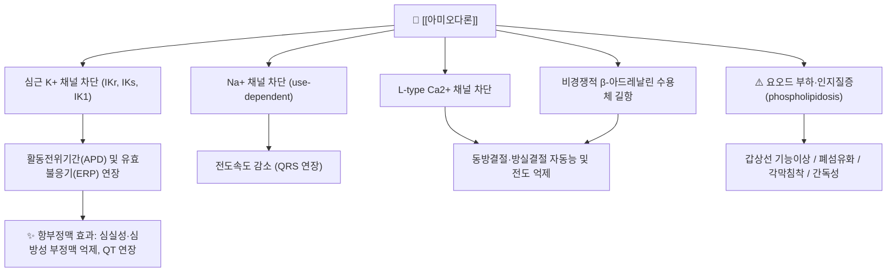

# 💊 [[아미오다론]] (Amiodarone, Cordarone, ATC C01BD01)

![[아미오다론_4.jpg|540]]
> [그림 1: ① 병태생리·영상 — Electrocardiogram (ECG) with slow junctional ectopic tachycardia (JET). This ECG, obtained after the administration of <]

![[아미오다론_낱알.jpg|540]]
> [그림 1: ① 병태생리·영상 — 아미오다론_낱알]

> **핵심 3줄 요약 (Key Summary)**:
> 🧪 주성분·제형: [[아미오다론]]은 벤조퓨란(benzofuran) 골격에 **요오드 2원자**를 함유한 고친유성(highly lipophilic) 항부정맥제로, 경구용 정제(대표적으로 200 mg)와 정맥주사제(150 mg/3 mL 앰플)로 시판된다. 분자량이 크고 지용성이 매우 높아 지방조직·간·폐·각막 등에 광범위하게 축적된다.
> 📍 작용 기전: 심근세포의 **칼륨(K⁺) 채널 차단**(주로 IKr, IKs)을 통한 활동전위기간(APD) 및 불응기 연장이 주 기전(Class III)이며, 이에 더해 나트륨(Na⁺) 채널·칼슘(Ca²⁺) 채널 차단과 비경쟁적 **β-아드레날린 수용체 길항** 작용을 겸하는 다중이온채널 차단제(multichannel blocker)이다.
> 🎯 임상 적응증: 생명을 위협하는 [[심실빈맥]]·[[심실세동]]의 치료 및 재발 방지, 그리고 [[심방세동]]·[[심방조동]]의 리듬 조절(율동전환 후 재발 억제 포함)에 사용된다. 구조적 심질환·심부전 환자에서도 비교적 안전하게 쓸 수 있는 항부정맥제로 위치한다.
> ⚠️ 주의사항: 반감기가 수십 일에 달해 **축적독성**이 핵심 위험이며, [[폐섬유화]](폐독성), [[갑상선기능저하증]]/[[갑상선기능항진증]](요오드 부하), 간독성, 각막 미세침착, 광과민성 및 청회색 피부변색, 말초신경병증이 대표적이다. CYP3A4·CYP2C9·CYP2D6 및 P-당단백질 억제로 인한 **광범위한 약물상호작용**이 있어 [[와파린]], [[디곡신]], 스타틴 병용 시 용량 조정과 모니터링이 필수다.

---

## 1. 약물 기본 정보 및 시판 제품 (Brand Identification)

> [그림 1: 식약처 의약품안전나라]
> [!abstract]+ 🧪 3D 약리 분자 구조 (Interactive 3D Viewer)
> <iframe src="https://molecule-viewer-rho.vercel.app/?cid=2157" width="100%" height="450px" frameborder="0" allow="webgl" style="border-radius: 8px;"></iframe>

| 항목 | 상세 정보 |
| :--- | :--- |
| **일반명 (Generic Name)** | [[아미오다론]](한글) / Amiodarone (English Generic Name) |
| **대표 상품명 (Brand Names)** | **코다론(Cordarone)**, 파세론(Pacerone), 국내 다수의 아미오다론 제네릭 정제 (※ YAML `aliases:`에 필수 등록하여 위키링크 통합) |
| **ATC 코드 / 분류** | **C01BD01** — Class III 항부정맥제(Vaughan-Williams 분류). 국내 식약처 품목분류 코드는 **근거 미확인**(허가사항 원문으로 확인 필요) |
| **PubChem CID** | [2157](https://pubchem.ncbi.nlm.nih.gov/compound/2157) |
| **화학식 / 분자량** | C₂₅H₂₉I₂NO₃ / **645.31 g/mol**(유리염기 기준). 염산염(amiodarone HCl)은 681.77 g/mol |
| **주요 제형 및 함량** | 경구 정제 **200 mg**(국내 주력), 일부 해외 100 mg 정; 정맥주사 **150 mg/3 mL** 앰플(희석 후 점적 주입) |
| **식약처 허가 적응증** | 생명을 위협하는 심실성 부정맥(심실세동, 심실빈맥)의 치료 및 재발 방지, 심방세동·심방조동 등 상심실성 부정맥의 재발 방지 — 특히 다른 항부정맥제가 무효하거나 사용할 수 없는 경우. (※ 세부 문구는 품목별 허가사항 확인) |

### 1.1 대표 시판 제품 및 함유 복합제 매핑 (Brand Identification & Combinations)

| 구분 | 대표 제품명 / 브랜드 | 함유 성분 및 1회당 함량 | 제형 및 특징 | 주요 적응증 및 복약 지도 핵심 |
| :--- | :--- | :--- | :--- | :--- |
| **단일제 (ETC 전문의약품)** | [[코다론정]], 파세론정, 국내 제네릭 아미오다론정 | [[아미오다론]]염산염 200 mg | 속방성 경구정, 반감기 극히 길어 1일 1회 투여 가능 | 부하기→유지기 용량 체계 준수, 갑상선·간·폐 정기검사 안내 |
| **주사제 (ETC, 응급/중환자)** | 코다론주 등 | [[아미오다론]]염산염 150 mg/3 mL | 정맥 점적 전용(생리식염수 또는 5% 포도당 250 mL에 희석) | 급성 심실성 부정맥·심정지 ACLS 프로토콜, 급속 주입 시 저혈압 주의 |
| **복합제 여부** | — | — | **단일 성분 제제만 존재** | 아미오다론을 함유한 복합제는 국내외 시판 확인되지 않음(근거 미확인) |
| **감별 다빈도 약물** | [[소타롤]](소탈롤), [[리도카인]], [[디곡신]] | Class III / Class IB / 강심제 | 경구정, 주사제 | 항부정맥제 간 병용·교체 시 QT 및 심박수 모니터링, 성분 중복 감별 |

---

## 2. 분자 약리 기전 및 작용 경로 (Mechanism of Action)

* **주요 작용 기전 (Primary MoA)**:
  * **K⁺ 채널 차단(Class III 주 기전)**: 지연정류 칼륨전류(IKr, IKs) 및 내향정류 전류(IK1)를 억제하여 심근세포 재분극을 지연시킨다. 그 결과 활동전위기간(APD)과 유효불응기(ERP)가 연장되어 회귀성(reentry) 부정맥의 유도가 억제된다(PMID: 6368644).
  * **Na⁺ 채널 차단(Class I 성격)**: 빠른 심박수에서 결합이 증가하는 use-dependent 차단 특성을 보여, 빈맥 시 전도속도를 선택적으로 감소시킨다.
  * **Ca²⁺ 채널 차단(Class IV 성격)**: L-type 칼슘전류를 억제하여 동방결절 자동능 및 방실결절 전도를 감소시킨다.
  * **β-아드레날린 차단(Class II 성격)**: 비경쟁적·비선택적 β차단 효과를 겸하여 카테콜아민 유발 부정맥을 억제한다.
  * 요약하면 아미오다론은 **Vaughan-Williams I·II·III·IV 성질을 모두 겸하는 다중이온채널 차단제**로, 단일 계열 분류로는 Class III에 배속된다(PMID: 6368644).
* **하류 신호전달 및 생화학적 반응**:
  * 재분극 지연 → 세포막전위 회복 지연 → **QT 간격 연장**(임상적으로 QT prolongation으로 관찰).
  * 요오드 함유 구조(분자당 요오드 2원자, 중량비 약 37%) → 대사 과정에서 요오드가 유리되어 **갑상선 호르몬 합성 기질을 과잉 공급** → 갑상선기능저하 또는 항진의 양방향 이상 유발(정확한 발생률 수치는 본 노트에서 근거 미확인).
  * 고친유성 특성 → 세포 내 리소좀 인지질 축적(phospholipidosis) → 폐포대식세포·각막·간세포 등에 미세과립 축적.

---

## 3. 약동학적 특성 (Pharmacokinetics: ADME)

| 약동학 파라미터 | 수치 및 임상적 의미 |
| :--- | :--- |
| **생체이용률 (Bioavailability, F)** | **약 50% 내외**(문헌에 따라 22~86%로 개체차 매우 큼). 경구 흡수는 느리고 불규칙하며, 지용성이 높아 식이(지방)에 따라 변동될 수 있다. 초회통과효과는 상대적으로 작은 편이나 정맥 투여 시 100%로 간주한다. |
| **최고혈중농도 도달시간 (Tmax)** | 경구 투여 후 **약 3~7시간**(속방정 기준). 임상적으로 항부정맥 효과 발현에는 수일~수주가 소요된다. |
| **혈장 단백결합률 (Protein Binding)** | **약 96%**(주로 알부민 결합). |
| **간 대사 효소 (Metabolism)** | 주로 **CYP3A4**(일부 CYP2C8)에 의해 N-탈에틸화되어 **N-데스에틸아미오다론(N-desethylamiodarone)**으로 전환된다. 이 대사체는 모약물과 유사한 활성을 지니며 축적되어 독성에 기여하는 것으로 알려져 있다. |
| **배설 반감기 (Elimination t1/2)** | **매우 김 — 통상 40~55일** 범위로 보고되며, 장기 투여 후에는 수개월까지 연장될 수 있다. 이 때문에 효과 소실 및 부작용 회복이 모두 지연된다. |
| **주요 배설 경로 (Excretion)** | 주로 **담즙을 통한 변 배설**이며, 신장 배설은 극히 미미하다(소변 내 미변화체 배설은 1% 미만으로 알려짐). 신기능 저하 시 용량 조정 필요성은 낮으나, **간기능 저하 시 축적 위험**이 증가한다. |

---

## _의학/04_임상 용법·용량 및 처방 가이드 (Dosage & Administration)

| 임상 적응증 | 성인 표준 용법·용량 | 1일 최대 한도 용량 |
| :--- | :--- | :--- |
| **생명을 위협하는 심실성 부정맥 — 경구(부하 후 유지)** | 부하 800~1,600 mg/day를 수일~1~3주 → 감량기 600~800 mg/day 1개월 → **유지 200~400 mg/day** 1일 1~2회 | 부하기 최대 1,600 mg/day (지침·품목별 차이 있음) |
| **생명을 위협하는 심실성 부정맥 — 정맥(급성기)** | 150 mg을 10분간 점적 → 이후 360 mg을 6시간 → 540 mg을 18시간 → **유지 0.5 mg/min**(총 1일 1,000~1,200 mg 수준) | 급성기 프로토콜에 따르며 지속 정맥 주입량 기준을 초과하지 않도록 함 |
| **심방세동·심방조동 리듬 유지(율동전환 후 재발 방지)** | 저용량 **100~200 mg/day** 1일 1회가 흔히 사용됨 | 400 mg/day (유지 상한, 개별 판단) |
| **심정지(제세동 불응성 VF/pVT) — ACLS** | 300 mg(또는 5 mg/kg) 정맥 일시 주입, 필요 시 150 mg 추가 일시 주입 | 프로토콜에 따름 |

* 실제 용량은 **적응증, 좌심실 기능, 갑상선·간기능, 병용약물**에 따라 개별화하며, 국내 허가사항 원문 확인이 원칙이다.
* 심방세동 율동전환 후 재발 억제에 대한 효능은 무작위 임상 근거가 보고되어 있다(PMID: 33496719).

---

## 5. 부작용, 경고 및 약물 상호작용 (Adverse Effects & Interactions)

### 5.1 주요 부작용 및 독성 경고 (Black Box Warnings)
* **폐독성(가장 치명적)**: 인지질증 및 과민성 폐렴에서 [[폐섬유화]]로 진행할 수 있다. 기침·호흡곤란·운동능 저하가 초기 신호이며, 투여 전 및 정기적 흉부 X선·폐기능검사가 권장된다. 발생률·용량-반응 관계의 정확한 수치는 **근거 미확인**.
* **갑상선 독성**: 요오드 함량이 높아 [[갑상선기능저하증]]과 [[갑상선기능항진증]]이 모두 발생할 수 있다. 기저 갑상선질환자는 투여 전 평가 및 주기적 TSH/T4 추적이 필요하다.
* **간독성**: 트랜스아미나제 상승이 흔하며, 드물게 간염·간경변으로 진행한다. 정기적 간기능검사가 필수다.
* **안과 이상**: 각막 미세침착(대개 가역적, 시력 영향 드묾), 드물게 시신경병증. 시력 저하 시 즉시 안과 평가.
* **피부**: 광과민성(자외선 차단 필수), 장기 고용량 투여 시 청회색 피부변색.
* **신경계**: 말초신경병증, 운동실조, 떨림, 수면장애.
* **심혈관**: 서맥, QT 연장, 드물게 [[Torsades de Pointes]](다른 QT 연장 약물 병용 시 위험 증가), 정맥 투여 시 저혈압 및 주입부 정맥염.
* **알레르기 및 과민반응**: 피부 발진 등 일반적 약물 과민반응이 보고되며, 요오드 함유 제제 특성상 **요오드 과민 환자**에서 주의가 필요하다. 중증 피부 이상반응(SJS/TEN)의 인과성은 **근거 미확인**.

### 5.2 주요 병용 금기 및 상호작용
* **QT 연장 중복 위험**: 다른 Class III 항부정맥제([[소타롤]] 등), 퀴놀론계·마크로라이드계 항생제, 일부 항정신병약, 항말라리아제 등과 병용 시 중증 QT 연장 및 TdP 위험이 증가한다.
* **CYP 억제에 의한 노출 증가**: CYP3A4·CYP2C9·CYP2D6 및 P-당단백질 억제를 통해 다음 약물의 혈중농도를 상승시킨다.
  * [[와파린]]: INR 상승 → 출혈 위험. 병용 초기 INR 집중 감시 및 와파린 감량.
  * [[디곡신]]: P-gp 억제로 디곡신 농도 상승 → 디곡신 용량 50% 감량 및 농도 측정.
  * 스타틴(심바스타틴·아토르바스타틴 등): 근육통·횡문근융해 위험 → 용량 제한 또는 대체.
  * 그 외: 다비가트란 등 일부 NOAC, 사이클로스포린, 타크로리무스, 페니토인 등.
* **서맥·전도장애 중복**: β차단제, 비디하이드로피리딘계 CCB(베라파밀·딜티아젬), 디곡신 병용 시 심한 서맥·방실차단 위험.
* **알코올**: 간독성 가중 가능성.
* **전해질 이상**: 저칼륨혈증·저마그네슘혈증은 TdP 위험을 증폭시키므로 교정이 선행되어야 한다.

---

## 6. 한의 치료 연계 및 병용/테이퍼링 프로토콜 (Integrative Medicine)

### 6.1 한약·양약 병용 투여 안전성 및 시너지 배오
* **간·신 대사 간섭 완충 처방**: 아미오다론은 **CYP3A4·CYP2C9·CYP2D6 억제** 및 반감기가 매우 긴 약물이므로, 한약재의 대사 경로와 겹칠 경우 노출이 상승할 수 있다. 원칙적으로 **한약과 아미오다론은 1~2시간 시간차 투여**하고, 한약 시작 후 2~4주 내 간기능·갑상선기능·심전도를 재평가한다. 다만 **아미오다론–특정 한약재 간 상호작용의 정량적 임상 근거는 대부분 근거 미확인**이며, 아래는 일반적 원칙에 근거한 주의 사항이다.
* **주의가 필요한 본초 범주(일반 원칙 수준)**:
  * 간 대사 부담이 큰 본초(예: 장기 고용량 [[감초]], [[단삼]] 등)는 간기능 추적 하에 신중히 사용.
  * 심박수·QT에 영향을 줄 수 있는 본초(예: 부정맥 유발성 알칼로이드 함유 생약)는 ECG 추적 하에 제한.
  * 요오드 함유 해조류(곤포·해조 등)는 아미오다론의 요오드 부하와 겹쳐 **갑상선 기능 변동 위험**을 높일 수 있으므로 병용 시 TSH 추적을 강화한다.
* **상승 배오 (Synergy)**: 서맥·부정맥 재발 억제를 목표로 [[자감초탕]](心悸·脈結代), [[생맥산]](氣陰兩虛), [[온담탕]](痰熱 心悸) 등을 변증에 따라 검토할 수 있으나, **아미오다론 용량을 대체할 수 있다는 임상 근거는 확인되지 않음**(근거 미확인). 병용 시에도 아미오다론을 임의로 줄이지 않는다.

### 6.2 양약 감량 및 한의 전환(테이퍼링) 가이드
* **전제**: 아미오다론은 반감기가 40~55일 이상으로 **감량 후에도 수개월간 체내 효과가 잔존**한다. 따라서 감량은 "효과 소실"이 아니라 "축적량 감소"의 관점에서 매우 천천히 진행한다.
* **감량 프로토콜(일반 원칙)**:
  1. 침·약침·한약 치료 병행으로 증상(心悸, 胸悶, 氣短)이 안정되고 24시간 Holter에서 부정맥 부담이 감소한 것을 확인한 뒤 시작한다.
  2. 유지용량(예: 200 mg/day)에서 **수주~수개월 단위로 25~50 mg씩** 감량한다(예: 200 → 150 → 100 → 50 mg/day).
  3. 감량 단계마다 **ECG(QT·심박수)·TSH·간기능·흉부 증상**을 확인한다.
  4. 심방세동 재발 억제 목적에서는 율동전환 후 항부정맥 유지 요법의 근거가 있으므로(PMID: 33496719), **재발 시 원용량 복귀**를 전제로 한 조건부 감량으로 접근한다.
  5. 완전 중단 후에도 **최소 1~3개월은 QT 연장 및 부작용 잔존**을 가정하고 추적한다.
* 기저 심질환(심부전, 관상동맥질환)에 대한 한의 치료는 부정맥 자체보다 **원인 질환 관리**에 초점을 두고, 양방 주치의와 반드시 공유한다.

---

## 7. 💡 사용자 진료실 핵심 필기 & 실전 임상 체크리스트

### 7.1 진료실 3대 핵심 문진 체크리스트
1. **복용 기간·총 누적 용량 및 부하기 여부 확인**: 현재 유지용량인지, 부하기를 지나는 중인지 확인한다. 아미오다론은 축적성이므로 **복용 기간이 길수록 독성 위험이 증가**한다. 갑상선제·요오드 보충제·해조류 섭취도 함께 문진한다.
2. **기저질환 및 최근 검사 이력 청취**: 갑상선질환, 간질환, 간질성 폐질환 병력 유무, 최근 TSH·간기능·흉부 X선·안과검진 시행 여부를 확인한다. 임신·수유 중 여부도 확인한다.
3. **증상 호전도 및 독성 신호 모니터링**: **호흡곤란·마른기침(폐독성)**, 체중변화·냉온 불내성·피로(갑상선), 시력 저하·눈부심, 피부 변색·광과민, 손발 저림(신경병증), 어지럼·실신(서맥) 여부를 매 방문 확인한다.

### 7.2 환자 티칭 스크립트
> *"환자분, 지금 드시는 아미오다론은 부정맥을 잡는 데 매우 강력한 약이지만, 몸속에 오래 남는 약이라(반감기가 한두 달에 이릅니다) 부작용도 서서히 쌓일 수 있습니다. 그래서 갑상선·간·폐 상태를 주기적으로 검사해야 하고, **기침이 오래가거나 숨이 차고, 체중이나 추위·더위에 대한 반응이 달라지거나, 눈이 침침해지면 반드시 알려주셔야** 합니다. 또한 자외선 차단은 필수이고, 다른 병원에서 처방받은 약(특히 와파린·디곡신·콜레스테롤약)을 함께 드실 때는 용량 조정이 필요할 수 있습니다. 저희 한의원에서는 침과 한약으로 가슴 두근거림과 기력 저하를 함께 다스리면서, 검사 결과를 보며 **아주 천천히, 단계적으로** 양약을 줄여나가도록 돕겠습니다. 임의로 끊으시면 위험할 수 있으니 반드시 상의해 주세요."*

---

## 8. 출처 및 학술 참고 문헌 (References)

* Brunton LL, Hilal-Dandan R, Knollmann BC, eds. *Goodman & Gilman's The Pharmacological Basis of Therapeutics*. 13th ed. McGraw-Hill; 2018.
  * `[연구 요약]` 약물의 분자 약리학, 약동학 및 임상 치료 지침 총람(템플릿 제공 기본 참고문헌).
* 식품의약품안전처 의약품안전나라 의약품통합정보시스템 (https://nedrug.mfds.go.kr)
  * `[연구 요약]` 국내 허가 의약품의 품목 기준코드, 허가사항, 용법용량 및 부작용 안전성 정보(템플릿 제공 기본 참고문헌).
* Zipes DP, Prystowsky EN (1984). Amiodarone: electrophysiologic actions, pharmacokinetics and clinical effects. *J Am Coll Cardiol*. PMID: 6368644
  * `[연구 요약]` 아미오다론의 전기생리학적 작용(다중이온채널 차단, APD/불응기 연장)과 약동학적 특성(고친유성, 긴 반감기, 축적)을 정리한 고전적 종설. 본 노트의 기전·약동학 서술의 근거.
* Istratoaie S, Sabin O (2021). Efficacy of amiodarone for the prevention of atrial fibrillation recurrence after cardioversion. *Cardiovasc J Afr*. PMID: 33496719
  * `[연구 요약]` 율동전환 후 심방세동 재발 억제에 대한 아미오다론의 효능을 다룬 연구. 본 노트 §4 심방세동 리듬 유지 적응의 근거.
* (제목·저자·저널 미제공) PMID: 33262034
  * `[연구 요약]` 제공된 서지 메타데이터가 비어 있어 제목·연도·내용을 기재하지 않음. 원문 확인 후 보완 필요.
* (제목·저자·저널 미제공) PMID: 40818072
  * `[연구 요약]` 제공된 서지 메타데이터가 비어 있어 제목·연도·내용을 기재하지 않음. 원문 확인 후 보완 필요.
* (제목·저자·저널 미제공) PMID: 2659709
  * `[연구 요약]` 제공된 서지 메타데이터가 비어 있어 제목·연도·내용을 기재하지 않음. 원문 확인 후 보완 필요.
* (제목·저자·저널 미제공) PMID: 3543680
  * `[연구 요약]` 제공된 서지 메타데이터가 비어 있어 제목·연도·내용을 기재하지 않음. 원문 확인 후 보완 필요.

> **근거 표기 원칙**: 본 노트에서 확인되지 않은 발생률·용량-반응 수치, 특정 한약재와의 정량적 상호작용, 국내 식약처 품목분류 코드 등은 **'근거 미확인'**으로 명시하였다. 처방·감량 결정 시에는 반드시 최신 허가사항 원문과 주치의 소견을 확인한다.

<!-- 보관 태그(1회용·링크오류, 필요시 복원): 항부정맥제, Class III 항부정맥제, CYP억제, 심혈관계약물 -->
