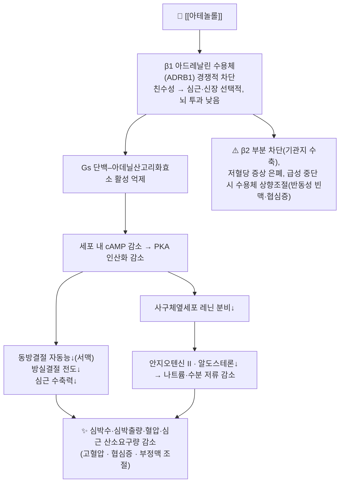

# 💊 [[아테놀롤]] (Atenolol, Tenormin, ATC C07AB03)

> **핵심 3줄 요약 (Key Summary)**:
> 🧪 주성분·제형: [[아테놀롤]]은 친수성(hydrophilic) 선택적 β1 차단제로, 화학식 C14H22N2O3·분자량 약 266.34 g/mol의 벤젠아세트아미드 계열 합성 화합물이다. 시판 제형은 주로 경구용 정제(25/50/100 mg)이며, 국외에는 [[클로르탈리돈]]·[[니페디핀]] 등과의 복합정도 존재한다. 국내에서는 전문의약품(ETC)으로만 유통된다.
> 📍 작용 기전: 심근·신장 사구체옆세포(juxtaglomerular cell)의 β1 아드레날린 수용체(ADRB1)를 가역적·경쟁적으로 차단하여 Gs–아데닐산고리화효소–cAMP–PKA 신호를 억제한다. 그 결과 심박수 감소(negative chronotropy), 방실결절 전도 억제(negative dromotropy), 심수축력 감소(negative inotropy) 및 레닌 분비 감소 → 안지오텐신 II·알도스테론 감소가 나타난다. 내인성 교감신경 흥분작용(ISA)과 막안정화작용은 치료 용량에서 유의하지 않다.
> 🎯 임상 적응증: 고혈압, 협심증(만성 안정형), 상심실성 부정맥 조절, 심근경색 후 이차예방 등. 표준 용법은 25~50 mg 1일 1회 아침 투여(고혈압), 1일 최대 100 mg.
> ⚠️ 주의사항: 서맥·저혈압·말초냉감·피로, 기관지 수축(β2 부분 차단), 저혈당 증상 은폐. **급격한 중단 금지**(반동성 협심증 악화·심근경색 위험). 2~3도 방실차단, 중증 서맥, 심인성 쇼크에서는 금기. 신기능 저하 시 용량 조절 필수.

---

## 1. 약물 기본 정보 및 시판 제품 (Brand Identification)
> [!abstract]+ 🧪 3D 약리 분자 구조 (Interactive 3D Viewer)
> <iframe src="https://molecule-viewer-rho.vercel.app/?cid=2249" width="100%" height="450px" frameborder="0" allow="webgl" style="border-radius: 8px;"></iframe>

| 항목 | 상세 정보 |
| :--- | :--- |
| **일반명 (Generic Name)** | [[아테놀롤]](Atenolol) |
| **대표 상품명 (Brand Names)** | **테노르민(Tenormin)**, **테노민** 등 (※ YAML `aliases:`에 필수 등록하여 위키링크 통합) |
| **ATC 코드 / 분류** | **C07AB03** (Beta blocking agents, selective beta-1 blocking agents) / 국내 식약처 분류: 「기타의 순환계용약」 계열 β수용체 차단제 |
| **PubChem CID** | [2249](https://pubchem.ncbi.nlm.nih.gov/compound/2249) |
| **화학식 / 분자량** | C14H22N2O3 / 약 266.34 g/mol |
| **주요 제형 및 함량** | 경구용 정제 25 mg, 50 mg, 100 mg (국내외 유통 함량 기준). 서방정·주사제는 일반적이지 않음(근거 미확인) |
| **식약처 허가 적응증** | 고혈압(경증~중등도), 협심증, 상심실성 부정맥(발작성 심방빈맥 등), 심근경색 후 이차예방 등 — **품목별 허가사항 원문 확인 필요** |

### 1.1 대표 시판 제품 및 함유 복합제 매핑 (Brand Identification & Combinations)

| 구분 | 대표 제품명 / 브랜드 | 함유 성분 및 1회당 함량 | 제형 및 특징 | 주요 적응증 및 복약 지도 핵심 |
| :--- | :--- | :--- | :--- | :--- |
| **단일제 (ETC)** | **테노르민(Tenormin)**, 테노민 등 | [[아테놀롤]] 단일 성분 25/50/100 mg | 경구 정제, 친수성·저지용성(뇌혈관장벽 투과 낮음) | 고혈압·협심증 1일 1회 아침 복용, **임의 중단 금지**, 맥박수(안정 시 50회/분 이하) 자가 확인 |
| **복합제 (국외 중심)** | 테노레틱(Tenoretic) 계열 | [[아테놀롤]] + [[클로르탈리돈]](chlorthalidone) | 정제 | 복합 이뇨·차단 요법, 전해질(칼륨) 및 탈수 모니터링 |
| **복합제 (국외 중심)** | 테니프(Tenif)/베타-아달라트 계열 | [[아테놀롤]] + [[니페디핀]](nifedipine) | 서방정·정제 | 혈압 조절 강화, 반사성 빈맥 완충 및 부종·두통 확인 |
| **감별: 동일 계열 타 약물** | [[네비볼롤]](Nebivolol) | β1 선택적 차단 + NO 매개 혈관확장 | 정제 | 아테놀롤과 달리 혈관확장 부가 기전 보유(PMID 9990650) |
| **감별 다빈도 일반약** | [[아스피린]], [[이부프로필]] | 항혈소판제 / NSAIDs | 정제 | NSAIDs는 항고혈압 효과를 감쇠시킬 수 있어 병용 시 혈압 추적 |

> ⚠️ **중요**: [[아테놀롤]]은 국내에서 **일반의약품(OTC)으로 유통되지 않는 전문의약품**이다. 따라서 템플릿의 OTC 복합 감기약·생리통 복합제 범주는 본 약물에 적용되지 않으며, 해당 성분이 포함된 국내 허가 품목명·함량은 **의약품안전나라(식약처) 품목 허가사항에서 최종 확인**해야 한다(근거 미확인 항목).

---

## 2. 분자 약리 기전 및 작용 경로 (Mechanism of Action)

* **주요 작용 기전 (Primary MoA)**:
  * [[아테놀롤]]은 카테콜아민(노르에피네프린·에피네프린)과 **경쟁적으로 β1 수용체를 점유**하는 가역적 길항제이다. 저용량에서는 심장과 신장의 β1 수용체에 상대적으로 선택적으로 작용하며, 기관지 평활근·혈관 평활근의 β2 수용체 친화도는 낮다(β1 선택성은 용량 의존적이며 고용량에서는 감소).
  * **내인성 교감신경 흥분작용(ISA)이 없고**, 치료 용량에서 막안정화작용(국소마취 작용)도 나타나지 않는다. 따라서 휴식 시 심박수를 뚜렷하게 떨어뜨리는 특성이 있다.
  * 친수성(지용성 낮음) 약물이므로 뇌혈관장벽 투과가 제한되어, 지용성 β차단제([[프로프라놀롤]], [[메토프롤롤]])에 비해 **악몽·중추신경계 부작용이 상대적으로 적다**(임상 관찰 근거, 정량 근거 미확인).
* **하류 신호전달 및 생화학적 반응**:
  * β1 수용체는 **Gs 단백 결합형**으로, 차단 시 아데닐산고리화효소 활성이 저하되어 **cAMP 생성이 감소**한다. 이에 따라 PKA 매개 인산화(L형 칼슘채널, 라이아노딘 수용체, 포스포람반 등)가 줄어 심근 세포 내 칼슘 취급이 억제되고 수축력·전도성이 저하된다.
  * 신장 사구체옆세포의 β1 차단 → **레닌 분비 감소** → 안지오텐신 II·알도스테론 감소 → 나트륨·수분 재흡수 감소 및 혈관 저항 저하. 아테놀롤의 항고혈압 효과에는 심박출량 감소가 초기 기여, 이후 말초저항 감소가 후기 기여한다는 설명이 일반적이다(기전 세부는 PMID 1720383 리뷰 참조).

---

## 3. 약동학적 특성 (Pharmacokinetics: ADME)

| 약동학 파라미터 | 수치 및 임상적 의미 |
| :--- | :--- |
| **생체이용률 (Bioavailability, F)** | 약 **50% 내외**(문헌별 40~60% 보고). 위장관 흡수는 불완전하며, **초회통과효과는 크지 않음**(간 대사가 미미하기 때문). (PMID 6749509) |
| **최고혈중농도 도달시간 (Tmax)** | 경구 투여 후 약 **2~4시간** (속방 정제 기준). 1일 1회 투여로 24시간에 걸쳐 비교적 평탄한 혈중농도를 유지하는 것이 아테놀롤의 특징. (PMID 6749509) |
| **혈장 단백결합률 (Protein Binding)** | **매우 낮음(5% 미만)** — 알부민 결합이 미미하여 단백결합 경쟁에 의한 상호작용 위험이 낮다. (PMID 6749509) |
| **간 대사 효소 (Metabolism)** | **간 대사가 거의 없음(흡수량의 약 10% 미만)**. CYP450 의존도가 낮아 CYP 유도·저해 약물과의 상호작용이 적다. (PMID 6749509) |
| **배설 반감기 (Elimination t1/2)** | 정상 성인 약 **6~7시간**. **신기능 저하 시 유의하게 연장**되어 무뇨 환자에서 최대 24시간 이상(문헌 보고 최대 27시간)으로 늘어난다. (PMID 6749509) |
| **주요 배설 경로 (Excretion)** | **신장(소변)으로 미변화체 그대로 배설**이 주 경로(흡수량의 약 85~100%; 담즙·분변 배설은 미미). → **중증 신부전에서 축적 위험**, 투석으로 제거 가능. (PMID 6749509) |

* **임상적 해석**: 친수성 + 신배설 의존 + 낮은 단백결합의 조합은 ⓐ 간기능 저하 환자에서 용량 조절 부담이 적고, ⓑ **신기능(CrCl) 기반 용량 결정이 필수**이며, ⓒ 지용성 약물과 달리 중추신경 부작용이 적은 대신 **혈중 농도 변동이 신장 청소율에 직결**된다는 의미를 갖는다.

---

## 의학/04_임상 용법·용량 및 처방 가이드 (Dosage & Administration)

| 임상 적응증 | 성인 표준 용법·용량 | 1일 최대 한도 용량 |
| :--- | :--- | :--- |
| **고혈압** | 25~50 mg 1일 1회 아침 투여로 시작, 반응에 따라 증량 (PMID 1720383, 15530629) | 최대 100 mg/day |
| **만성 안정형 협심증** | 50~100 mg 1일 1회 | 최대 100 mg/day (초과 시 이득 근거 미확인) |
| **상심실성 부정맥 (심방빈맥·심방세동 심박수 조절)** | 50~100 mg 1일 1회 또는 분복 | 최대 100 mg/day (개별 허가사항 확인) |
| **심근경색 후 이차예방** | 50 mg 1일 2회 또는 100 mg 1일 1회 (국외 지침 기준) | 100 mg/day |
| **신기능 저하 시 조절** | CrCl 15~35 mL/min: 1일 최대 50 mg / CrCl <15 mL/min: 1일 25 mg 또는 50 mg 격일 (PMID 6749509 근거의 반감기 연장 원리) | 감량 원칙 |

* **투여 원칙 및 실전 포인트**
  * **아침 1일 1회 투여**가 순응도 측면에서 유리하다(반감기·작용 지속시간 근거).
  * **급격한 감량·중단 금지**: 장기 복용 후 갑자기 끊으면 반동성 빈맥, 혈압 상승, 협심증 악화, 드물게 심근경색·부정맥이 보고된다. 감량은 수 주에 걸쳐 단계적으로.
  * 식사는 흡수에 큰 영향을 주지 않으나, **위장관 불편감이 있으면 식후 복용**으로 지도.
  * **β1 선택성은 용량 의존적**이므로 100 mg/day 이상에서는 기관지 수축 위험이 커진다는 점을 환자 티칭에 포함.
  * 정확한 국내 허가 용량·연령 제한(소아·노인)은 **품목 허가사항 원문으로 최종 확인**해야 한다(근거 미확인 항목).

---

## 5. 부작용, 경고 및 약물 상호작용 (Adverse Effects & Interactions)

### 5.1 주요 부작용 및 독성 경고 (Black Box Warnings)

* **심혈관계**:
  * **서맥(안정 시 심박수 50회/분 미만)**, 저혈압, 어지럼, 실신, 말초 순환 저하로 인한 **손발 냉감**, 레이노 현상 악화. ISA가 없기 때문에 심박수 감소가 다른 β차단제보다 두드러질 수 있다(PMID 1720383).
  * **심부전 악화**: 대상부전 상태의 심부전 환자에서 음성 수축력 작용이 급성 악화를 유발할 수 있다.
* **호흡기계**:
  * β2 부분 차단에 의한 **기관지 수축, 천명, 호흡곤란**. 천식·COPD 환자에서는 악화 위험이 있어 β1 선택성이 상대적 안전성을 제공하지만 **절대적 안전을 의미하지 않는다**(PMID 29763157).
* **대사·내분비**:
  * **저혈당 증상(떨림, 심계항진, 발한)의 은폐 또는 둔화** — 인슐린·경구혈당강하제 사용 당뇨병 환자에서 중요.
  * 인슐린 감수성 및 지질 프로파일에 대한 영향은 문헌 간 이견이 있어 **정량적 결론은 근거 미확인**.
* **기타**:
  * 피로감, 운동능력 저하, 수면장애(친수성이므로 상대적으로 적음), 우울감, **성기능 장애**(발기부전·성욕 감퇴).
  * 알레르기 반응(발진, 드물게 아나필락시스). SJS/TEN 등 중증 피부 이상반응과의 인과성은 **근거 미확인**.
* **금기 및 고위험군**: 2~3도 방실차단, 병적 동서맥증후군, 중증 서맥, 심인성 쇼크, 대상부전 심부전, 미치료 크롬친화세포종(α차단 선행 없이 투여 시 위험), 중증 말초혈관질환.
* **급성 중단 경고**: 관상동맥질환자에서의 갑작스러운 중단은 협심증 악화·심근경색·심실성 부정맥 위험과 연관된다. (미국 FDA 블랙박스 경고 해당 여부의 명시적 확인은 **근거 미확인**이나, 허가사항상 '급성 중단' 경고는 공통적으로 기재된다.)

### 5.2 주요 병용 금기 및 상호작용

* **위험 병용 약물**
  * **베라파밀·딜티아젬(비디히드로피리딘계 칼슘차단제)**: 중증 서맥, 방실차단, 심부전 악화 — 병용 시 심전도·혈압 집중 모니터링.
  * **디곡신**: 방실 전도 억제 상가 작용 → 서맥·전도장애.
  * **클로니딘**: 병용 중 클로니딘을 먼저 중단하면 반동성 고혈압이 발생할 수 있어, **β차단제를 먼저 감량·중단**하는 순서 원칙.
  * **인슐린·설폰요소제**: 저혈당 증상 은폐 및 회복 지연.
  * **NSAIDs([[이부프로필]], [[나프록센]] 등)**: 나트륨 저류·프로스타글란딘 억제로 **항고혈압 효과 감쇠**.
  * **카테콜아민 고갈제(레세르핀 등)**: 과도한 서맥·저혈압.
  * **교감신경 흥분제(슈도에페드린 함유 감기약)**: 혈압 상승 및 차단 효과 상쇄 — 한의원 진료 시 **종합감기약 복용력 확인이 특히 중요**.
* **상대적으로 안전한 조합**: CYP450 대사 의존도가 낮아 CYP3A4·2D6 기반 상호작용은 임상적으로 크지 않다(PMID 6749509).
* **알코올**: 혈압 강하 및 어지럼 악화 가능.

---

## 6. 한의 치료 연계 및 병용/테이퍼링 프로토콜 (Integrative Medicine)

### 6.1 한약·양약 병용 투여 안전성 및 시너지 배오

* **간·신 대사 간섭 완충 처방**: [[아테놀롤]]은 간 대사 의존도가 낮고 신배설이 주 경로이므로, **한약재와의 CYP 기반 상호작용 위험은 상대적으로 낮다**. 다만 **이뇨 작용이 강한 본초(예: [[택사]], [[저령]], [[목통]])**를 병용하면 체액량 감소로 저혈압·신전구체 혈류 저하가 겹칠 수 있어 **1~2시간 시간차 투여** 및 혈압·크레아티닌 추적이 권장된다.
* **상승 배오 (Synergy) 관점의 접근**
  * **간양상항(肝陽上亢)·담음(痰飮) 유형 고혈압**: [[천마구등음]](天麻鉤藤飮), [[반하백출천마탕]](半夏白朮天麻湯) 등 — 두통·현훈·이명·불면 동반 시.
  * **음허(陰虛) 유형**: [[육미지황환]](六味地黃丸) 계열 — 야간 도한·오심번열·요슬산약 동반 시.
  * **본초 배오 예시**: [[조구등]](鉤藤), [[하초초]](夏枯草), [[결명자]](決明子), [[국화]](菊花), [[단삼]](丹蔘), [[산사]](山楂) — 소화기·출혈 경향 및 복용 중인 항혈소판제 유무를 반드시 확인.
  * ※ 위 처방·본초 조합의 **항고혈압 상승효과를 정량적으로 입증한 근거는 현재 제공 문헌 범위 내에서 확인되지 않음(근거 미확인)**. 임상적 경험과 변증 논리에 기반한 병용 설계로 이해할 것.
* **주의 본초**: 교감신경 흥분 작용이 있는 자극성 본초(예: [[마황]](麻黃) 함유 처방)는 혈압 상승·심계항진을 유발할 수 있어 **고혈압·협심증 환자에서 원칙적으로 회피**한다.

### 6.2 양약 감량 및 한의 전환(테이퍼링) 가이드

* **원칙**: [[아테놀롤]]은 **단독으로 임의 중단해서는 안 되는 약물**이다. 침·약침·한약 치료를 병행하더라도 감량은 반드시 **주치의(순환기내과/내과)와 협의 하에 서서히** 진행한다.
* **감량 프로토콜(임상 참고안, 근거 미확인)**:
  1. **안정화 단계(2~4주)**: 한의 치료(침·한약) 시작 후 혈압·심박수 일지 작성. 목표: 안정 시 수축기 혈압 120~130 mmHg대, 심박수 55~70회/분 유지.
  2. **1차 감량**: 2~4주 간격으로 **1일 총량의 약 25%씩** 단계 감량(예: 100 mg → 75 mg → 50 mg → 25 mg).
  3. **최종 단계**: 25 mg 유지 후 격일 투여 → 최종 중단. 이 구간에서 **반동성 빈맥·혈압 상승·흉통**이 가장 잘 나타나므로 자가 측정 빈도를 높인다.
  4. **중단 후 4주**: 두통, 현훈, 흉통, 심계항진, 야간 혈압 상승 여부를 문진하고, 필요 시 재증량 또는 다른 계열로의 전환을 주치의와 상의.
* **한의 치료 목표 설정**: 양약 용량을 무리하게 줄이는 것이 목적이 아니라, **증상 조절과 표적장기 보호를 유지하면서 삶의 질(수면·소화·피로)을 개선**하는 데 둔다.

---

## 7. 💡 사용자 진료실 핵심 필기 & 실전 임상 체크리스트

### 7.1 진료실 3대 핵심 문진 체크리스트

1. **복용 기간·총 용량·중단 이력 확인**: [[아테놀롤]]은 **갑자기 끊으면 위험한 약**이다. "약을 임의로 끊거나 반으로 쪼개 드신 적이 있습니까?", "최근 며칠간 복용을 거르셨습니까?"를 반드시 확인. 아울러 **종합감기약(슈도에페드린 함유)·NSAIDs 계열 진통제** 복용 여부로 성분 중복·상쇄 위험을 점검.
2. **기저 질환 및 활력징후 청취**: 천식·COPD(기관지 수축), 당뇨병(저혈당 증상 은폐), 말초혈관질환·레이노, 신기능 저하(CrCl) 여부. **내원 시 혈압과 맥박을 반드시 측정**하고, 안정 시 맥박 50회/분 미만이면 감량 상담을 권고.
3. **증상 호전도 및 부작용 모니터링**: 어지럼, 피로, 손발 냉감, 운동 시 숨참, 발기부전, 우울감, 수면장애. 한약 복용 후 소화불량·설사·부종 여부도 함께 기록.

### 7.2 환자 티칭 스크립트

> *"환자분, 지금 드시는 [[아테놀롤]]은 심장을 조금 천천히 뛰게 해서 혈압과 심장 부담을 줄여주는 약입니다. 두 가지는 꼭 기억해 주세요. 첫째, **임의로 끊지 마세요.** 갑자기 중단하면 오히려 가슴 통증이나 두근거림이 심해질 수 있어서, 줄일 때는 몇 주에 걸쳐 조금씩 줄여야 합니다. 둘째, **천식이나 당뇨가 있으시면 꼭 미리 말씀해 주세요.** 숨이 차거나, 손발이 차고, 어지러울 수 있습니다. 저희 한의원에서는 침과 한약으로 몸의 긴장과 수면, 소화 상태를 함께 조절하면서, 주치의 선생님과 상의해 약을 서서히 줄여나갈 수 있도록 돕겠습니다. 매일 아침 같은 시간에 약 드시고, 혈압과 맥박을 기록해 오시면 큰 도움이 됩니다."*

---

## 8. 출처 및 학술 참고 문헌 (References)

* Carlberg B, Samuelsson O. Atenolol in hypertension: is it a wise choice? *Lancet*. 2004. PMID: **15530629**
  * `[연구 요약]` 아테놀롤 기반 고혈압 치료가 혈압 강하 효과에도 불구하고 뇌졸중·사망 등 임상 결과에서 다른 항고혈압제보다 열등할 가능성을 제기한 문제 제기형 연구. **아테놀롤을 고혈압 1차 선택제로 무비판적으로 쓰는 관행에 대한 경계 근거**로 인용.
* Kirch W, Görg KG. Clinical pharmacokinetics of atenolol — a review. *Eur J Drug Metab Pharmacokinet*. 1982. PMID: **6749509**
  * `[연구 요약]` 아테놀롤의 흡수·생체이용률·낮은 단백결합·미미한 간 대사·신장 미변화체 배설·반감기 및 **신기능 저하 시 반감기 연장**을 정리한 약동학 총설. 본 노트 3장·4장의 용량 조절 근거.
* Wadworth AN, Murdoch D. Atenolol. A reappraisal of its pharmacological properties and therapeutic use in cardiovascular disorders. *Drugs*. 1991. PMID: **1720383**
  * `[연구 요약]` 아테놀롤의 약리학적 특성(β1 선택성, ISA 부재, 친수성)과 심혈관 질환(고혈압·협심증·부정맥)에서의 치료적 위치를 재평가한 종합 리뷰.
* Ivantsova E, Martyniuk CJ. A synthesis on the sub-lethal toxicity of atenolol, a beta-blocker, in teleost fish. *Environ Toxicol Pharmacol*. 2023. PMID: **37481051**
  * `[연구 요약]` 아테놀롤이 **환경 잔류 의약품(emerging contaminant)**으로서 경골어류에 미치는 아치사(sub-lethal) 독성 영향을 종합한 연구. 인체 처방 근거는 아니며, **환경·생태 독성학 관점의 참고 문헌**으로 분류.
* Tucker WD, Sankar P. Selective Beta-1 Blockers. 2023. PMID: **29763157**
  * `[연구 요약]` 선택적 β1 차단제 계열의 기전·적응증·부작용을 개관한 교육용 총설. β1 선택성의 용량 의존성과 기관지 수축 위험 관련 서술 근거.
* Mangrella M, Rossi F. Pharmacology of nebivolol. *Pharmacol Res*. 1998. PMID: **9990650**
  * `[연구 요약]` 네비볼롤(β1 선택적 차단 + NO 매개 혈관확장)의 약리학. 아테놀롤과 **동일 계열 내 기전 차별화(혈관확장 부가 기전 유무)**를 비교 설명하는 대조 참고 문헌.
* 식품의약품안전처 의약품안전나라 의약품통합정보시스템 (https://nedrug.mfds.go.kr)
  * `[연구 요약]` 국내 허가 의약품의 품목기준코드, 허가사항, 용법·용량, 금기 및 이상반응 안전성 정보 확인용 1차 자료원. **본 노트의 국내 품목명·함량·허가 적응증은 반드시 이 시스템에서 최종 확인할 것.**

> 📌 **근거 표기 원칙**: 본 노트에서 "근거 미확인"으로 표시한 항목(국내 복합제 허가 현황, 한약 병용의 정량적 상승효과, SJS/TEN 인과성, 지질·인슐린 감수성 영향의 정량치 등)은 제공된 문헌만으로 확정할 수 없는 내용이다. 임상 적용 시 최신 허가사항·지침을 별도로 확인해야 한다.

<!-- 보관 태그(1회용·링크오류, 필요시 복원): 선택적베타1차단제 -->
