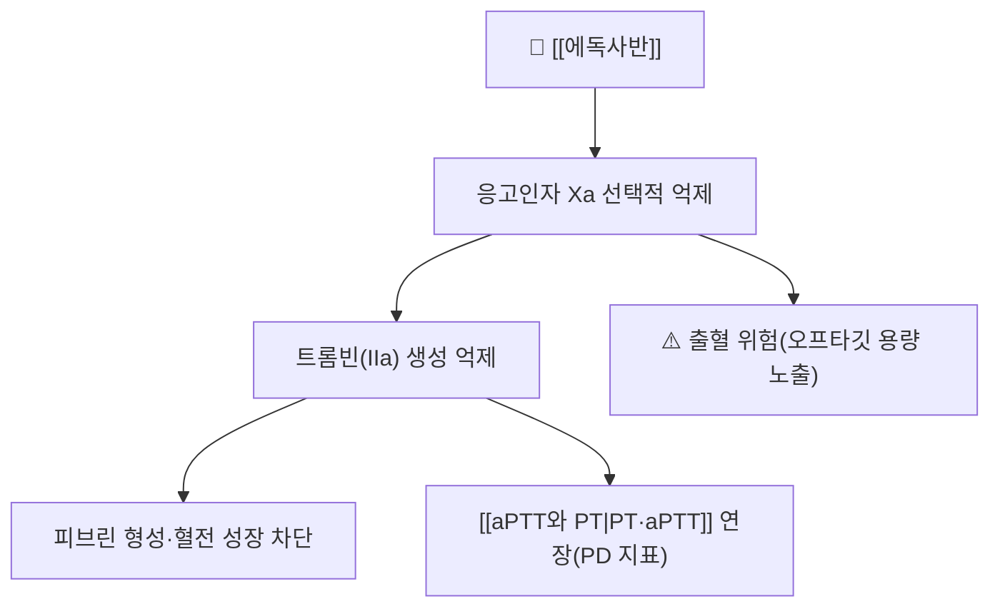

# 💊 [[에독사반]] (Edoxaban, Lixiana / 리자이나)

> **핵심 3줄 요약 (Key Summary)**:
> 🧪 주성분·제형: 경구용 **직접경구항응고제(DOAC)** 중 **선택적 제Xa인자 억제제**. 리자이나정® 15·30·60 mg (에독사반토실산염).
> 📍 작용 기전: **응고인자 Xa를 선택적·가역적으로 직접 억제** → 프로트롬빈의 트롬빈 전환 차단 → 피브린 형성 억제. [[aPTT와 PT|PT·aPTT]] 연장.
> 🎯 임상 적응증: 비판막성 심방세동 환자의 뇌졸중·전신색전증 예방, 정맥혈전색전증(VTE, 심부정맥혈전증·폐색전증) 치료 및 재발 예방.
> ⚠️ 주의사항: 출혈 위험, **신기능(CrCl)에 따른 용량 조정(60 → 30 mg)**, [[P-당단백(P-gp)]] 유도 약물 병용 시 노출 감소. 기계판막·중증 신부전·임부 주의.

---

## 1. 약물 기본 정보 및 시판 제품 (Brand Identification)

| 항목 | 상세 정보 |
| :--- | :--- |
| **일반명 (Generic Name)** | [[에독사반]](한글) / Edoxaban |
| **대표 상품명 (Brand Names)** | **리자이나** (Lixiana) ※ YAML `aliases:` 등록 |
| **ATC 코드 / 분류** | B01AF03 / 직접경구항응고제(DOAC), 제Xa인자 억제제 |
| **화학 계열** | 티아졸 유도체계 선택적 Xa 억제제 (경구) |
| **주요 제형 및 함량** | 정제 15 mg / 30 mg / 60 mg (토실산염) |
| **허가 적응증** | 비판막성 심방세동 환자의 뇌졸중·전신색전증 예방, VTE 치료·재발 예방 |

### 1.1 동일 계열(DOAC) 감별 포인트
| 약물 | 표적 | 모니터링 | 비고 |
| :--- | :--- | :--- | :--- |
| **[[에독사반]]** | Xa 직접 억제 | 약물 특이 anti-Xa(일반적 불필요) | 신기능 따라 30/60 mg |
| 리바록사반 | Xa 직접 억제 | 불필요 | 식사와 함께 복용 |
| 아픽사반 | Xa 직접 억제 | 불필요 | — |
| 다비가트란 | **트롬빈(IIa) 직접 억제** | 불필요 | 다른 표적 |

---

## 2. 분자 약리 기전 및 작용 경로 (Mechanism of Action)

* **주요 작용 기전 (Primary MoA)**: 항트롬빈(AT) 비의존적으로 Xa의 활성부위에 직접 결합 → 프로트롬빈나아제 복합체 작용 차단 → 트롬빈 폭발(thrombin burst) 억제.
* **약동학적 특징**: [[P-당단백(P-gp)]] 및 [[CYP3A4]]의 기질 → **P-gp 유도제·억제제와 상호작용**.
* **PD 모니터링**: PT·aPTT는 연장될 수 있으나 **농도-반응 상관이 약해 정량 목적에는 부적합**(필요 시 anti-Xa).

---

## 3. 약동학적 특성 (Pharmacokinetics: ADME)

| 약동학 파라미터 | 수치 및 임상적 의미 |
| :--- | :--- |
| **생체이용률 (F)** | 약 62% (경구) |
| **최고혈중농도 도달시간 (Tmax)** | 1~2시간 |
| **혈장 단백결합률** | 약 55% |
| **간 대사** | [[CYP3A4]] 및 포합반응(일부) |
| **배설 반감기 (t1/2)** | 약 10~14시간 |
| **주요 배설 경로** | 신장 배설(약 50%, 신기능 의존) + 담즙·장관 |

---

## 4. 임상 용법·용량 및 처방 가이드 (Dosage & Administration)

| 임상 적응증 | 성인 표준 용법·용량 | 감량 기준 |
| :--- | :--- | :--- |
| **비판막성 심방세동** | 60 mg 1일 1회 | CrCl 15~50 mL/min, 체중 ≤60 kg, P-gp 억제제 병용 중 1개 이상 → **30 mg 1일 1회** |
| **VTE 치료·재발 예방** | 60 mg 1일 1회(초기 비경구 항응고 후) | 감량 기준 동일 |
| **1일 최대** | 60 mg | CrCl >95 mL/min에서는 효과 감소 → **다른 DOAC 고려** |

---

## 5. 부작용, 경고 및 약물 상호작용 (Adverse Effects & Interactions)

### 5.1 주요 부작용 및 독성 경고
* **출혈**: 비출혈·잇몸 출혈·멍·혈뇨·흑변·두개내출혈 — 주요 위험은 출혈.
* 기타: 간효소 상승, 발진.

### 5.2 주요 병용 금기 및 상호작용
* **[[P-당단백(P-gp)]] 유도제**(리팜핀·카바마제핀·페니토인·세인트존스워트) → 에독사반 노출↓ **효과 감소 위험**.
* **P-gp 억제제**(케토코나졸·퀴니딘·베라파밀·드로네다론) → 노출↑ **출혈 위험** → 감량 검토.
* 항혈소판제·NSAIDs·SSRI 병용 시 출혈 위험 상승.
* **한약 연계(2026-09-10 심층리뷰 2번, PMID 39461388)**: [[반하백출천마탕]]·[[황련해독탕]] 6일 병용에서 **AUC 불변, Cmax 18.5~28.1% 감소**, aPTT·PT 동등 — "경미한 PK 영향"이라는 첫 임상시험 근거. 단 건강인 14명·단회 조건.

---

## 6. 한의 치료 연계 및 병용 안전성 (Integrative Medicine)

* **복약 상담 근거**: "뇌졸중에 쓰는 한약(반하백출천마탕·황련해독탕)을 함께 복용해도 에독사반 총 노출과 응고 검사는 유지되었다" — 환자의 임의 복약 중단을 줄이는 설명 근거.
* **모니터링 루틴**: ① 복약 시작 전 PT/aPTT·신기능(CrCl) 기준값 → ② 2주 내 재평가 → ③ 멍·잇몸 출혈·혈뇨·흑변 문진.
* **주의**: 급성기·고령·신기능 저하·다약제 환자에서는 일반화 금지. 베르베린 함유 처방([[황련]])의 [[CYP3A4]]·[[P-당단백(P-gp)]] 관여도 함께 유념.

---

## 7. 💡 사용자 진료실 핵심 필기 & 실전 임상 체크리스트

### 7.1 진료실 3대 핵심 문진 체크리스트
1. **적응증·용량 확인**: 심방세동 vs VTE, CrCl·체중·P-gp 억제제 병용 여부 → 30 mg 감량 대상인지.
2. **출혈 위험 청취**: 최근 멍·잇몸 출혈·혈뇨·흑변, 소화성 궤양·뇌출혈 과거력, 동반 항혈소판제.
3. **상호작용 한약·건기식 청취**: 황련·황금 함유 처방, 세인트존스워트 등 P-gp/CYP3A4 관여 제품.

---

## 8. 출처 및 학술 참고 문헌 (References)

* Brunton LL, et al., eds. *Goodman & Gilman's The Pharmacological Basis of Therapeutics*. 13th ed. McGraw-Hill.
* 식품의약품안전처 의약품안전나라 의약품통합정보시스템 (https://nedrug.mfds.go.kr) — 리자이나정 허가사항.
* **(2025)**. Impact of Banhabaekchulcheonmatang and Hwangryeonhaedoktang on edoxaban: Herb-drug interaction study in healthy subjects. *Journal of Ethnopharmacology*, 337(Pt 3): 118997. [PMID: 39461388](https://pubmed.ncbi.nlm.nih.gov/39461388/) *(저자명은 원문 심층리뷰에 미기재 — PMID로 확인)*
  * `[연구 요약]`: 건강인 14명 교차 1상 — 한약 병용 시 에독사반 AUC 불변·Cmax 감소, PD(aPTT·PT) 동등.
