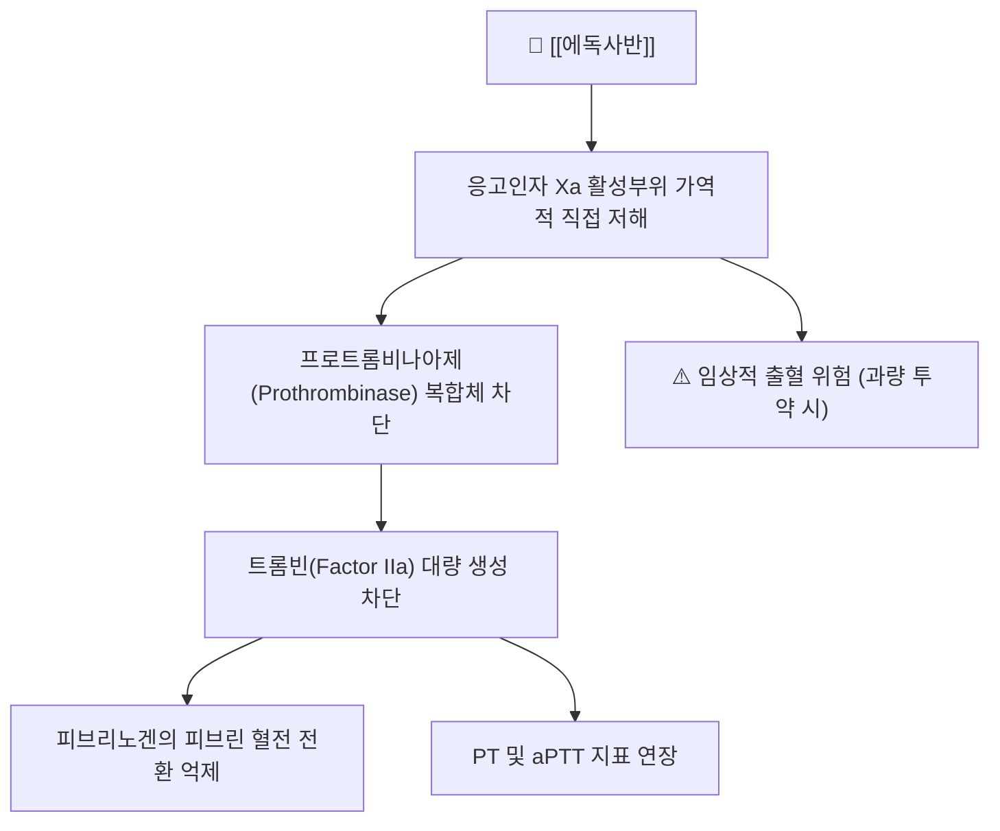

---
aliases:
  - Edoxaban
  - 에독사반
  - Lixiana
  - 리자이나
  - 리자이나정
  - 에독사반토실산염
  - B01AF03
tags:
  - 약리/양방약
  - 항응고제
  - DOAC
  - 제Xa인자억제제
  - 심방세동
  - 혈전증
---

# 💊 에독사반 (Edoxaban, Lixiana · 리자이나, ATC B01AF03)

> **핵심 3줄 요약 (Key Summary)**:
> 🧪 주성분·제형: 경구용 직접 작용형 항응고제(DOAC)이자 선택적 응고인자 Xa 저해제인 [[에독사반]] 토실산염(Edoxaban tosilate monohydrate) 제제([[리자이나]]정 15mg, 30mg, 60mg).
> 📍 작용 기전: 안티트롬빈-III 비의존적으로 혈액 응고 캐스케이드의 핵심인 응고인자 Xa(Factor Xa)의 활성 부위에 직접·가역적으로 결합하여 트롬빈의 생성과 피브린 혈전 형성을 차단함.
> 🎯 임상 적응증: 비판막성 심방세동(NVAF) 환자의 뇌졸중 및 전신색전증 예방, 심부정맥혈전증(DVT) 및 폐색전증(PE)의 치료 및 재발 예방.
> ⚠️ 주의사항: 출혈 합병증 위험, 신기능(CrCl 15~50 mL/min), 체중 60kg 이하 또는 P-gp 억제제 병용 시 30mg으로 50% 감량 필수, CrCl > 95 mL/min 초과 시 약효 감쇠 주의, 척추·경막외 마취 시 혈종 주의.

---

## 목차 (Table of Contents)
- [[#1. 약물 개요 및 기본 정보 (Overview & Identification)|1. 약물 개요 및 기본 정보 (Overview & Identification)]]
- [[#2. 약리 기전 및 생화학적 경로 (Mechanism of Action)|2. 약리 기전 및 생화학적 경로 (Mechanism of Action)]]
- [[#3. 약동학적 특성 (Pharmacokinetics)|3. 약동학적 특성 (Pharmacokinetics)]]
- [[#4. 임상 적응증 및 실제 용법·용량 (Indications & Dosage)|4. 임상 적응증 및 실제 용법·용량 (Indications & Dosage)]]
- [[#5. 이상반응 및 주의·금기사항 (Adverse Effects & Precautions)|5. 이상반응 및 주의·금기사항 (Adverse Effects & Precautions)]]
- [[#6. 약물 상호작용 및 병용 금기 (Drug Interactions)|6. 약물 상호작용 및 병용 금기 (Drug Interactions)]]
- [[#7. 한의 임상 연계 및 실전 진료 팁 (Clinical Pearls & KM Integration)|7. 한의 임상 연계 및 실전 진료 팁 (Clinical Pearls & KM Integration)]]
- [[#8. 출처 및 현대 학술 연구 요약 (References)|8. 출처 및 현대 학술 연구 요약 (References)]]

---

## 1. 약물 개요 및 기본 정보 (Overview & Identification)

### 1.1 기본 정보 표
| 항목 | 상세 정보 |
| :--- | :--- |
| **일반명 (INN)** | [[에독사반]] (Edoxaban) / 에독사반 토실산염 수화물 |
| **화학명 (IUPAC)** | N'-(5-chloropyridin-2-yl)-N-[(1S,2R,4S)-4-(dimethylcarbamoyl)-2-[(5-methyl-6,7-dihydro-4H-[1,3]thiazolo[5,4-c]pyridine-2-carbonyl)amino]cyclohexyl]oxamide |
| **화학식 / 분자량** | $C_{24}H_{30}ClN_7O_4S$ / 548.06 g/mol (유리염기), 738.27 g/mol (토실산염 수화물) |
| **PubChem CID** | 10280735 |
| **ATC 코드** | B01AF03 (Direct factor Xa inhibitors) |
| **대표 브랜드 제품** | 리자이나정 15mg, 30mg, 60mg (다이이찌산쿄 / 대웅제약 공동판매) |
| **약효 분류군** | 직접경구항응고제 (DOAC / NOAC) |
| **처방 구분** | 전문의약품 (급여 적용, 심방세동 및 정맥혈전증 적응증) |

### 1.2 의약품 외형 및 구조 이미지

> [그림 1] PubChem 에독사반(Edoxaban) 2D 화학 분자 구조식 (CID: 10280735)

> [그림 2] 에독사반 고해상도 화학 구조 및 제제 프로파일

> [그림 3] 경구용 직접 Xa 저해제(에독사반, 리바록사반, 아픽사반)의 화학적 모핵 구조 비교

> [!abstract]+ 🧪 3D 약리 분자 구조 (Interactive 3D Viewer)
> <iframe src="https://molecule-viewer-rho.vercel.app/?cid=10280735" style="width: 100%; height: 600px; border: none; border-radius: 12px; box-shadow: 0 4px 20px rgba(0,0,0,0.15);" allowfullscreen></iframe>

---

## 2. 약리 기전 및 생화학적 경로 (Mechanism of Action)

### 2.1 응고인자 Xa(Factor Xa)의 선택적·가역적 직접 저해
* **응고 캐스케이드의 중심 표적**:
  * 내인성(Intrinsic) 및 외인성(Extrinsic) 응고 경로가 수렴하는 핵심 교차로가 바로 응고인자 Xa입니다. 1분자의 Xa는 약 1,000분자의 트롬빈을 폭발적으로 증폭 생성(Thrombin burst)시킵니다.
  * [[에독사반]]은 안티트롬빈-III(Antithrombin III)와 같은 생체 내 내인성 조효소에 의존하지 않고, 유리형(Free) Xa뿐만 아니라 혈소판 표면에 결합된 프로트롬비나아제(Prothrombinase) 복합체 내의 Xa 활성 중심 부위에 나노몰 단위($K_i = 0.561\text{ nM}$)의 초고친화도로 결합하여 효소 활성을 원천 무력화합니다.
* **와파린과의 비교 우위**:
  * 비타민 K 의존성 응고인자(II, VII, IX, X)의 합성을 지연시키는 와파린과 달리, 이미 순환 중인 활성형 Xa를 즉각 차단하므로 약효 발현이 1~2시간 내로 매우 신속하며, 식이에 따른 비타민 K 상호작용이 전혀 없습니다.

---

## 3. 약동학적 특성 (Pharmacokinetics)

### 3.1 흡수 (Absorption)
* **생체이용률**: 경구 흡수율은 약 62%입니다.
* **최고 혈중 농도 도달 시간($T_{max}$)**: **약 1~2시간** 이내로, 복용 즉시 강력한 항응고 효과가 발현됩니다.
* **음식물의 영향**: 음식물 섭취와 관계없이 복용할 수 있습니다 ([[리바록사반]] 고용량과 달리 공복/식후 구애받지 않음).

### 3.2 분포 (Distribution) 및 단백 결합
* **단백 결합률**: 약 55%로 비교적 낮아, 다른 고단백 결합 약물(와파린, 설포닐우레아 등)과의 단백 치환 상호작용 위험이 적습니다.
* **분포 용적($V_d$)**: 약 107 L로 전신 조직으로 원활히 분포합니다.

### 3.3 대사 (Metabolism)
* **간 대사 비율**: 간 대사는 최소한으로(투여량의 10% 미만), 주로 카르복실에스테라제-1(CES1), CYP3A4, 글루쿠론산 포합에 의해 소량 대사됩니다.
* **P-당단백질(P-gp) 기질**: 장관 및 신장에서 P-당단백(P-gp)의 기질로 작용하므로, 강력한 P-gp 억제제 병용 시 혈중 농도가 상승합니다.

### 3.4 배설 (Elimination)
* **신장 배설율**: 투여 용량의 **약 50%가 신장을 통해 미변화체 형태로 배설**됩니다 (나머지 50%는 담즙 및 분변 배설).
* **소실 반감기($t_{1/2}$)**: **약 10~14시간**으로 1일 1회 복용이 가능합니다. 신기능 저하 시 반감기가 현저히 연장되므로 세밀한 용량 감량이 요구됩니다.

---

## 4. 임상 적응증 및 실제 용법·용량 (Indications & Dosage)

### 4.1 허가 적응증
1. **비판막성 심방세동(NVAF) 환자**: 뇌졸중 및 전신색전증의 위험 감소.
2. **정맥혈전색전증(VTE)**: 심부정맥혈전증(DVT) 및 폐색전증(PE)의 치료 및 재발 위험 감소 (초기 5일 이상 저분자 헤파린 등 비경구 항응고제 투여 후 전환).

### 4.2 용법·용량 및 3대 50% 감량 기준 (Dose Adjustment)
* **표준 용량**: **1일 1회 60mg**을 식사와 관계없이 일정 시간에 경구 투여.
* **3대 감량 기준 (1개 이상 해당 시 1일 1회 30mg으로 50% 감량)**:
  1. **신장 기능 저하**: 크레아티닌 청소율(CrCl) **15 ~ 50 mL/min**
  2. **저체중**: 체중 **60 kg 이하**
  3. **강력한 P-gp 억제제 병용**: 사이클로스포린, 드로네다론, 에리스로마이신, 케토코나졸 병용 시
* **CrCl > 95 mL/min 초과 환자 주의 (상한선 패러독스)**:
  * 신기능이 지나치게 우수한 환자(CrCl > 95 mL/min)에서는 에독사반의 신장 배설이 과도하게 빨라져 혈중 농도가 저하되고 와파린 대비 허혈성 뇌졸중 예방 효과가 감소할 수 있으므로, 다른 DOAC([[아픽사반]] 등) 선택을 고려합니다.

---

## 5. 이상반응 및 주의·금기사항 (Adverse Effects & Precautions)

### 5.1 출혈 합병증 (Bleeding Risk)
* **주요 출혈(Major Bleeding)**: 위장관 출혈(흑변, 토혈), 뇌출혈, 안구 출혈.
* **경미한 출혈**: 잇몸 출혈, 빈번한 비출혈(코피), 피하 반상출혈(멍), 혈뇨.
* **역전제(Reversal Agent)**: 생명을 위협하는 중증 출혈 시 재조합 변형 Xa 미끼 단백질인 안덱사넷 알파(Andexanet alfa) 또는 프로트롬빈 복합체 농축액(PCC)을 투여합니다.

### 5.2 척추·경막외 혈종 경고 (Black Box Warning)
* 척추 침습적 시술(요추 천자, 경막외 마취)을 받는 환자에서 장기간 또는 영구적인 마비를 초래하는 척추/경막외 혈종 발생 위험이 있으므로 시술 전후 충분한 휴약기(최소 24~48시간)를 준수해야 합니다.

### 5.3 금기 환자 (Contraindications)
* 활동성 병적 출혈 환자
* 기계 판막 치환술을 받은 환자 (DOAC 공통 금기)
* 투석을 요하는 말기 신부전 환자 (CrCl < 15 mL/min)
* 임신부 및 수유부

---

## 6. 약물 상호작용 및 병용 금기 (Drug Interactions)

### 6.1 병용 약물 상호작용 표
| 약물 계열 | 대표 약물 | 상호작용 기전 및 임상 권고사항 |
| :--- | :--- | :--- |
| **P-gp 억제제** | 사이클로스포린, 드로네다론, 에리스로마이신 | 에독사반 배설 억제로 혈중 농도 급상승 $\rightarrow$ **30mg으로 즉시 감량** |
| **P-gp 유도제** | 리팜핀, 카바마제핀, 세인트존스워트 | 에독사반 장관 배출 촉진으로 약효 급감 $\rightarrow$ **병용 금기 또는 회피** |
| **[[NSAIDs]] / 아스피린** | [[이부프로펜]], [[나프록센]], [[아스피린]] | 혈소판 기능 억제 및 위점막 손상 중첩으로 **위장관 출혈 위험 2~3배 급증** |
| **항혈소판제** | [[클로피도그렐]], 티카그렐러 | 2중 항혈전 작용으로 대출혈 위험 증가 (관상동맥 스텐트 시술 후 엄격 모니터링) |

---

## 7. 한의 임상 연계 및 실전 진료 팁 (Clinical Pearls & KM Integration)

### 7.1 한약-양약 상호작용 임상시험 근거 융합 (J Ethnopharmacol 2025)
* **반하백출천마탕 및 황련해독탕 병용 임상시험(PMID 39461388)**:
  * 뇌졸중 후유증 및 고혈압 환자에게 다용되는 **[[반하백출천마탕]]**과 **[[황련해독탕]]**을 에독사반과 6일간 병용한 인체 임상 1상 시험 결과, 에독사반의 **총 혈중 노출(AUC) 및 응고 지표(aPTT, PT)에 유의한 변동이 없었음**이 과학적으로 입증되었습니다.
  * 단, $C_{max}$가 18.5~28.1% 다소 완만해지는 경향을 보였으므로, 환자가 한약을 복용한다고 해서 임의로 에독사반을 중단할 필요가 없으며 병용 시 멍이나 출혈 경향을 일상 문진하는 것으로 안전하게 관리할 수 있습니다.

### 7.2 침구 및 부항 치료 시 절대 안전 가이드
* **자락관법(습부항) 및 사혈 절대 금기**:
  * 에독사반 복용 환자에게 습부항(사혈 요법), 침도 요법, 심부 관절강 천자 등 침습적 시술은 피하 혈종 및 지혈 지연을 유발하므로 절대 시행하지 않습니다.
* **호침 자침 안전 수칙**:
  * 0.20~0.25mm 이하의 가는 호침을 사용하고, 근육 심부 강자극을 피하며 발침 후 3분 이상 압박 지혈을 철저히 시행합니다.
  * 진료실 문진 시 잇몸 출혈, 소변 색(혈뇨), 대변 색(흑변) 유무를 항상 확인합니다.

---

## 8. 출처 및 현대 학술 연구 요약 (References)

### 8.1 학술 논문 및 임상 연구
1. **Giugliano RP, Ruff CT, Braunwald E, et al. (ENGAGE AF-TIMI 48 Investigators).** (2013). *Edoxaban versus warfarin in patients with atrial fibrillation.* **New England Journal of Medicine**, 369(22), 2093-2104. [PMID: 24251359](https://pubmed.ncbi.nlm.nih.gov/24251359/) / [DOI: 10.1056/NEJMoa1310907](https://doi.org/10.1056/NEJMoa1310907)
   - `[연구 요약]` 21,105명의 비판막성 심방세동 환자를 대상으로 1일 1회 에독사반(60mg/30mg)과 와파린을 2.8년간 비교한 초대형 랜드마크 3상 RCT로, 뇌졸중 예방에서 비열등성을 입증하고 주요 출혈 및 심혈관 사망률을 유의하게 감소시킴을 증명한 연구.
2. **The Hokusai-VTE Investigators, Büller HR, Décousus H, et al.** (2013). *Edoxaban versus warfarin for the treatment of symptomatic venous thromboembolism.* **New England Journal of Medicine**, 369(15), 1406-1415. [PMID: 23991658](https://pubmed.ncbi.nlm.nih.gov/23991658/) / [DOI: 10.1056/NEJMoa1306638](https://doi.org/10.1056/NEJMoa1306638)
   - `[연구 요약]` 급성 심부정맥혈전증 및 폐색전증 환자 8,292명을 대상으로 초기 헤파린 투여 후 에독사반 60mg(감량군 30mg)과 와파린을 비교하여 재발성 정맥혈전색전증 예방의 동등성과 주요 출혈 위험의 유의한 감소를 입증한 랜드마크 임상시험.
3. **Cho KH, et al.** (2025). *Impact of Banhabaekchulcheonmatang (Banxia Baizhu Tianma Tang) and Hwangryeonhaedoktang (Huang Lian Jie Du Tang) on edoxaban: Herb-drug interaction study in healthy subjects.* **Journal of Ethnopharmacology**, 337(Pt 3), 118997. [PMID: 39461388](https://pubmed.ncbi.nlm.nih.gov/39461388/) / [DOI: 10.1016/j.jep.2024.118997](https://doi.org/10.1016/j.jep.2024.118997)
   - `[연구 요약]` 건강 성인을 대상으로 한약 처방인 반하백출천마탕 및 황련해독탕과 에독사반 병용 투여 시 약동학(AUC) 및 약력학(PT, aPTT)에 임상적으로 유의한 상호작용이 없음을 과학적으로 입증한 최초의 인체 교차 임상시험.

### 8.2 규제 기관 및 공인 데이터베이스
* **식품의약품안전처 의약품안전나라**: 리자이나정(에독사반토실산염수화물) 허가 사항 및 안전성 정보
* **U.S. FDA Drug Label**: Savaysa (Edoxaban Tablets) Prescribing Information
* **PubChem Compound Summary**: CID 10280735 (Edoxaban)
