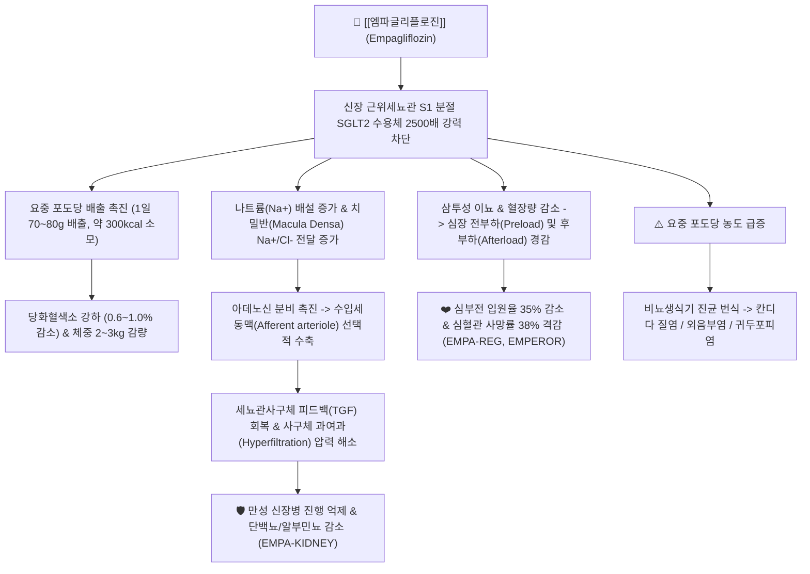
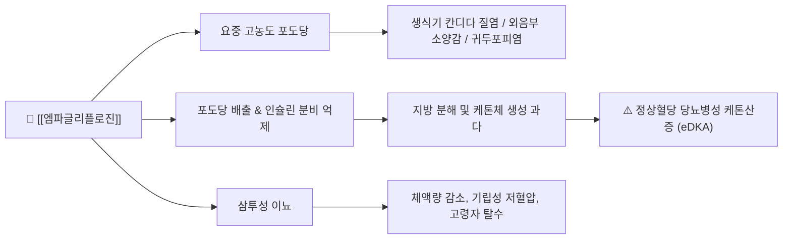

---
aliases:
  - Jardiance
  - 자디앙
  - 자디앙정
  - 엠파글리플로진
  - Empagliflozin
  - A10BK03
tags:
  - 약리/양방약
  - 내분비대사계
  - 당뇨병치료제
  - SGLT2억제제
  - 심혈관보호제
  - 신장보호제
---

# 💊 [[엠파글리플로진]] (Empagliflozin, Jardiance, A10BK03)

> **핵심 3줄 요약 (Key Summary)**:
> 🧪 주성분·제형: [[엠파글리플로진]] (Empagliflozin) 단일 성분, SGLT2에 대한 선택성이 2,500배로 동 계열 중 가장 높은 경구용 SGLT2 억제제, 담황색 원형(10mg) 및 타원형(25mg) 필름코팅정.
> 📍 작용 기전: 신장 근위세뇨관 S1 분절의 SGLT2 수용체를 선택적 차단하여 1일 70~80g 요당 배출, 세뇨관사구체 피드백(TGF) 정상화로 사구체 과여과 억제, 심근 NHE1 억제 및 전부하·후부하 감소.
> 🎯 임상 적응증: 제2형 당뇨병 혈당 조절, 심혈관질환 동반 당뇨 환자의 심혈관 사망 감소(EMPA-REG OUTCOME), 박출률 감소(HFrEF) 및 보존(HFpEF) 만성 심부전(EMPEROR), 만성 신장병(EMPA-KIDNEY).
> ⚠️ 주의사항: 생식기 진균 감염(칸디다 질염/귀두포피염), 정상혈당 당뇨병성 케톤산증(eDKA), 체액량 감소 및 탈수(고령자 주의), 드물지만 치명적인 회음부 괴사성 근막염(푸르니에 괴저).

---

## 📌 목차
1. [약물 기본 정보 및 시판 제품 (Brand Identification)](#1-약물-기본-정보-및-시판-제품-brand-identification)
2. [분자 약리 기전 및 작용 경로 (Mechanism of Action)](#2-분자-약리-기전-및-작용-경로-mechanism-of-action)
3. [약동학적 특성 (Pharmacokinetics: ADME)](#3-약동학적-특성-pharmacokinetics-adme)
4. [임상 용법·용량 및 처방 가이드 (Dosage & Administration)](#4-임상-용법용량-및-처방-가이드-dosage--administration)
5. [부작용, 경고 및 약물 상호작용 (Adverse Effects & Interactions)](#5-부작용-경고-및-약물-상호작용-adverse-effects--interactions)
6. [한의 치료 연계 및 병용/테이퍼링 프로토콜 (Integrative Medicine)](#6-한의-치료-연계-및-병용테이퍼링-프로토콜-integrative-medicine)
7. [💡 사용자 진료실 핵심 필기 & 실전 임상 체크리스트](#7--사용자-진료실-핵심-필기--실전-임상-체크리스트)
8. [출처 및 학술 참고 문헌 (References)](#8-출처-및-학술-참고-문헌-references)

---

## 1. 약물 기본 정보 및 시판 제품 (Brand Identification)

> [!abstract]+ 🧪 3D 약리 분자 구조 (Interactive 3D Viewer)
> <iframe src="https://molecule-viewer-rho.vercel.app/?cid=11949646" width="100%" height="450px" frameborder="0" allow="webgl" style="border-radius: 8px;"></iframe>

![[SGLT2_자디앙_패키지.jpg|350]]
> [그림 1] [[엠파글리플로진]]의 대표적인 시판 완제의약품 패키지 외형 (베링거인겔하임/일라이릴리 오리지널 자디앙정)

![[엠파글리플로진_3D구조.png|300]]
> [그림 2] [[엠파글리플로진]]의 3차원 입체 화학 분자 구조 (PubChem CID 11949646)

![[엠파글리플로진_화학구조.png|300]]
> [그림 3] [[엠파글리플로진]]의 2D 평면 화학 분자 구조식

| 항목 | 상세 정보 |
| :--- | :--- |
| **일반명 (Generic Name)** | [[엠파글리플로진]] / Empagliflozin |
| **대표 상품명 (Brand Names)** | **자디앙정 (Jardiance, 베링거인겔하임 오리지널), 자디앙듀오정 (메트포르민 복합제)** |
| **ATC 코드 / 분류** | A10BK03 (Sodium-glucose co-transporter 2 (SGLT2) inhibitors) / 식약처 분류 396 (당뇨병용제) |
| **PubChem CID** | [11949646](https://pubchem.ncbi.nlm.nih.gov/compound/11949646) |
| **화학식 / 분자량** | C23H27ClO7 / 450.9 g/mol |
| **주요 제형 및 성상** | 10mg: 담황색 원형 양면 볼록 필름코팅정 (한 면에 'S10' 각인, 다른 면에 보링거 로고) 25mg: 담황색 타원형 양면 볼록 필름코팅정 (한 면에 'S25' 각인, 다른 면에 보링거 로고) |
| **식약처 허가 적응증** | 1. 제2형 당뇨병 성인 환자의 혈당 조절 향상을 위한 단독 및 병용요법 2. 심혈관계 질환이 확인된 제2형 당뇨병 환자에서 심혈관계 사망 위험 감소 3. 만성 심부전 성인 환자(좌심실 박출률 무관: HFrEF 및 HFpEF 모두 포함)에서 심혈관계 사망 및 심부전 입원 위험 감소 4. 만성 신장병(CKD) 성인 환자에서 신장병 진행 또는 심혈관계 사망 위험 감소 |

### 1.1 대표 시판 제품 및 복합제 매핑 (Brand Identification & Combinations)

| 구분 | 대표 제품명 / 브랜드 | 함유 성분 및 1회당 함량 | 제형 및 특징 | 주요 적응증 및 복약 지도 핵심 |
| :--- | :--- | :--- | :--- | :--- |
| **단일제 (오리지널 ETC)** | [[자디앙]] (10mg, 25mg) | [[엠파글리플로진]] 10mg 또는 25mg | 필름코팅정 (1일 1회 경구 복용) | 2형 당뇨 1차/2차, 심부전, 만성 신장병 표준 투여 |
| **메트포르민 복합제 (ETC)** | 자디앙듀오정 | [[엠파글리플로진]] + [[메트포르민]] (5/500, 5/850, 5/1000, 12.5/500, 12.5/850, 12.5/1000mg) | 복합 필름코팅정 (1일 2회 식사와 함께 복용) | 인슐린 감수성 개선과 요당 배출의 이중 기전, 위장장애 완화 위해 식사 직후 복용 |
| **DPP-4i 3제/2제 복합제 (ETC)** | 에스글리토정 | [[엠파글리플로진]] + 리나글립틴 | 복합정 | 인슐린 분비 촉진과 요당 배출 시너지, 췌장과 신장 동시 타깃 |
| **동 계열 경쟁 단일제** | [[포시가]] | [[다파글리플로진]] (10mg) | 필름코팅정 | 최초 승인 SGLT2 억제제, DAPA-HF 및 DAPA-CKD 입증 |

---

## 2. 분자 약리 기전 및 작용 경로 (Mechanism of Action)

* **신장 근위세뇨관 SGLT2 초선택적 저해 (SGLT2:SGLT1 선택비 > 2,500배)**:
  * 정상 신장에서는 사구체에서 여과된 포도당의 약 90%가 근위세뇨관 S1/S2 분절에 존재하는 SGLT2(Sodium-glucose co-transporter 2)에 의해 나트륨과 함께 능동적으로 재흡수됩니다.
  * [[엠파글리플로진]]은 포도당과 경쟁적으로 결합하여 SGLT2를 강력하게 차단함으로써 요당 재흡수를 막고 1일 약 70~80g(약 280~320 kcal에 상당)의 포도당을 소변으로 강제 배출시킵니다.
  * [[다파글리플로진]](선택비 약 1,200배), 카나글리플로진(선택비 약 250배) 대비 2,500배 이상의 압도적인 SGLT2 선택성을 나타내어 장관의 포도당 흡수를 담당하는 SGLT1 저해에 따른 삼투성 설사나 위장장애 부작용이 극히 적습니다.

* **세뇨관사구체 피드백(TGF: Tubuloglomerular Feedback) 정상화와 신장 혈류역학 개선**:
  * 당뇨병 초기에는 근위세뇨관의 SGLT2 발현이 증가하여 포도당과 나트륨의 과도한 재흡수가 일어납니다. 이로 인해 원위세뇨관의 치밀반(Macula densa)에 도달하는 나트륨과 염소 이온이 고갈됩니다.
  * 치밀반은 이를 신혈류량 부족으로 오인하여 아데노신 분비를 줄이고, 수입세동맥이 비정상적으로 확장되면서 사구체 내압이 병적으로 치솟는 **사구체 과여과(Glomerular Hyperfiltration)**가 유발됩니다.
  * [[엠파글리플로진]]은 치밀반으로의 나트륨 전달을 회복시켜 아데노신 분비를 정상화하고, 수입세동맥을 적절히 수축시켜 **사구체 내압을 즉각적으로 낮추어 사구체 기저막 손상과 족세포(Podocyte) 탈락을 차단**합니다. 투여 초기 나타나는 가역적인 eGFR 감소(초기 딥: Initial dip, 2~4 mL/min/1.73m2)는 바로 이 사구체 내압 감소의 약리적 증거입니다.

* **심장 대사 최적화 및 심혈관 보호 기전 (Cardiac Substrate Switching & NHE1 Inhibition)**:
  * **에너지 기질 전환**: 인슐린 분비 감소와 글루카곤 분비 증가로 간에서 지방산 산화가 촉진되어 가벼운 고케톤혈증(Hyperketonemia)을 유도합니다. 심근은 산소 소모 대비 ATP 생산 효율이 매우 높은 $\beta$-하이드록시부티레이트(Ketone body)를 효율적인 '슈퍼 연료'로 사용하여 심근 에너지 결핍을 극복합니다.
  * **심근 세포 내 나트륨/칼슘 과부하 차단**: 심근세포막의 Na+/H+ 교환체(NHE1)를 직접 억제하여 세포 내 나트륨 및 칼슘 축적을 막고, 미토콘드리아 내 칼슘 농도를 회복시켜 심근 확장기 이완 기능을 개선하고 부정맥 발생을 억제합니다.

---

## 3. 약동학적 특성 (Pharmacokinetics: ADME)

| 약동학 파라미터 | 수치 및 임상적 의미 |
| :--- | :--- |
| **생체이용률 (Bioavailability, F)** | 약 60~65% (경구 투여 후 신속하게 흡수됨) |
| **최고혈중농도 도달시간 (Tmax)** | 1.0~1.5 시간 (공복 투여 시 1시간 내외, 고지방식과 함께 투여 시 경미한 지연이 있으나 AUC 변화 없어 **식사 무관 복용 가능**) |
| **혈장 단백결합률 (Protein Binding)** | 86.2% (주로 알부민과 결합, 적혈구 분배율 36.8%) |
| **간 대사 효소 (Metabolism)** | 주로 간과 신장의 UGT(Uridine 5'-diphospho-glucuronosyltransferase) 효소군에 의한 비활성 글루쿠론산 포합 대사 (UGT2B7, UGT1A3, UGT1A8, UGT1A9). **CYP450 효소 매개 대사는 1% 미만으로 극히 미미** |
| **배설 반감기 (Elimination t1/2)** | 약 12.4 시간 (1일 1회 일정한 복용 간격 유지에 최적화) |
| **주요 배설 경로 (Excretion)** | 총 방사능 표지 용량의 약 54.4%가 소변으로, 약 41.2%가 대변(담즙)으로 배설됨. 소변 배설량 중 약 절반은 미변화체로 배설 |
| **분포용적 (Vd/F)** | 약 73.8 L (조직으로의 광범위한 분포) |

---

## 4. 임상 용법·용량 및 처방 가이드 (Dosage & Administration)

| 임상 적응증 | 성인 표준 용법·용량 | 1일 최대 한도 용량 |
| :--- | :--- | :--- |
| **제2형 당뇨병 (혈당 조절)** | 1일 1회 10mg 아침 복용 (식사 무관). 혈당 조절 불충분 시 내약성이 우수한 경우 1일 1회 25mg으로 증량 가능 | 최대 25mg/day |
| **심부전 (HFrEF / HFpEF)** | 1일 1회 10mg 아침 복용 (추가 증량 없이 10mg 고정 용량으로 심혈관 및 신장 보호 효과 달성) | 10mg/day |
| **만성 신장병 (CKD)** | 1일 1회 10mg 아침 복용 (단백뇨 감소 및 신질환 진행 억제 목적) | 10mg/day |

### 4.1 신기능(eGFR)에 따른 용량 조절 가이드라인 (최신 가이드라인 반영)
* **eGFR $\ge$ 20 mL/min/1.73m2**: 용량 조절 없이 1일 1회 10mg 투여 가능 (EMPA-KIDNEY 랜드마크 결과 반영으로 기존 30 기준에서 20으로 적응증 확대).
* **eGFR < 20 mL/min/1.73m2**: 신규 투여 시작은 권장되지 않음. 단, 기존 복용 환자가 20 미만으로 저하된 경우 투석(말기신부전)을 시작하기 전까지 신장·심장 보호를 위해 10mg 유지를 고려할 수 있음.
* **혈당 강하 효과의 한계**: eGFR < 45 mL/min/1.73m2에서는 사구체 여과 포도당 총량이 줄어들어 혈당(HbA1c) 강하 효과는 미미해지나, **사구체 과여과 억제, 단백뇨 감소, 심부전 입원 예방 등 심혈관·신장 보호 효과는 강력하게 유지**되므로 중단하지 않습니다.

---

## 5. 부작용, 경고 및 약물 상호작용 (Adverse Effects & Interactions)

### 5.1 주요 부작용 및 독성 경고
* **비뇨생식기 진균 감염 (Vulvovaginal Candidiasis & Balanitis)**:
  * 발생 빈도 약 4~6%로 여성 환자에서 질염, 외음부 가려움증, 남성 환자(특히 포경수술을 받지 않은 경우)에서 귀두포피염 발생.
  * 요중 당 농도가 상승하여 칸디다균의 증식이 쉬운 환경이 조성되기 때문이며, 대다수는 국소 항진균제나 한의 치료로 조절 가능합니다.
* **정상혈당 당뇨병성 케톤산증 (Euglycemic DKA: eDKA)**:
  * 혈당이 정상이거나 경미하게 높은 상태(< 250 mg/dL)에서도 대사성 산증(음이온차 증가)과 혈중 케톤체 상승이 발생하는 치명적 합병증.
  * 원인: 요당 배출로 혈당이 낮아져 췌장의 내인성 인슐린 분비가 줄어들고 글루카곤이 상승하여 지방 조직에서 급격한 지방산 분해와 케톤산 생성이 촉발됨.
  * **수술 예정 3~4일 전, 급성 질환, 금식, 알코올 과음, 극단적 저탄수화물(케토제닉) 식이 중에는 반드시 일시 중단(Drug holiday)**해야 합니다.
* **체액량 결손 및 급성 신손상 위험 (Volume Depletion & Prerenal AKI)**:
  * 삼투성 이뇨로 인해 일일 소변량이 300~500mL 증가하여 저혈압, 어지러움, 기립성 저혈압이 발생할 수 있습니다.
  * 특히 루프 이뇨제(푸로세미드 등)를 병용하는 고령 환자에서 신전성 급성 신손상이 촉발될 수 있으므로 충분한 수분 섭취(하루 1.5~2L)를 지도합니다.
* **푸르니에 괴저 (Fournier's Gangrene)**:
  * 회음부의 괴사성 근막염으로 매우 드물지만 생명을 위협하는 응급 질환. 회음부의 극심한 통증, 발적, 부종, 발열 동반 시 즉각적인 외과적 절제 및 광범위 항생제 투여가 필요합니다.

### 5.2 주요 병용 금기 및 상호작용
* **루프 이뇨제 ([[푸로세미드]] 등)**: 이뇨 효과 상승으로 중증 저혈압, 저나트륨혈증, 탈수 및 신전성 질소혈증 발생 위험 급증. 이뇨제 감량을 우선 고려.
* **인슐린 및 설포닐우레아 (SU, 글리메피리드 등)**: 단독 투여 시 저혈당 위험은 극히 낮으나, 인슐린이나 SU와 병용 시 저혈당 빈도가 증가하므로 병용 시 SU나 인슐린 용량을 10~20% 선제적 감량.
* **UGT 유도제 (리팜핀, 페니토인 등)**: 엠파글리플로진의 글루쿠론산 포합을 촉진하여 혈중 농도(AUC)를 약 35% 감소시킬 수 있음.
* **NSAIDs 및 ARB/ACEi ([[로사르탄]] 등)**: 사구체 수입/수출세동맥을 동시에 억제하여 초기 eGFR 저하가 심화될 수 있으므로 탈수 상태에서 병용 시 주의.

---

## 6. 한의 치료 연계 및 병용/테이퍼링 프로토콜 (Integrative Medicine)

### 6.1 한약·양약 병용 투여 안전성 및 시너지 배오

* **생식기 칸디다 감염증 제어: [[용담사간탕]], [[팔정산]]**:
  * 환자가 당뇨, 심부전, 신장 보호를 위해 생명줄과 같은 SGLT2 억제제를 복용하다가 심한 외음부 소양감 및 냉대하로 인해 임의 중단하는 경우가 흔합니다.
  * 한의학적으로 이는 **습열하주(濕熱下注)**에 해당하며, 청열조습(淸熱燥濕) 효능을 지닌 **[[용담사간탕]]** 또는 **[[팔정산]]**을 3~5일 단기 병용 투여하면 요당 환경에서도 칸디다균의 과증식과 국소 염증을 신속하게 진정시켜 환자가 양약을 중단 없이 안전하게 지속 복용할 수 있도록 돕습니다.

* **신장 기능 보전 및 수기(水氣) 대사 조절: [[육미지황환]], [[팔미지황환]], [[진무탕]], [[오령산]]**:
  * SGLT2 억제제의 사구체 과여과 억제와 신장 세뇨관 보호 작용은 한의학의 **보신익정(補腎益精) 및 온양화기(溫陽化氣)** 기전과 상통합니다.
  * 신허(腎虛)로 인한 단백뇨 환자에게 **[[육미지황환]]** 또는 **[[팔미지황환]]**을 배오하면 족세포 보호 및 족부 부종 완화에 상승적 시너지를 발휘합니다.
  * 심부전 환자의 울혈성 부종 및 수종(水腫)에는 **[[진무탕]]** 또는 **[[오령산]]**을 병용하여 전신 수액 대사를 정상화하고 양약 이뇨제 용량을 줄일 수 있습니다.

* **대사증후군 습담(濕痰) 제거: [[태음조위탕]], [[방풍통성산]]**:
  * 비만형 2형 당뇨 환자에서 요당 배출로 소모되는 300kcal의 대사 결핍 상태에 체질 처방인 **[[태음조위탕]]** 또는 **[[방풍통성산]]**을 결합하면 인슐린 저항성을 개선하고 내장지방 감량을 가속화합니다.

### 6.2 양약 감량 및 한의 전환(테이퍼링) 가이드
* **심혈관/신장 보호 목적의 환자 (비테이퍼링 원칙)**:
  * eGFR 저하를 동반한 만성 신장병(CKD) 또는 심부전(HF) 환자가 복용 중인 [[엠파글리플로진]]은 단순 혈당 강하제가 아닌 **장기 생존율 향상제(Prognostic Modifier)**이므로, 한의 치료를 통해 혈당이 정상이 되었더라도 **임의로 양약을 테이퍼링하거나 중단하지 않고 평생 유지**하는 것이 원칙입니다.
* **병용 약물 우선 감량 원칙**:
  * 한약 및 침구 치료를 통해 당화혈색소(HbA1c)와 공복혈당이 개선되면, 저혈당 위험과 췌장 베타세포 고갈을 초래하는 **설포닐우레아(글리메피리드)나 인슐린을 먼저 30~50% 단계적으로 감량/중단**하고, 엠파글리플로진은 최종 방어선으로 보존합니다.

---

## 7. 💡 사용자 진료실 핵심 필기 & 실전 임상 체크리스트

### 7.1 진료실 3대 핵심 문진 체크리스트
1. **외음부 소양감 및 배뇨통 문진**: "소변볼 때 찌릿하거나 밑(생식기)이 가렵고 분비물이 늘지 않았습니까?" (칸디다 질염 조기 발견).
2. **탈수 및 어지러움 확인**: "일어설 때 핑 돌거나 목이 유난히 마르고 소변을 너무 자주 보지 않습니까?" (고령자 및 이뇨제 병용자 탈수 확인).
3. **eDKA 의심 증상(오심, 구토, 복통, 호흡곤란) 문진**: 혈당이 150 미만으로 정상이어도 환자가 전신 쇠약감, 오심, 구토, 과호흡을 호소하면 즉시 eDKA를 의심하고 응급실 전원 조치.

### 7.2 실전 복약 지도 스크립트
> "원장님, 자디앙은 소변으로 하루 밥 반 공기 분량의 설탕을 빼내서 혈당을 낮추고 콩팥과 심장을 튼튼하게 지켜주는 아주 훌륭한 약입니다. 다만 소변에 당분이 많아지므로 곰팡이균이 생기기 쉬우니, 소변을 보신 후에는 습하지 않게 잘 닦아주시고, 하루 물을 1.5~2리터 이상 충분히 드셔야 탈수가 안 생깁니다. 만약 생식기가 가렵거나 붓는 증상이 생기면 약을 끊지 마시고 저희 한의원에 오셔서 가려움을 가라앉히는 한약을 3~4일 복용하시면 완벽히 가라앉습니다."

---

## 8. 출처 및 학술 참고 문헌 (References)

* Zinman B, Wanner C, Lachin JM, Fitchett D, Bluhmki E, Hantel S, Mattheus M, Devins T, Johansen OE, Woerle HJ, Broedl UC, Inzucchi SE; EMPA-REG OUTCOME Investigators. Empagliflozin, Cardiovascular Outcomes, and Mortality in Type 2 Diabetes. *N Engl J Med*. 2015 Nov 26;373(22):2117-28. [PMID: 26378978](https://pubmed.ncbi.nlm.nih.gov/26378978/) | [DOI: 10.1056/NEJMoa1504720](https://doi.org/10.1056/NEJMoa1504720)
  * `[연구 요약]` 심혈관 고위험 제2형 당뇨 환자 7,020명을 대상으로 엠파글리플로진 투여 시 심혈관 사망률 38% 감소, 전체 사망률 32% 감소, 심부전 입원율 35% 감소라는 극적인 심혈관 보호 효과를 인류 의학사 최초로 입증한 기념비적 무작위 대조 시험(RCT).

* Packer M, Anker SD, Butler J, Filippatos G, Pocock SJ, Carson P, Januzzi J, Verma S, Tsutsui H, Brueckmann M, Jamal W, Kimura K, Schnecke V, Zeller C, Cotton D, Bocchi E, Böhm M, Choi DJ, Chopra V, Chuquiure E, Giannetti N, Janssens S, Zhang J, Gonzalez Juanatey JR, Kaul S, Martinez FA, Merkely B, Nicholls SJ, Perrone SV, Pina I, Ponikowski P, Sattar N, Senni M, Seronde MF, Spinar J, Squire I, Taddei S, Wanner C, Zannad F; EMPEROR-Reduced Trial Investigators. Cardiovascular and Renal Outcomes with Empagliflozin in Heart Failure. *N Engl J Med*. 2020 Oct 8;383(15):1413-1424. [PMID: 32865377](https://pubmed.ncbi.nlm.nih.gov/32865377/) | [DOI: 10.1056/NEJMoa2022190](https://doi.org/10.1056/NEJMoa2022190)
  * `[연구 요약]` 박출률 감소 심부전(HFrEF) 환자 3,730명을 대상으로 당뇨병 동반 여부와 무관하게 엠파글리플로진이 심혈관 사망 및 심부전 입원 복합 위험을 25% 유의하게 낮추고 eGFR 감소율을 지연시킴을 증명.

* Anker SD, Butler J, Filippatos G, Ferreira JP, Bocchi E, Böhm M, Brunner-La Rocca HP, Choi DJ, Chopra V, Chuquiure-Valenzuela E, Giannetti N, Gomez-Mesa JE, Janssens S, Januzzi JL, Gonzalez-Juanatey JR, Merkely B, Nicholls SJ, Perrone SV, Piña IL, Ponikowski P, Senni M, Sim D, Spinar J, Squire I, Taddei S, Tsutsui H, Verma S, Vinereanu D, Zhang J, Carson P, Lam CSP, Marx N, Zeller C, Sattar N, Jamal W, Schnaidt S, Schnecke V, Brueckmann M, Pocock SJ, Zannad F, Packer M; EMPEROR-Preserved Trial Investigators. Empagliflozin in Heart Failure with a Preserved Ejection Fraction. *N Engl J Med*. 2021 Oct 14;385(16):1451-1461. [PMID: 34449189](https://pubmed.ncbi.nlm.nih.gov/34449189/) | [DOI: 10.1056/NEJMoa2107038](https://doi.org/10.1056/NEJMoa2107038)
  * `[연구 요약]` 치료 옵션이 전무했던 박출률 보존 심부전(HFpEF, LVEF > 40%) 환자 5,988명에서 엠파글리플로진이 심혈관 사망 또는 심부전 입원 위험을 21% 유의하게 감소시켜 최초의 HFpEF 표준 치료제로 등극한 랜드마크 연구.

* The EMPA-KIDNEY Collaborative Group; Herrington WG, Staplin N, Wanner C, Green JB, Hauske SJ, Emberson JR, Preiss D, Judge P, Mayne KJ, Ng SYA, Sammons E, Zhu D, Hill M, Wallendszus K, Brenner S, Cheung AK, Liu ZH, Li J, Hooi LS, Liu W, Kadowaki T, Nangaku M, Levin A, Cherney D, Maggioni AP, Pontremoli R, Deo R, Goto S, Rossing P, Steubl D, Petrini M, Landray MJ, Baigent C, Haynes R. Empagliflozin in Patients with Chronic Kidney Disease. *N Engl J Med*. 2023 Jan 12;388(2):117-127. [PMID: 36331190](https://pubmed.ncbi.nlm.nih.gov/36331190/) | [DOI: 10.1056/NEJMoa2204233](https://doi.org/10.1056/NEJMoa2204233)
  * `[연구 요약]` eGFR 20~45 또는 알부민뇨 동반 eGFR 45~90인 광범위한 만성 신장병(CKD) 환자 6,609명을 대상으로 엠파글리플로진이 신질환 진행 또는 심혈관 사망 위험을 28% 감소시킴으로써 eGFR 20까지의 신장 보호 적응증을 공식 확립한 핵심 임상시험.

* Fitchett D, Zinman B, Inzucchi SE, Wanner C, Anker SD, Pocock S, Mattheus M, Vedin O, Lund SS. Effect of empagliflozin on total myocardial infarction events by type and additional coronary outcomes: insights from the randomized EMPA-REG OUTCOME trial. *Cardiovasc Diabetol*. 2024 Jul 11;23(1):248. [PMID: 38992713](https://pubmed.ncbi.nlm.nih.gov/38992713/) | [DOI: 10.1186/s12933-024-02328-6](https://doi.org/10.1186/s12933-024-02328-6)
  * `[연구 요약]` EMPA-REG OUTCOME 사후 분석을 통해 엠파글리플로진이 제2형 당뇨 환자의 자발성 심근경색(Type 1 MI) 및 공급-요구 불일치 심근경색(Type 2 MI)을 포함한 전반적 관상동맥 사건 발생을 실질적으로 억제함을 규명.
