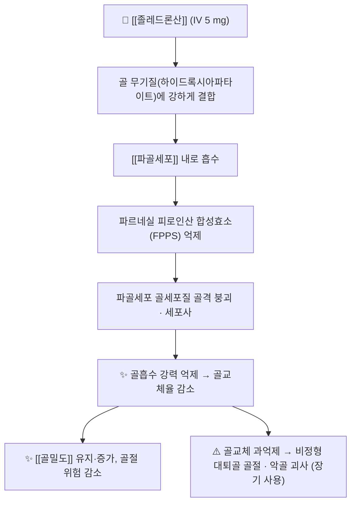

# 💊 졸레드론산 (Zoledronic acid / Zoledronate, ATC M05BA08)

> 🖼️ **이미지**: ①2D 구조식(PubChem CID 68740) ②정제 성상 일반 도해(실제 제품 아님 — 명시).
> ⚠️ **미확보 이미지 보고**: **국내 시판 제품(주사제) 패키지 실사 1장 미확보** — 식약처 제품허가정보(08) 조회 결과 졸레드론산 21개 품목 모두 `BIG_PRDT_IMG_URL`이 비어 있었고(2026-09-26 실측), Commons는 레이트리밋(HTTP 429)으로 추가 확보가 불가했다.

> **핵심 3줄 요약 (Key Summary)**:
> 🧪 주성분·제형: 3세대 **질소 함유 비스포스포네이트** — 골다공증에는 **5 mg 정맥주입 1년 1회**로 쓰는 주사제(국내 다수 품목 5 mg/100 mL).
> 📍 작용 기전: 파골세포의 **파르네실 피로인산 합성효소(FPPS) 억제** → 파골세포 기능·생존 억제 → 골흡수 강력 억제. 골조직에 오래 잔류한다 → [[골 재형성]] · [[파골세포]]
> 🎯 임상 적응증: 폐경 후 골다공증, 남성 골다공증, 글루코코르티코이드 유발 골다공증, 파제트병. [[데노수맙]] 중단 후 전환 요법의 중심 약제.
> ⚠️ 주의사항: 투여 전 저칼슘혈증 교정 필수([[칼슘]]·[[비타민 D]]) · 급성기 반응(발열·근육통) · 신기능 악화 · 악골 괴사(치과 치료 선행) · 신기능 저하(크레아티닌청소율 <35 mL/min)에서는 사용하지 않는다.

---

## 📌 목차
1. [약물 기본 정보 및 시판 제품](#1-약물-기본-정보-및-시판-제품)
2. [분자 약리 기전 및 작용 경로](#2-분자-약리-기전-및-작용-경로)
3. [약동학적 특성](#3-약동학적-특성)
4. [용법·용량 및 처방 가이드](#4-용법용량-및-처방-가이드)
5. [부작용, 경고 및 약물 상호작용](#5-부작용-경고-및-약물-상호작용)
6. [한의 치료 연계 및 병용·테이퍼링 프로토콜](#6-한의-치료-연계-및-병용테이퍼링-프로토콜)
7. [💡 사용자 진료실 핵심 필기 & 실전 임상 체크리스트](#7--사용자-진료실-핵심-필기--실전-임상-체크리스트)
8. [출처 및 학술 참고 문헌 (References)](#8-출처-및-학술-참고-문헌-references)

---

## 1. 약물 기본 정보 및 시판 제품

![[졸레드론산_01_구조식.png|380]]
> [그림 1: 졸레드론산 2D 화학 구조식 — 이미다졸 고리 + 비스포스포네이트 골격 — **PubChem PNG 정본**, CID [68740](https://pubchem.ncbi.nlm.nih.gov/compound/68740)]

![[졸레드론산_02_정제_성상.jpg|380]]
> [그림 2: 정제(알약) 성상 일반 도해 — **졸레드론산 실제 제품 사진이 아니다**(졸레드론산은 주사제이며, 시판 패키지 사진을 확보하지 못해 일반 정제 이미지로 '제형 성상 슬롯'만 채웠다) — Wikimedia Commons, CC0]

> [!abstract]+ 🧪 3D 약리 분자 구조 (Interactive 3D Viewer)
> <iframe src="https://molecule-viewer-rho.vercel.app/?cid=68740" width="100%" height="450px" frameborder="0" allow="webgl" style="border-radius: 8px;"></iframe>

| 항목 | 상세 정보 |
| :--- | :--- |
| **일반명 (Generic Name)** | 졸레드론산일수화물 (Zoledronic acid monohydrate) |
| **대표 상품명 (Brand Names)** | 아클라스타(Aclasta)·리클레스트(Reclast, 골다공증 5 mg), 조메타(Zometa, 종양 관련 4 mg), 국내 다수 제네릭(유라스타주·졸레닉주·졸드론주사액 등, 5 mg/100 mL) |
| **ATC 코드 / 분류** | **M05BA08** (bisphosphonates) / 식약처 396 기타의 순환계용약 등 |
| **PubChem CID** | [68740](https://pubchem.ncbi.nlm.nih.gov/compound/68740) |
| **화학식 / 분자량** | C5H10N2O7P2 / 272.09 g/mol — 3세대 **질소 함유** 비스포스포네이트 |
| **주요 제형 및 함량** | **주사용액 5 mg/100 mL**(골다공증) · 4 mg/5 mL(종양 관련, 별도 용법) — **경구 제형 없음** |
| **허가 적응증(골대사)** | 폐경 후 골다공증 · 남성 골다공증 · 글루코코르티코이드 유발 골다공증 · 파제트병 |

### 1.1 국내 허가 품목 확인(2026-09-26 식약처 제품허가정보 08 실측)

| 확인 항목 | 결과 |
| :--- | :--- |
| 품목 수 | **21건** 반환 — 조메본프리필드주사 · 유라스타주 · 졸레닉주 · 조메타레디주사액 · 대웅졸레드론산주사액 · 원스본주 · 대한싸이텍주 · 졸드론주사액 · 조메드론주 등 |
| 제형 | 전부 **주사제(5 mg/100 mL 계열)**, 전신 성분명은 '졸레드론산일수화물' |
| 제품사진(`BIG_PRDT_IMG_URL`) | **전 품목 비어 있음** → 이미지 미확보 사유 |

---

## 2. 분자 약리 기전 및 작용 경로

* **주요 작용 기전**: 질소 함유 비스포스포네이트는 **FPPS를 억제해 파골세포의 골세포질 골격 형성과 생존을 차단**한다. 경구 비스포스포네이트보다 결합 친화도가 높아 정맥 1회로 강력·지속 효과를 낸다
* 핵심 차이(데노수맙과 비교): [[데노수맙]]은 RANKL을 중화하는 단클론항체로 골기질에 축적되지 않아 중단 시 반동이 온다. 졸레드론산은 **골조직에 잔류**해 중단해도 효과가 서서히 소실된다 — 그래서 데노수맙 중단 시 '전환 목적'으로 선택된다

---

## 3. 약동학적 특성

| 약동학 파라미터 | 수치 및 임상적 의미 |
| :--- | :--- |
| **생체이용률** | 정맥 투여(100%). 경구 제형 없음 |
| **골 분포** | 투여량의 상당 부분이 **골조직에 흡착**되어 수년간 잔류 — '반감기'가 아니라 **골교체율에 종속된 소실** |
| **혈장 소실** | 초기 급속 분포 후 소실(시간 단위) — 혈중 수치보다 골 잔류가 임상 효과를 결정 |
| **대사** | 대사되지 않고 형태 그대로 배설(체내 대사 없음) |
| **주요 배설 경로** | **신장(소변)** — 24시간 내 대부분 배설 |
| **⚠️ 신기능 의존성** | 크레아티닌청소율 **<35 mL/min에서는 골다공증 적응증에 사용하지 않는다**. 고령·탈수·이뇨제 복용 환자는 투여 전 신기능 확인이 필수 |

---

## 4. 용법·용량 및 처방 가이드

| 임상 적응증 | 표준 용법·용량 | 투여 조건 |
| :--- | :--- | :--- |
| **폐경 후 골다공증·남성 골다공증** | **5 mg 1회 정맥주입, 1년마다 반복** | 15분 이상 점적, 수분 보충 권장 |
| **글루코코르티코이드 유발 골다공증** | 5 mg 1회, 연 1회 | 동일 |
| **파제트병** | 5 mg 1회 단독 투여 | 단회 |
| **데노수맙 중단 후 전환(비허가·임상 관행)** | 5 mg 1회, 필요 시 12~24개월 간격 또는 골교체표지자 기반 재투여 | 전환 시점은 통상 **중단 후 6개월** → [[골교체표지자]] |

* 투여 전 필수 조건: [[칼슘]] · [[비타민 D]] 결핍 교정(저칼슘혈증 예방), 치과 검진 선행(악골 괴사 예방), 신기능·수분 상태 확인

---

## 5. 부작용, 경고 및 약물 상호작용

### 5.1 주요 부작용 및 독성 경고
* **급성기 반응(APR)**: 첫 투여 후 **24~72시간 내 발열·오한·근육통·관절통·두통** — 대개 첫 투여에서 가장 심하고 이후 투여에서 감소한다. 한의원 외래에서 '한약 반응'으로 오인하기 쉬운 증상이다
* [[저칼슘혈증]]: 투여 후 칼슘 저하 — **경련·감각이상·QT 연장**. 칼슘·비타민 D를 미리 채우지 않으면 위험
* **신기능 악화**: 급성신손상 보고. 탈수·기존 신장병·이뇨제 복용자에서 위험 → [[급성신손상]]
* **악골 괴사(ONJ)**: 발치·임플란트 등 침습적 치과 치료와 연관. **치료 시작 전 치과 검진**
* **비정형 대퇴골 골절·골교체 과억제**: 장기 사용 시 △ 허벅지 전면 통증 전구증상
* **심방세동**: 일부 연구에서 신호 보고 — 논란 있음

### 5.2 주요 병용 금기 및 상호작용
* **신독성 상가**: [[NSAIDs]](특히 경구·장기), 아미노글리코사이드, 조영제 병용 시 신기능 주의
* **저칼슘혈증 유발 약물**: 루프 이뇨제([[푸로세미드]])·고용량 스테로이드와 병용 시 교정 강화
* **동일 계열 중복**: 다른 비스포스포네이트·[[데노수맙]]과의 중복 투여는 골교체 과억제를 만든다

---

## 6. 한의 치료 연계 및 병용·테이퍼링 프로토콜

### 6.1 한약·양약 병용 투여 안전성 및 시너지 배오
* **간·신 대사 간섭 완충**: 신장 배설 의존 약물이므로 **신부전 위험 본초(예: 방기·관목통류) 사용을 피하고**, 수분 섭취 지도를 함께 한다
* **복용 시점 분리**: 정맥 주사지만, 같은 날 진료 시 급성기 반응과 침 치료 후 반응을 구분하기 어려우므로 **주사 당일에는 강한 자극 치료를 피하고** 2~3일 뒤로 조정한다
* **상승 배오**: 골·근 동시 관리를 위해 [[칼슘]]·[[비타민 D]] 1,000 mg/800 IU + 단백질 1.2~1.5 g/kg + 저항운동을 세트로 처방한다 → [[저항운동]] · [[골감소성 근감소증]]

### 6.2 양약 감량 및 한의 전환(테이퍼링) 가이드
* **원칙(중요)**: 환자가 '한약·침 치료를 위해' 골다공증 주사를 임의 중단하도록 권하지 않는다. **전환 처방이 확정된 뒤** 보조요법을 병행하는 순서를 지킨다 → [[데노수맙]]
* **중단 후 감시**: [[골교체표지자]] CTX를 3·6개월에 확인하고 상승 폭이 크면 재투여를 의뢰한다

---

## 7. 💡 사용자 진료실 핵심 필기 & 실전 임상 체크리스트

> 🛡️ **Melt-In 원칙**: 원장님 필기는 상부 섹션에 녹여내고, 여기엔 상부에 담기지 않은 진료실 노하우만 남긴다. (원장님 기존 필기 없음 — 신규 개념)

### 7.1 진료실 3대 핵심 문진 체크리스트
1. **"골다공증 주사를 맞으십니까? 어떤 주사인지, 마지막이 언제였는지"** — 데노수맙(6개월 간격)과 졸레드론산(1년 간격)을 구분한다. 끊은 시점이 골절 위험의 창이다
2. **치과 치료 계획** — 발치·임플란트 예정이면 시술 전에 주치의와 조정하도록 안내(악골 괴사)
3. **신기능·탈수·이뇨제** — 여름철·고령·이뇨제 복용자는 급성신손상 위험. 수분 섭취 지도

### 7.2 환자 티팅 스크립트
> *"이 주사는 1년에 한 번 맞는 뼈 약입니다. 맞은 뒤 2~3일은 열이 나고 몸이 쑤실 수 있는데, 이는 약이 일하는 과정에서 흔히 생기는 반응이고 다음 번에는 덜합니다. 대신 칼슘과 비타민 D가 부족하면 위험할 수 있어 미리 채워야 하고, 치과 치료가 필요하면 먼저 말씀해 주셔야 합니다."*

### 7.3 수기·침 치료 전 안전 확인
* **척추 골절 병력 · T-score ≤ −2.5 · 데노수맙 중단 후 6~18개월 · 장기 스테로이드** 환자에서는 강한 추나·관절가동술·흉추 압박 기법을 저강도로 조정하고 낙상 위험을 함께 평가한다 → [[척추 압박 골절]]

---

## 8. 출처 및 학술 참고 문헌 (References)

1. **Chen CH, et al. (2024)**. *Zoledronate Sequential Therapy After Denosumab Discontinuation to Prevent Bone Mineral Density Reduction: A Randomized Clinical Trial*. **JAMA Netw Open**, 7(11):e2443899. [PMID 39527056](https://pubmed.ncbi.nlm.nih.gov/39527056/) · [doi:10.1001/jamanetworkopen.2024.43899](https://doi.org/10.1001/jamanetworkopen.2024.43899)
   - **[연구 요약]**: 데노수맙 2년 이상 사용자 101명(ZOL 76 vs 데노수맙 지속 25). 1년차 요추 골밀도 **−0.68% vs +1.30%(p=0.03)**, 3년 이상 사용 하위군 **−3.20% vs +1.30%(p=0.003)** → **단회 졸레드론산으로는 반동을 상쇄하지 못한다**.
2. **Tsourdi E, et al. (2021)**. *Fracture risk and management of discontinuation of denosumab therapy: a systematic review and position statement by ECTS*. **J Clin Endocrinol Metab**, 106(1):264-281. [PMID 33103722](https://pubmed.ncbi.nlm.nih.gov/33103722/)
   - **[연구 요약]**: 데노수맙 중단 후 6개월 시점 전환, 고위험·장기 투여자에서 졸레드론산 우선, 골교체표지자 추적 — 학회 실무 알고리즘.
3. **Chandran M, et al. (2026)**. *Potent bisphosphonate therapy for preventing fractures after denosumab discontinuation in osteoporosis: A GRADE-assessed systematic review and meta-analysis*. **Medicine (Baltimore)**. [PMID 42700089](https://pubmed.ncbi.nlm.nih.gov/42700089/)
   - **[연구 요약]**: 데노수맙 중단 후 **강력 비스포스포네이트(졸레드론산 등)** 투여가 골밀도 소실·골절을 줄이는지 GRADE로 평가한 최신 정량합성 — 전환 전략의 현재 근거 수준 확인용.
4. **[doi:10.1016/j.jbspin.2025.105954](https://doi.org/10.1016/j.jbspin.2025.105954)** — *Strategies for denosumab discontinuation in postmenopausal osteoporosis*. **Joint Bone Spine** 2026. [PMID 40885300](https://pubmed.ncbi.nlm.nih.gov/40885300/)
   - **[연구 요약]**: 반동 위험 계층화·전환 요법 선택·CTX 감시 기준(300~400 ng/L) 정리.
5. **식품의약품안전처 의약품안전나라** — [nedrug.mfds.go.kr](https://nedrug.mfds.go.kr) · 제품허가정보 API(2026-09-26 조회, 21건)
   - **[공인 데이터]**: 국내 졸레드론산 품목(5 mg/100 mL 주사제) 목록. 제품사진 필드는 전 품목 비어 있음.
6. **이미지 출처**
   - 구조식: PubChem CID 68740 — PubChem 2D PNG
   - 정제 성상: [Dexamethasone tablets (Wikimedia Commons)](https://commons.wikimedia.org/wiki/File:Dexamethasone_tablets.jpg) — CC0 · **졸레드론산 실제 제품 아님(일반 정제 도해)**

---

## 📎 개념 학습 보충 (2026-09-26 논문 연계)

- 이 노트는 **2026-09-26 회차에서 신규 생성**된 양방약 개념 파일이다(🧪 [[2026-09-26_대사노인질환_심층리뷰]] 3번).
- **임상 핵심 한 줄**: 졸레드론산은 "데노수맙 끊을 때 이어받는 약"으로 기억하되, **장기(3년 이상) 데노수맙 사용자에게는 1회로 부족**할 수 있다는 것이 오늘 근거의 요지다 → [[데노수맙]] · [[골교체표지자]] · [[척추 압박 골절]]
