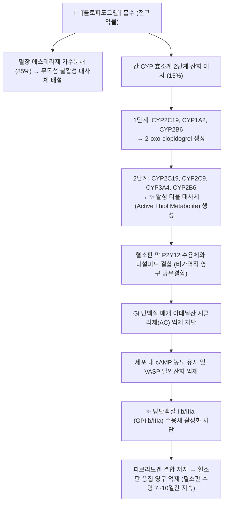

---
aliases:
  - Plavix
  - 플라빅스
  - 플라빅스정
  - 황산수소클로피도그렐
  - Clopidogrel
  - B01AC04
tags:
  - 약리/양방약
  - 심혈관계
  - 항혈전제
  - 항혈소판제
  - P2Y12억제제
---

# 💊 [[클로피도그렐]] (Clopidogrel Bisulfate, Plavix, B01AC04)

> **핵심 3줄 요약 (Key Summary)**:
> 🧪 주성분·제형: [[황산수소클로피도그렐]] (Clopidogrel bisulfate), Thienopyridine계 2세대 비가역적 혈소판 P2Y12 수용체 억제제, 분홍색 원형 필름코팅정(75mg, 300mg).
> 📍 작용 기전: 간 CYP2C19 대사를 통해 활성 티올 대사체로 전환된 후 혈소판 P2Y12 수용체에 비가역적 결합하여 ADP 매개 혈소판 응집 및 GPIIb/IIIa 복합체 활성화를 영구 차단.
> 🎯 임상 적응증: 급성 관상동맥 증후군(ACS) 및 스텐트 삽입술(PCI) 후 혈전증 예방(DAPT 요법), 허혈성 뇌졸중 및 말초동맥질환(PAD) 환자의 죽상혈전증 2차 예방(CAPRIE).
> ⚠️ 주의사항: FDA 블랙박스 경고(CYP2C19 저대사자에서 약효 감소 및 스텐트 혈전 위험), 오메프라졸 등 CYP2C19 억제제 병용 금기, 출혈 경향 및 침·부항 시 지혈 주의.

---

## 📌 목차
1. [약물 기본 정보 및 시판 제품 (Brand Identification)](#1-약물-기본-정보-및-시판-제품-brand-identification)
2. [분자 약리 기전 및 작용 경로 (Mechanism of Action)](#2-분자-약리-기전-및-작용-경로-mechanism-of-action)
3. [약동학적 특성 (Pharmacokinetics: ADME)](#3-약동학적-특성-pharmacokinetics-adme)
4. [임상 용법·용량 및 처방 가이드 (Dosage & Administration)](#4-임상-용법용량-및-처방-가이드-dosage--administration)
5. [부작용, 경고 및 약물 상호작용 (Adverse Effects & Interactions)](#5-부작용-경고-및-약물-상호작용-adverse-effects--interactions)
6. [한의 치료 연계 및 병용/테이퍼링 프로토콜 (Integrative Medicine)](#6-한의-치료-연계-및-병용테이퍼링-프로토콜-integrative-medicine)
7. [💡 사용자 진료실 핵심 필기 & 실전 임상 체크리스트](#7--사용자-진료실-핵심-필기--실전-임상-체크리스트)
8. [출처 및 학술 참고 문헌 (References)](#8-출처-및-학술-참고-문헌-references)

---

## 1. 약물 기본 정보 및 시판 제품 (Brand Identification)

> [!abstract]+ 🧪 3D 약리 분자 구조 (Interactive 3D Viewer)
> <iframe src="https://molecule-viewer-rho.vercel.app/?cid=60606" width="100%" height="450px" frameborder="0" allow="webgl" style="border-radius: 8px;"></iframe>

![[클로피도그렐_패키지.jpg|350]]
> [그림 1] [[클로피도그렐]]의 대표적인 시판 완제의약품 패키지 외형

![[클로피도그렐_알약.jpg|350]]
> [그림 2] 클로피도그렐 75mg 정제 성상 및 PTP 블리스터 포장

![[클로피도그렐_화학구조.png|300]]
> [그림 3] [[클로피도그렐]]의 2D 평면 화학 분자 구조식 (PubChem CID 60606)

| 항목 | 상세 정보 |
| :--- | :--- |
| **일반명 (Generic Name)** | [[클로피도그렐]] (황산수소클로피도그렐) / Clopidogrel bisulfate |
| **대표 상품명 (Brand Names)** | **플라빅스정 (Plavix, 사노피 오리지널), 플라비톨정, 클로아트정 등** |
| **ATC 코드 / 분류** | B01AC04 (Platelet aggregation inhibitors excl. heparin) / 식약처 분류 219 (기타의 순환계용약) |
| **PubChem CID** | [60606](https://pubchem.ncbi.nlm.nih.gov/compound/60606) (황산염: [9891820](https://pubchem.ncbi.nlm.nih.gov/compound/9891820)) |
| **화학식 / 분자량** | C16H16ClNO2S (황산염: C16H18ClNO6S2) / 321.8 g/mol (황산염: 419.9 g/mol) |
| **주요 제형 및 함량** | 경구용 필름코팅정 (75mg, 부하용량용 300mg) |
| **식약처 허가 적응증** | 1. 뇌경색, 심근경색 또는 말초동맥성 질환이 있는 성인 환자에서 죽상혈전성 사건의 감소<br>2. 급성 관상동맥 증후군(불안정형 협심증, NSTEMI, STEMI) 환자에서 죽상혈전성 사건의 감소<br>3. 심방세동 환자에서 뇌졸중을 포함한 혈관성 사건의 감소(비타민 K 길항제 투여 불가 시) |

### 1.1 대표 시판 제품 및 함유 복합제 매핑 (Brand Identification & Combinations)

| 구분 | 대표 제품명 / 브랜드 | 함유 성분 및 1회당 함량 | 제형 및 특징 | 주요 적응증 및 복약 지도 핵심 |
| :--- | :--- | :--- | :--- | :--- |
| **오리지널 단일제** | [[플라빅스]] 75mg | [[황산수소클로피도그렐]] 단일 (75mg) | 분홍색 원형 정제 | 1일 1회 식사와 무관하게 복용, 임의 중단 시 스텐트 혈전 위험 |
| **아스피린 복합제 (DAPT)** | [[플라빅스에이]], 코플라빅스 | [[클로피도그렐]] (75mg) + [[아스피린]] (100mg 장용과립) | 캡슐제, 이중정 | PCI 후 이중 항혈소판 요법, 위장관 출혈 및 멍 모니터링 |
| **제네릭 단일제** | [[플라비톨]], 클로아트 | [[클로피도그렐]] 단일 (75mg) | 정제 | 오리지널 동등 생물학적 동등성 입증 제네릭 |

---

## 2. 분자 약리 기전 및 작용 경로 (Mechanism of Action)



* **전구약물(Prodrug)의 간 대사 활성화 경로**:
  * 경구 흡수된 클로피도그렐의 약 85%는 혈장 카르복실에스테라제(CES1)에 의해 카르복실산 불활성 대사체로 가수분해되어 약효를 나타내지 못합니다.
  * 나머지 약 15%만이 간 마이크로솜의 시토크롬 P450 효소군에 의해 2단계의 산화 반응을 거쳐 불안정한 **활성 티올 대사체(Active thiol metabolite, R-130964)**로 전환됩니다.
  * 이 과정에서 **CYP2C19** 효소가 1단계와 2단계 대사 모두에서 가장 결정적인 역할을 담당합니다.
* **혈소판 P2Y12 수용체의 비가역적 차단 (Primary MoA)**:
  * 생성된 활성 티올 대사체의 반응성 설프히드릴(-SH)기가 혈소판 표면 $\text{P2Y}_{12}$ 수용체의 시스테인 잔기(Cys17 및 Cys270)와 **비가역적 디설피드(이황화) 공유결합**을 형성합니다.
  * ADP가 $\text{P2Y}_{12}$ 수용체에 결합하는 것을 영구적으로 차단하여, 혈소판 내 cAMP 저하를 방지하고 칼슘 유입을 억제합니다.
  * 최종적으로 피브리노겐이 결합하는 **GPIIb/IIIa 복합체의 입체 구조 변형(Inside-out signaling)을 봉쇄**하여 혈소판 혈전 형성을 강력하게 차단합니다.
  * 혈소판은 핵이 없어 새로운 단백질을 합성하지 못하므로, 차단 효과는 **해당 혈소판의 수명 전체(7~10일)** 동안 지속됩니다.

---

## 3. 약동학적 특성 (Pharmacokinetics: ADME)

| 약동학 파라미터 | 수치 및 임상적 의미 |
| :--- | :--- |
| **생체이용률 (Bioavailability, F)** | 최소 50% 이상 (음식물 섭취에 영향받지 않음) |
| **최고혈중농도 도달시간 (Tmax)** | 모약물 약 45분~1시간 (활성 대사체는 극히 반응성이 높아 혈중 반감기 수 분 이내) |
| **혈장 단백결합률 (Protein Binding)** | 모약물 98%, 주요 순환 대사체 94% (혈장 단백질에 고도 결합) |
| **간 대사 효소 (Metabolism)** | **CYP2C19** (핵심 유전 다형성 효소), CYP3A4, CYP2B6, CYP1A2 |
| **배설 반감기 (Elimination t1/2)** | 모약물 약 6시간 (임상적 항혈소판 효과는 비가역 결합으로 7~10일간 지속) |
| **주요 배설 경로 (Excretion)** | 투여량의 50% 소변 배설, 46% 담즙/분변 배설 (5일에 걸쳐 배설 완료) |

---

## 4. 임상 용법·용량 및 처방 가이드 (Dosage & Administration)

| 임상 적응증 | 성인 표준 용법·용량 | 1일 최대 한도 용량 | 임상 복약 지도 핵심 |
| :--- | :--- | :--- | :--- |
| **최근 심근경색, 허혈성 뇌졸중, 말초동맥질환** | 1일 1회 75mg 단회 경구 투여 | 75mg/day | 식사와 관계없이 매일 일정한 시간에 복용 |
| **급성 관상동맥 증후군 (NSTEMI / 불안정 협심증)** | 초기 부하 300mg 단회 투여 $\rightarrow$ 1일 75mg 유지 (아스피린 100mg 병용) | 유지 75mg/day (부하 300mg) | DAPT 요법 최소 12개월 지속 권고 |
| **ST절 상승 급성 심근경색 (STEMI)** | 75세 이하: 부하 300mg $\rightarrow$ 1일 75mg 유지<br>75세 초과: 부하 없이 1일 75mg 시작 | 75mg/day | 고령자 출혈 위험 감안하여 부하 용량 생략 |
| **스텐트(PCI) 시술 후 혈전 예방** | 부하 300~600mg $\rightarrow$ 1일 75mg 유지 | 75mg/day | 스텐트 내 급성 혈전증 예방 위해 임의 복용 중단 엄금 |

### 4.1 진료과별 다빈도 처방 패턴 (Sweet Spot vs 금기)
* **[✅ 최적 적응증 (Sweet Spot)]**:
  * **아스피린 불내성 환자**: 아스피린 복용 시 중증 위궤양, 천식(AERD), 알레르기가 있는 환자의 혈전 예방 1차 대체제.
  * **심장 스텐트 삽입 환자**: 약물방출스텐트(DES) 삽입 후 재협착 및 치명적 스텐트 혈전증을 방지하기 위한 DAPT 핵심 약물.
  * **말초동맥폐쇄질환(PAD)**: 하지 파행증, 당뇨병성 족부 혈관 협착 환자의 절단 및 혈관 사건 감소.
* **[⚠️ 신중 투여 및 금기 (Caution / Contraindication)]**:
  * **활동성 병리적 출혈 환자**: 소화성 궤양 출혈, 두개내 출혈(지주막하출혈 등) 환자 투약 절대 금기.
  * **중증 간장애 환자**: 응고인자 결손 및 출혈 소인 동반 시 금기.
  * **수술 및 발치 예정자**: 지혈 지연 위험으로 수술 5~7일 전 사전 중단 여부 주치의와 협의.

---

## 5. 부작용, 경고 및 약물 상호작용 (Adverse Effects & Interactions)

### 5.1 주요 부작용 및 독성 경고 (Black Box Warnings)

```
[🚨 FDA 블랙박스 경고 (Black Box Warning: CYP2C19 약물 대사능 저하)]
• 클로피도그렐의 효과는 간의 CYP2C19에 의한 활성 대사체 생성에 전적으로 의존함.
• CYP2C19 저대사자(Poor Metabolizer, *2/*3 대립유전자 보유자)는 활성 대사체 형성이 저하되어 항혈소판 작용이 약화되며, PCI 후 심근경색 및 스텐트 혈전증 발생 위험이 유의하게 높음.
• 한국인을 포함한 아시아인의 약 15~20%가 저대사자에 해당하므로, 치료 실패 고위험군에서는 대체 약제(프라수그렐, 티카그렐러) 고려.
```

* **출혈 (Bleeding)**:
  * 가장 흔한 이상반응(피하 멍, 혈종, 코피, 위장관 출혈). 대출혈 발생 시 신선동결혈장보다는 **혈소판 수혈**이 필요(비가역적 결합 때문).
* **혈전성 혈소판감소성 자반증 (TTP, Thrombotic Thrombocytopenic Purpura)**:
  * 투여 시작 2주 이내에 드물게 발생하며, 혈소판 감소, 미세혈관병성 용혈성 빈혈, 신경학적 장애, 발열, 신부전 징후를 보임. 즉시 혈장교환술(Plasmapheresis) 필요.

### 5.2 주요 병용 금기 및 상호작용

| 병용 약물 / 성분군 | 상호작용 기전 | 임상적 결과 및 대처 방안 |
| :--- | :--- | :--- |
| **CYP2C19 억제성 위장약 (PPI)** | [[오메프라졸]], [[에스오메프라졸]] | 클로피도그렐 활성화를 차단하여 **항혈소판 효과 급락 및 심혈관 사건 재발 위험** $\rightarrow$ **병용 금기**. 위보호 필요 시 [[판토프라졸]], [[라베프라졸]] 또는 H2RA([[파모티딘]]), [[레바미피드]] 선택 |
| **NSAIDs (소염진통제)** | [[이부프로펜]], [[나프록센]], [[아세클로페낙]] | 혈소판 억제 상승작용 + 위점막 프로스타글란딘 차단 $\rightarrow$ **위장관 출혈 위험 급증**. 진통 필요 시 아세트아미노펜 1차 고려 |
| **항응고제 (Warfarin / NOAC)** | [[와파린]], [[리바록사반]], [[아픽사반]] | 응고인자 억제와 혈소판 억제의 중복 $\rightarrow$ 치명적 대출혈 위험 급증. 삼중요법(Triple therapy) 시 철저한 모니터링 |
| **선택적 세로토닌 재흡수 억제제(SSRI)** | [[플루옥세틴]], [[세르트랄린]] | 혈소판 내 세로토닌 고갈로 혈소판 응집 억제 중복 $\rightarrow$ 출혈 경향 증가 |

---

## 6. 한의 치료 연계 및 병용/테이퍼링 프로토콜 (Integrative Medicine)

### 6.1 한의학적 병전(病轉) 변증 및 시너지 배오
* **어혈저락(瘀血阻絡) 및 기허혈어(氣虛血瘀)형 허혈성 뇌심혈관 질환**:
  * 반신불수, 언어장애, 흉통, 설암자(舌暗紫), 어반(瘀斑), 맥세삽(脈細澁).
  * **추천 처방**: [[보양환오탕]], [[혈부축어탕]], [[관심2호방]].
  * **배오 원리**: [[황기]](보기)로 혈류 추진력을 높이고, [[당귀]], [[천궁]], [[적작약]], [[단삼]]으로 미세순환을 개선하여 뇌·심장 허혈 부위의 혈류 재개통을 촉진.
* **활혈거어(活血祛瘀) 생약 병용 안전성 가이드**:
  * [[단삼]], [[은행엽]], [[삼칠]], [[홍화]], [[도인]] 등은 약리적으로 혈소판 응집 억제 및 혈류 개선 효과를 지님.
  * 클로피도그렐과 병용 시 미세혈관 출혈, 피하 어혈(멍), 잇몸 출혈 발생률이 증가할 수 있으므로, 고용량 활혈제를 피하고 통상 상용량 범위 내에서 신중히 배오.

### 6.2 침구 및 부항 치료 시 절대 안전 수칙
* **자락관법(습부항) 절대 금기**:
  * 클로피도그렐 복용 환자에게 사혈 후 부항을 거는 자락관법 시 국소 지혈 장애 및 광범위한 피하 혈종(Hematoma) 유발 위험이 높으므로 원칙적으로 금기하며, **건부항**으로 대체.
* **침구 시술 후 압박 지혈 프로토콜**:
  * 심부 근육 자침(둔근, 이상근, 경추 심부 등) 시 혈관 손상에 주의하며, 발침 후 최소 **3~5분간 알코올 솜으로 압박 지혈**을 시행하여 혈종 형성을 예방.

### 6.3 수술 및 치과 발치 시 테이퍼링 가이드
* **스텐트 시술 환자의 임의 중단 절대 금기**: 약물방출스텐트(DES) 삽입 후 6~12개월 이내에 클로피도그렐을 단 며칠이라도 임의 중단하면 치명적인 **급성 스텐트 혈전증(사망률 20~40%)**이 발생하므로 절대로 한의사나 환자가 단독 중단해서는 안 되며, 반드시 심장내과 주치의와 상의.
* **계획된 대수술 시 표준 휴약 기간**: 심장내과 승인 하에 **수술 5~7일 전** 복용을 중단하여 새로운 혈소판이 충분히 생성되도록 유도.

---

## 7. 💡 사용자 진료실 핵심 필기 & 실전 임상 체크리스트

### 7.1 진료실 3대 핵심 문진 체크리스트
1. **"심장 스텐트 시술을 받으신 지 얼마나 되셨나요?"**:
   * 스텐트 삽입 후 1년 이내의 환자는 생명과 직결되는 기간이므로 침·한약 치료 중에도 플라빅스를 절대로 임의로 거르거나 중단하지 않도록 엄격히 지도.
2. **"양치할 때 잇몸에서 피가 잘 안 멈추거나, 몸에 멍이 쉽게 드나요?"**:
   * 경미한 피하 출혈은 흔하나, 혈변, 흑색변, 혈뇨, 심한 두통 발생 시에는 즉시 소화관 또는 두개내 출혈을 의심하고 응급실로 전원.
3. **"속이 쓰려서 위장약(넥시움, 오메프라졸 등)을 함께 드시고 계신가요?"**:
   * 오메프라졸 계열은 플라빅스의 약효를 무력화하므로, 복약 수첩을 확인하여 판토프라졸이나 H2차단제로 처방 변경을 권고.

### 7.2 환자 티칭 스크립트
> *"환자분, 복용 중이신 플라빅스(클로피도그렐)는 혈관 속에서 피가 굳어 혈전이 생기는 것을 막아주는 매우 중요한 생명줄과 같은 약입니다. 특히 심장 스텐트를 넣으신 분들은 이 약을 며칠만 끊어도 스텐트가 막혀 응급 상황이 올 수 있으므로 절대로 임의로 중단하시면 안 됩니다. 다만 피를 맑게 하는 작용 때문에 침을 맞으신 후 멍이 들거나 피가 천천히 멈출 수 있으므로, 저희가 침 치료 후 충분히 지혈해 드릴 것입니다. 또한 속쓰림 약 중 일부(오메프라졸)는 이 약의 효과를 떨어뜨리므로 함께 드시는 약을 꼼꼼히 확인해 드리겠습니다."*

---

## 8. 출처 및 학술 참고 문헌 (References)

1. **식품의약품안전처 (MFDS)**. *의약품 품목허가사항 및 안전성 정보: 황산수소클로피도그렐 단일제 (플라빅스정)*.
   - [의약품안전나라 품목정보](https://nedrug.mfds.go.kr)
   - `[연구 요약]` 황산수소클로피도그렐의 죽상혈전증 예방 허가 적응증, 용법·용량, CYP2C19 유전적 저대사자 주의 경고 및 오메프라졸 병용 금기 공식 라벨.
2. **CAPRIE Steering Committee (1996)**. *A randomised, blinded, trial of clopidogrel versus aspirin in patients at risk of ischaemic events (CAPRIE)*. **The Lancet**, 348(9038), 1329-1339.
   - [PubMed (PMID: 8918275)](https://pubmed.ncbi.nlm.nih.gov/8918275/) | [DOI](https://doi.org/10.1016/s0140-6736(96)09457-3)
   - `[연구 요약]` CAPRIE 랜드마크 시험(19,185명): 허혈성 뇌졸중, 심근경색, 혈관 질환 환자에서 클로피도그렐(75mg)이 아스피린(325mg) 대비 복합 혈관 사건 발생 위험을 8.7% 유의하게 추가 감소시킴을 입증.
3. **Yusuf, S. et al. (The CURE Trial Investigators) (2001)**. *Effects of clopidogrel in addition to aspirin in patients with acute coronary syndromes without ST-segment elevation*. **New England Journal of Medicine**, 345(7), 494-502.
   - [PubMed (PMID: 11519503)](https://pubmed.ncbi.nlm.nih.gov/11519503/) | [DOI](https://doi.org/10.1056/NEJMoa010746)
   - `[연구 요약]` CURE 랜드마크 시험(12,562명): 비ST절 상승 급성 관상동맥 증후군 환자에서 아스피린 단독 요법 대비 클로피도그렐+아스피린 병용(DAPT)이 심혈관 사망, 심근경색, 뇌졸중 위험을 20% 유의하게 감소시킴을 규명하여 현대 DAPT의 표준 가이드라인 확립.
4. **Mega, J. L. et al. (2009)**. *Cytochrome p-450 polymorphisms and response to clopidogrel*. **New England Journal of Medicine**, 360(4), 354-362.
   - [PubMed (PMID: 19106084)](https://pubmed.ncbi.nlm.nih.gov/19106084/) | [DOI](https://doi.org/10.1056/NEJMoa0809171)
   - `[연구 요약]` CYP2C19 기능 소실 대립유전자(*2, *3 등)를 보유한 환자는 클로피도그렐 활성 대사체 혈중 농도가 32.4% 낮고 혈소판 응집 억제가 불충분하여, 스텐트 혈전증 위험이 3배 증가함을 밝혀내어 FDA 블랙박스 경고의 결정적 근거가 됨.
