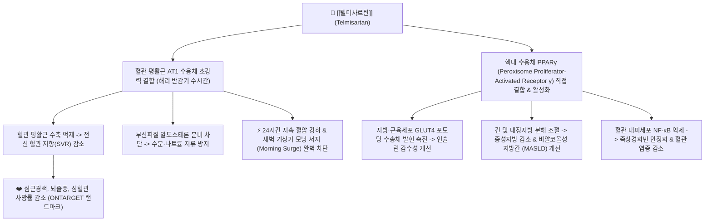
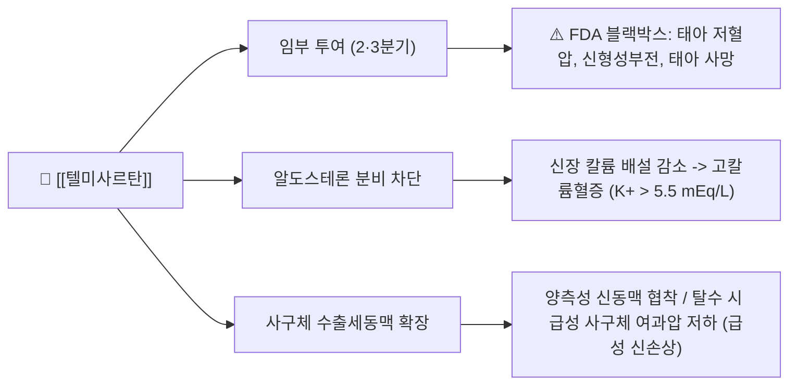

---
aliases:
  - Micardis
  - 미카르디스
  - 미카르디스정
  - 텔미사르탄
  - Telmisartan
  - C09CA07
tags:
  - 약리/양방약
  - 심혈관계
  - 혈압강하제
  - ARB
  - 안지오텐신수용체차단제
  - PPAR감마작용제
---

# 💊 [[텔미사르탄]] (Telmisartan, Micardis, C09CA07)

> **핵심 3줄 요약 (Key Summary)**:
> 🧪 주성분·제형: [[텔미사르탄]] (Telmisartan) 단일 성분, 모든 사르탄계 중 가장 긴 24시간 반감기와 최고 지용성을 지닌 2세대 경구용 ARB, 백색 타원형 정제(40mg, 80mg).
> 📍 작용 기전: 혈관 평활근 AT1 수용체를 강력하고 비가역적으로 차단하여 24시간 안정적 혈압 강하 및 모닝 서지 차단, 사르탄계 중 유일하게 PPARγ 핵내 수용체를 활성화하여 인슐린 감수성 개선 및 지방간 완화.
> 🎯 임상 적응증: 본태성 고혈압 치료, 심혈관 고위험 환자(관상동맥질환/말초동맥질환/뇌졸중 또는 표적장기 손상 동반 제2형 당뇨)의 심혈관 질환 위험성 감소(ONTARGET, TRANSCEND).
> ⚠️ 주의사항: FDA 블랙박스 경고(임부 절대 금기: 태아 기형 및 신부전), 고칼륨혈증, 양측성 신동맥 협착 시 신손상 주의, 강력한 흡습성으로 PTP 블리스터 개봉 후 즉시 복용 필수.

---

## 📌 목차
1. [약물 기본 정보 및 시판 제품 (Brand Identification)](#1-약물-기본-정보-및-시판-제품-brand-identification)
2. [분자 약리 기전 및 작용 경로 (Mechanism of Action)](#2-분자-약리-기전-및-작용-경로-mechanism-of-action)
3. [약동학적 특성 (Pharmacokinetics: ADME)](#3-약동학적-특성-pharmacokinetics-adme)
4. [임상 용법·용량 및 처방 가이드 (Dosage & Administration)](#4-임상-용법용량-및-처방-가이드-dosage--administration)
5. [부작용, 경고 및 약물 상호작용 (Adverse Effects & Interactions)](#5-부작용-경고-및-약물-상호작용-adverse-effects--interactions)
6. [한의 치료 연계 및 병용/테이퍼링 프로토콜 (Integrative Medicine)](#6-한의-치료-연계-및-병용테이퍼링-프로토콜-integrative-medicine)
7. [💡 사용자 진료실 핵심 필기 & 실전 임상 체크리스트](#7--사용자-진료실-핵심-필기--실전-임상-체크리스트)
8. [출처 및 학술 참고 문헌 (References)](#8-출처-및-학술-참고-문헌-references)

---

## 1. 약물 기본 정보 및 시판 제품 (Brand Identification)

> [!abstract]+ 🧪 3D 약리 분자 구조 (Interactive 3D Viewer)
> <iframe src="https://molecule-viewer-rho.vercel.app/?cid=65999" width="100%" height="450px" frameborder="0" allow="webgl" style="border-radius: 8px;"></iframe>

![[미카르디스_패키지.jpg|350]]
> [그림 1] [[텔미사르탄]]의 대표적인 시판 완제의약품 패키지 외형 (베링거인겔하임 오리지널 미카르디스정 80mg)

![[미카르디스_알약성상.jpg|350]]
> [그림 2] 미카르디스(Micardis) 80mg 백색 타원형 알약 성상 및 알루미늄 PTP 블리스터 포장

![[텔미사르탄_화학구조.png|300]]
> [그림 3] [[텔미사르탄]]의 2D 평면 화학 분자 구조식 (PubChem CID 65999)

| 항목 | 상세 정보 |
| :--- | :--- |
| **일반명 (Generic Name)** | [[텔미사르탄]] / Telmisartan |
| **대표 상품명 (Brand Names)** | **미카르디스정 (Micardis, 베링거인겔하임 오리지널), 트윈스타정 (암로디핀 복합제), 미카르디스플러스정 (HCTZ 복합제)** |
| **ATC 코드 / 분류** | C09CA07 (Angiotensin II receptor blockers, plain) / 식약처 분류 214 (혈압강하제) |
| **PubChem CID** | [65999](https://pubchem.ncbi.nlm.nih.gov/compound/65999) |
| **화학식 / 분자량** | C33H30N4O2 / 514.6 g/mol |
| **주요 제형 및 성상** | 40mg: 백색 내지 미황색의 타원형 정제 (한 면에 보링거 로고, 다른 면에 '51H' 각인) 80mg: 백색 내지 미황색의 타원형 정제 (한 면에 보링거 로고, 다른 면에 '52H' 각인) ※ 흡습성이 매우 강해 특수 알루미늄 PTP 블리스터로 밀봉 포장됨 |
| **식약처 허가 적응증** | 1. 본태성 고혈압의 치료 2. 심혈관 질환의 위험성 감소: 관상동맥질환, 말초동맥질환, 뇌졸중의 병력이 있거나 표적장기 손상이 동반된 제2형 당뇨병 환자 등 심혈관 질환 고위험 환자에서 심혈관계 사망, 심근경색, 뇌졸중으로 인한 입원 위험 감소 (ONTARGET, TRANSCEND) |

### 1.1 주요 ARB(사르탄계) 약물 간 약리적 특성 비교 매핑

| 성분명 | 대표 제품명 | 소실 반감기 (t1/2) | 수용체 해리 속도 (koff) | PPARγ 부분 작용제 활성 | 신장 배설률 | 임상적 주안점 |
| :--- | :--- | :--- | :--- | :--- | :--- | :--- |
| **[[텔미사르탄]]** | 미카르디스 | **24 시간 (최장)** | 매우 느림 (비가역적) | **유일하게 강력한 활성 (+)** | **< 1% (신부전 안전)** | 아침 혈압 서지 차단, 대사증후군/비만/지방간 동반 고혈압 1차 선택 |
| **[[로사르탄]]** | 코자 | 6~9 시간 (대사체) | 보통 | 없음 (-) | ~35% | 최초의 ARB, URAT1 저해 요산 배설 촉진, 당뇨병성 신증 입증 |
| **발사르탄** | 디오반 | 6 시간 | 빠름 | 없음 (-) | ~30% | 심부전 및 심근경색 후 표준 치료, 심혈관 사망률 감소 |
| **올메사르탄** | 올메텍 | 12~18 시간 | 느림 | 없음 (-) | ~40% | 강력한 혈압 강하력, 드물게 스프루양 장질환(만성 설사) 유발 |

---

## 2. 분자 약리 기전 및 작용 경로 (Mechanism of Action)

* **사르탄계 최장의 AT1 수용체 체류 시간 및 24시간 혈압 서지(Surge) 차단**:
  * 안지오텐신 II는 AT1 수용체에 결합하여 강력한 혈관 수축, 세포 증식, 알도스테론 분비를 유발합니다.
  * [[텔미사르탄]]은 AT1 수용체에 대한 친화도(Ki ~3.7 nM)가 안지오텐신 II 자체보다 수천 배 높으며, 한 번 결합하면 극도로 느리게 해리되는 '의사-비가역적(Insurmountable)' 차단 특성을 가집니다.
  * 24시간에 달하는 긴 반감기와 결합하여, **투약 후 24시간이 지난 다음 날 아침 복용 직전(Trough) 시점에서도 최대 혈압 강하 효과의 80% 이상을 유지(Trough-to-Peak Ratio > 80%)**합니다.
  * 이는 심혈관 급성 사건(심근경색, 뇌출혈, 뇌경색)이 가장 빈번하게 발생하는 **새벽~기상 직후의 혈압 급상승(Morning Blood Pressure Surge)을 차단**하는 데 결정적인 임상적 보호벽을 제공합니다.

* **독보적인 PPAR$\gamma$ 부분 효능제(Partial Agonist) 활성과 대사 개선 기전**:
  * 다른 모든 ARB 약물들과 구조적으로 구별되는 텔미사르탄의 최대 강점은 핵내 전사인자인 **PPAR$\gamma$(Peroxisome Proliferator-Activated Receptor gamma)를 부분적으로 직접 활성화**한다는 점입니다.
  * 글리타존계 당뇨약(피오글리타존 등)의 약 25~30%에 해당하는 PPARγ 작용제 활성을 나타내어, 체중 증가나 체액 저류(부종) 부작용을 유발하지 않으면서도 다음과 같은 다면 발현 효과(Pleiotropic effects)를 발휘합니다:
    * **인슐린 저항성 개선**: 지방세포의 아디포넥틴 분비를 촉진하고 근육세포의 포도당 수송체(GLUT4) 발현을 상향 조절하여 공복 혈당과 인슐린 감수성을 향상시킵니다.
    * **지질 대사 정상화 및 비알코올성 지방간질환(MASLD) 개선**: 간 내 중성지방 축적을 줄이고 지방산 산화를 촉진하여 지방간 및 간 효소 수치(ALT/AST)를 유의하게 호전시킵니다.
    * **혈관 내피 보호 및 죽상동맥경화 억제**: 내피세포의 ICAM-1, VCAM-1, MCP-1 발현을 억제하여 단핵구의 혈관벽 침착과 동맥경화반 파열을 방지합니다.

* **최고의 지용성(Lipophilicity)과 조직 침투력**:
  * 텔미사르탄은 ARB 중 가장 높은 옥탄올/물 분배계수(LogP > 3.2)를 지녀 세포막 지질 이중층을 자유롭게 통과합니다.
  * 분포용적(Vd)이 약 500L에 달하여 혈액 내에만 머무는 것이 아니라 심근, 혈관벽, 뇌, 신장 실질 조직으로 깊숙이 침투하여 **국소 조직 레닌-안지오텐신계를 완벽하게 제압**합니다.

---

## 3. 약동학적 특성 (Pharmacokinetics: ADME)

| 약동학 파라미터 | 수치 및 임상적 의미 |
| :--- | :--- |
| **생체이용률 (Bioavailability, F)** | 약 42~58% (용량 의존적 비선형적 흡수: 40mg 투여 시 약 42%, 160mg 투여 시 약 58%) |
| **최고혈중농도 도달시간 (Tmax)** | **0.5~1.0 시간** (경구 복용 후 매우 신속하게 흡수됨) |
| **음식물 영향 (Food Effect)** | 식사와 함께 복용 시 AUC가 약 6~20% 다소 감소하나 임상적 유의성은 없어 **식사 무관 복용 가능** |
| **혈장 단백결합률 (Protein Binding)** | **> 99.5%** (주로 알부민 및 $\alpha$1-산성 당단백질과 강력히 결합) |
| **간 대사 효소 (Metabolism)** | **CYP450 효소 대사를 거치지 않음**. 간에서 모화합물이 UGT 효소에 의해 비활성인 텔미사르탄 1-O-아실글루쿠로나이드로 포합 대사됨 (CYP 효소 억제/유도 약물 상호작용 위험 전무) |
| **배설 반감기 (Elimination t1/2)** | **약 24 시간 (20~24시간)** (사르탄계 중 최장 반감기, 1일 1회 복용으로 24시간 철벽 유지) |
| **주요 배설 경로 (Excretion)** | **담즙 및 분변 배설 > 98%**, **소변 배설 < 1%** (신기능 저하 및 투석 환자에서도 체내 축적이 없어 **신부전 환자 용량 조절 불필요**) |
| **분포용적 (Vd)** | 약 500 L (극도의 높은 지용성으로 인해 혈관 및 표적 장기 조직으로 광범위 침투) |

---

## 4. 임상 용법·용량 및 처방 가이드 (Dosage & Administration)

| 임상 적응증 | 성인 표준 용법·용량 | 1일 최대 한도 용량 |
| :--- | :--- | :--- |
| **본태성 고혈압** | 초기 1일 1회 40mg 경구 복용 (식사 무관). 혈압 조절 불충분 시 1일 1회 80mg으로 증량 가능 | 최대 80mg/day |
| **심혈관 질환 위험 감소** | 1일 1회 80mg 경구 복용 (ONTARGET 입증 표준 용량) | 80mg/day |

### 4.1 특수 환자군 복용 지침
* **신장애 환자 (CKD 및 혈액투석 환자)**:
  * 소변 배설률이 1% 미만이므로, 경증~중증 신부전 환자는 물론 **투석 중인 말기신부전(ESRD) 환자에서도 용량 감량이 전혀 필요하지 않습니다** (투석으로 제거되지 않음).
* **간장애 환자**:
  * 약물의 주 배설 경로가 담즙이므로, 경증~중등도 간장애 환자는 **1일 최대 40mg을 초과하지 않아야 합니다**. 중증 간장애 환자에게는 투여가 금기입니다.
* **약제 보관 및 복용 주의 (흡습성 주의)**:
  * 텔미사르탄 원료의 특성상 공기 중의 수분을 극도로 잘 흡수(조해성)하므로, **미리 약포지에 뜯어 조제하지 말고 반드시 복용 직전에 PTP 블리스터를 개봉**하여 복용하도록 지도해야 합니다.

---

## 5. 부작용, 경고 및 약물 상호작용 (Adverse Effects & Interactions)

### 5.1 주요 부작용 및 독성 경고
* **FDA 블랙박스 경고 (임부 투여 절대 금기: Category D)**:
  * 임신 2기(중기) 및 3기(말기)에 레닌-안지오텐신계에 직접 작용하는 약물을 복용하면 태아의 신장 발달 부전, 양수과소증, 두개골 형성 부전, 태아 기형 및 사망을 초래합니다. 임신이 확인되면 즉시 약물을 중단해야 합니다.
* **고칼륨혈증 (Hyperkalemia)**:
  * 알도스테론 억제로 신장의 K+ 배설이 감소하므로, 신부전 환자, 칼륨 보존성 이뇨제(스피로노락톤) 병용자, 칼륨 보충제 섭취자에서 혈청 칼륨 수치가 5.5 mEq/L 이상 치솟을 수 있습니다. 정기적인 전해질 검사가 필요합니다.
* **양측성 신동맥 협착 환자의 급성 신손상(AKI)**:
  * 사구체 수출세동맥을 확장시켜 사구체 내압을 떨어뜨리므로, 신동맥 협착 환자에서는 신여과압이 급격히 상실되어 혈청 크레아티닌 상승 및 핍뇨성 신부전이 유발될 수 있습니다.

### 5.2 주요 약물 상호작용
* **디곡신 (Digoxin)**: 텔미사르탄 병용 시 디곡신의 혈중 최고 농도(Cmax)가 약 20~50% 증가하므로 병용 시 디곡신 혈중 농도를 반드시 모니터링합니다.
* **NSAIDs 및 COX-2 저해제**: 사구체 수입세동맥 프로스타글란딘을 억제하는 NSAIDs와 수출세동맥을 확장시키는 텔미사르탄이 병용되면 사구체 여과압이 급감하여 급성 신손상 및 혈압 강하 효능 상실이 유발됩니다.
* **ACE 억제제([[라미프릴]] 등)와의 이중 차단 병용 금지 (ONTARGET 교훈)**:
  * ARB와 ACEi를 함께 복용하면 심혈관 사망률 감소 이점은 증가하지 않고 신기능 악화, 고칼륨혈증, 실신 위험만 급증하므로 **병용이 금기**됩니다.

---

## 6. 한의 치료 연계 및 병용/테이퍼링 프로토콜 (Integrative Medicine)

### 6.1 한약·양약 병용 투여 안전성 및 시너지 배오

* **대사증후군 습담(濕痰)·어혈(瘀血) 제거: [[대시호탕]], [[방풍통성산]], [[태음조위탕]]**:
  * 텔미사르탄의 독보적인 PPAR$\gamma$ 활성화 효능은 한의학의 **사하습열(瀉下濕熱) 및 화담거어(化痰祛瘀)** 치료 전략과 완벽하게 부합합니다.
  * 복부 비만, 지방간, 인슐린 저항성을 동반한 실증(實證) 고혈압 환자에게 **[[대시호탕]]** 또는 **[[방풍통성산]]**을 병용하면 간 지질 축적과 혈관 내피 염증을 이중으로 제어하여 혈압 강하뿐 아니라 복부 둘레 감소와 간 기능 개선 시너지를 냅니다.
  * 태음인 비만 환자에게는 **[[태음조위탕]]**을 배오하여 기초 대사율을 높이고 대사증후군 인자를 신속하게 역전시킵니다.

* **간양상항(肝陽上亢)형 두통·현훈 제어: [[천마구등음]], [[영간출감탕]]**:
  * 스트레스, 상열감, 안면홍조, 후두부 긴장성 통증을 호소하는 고혈압 환자에게 **[[천마구등음]]**을 병용하면 중추 교감신경 흥분을 안정화시켜 텔미사르탄의 말초 혈관 확장 효과와 결합하여 신속한 두통 완화 및 혈압 강하를 달성합니다.

* **자율신경 조절 침구 치료**:
  * 곡지(LI11), 태충(LR3), 풍지(GB20), 합곡(LI4), 족삼리(ST36) 전침 치료(2Hz 저주파)는 혈관 내피 산화질소(NO) 분비를 촉진하고 혈관 경련을 해소하여 혈압 조절력을 강화합니다.

### 6.2 양약 감량 및 한의 전환(테이퍼링) 가이드
* **심혈관 고위험군 비테이퍼링 원칙**:
  * 관상동맥 스텐트 삽입 병력, 심근경색, 뇌졸중 과거력이 있는 고위험 환자가 심혈관 사건 예방(ONTARGET 적응증)을 위해 복용 중인 [[텔미사르탄]] 80mg은 단순 혈압약이 아닌 **혈관 보호 생명줄**이므로, 혈압이 정상으로 유지된다고 해서 임의로 중단하거나 감량하지 않습니다.
* **1차성 경등도 고혈압 환자의 3단계 테이퍼링 로드맵**:
  * **1단계 (혈압 안정화 & 한약 병용, 4~8주)**: 텔미사르탄 40mg 또는 80mg 유지 + 체질 한약([[대시호탕]]/[[천마구등음]]) 병용으로 수축기 혈압 120mmHg 미만, 이완기 80mmHg 미만을 연속 4주 유지.
  * **2단계 (절반 감량, 4~8주)**: 80mg 복용 환자는 40mg으로, 40mg 복용 환자는 20mg(또는 격일 40mg)으로 감량하면서 아침/저녁 가정 혈압을 철저히 기록.
  * **3단계 (단약 및 한의 생활요법 유지)**: 정상 혈압이 유지되면 양약을 완전히 중단하고, 한약 과립제 간헐 복용 및 주 1회 침 치료와 식단/운동 요법으로 유지.

---

## 7. 💡 사용자 진료실 핵심 필기 & 실전 임상 체크리스트

### 7.1 진료실 3대 핵심 문진 체크리스트
1. **아침 기상기 혈압 측정치 확인**: "아침에 일어나서 소변보시고 5분 뒤 잰 혈압이 얼마입니까?" (텔미사르탄의 24시간 모닝 서지 차단 효과 평가).
2. **약 포장 보관 상태 확인**: "약을 약국에서 미리 까서 다른 약들과 섞어 약포지에 담아두지 않으셨나요?" (흡습성으로 인한 약효 변질 방지를 위해 반드시 은박 PTP 블리스터째 보관 확인).
3. **병용 진통제(NSAIDs) 청취**: 허리 통증이나 관절염으로 정형외과에서 소염진통제를 처방받아 함께 복용 중인지 확인 (사구체 급성 신손상 및 혈압 상승 위험 방지).

### 7.2 실전 복약 지도 스크립트
> "원장님, 미카르디스는 수많은 혈압약 중에서도 약효가 24시간 동안 가장 길고 고르게 유지되어, 뇌졸중 위험이 가장 높은 새벽과 아침 기상 시간대의 혈압 상승을 완벽하게 막아주는 최고급 혈압약입니다. 특히 뱃살, 당뇨, 지방간이 있는 분들의 대사 기능을 좋게 해주는 특별한 장점이 있습니다. 다만 이 약은 습기를 아주 잘 빨아들이는 성질이 있으니, 절대 미리 까두지 마시고 반드시 드시기 직전에 은박 포장에서 꺼내어 드셔야 합니다."

---

## 8. 출처 및 학술 참고 문헌 (References)

* ONTARGET Investigators; Yusuf S, Teo KK, Pogue J, Dyal L, Copland I, Schumacher H, Dagenais G, Sleight P, Anderson C. Telmisartan, ramipril, or both in patients at high risk for vascular events. *N Engl J Med*. 2008 Apr 10;358(15):1547-59. [PMID: 18378520](https://pubmed.ncbi.nlm.nih.gov/18378520/) | [DOI: 10.1056/NEJMoa0801317](https://doi.org/10.1056/NEJMoa0801317)
  * `[연구 요약]` 심혈관 고위험 환자 25,620명을 대상으로 한 랜드마크 3상 RCT로, 텔미사르탄 80mg이 표준 치료제인 라미프릴(ACE 억제제)과 동등한 심혈관 사망·심근경색·뇌졸중 예방 효능을 나타내면서도 기침 등 부작용이 현저히 적어 우수한 내약성을 입증함.

* TRANSCEND Investigators; Yusuf S, Teo K, Anderson C, Pogue J, Dyal L, Copland I, Schumacher H, Dagenais G, Sleight P. Effects of the angiotensin-receptor blocker telmisartan on cardiovascular events in high-risk patients intolerant to angiotensin-converting enzyme inhibitors: a randomised controlled trial. *Lancet*. 2008 Sep 27;372(9644):1174-83. [PMID: 18757085](https://pubmed.ncbi.nlm.nih.gov/18757085/) | [DOI: 10.1016/S0140-6736(08)61242-8](https://doi.org/10.1016/S0140-6736(08)61242-8)
  * `[연구 요약]` ACE 억제제에 불내성을 보이는 심혈관 질환 환자 5,926명에서 텔미사르탄이 심혈관 사망, 심근경색, 뇌졸중의 복합 위험을 유의하게 13% 감소시킴을 입증하여 심혈관 예방 1차 선택제로 확립.

* Efficacy of Telmisartan in MASLD/NAFLD: A Systematic Review and Meta-Analysis of Randomized Controlled Trials. *Endocrinol Diabetes Metab*. 2026 Sep;9(5):e70319. [PMID: 42614039](https://pubmed.ncbi.nlm.nih.gov/42614039/) | [DOI: 10.1002/edm2.70319](https://doi.org/10.1002/edm2.70319)
  * `[연구 요약]` 비알코올성 지방간질환(MASLD/NAFLD) 및 대사증후군 동반 환자를 대상으로 텔미사르탄의 PPARγ 작용을 통한 간 내 지방증 개선, 인슐린 저항성 지표(HOMA-IR) 및 간 효소(ALT) 수치 강하 효과를 체계적으로 검증한 최신 메타분석.

* Progress in Synthesis and Pharmacology of Telmisartan. *Chem Biodivers*. 2026 Sep;23(9):e71667. [PMID: 42689362](https://pubmed.ncbi.nlm.nih.gov/42689362/) | [DOI: 10.1002/cbdv.71667](https://doi.org/10.1002/cbdv.71667)
  * `[연구 요약]` 텔미사르탄의 비페닐 이미다졸 분자 구조적 특성, 높은 친유성과 느린 수용체 해리 속도, UGT 매개 비CYP 대사 안정성 및 최신 심혈관·신장 보호 약리학적 프로파일을 총망라한 종합 고찰.

* Böhm M, Schumacher H, Teo KK, Lonn EM, Mahfoud F, Mann JFE, Mancia G, Redon J, Schmieder RE, Sliwa K, Marx N, Weber MA, Williams B, Yusuf S. Achieved blood pressure and cardiovascular outcomes in high-risk patients: results from ONTARGET and TRANSCEND trials. *Lancet*. 2017 Jun 3;389(10085):2226-2237. [PMID: 28390695](https://pubmed.ncbi.nlm.nih.gov/28390695/) | [DOI: 10.1016/S0140-6736(17)30754-7](https://doi.org/10.1016/S0140-6736(17)30754-7)
  * `[연구 요약]` ONTARGET 및 TRANSCEND 임상시험 통합 분석을 통해 고위험 심혈관 환자에서 텔미사르탄을 통한 수축기 혈압 120~130 mmHg 범위 도달이 가장 낮은 심혈관 사망 및 뇌졸중 발생률을 나타내는 최적의 J-곡선 목표치임을 입증.
