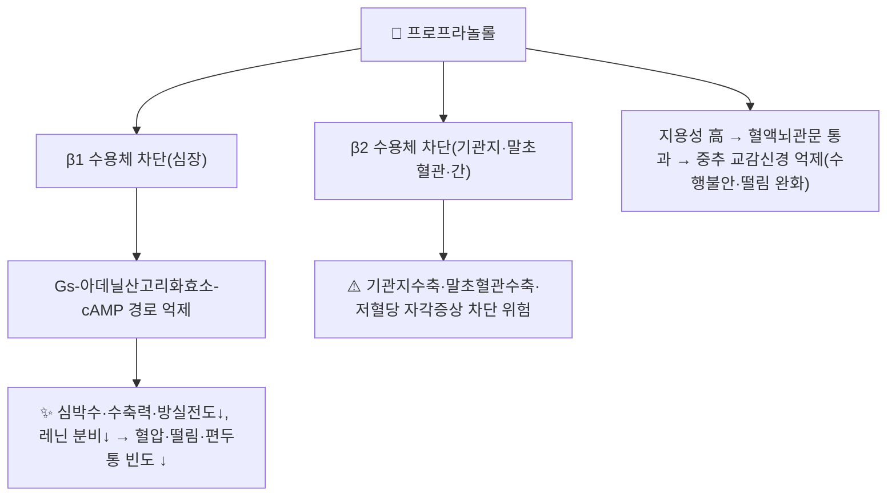

# 💊 [[프로프라놀롤]] (Propranolol, 인데놀/Inderal, ATC C07AA05)

> **핵심 3줄 요약 (Key Summary)**:
> 🧪 주성분·제형: 가장 오래된 **비선택적(非選擇的)** 베타차단제. 국내는 프로프라놀롤염산염 정제(10/40/80mg)로 시판되며, 지용성이 높아 중추신경계 투과가 잘 된다.
> 📍 작용 기전: $\beta_1$·$\beta_2$ 아드레날린 수용체를 모두 경쟁적으로 차단해 심박수·수축력·혈압을 낮추고, 레닌 분비 억제·중추 교감신경 억제 작용도 겸한다.
> 🎯 임상 적응증: 고혈압·협심증 외에도 **편두통 예방, 본태성 떨림(essential tremor), 수행불안(performance anxiety), 갑상선기능항진증 보조, 문맥압 항진증(식도정맥류 출혈 예방)** 등 비심혈관 적응증이 매우 폭넓다.
> ⚠️ 주의사항: $\beta_2$ 차단으로 **천식·반응성기도질환에는 금기**. 당뇨 환자의 저혈당 자각 증상(떨림·심계항진)을 가릴 수 있고, 급격한 중단 시 반동성 빈맥·고혈압 위험.
---

## 1. 약물 기본 정보 및 시판 제품 (Brand Identification)
> [!abstract]+ 🧪 3D 약리 분자 구조 (Interactive 3D Viewer)
> <iframe src="https://molecule-viewer-rho.vercel.app/?cid=4946" width="100%" height="450px" frameborder="0" allow="webgl" style="border-radius: 8px;"></iframe>

> 🖼️ **이미지 미확보** — 식약처 제품허가정보08·e약은요 API는 이 작업 환경(로컬 기기 쉘)에서 외부망 접근이 제한되어 패키지·알약 성상 실사를 확보하지 못했다. 다른 약 사진으로 대체하지 않고 생략한다(출처 가이드 제4원칙). 추후 네트워크 접근 가능 세션에서 보강 필요.

| 항목 | 상세 정보 |
| :--- | :--- |
| **일반명 (Generic Name)** | 프로프라놀롤(염산염) / Propranolol (hydrochloride) |
| **대표 상품명 (Brand Names)** | **인데놀(Inderal)**, Avlocardyl, Hemangeol(소아 영아혈관종용 시럽) |
| **ATC 코드 / 분류** | **C07AA05** — Beta blocking agents, non-selective, Propranolol (국내 일부 제형은 C07FX01·C07BA05로도 분류) |
| **PubChem CID** | [4946](https://pubchem.ncbi.nlm.nih.gov/compound/4946) |
| **화학식 / 분자량** | C₁₆H₂₁NO₂ / 약 259.35 g/mol |
| **주요 제형 및 함량** | 정제 10mg·40mg·80mg, 서방캡슐(LA), 영아혈관종용 경구액(Hemangeol) |
| **국내 허가 적응증(일반)** | 고혈압, 협심증, 부정맥, 비후성 심근증, 편두통 예방, 본태성 떨림, 갑상선중독증 보조, 공격성 발작(pheochromocytoma) 보조, 수술 전 불안 |

### 1.1 대표 시판 제품 및 함유 복합제 매핑 (Brand Identification & Combinations)

| 구분 | 대표 제품명 / 브랜드 | 함유 성분 및 1회당 함량 | 제형 및 특징 | 주요 적응증 및 복약 지도 핵심 |
| :--- | :--- | :--- | :--- | :--- |
| **단일제 (ETC)** | [[인데놀]] | 프로프라놀롤염산염 10/40mg | 정제 | 비선택적 작용으로 **천식 환자 금기** 반드시 문진 |
| **서방형 (ETC, 해외)** | InnoPran XL 등 | 프로프라놀롤 LA | 서방캡슐 | 반감기 연장(최대 10시간), 1일 1회 투여 가능 |
| **소아 전용 (ETC)** | Hemangeol | 프로프라놀롤염산염 경구액 | 시럽 | 생후 5주~5개월 영아혈관종(infantile hemangioma) 전용 적응증 |
| **감별 다빈도 동일 계열** | 딜라트렌, 콩코르, 아테놀 | [[카르베딜롤]], [[비소프롤롤]], [[아테놀롤]] | 정제 | $\beta_1$ 선택성 유무로 감별 — 프로프라놀롤은 **비선택적**이라 기관지·말초혈관 영향이 가장 크다 |

---

## 2. 분자 약리 기전 및 작용 경로 (Mechanism of Action)

* **주요 작용 기전 (Primary MoA)**:
  * 프로프라놀롤은 $\beta_1$과 $\beta_2$ 아드레날린 수용체를 **선택성 없이 모두** 경쟁적으로 차단한다. 심장의 $\beta_1$ 차단은 심박수·수축력·방실전도를 낮추고, 기관지·말초혈관·간의 $\beta_2$ 차단은 기관지수축·말초혈관수축·글리코겐분해 억제(저혈당 위험)로 이어진다.
  * 막안정화(membrane-stabilizing) 작용(퀴니딘 유사 Class II 항부정맥 효과)을 겸해, 고용량에서는 부정맥 억제에도 쓰인다.
* **하류 신호전달 및 생화학적 반응**:
  * 사구체 옆세포의 $\beta_1$ 차단으로 레닌 분비를 억제해 RAAS 활성을 낮춘다.
  * 높은 지용성으로 혈액뇌관문을 잘 통과해 중추신경계의 교감신경 긴장을 낮추므로, 본태성 떨림·수행불안·일부 PTSD 증상 완화 등 **중추성 효과**가 다른 친수성 베타차단제(아테놀롤 등)보다 두드러진다.

---

## 3. 약동학적 특성 (Pharmacokinetics: ADME)

| 약동학 파라미터 | 수치 및 임상적 의미 |
| :--- | :--- |
| **생체이용률 (Bioavailability, F)** | 경구 약 **25%** — 위장관 흡수는 거의 완전하지만 **간 초회통과효과가 매우 커서** 실제 전신 노출은 낮다(설하 투여 시 약 63%, 비강 투여 시 거의 100%로 초회통과 회피). |
| **최고혈중농도 도달시간 (Tmax)** | 약 1~2시간(속방정) |
| **혈장 단백결합률 (Protein Binding)** | 약 **90%** (알부민 및 $\alpha_1$-산성당단백 결합) |
| **간 대사 효소 (Metabolism)** | 간 **CYP2D6·CYP1A2·CYP2C19** 다중 경로 대사 — 간기능·병용약물에 따라 혈중농도 변동이 크다 |
| **배설 반감기 (Elimination t1/2)** | 약 3~6시간(속방정, 평균 4시간) · 서방형(LA)은 최대 10시간 |
| **주요 배설 경로 (Excretion)** | 신장으로 대사체 배설, 미변화체 소변 배설은 1% 미만 |

---

## 4. 용법·용량 및 처방 가이드 (Dosage & Administration)

| 임상 적응증 | 성인 표준 용법·용량 | 비고 |
| :--- | :--- | :--- |
| **본태성 고혈압** | 40mg 1일 2회로 시작, 필요 시 증량 | 최대 320mg/day(허가사항 범위 내 확인) |
| **만성 안정형 협심증** | 10~20mg 1일 3~4회 또는 LA 80mg 1일 1회 | 심박수 55~60회/분 목표 적정 |
| **편두통 예방** | 40mg 1일 2회로 시작 → 80~160mg/day까지 증량 | 급성 발작 치료가 아닌 **예방** 목적, 효과 판정까지 4~6주 소요 |
| **본태성 떨림(Essential tremor)** | 40mg 1일 2회로 시작 → 최대 320mg/day | 필요 시(상황성 떨림)에는 단회 복용으로도 효과 |
| **수행불안(Performance anxiety, 비허가 사용)** | 발표·시험 등 1~2시간 전 10~40mg 단회 | 심계항진·손떨림 등 신체 증상 완화, 인지적 불안 자체는 효과 제한적 |
| **갑상선중독증 보조** | 20~40mg 1일 3~4회 | 빈맥·떨림 등 교감신경 증상 대증, 고용량에서 T4→T3 말초전환도 일부 억제 |
| **문맥압 항진증(식도정맥류 출혈 1차 예방)** | 심박수를 기저치의 25% 낮추는 용량으로 적정 | 간경화 환자에서 간대사 저하로 혈중농도 상승 가능 — 저용량부터 시작 |

> ⚠️ 간기능 저하 환자는 초회통과효과 감소로 혈중농도·반감기가 크게 늘어날 수 있어 **저용량부터 시작**한다. 임신부는 태반을 통과해 태아 서맥·저혈당·자궁내성장지연 위험이 있어 신중 투여.

---

## 5. 부작용, 경고 및 약물 상호작용 (Adverse Effects & Interactions)

### 5.1 주요 부작용 및 독성 경고
* **기관지수축**: 비선택적으로 $\beta_2$를 차단해 **천식·반응성 기도질환·중증 COPD에는 금기**에 가깝다. 동일 계열 중 기관지 영향이 가장 큰 약물.
* **서맥·방실차단·심부전 악화**: 2도 이상 방실차단, 대상부전 심부전에는 신중/금기.
* **저혈당 자각 차단**: 당뇨병 환자에서 저혈당의 교감신경 경고 증상(떨림·심계항진)을 가려 저혈당 인지가 늦어질 위험.
* **중추신경계 영향**: 피로, 수면장애·생생한 꿈, 드물게 우울 증상 — 지용성이 높아 다른 베타차단제보다 빈도가 높다는 보고.
* **급격한 중단 금지**: 장기 복용 중 갑자기 끊으면 수용체 상향조절로 반동성 빈맥·고혈압·협심증 악화 위험 — **서서히 감량**.

### 5.2 주요 병용 금기 및 상호작용
* **CYP2D6 억제제**(플루옥세틴·파록세틴·퀴니딘 등): 프로프라놀롤 혈중농도 상승 가능.
* **효소 유도제**(리팜핀·카바마제핀 등): 대사 촉진으로 혈중농도·효과 저하.
* **비디히드로피리딘계 칼슘채널차단제·디곡신**: 서맥·방실차단 상가 위험.
* **클로니딘**: 병용 중단 시 클로니딘을 먼저 중단하면 반동성 고혈압 위험 — 중단 순서 주의.
* **NSAIDs**: 프로스타글란딘 매개 항고혈압 효과 상쇄 가능.
* **$\beta_2$ 작용제(천식약)**: 기관지확장 효과를 직접 대항.

---

## 6. 한의 치료 연계 및 병용/테이퍼링 프로토콜 (Integrative Medicine)

### 6.1 한약·양약 병용 투여 안전성 및 시너지 배오
* 프로프라놀롤은 **비심혈관 적응증(편두통 예방·본태성 떨림·수행불안)으로 복용 중인 환자**가 1차 진료에 많이 내원한다. 떨림·심계항진·불안 증상으로 내원한 환자가 이미 프로프라놀롤을 복용 중인지 문진하는 것이 변증의 혼란을 줄이는 핵심이다(약인성 서맥·피로를 양허로 오인하지 않도록).
* 갑상선기능항진증·문맥압항진증(간경화) 보조로 복용 중인 경우는 **기저질환 자체가 중증**인 경우가 많아, 한의 치료 병행 시 양약 임의 중단을 유도하지 않는다.

### 6.2 양약 감량 및 한의 전환(테이퍼링) 가이드
* 편두통 예방·본태성 떨림·수행불안 등 **증상 완화 목적**으로 복용 중인 경우는 증상 호전에 따라 처방의와 상의해 감량 여지가 있으나, 부정맥·갑상선중독증·문맥압항진증 등 **예후와 직결된 적응증**은 임의 감량을 유도하지 않는다.
* 급격한 중단은 반동성 빈맥·고혈압을 유발하므로, 감량이 필요하면 반드시 1~2주 이상에 걸쳐 단계적으로 줄인다.

---

## 7. 💡 사용자 진료실 핵심 필기 & 실전 임상 체크리스트

> 🛡️ **Melt-In 원칙**: 원장님 기존 필기 없음 — 오늘 신규 생성 노트이므로 비워 둔다. 진료 중 메모가 쌓이면 이 섹션에 원문 그대로 보존한다.

### 7.1 진료실 3대 핵심 문진 체크리스트
1. **복용 목적 확인**: 고혈압·부정맥 때문인지, 편두통 예방·본태성 떨림·발표 전 불안 때문인지에 따라 중단 위험도가 크게 다르다.
2. **천식·호흡기질환 병력 확인**: 비선택적 베타차단제이므로 천식 병력이 있으면 처방의에게 반드시 확인이 필요함을 안내.
3. **당뇨병 동반 여부**: 저혈당 자각 증상(떨림·심계항진)이 약으로 가려질 수 있음을 교육.

### 7.2 환자 티칭 스크립트
> *"이 약은 심장 박동뿐 아니라 떨림이나 긴장될 때 나타나는 신체 증상을 줄여주는 약입니다. 천식이 있으시면 숨쉬기가 더 힘들어질 수 있어 꼭 말씀해 주셔야 하고, 임의로 갑자기 끊으시면 오히려 심장이 반동적으로 빨리 뛸 수 있어 서서히 줄이는 것이 중요합니다."*

---

## 8. 출처 및 학술 참고 문헌 (References)

1. **Propranolol**. StatPearls [Internet]. NCBI Bookshelf. [NBK557801](https://www.ncbi.nlm.nih.gov/sites/books/NBK557801/)
   - **[연구 요약]**: 작용 기전, 약동학, FDA 승인 적응증·비허가 사용, 금기·부작용·상호작용 종합 정리.
2. **Propranolol**. DrugBank Online. [DB00571](https://go.drugbank.com/drugs/DB00571)
   - **[참고 자료]**: 약리 분류·상호작용 데이터베이스 교차 확인용.
3. **Propranolol**. Wikipedia. [en.wikipedia.org/wiki/Propranolol](https://en.wikipedia.org/wiki/Propranolol)
   - **[참고 자료]**: PubChem CID·ATC 코드·분자량·생체이용률·단백결합률 등 식별 정보 교차 확인용(1차 학술 출처 아님).
4. **Inderal (propranolol hydrochloride) Tablets** — FDA 제품 라벨. [accessdata.fda.gov](https://www.accessdata.fda.gov/drugsatfda_docs/label/2011/016418s080,016762s017,017683s008lbl.pdf)
   - **[규제 자료]**: 미국 FDA 승인 적응증·용법용량 원문.
5. 식품의약품안전처 의약품안전나라(nedrug.mfds.go.kr) — 이번 세션은 네트워크 접근이 제한되어 국내 허가사항을 직접 조회하지 못했다. **국내 정확한 허가 적응증 문구·최대 용량은 추후 식약처 API 접근 가능 세션에서 재확인 필요.**
