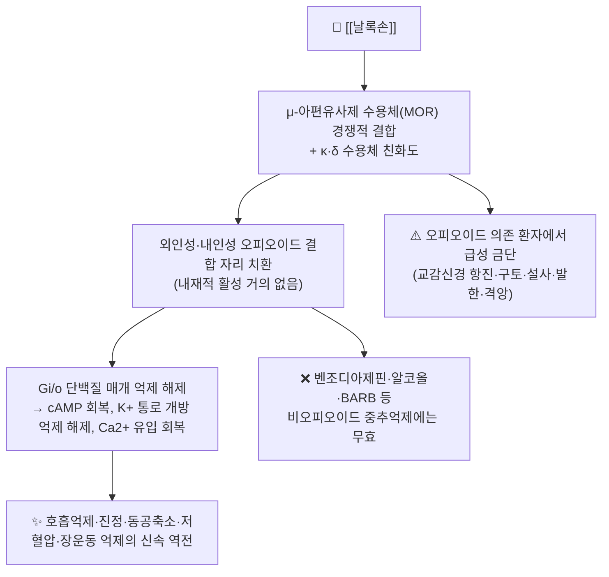

# 💊 [[날록손]] (Naloxone, Narcan, ATC V03AB15)

![[나록손_1.jpg|540]]
> [그림 1: ① 병태생리·영상 — Pharmacological principle of naloxegol under normal conditions (left column), during opioid treatment (middle) and opioi]

> **핵심 3줄 요약 (Key Summary)**:
> 🧪 주성분·제형: [[날록손]]은 옥시모르폰(oxymorphone) 유도체의 N-알릴 치환체로 만들어진 순수 길항제이며, 화학식 C19H21NO4·분자량 약 327.37 g/mol의 저분자 화합물이다. 임상에서는 날록손염산염 형태로 주사제(0.4 mg/mL, 1 mg/mL 앰플·바이알)와 비강 스프레이(4 mg/0.1 mL, 8 mg/0.1 mL 등), 근육주사용 프리필드시린지(5 mg/0.5 mL)로 공급된다.
> 📍 작용 기전: μ(주로)·κ·δ 아편유사제 수용체에 대해 높은 친화도로 결합하지만 내재적 활성(intrinsic activity)이 거의 없는 **경쟁적 길항제**로, 외인성/내인성 오피오이드가 수용체에서 밀려나면서 Gi 단백질 매개 억제 신호가 해제되어 호흡억제·진정·동공축소·저혈압이 수분 내 역전된다.
> 🎯 임상 적응증: 아편유사제 과량투여(의도적·우발적)로 인한 중추신경 억제 및 호흡억제의 응급 역전이 1차 적응증이며, 수술 후 오피오이드 유발 호흡억제, 신생아 오피오이드 노출 등에 제한적으로 사용된다. 표준 용량은 성인 0.4~2 mg IV/IM/SC 또는 4 mg 비강 단회 후 2~3분 간격 반복이다.
> ⚠️ 주의사항: 오피오이드 의존 환자에서는 투여 즉시 급성 금단(구토·설사·발한·동공산대·빈맥·고혈압·불안·격앙)이 유발될 수 있고, 드물게 폐부종·부정맥·발작이 보고된다. 무엇보다 **벤조디아제핀·알코올 등 비(非)오피오이드 중추억제제에는 무효**이므로 원인 감별이 필수다.

---

## 1. 약물 기본 정보 및 시판 제품 (Brand Identification)

> [!abstract]+ 🧪 3D 약리 분자 구조 (Interactive 3D Viewer)
> <iframe src="https://molecule-viewer-rho.vercel.app/?cid=5284596" width="100%" height="450px" frameborder="0" allow="webgl" style="border-radius: 8px;"></iframe>

| 항목 | 상세 정보 |
| :--- | :--- |
| **일반명 (Generic Name)** | [[날록손]](한글) / Naloxone (English Generic Name) — 염 형태는 [[날록손염산염]](Naloxone hydrochloride) |
| **대표 상품명 (Brand Names)** | **Narcan**(비강 스프레이, 미국 OTC), Kloxxado(8 mg 비강), RiVive(3 mg 비강 OTC), Zimhi(IM 프리필드시린지), Evzio(자동주입기, 공급 중단 보고). 국내에서는 주로 **날록손염산염 주사제**가 응급용으로 유통되며, 개별 상품명은 의약품안전나라에서 확인 필요 |
| **ATC 코드 / 분류** | **V03AB15** (All other therapeutic products / Antidotes) · 작용 분류: 아편유사제 길항제(Opioid antagonist) |
| **PubChem CID** | [5284596](https://pubchem.ncbi.nlm.nih.gov/compound/5284596) |
| **화학식 / 분자량** | C19H21NO4 / 약 327.37 g/mol (유리 염기 기준) |
| **주요 제형 및 함량** | 주사액(0.4 mg/mL, 1 mg/mL), 비강 스프레이(3 mg, 4 mg, 8 mg), IM 프리필드시린지(5 mg/0.5 mL), 부프레노르핀과의 복합 설하정·필름(부프레노르핀 2~8 mg + 날록손 0.5~2 mg) |
| **식약처 허가 적응증** | 마약류(아편유사제) 중독 또는 과량투여에 의한 호흡억제의 역전, 마약류 중독 진단 보조 등 — 구체 문구는 품목별 허가사항 확인(근거 미확인: 품목별 상세 문구) |

> [!note] 화학 구조적 특징
> [[날록손]]은 [[모르핀]] 계열의 축소 골격에 N-알릴(N-allyl) 치환을 도입한 화합물로, 이 치환이 수용체 친화도는 유지하면서 효능(efficacy)을 제거하여 "순수 길항제(pure antagonist)"로 만든다. 동일 계열의 [[날트렉손]](N-cyclopropylmethyl 유도체, 경구용·장기작용)과 대비되는 구조-활성 관계를 갖는다.

### 1.1 대표 시판 제품 및 함유 복합제 매핑 (Brand Identification & Combinations)

| 구분 | 대표 제품명 / 브랜드 | 함유 성분 및 1회당 함량 | 제형 및 특징 | 주요 적응증 및 복약 지도 핵심 |
| :--- | :--- | :--- | :--- | :--- |
| **응급 주사제 (ETC)** | 날록손염산염 주사액 (Naloxone HCl Injection) | [[날록손염산염]] 단일 성분 0.4 mg/mL, 1 mg/mL | 앰플/바이알, IV·IM·SC | 오피오이드 과량 응급 역전. IV 투여 시 1~2분 내 효과 발현. 의료기관·구급차 보유 필수 |
| **비강 스프레이 (OTC/ETC)** | [[Narcan]](4 mg), Kloxxado(8 mg), RiVive(3 mg) | [[날록손염산염]] 단일 성분, 비강 1회 1 spray | 무바늘 비강 분무, 좌·우 콧구멍 교대 사용 | 일반인·가족 보유용 **테이크홈 날록손**. 2~3분 간격 반복, 총 반응 없으면 119 이송 |
| **근육주사 프리필드 (ETC)** | Zimhi | [[날록손염산염]] 5 mg/0.5 mL | IM 프리필드시린지 | 고용량 단회 투여가 필요한 기관·구급 대응용 |
| **자가주입기 (공급 변동)** | Evzio 계열 | [[날록손염산염]] 0.4 mg 자동주입기 | 음성 안내 자동주입기 | 제조사 공급 중단이 보고되어 국가별 수급 상황 확인 필요(근거 미확인: 국내 수급) |
| **복합제 (ETC)** | [[부프레노르핀/날록손]] 설하정·설하필름 | [[부프레노르핀]] 2~8 mg + [[날록손]] 0.5~2 mg | 설하정, 구강붕해필름 | 오피오이드 사용장애(OUD) 유지치료. 설하 투여 시 날록손 흡수는 미미하여 **비경구 오남용 억제** 목적으로 배합 |
| **감별·연관 해독제** | [[플루마제닐]], [[날트렉손]], [[메틸날트렉손]], [[날록세골]] | - | 주사/경구/경구 | 플루마제닐=벤조디아제핀 길항(날록손과 혼동 주의), 날트렉손=경구 장기작용 오피오이드 길항, 메틸날트렉손·날록세골=말초 선택적(장관·변비 적응) |

> [!warning] 제품 식별 주의
> 국내 유통 품목의 정확한 브랜드명·함량·허가 문구는 제조사별로 상이하므로, 본 노트에 기재되지 않은 국내 상품명은 **의약품안전나라(nedrug.mfds.go.kr)** 및 병원 약제부 마약류 대장에서 확인해야 한다. 위키링크가 걸리지 않은 국내 제품명을 임의로 생성하지 않도록 한다.

---

## 2. 분자 약리 기전 및 작용 경로 (Mechanism of Action)

* **주요 작용 기전 (Primary MoA)**:
  * [[날록손]]은 아편유사제 수용체(μ, κ, δ)에 대해 **높은 친화도**로 결합하는 경쟁적 길항제다. μ 수용체에 대한 친화도가 가장 높아 임상적 효과의 대부분은 μ 수용체 차단을 통해 나타난다. 수용체 점유율이 높지만 내재적 활성이 없어, 수용체를 활성화하지 않으면서 [[모르핀]]·[[헤로인]]·[[옥시코돈]]·[[펜타닐]] 등 작용제의 결합을 밀어낸다.
  * 수용체 차단 결과 아편유사제에 의해 억제되어 있던 **호흡 중추의 CO2 반응성**이 회복되고, 진정·동공축소·서맥·저혈압·위장관 연동 저하가 함께 역전된다. 오피오이드가 존재하지 않는 정상 상태에서는 임상적으로 뚜렷한 작용을 거의 나타내지 않는 것이 순수 길항제의 특징이다.
  * [[부프레노르핀]](부분 작용제)에 대한 길항은 상대적으로 불완전할 수 있으며, 고용량·반복 투여가 필요할 수 있다(근거 미확인: 개별 환자 반응의 정량적 한계).

* **하류 신호전달 및 생화학적 반응**:
  * μ 수용체는 Gi/o 단백질 결합형 수용체로, 작용제 자극 시 아데닐산고리화효소(AC) 억제 → cAMP 감소, 전압개폐성 K⁺ 통로 개방(세포 과분극), 전압개폐성 Ca²⁺ 통로 억제(신경전달물질 유리 감소)를 일으켜 신경 흥분성이 저하된다.
  * [[날록손]]은 이 과정을 **길항**하여 cAMP 수준과 시냅스전 신경전달물질 유리를 정상화하고, 뇌간 호흡 중추(延髓) 및 청반(locus coeruleus)의 억제 상태를 해제한다. 청반 부위의 cAMP 급격한 상승은 **급성 금단 증상**의 신경생물학적 기질로 설명된다.
  * 수용체 차단 이후 교감신경계 반사 항진이 동반되어 혈압 상승·빈맥이 나타날 수 있으며, 이는 급단 시 catecholamine 급증과 관련된다.

---

## 3. 약동학적 특성 (Pharmacokinetics: ADME)

| 약동학 파라미터 | 수치 및 임상적 의미 |
| :--- | :--- |
| **생체이용률 (Bioavailability, F)** | 경구 투여 시 간 초회통과효과가 매우 커서 생체이용률이 **매우 낮음(약 2% 수준)**. 따라서 경구 투여는 전신 역전 목적으로 사용하지 않으며, [[부프레노르핀/날록손]] 복합제의 경구·설하 날록손은 오남용 억제 목적에 한한다. 비강 스프레이의 상대 생체이용률은 제형(3·4·8 mg)과 분무 방식에 따라 차이가 있어 제품별 허가자료 확인이 필요하다(근거 미확인: 제품 간 직접 비교 수치). |
| **최고혈중농도 도달시간 (Tmax)** | IV: 1~2분 내 임상 효과 발현 / IM·SC: 수 분(약 5~10분) 내 발현 / 비강 스프레이: 통상 수 분 내(제품별 상이, 약 5분 전후로 기재됨). 응급 상황에서는 발현 속도가 IV > IM > 비강 순으로 빠르다. |
| **혈장 단백결합률 (Protein Binding)** | 약 **45%** 수준(주로 알부민 결합)으로 보고된다. 결합률이 낮아 다른 고결합 약물과의 단백결합 경쟁에 의한 상호작용 위험은 상대적으로 작다. |
| **간 대사 효소 (Metabolism)** | 주로 **간 포합반응(glucuronidation)**에 의해 대사되어 [[날록손-3-글루쿠로니드]](주요 대사체, 비활성)를 형성한다. UGT 효소군(예: UGT2B7)이 관여하는 것으로 보고되며, CYP450 의존성은 상대적으로 낮다(근거 미확인: 관여 UGT 아형의 정량적 기여도). |
| **배설 반감기 (Elimination t1/2)** | 성인에서 대략 **30~90분(평균 약 60분 전후)**. 신생아·간기능 저하 환자에서는 연장될 수 있다. **반감기가 대부분의 오피오이드보다 짧다**는 점이 임상적으로 가장 중요하며, 역전 후 진정·호흡억제가 다시 나타나는 **재마취(renarcotization)**의 근거가 된다. |
| **주요 배설 경로 (Excretion)** | 주로 **신장(소변) 배설**되며 대부분 포합체 형태로 배출된다. 담즙·분변 배설 비율은 상대적으로 적다(정확한 정량 분율은 근거 미확인). 신기능 저하 시 배설 지연 가능성이 있으나 임상적 용량 조절 지침은 응급 상황 우선 원칙에 따른다. |

> [!important] 임상 적용 포인트 — 반감기 불일치
> [[펜타닐]]·[[메사돈]]·서방형 [[옥시코돈]] 등 **장기지속형 오피오이드**는 생체 내 작용 시간이 날록손보다 훨씬 길다. 따라서 날록손 투여 후 일시적으로 호흡이 회복되더라도 30~90분 이후 다시 억제될 수 있으므로, **관찰 연장 및 필요 시 지속정주(infusion)**가 필수적이다. 이는 응급 대응의 핵심 원칙이며, Handal & Schauben(1983)의 고전적 고찰에서도 강조된 바 있다. PMID: 6309038

---

## 의학/04_임상 용법·용량 및 처방 가이드 (Dosage & Administration)

| 임상 적응증 | 성인 표준 용법·용량 | 1일 최대 한도 용량 |
| :--- | :--- | :--- |
| **아편유사제 과량 응급 역전 (IV/IM/SC)** | 0.4~2 mg을 IV(또는 IM·SC)로 투여하고, 반응이 불충분하면 **2~3분 간격으로 반복** 투여. 호흡수·의식수준을 목표로 **최소 유효 용량 적정(titration)** | 고정 상한은 없음. 누적 10 mg 정도까지 반응이 없으면 오피오이드 이외 원인(저혈당, 두부손상, 벤조디아제핀·알코올 중독 등) 감별 필요 |
| **아편유사제 과량 (비강 스프레이)** | 4 mg(또는 8 mg) 1 spray를 한쪽 콧구멍에 투여, 반응 없으면 **2~3분 간격으로 좌·우 교대 반복** | 제품별 허가사항 기준 반복. 반응 회복 시에도 재억제 대비 관찰 |
| **장기지속형 오피오이드 중독** | 유효 볼루스 확보 후 **시간당 유효 볼루스의 약 2/3에 해당하는 용량을 지속정주** | 환자 반응에 따라 적정, 호흡수·의식 모니터링 |
| **수술 후 오피오이드 유발 호흡억제 (저용량 요법)** | 0.1~0.2 mg IV를 2~3분 간격으로 소량 적정. 필요 시 0.25~1 mcg/kg/h 수준의 저용량 지속정주가 사용되기도 함 | 진통 효과의 급격한 소실을 피하기 위해 소량 적정 원칙 |
| **신생아 (산모 오피오이드 노출 관련)** | 0.1 mg/kg IV/IM (지침별 상이) | 신생아는 금단 발작 위험이 높아 투여 후 집중 모니터링 |
| **오피오이드 사용장애 유지치료 (복합제)** | [[부프레노르핀/날록손]] 설하정·필름을 유도 후 1일 1회 설하 투여, 용량은 부프레노르핀 기준 적정 | 허가사항 기준(제품별 상이) |

> [!tip] 투여 원칙 요약
> 1) **적정(titration) 우선**: 목표는 완전한 각성 유도가 아니라 **자발호흡 회복**이다. 과도한 역전은 급단·교감신경 항진·통증 폭주를 유발한다.
> 2) **경로 선택**: 정맥로 확보가 가능하면 IV, 불가하면 IM/SC 또는 비강 스프레이.
> 3) **반복·관찰**: 반감기 불일치로 인한 재억제를 항상 가정한다.
> 4) **비오피오이드 원인 배제**: 날록손 무반응은 진단적 정보가 된다.

---

## 5. 부작용, 경고 및 약물 상호작용 (Adverse Effects & Interactions)

### 5.1 주요 부작용 및 독성 경고 (Black Box Warnings)
* **급성 금단 증후군 (가장 흔하고 임상적으로 중요)**:
  * 오피오이드 의존(또는 만성 투여 중) 환자에서 [[날록손]] 투여는 즉시 **교감신경 항진 증후군**을 유발할 수 있다. 구역·구토, 복통·설사, 발한, 눈물·콧물, 재채기, 닭살(piloerection), 동공산대, 빈맥, 혈압 상승, 불안·격앙·초조가 대표적이다.
  * 고위험군: 고용량 장기지속형 오피오이드 복용자, [[메사돈]]·[[부프레노르핀]] 유지치료 환자, 신생아(산모 오피오이드 노출).
  * 대응: 소량 적정 투여, 진정·호흡 모니터링, 필요 시 금단 증상 완화 치료 병행.

* **심혈관계 및 호흡기계 합병증 (드묾)**:
  * 급단에 따른 catecholamine 급증과 연관되어 **폐부종(비심인성)**, 부정맥, 고혈압, 드물게 심정지가 보고되어 있다. 기저 심혈관 질환자·고령자에서 특히 주의한다.
  * 기전상 급격한 교감신경 항진과 폐혈관 투과성 변화가 관여하는 것으로 설명되나, 정확한 기전은 완전히 규명되지 않았다(근거 미확인).

* **신경계 부작용 (드묾)**:
  * 발작, 섬망, 심한 초조. 기존 뇌전증·뇌손상 환자에서 위험이 상대적으로 높을 수 있다.

* **알레르기 및 과민반응**:
  * 피부 발진, 주사부위 반응, 아나필락시스는 드물게 보고된다. [[날록손]] 또는 제형 부형제에 대한 과민반응이 확인된 경우 금기이다.

* **금기 및 신중 투여**:
  * 절대적 금기는 사실상 과민반응뿐이며, 생명을 위협하는 오피오이드 과량 상황에서는 이득이 위험을 상회한다.
  * [[임부]]: 산모에서 급단이 유발되면 태아 스트레스·조기진통 위험이 있으므로, 산과·신생아과 협진 하에 최소 유효 용량으로 사용한다.
  * 아편유사제 의존 환자, 심질환자, 간·신기능 저하자: 소량 적정 및 집중 모니터링.

> [!caution] 블랙박스 경고 관련
> 미국·국내 허가사항상 [[날록손]] 단일제에 대해 전형적인 박스형 경고(black box warning)가 적용되는지 여부는 제품·국가별로 상이하다(근거 미확인: 품목별 허가사항 원문 확인 필요). 다만 "급성 금단 유발 위험"과 "반감기 불일치로 인한 재억제 위험"은 모든 허가사항에서 공통적으로 강조되는 핵심 경고다.

### 5.2 주요 병용 금기 및 상호작용
* **오피오이드 작용제 전반 ([[모르핀]], [[펜타닐]], [[옥시코돈]], [[헤로인]], [[메사돈]])**:
  * 약리학적 길항 관계. 진통 목적으로 투여 중인 환자에게 날록손을 투여하면 **진통 소실 및 급단**이 발생한다. 수술 후 사용 시 저용량 적정이 필요한 이유이다.
* **[[부프레노르핀]] (부분 작용제)**:
  * 길항이 불완전할 수 있어 고용량·반복 투여가 필요할 수 있다. [[부프레노르핀/날록손]] 복합제에서 설하 날록손은 전신 흡수가 미미하지만, 정맥 오남용 시 급단이 유발되도록 설계되어 있다.
* **중추신경억제제 (벤조디아제핀, 알코올, 바르비투르계, Z-drug)**:
  * [[날록손]]은 이들 약물의 효과를 **역전시키지 못한다.** 실제 임상에서 오피오이드-벤조디아제핀 혼합 중독은 흔하며, 날록손 투여 후에도 의식 저하가 지속될 수 있다. 이 경우 [[플루마제닐]] 사용 여부는 발작 위험(특히 만성 벤조디아제핀 복용자)을 고려해 신중히 판단한다.
* **기타**:
  * 날록손은 간 포합으로 대사되므로 CYP450 기질 약물과의 유의한 약동학적 상호작용은 상대적으로 적다고 보고된다(근거 미확인: 대규모 상호작용 연구 부족).

---

## 6. 한의 치료 연계 및 병용/테이퍼링 프로토콜 (Integrative Medicine)

### 6.1 한약·양약 병용 투여 안전성 및 시너지 배오
* **응급 상황에서의 우선순위 원칙**:
  * [[날록손]]은 **응급 해독제**로, 오피오이드 과량이 의심되는 의식저하·호흡억제 환자에서는 한의 치료보다 **119 이송 및 날록손 투여가 절대적으로 우선**한다. 한약·침 치료는 활력징후가 안정된 이후 회복기 단계에서 보조적으로 접근한다.
* **급단 및 회복기 증상 관리의 한의학적 접근**:
  * 오피오이드 의존 환자의 급단기에는 교감신경 항진(心悸, 汗出, 不眠, 嘔逆, 腹瀉) 및 氣陰兩傷 양상이 흔히 관찰된다. 회복기에는 補氣·養陰·安神 계열 처방([[생맥산]] 계열, [[산조인탕]] 계열 등)이 증상 조절 목적으로 고려될 수 있으나, **본 노트에서 인용한 논문들에는 날록손과 한약의 병용을 직접 평가한 근거가 없다(근거 미확인).** 처방 결정은 개별 환자 변증과 안전성 검토를 전제로 한다.
  * 병용 시에는 양약 대사 경로(포합반응)와 겹치는 한약재의 시간차 투여(1~2시간 간격) 원칙을 준용하되, 응급 상황에서는 시간차를 이유로 해독제 투여를 지연시켜서는 안 된다.
* **테이퍼링 연계**:
  * [[부프레노르핀/날록손]] 유지치료 중인 환자에서 한의 치료를 병행할 경우, 급단 유발 위험이 있으므로 **환자 임의 감량·중단을 금지**하고 처방의와 한의사가 용량 조정 계획을 공유한다.

### 6.2 양약 감량 및 한의 전환(테이퍼링) 가이드
* **원칙**: [[날록손]] 자체는 유지치료 약물이 아니므로 "날록손 테이퍼링"이라는 개념은 성립하지 않는다. 테이퍼링의 대상은 [[메사돈]], [[부프레노르핀]], 처방 오피오이드 진통제이다.
* **임상 프로토콜 개요**:
  1. 기저 오피오이드 용량을 확인하고 10~20% 수준의 단계적 감량 계획을 세운다(급격한 감량은 재발 위험을 높인다).
  2. 침·약침·한약 치료를 병행하여 통증·불면·불안 등 금단 관련 증상을 조절한다(근거 수준: 본 노트 인용 논문에서는 확인되지 않음 — 근거 미확인).
  3. 각 감량 단계마다 금단 증상 척도와 재발 신호를 평가하고, 필요 시 원 처방의와 재조정한다.
  4. 환자에게 **테이크홈 날록손(비강 스프레이)** 을 교육·보유하도록 안내하는 것은 재발성 과량으로 인한 사망 위험을 낮추기 위한 공중보건 전략의 핵심이며, 약사 주도의 날록손 서비스 확대가 이를 뒷받침한다. PMID: 36156267 / PMID: 33684591

---

## 7. 💡 사용자 진료실 핵심 필기 & 실전 임상 체크리스트

### 7.1 진료실 3대 핵심 문진 체크리스트
1. **의식저하·호흡억제 환자의 원인 감별 (최우선)**:
   * 동공축소(miosis) + 호흡수 감소(<10회/분) + 의식저하 3징후는 오피오이드 중독의 전형이다. **즉시 119 신고 및 날록손 투여를 고려**하고, 벤조디아제핀·알코올·저혈당·두부외상 여부를 병렬로 확인한다. 날록손 무반응은 다른 원인을 시사하는 중요한 단서다.
2. **오피오이드 의존 및 처방 이력 확인**:
   * [[메사돈]]·[[부프레노르핀]] 유지치료 여부, 서방형 오피오이드 복용 여부, 최근 금단 시도 이력을 확인한다. 의존 환자에서는 급단 위험 때문에 소량 적정이 원칙임을 인지한다.
3. **테이크홈 날록손 보유·교육 여부 및 고위험 환경**:
   * 고용량 오피오이드 처방 환자, 오피오이드 사용장애 치료 중인 환자, 교정시설·퇴소 예정자 등 고위험군에게 날록손 보유와 사용법(좌·우 콧구멍 교대, 2~3분 간격 반복, 반드시 119 호출)을 교육한다. 교정시설 내 날록손 자판기 설치와 같은 접근성 확대 시도가 보고되어 있다. PMID: 39260806

### 7.2 환자·보호자 티칭 스크립트
> *"이 스프레이는 오피오이드 계열 진통제나 마약성 약물을 과량 사용해 숨쉬기 힘들어지고 의식이 떨어질 때, 그 약효를 잠시 되돌려 주는 응급 구조용 약입니다. 코 한쪽에 분사한 뒤에도 반응이 없으면 2~3분 간격으로 반대쪽 콧구멍에 반복해서 뿌려 주시고, 동시에 반드시 119에 신고하셔야 합니다. 이 약은 몇십 분 뒤에 효과가 떨어져서 증상이 다시 나타날 수 있기 때문에, 반드시 의료기관에서 관찰받아야 합니다. 그리고 벤조디아제핀 계열 수면제나 술로 인한 의식저하에는 이 약이 듣지 않으므로, 어떤 약을 먹었는지 아는 것이 매우 중요합니다."*

> *"(한의원 맥락) 한약과 침 치료는 의식이 회복되고 활력징후가 안정된 이후 회복기 관리 단계에서 도움이 될 수 있습니다. 다만 오피오이드 계열 약을 줄여나가는 과정은 임의로 중단하면 위험할 수 있으니, 처방받으신 병원과 상의하면서 단계적으로 조절해 나가겠습니다."*

### 7.3 감별 진단 요약표

| 감별 대상 | 날록손에 대한 반응 | 핵심 감별 포인트 |
| :--- | :--- | :--- |
| 오피오이드 과량 | **즉시 반응 (호흡수·의식 회복)** | 동공축소, 호흡억제, 서맥, 흉터(주사 자국) |
| 벤조디아제핀 과량 | 무반응 | 동공 정상~산대, 병용 오피오이드 여부 확인, [[플루마제닐]] 고려 |
| 알코올 중독 | 무반응 | 혈중 알코올, 동공 정상, 병용 약물 병존 가능 |
| 저혈당 | 무반응 | 혈당 측정 즉시, 발한·진전 |
| 두부손상·뇌졸중 | 무반응 또는 부분 반응 | 국소 신경학적 결손, 영상 검사 |

---

## 8. 출처 및 학술 참고 문헌 (References)

* Martin WR. Naloxone. *Ann Intern Med*. 1976. PMID: 187095
  * `[연구 요약]` 날록손의 순수 아편유사제 길항제로서의 약리학적 성질을 정리한 고전 논문으로, 수용체 수준의 길항 기전과 임상적 의의(오피오이드 의존의 진단·역전)를 제시한 기초 문헌.
* Handal KA, Schauben JL. Naloxone. *Ann Emerg Med*. 1983. PMID: 6309038
  * `[연구 요약]` 응급의학 관점에서 날록손의 적응증, 용량 적정, 반복 투여 및 반감기 불일치로 인한 재억제 문제를 다룬 임상 고찰.
* Rawal S, Osae SP. Pharmacists' naloxone services beyond community pharmacy settings: A systematic review. *Res Social Adm Pharm*. 2023. PMID: 36156267
  * `[연구 요약]` 지역약국 외 병원·응급실·클리닉 등 다양한 환경에서 약사가 제공하는 날록손 교육·처방·보급 서비스의 현황과 효과를 체계적으로 검토한 연구.
* Bennett AS, Elliott L. Naloxone's role in the national opioid crisis—past struggles, current efforts, and future opportunities. *Transl Res*. 2021. PMID: 33684591
  * `[연구 요약]` 국가적 오피오이드 위기 대응에서 날록손의 공중보건적 역할, 보급 확대의 역사적 쟁점과 향후 과제를 다룬 고찰.
* Victor G, Hedden-Clayton B. Naloxone vending machines in county jail. *J Subst Use Addict Treat*. 2024. PMID: 39260806
  * `[연구 요약]` 카운티 교정시설 내 날록손 자판기 설치·운영 사례를 통해 출소자 등 고위험군의 날록손 접근성 확대 방안을 제시한 연구.
* Krause D, Warnecke M. The Impact of the Opioid Antagonist Naloxone on Experimentally Induced Craving in Nicotine-Dependent Individuals. *Eur Addict Res*. 2018. PMID: 30423575
  * `[연구 요약]` 니코틴 의존 개체에서 실험적으로 유발된 갈망에 대한 오피오이드 길항제 날록손의 영향을 평가한 연구로, 내인성 오피오이드 시스템과 중독 갈망의 연관성을 탐색한 시도. 구체적 결과의 임상 적용은 추가 검증이 필요하다(근거 미확인: 본 노트에서 세부 결과 수치 미확인).
* 식품의약품안전처 의약품안전나라 의약품통합정보시스템 (https://nedrug.mfds.go.kr)
  * `[연구 요약]` 국내 허가 날록손염산염 제품의 품목 기준코드, 허가사항, 용법용량 및 부작용 안전성 정보 확인용 공공 데이터베이스. 국내 상품명·허가 문구는 본 시스템에서 최종 확인한다.
* Brunton LL, Hilal-Dandan R, Knollmann BC, eds. *Goodman & Gilman's The Pharmacological Basis of Therapeutics*. 13th ed. McGraw-Hill; 2018.
  * `[연구 요약]` 아편유사제 수용체 약리학, 길항제의 분자 기전 및 임상 치료 지침 총람. 본 노트의 기전·약동학 서술의 교과서적 배경.

<!-- 보관 태그(1회용·링크오류, 필요시 복원): 해독제/오피오이드길항제, MOR경쟁적길항, 아편수용체길항제 -->
