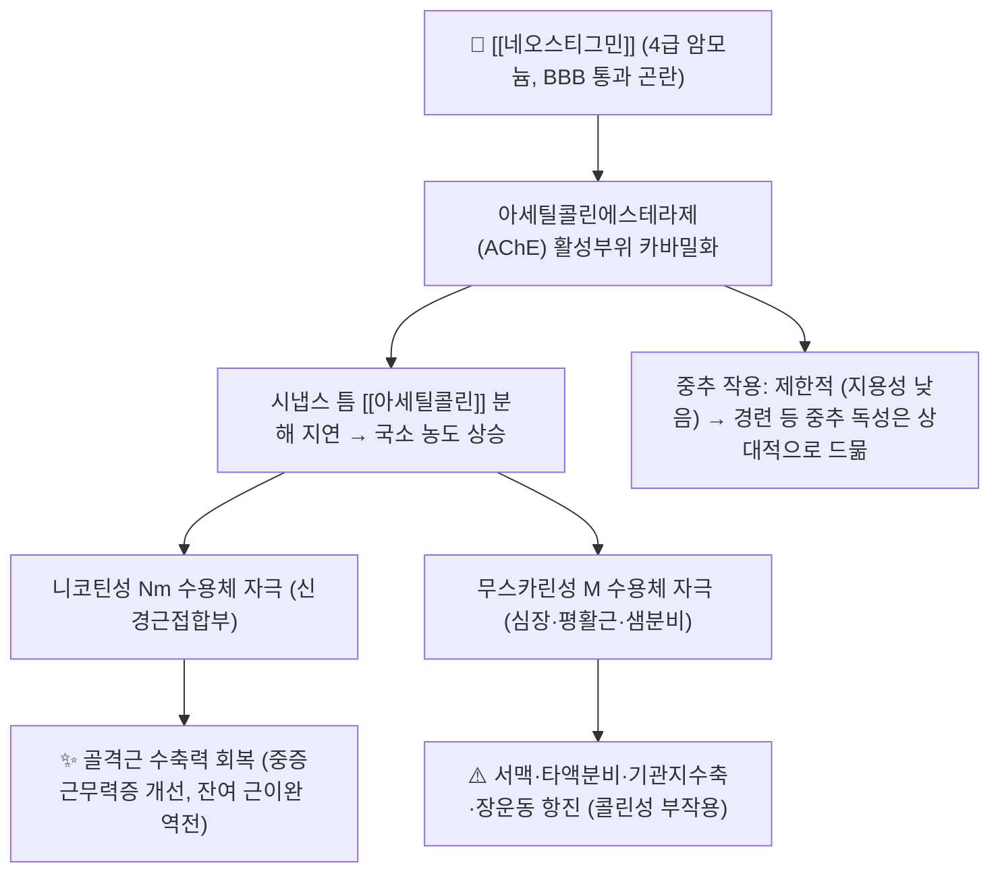

# 💊 [[네오스티그민]] (Neostigmine, Prostigmin, ATC N07AA01)

> **핵심 3줄 요약 (Key Summary)**:
> 🧪 주성분·제형: 4급 암모늄(quaternary ammonium) 구조의 **가역적 콜린에스테라제 저해제**로, 지용성이 낮아 혈액뇌장벽(BBB)을 거의 통과하지 못한다. 임상에서는 **메틸설페이트염 주사액**(0.5 mg/mL, 2.5 mg/mL 등)이 주로 사용되며, 경구용은 **브롬화 네오스티그민(15 mg 정)** 형태로 해외에서 사용되어 왔으나 국내 유통 여부는 근거 미확인이다.
> 📍 작용 기전: 아세틸콜린에스테라제(AChE)의 활성부위에 카바밀(carbamyl)기를 가역적으로 전달하여 효소를 일시적으로 불활성화 → 신경근접합부 및 자율신경절·부교감신경 말단의 **아세틸콜린(ACh) 분해를 지연**시켜 국소 ACh 농도를 상승시킨다. 니코틴성 Nm 수용체 자극으로 골격근 수축력이 회복되고, 무스카린성 M 수용체 자극으로 서맥·분비 증가·장운동 항진이 나타난다(후자가 곧 부작용의 근원).
> 🎯 임상 적응증: ① **중증근무력증(myasthenia gravis)** 증상 조절 및 (주로 수의 영역에서) 진단적 검사, ② **비탈분극성 근이완제의 잔여 차단 역전**, ③ **수술 후 급성 결장 가성폐색(Ogilvie 증후군)·장마비·요저류**.
> ⚠️ 주의사항: 용량 초과 시 **콜린성 위기(cholinergic crisis)** — 서맥, 유연(salivation), 발한, 축동, 복통·설사, 기관지 수축, 골격근 연축 후 마비. **무스카린 차단제([[아트로핀]] 또는 [[글리코피롤레이트]])를 반드시 병용 준비**해야 하며, 천식·기계적 장폐색·요로폐색·서맥성 부정맥에서는 금기 또는 극도의 주의가 필요하다.

---

## 1. 약물 기본 정보 및 시판 제품 (Brand Identification)
> [!abstract]+ 🧪 3D 약리 분자 구조 (Interactive 3D Viewer)
> <iframe src="https://molecule-viewer-rho.vercel.app/?cid=4456" width="100%" height="450px" frameborder="0" allow="webgl" style="border-radius: 8px;"></iframe>

| 항목 | 상세 정보 |
| :--- | :--- |
| **일반명 (Generic Name)** | [[네오스티그민]](한글) / Neostigmine |
| **대표 상품명 (Brand Names)** | **프로스티그민(Prostigmin)** — 해외 및 과거 대표 브랜드명. 국내에서는 **네오스티그민메틸설페이트 주사제**가 제조사별 상품명으로 유통되며, 개별 품목명은 근거 미확인. |
| **ATC 코드 / 분류** | **N07AA01** (기타 신경계용 약물 → 부교감신경 흥성제/콜린에스테라제 저해제). 국내 식약처 분류상 효능군은 **자율신경계용제(부교감신경흥성제 계열)** 로 기재되며, 세부 분류코드 번호는 근거 미확인. |
| **PubChem CID** | [4456](https://pubchem.ncbi.nlm.nih.gov/compound/4456) |
| **화학식 / 분자량** | 네오스티그민 양이온: **C₁₂H₁₉N₂O₂⁺** (MW 223.29 g/mol) / 브롬화물(C₁₂H₁₉BrN₂O₂): 303.20 g/mol / 메틸설페이트염(C₁₃H₂₂N₂O₆S): 334.39 g/mol |
| **주요 제형 및 함량** | **주사액** — 네오스티그민메틸설페이트 0.5 mg/mL(1 mL, 10 mL), 2.5 mg/mL(1 mL) 등. **정제(해외)** — 브롬화 네오스티그민 15 mg. 국내 경구제 유통 여부는 근거 미확인. |
| **식약처 허가 적응증** | 중증근무력증(증상 조절), 수술 후 장마비·복부팽만 및 요저류의 개선, 비탈분극성 근이완제(예: 튜보쿠라린) 효과의 역전. 세부 문구는 품목별 허가사항에 따르며, Ogilvie 증후군은 문헌 기반 적응증이다(PMID: 22388328, 28043313). |

### 1.1 대표 시판 제품 및 함유 복합제 매핑 (Brand Identification & Combinations)

| 구분 | 대표 제품명 / 브랜드 | 함유 성분 및 1회당 함량 | 제형 및 특징 | 주요 적응증 및 복약 지도 핵심 |
| :--- | :--- | :--- | :--- | :--- |
| **단일 주사제 (ETC)** | 프로스티그민 주 / 국내 네오스티그민메틸설페이트 주 | [[네오스티그민메틸설페이트]] 0.5~2.5 mg/앰플 | 무색 투명 주사액, IV·IM·SC 가능 | 응급·수술실·중환자실 사용 중심. **투여 즉시 서맥 발생 가능 → 심전도·혈압 모니터링 필수** |
| **경구 단일제 (해외)** | Prostigmin 정 등 | 브롬화 네오스티그민 15 mg | 속방정 | 중증근무력증 증상 조절. 흡수 변동이 커 **용량 적정이 어렵다**(국내 유통 근거 미확인) |
| **필수 병용 약물** | [[아트로핀]] 주, [[글리코피롤레이트]] 주 | 아트로핀 0.5~1 mg / 글리코피롤레이트 0.2 mg | 주사제 | 네오스티그민의 무스카린성 부작용(서맥·분비물) 차단 목적으로 **한 세트로 준비** |
| **감별 다빈도 약물** | [[피리도스티그민]] (경구 MG 치료제), [[피소스티그민]] (중추 침투형), 에드로포늄(진단용, 국내 미유통) | 각 단일 성분 | 정제 / 주사 | 같은 AChE 저해제라도 **지용성·BBB 통과 여부·작용 지속시간이 달라 적응이 갈린다** |
| **길항·상호작용 감별** | [[로쿠로늄]], [[베쿠로늄]] 등 비탈분극성 근이완제 / [[숙시닐콜린]] | - | 주사 | 비탈분극성 차단은 **역전**, 탈분극성 차단은 **연장 또는 상충** 가능 → 시간차 투여 원칙 |

---

## 2. 분자 약리 기전 및 작용 경로 (Mechanism of Action)

* **주요 작용 기전 (Primary MoA)**:
  * 네오스티그민은 **카바메이트계 가역적 AChE 저해제**다. AChE의 에스테라제 활성부위(serine 잔기)에 카바밀기를 전달하여 효소를 **카바밀-효소 중간체**로 일시적으로 점유하고, 아세틸콜린의 가수분해를 경쟁적으로 방해한다. 이 결합은 유기인계(비가역적)와 달리 수 분~수 시간 내 자연 가수분해되어 회복되므로 **작용 지속시간이 짧고 자가 회복이 가능**하다.
  * 분자 내 **4급 암모늄 양이온**이 AChE 활성부위의 음이온 소단위(anionic subsite)에 정전기적으로 결합하여 친화도를 높인다. 동일한 4급 구조 때문에 **혈액뇌장벽 통과가 매우 제한적**이어서, 중추신경계보다 말초(신경근접합부·자율신경) 효과가 우세하다. 이는 중추 항콜린성 증후군 치료에 피소스티그민이 선호되는 이유와 직결된다.
  * **신경근접합부**에서는 운동신경 말단에서 유리된 ACh의 분해가 지연되어 잔류 ACh이 Nm 수용체를 반복 자극 → 근육 수축력이 증가한다. 중증근무력증에서 자가항체로 감소된 수용체 수를 기능적으로 보상하는 것이 치료 원리이며, 비탈분극성 근이완제가 차단한 수용체에 ACh이 경쟁적으로 작용하여 **차단 역전(reversal)** 이 일어난다.
* **하류 신호전달 및 생화학적 반응**:
  * Nm 수용체 활성화 → 양이온(Na⁺, K⁺) 유입 → 종판전위(endplate potential) 증폭 → 활동전위 도달 시 근수축.
  * M₂ 수용체 활성화(심장) → Gi 단백질 경유 **cAMP 감소, K⁺ 통로 활성화** → 동방결절 자동능 저하 및 심박수 감소.
  * M₃ 수용체 활성화(평활근·외분비샘) → Gq–PLC–IP₃/Ca²⁺ 경로 → 장·방광 평활근 수축, 타액·기관지·위산 분비 증가.
  * 용량 의존적으로 나타나는 이러한 무스카린 효과는 **치료역과 독성역이 좁은 이유**이며, 임상에서는 처음부터 항무스카린제를 병용 투여하여 이 부분을 차단한다.

---

## 3. 약동학적 특성 (Pharmacokinetics: ADME)

| 약동학 파라미터 | 수치 및 임상적 의미 |
| :--- | :--- |
| **생체이용률 (Bioavailability, F)** | **경구 흡수 불규칙·매우 낮음**(한 자릿수 % 수준으로 알려져 있으나 정확한 수치는 근거 미확인. 4급 암모늄의 낮은 지용성 및 위장관 흡수 제한 때문). **IV/IM/SC 투여 시 생체이용률은 사실상 완전**에 가깝다. |
| **최고혈중농도 도달시간 (Tmax)** | IM 투여 시 약 20~30분, 경구 투여 시 1~2시간(개인차·식이 영향으로 변동 큼)으로 알려져 있으나 정밀 수치는 근거 미확인. |
| **혈장 단백결합률 (Protein Binding)** | 낮음(유의한 단백결합을 보이지 않는 것으로 기술됨). 정확한 % 수치는 근거 미확인. |
| **간 대사 효소 (Metabolism)** | 주로 **간 및 조직 에스테라제에 의한 가수분해**로 대사되며, CYP450 효소군 의존도는 낮은 것으로 기술된다. 따라서 CYP 기반 상호작용은 상대적으로 적다고 보지만, 구체적 대사 경로 규명은 근거 미확인. |
| **배설 반감기 (Elimination t1/2)** | 대략 **1~2시간** 수준으로 짧다(정확한 값 근거 미확인). **신기능 저하 시 연장**되며, 이 경우 작용 지속시간이 길어져 콜린성 독성 위험이 증가한다. |
| **주요 배설 경로 (Excretion)** | **소변 배설이 주 경로**이며 상당 부분이 미변화체로 배설되는 것으로 기술된다. 구체적 회수율(%)은 근거 미확인. 신장애 환자에서는 용량 감량이 원칙이다. |

> **임상적 함의**: 반감기가 짧고 경구 흡수가 불규칙하기 때문에 **경구제는 용량 적정이 어렵고**, 급성 상황(근이완 역전, 결장 가성폐색)에서는 **정맥 투여가 표준**이 된다. 또한 효과가 30분 내외로 빠르게 나타나고 수 시간 내 소실되므로, 필요 시 반복 투여 또는 지속 정주가 시도된다(PMID: 22388328).

---

## _의학/04_임상 용법·용량 및 처방 가이드 (Dosage & Administration)

| 임상 적응증 | 성인 표준 용법·용량 | 1일 최대 한도 용량 |
| :--- | :--- | :--- |
| **중증근무력증 (증상 조절)** | 경구 브롬화 네오스티그민 15~30 mg을 1일 3~4회(개인별 반응에 따라 적정). 급성 악화 시 주사제 0.5~2.5 mg IV/IM/SC를 1~3시간 간격으로 반복. | 경구 최대 1일 375 mg 수준으로 기술되나 **국내 허가 용량 근거 미확인** |
| **비탈분극성 근이완제 역전** | **0.03~0.07 mg/kg IV**(최대 5 mg) + [[글리코피롤레이트]] 0.2 mg(또는 [[아트로핀]] 0.02 mg/kg)을 **먼저 또는 동시에** 투여 | 통상 최대 5 mg/회 |
| **수술 후 급성 결장 가성폐색(Ogilvie 증후군)** | **2~2.5 mg IV를 1~3분에 걸쳐 천천히** 단회 투여. 3시간 내 배기·배변 반응이 없으면 1회 반복 가능 | 2.5 mg/회(반복 포함 총량 제한은 기관 프로토콜에 따름, 근거 미확인) |
| **수술 후 요저류** | 0.5 mg SC 단회 투여(반응 평가 후 반복 여부 결정) | - |
| **진단 목적 (중증근무력증, 주로 수의 영역)** | 수의 임상에서 진단적 투여 용량이 보고됨(PMID: 34324776). 인체 진단에는 통상 에드로포늄이 사용되어 왔으며 국내 유통 여부는 근거 미확인 | - |

> **투여 시 공통 원칙**
> 1. **항무스카린제 선행/동시 투여**: 네오스티그민 단독 급속 IV 투여는 심한 서맥·저혈압을 유발할 수 있으므로, 아트로핀 또는 글리코피롤레이트를 반드시 함께 준비·투여한다(글리코피롤레이트는 4급 구조로 중추 부작용이 적어 수술실에서 선호).
> 2. **천천히 정맥 투여**: 1~3분에 걸친 서서히 투여가 권장된다.
> 3. **모니터링**: 심전도, 심박수, 혈압, 호흡(기관지 분비·수축), 장음·복부 팽만 변화를 관찰한다.
> 4. **신기능 저하·고령자**: 배설 지연으로 작용이 연장되므로 **감량 및 투여 간격 연장**.

---

## 5. 부작용, 경고 및 약물 상호작용 (Adverse Effects & Interactions)

### 5.1 주요 부작용 및 독성 경고 (Black Box Warnings)
* **콜린성 위기 (Cholinergic Crisis) — 최대 위험**:
  * ACh 과잉에 의한 **무스카린성 증상**이 우세하다. 전통적 암기법 **DUMBBELS**: Diaphoresis(발한), Urination(배뇨), Miosis(축동), Bradycardia(서맥) / Bronchorrhea·Bronchospasm(기관지 분비·수축), Emesis(구토), Lacrimation(눈물), Salivation·Seizure(타액·경련). 여기에 **SLUDGE**(Salivation, Lacrimation, Urination, Diaphoresis, GI cramps, Emesis)도 함께 사용된다.
  * **니코틴성 증상**으로는 골격근 **근섬유연축(fasciculation)** 에 이어 근력 저하·마비가 나타날 수 있다. 즉 중증근무력증 환자에서 **"근무력증 위기"와 "콜린성 위기"의 감별**이 임상적으로 매우 중요하다(전자는 근력 저하 + 콜린성 증상 없음, 후자는 근력 저하 + 콜린성 증상 동반).
  * 1940년대에 이미 **네오스티그민 독성(neostigmine toxicity)** 사례가 학술지에 보고된 바 있으며(PMID: 18871862), 이는 치료역이 좁은 약물임을 시사한다.
* **호흡기계**:
  * 기관지 분비 증가 및 기관지 수축 → **천식 환자에서 급성 악화 유발** 가능. 천식은 상대적 금기.
  * 네오스티그민과 관련된 "hyperinflation(과팽창)" 사례가 학술지에 보고된 바 있으나(PMID: 29528806), 구체적 발생 기전과 임상 양상은 **근거 미확인**이며 본 노트에서는 해당 문헌의 존재만 기록한다.
* **심혈관계**: 서맥, 저혈압, 드물게 심정지. 특히 **투여 직후 30분 이내**가 위험 구간이다.
* **위장관계**: 복통, 오심, 구토, 설사, 타액 분비 과다. 수술 후 환자에서는 문합부 긴장 증가 우려가 있어 외과의와 사전 협의가 필요하다.
* **기타**: 축동, 시야 흐림, 발한, 요절박, 과민반응(발진). 4급 구조로 중추 경련은 상대적으로 드물지만 고용량에서는 가능하다.

### 5.2 주요 병용 금기 및 상호작용
* **탈분극성 근이완제([[숙시닐콜린]])**: 네오스티그민이 **가성콜린에스테라제(pseudocholinesterase)를 억제**하여 숙시닐콜린의 분해를 지연시켜 **차단 연장**을 일으킬 수 있다 → 병용·연속 투여 시 주의.
* **비탈분극성 근이완제**: 치료 목적에서는 길항(역전) 관계이지만, **효과가 소실된 시점**에 투여하면 잔여 차단 역전이 불완전하고 재강직(recurarization)이 발생할 수 있어 **정량적 근이완 감시(TOF 등)** 하에 투여한다.
* **아미노글리코시드계 항생제, 마그네슘 제제, 국소마취제, 퀴니딘·프로카인아미드 등 항부정맥제**: 신경근 전달 억제 작용이 있어 **네오스티그민의 역전 효과를 상쇄**할 수 있다.
* **베타차단제, 칼슘채널차단제, 딜티아젬·베라파밀**: 서맥·전도 억제 작용이 **중복**되어 심각한 서맥 위험.
* **코르티코스테로이드**: 중증근무력증 초기 치료에서 일시적 증상 악화가 보고되어 있어, 스테로이드 증량기에는 **모니터링 강화**가 필요하다.
* **다른 콜린에스테라제 저해제(도네페질, 리바스티그민, 유기인계 농약 등)**: 효과가 **가산**되어 콜린성 독성 위험이 커진다. 복약력 청취 시 반드시 확인.
* **항무스카린제(아트로핀, 글리코피롤레이트, 삼환계 항우울제, 항히스타민제)**: 무스카린성 효과를 감소시켜 치료 효과 일부를 약화시킬 수 있으나, 임상적으로는 **부작용 차단 목적**으로 의도적으로 병용한다.
* **금기·극도 주의 상황**: 기계적 장폐색·요로폐색, 천식, 조절되지 않는 서맥·저혈압, 최근 심근경색, 파킨슨병(진전 악화 가능), 임부(필요성 판단 하 사용 — 카테고리 C 수준으로 기술되나 **허가사항 근거 미확인**), 수유부.

---

## 6. 한의 치료 연계 및 병용/테이퍼링 프로토콜 (Integrative Medicine)

### 6.1 한약·양약 병용 투여 안전성 및 시너지 배오
* **적응증별 한의학적 대응 개념**
  * 중증근무력증은 한의학에서 **위증(痿證)**, 안검하수(眼瞼下垂)·복시·사지무력의 범주로 다루어지며, 변증상 **비기허(脾氣虛)·중기하함(中氣下陷)** 으로 접근하는 처방이 전통적으로 사용되어 왔다. 대표적으로 [[보중익기탕]](補中益氣湯) 계열과 [[황기]]·[[인삼]]·[[백출]]·[[승마]]·[[시호]] 등의 본초가 거론된다.
  * 다만 **네오스티그민과 한약의 직접적 상승/길항 작용에 대한 임상 근거는 확인되지 않았다(근거 미확인)**. 따라서 병용은 "약물 상호작용을 전제로 한 안전 관리" 관점에서 접근한다.
* **간·신 대사 간섭 완충 처방**
  * 네오스티그민은 CYP450 의존도가 낮아 한약과의 대사 효소 경합 위험은 상대적으로 작다고 보이나, **명확한 상호작용 데이터는 근거 미확인**이다. 안전 원칙으로 **1~2시간 시간차 투여**를 유지하고, 신기능 저하 환자에서는 한약·양약 모두 배설 지연 가능성을 감안하여 총량을 조정한다.
* **상승 배오 (Synergy) — 기대 가능한 접근**
  * 중증근무력증에서 **보기(補氣)·승양(升陽) 처방([[보중익기탕]])** 과 **근력 재활·침 치료**를 병행하여 환자의 기능적 근력을 끌어올리고, 그 결과 **네오스티그민(또는 피리도스티그민) 요구량을 감량**하는 전략은 임상적으로 시도될 수 있다. 개별 처방의 유효성·용량 근거는 **근거 미확인**이며, 반드시 담당 신경과와 공유해야 한다.
  * 또한 근위축·근력 저하 보조 목적으로 [[사물탕]] 계열 보혈 처방, 소화기 부담 완화 목적으로 [[향사육군자탕]] 계열이 고려될 수 있으나 **네오스티그민과의 상호작용 근거는 미확인**이다.
* **병용 시 반드시 피하거나 감량할 것**
  * **설사·장운동 항진을 유발하는 한약(대황, 망초 등 瀉下劑)**: 네오스티그민 자체가 장운동을 항진시키므로 **복통·설사·탈수 위험이 가산**된다. 특히 Ogilvie 증후군·수술 후 장마비 환자에서 한약 완하제를 병용하는 것은 이론적으로 위험하므로 피한다(직접 근거 미확인, 기전 기반 주의).
  * **항콜린 작용이 강한 본초**(만타라, 천산갑 등 일부 전통 사용 본초): 네오스티그민의 무스카린 효과를 상쇄하여 **치료 효과를 희석**할 수 있다.
  * **마황(에페드린)**: 교감신경 흥성 작용으로 심박수·혈압을 올려 네오스티그민의 서맥과 상충한다. 중증근무력증에서 에페드린 병용이 과거 논의된 바 있으나, **현대 임상에서 근거 미확인**이므로 자의적 병용은 피한다.

### 6.2 양약 감량 및 한의 전환(테이퍼링) 가이드
* **감량 프로토콜(임상 추론, 근거 미확인)**
  1. **단계 1 — 안정화**: 네오스티그민(주사 → 경구 피리도스티그민 전환 가능 시) 용량을 고정하고, 4주간 일중 증상 변동(MG-ADL 등)과 콜린성 부작용을 기록한다.
  2. **단계 2 — 한의 치료 병행**: 침 치료(사지 근력·안검하수 대상), 약침, 보기 처방([[보중익기탕]] 등)을 병행하며 **기능적 근력 지표**를 4주 단위로 재평가.
  3. **단계 3 — 미세 감량**: 기능 지표가 안정적인 경우에만 **10~20% 단위로 감량**하고, 감량 후 2주간 증상 악화(연하 곤란, 호흡 곤란, 안검하수 악화)를 집중 관찰한다.
  4. **단계 4 — 유지**: 최소 유효 용량 유지. **호흡 곤란·연하 곤란이 나타나면 즉시 감량을 중단하고 응급 평가**한다.
* **절대 원칙**
  * 중증근무력증은 **위기(myasthenic crisis)로 진행하면 생명을 위협**하므로, 양약 감량은 **신경과 전문의와의 협진 없이 한의 단독 판단으로 진행해서는 안 된다**.
  * 테이퍼링 기간에는 콜린성 위기와 근무력증 위기를 감별할 수 있도록 **증상 일지(근력, 호흡, 분비물, 복통, 심박수)** 를 환자가 직접 기록하도록 교육한다.

---

## 7. 💡 사용자 진료실 핵심 필기 & 실전 임상 체크리스트

### 7.1 진료실 3대 핵심 문진 체크리스트
1. **복용 약물 전체 목록 및 중복 여부 확인**
   * 네오스티그민 계열(피리도스티그민 포함) + 도네페질·리바스티그민 등 **다른 AChE 저해제 병용 여부**, 베타차단제·칼슘채널차단제 등 **서맥 유발 약물 병용 여부**를 반드시 확인한다.
   * 한약·건강기능식품(특히 설사·장운동 항진 목적 제품, 마황 함유 제품) 복용력도 함께 청취한다.
2. **기저 질환 및 신기능·심기능 평가**
   * 천식/COPD, 서맥성 부정맥, 기계적 장폐색·요로폐색, 신기능 저하(eGFR) 여부를 확인한다. 신기능 저하는 **작용 연장 → 콜린성 독성**으로 직결된다.
3. **증상 호전도 및 콜린성 부작용 모니터링**
   * 타액·눈물·발한 증가, 복통·설사, 시야 흐림·축동, 어지럼·실신(서맥), 근섬유연축, 호흡 곤란 여부를 매 방문 확인한다.
   * **근력 저하가 나타났을 때 "약이 부족한가(근무력증 위기) vs 과한가(콜린성 위기)"** 를 콜린성 증상 동반 여부로 감별한다.

### 7.2 환자 티칭 스크립트
> *"지금 맞으시는 네오스티그민 주사는 신경과 근육이 만나는 지점에서 신경전달물질이 너무 빨리 분해되지 않도록 막아, 근육에 힘이 다시 들어가게 돕는 약입니다. 다만 이 약은 작용이 강해서 드물게 심장이 느려지거나, 침·눈물·땀이 많아지고, 배가 아프면서 설사가 나거나, 숨이 답답해지는 증상이 생길 수 있습니다. 이런 증상이 나타나면 참지 마시고 바로 알려주십시오. 또한 감기약·진통제·소화제 등 다른 약이나 한약을 드실 때는 반드시 저에게 먼저 말씀해 주시고, 임의로 용량을 늘리거나 줄이지 마십시오. 저희 한의원에서는 침과 한약으로 근력과 체력을 함께 관리하면서, 담당 신경과 선생님과 상의하여 양약을 안전하게 조절해 나가도록 돕겠습니다."*

---

## 8. 출처 및 학술 참고 문헌 (References)

* Brunton LL, Hilal-Dandan R, Knollmann BC, eds. *Goodman & Gilman's The Pharmacological Basis of Therapeutics*. 13th ed. McGraw-Hill; 2018.
  * `[연구 요약]` 콜린에스테라제 저해제 계열의 분자 약리학(가역적 카바밀화 기전, 4급 암모늄의 BBB 통과 제한), 자율신경·신경근접합부 작용 및 임상 응용에 대한 총람. 본 노트의 기전·약동학 서술의 기본 골격으로 참조.
* 식품의약품안전처 의약품안전나라 의약품통합정보시스템 (https://nedrug.mfds.go.kr)
  * `[연구 요약]` 국내 허가 네오스티그민메틸설페이트 주사제의 품목 기준, 허가사항, 용법·용량 및 이상반응 안전성 정보 확인용. 경구제 국내 유통 여부 확인에도 사용.
* Cridge H, Little A. The clinical utility of neostigmine administration in the diagnosis of acquired myasthenia gravis. *J Vet Emerg Crit Care (San Antonio)*. 2021. **PMID: 34324776**
  * `[연구 요약]` 후천성 중증근무력증 진단 과정에서 네오스티그민 투여의 임상적 유용성을 다룬 연구(주로 동물 대상). 진단적 AChE 저해제 투여 개념의 최근 문헌 근거로 인용.
* Hamel AG, Recker MW. Neostigmine Hyperinflation. *J Pharm Pract*. 2018. **PMID: 29528806**
  * `[연구 요약]` 네오스티그민과 연관된 "hyperinflation(과팽창)" 사례를 다룬 문헌으로 확인되나, 구체적 발생 기전·임상 경과는 **근거 미확인**. 본 노트에서는 해당 보고의 존재만 기록한다.
* Elsner JL, Smith JM. Intravenous neostigmine for postoperative acute colonic pseudo-obstruction. *Ann Pharmacother*. 2012. **PMID: 22388328**
  * `[연구 요약]` 수술 후 급성 결장 가성폐색에서 정맥 내 네오스티그민 투여의 효과·용량·모니터링을 다룬 문헌. 본 노트의 Ogilvie 증후군 용법 서술 근거.
* TETHER JE. Neostigmine toxicity. *J Am Med Assoc*. 1948. **PMID: 18871862**
  * `[연구 요약]` 네오스티그민 독성(콜린성 과잉)에 관한 초기 임상 보고. 치료역이 좁은 약물이라는 역사적 근거로 인용.
* Mehndiratta MM, Pandey S. Acetylcholinesterase inhibitor treatment for myasthenia gravis. *Cochrane Database Syst Rev*. 2014. **PMID: 25310725**
  * `[연구 요약]` 중증근무력증에서 AChE 저해제 치료의 효과와 근거 수준을 평가한 코크란 리뷰. 증상 조절 목적 사용의 학술적 근거로 인용.
* Khan MW, Ghauri SK. Ogilvie's Syndrome. *J Coll Physicians Surg Pak*. 2016. **PMID: 28043313**
  * `[연구 요약]` Ogilvie 증후군(급성 결장 가성폐색)의 진단·감별 및 보존적/약물적 치료(네오스티그민 포함)를 다룬 문헌. 적응증 서술 근거로 인용.

<!-- 보관 태그(1회용·링크오류, 필요시 복원): 콜린에스테라제저해제, 신경근접합부차단역전제, 자율신경계용제, 중증근무력증치료제 -->
