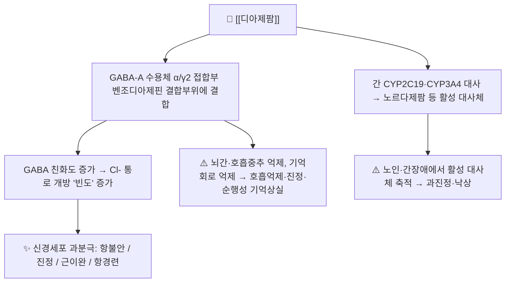

# 💊 [[디아제팜]] (Diazepam, Valium, ATC N05BA01)

![[디아제팜_낱알.jpg|540]]
> [그림 1: ① 병태생리·영상 — 디아제팜_낱알]
![[디아제팜_3_구조식.png|540]]
> [그림 2: ② 관련 해부 구조물 — Diazepam 2D 구조식 (PubChem CID 3016)]

> **핵심 3줄 요약 (Key Summary)**:
> 🧪 주성분·제형: [[디아제팜]](Diazepam, C16H13ClN2O)은 벤조디아제핀 계열의 대표적 장시간형 작용제로, 경구용 정제(2·5·10mg), 주사액(10mg/2mL), 해외에서는 직장용 겔(rectal gel) 및 좌제가 사용된다. 지용성이 높아 중추신경계로 신속히 이행하며, 간에서 활성 대사체(노르다제팜 등)로 전환되어 작용이 길게 유지된다.
> 📍 작용 기전: GABA-A 수용체의 벤조디아제핀 결합부위(α와 γ2 소단위 접합부)에 양성 알로스테릭 조절자(PAM)로 결합하여, GABA에 의한 염소이온 통로 개방 **빈도**를 증가시킨다. 그 결과 신경세포막 과분극이 심화되어 불안 완화·진정·근이완·항경련 작용이 나타난다.
> 🎯 임상 적응증: 불안 및 긴장 완화(단기), 골격근 경련·근긴장 상태, 알코올 금단 증상, 급성 경련 및 간질지속증(status epilepticus)의 급성 처치, 시술 전 진정(dental sedation) 등. 유기인계 농약 중독에서의 경련 조절 목적으로도 사용된다(Marrs, 2003, PMID 15071817).
> ⚠️ 주의사항: 호흡억제·진정·운동실조·순행성 기억장애, 노인에서의 낙상 및 인지기능 저하, 장기 사용 시 의존성과 금단 증후군. **오피오이드 및 알코올과 병용 시 호흡억제·사망 위험이 급증**하므로 병용은 원칙적으로 회피한다.

---

## 1. 약물 기본 정보 및 시판 제품 (Brand Identification)

> [그림 1: 식약처 의약품안전나라]

> [!abstract]+ 🧪 3D 약리 분자 구조 (Interactive 3D Viewer)
> <iframe src="https://molecule-viewer-rho.vercel.app/?cid=3016" width="100%" height="450px" frameborder="0" allow="webgl" style="border-radius: 8px;"></iframe>

| 항목 | 상세 정보 |
| :--- | :--- |
| **일반명 (Generic Name)** | [[디아제팜]](한글) / Diazepam (English Generic Name) |
| **대표 상품명 (Brand Names)** | **바리움정(Valium), 디아제팜정(다수의 제네릭), 디아제팜주** (※ YAML `aliases:`에 등록하여 위키링크 통합) |
| **ATC 코드 / 분류** | **N05BA01** (Anxiolytics – Benzodiazepine derivatives) / 국내 효능군 분류상 **항불안제**, 적응증에 따라 항경련제·근이완제로도 허가 (세부 식약처 분류코드는 근거 미확인) |
| **PubChem CID** | [3016](https://pubchem.ncbi.nlm.nih.gov/compound/3016) |
| **화학식 / 분자량** | C16H13ClN2O / 284.74 g/mol |
| **주요 제형 및 함량** | 정제(2mg, 5mg, 10mg), 주사액(10mg/2mL), 해외: 직장용 겔(2.5·5·10mg), 좌제, 경구용 액제 |
| **식약처 허가 적응증** | 신경증에서의 불안·긴장, 골격근 경련·경직, 알코올 금단 증상, 각종 경련(간질 포함)의 급성 처치, 마취·시술 전 진정 등 (품목별 허가사항에 따라 차이) |

### 1.1 대표 시판 제품 및 함유 복합제 매핑 (Brand Identification & Combinations)

| 구분 | 대표 제품명 / 브랜드 | 함유 성분 및 1회당 함량 | 제형 및 특징 | 주요 적응증 및 복약 지도 핵심 |
| :--- | :--- | :--- | :--- | :--- |
| **단일제 정제 (ETC)** | [[바리움정]], [[디아제팜정]] (제네릭 다수) | [[디아제팜]] 단일 성분 2mg / 5mg / 10mg | 속방정 | 불안·근긴장·금단·경련 보조, **습관성·의존성** 및 운전 금지 교육 필수 |
| **단일제 주사 (ETC)** | 디아제팜주 | [[디아제팜]] 10mg/2mL | 정맥(천천히)·근육 투여 | 급성 경련·시술 진정, **호흡억제 모니터링**, 근육주사는 흡수 불규칙 |
| **직장 투여 제형 (해외)** | Diastat 등 | [[디아제팜]] 직장용 겔 | 직장 내 겔 | 소아 열성경련 등 가정 내 응급 처치용, 국내 허가 여부는 품목별 확인 필요 |
| **복합제 (국내)** | **해당 없음** | - | - | 디아제팜은 국내 OTC 복합 진통제·종합감기약 성분으로 사용되지 않음. 즉 **일반약 성분 중복 위험은 낮으나**, 타 전문약([[알프라졸람]] 등)과의 중복 처방 감별이 핵심 |
| **감별 다빈도 약물** | [[알프라졸람]](자낙스), [[로라제팜]](아티반), [[클로나제팜]](리보트릴), [[졸피뎀]](스틸녹스) | 각 단일 성분 | 정제, 서방정 | 반감기·작용발현·적응증(불안/공황/불면/간질)이 서로 다름 → 복약력 청취 시 반드시 성분명 단위로 확인 |

> **정리 포인트**: 디아제팜은 벤조디아제핀 중에서도 **반감기가 매우 길고 활성 대사체가 축적되는 약물**이므로, 노인·간기능 저하 환자에서는 동일 성분이라도 체내 축적이 커진다(Greenblatt & Harmatz, 2020, PMID 32332456). 처방 감별 시 "어떤 벤조디아제핀을, 얼마나 오래" 복용했는지가 핵심이다.

---

## 2. 분자 약리 기전 및 작용 경로 (Mechanism of Action)

* **주요 작용 기전 (Primary MoA)**:
  * 리간드 개폐형 이온통로인 **GABA-A 수용체 복합체**의 벤조디아제핀 인식부위(α 소단위와 γ2 소단위 경계면)에 결합하는 **양성 알로스테릭 조절제(positive allosteric modulator)**이다. 내인성 억제성 신경전달물질인 GABA의 결합 친화도를 높여, GABA가 결합했을 때 염소이온(Cl⁻) 통로가 열리는 **개방 빈도(frequency)**를 증가시킨다. 통로 개방 시간이나 전도도 자체를 바꾸는 바르비투르산염과는 작용 양상이 다르다.
  * α1 소단위를 포함하는 수용체는 주로 진정·수면·기억장애와, α2/α3 소단위는 항불안·근이완과 연관되는 것으로 설명된다(소단위 선택성에 대한 세부 정량 데이터는 근거 미확인).
  * 벤조디아제핀은 **GABA가 존재하지 않으면 통로를 직접 열지 못하므로** 바르비투르산염·알코올에 비해 단독 투여 시 치사성 호흡억제 위험은 상대적으로 낮다. 그러나 고용량 정맥 투여, 오피오이드·알코올 병용 시에는 이 안전역이 크게 좁아진다.
* **하류 신호전달 및 생화학적 반응**:
  * Cl⁻ 유입 → 막전위 과분극 → 활동전위 발생 역치 상승 → 변연계(편도체·해마), 대뇌피질, 척수 및 뇌간 운동회로의 흥분성 전달 감소.
  * 척수 및 상위 운동뉴런 수준의 억제성 조절 강화 → 골격근 경련·경직 완화(근이완 작용).
  * 해마·편도체 억제 → 불안 완화, 동시에 순행성 기억상실(시술 전 진정 목적에서 오히려 활용되기도 함).
  * 말초형 벤조디아제핀 수용체(TSPO) 및 아데노신 재흡수 억제 등 부가 기전이 거론되나, 임상 효과에 대한 기여도는 **근거 미확인**.

---

## 3. 약동학적 특성 (Pharmacokinetics: ADME)

> ※ 아래 수치는 Goodman & Gilman 등 표준 약리 교과서 및 일반적 임상 문헌에 기재된 범위이며, 본 노트에 인용된 PubMed 문헌에서 직접 확인되지 않은 세부 수치는 "교과서 표준값" 또는 "근거 미확인"으로 표기하였다.

| 약동학 파라미터 | 수치 및 임상적 의미 |
| :--- | :--- |
| **생체이용률 (Bioavailability, F)** | 경구 흡수 양호(대략 90% 이상으로 기술됨, 교과서 표준값) — 음식물과 함께 투여 시 흡수 지연 가능. 근육주사는 흡수가 불규칙·지연되어 **응급 상황에서 IM 경로는 선호되지 않음** |
| **최고혈중농도 도달시간 (Tmax)** | 경구 0.5~2시간(교과서 표준값). 주사제는 정맥 투여 시 수 분 내 뇌 조직 농도가 최고조에 이르러 경련 처치에 적합 |
| **혈장 단백결합률 (Protein Binding)** | 매우 높음(대략 95% 이상, 주로 알부민 결합 — 교과서 표준값). 저알부민혈증(간경변·신증후군)에서는 유리형 약물이 증가하여 과진정 위험 상승 |
| **간 대사 효소 (Metabolism)** | CYP2C19(주요), CYP3A4, CYP1A2, CYP2B6 등에 의한 **N-탈메틸화** → 활성 대사체 **노르다제팜(N-desmethyldiazepam)** 생성, 이후 수산화를 거쳐 **테마제팜·옥사제팜**으로 전환된 뒤 글루쿠론산 포합 |
| **배설 반감기 (Elimination t1/2)** | 모약물 대략 20~50시간(성인, 교과서 표준값), 활성 대사체 노르다제팜은 그보다 더 길게 유지됨. **노인 및 간기능 저하 환자에서 반감기가 유의하게 연장**되고 약물 민감성이 증가한다(Greenblatt & Harmatz, 2020, PMID 32332456) |
| **주요 배설 경로 (Excretion)** | 대사체의 글루쿠론산 포합체 형태로 **주로 신장(소변) 배설**, 소량 담즙·분변 배설(교과서 표준값). 신기능 저하 시 대사체 축적 가능 |
| **특이사항** | 지용성이 높아 지방조직에 분포하며, 장기 투여 후 지방조직에서 서서히 유리되어 **금단 증상이 지연·장기화**될 수 있음. 혈액투석으로 제거되지 않음 |

---

## _의학/04_임상 용법·용량 및 처방 가이드 (Dosage & Administration)

> ⚠️ 아래 용량은 일반적 임상 관행 및 국내 허가사항의 통상 범위를 정리한 것으로, **적응증·연령·간기능 상태에 따라 반드시 개별화**해야 한다. 정확한 품목별 용법·용량은 식약처 의약품안전나라 허가사항을 확인할 것(세부 최대용량은 근거 미확인).

| 임상 적응증 | 성인 표준 용법·용량 | 1일 최대 한도 용량 |
| :--- | :--- | :--- |
| **불안·긴장 (신경증)** | 1회 2~5mg, 1일 3~4회 경구 (단기 사용 원칙) | 통상 1일 30mg 내외로 관리(외래 기준, 근거 미확인) |
| **골격근 경련·근긴장** | 1회 2~10mg, 1일 3~4회 경구 | 적응증별 차이, 근거 미확인 |
| **알코올 금단** | 1회 5~10mg, 1일 3~4회 경구 후 증상에 따라 점진 감량 | 기관 프로토콜별 차이, 근거 미확인 |
| **급성 경련 / 간질지속증** | 5~10mg을 정맥으로 **천천히**(대략 2~5mg/분) 투여, 필요 시 반복 — 호흡·혈압 모니터링 필수 | 총 투여량은 임상 상황·체중에 따라 결정(근거 미확인) |
| **소아 열성경련(직장 경로)** | 0.5mg/kg 직장 투여(직장용 겔 또는 주사액 직장 투여) | 단회 투여 후 재평가 원칙 |
| **노인(65세 이상)** | 성인 용량의 **1/3~1/2 수준**으로 시작, 가능한 한 단기간 | 최소 유효용량 유지가 원칙(Greenblatt & Harmatz, 2020, PMID 32332456) |
| **간장애 / 저알부민혈증** | 감량 및 투여 간격 연장, 서서히 증량 | 근거 미확인, 전문의 판단 |

**투여 시 실무 포인트**
* 정맥 투여 시 **주사속도를 반드시 천천히** 유지한다. 빠른 정맥 주입은 호흡억제·무호흡·저혈압의 주요 위험 인자이다(Sury, 2016, PMID 27145551; Nurs Times, 2004, PMID 15574038).
* 정맥 투여는 큰 정맥을 사용하고, 혈전정맥염·주사부위 통증 예방을 위해 희석 여부를 확인한다.
* 경구 요법은 **가능한 한 단기간(수 주 이내)** 사용을 원칙으로 하며, 장기 처방 시 감량 계획을 처음부터 함께 세운다(Soyka, 2017, PMID 28328330).
* 호흡곤란(breathlessness) 환자에서의 사용은 논의가 있어 왔으며, 호흡억제 위험과 이득을 함께 평가해야 한다(Lancet, 1980, PMID 6105401).

---

## 5. 부작용, 경고 및 약물 상호작용 (Adverse Effects & Interactions)

### 5.1 주요 부작용 및 독성 경고 (Black Box Warnings)
* **중추신경계 억제 (가장 흔함)**:
  * 졸음, 진정, 피로감, 어지럼, 운동실조, 근력 저하, 반응시간 지연 → **운전·기계조작 금지** 교육 필수.
  * **순행성 기억상실**(특히 시술 전 진정 목적 투여 시) 및 주의력·집중력 저하.
  * **역설적 흥분(paradoxical excitation)**: 불안 증가, 초조, 공격성, 야간 섬망 — 노인 및 소아에서 상대적으로 흔하다고 기술됨(빈도 데이터는 근거 미확인).
* **호흡억제**:
  * 정맥 고속 투여, 만성 폐쇄성 폐질환·수면무호흡증 환자, 오피오이드·알코올 병용 시 위험이 현저히 증가한다. **미국 FDA는 벤조디아제핀-오피오이드 병용에 대해 호흡억제·혼수·사망 위험을 경고하는 계열 박스 경고(Black Box Warning)를 부여**하였다(계열 수준 경고, 개별 문헌 대조 필요).
* **의존성·금단 증후군**:
  * 수 주 이상 지속 사용 시 내성·의존성이 발생할 수 있고, 갑작스러운 중단 시 반동성 불안, 불면, 초조, 떨림, 발한, 감각이상, 드물게 경련 및 섬망이 나타난다. 장시간형 약물인 디아제팜은 금단 증상 발현이 지연될 수 있다(Soyka, 2017, PMID 28328330).
* **노인 특이 위험**:
  * 반감기 연장 및 약물 민감성 증가로 과진정, 인지기능 저하, **낙상·고관절 골절** 위험이 증가한다. 노인에서는 신중 투여 또는 회피가 권고된다(Greenblatt & Harmatz, 2020, PMID 32332456).
* **알레르기 및 과민반응**:
  * 피부 발진, 두드러기, 드물게 아나필락시스. 국소 반응으로 주사부위 통증·정맥염.
* **중독 시 해독**:
  * 특이적 길항제는 **플루마제닐(flumazenil)**이나, 만성 벤조디아제핀 의존 환자에게 투여하면 급성 금단·경련을 유발할 수 있어 신중해야 한다.

### 5.2 주요 병용 금기 및 상호작용
* **반드시 회피해야 하는 병용**:
  * **알코올**: 호흡억제·과진정·기억상실 상승작용. 복약 지도 시 최우선 금기 항목.
  * **오피오이드 계열 진통제**: 호흡억제 및 사망 위험 증가(계열 박스 경고).
  * **다른 중추신경 억제제**: 수면제, 항히스타민제, 항정신병약, 마취제 등.
* **대사 기반 상호작용**:
  * **CYP2C19·CYP3A4 저해제**(오메프라졸·에소메프라졸, 케토코나졸, 이트라코나졸, 시메티딘, 플루복사민, 플루옥세틴 등) → 디아제팜 혈중농도 상승, 작용 연장.
  * **CYP 유도제**(리팜핀, 카르바마제핀, 페니토인 등) → 디아제팜 혈중농도 감소, 효과 저하.
  * **발프로산**: 단백결합 치환 및 대사 저해로 디아제팜 유리형 농도 상승 가능.
* **기타**:
  * 테오필린은 디아제팜의 진정 작용을 길항하는 것으로 보고된 바 있음(임상적 의의는 근거 미확인).
  * 중증 근무력증, 중증 호흡부전, 수면무호흡증, 폐쇄각 녹내장, 중증 간장애, 임신(특히 임신 1분기 및 만삭기), 수유부, 알코올·약물 의존 병력자에서는 금기 또는 극도의 주의가 필요하다.

---

## 6. 한의 치료 연계 및 병용/테이퍼링 프로토콜 (Integrative Medicine)

### 6.1 한약·양약 병용 투여 안전성 및 시너지 배오
* **간 대사 간섭 완충 처방**: 디아제팜은 CYP2C19·CYP3A4를 통해 대사되므로, 이들 효소에 영향을 줄 수 있는 한약재와 병용 시 **최소 1~2시간의 시간차 투여**를 원칙으로 하고, 가능하면 동일 시간대 중복 투여를 피한다. 다만 한약재-양약 상호작용 데이터는 대부분 in vitro·동물실험 수준이며 **인체 임상 근거는 제한적(근거 미확인)**임을 환자에게 설명한다.
* **간·신 대사 부담 완충**: 간기능 저하 환자에서 디아제팜의 반감기가 연장되고 활성 대사체가 축적되므로(Greenblatt & Harmatz, 2020, PMID 32332456), 간을 "보(補)"하는 처방을 병용하더라도 **디아제팜 용량은 별도로 감량**해야 한다. 한약이 디아제팜의 대사를 대신해 준다고 가정해서는 안 된다.
* **상승 배오 (Synergy) — 불안·불면 영역**:
  * [[시호가용골모려탕]], [[온담탕]], [[귀비탕]], [[천왕보심단]], [[산조인탕]] 등 안신(安神) 계열 처방은 불안·불면의 **기능성 증상 완화**를 목표로 병용할 수 있다. 목표는 "디아제팜을 대체"가 아니라 **"디아제팜을 줄일 수 있는 상태를 만드는 것"**이다.
  * 관련 본초: [[산조인]], [[복령]], [[원지]], [[용골]], [[모려]], [[백작약]], [[감초]], [[천마]], [[구기자]] 등 — 진정·안신·근이완 목적의 배오.
* **상승 배오 — 근긴장·경련 영역**:
  * [[작약감초탕]] 계열(백작약+감초) 처방은 근경련·근긴장 완화 목적으로 전통적으로 활용되어 왔으며, 디아제팜 감량 과정에서 근긴장 반동이 나타날 때 병용을 고려할 수 있다. 임상적 상승효과의 정량 근거는 **근거 미확인**.
* **침·약침 연계**:
  * 안신·진정 목적의 [[신문]](HT7), [[내관]](PC6), [[삼음교]](SP6), [[백회]](GV20), [[사신총]](EX-HN1), [[태충]](LR3), [[조해]](KI6) 등이 임상에서 활용된다. 침 치료를 통해 진정 계열 양약의 요구량을 낮추는 접근은 환자 순응도 측면에서 유용하나, **약물 자체를 임의로 중단하게 해서는 안 된다**.

### 6.2 양약 감량 및 한의 전환(테이퍼링) 가이드
* **기본 원칙**: 벤조디아제핀 의존이 형성된 환자에서 가장 효과적인 방법은 **환자별로 조정된 장기간의 점진적 감량**이며, 약물 치료 단독보다 심리·행동 치료를 병행할 때 성공률이 높다(Soyka, 2017, PMID 28328330). 급격한 중단은 금단 경련·섬망을 유발할 수 있어 금기이다.
* **디아제팜으로의 치환(switch) 후 감량**:
  * 반감기가 짧은 벤조디아제핀(예: [[알프라졸람]], [[로라제팜]] 계열)에 의존이 생긴 경우, **작용시간이 긴 디아제팜으로 등가 치환한 뒤 천천히 감량**하는 전략이 널리 사용된다(Soyka, 2017, PMID 28328330). 금단 증상 발현이 완만해져 감량이 수월해진다는 것이 그 근거이다. 구체적 등가용량 환산표 및 감량 비율은 기관·문헌별로 차이가 있어 **근거 미확인 항목으로 개별 확인**이 필요하다.
* **한의 병행 감량 프로토콜(예시)**:
  1. **평가 단계**: 복용 중인 벤조디아제핀 성분·용량·복용기간·금단 병력 확인, 불안·불면·근긴장의 한의 변증(심담허겁, 간울, 음허화왕 등) 평가.
  2. **안정화 단계**: 디아제팜 등가 치환 후 1~2주간 용량 고정, 이 기간에 한약·침 치료를 병행하여 증상 조절의 기반을 만든다.
  3. **감량 단계**: 수 주에 걸쳐 단계적으로 감량하되, 감량 후 1~2주간 반응을 관찰하며 다음 단계로 진행. 감량 폭과 간격은 환자의 금단 증상에 따라 조정하며, **구체적 % 감량 수치는 문헌별 차이(근거 미확인)**.
  4. **유지·종료 단계**: 최저 용량에서 격일 투여 등으로 이행, 한약·침을 유지 수단으로 활용.
  * ⚠️ 감량 중 **경련 병력, 알코올 병용, 호흡기 질환**이 있는 환자는 반드시 의뢰·협진 체계를 유지하고, 자가 감량을 지시하지 않는다.

---

## 7. 💡 사용자 진료실 핵심 필기 & 실전 임상 체크리스트

### 7.1 진료실 3대 핵심 문진 체크리스트
1. **복용 성분·용량·기간 확인**: "잠 잘 오는 약", "신경 안정제"라고만 듣고 온 환자가 실제로는 [[알프라졸람]]·[[로라제팜]]·[[졸피뎀]]을 복용 중인 경우가 많다. **성분명 단위로 확인**하고, 타 병원·타 과 중복 처방 여부를 반드시 청취한다. 디아제팜은 국내 OTC 복합제에 포함되지 않으므로 일반약 중복 위험은 낮지만, 전문약 중복은 흔하다.
2. **호흡·음주·오피오이드 병용 위험 청취**: 수면무호흡증, COPD, 천식 등 기저 호흡기 질환 여부와 주 3회 이상 음주 습관, 마약성 진통제 복용 여부를 확인한다. 이 세 가지가 겹치면 치명적 호흡억제 위험이 있다.
3. **노인 낙상·인지기능 및 금단 증상 모니터링**: 65세 이상에서는 과진정, 걸음의 불안정, 기억력 저하, 야간 배회 여부를 확인하고(Greenblatt & Harmatz, 2020, PMID 32332456), 감량 중에는 반동성 불안·불면·떨림·발한 등 금단 증상 발생 여부를 매 방문 기록한다.

### 7.2 환자 티칭 스크립트
> *"환자분, 지금 드시는 디아제팜은 불안과 근육 긴장을 빠르게 가라앉혀 주는 약이지만, 두 가지를 꼭 기억하셔야 합니다. 첫째, 술이나 마약성 진통제와 함께 드시면 호흡이 멈출 수 있을 만큼 위험해집니다. 둘째, 몇 주 이상 드시면 몸이 약에 적응해서 갑자기 끊었을 때 불안·불면·떨림이 오히려 심해질 수 있습니다. 그래서 저희는 끊는 게 아니라 '줄여나가는 계획'을 함께 세울 것입니다. 한약과 침 치료로 몸의 긴장과 수면을 잡아드리면서, 양약은 천천히 줄여나가겠습니다. 임의로 용량을 바꾸거나 끊지 마시고, 운전은 삼가 주세요."*

### 7.3 실전 처방·복약 지도 요약
| 상황 | 실전 대응 |
| :--- | :--- |
| 단기 불안·긴장 | 최소 유효용량, 2~4주 이내 단기 처방 + 감량 계획 사전 합의 |
| 노인 환자 | 성인 용량의 1/3~1/2로 시작, 낙상 위험 평가, 가능하면 대체 접근 우선 |
| 간기능 저하 / 저알부민혈증 | 감량·투여간격 연장, 과진정 모니터링 |
| 급성 경련 응급 | 정맥 천천히 투여, 호흡·혈압 모니터링, 재투여는 상황 판단 |
| 의존·금단 병력 | 급성 중단 금지, 디아제팜 치환 후 점진 감량 + 한약·침 병행 |

---

## 8. 출처 및 학술 참고 문헌 (References)

* Diazepam. *Nurs Times*. 2004. PMID: 15574038
  * `[연구 요약]` 디아제팜의 적응증, 작용 기전, 주요 부작용 및 간호·복약 지도 시 확인해야 할 모니터링 항목을 정리한 간호 실무 지침 성격의 문헌.
* Marrs TC. Diazepam in the treatment of organophosphorus ester pesticide poisoning. *Toxicol Rev*. 2003. PMID: 15071817
  * `[연구 요약]` 유기인계 농약 중독에서 디아제팜이 경련 조절 및 중추신경 보호 목적으로 사용되는 근거와 투여 원칙을 다룬 리뷰.
* Greenblatt DJ, Harmatz JS. Diazepam in the Elderly: Looking Back, Ahead, and at the Evidence. *J Clin Psychopharmacol*. 2020. PMID: 32332456
  * `[연구 요약]` 노인에서 디아제팜의 약동학적 변화(반감기 연장, 활성 대사체 축적)와 약력학적 민감성 증가, 낙상·인지기능 저하 위험 및 용량 조정 근거를 정리한 문헌.
* Diazepam and breathlessness. *Lancet*. 1980. PMID: 6105401
  * `[연구 요약]` 호흡곤란(breathlessness) 증상 조절에서 디아제팜 사용의 이득과 호흡억제 위험을 논의한 초기 문헌.
* Soyka M. Treatment of Benzodiazepine Dependence. *N Engl J Med*. 2017. PMID: 28328330
  * `[연구 요약]` 벤조디아제핀 의존의 치료 원칙 — 급성 중단의 위험, 장시간형 약물(디아제팜)로의 치환 후 점진적 감량, 심리·행동 치료 병용의 근거를 제시한 리뷰.
* Sury M. DIAZEPAM. *SAAD Dig*. 2016. PMID: 27145551
  * `[연구 요약]` 치과 진정 영역에서 디아제팜 사용 시의 약리 특성, 진정 깊이, 호흡 모니터링 등 임상 실무 주의사항을 다룬 문헌.
* Brunton LL, Hilal-Dandan R, Knollmann BC, eds. *Goodman & Gilman's The Pharmacological Basis of Therapeutics*. 13th ed. McGraw-Hill; 2018.
  * `[연구 요약]` 벤조디아제핀 계열의 GABA-A 수용체 분자 약리학, 약동학(ADME) 파라미터, 임상 적응증 및 금기·상호작용의 표준 근거.
* 식품의약품안전처 의약품안전나라 의약품통합정보시스템 (https://nedrug.mfds.go.kr)
  * `[연구 요약]` 국내 허가 디아제팜 제제(정제·주사제)의 품목 기준, 허가 적응증, 용법·용량 및 부작용 안전성 정보.

<!-- 보관 태그(1회용·링크오류, 필요시 복원): GABA-A -->
