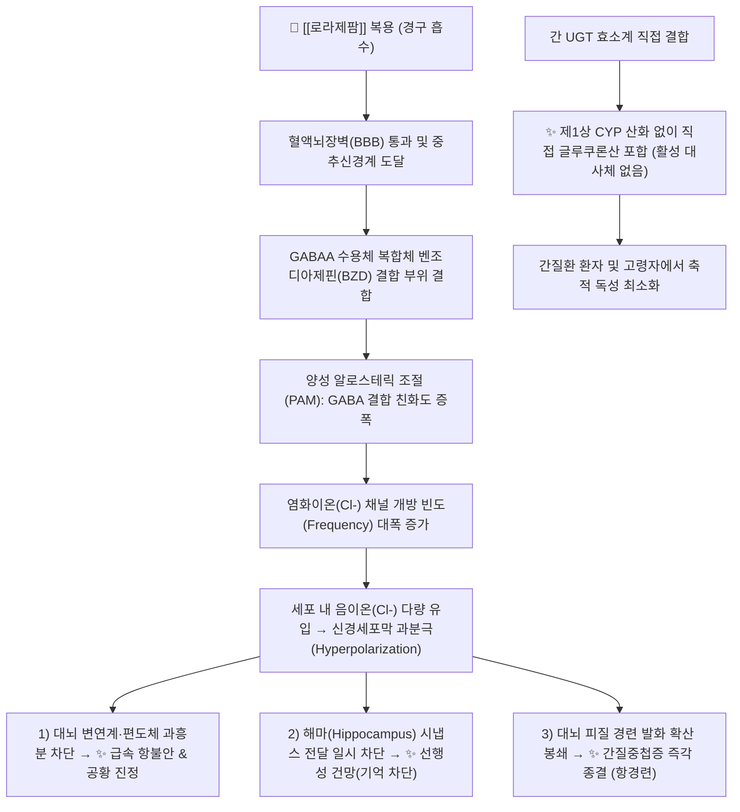

---
aliases:
  - Ativan
  - 아티반
  - 아티반정
  - Lorazepam
  - N05BA06
tags:
  - 약리/양방약
  - 정신신경계
  - 항불안제
  - 벤조디아제핀
  - 수면진정제
  - 향정신성의약품
  - 항경련제
---

# 💊 [[로라제팜]] (Lorazepam, Ativan, N05BA06)

> **핵심 3줄 요약 (Key Summary)**:
> 🧪 주성분·제형: [[로라제팜]] (Lorazepam), 3-히드록시 벤조디아제핀계 고역가 중간 작용형 항불안·진정제, 백색 원형 정제(0.5mg, 1mg) 및 주사제(2mg/mL).
> 📍 작용 기전: GABAA 수용체 알로스테릭 부위에 결합하여 염화이온 채널 개방 빈도를 촉진, 간의 CYP450 산화 대사를 거치지 않고 직접 글루쿠론산 포합(Glucuronidation)으로 배설.
> 🎯 임상 적응증: 급만성 불안장애 단기 완화, 수면장애, 수술 전 진정 및 선행성 건망 유도, 간질중첩증(Status Epilepticus) 응급 발작 종결 1차 치료제(NEJM 1998).
> ⚠️ 주의사항: 간기능 저하 환자 및 고령자에서 축적 위험이 가장 적은 안전한 벤조디아제핀(LOT 계열), 오피오이드 병용 시 호흡 억제 사망 경고, 의존성 및 선행성 건망증 주의.

---

## 📌 목차
1. [약물 기본 정보 및 시판 제품 (Brand Identification)](#1-약물-기본-정보-및-시판-제품-brand-identification)
2. [분자 약리 기전 및 작용 경로 (Mechanism of Action)](#2-분자-약리-기전-및-작용-경로-mechanism-of-action)
3. [약동학적 특성 (Pharmacokinetics: ADME)](#3-약동학적-특성-pharmacokinetics-adme)
4. [임상 용법·용량 및 처방 가이드 (Dosage & Administration)](#4-임상-용법용량-및-처방-가이드-dosage--administration)
5. [부작용, 경고 및 약물 상호작용 (Adverse Effects & Interactions)](#5-부작용-경고-및-약물-상호작용-adverse-effects--interactions)
6. [한의 치료 연계 및 병용/테이퍼링 프로토콜 (Integrative Medicine)](#6-한의-치료-연계-및-병용테이퍼링-프로토콜-integrative-medicine)
7. [💡 사용자 진료실 핵심 필기 & 실전 임상 체크리스트](#7--사용자-진료실-핵심-필기--실전-임상-체크리스트)
8. [출처 및 학술 참고 문헌 (References)](#8-출처-및-학술-참고-문헌-references)

---

## 1. 약물 기본 정보 및 시판 제품 (Brand Identification)

> [!abstract]+ 🧪 3D 약리 분자 구조 (Interactive 3D Viewer)
> <iframe src="https://molecule-viewer-rho.vercel.app/?cid=3958" width="100%" height="450px" frameborder="0" allow="webgl" style="border-radius: 8px;"></iframe>

![[로라제팜_패키지.jpg|350]]
> [그림 1] [[로라제팜]]의 대표적인 시판 완제의약품 패키지 외형

![[로라제팜_알약_블리스터.jpg|350]]
> [그림 2] 로라제팜 0.5mg 정제 성상 및 PTP 블리스터 포장

![[로라제팜_화학구조.png|300]]
> [그림 3] [[로라제팜]]의 2D 평면 화학 분자 구조식 (PubChem CID 3958)

![[로라제팜_3D구조.png|300]]
> [그림 4] [[로라제팜]]의 3차원 볼앤스틱(Ball-and-stick) 분자 모델

| 항목 | 상세 정보 |
| :--- | :--- |
| **일반명 (Generic Name)** | [[로라제팜]] / Lorazepam |
| **대표 상품명 (Brand Names)** | **아티반정 (Ativan, 일동제약 오리지널), 스리반정, 로라반정, 에티반주 등** |
| **ATC 코드 / 분류** | N05BA06 (Benzodiazepine derivatives) / 식약처 분류 117 (정신신경용제 - 향정신성의약품) |
| **PubChem CID** | [3958](https://pubchem.ncbi.nlm.nih.gov/compound/3958) |
| **화학식 / 분자량** | C15H10Cl2N2O2 / 321.2 g/mol |
| **주요 제형 및 함량** | 경구용 정제 (0.5mg, 1.0mg 백색 분할정), 주사액 (2mg/mL, 4mg/mL 앰플) |
| **식약처 허가 적응증** | 1. 일상생활의 스트레스와 연관되지 않은 불안·긴장·우울 상태의 단기 완화<br>2. 수면장애(불면증)<br>3. 마취 전 투약(수술 전 불안 완화 및 진정)<br>4. (주사제) 간질중첩증(Status Epilepticus) 등 경련 상태의 치료 |

### 1.1 대표 시판 제품 및 함유 복합제 매핑 (Brand Identification & Combinations)

| 구분 | 대표 제품명 / 브랜드 | 함유 성분 및 1회당 함량 | 제형 및 특징 | 주요 적응증 및 복약 지도 핵심 |
| :--- | :--- | :--- | :--- | :--- |
| **오리지널 단일제 (표준)** | [[아티반]] 0.5mg | [[로라제팜]] 단일 (0.5mg) | 백색 원형 분할정 | 외래 처방 다빈도 상용 용량, 고령자 불안 및 불면 완화 |
| **오리지널 단일제 (고용량)** | [[아티반]] 1.0mg | [[로라제팜]] 단일 (1.0mg) | 백색 원형 분할정 | 중등도 이상 급성 불안 및 취침 전 불면증, 낙상 주의 |
| **응급 주사제** | [[아티반주]] (2mg/mL) | [[로라제팜]] (2mg/mL) | 앰플 주사액 | 응급실 간질중첩증 발작 종결 1차 정맥주사, 중환자실 진정 |
| **국내 제네릭 정제** | [[스리반]], 로라반 | [[로라제팜]] 단일 (0.5mg/1mg) | 정제 | 오리지널 동등 생물학적 동등성 확보 제네릭 제제 |

---

## 2. 분자 약리 기전 및 작용 경로 (Mechanism of Action)



* **GABA-A 수용체 염화이온 통로 촉진 (Primary MoA)**:
  * 중추신경계의 주된 억제성 수용체인 **$\text{GABA}_A$ 수용체**의 $\alpha$ 서브유닛과 $\gamma_2$ 서브유닛 사이 접합부에 존재하는 벤조디아제핀 수용체에 높은 친화력으로 결합합니다.
  * 내인성 GABA의 결합력을 비약적으로 증가시키는 양성 알로스테릭 조절제(PAM)로서, 염화이온($\text{Cl}^-$) 통로의 **개방 빈도(Opening frequency)**를 높입니다.
  * 음이온 유입에 따른 신경세포막 **과분극(Hyperpolarization)**을 유도하여, 대뇌 변연계(불안 억제), 뇌간 망상체(진정·수면 유도), 대뇌 피질(항경련)의 신경 흥분을 광범위하게 억제합니다.
* **강력한 선행성 건망증(Anterograde Amnesia) 유발 특성**:
  * 해마(Hippocampus) 부위의 $\text{GABA}_A$ 수용체를 강력하게 진정시켜 약물 투여 직후부터 약효 지속 시간 동안의 새로운 단기 기억 저장을 차단합니다.
  * 과거의 기억(역행성 기억)은 보존되나 투약 후의 기억만 사라지므로, 위내시경, 기관지경 검사 및 전신마취 수술 전 투약(Premedication) 시 환자의 불쾌한 시술 기억과 수술실 공포를 완벽히 지워주는 용도로 널리 활용됩니다.
* **독보적인 LOT 대사 특성 (간 CYP450 비의존적 직접 글루쿠론산 포합)**:
  * 디아제팜, 클로나제팜 등 대다수 BZD는 간의 CYP3A4, CYP2C19 등 제1상 산화 대사를 거치며 활성 대사체(데스메틸디아제팜 등)를 만들어 반감기가 수십~수백 시간으로 늘어납니다.
  * 그러나 로라제팜은 3번 탄소에 이미 수산기(-OH)를 가지고 있는 **3-히드록시 벤조디아제핀** 구조로, 간의 CYP 산화 과정을 건너뛰고 제2상 효소인 **UGT(UGT2B7, UGT2B15)**에 의해 **직접 글루쿠론산 포합(Glucuronidation)**되어 즉시 불활성화됩니다.
  * **활성 대사체가 전혀 생성되지 않으므로**, 간경변, 만성 간염, 노화로 인해 간 마이크로솜 산화 효소 활성이 떨어진 환자에서도 약물이 체내에 이상 축적되지 않는 **가장 안전한 벤조디아제핀(LOT 계열: Lorazepam, Oxazepam, Temazepam)**으로 꼽힙니다.

---

## 3. 약동학적 특성 (Pharmacokinetics: ADME)

| 약동학 파라미터 | 수치 및 임상적 의미 |
| :--- | :--- |
| **생체이용률 (Bioavailability, F)** | 약 90% (경구 및 설하 투여 시 위장관에서 신속하고 완전하게 흡수) |
| **최고혈중농도 도달시간 (Tmax)** | 경구 정제: 약 2시간, 설하정: 30~60분, 근육주사: 60~90분, 정맥주사: 15~30분 |
| **혈장 단백결합률 (Protein Binding)** | 85~90% (주로 혈청 알부민에 결합, 유리형 분율 10~15%) |
| **간 대사 효소 (Metabolism)** | **CYP 산화 대사 없음**. 제2상 **UGT2B7, UGT2B15**에 의해 직접 비활성 글루쿠로나이드로 포합 |
| **배설 반감기 (Elimination t1/2)** | **평균 10~20시간 (약 12~14시간)**, 간질환이나 노화에 의해서도 크게 연장되지 않음 |
| **주요 배설 경로 (Excretion)** | 소변 배설 약 88% (로라제팜-글루쿠로나이드 형태), 분변 배설 약 7% |

---

## 4. 임상 용법·용량 및 처방 가이드 (Dosage & Administration)

| 임상 적응증 | 성인 표준 용법·용량 | 1일 최대 한도 용량 | 임상 복약 지도 핵심 |
| :--- | :--- | :--- | :--- |
| **불안장애 / 긴장 완화** | 1일 1~4mg을 2~3회 분할 경구 투여 (시작: 1회 0.5~1mg) | 최대 10mg/day | 가능한 최단기간(2~4주) 투약 원칙, 취침 전 증량 |
| **수면장애 (불면증)** | 취침 전 1~2mg 단회 경구 복용 | 4mg/day | 복용 후 즉시 잠자리에 들 것 (선행성 건망증 주의) |
| **고령자 / 쇠약 환자** | 1일 1~2mg을 분할 투여 (1회 0.5mg 저용량 시작) | 감량 투여 | 낙상, 보행 장애, 과도한 주간 졸림 모니터링 |
| **간질중첩증 (Status Epilepticus)** | 정맥주사: 4mg을 분당 2mg 속도로 서서히 IV 투여 | 10~15분 후 4mg 1회 추가 가능 | 호흡 억제 및 기도 확보 준비 하에 응급 투여 |

### 4.1 진료과별 다빈도 처방 패턴 (Sweet Spot vs 금기)
* **[✅ 최적 적응증 (Sweet Spot)]**:
  * **간질환(간경변, 만성 간염, 지방간) 환자의 불안·불면**: CYP 산화 경로가 파괴된 간질환자에게 유일하게 안전하게 처방 가능한 BZD.
  * **노인성 섬망 및 급성 흥분 환자**: 활성 대사체 축적이 없어 다음 날 숙취(Hangover) 효과가 적음.
  * **신경과 응급실 간질중첩증 발작 종결**: 뇌 조직 내 지속 시간이 디아제팜보다 길어 재발작 억제에 우월 (Treiman 1998 연구 근거).
* **[⚠️ 신중 투여 및 금기 (Caution / Contraindication)]**:
  * **중증 호흡부전 및 수면무호흡증 환자**: 중추성 호흡 억제로 인한 이산화탄소 저류 위험.
  * **중증 근무력증 환자**: 근이완 작용으로 호흡근 무력화 위험.
  * **급성 폐쇄각 녹내장 환자**: 안압 상승 유발 위험.

---

## 5. 부작용, 경고 및 약물 상호작용 (Adverse Effects & Interactions)

### 5.1 주요 부작용 및 독성 경고 (Black Box Warnings)

```
[🚨 FDA 블랙박스 경고 1: 마약성 진통제(오피오이드)와의 병용 시 호흡 억제 사망]
• 로라제팜을 마약성 진통제(트라마돌, 코데인, 모르핀 등)와 병용할 경우 상가적 중추 호흡 억제로 치명적 호흡부전, 혼수, 사망 초래.

[🚨 FDA 블랙박스 경고 2: 남용, 오용 및 신체적 의존성 (Abuse, Misuse, Addiction)]
• 향정신성의약품으로 연용 시 내성과 신체적 의존성이 빠르게 형성됨.

[🚨 FDA 블랙박스 경고 3: 급단 시 치명적 금단 발작 (Withdrawal Seizures)]
• 장기 투약 후 갑작스러운 중단 시 반동성 불안, 불면, 진전, 환각, 섬망 및 치명적인 전신 간질 발작 발생.
```

* **흔한 이상반응**:
  * 주간 진정(졸림), 어지러움, 피로, 운동실조(비틀거림), 근육 쇠약, 구갈.
* **선행성 건망증 (Anterograde Amnesia)**:
  * 약물을 복용한 후 잠들기 전까지 했던 행동(전화 통화, 음식 섭취 등)을 다음 날 전혀 기억하지 못하는 일과성 기억상실 호발.
* **특이 해독제 (Reversal Agent)**:
  * **플루마제닐 (Flumazenil, 아넥세이트)**: 벤조디아제핀 수용체 경쟁적 길항제 (정맥 투여로 로라제팜 과다복용 독성 신속 역전).

### 5.2 주요 병용 금기 및 상호작용

| 병용 약물 / 성분군 | 상호작용 기전 | 임상적 결과 및 대처 방안 |
| :--- | :--- | :--- |
| **발프로산 (Valproate, 데파코트)** | 간 UGT2B7 효소 글루쿠론산 포합 경쟁적 억제 | 로라제팜 혈장 청소율 40% 저하 $\rightarrow$ **혈중 농도 2배 급증으로 과도 진정/혼수 위험 (로라제팜 50% 감량 필수)** |
| **프로베네시드 (Probenecid, 통풍약)** | UGT 효소 억제 및 세뇨관 배설 저해 | 로라제팜 반감기 대폭 연장 및 약효 과다 발현 (병용 시 용량 50% 감량) |
| **알코올 (술)** | 중추성 GABAA 억제 작용 중복 시너지 | 뇌간 호흡중추 마비 $\rightarrow$ **급사(사망) 위험으로 복용 기간 절대 금주** |
| **오피오이드 진통제** | [[트라마돌]], 펜타닐, 옥시코돈 | 호흡중추 억제 시너지 $\rightarrow$ 혼수 및 호흡 정지 |

---

## 6. 한의 치료 연계 및 병용/테이퍼링 프로토콜 (Integrative Medicine)

### 6.1 한의학적 병전(病轉) 변증 및 시너지 배오
* **심신불교(心腎不交)형 중증 불면증**:
  * 밤에 눈이 말똥말똥하여 전혀 잠들지 못함, 가슴 두근거림, 이명, 어지러움, 손발바닥 열감, 설홍소태(舌紅少苔).
  * **추천 처방**: [[황련아교탕]], [[교태환]], [[천왕보심단]].
  * **배오 원리**: [[황련]](청심사화)으로 뇌신경의 열을 끄고, [[아교]], [[생지황]], [[백작약]](자음양혈)으로 진액을 공급하여 로라제팜 복용으로 인한 구갈과 신경 건조를 치료.
* **담화요심(痰火擾心) & 화병(火病)형 불안·불면**:
  * 가슴이 답답하여 터질 것 같음, 한숨, 분노, 악몽, 두통, 설태황니(舌苔黃膩).
  * **추천 처방**: [[시호가용골모려탕]], [[온담탕]], [[황련해독탕]].
  * **배오 원리**: [[용골]], [[모려]]의 중진안신(重鎭安神) 작용으로 과흥분된 뇌파를 가라앉히고, [[죽여]], [[지실]]로 가슴에 맺힌 담음을 소산.
* **심비양허(心脾兩虛)형 쇠약성 불안**:
  * 만성적인 피로, 소화불량, 식욕 부진, 꿈이 많음, 잘 놀람.
  * **추천 처방**: [[귀비탕]], [[가미귀비탕]].

### 6.2 침구 치료 연계 (안면혈 및 자율신경 조절)
* **주요 치료 혈위**: 안면(安眠 - 예풍과 풍지 중간), 신문(神門), 백회(百會), 인당(印堂), 내관(內關), 삼음교(三陰交).
* **신경생물학적 기전**: 안면혈 및 인당혈 자침은 뇌간 망상체와 멜라토닌 분비 경로를 자극하여 깊은 서파 수면(Slow-wave sleep)을 유도하며, 아티반에 대한 수면 의존도를 낮춥니다.

### 6.3 💡 로라제팜 테이퍼링(감량) 임상 프로토콜
* **미세 단계적 감량 수칙**:
  1. 1일 1mg 복용 환자의 경우, 2~4주 간격으로 **0.25mg(0.5mg 정제의 반 알) 단위**로 극도로 천천히 감량합니다.
  2. 낮 시간대 복용량을 먼저 줄이고, 취침 전 복용량은 가장 마지막 단계에서 테이퍼링합니다.
  3. 감량 중간에 반동성 불면이 발생할 경우 약을 다시 올리지 말고, [[산조인탕]] 또는 [[황련아교탕]] 탕약을 취침 1시간 전 집중 복용시켜 신경계를 완충합니다.

---

## 7. 💡 사용자 진료실 핵심 필기 & 실전 임상 체크리스트

### 7.1 진료실 3대 핵심 문진 체크리스트
1. **"잠이 안 와서 아티반을 드시고 난 뒤, 밤에 있었던 일이나 통화한 내용을 다음 날 기억 못 하신 적이 있나요?"**:
   * 선행성 건망증(Amnesia) 부작용 여부를 확인하여, 반드시 잠자리에 눕기 직전에 복용하고 약을 먹은 채 다른 활동을 하지 않도록 지도.
2. **"간 질환(간염, 간경화)이나 연세가 많으신데, 하루에 아티반을 몇 알 드시나요?"**:
   * 로라제팜은 간 CYP 산화 대사를 타지 않아 간환자·고령자에게 상대적으로 안전하지만, 고령자에서는 근이완 작용으로 인한 낙상 위험이 여전히 높으므로 보행 상태 점검.
3. **"발프로산(데파코트, 뇌전증/조울증약)이나 통풍약(프로베네시드)을 함께 드시고 계신가요?"**:
   * 발프로산 병용 시 로라제팜 대사가 막혀 약효가 2배로 폭증하므로 즉각적인 처방 용량 확인 필요.

### 7.2 환자 티칭 스크립트
> *"환자분, 지금 복용하시는 아티반(로라제팜)은 불안하거나 잠이 안 올 때 뇌 신경의 흥분을 가라앉혀 주는 약입니다. 다른 신경안정제들에 비해 간에서 복잡한 대사를 거치지 않고 바로 배설되기 때문에, 간이 약하시거나 연세가 있으신 분들께 비교적 안전하게 처방되는 좋은 약입니다. 하지만 이 약을 드시고 바로 주무시지 않으면 방금 전 일어난 일을 까맣게 잊어버리는 건망증이 생길 수 있으므로, 반드시 이불 속에 들어가기 직전에 드셔야 합니다. 또한 오래 드시다 갑자기 끊으시면 불면증과 불안이 몇 배로 심하게 튀어 오를 수 있습니다. 저희 한의원의 침 치료와 산조인·황련 한약으로 뇌 신경을 스스로 편안하게 잠들 수 있는 상태로 만들면서, 양약은 아주 조금씩 부드럽게 줄여나가실 수 있도록 도와드리겠습니다."*

---

## 8. 출처 및 학술 참고 문헌 (References)

1. **식품의약품안전처 (MFDS)**. *의약품 품목허가사항 및 마약류 안전관리 정보: 로라제팜 단일제 (아티반정)*.
   - [의약품안전나라 품목정보](https://nedrug.mfds.go.kr)
   - `[연구 요약]` 로라제팜의 불안장애 및 불면증 허가 적응증, 오피오이드 병용 호흡마비 블랙박스 경고, 의존성 및 선행성 건망증 주의사항 공식 라벨.
2. **Treiman, D. M. et al. (Veterans Affairs Status Epilepticus Cooperative Study Group) (1998)**. *A comparison of four treatments for generalized convulsive status epilepticus*. **New England Journal of Medicine**, 339(12), 792-798.
   - [PubMed (PMID: 9738086)](https://pubmed.ncbi.nlm.nih.gov/9738086/) | [DOI](https://doi.org/10.1056/NEJM199809173391202)
   - `[연구 요약]` 간질중첩증 환자 570명을 대상으로 4개 치료군(로라제팜, 페노바르비탈, 디아제팜+페니토인, 페니토인 단독)을 전향적 비교한 랜드마크 3상 RCT: 로라제팜 정맥주사가 64.9%의 가장 높은 성공률로 경련 발작을 즉각 종결시켜 전 세계 간질중첩증 1차 응급 표준 치료제로 확립.
3. **Greenblatt, D. J. et al. (1978)**. *Clinical pharmacokinetics of lorazepam: a review*. **Journal of Clinical Psychiatry**, 39(10 Pt 2), 11-16.
   - [PubMed (PMID: 30762)](https://pubmed.ncbi.nlm.nih.gov/30762/)
   - `[연구 요약]` 로라제팜의 체내 약동학 총설: 간의 제1상 시토크롬 P450 산화 대사를 거치지 않고 직접 제2상 글루쿠론산 포합을 통해 비활성화되며 활성 대사체가 없음을 규명하여, 간장애 및 고령 환자에서의 독보적 안전역 입증.
4. **Ashton, H. (2005)**. *The diagnosis and management of benzodiazepine dependence*. **Current Opinion in Psychiatry**, 18(3), 249-255.
   - [PubMed (PMID: 16639148)](https://pubmed.ncbi.nlm.nih.gov/16639148/) | [DOI](https://doi.org/10.1097/01.yco.0000165594.60434.84)
   - `[연구 요약]` 벤조디아제핀 장기 복용 환자의 신체적 의존성 진단 및 금단 발작을 방지하기 위한 점진적 테이퍼링 임상 지침.
