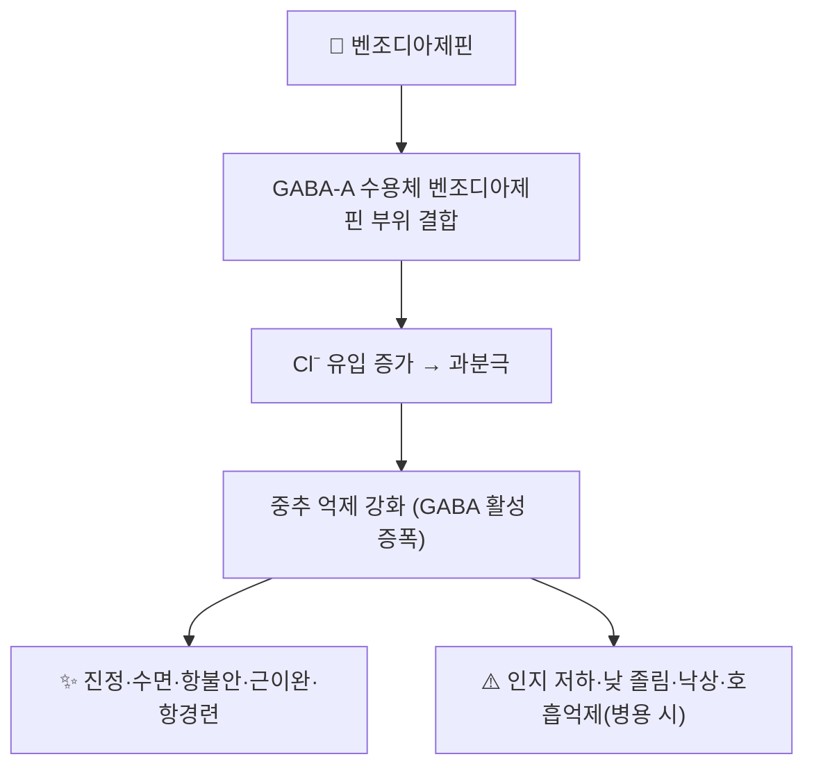

# 💊 벤조디아제핀 (Benzodiazepine, BZD)

> **핵심 요약 (Key Summary)**:
> 🧪 **주성분·제형**: 1,4-벤조디아제핀 모핵을 가진 계열 약물. 대표 성분 [[디아제팜]](CID 3016)을 비롯해 [[알프라졸람]]·[[로라제팜]]·[[클로나제팜]]·[[클로바잠]]·[[트리아졸람]]·[[에티졸람]] 등이 정제로 시판된다.
> 📍 **작용 기전**: GABA-A 수용체의 벤조디아제핀 결합부위에 결합해 **억제성 신경전달을 강화**한다 — 각성을 낮추고 진정·수면·항불안·근이완·항경련을 유도한다.
> 🎯 **임상 적응증**: 단기 불면, 불안장애, 항경련 보조, 근이완, 시술 전 진정. 만성 불면의 **1차 치료가 아니며**, 표준은 [[인지행동치료(CBT-I)]]다.
> ⚠️ **주의사항**: 내성·의존·금단(반동성 불면·경련), 낮 졸림, 인지 저하, **노인 낙상·골절 위험 증가** — 장기 복용자는 갑자기 끊지 않고 단계적 감량한다.

---

## 1. 약물 기본 정보 및 시판 제품 (Brand Identification)

![[벤조디아제핀_01_디아제팜_패키지_실사.jpg|300]]
> [그림 1: 대표 성분 디아제팜의 시판 완제의약품 패키지(Relanium 2 mg, GSK) — Wikimedia Commons, CC BY 4.0]

![[벤조디아제핀_02_디아제팜정_블리스터_실사.jpg|300]]
> [그림 2: 디아제팜 5 mg 정제의 PTP 블리스터 포장 성상 — Wikimedia Commons, Public domain]

![[벤조디아제핀_03_디아제팜_2D구조식.png|300]]
> [그림 3: 디아제팜의 2D 평면 화학 분자 구조식 — 1,4-벤조디아제핀 모핵에 페닐·염소·N-메틸·카보닐이 붙은 구조. PubChem CID 3016 (구조식 정본: PubChem PNG API)]

| 항목 | 상세 정보 |
| :--- | :--- |
| **계열명** | Benzodiazepines (BZD), ATC N05BA/N05CD, 식약처 분류 '신경계용 약물/최면진정제·항불안제' |
| **대표 성분** | [[디아제팜]] (PubChem CID [3016](https://pubchem.ncbi.nlm.nih.gov/compound/3016)) · [[알프라졸람]] · [[로라제팜]] · [[클로나제팜]] · [[클로바잠]] · [[트리아졸람]] · [[에티졸람]] |
| **근사 계열** | Z-드러그(non-BZD) — [[졸피뎀]] · [[에스조피클론]] · [[조테핀]] — GABA-A α1 선호, 내성·의존은 유사 |
| **주요 제형** | 정제·서방정, 주사액(디아제팜·미다졸람), 구강붕해정 등 |

### 1.1 대표 시판 제품 매핑

| 구분 | 대표 성분 / 브랜드 | 제형 및 특징 | 복약 지도 핵심 |
| :--- | :--- | :--- | :--- |
| 장시간형 | [[디아제팜]] (바륨·디아정) | 정제·주사액, 반감기 길고 활성대사체 | 주간 잔류 진정, 노인 낙상 |
| 중간형 | [[알프라졸람]] (자낙스·카소단) | 정제, 항불안·공황 | 의존 위험 높음, 단기 사용 |
| 중간형 | [[로라제팜]] (아티반·로라반) | 정제·주사액 | 간대사 부담 적음, 병원 사용 |
| 장시간형 | [[클로나제팜]] (리보트릴) | 정제, 항경련·공황 | 공황장애 장기 사용, 금단 주의 |
| 단시간형 | [[트리아졸람]] (할시온) | 정제, 수면 유도 | 반동성 불면·기억장애 |
| 초단시간형 | [[에티졸람]] | 정제, 불면 유도 | 의존·금단 빠름 |

---

## 2. 분자 약리 기전 및 작용 경로 (Mechanism of Action)

* **작용 기전**: GABA는 억제성 신경전달물질이다. BZD는 GABA-A 수용체의 별도 부위에 결합해 GABA 친화도를 높여 **억제 기능을 증폭**한다(직접 개방은 아니다 — 이 점이 바르비투르산염과의 차이이며, 바르비투르산염보다 호흡억제 위험이 상대적으로 낮은 이유다)
* **α 소단위 선호**: α1 → 진정·수면, α2/α3 → 항불안·근이완, α5 → 인지·기억. Z-드러그는 α1 선호가 상대적으로 강하다

---

## 3. 약동학적 특성 (Pharmacokinetics)

| 파라미터 | 임상적 의미 |
| :--- | :--- |
| **생체이용률 (F)** | 경구 흡수 양호, 디아제팜은 초회통과 변동이 크다 |
| **Tmax** | 성분별로 다름(디아제팜 경구 0.5~2시간) |
| **단백결합률** | 대개 80~95% (알부민 결합) |
| **간대사** | CYP3A4·CYP2C19 등(성분별 상이) — [[CYP3A4]] 저해제·유도제와 상호작용 |
| **반감기 (t1/2)** | 장시간형(디아제팜·클로나제팜) vs 단시간형(트리아졸람·에티졸람) — **노인은 반감기가 연장**된다 |
| **배설** | 대사산물 주로 신장 배설 |

---

## 4. 용법·용량 및 처방 가이드

| 임상 적응증 | 성인 표준 접근 | 주의 |
| :--- | :--- | :--- |
| **단기 불면** | 최소 용량, **2~4주 이내** 단기간 | 만성 불면의 1차 치료는 [[인지행동치료(CBT-I)]] |
| **불안·공황** | 단기~중기, 정기 재평가 | 의존·내성, 정신건강의학과 협진 |
| **항경련 보조** | [[클로나제팜]]·[[디아제팜]] 정맥 | 호흡·순환 감시 |
| **근이완·시술 전 진정** | [[미다졸람]]·[[디아제팜]] | 호흡억제 모니터링 |

> 실제 처방은 **식약처 허가사항(의약품안전나라)** 의 적응증·용량·기간을 확인하고, 1일 최대 용량을 엄수한다.

---

## 5. 부작용, 경고 및 약물 상호작용

### 5.1 주요 부작용
* 낮 졸림, 어지럼, 운동실조, 기억·집중 저하, 낙상·[[골절]]
* 역설적 반응(흥분·초조) — 노인·소아·치매 환자에서 주의
* 호흡억제 — 다른 중추억제제(오피오이드·알코올)와 병용 시 급격히 악화

### 5.2 내성·의존·금단 (핵심)
* **내성**: 수면 유도 효과는 수주 내 감소(수면 구조 이득도 제한적)
* **의존·금단**: 장기 복용 후 급단 시 **반동성 불면**·불안·경련 위험 → 반드시 **단계적 감량(테이퍼링)**
* **위험군**: 노인, 호흡기 질환, 알코올 사용장애, 간기능 저하

### 5.3 주요 상호작용
* 오피오이드·알코올·항히스타민제·기타 진정제와 **중복 금지**
* [[CYP3A4]] 저해제(일부 항진균·항생제)와 병용 시 혈중농도 상승

---

## 6. 한의 치료 연계 및 병용/테이퍼링 프로토콜

### 6.1 병용 안전성
* 침·한약과 병용 시 **진정 중복**을 감시한다. 낮 졸림·어지럼이 심하면 한약(안신 처방) 용량보다 먼저 양약 감량 시점을 상담한다

### 6.2 감량(테이퍼링) 프로토콜
* **원칙 1 — 급단 금지**: 반동성 불면·경련을 피해 서서히 줄인다
* **원칙 2 — 대체 근거를 함께 제시**: 만성 불면에서 [[인지행동치료(CBT-I)]]를 병행하면 감량 과정의 불면 반동을 관리할 수 있다(만성질환자에서 불면 중증도 g=0.98 개선)
* **원칙 3 — 노인 안전 세트**: 감량기에는 야간 조명·보행 보조·[[낙상 효능감]] 점검을 함께 한다
* **실무 예**: 한약([[산조인탕]]·[[귀비탕]])·침 치료를 병행하며 최소 4~8주에 걸쳐 단계적으로 감량한다(진행은 처방의와 상의)

---

## 7. 💡 진료실 핵심 필기 & 실전 임상 체크리스트

### 7.1 진료실 3대 문진 체크리스트
1. **복용 기간·성분·용량**: 졸피뎀(스틸녹스)·[[알프라졸람]](자나팜·카소단)·[[디아제팜]] 등 구체 명칭과 기간을 확인한다
2. **금단 이력**: 임의 중단 시 반동성 불면·불안·경련이 있었는지 확인한다
3. **낙상·인지**: 야간 배뇨 동선, 낮 졸림, 기억 저하를 확인한다 → [[낙상 효능감]]

### 7.2 환자 티칭 스크립트
> *"이 약은 잠을 빨리 들게 해 주지만, 오래 쓰면 같은 용량으로는 효과가 줄고 끊을 때 잠이 더 안 오는 반동이 생깁니다. 갑자기 끊지 마시고, 잠드는 습관을 다시 만드는 치료(인지행동치료)와 함께 서서히 줄여 나가겠습니다."*

---

## 8. 출처 및 학술 참고 문헌

1. **JAMA Internal Medicine (2025)**. *Cognitive Behavioral Therapy for Insomnia in People With Chronic Disease: A Systematic Review and Meta-Analysis*. **JAMA Intern Med**, 185(11):1350-1361. [PMID 40982264](https://pubmed.ncbi.nlm.nih.gov/40982264/)
   - **[연구 요약]**: 만성질환자에서 CBT-I가 불면 중증도 g=0.98 개선 — 수면제 감량·대체의 근거가 된다.
2. **Edinger JD, et al. (2021)**. *Behavioral and psychological treatments for chronic insomnia disorder in adults: AASM clinical practice guideline*. **J Clin Sleep Med**, 17(2):255-262. [PMID 33164742](https://pubmed.ncbi.nlm.nih.gov/33164742/)
   - **[연구 요약]**: 만성 불면의 1차 치료는 다성분 CBT-I이며, 약물 단독 장기 사용은 권고되지 않는다.
3. **식품의약품안전처 의약품안전나라** — [nedrug.mfds.go.kr](https://nedrug.mfds.go.kr)
   - **[연구 요약]**: 국내 허가 의약품의 허가사항·용법용량·부작용 정보(성분별 확인 필수).
4. **이미지 출처** — 디아제팜 패키지: [Diazepamum (box) (Wikimedia Commons)](https://commons.wikimedia.org/wiki/File:Diazepamum_(box).jpg) CC BY 4.0 · 블리스터: [Diazepam5mgBlisterPack14 (Wikimedia Commons)](https://commons.wikimedia.org/wiki/File:Diazepam5mgBlisterPack14.JPG) Public domain · 구조식: PubChem CID [3016](https://pubchem.ncbi.nlm.nih.gov/compound/3016)

---

## 함께 보기
- [[디아제팜]] · [[알프라졸람]] · [[로라제팜]] · [[클로나제팜]] · [[트리아졸람]] · [[졸피뎀]] · [[에스조피클론]] · [[미다졸람]] · [[GABA]] · [[CYP3A4]] · [[불면증]] · [[인지행동치료(CBT-I)]] · [[자극조절]] · [[각성(Hyperarousal)]] · [[낙상 효능감]] · [[산조인탕]] · [[귀비탕]] · [[2026-10-03_대사노인질환_심층리뷰]]
